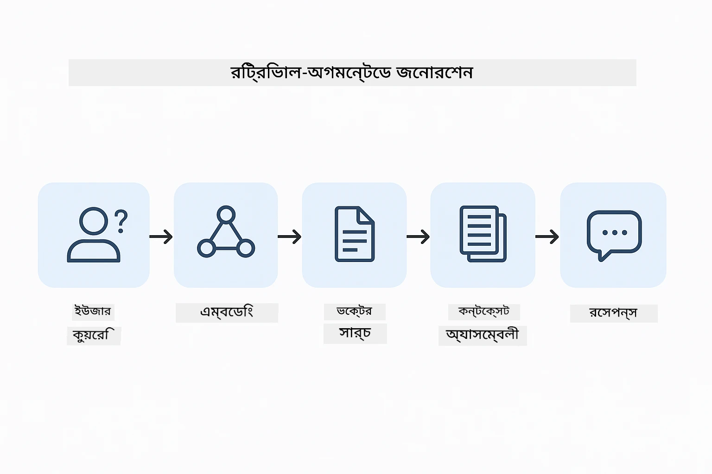
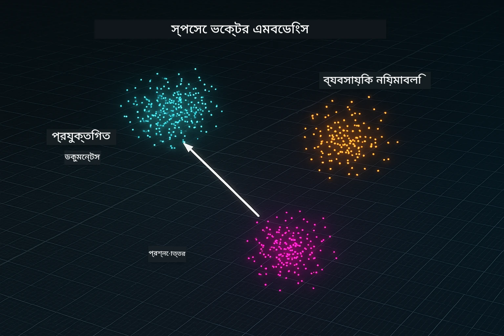
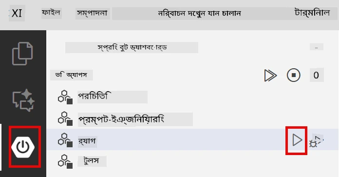
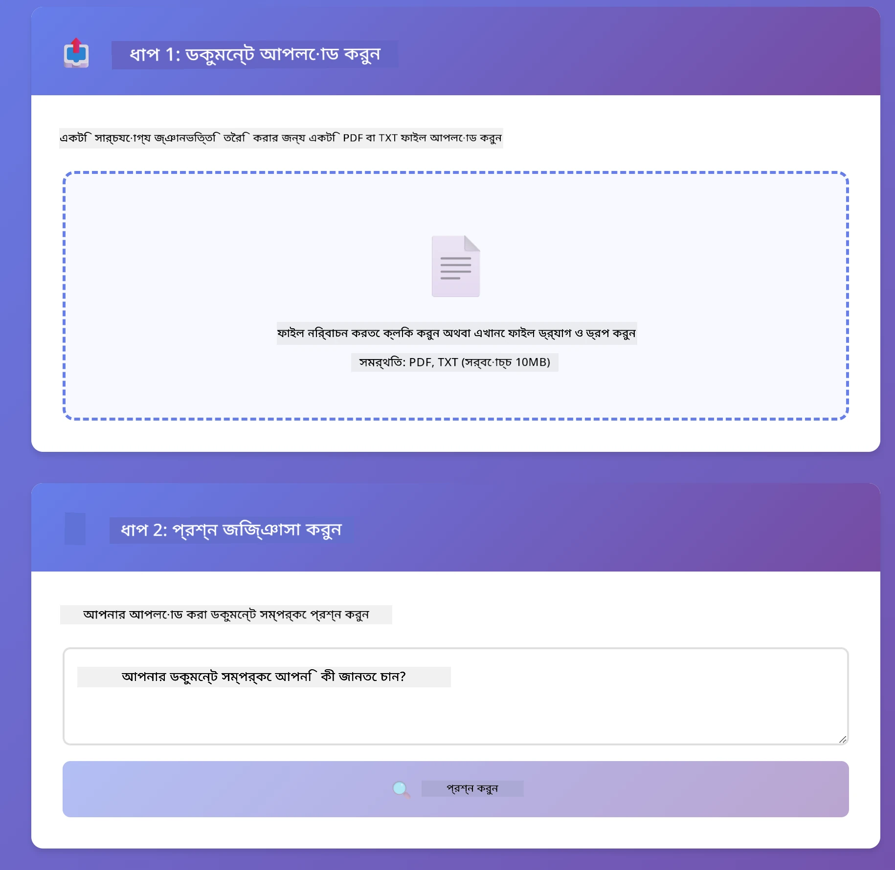
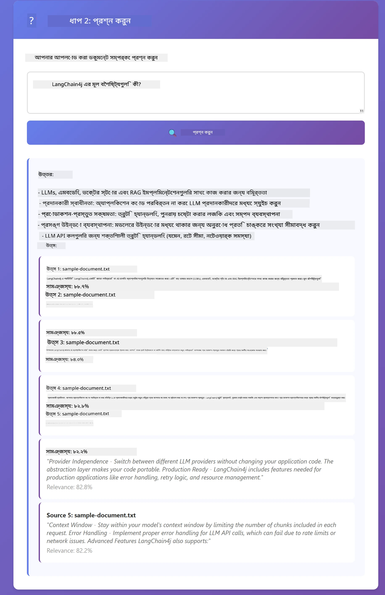

# Module 03: RAG (রিট্রিভ্যাল-অগমেন্টেড জেনারেশন)

## Table of Contents

- [Video Walkthrough](#video-walkthrough)
- [What You'll Learn](#what-youll-learn)
- [Prerequisites](#prerequisites)
- [Understanding RAG](#understanding-rag)
  - [Which RAG Approach Does This Tutorial Use?](#which-rag-approach-does-this-tutorial-use)
- [How It Works](#how-it-works)
  - [Document Processing](#document-processing)
  - [Creating Embeddings](#creating-embeddings)
  - [Semantic Search](#semantic-search)
  - [Answer Generation](#উত্তর-প্রজন্ম)
- [Run the Application](#অ্যাপ্লিকেশন-চালানো)
- [Using the Application](#অ্যাপ্লিকেশন-ব্যবহার)
  - [Upload a Document](#ডকুমেন্ট-আপলোড-করুন)
  - [Ask Questions](#প্রশ্ন-করুন)
  - [Check Source References](#উত্স-রেফারেন্স-যাচাই-করুন)
  - [Experiment with Questions](#প্রশ্ন-নিয়ে-পরীক্ষা-করুন)
- [Key Concepts](#মূল-ধারণাসমূহ)
  - [Chunking Strategy](#অংশকরণ-কৌশল)
  - [Similarity Scores](#সাদৃশ্য-স্কোর)
  - [In-Memory Storage](#ইন-মেমরি-স্টোরেজ)
  - [Context Window Management](#প্রসঙ্গ-উইন্ডো-ব্যবস্থাপনা)
- [When RAG Matters](#কখন-rag-গুরুত্বপূর্ণ)
- [Next Steps](#পরবর্তী-ধাপ)

## Video Walkthrough

এই লাইভ সেশনটি দেখুন যা এই মডিউলটি শুরু করার উপায় ব্যাখ্যা করে:

<a href="https://www.youtube.com/watch?v=_olq75ZH_eY"></a>

## What You'll Learn

পূর্ববর্তী মডিউলগুলিতে, আপনি শিখেছেন কিভাবে AI এর সাথে কথোপকথন চালাবেন এবং কীভাবে আপনার প্রম্পটগুলো কার্যকরভাবে গঠন করবেন। কিন্তু একটি মৌলিক সীমাবদ্ধতা আছে: ভাষা মডেলগুলো শুধুমাত্র তারা প্রশিক্ষণের সময় যা শিখেছে তা জানে। তারা আপনার কোম্পানির নীতি, আপনার প্রকল্প ডকুমেন্টেশন বা যেকোনো তথ্য যা তারা প্রশিক্ষিত হয়নি সে সম্পর্কে প্রশ্নের উত্তর দিতে পারে না।

RAG (রিট্রিভ্যাল-অগমেন্টেড জেনারেশন) এই সমস্যার সমাধান করে। মডেলটিকে আপনার তথ্য শেখানোর চেষ্টা করার পরিবর্তে (যা ব্যয়বহুল এবং অকার্যকর), আপনি তাকে আপনার ডকুমেন্টগুলো থেকে অনুসন্ধান করার দক্ষতা দেন। যখন কেউ প্রশ্ন করে, সিস্টেম প্রাসঙ্গিক তথ্য খুঁজে বের করে এবং সেটি প্রম্পটের সাথে অন্তর্ভুক্ত করে। মডেল তখন সে প্রাপ্ত প্রসঙ্গের ভিত্তিতে উত্তর দেয়।

RAG কে ভাবুন মডেলটিকে একটি রেফারেন্স লাইব্রেরি দেওয়ার মতো। আপনি যখন প্রশ্ন করবেন, সিস্টেম:

1. **ব্যবহারকারী প্রশ্ন** - আপনি প্রশ্ন করেন
2. **এম্বেডিং** - আপনার প্রশ্নকে একটি ভেক্টরে রূপান্তরিত করা হয়
3. **ভেক্টর সার্চ** - অনুরূপ ডকুমেন্ট অংশ খুঁজে পাওয়া হয়
4. **প্রসঙ্গ একত্রিতকরণ** - প্রম্পটে প্রাসঙ্গিক অংশ যোগ করা হয়
5. **প্রতিক্রিয়া** - LLM প্রসঙ্গ অনুযায়ী উত্তর তৈরি করে

এটি মডেলের উত্তরগুলিকে তার প্রশিক্ষণের জ্ঞানের উপর নির্ভর করার পরিবর্তে আপনার প্রকৃত ডেটার উপর ভিত্তি স্থাপন করে।

## Prerequisites

- সম্পন্ন [Module 01 - Introduction](../01-introduction/README.md) (Azure OpenAI সম্পদগুলি স্থাপিত রয়েছে, যার মধ্যে রয়েছে `text-embedding-3-small` এম্বেডিং মডেল)
- রুট ডিরেক্টরিতে `.env` ফাইল যা Azure ক্রেডেনশিয়াল ধারণ করে (Module 01-এ `azd up` দ্বারা তৈরি)

> **Note:** যদি আপনি Module 01 সম্পন্ন না করে থাকেন, প্রথমে সেখানে দেওয়া ডিপ্লয়মেন্ট নির্দেশনা অনুসরণ করুন। `azd up` কমান্ড GPT চ্যাট মডেল এবং এই মডিউলে ব্যবহৃত এম্বেডিং মডেল উভয়কেই ডিপ্লয় করে।

## Understanding RAG

নীচের চিত্রটি মূল ধারণাটি দেখায়: মডেলের প্রশিক্ষণ তথ্যের ওপর নির্ভর করার পরিবর্তে, RAG এর মাধ্যমে প্রতিটি উত্তরের আগে এটি আপনার ডকুমেন্টের একটি রেফারেন্স লাইব্রেরি পরামর্শ করে।


*এই চিত্রটি একটি সাধারণ LLM (যে প্রশিক্ষণ তথ্য থেকে অনুমান করে) এবং একটি RAG-বর্ধিত LLM (যে প্রথমে আপনার ডকুমেন্ট পরামর্শ করে) এর মধ্যে পার্থক্য দেখায়।*

এখানে পুরো প্রক্রিয়াটি বুঝুন যেখানে ব্যবহারকারীর প্রশ্ন চারটি ধাপের মধ্য দিয়ে চলে — এম্বেডিং, ভেক্টর সার্চ, প্রসঙ্গ একত্রিতকরণ এবং উত্তর উত্পাদন — প্রতিটি আগেরটির ওপর ভিত্তি করে:



*এই চিত্রটি শেষ পর্যন্ত RAG পাইপলাইন দেখায় — ব্যবহারকারীর প্রশ্ন এম্বেডিং, ভেক্টর সার্চ, প্রসঙ্গ একত্রিতকরণ, এবং উত্তর উত্পাদনের মধ্য দিয়ে যায়।*

এই মডিউলের বাকি অংশে প্রতিটি ধাপে বিস্তারিত ব্যাখ্যা দেওয়া হয়েছে, কোডসহ যা আপনি চালাতে এবং পরিবর্তন করতে পারেন।

### Which RAG Approach Does This Tutorial Use?

LangChain4j তিনটি RAG প্রয়োগ পদ্ধতি অফার করে, যার প্রত্যেকটি বিভিন্ন মাত্রার অবজেক্টিভ ও কাস্টমাইজেশন প্রদান করে। নিচের চিত্রে তাদের পারস্পরিক তুলনা করা হয়েছে:


*এই চিত্রটি LangChain4j এর তিনটি RAG পদ্ধতি — Easy, Native, এবং Advanced — তাদের প্রধান উপাদান এবং কখন কোনটি ব্যবহার করবেন তা প্রদর্শন করে।*

| পদ্ধতি | এটি কী করে | ট্রেড-অফ |
|---|---|---|
| **Easy RAG** | সবকিছু স্বয়ংক্রিয়ভাবে `AiServices` এবং `ContentRetriever` এর মাধ্যমে সংযুক্ত করে। আপনি একটি ইন্টারফেস অ্যানোটেট করেন, একটি রিট্রিভার যুক্ত করেন, এবং LangChain4j এম্বেডিং, অনুসন্ধান, এবং প্রম্পট বানানো পিছনে সামলায়। | কোড কম, কিন্তু প্রতিটি ধাপের অন্তর্গত প্রক্রিয়া দেখা যায় না। |
| **Native RAG** | আপনি নিজে এম্বেডিং মডেল কল করেন, স্টোর সার্চ করেন, প্রম্পট তৈরি করেন, এবং উত্তর তৈরি করেন — প্রতিটি ধাপ স্পষ্ট একটি করে। | কোড বেশি, কিন্তু প্রতিটি ধাপ স্পষ্ট এবং পরিবর্তনযোগ্য। |
| **Advanced RAG** | `RetrievalAugmentor` ফ্রেমওয়ার্ক ব্যবহার করে, যা প্লাগযোগ্য কুয়েরি ট্রান্সফর্মার, রাউটার, রি-র্যাঙ্কার, এবং কনটেন্ট ইনজেক্টর সহ প্রোডাকশন-গ্রেড পাইপলাইন তৈরি করে। | সর্বোচ্চ নমনীয়তা, কিন্তু উল্লেখযোগ্যভাবে জটিল। |

**এই টিউটোরিয়ালটি Native পদ্ধতি ব্যবহার করে।** RAG পাইপলাইনের প্রতিটি ধাপ — প্রশ্নের এম্বেডিং, ভেক্টর স্টোরে অনুসন্ধান, প্রসঙ্গ একত্রিতকরণ, এবং উত্তর উৎপাদন — স্পষ্টভাবে লেখা হয়েছে [`RagService.java`](../../../03-rag/src/main/java/com/example/langchain4j/rag/service/RagService.java) ফাইলে। এটি ইচ্ছাকৃত: একটি শেখার সম্পদ হিসেবে, প্রতিটি ধাপ দেখা ও বোঝা বেশি গুরুত্বপূর্ণ, কোড কমিয়ে ফেলা নয়। একবার আপনি বুঝে গেলে, দ্রুত প্রোটোটাইপের জন্য Easy RAG বা production সিস্টেমের জন্য Advanced RAG এ যেতে পারেন।

> **💡 Easy RAG সম্পর্কে কৌতূহলী?** LangChain4j একটি *Easy RAG* পদ্ধতিও অফার করে যেখানে `AiServices` ও `ContentRetriever` স্বয়ংক্রিয়ভাবে এম্বেডিং, অনুসন্ধান এবং প্রম্পট সমন্বয় করে। এই মডিউলটি একটু বেশি স্পষ্ট পথ অনুসরণ করে — সুতরাং আপনি প্রতিটি ধাপ নিজেই দেখতে এবং নিয়ন্ত্রণ করতে পারেন।

নীচের চিত্রটি Easy RAG পাইপলাইন দেখায়। লক্ষ্য করুন কিভাবে `AiServices` এবং `EmbeddingStoreContentRetriever` সমস্ত জটিলতা লুকিয়ে রাখে — আপনি একটি ডকুমেন্ট লোড করেন, রিট্রিভার সংযুক্ত করেন, এবং উত্তর পান। এই মডিউলটি Native পদ্ধতির মাধ্যমে ঐসব লুকানো ধাপ খুলে দেয়:


*এই চিত্রটি Easy RAG পাইপলাইন দেখায়। Native পদ্ধতির সাথে তুলনা করুন যা এই মডিউলে ব্যবহৃত হয়েছে: Easy RAG `AiServices` এবং `ContentRetriever` এর পিছনে এম্বেডিং, রিট্রিভাল, এবং প্রম্পট সমন্বয় লুকায় — আপনি একটি ডকুমেন্ট লোড করেন, রিট্রিভার সংযুক্ত করেন, এবং উত্তর পান। এই মডিউলের Native পদ্ধতিটি ঐ পাইপলাইন খুলে দেয় যাতে আপনি নিজেই প্রতিটি ধাপ (এম্বেড, সার্চ, প্রসঙ্গ একত্রিতকরণ, উত্তর তৈরি) কল করতে পারেন, সম্পূর্ণ দৃশ্যমানতা এবং নিয়ন্ত্রণের জন্য।*

## How It Works

এই মডিউলের RAG পাইপলাইন চারটি ধাপে বিভক্ত যা প্রতিবার ব্যবহারকারী প্রশ্ন করলে সিকোয়েন্সিয়ালি চলে। প্রথমে, আপলোড করা ডকুমেন্টটি **পার্স এবং চাঙ্ক** করা হয় ব্যবস্থাপনায়যোগ্য অংশে। সেগুলো পরে **ভেক্টর এম্বেডিং** এ রূপান্তরিত হয় এবং সংরক্ষণ করা হয় যাতে সেগুলো গাণিতিকভাবে তুলনা করা যায়। যখন একটি প্রশ্ন আসে, সিস্টেম একটি **সেমান্টিক সার্চ** সম্পাদন করে সবচেয়ে প্রাসঙ্গিক চাঙ্ক খুঁজে, এবং অবশেষে সেগুলোকে প্রসঙ্গ হিসেবে LLM-এ দেয় **উত্তর উত্পাদনের জন্য**। নিচের বিভাগগুলি প্রতিটি ধাপ কোড ও ছবিসহ বর্ণনা করে। প্রথম ধাপটি দেখি।

### Document Processing

[DocumentService.java](../../../03-rag/src/main/java/com/example/langchain4j/rag/service/DocumentService.java)

যখন আপনি একটি ডকুমেন্ট আপলোড করেন, সিস্টেম এটি পার্স করে (PDF বা প্লেইন টেক্সট), ফাইলনামসহ মেটাডেটা সংযুক্ত করে, এবং তারপর সেটি ছোট ছোট চাঙ্কে বিভক্ত করে — এমন ছোট অংশ যা মডেলের প্রসঙ্গ উইন্ডোতে আরামদায়কভাবে ফিট করে। এই চাঙ্কগুলো কিছুটা ওভারল্যাপ করে যাতে সীমান্তে প্রসঙ্গ হারানো না যায়।

```java
// আপলোড করা ফাইলটি বিশ্লেষণ করুন এবং এটি LangChain4j ডকুমেন্টে মোড়ানো করুন
Document document = Document.from(content, metadata);

// ৩০০-টোকেন অংশে বিভক্ত করুন ৩০-টোকেন ওভারল্যাপ সহ
DocumentSplitter splitter = DocumentSplitters
    .recursive(300, 30);

List<TextSegment> segments = splitter.split(document);
```

নীচের চিত্রটি এটি ভিজ্যুয়ালি কিভাবে কাজ করে দেখায়। লক্ষ্য করুন প্রতিটি চাঙ্ক তার প্রতিবেশীদের সাথে কিছু টোকেন শেয়ার করে — ৩০ টোকেন ওভারল্যাপ নিশ্চিত করে কোন গুরুত্বপূর্ণ প্রসঙ্গ ফেটে যাচ্ছে না:


*এই চিত্রটি দেখায় কিভাবে একটি ডকুমেন্ট ৩০০ টোকেনের চাঙ্কে ভাগ করা হয় ৩০ টোকেন ওভারল্যাপ দিয়ে, যাতে চাঙ্ক সীমান্তে প্রসঙ্গ সংরক্ষিত থাকে।*

> **🤖 [GitHub Copilot](https://github.com/features/copilot) Chat দিয়ে চেষ্টা করুন:** খুলুন [`DocumentService.java`](../../../03-rag/src/main/java/com/example/langchain4j/rag/service/DocumentService.java) এবং জিজ্ঞাসা করুন:  
> - "LangChain4j কিভাবে ডকুমেন্টগুলো চাঙ্কে ভাগ করে এবং কেন ওভারল্যাপ গুরুত্বপূর্ণ?"  
> - "বিভিন্ন ডকুমেন্ট ধরণের জন্য সর্বোত্তম চাঙ্ক সাইজ কি এবং কেন?"  
> - "আমি কিভাবে বিভিন্ন ভাষার ডকুমেন্ট অথবা বিশেষ ফরম্যাটিং সহ ডকুমেন্টগুলি হ্যান্ডেল করব?"

### Creating Embeddings

[LangChainRagConfig.java](../../../03-rag/src/main/java/com/example/langchain4j/rag/config/LangChainRagConfig.java)

প্রতিটি চাঙ্ক একটি সংখ্যাসূচক প্রতিনিধিত্বে রূপান্তরিত করা হয়, যাকে এম্বেডিং বলা হয় — মূলত একটি অর্থ থেকে সংখ্যায় রূপান্তরকারী। এম্বেডিং মডেলটির "ইন্টেলিজেন্স" চ্যাট মডেলের মত নয়; এটি নির্দেশ মেনে চলে না, যুক্তি দেয় না বা প্রশ্নের উত্তর দেয় না। তবে এটি টেক্সটকে এমন একটি গাণিতিক স্থানে ম্যাপ করে যেখানে অনুরূপ অর্থের ভেক্টরগুলো একদম কাছে থাকে — যেমন "গাড়ি" এবং "অটোমোবাইল", "রিফান্ড পলিসি" এবং "আমার টাকা ফেরত"। চ্যাট মডেলকে ভাবুন একজন মানুষের মতো যাকে আপনি কথা বলতে পারেন; এম্বেডিং মডেল হলো অত্যন্ত ভাল একটি ফাইলিং সিস্টেম।

নীচের চিত্রটি এই ধারণা ভিজ্যুয়াল করে — টেক্সট ঢুকে, সংখ্যাসূচক ভেক্টর বের হয়, এবং অনুরূপ অর্থ নিকটবর্তী ভেক্টরে থাকে:


*এই চিত্রটি দেখায় কিভাবে একটি এম্বেডিং মডেল টেক্সটকে সংখ্যাসূচক ভেক্টরে রূপান্তরিত করে, এবং অনুরূপ অর্থ — যেমন "গাড়ি" ও "অটোমোবাইল" — ভেক্টর স্পেসে একসাথে থাকে।*

```java
@Bean
public EmbeddingModel embeddingModel() {
    return OpenAiOfficialEmbeddingModel.builder()
        .baseUrl(azureOpenAiEndpoint)
        .apiKey(azureOpenAiKey)
        .modelName(azureEmbeddingDeploymentName)
        .build();
}

EmbeddingStore<TextSegment> embeddingStore = 
    new InMemoryEmbeddingStore<>();
```

নীচের ক্লাস ডায়াগ্রামটি RAG পাইপলাইনের দুটি পৃথক প্রবাহ এবং LangChain4j ক্লাসগুলি দেখায় যা সেগুলো বাস্তবায়ন করে। **ইনজেশন ফ্লো** (আপলোডের সময় একবার চলে) ডকুমেন্ট বিভক্ত করে, চাঙ্ক এম্বেড করে, এবং `.addAll()` এর মাধ্যমে সংরক্ষণ করে। **কুয়েরি ফ্লো** (প্রতিবার প্রশ্ন করার সময়) প্রশ্ন এম্বেড করে, `.search()` এর মাধ্যমে স্টোরে সার্চ করে, এবং ম্যাচ করা প্রসঙ্গ চ্যাট মডেলে পাঠায়। উভয় ফ্লো একটি ভাগ করা `EmbeddingStore<TextSegment>` ইন্টারফেসে মিলিত হয়:


*এই চিত্রটি RAG পাইপলাইনের দুটি প্রবাহ — ইনজেশন এবং কুয়েরি — এবং সেগুলো কীভাবে একটি ভাগ করা EmbeddingStore এর মাধ্যমে সংযুক্ত হয় দেখায়।*

একবার এম্বেডিংগুলো সংরক্ষিত হলে, অনুরূপ কন্টেন্ট স্বাভাবিকভাবেই ভেক্টর স্পেসে ঘন হয়ে যায়। নিচের ভিজ্যুয়ালাইজেশনটি দেখায় কিভাবে সম্পর্কিত বিষয়ক ডকুমেন্টগুলো একসাথে গুচ্ছবদ্ধ হয়, যা সেমান্টিক সার্চকে সম্ভব করে তোলে:



*এই ভিজ্যুয়ালাইজেশন দেখায় কিভাবে সম্পর্কিত ডকুমেন্টগুলো ৩ডি ভেক্টর স্পেসে ক্লাস্টারায়, যেমন টেকনিক্যাল ডকস, বিজনেস রুলস, এবং FAQ আলাদা আলাদা গ্রুপ তৈরি করে।*

যখন ব্যবহারকারী সার্চ করে, সিস্টেম চারটি ধাপ অনুসরণ করে: ডকুমেন্ট একবার এম্বেড করা, প্রতিবার সার্চে প্রশ্ন এম্বেড করা, কজাইন সিমিলারিটি ব্যবহার করে সব ভেক্টরের বিপরীতে প্রশ্নের ভেক্টর তুলনা করা, এবং শীর্ষ-K নম্বরের সর্বোচ্চ স্কোর প্রাপ্ত চাঙ্ক ফেরত দেয়া। নিচের চিত্রটি প্রতিটি ধাপ এবং LangChain4j ক্লাসগুলি দেখায়:


*এই চিত্রটি চার ধাপের এম্বেডিং সার্চ প্রক্রিয়া দেখায়: ডকুমেন্ট এম্বেড করা, প্রশ্ন এম্বেড করা, কজাইন সিমিলারিটি দিয়ে ভেক্টর তুলনা, এবং শীর্ষ-ক ফলাফল ফেরত দেওয়া।*

### Semantic Search

[RagService.java](../../../03-rag/src/main/java/com/example/langchain4j/rag/service/RagService.java)

আপনি যখন প্রশ্ন করেন, আপনার প্রশ্নও একটি এম্বেডিং হয়। সিস্টেম আপনার প্রশ্নের এম্বেডিংকে সব ডকুমেন্ট চাঙ্কের এম্বেডিংয়ের সঙ্গে তুলনা করে। এটি এমন চাঙ্ক খুঁজে পায় যার অর্থ সবচেয়ে অনুরূপ — শুধু ম্যাচিং কীওয়ার্ড নয়, বরং প্রকৃত সেমান্টিক সামঞ্জস্য।

```java
Embedding queryEmbedding = embeddingModel.embed(question).content();

EmbeddingSearchRequest searchRequest = EmbeddingSearchRequest.builder()
    .queryEmbedding(queryEmbedding)
    .maxResults(5)
    .minScore(0.5)
    .build();

EmbeddingSearchResult<TextSegment> searchResult = embeddingStore.search(searchRequest);
List<EmbeddingMatch<TextSegment>> matches = searchResult.matches();

for (EmbeddingMatch<TextSegment> match : matches) {
    String relevantText = match.embedded().text();
    double score = match.score();
}
```

নীচের চিত্রটি সেমান্টিক সার্চ এবং প্রচলিত কীওয়ার্ড সার্চের পার্থক্য দেখায়। "vehicle" শব্দটির জন্য কীওয়ার্ড সার্চ "cars and trucks" সম্পর্কিত চাঙ্ক হারিয়ে ফেলে, কিন্তু সেমান্টিক সার্চ বুঝতে পারে এরা একই অর্থ বহন করে এবং সেটি উচ্চ স্কোরিং হিসেবে ফেরত দেয়:


*এই চিত্রটি কীওয়ার্ড ভিত্তিক সার্চ এবং সেমান্টিক সার্চের তুলনা, দেখায় কিভাবে সেমান্টিক সার্চ ধারণাগতভাবে সম্পর্কিত কন্টেন্টকে পুনরুদ্ধার করে যদিও সঠিক কীওয়ার্ড ভিন্ন হয়।*

অন্তর্দৃষ্টিতে, সামঞ্জস্য কজাইন সিমিলারিটি ব্যবহার করে পরিমাপ করা হয় — অর্থাৎ "এই দুইটি তীর একই দিকে ইঙ্গিত করছে?" দুইটি চাঙ্ক সম্পূর্ণ ভিন্ন শব্দ ব্যবহার করতে পারে, কিন্তু যদি তাদের অর্থ একই হয় তাহলে তাদের ভেক্টর একই দিকে ইঙ্গিত করে এবং স্কোর 1.0 এর কাছাকাছি হয়:


*এই চিত্রটি এমবেডিং ভেক্টরের মধ্যে কোসাইন সাদৃশ্য ধারণাকে কোণ হিসেবে দেখায় — বেশি সামঞ্জস্যপূর্ণ ভেক্টরগুলি ১.০ এর কাছাকাছি স্কোর পায়, যা উচ্চতর অর্থগত সাদৃশ্য নির্দেশ করে।*

> **🤖 [GitHub Copilot](https://github.com/features/copilot) চ্যাট দিয়ে চেষ্টা করুন:** খোলুন [`RagService.java`](../../../03-rag/src/main/java/com/example/langchain4j/rag/service/RagService.java) এবং জিজ্ঞাসা করুন:
> - "এম্বেডিং এর মাধ্যমে সাদৃশ্য অনুসন্ধান কীভাবে কাজ করে এবং স্কোর নির্ধারণ করে কী?"
> - "আমি কোন সাদৃশ্য পরিমাণ সীমা ব্যবহার করব এবং এটি ফলাফলের উপরে কিভাবে প্রভাব ফেলে?"
> - "যখন কোনো প্রাসঙ্গিক ডকুমেন্ট পাওয়া যায় না তখন আমি কী করব?"

### উত্তর প্রজন্ম

[RagService.java](../../../03-rag/src/main/java/com/example/langchain4j/rag/service/RagService.java)

সর্বাধিক প্রাসঙ্গিক অংশগুলোকে একত্রিত করে একটি কাঠামোবদ্ধ প্রম্পট তৈরি করা হয়, যা স্পষ্ট নির্দেশাবলী, প্রাপ্ত প্রসঙ্গ এবং ব্যবহারকারীর প্রশ্ন অন্তর্ভুক্ত করে। মডেল সে নির্দিষ্ট অংশগুলো পড়ে এবং সেই তথ্যের ভিত্তিতে উত্তর দেয় — এটি কেবল সামনে যা রয়েছে তা ব্যবহার করতে পারে, যা ভুল ধারণাকে প্রতিরোধ করে।

```java
String context = matches.stream()
    .map(match -> match.embedded().text())
    .collect(Collectors.joining("\n\n"));

String prompt = String.format("""
    Answer the question based on the following context.
    If the answer cannot be found in the context, say so.

    Context:
    %s

    Question: %s

    Answer:""", context, request.question());

String answer = chatModel.chat(prompt);
```

নীচের চিত্রটি এই সংকলন প্রক্রিয়াটি দেখায় — অনুসন্ধান ধাপ থেকে সর্বোচ্চ স্কোরপ্রাপ্ত অংশগুলো প্রম্পট টেমপ্লেটে সংযুক্ত করা হয়, এবং `OpenAiOfficialChatModel` একটি ভিত্তিপ্রাপ্ত উত্তর তৈরি করে:


*এই চিত্রটি দেখায় কীভাবে সর্বোচ্চ স্কোরপ্রাপ্ত অংশগুলোকে কাঠামোবদ্ধ প্রম্পটে সংযুক্ত করা হয়, যা মডেলকে আপনার ডেটা থেকে একটি ভিত্তিপ্রাপ্ত উত্তর তৈরি করতে সক্ষম করে।*

## অ্যাপ্লিকেশন চালানো

**ডিপ্লয়মেন্ট যাচাই করুন:**

রুট ডিরেক্টরিতে `.env` ফাইলটি আছে কিনা নিশ্চিত করুন যাতে Azure সনদপত্র থাকে (মডিউল ০১ এ তৈরি)। এটি মডিউল ডিরেক্টরি (`03-rag/`) থেকে চালান:

**Bash:**
```bash
cat ../.env  # AZURE_OPENAI_ENDPOINT, API_KEY, DEPLOYMENT দেখানো উচিত
```

**PowerShell:**
```powershell
Get-Content ..\.env  # AZURE_OPENAI_ENDPOINT, API_KEY, DEPLOYMENT দেখানো উচিত
```

**অ্যাপ্লিকেশন শুরু করুন:**

> **বিঃদ্রঃ:** যদি আপনি ইতোমধ্যে রুট ডিরেক্টরির থেকে `./start-all.sh` ব্যবহার করে সব অ্যাপ্লিকেশন চালু করে থাকেন (যেমন মডিউল ০১ এ বর্ণিত), তবে এই মডিউলটি ইতোমধ্যে পোর্ট ৮০৮১ এ চলছে। আপনি নিচের শুরু কমান্ডগুলো এড়িয়ে সরাসরি http://localhost:8081 এ যেতে পারেন।

**বিকল্প ১: স্প্রিং বুট ড্যাশবোর্ড ব্যবহার (VS Code ব্যবহারকারীদের জন্য সুপারিশকৃত)**

ডেভ কনটেইনারটিতে স্প্রিং বুট ড্যাশবোর্ড এক্সটেনশন অন্তর্ভুক্ত, যা সব স্প্রিং বুট অ্যাপ্লিকেশন দেখাশোনা করার ভিজ্যুয়াল ইন্টারফেস দেয়। এটি VS Code এর বাম পাশে অ্যাকটিভিটি বারে পাওয়া যাবে (স্প্রিং বুট আইকন দেখুন)।

স্প্রিং বুট ড্যাশবোর্ড থেকে আপনি:
- ওয়ার্কস্পেসে সব উপলব্ধ স্প্রিং বুট অ্যাপ্লিকেশন দেখতে পারেন
- একটি ক্লিকে অ্যাপ্লিকেশন শুরু/বন্ধ করতে পারেন
- অ্যাপ্লিকেশন লগ রিয়েল-টাইমে দেখতে পারেন
- অ্যাপ্লিকেশন অবস্থান পর্যবেক্ষণ করতে পারেন

শুধুমাত্র "rag" এর পাশে প্লে বাটনে ক্লিক করে এই মডিউল চালু করুন, অথবা একবারে সব মডিউল শুরু করুন।



*এই স্ক্রিনশটে VS Code এ স্প্রিং বুট ড্যাশবোর্ড প্রদর্শিত হয়েছে, যেখানে আপনি অ্যাপ্লিকেশনগুলি চালু, বন্ধ এবং মনিটর করতে পারেন ভিজ্যুয়ালি।*

**বিকল্প ২: শেল স্ক্রিপ্ট ব্যবহার**

সব ওয়েব অ্যাপ্লিকেশন (মডিউল ০১-০৪) শুরু করুন:

**Bash:**
```bash
cd ..  # রুট ডিরেক্টরি থেকে
./start-all.sh
```

**PowerShell:**
```powershell
cd ..  # রুট ডিরেক্টরি থেকে
.\start-all.ps1
```

অথবা কেবল এই মডিউল শুরু করুন:

**Bash:**
```bash
cd 03-rag
./start.sh
```

**PowerShell:**
```powershell
cd 03-rag
.\start.ps1
```

উভয় স্ক্রিপ্ট স্বয়ংক্রিয়ভাবে রুট `.env` ফাইল থেকে পরিবেশ ভেরিয়েবল লোড করে এবং যদি JAR ফাইল না থাকে তবে নির্মাণ করে।

> **বিঃদ্রঃ:** যদি আপনি শুরু করার আগে সব মডিউল ম্যানুয়ালি তৈরি করতে চান:
>
> **Bash:**
> ```bash
> cd ..  # Go to root directory
> mvn clean package -DskipTests
> ```

> **PowerShell:**
> ```powershell
> cd ..  # Go to root directory
> mvn clean package -DskipTests
> ```

আপনার ব্রাউজারে http://localhost:8081 খুলুন।

**বন্ধ করতে:**

**Bash:**
```bash
./stop.sh  # শুধুমাত্র এই মডিউল
# অথবা
cd .. && ./stop-all.sh  # সব মডিউলগুলি
```

**PowerShell:**
```powershell
.\stop.ps1  # শুধুমাত্র এই মডিউল
# অথবা
cd ..; .\stop-all.ps1  # সব মডিউলগুলি
```

## অ্যাপ্লিকেশন ব্যবহার

অ্যাপ্লিকেশনটি ডকুমেন্ট আপলোড এবং প্রশ্ন করার জন্য একটি ওয়েব ইন্টারফেস প্রদান করে।

<a href="images/rag-homepage.png"></a>

*এই স্ক্রিনশটে RAG অ্যাপ্লিকেশন ইন্টারফেস দেখানো হয়েছে যেখানে আপনি ডকুমেন্ট আপলোড করে প্রশ্ন করতে পারেন।*

### ডকুমেন্ট আপলোড করুন

একটি ডকুমেন্ট আপলোড দিয়ে শুরু করুন - টেক্সট ফাইল পরীক্ষা করার জন্য সবচেয়ে ভালো। এই ডিরেক্টরিতে একটি `sample-document.txt` দেওয়া আছে যেটিতে LangChain4j বৈশিষ্ট্য, RAG বাস্তবায়ন এবং শ্রেষ্ঠ অনুশীলন সম্পর্কিত তথ্য রয়েছে - সিস্টেম পরীক্ষা করার জন্য উপযুক্ত।

সিস্টেম আপনার ডকুমেন্ট প্রক্রিয়াকরণ করে, তা ভাগ করে এবং প্রতি অংশের জন্য এমবেডিং তৈরি করে। এটি স্বয়ংক্রিয়ভাবে ঘটে যখন আপনি আপলোড করেন।

### প্রশ্ন করুন

এখন ডকুমেন্টের বিষয়বস্তু সম্পর্কে নির্দিষ্ট প্রশ্ন করুন। এমন কিছু প্রশ্ন করুন যা স্পষ্টভাবে ডকুমেন্টে উল্লেখিত আছে। সিস্টেম প্রাসঙ্গিক অংশ অনুসন্ধান করে, সেগুলোকে প্রম্পটে অন্তর্ভুক্ত করে এবং উত্তর তৈরি করে।

### উত্স রেফারেন্স যাচাই করুন

প্রতিটি উত্তরে উত্স রেফারেন্স এবং সাদৃশ্য স্কোর অন্তর্ভুক্ত থাকে লক্ষ্য করুন। এই স্কোর (০ থেকে ১) দেখায় আপনার প্রশ্নের সাথে প্রতিটি অংশ কতটা প্রাসঙ্গিক ছিল। উচ্চ স্কোর মানে ভালো মিল। এটি আপনাকে উত্তরের সাথে উৎস উপাদানের মিল যাচাই করতে সাহায্য করে।

<a href="images/rag-query-results.png"></a>

*এই স্ক্রিনশটে প্রশ্ন ফলাফল দেখানো হয়েছে যেখানে উৎপন্ন উত্তর, উত্স রেফারেন্স এবং প্রাসঙ্গিকতার স্কোরগুলি প্রতিটি উদ্ধার করা অংশের জন্য প্রদর্শিত হয়েছে।*

### প্রশ্ন নিয়ে পরীক্ষা করুন

বিভিন্ন ধরনের প্রশ্ন চেষ্টা করুন:
- নির্দিষ্ট তথ্য: "প্রধান বিষয় কী?"
- তুলনা: "X এবং Y এর মধ্যে পার্থক্য কী?"
- সারাংশ: "Z সম্পর্কিত মূল পয়েন্টগুলো সারাংশ করুন"

দেখুন কীভাবে প্রাসঙ্গিকতার স্কোর পরিবর্তিত হয় আপনার প্রশ্ন ডকুমেন্ট বিষয়বস্তুর সাথে কতটা মেলে তার উপর ভিত্তি করে।

## মূল ধারণাসমূহ

### অংশকরণ কৌশল

ডকুমেন্টগুলো ৩০০ টোকেন আকারের অংশে ভাগ করা হয় যেখানে ৩০ টোকেন ওভারল্যাপে থাকে। এই ভারসাম্য নিশ্চিত করে প্রতিটি অংশে যথেষ্ট প্রসঙ্গ থাকে তা অর্থপূর্ণ করার জন্য পাশাপাশি অংশগুলো ছোট থাকার কারণে একাধিক অংশ প্রম্পটে অন্তর্ভুক্ত করা যায়।

### সাদৃশ্য স্কোর

প্রত্যেক উদ্ধারকৃত অংশের সাথে একটি সাদৃশ্য স্কোর থাকে ০ থেকে ১ এর মধ্যে যা নির্দেশ করে এটি ব্যবহারকারীর প্রশ্নের সাথে কতটা মিল রয়েছে। নিচের চিত্রটি এই স্কোরের পরিসর এবং সিস্টেম কীভাবে তা ব্যবহার করে ফলাফল ছাঁকছে তা দেখায়:


*এই চিত্রটি ০ থেকে ১ পর্যন্ত স্কোর পরিসর দেখায়, যার ন্যূনতম সীমা ০.৫ যা প্রাসঙ্গিক নয় এমন অংশগুলি ফিল্টার করে।*

স্কোরের পরিসর:
- ০.৭-১.০: অত্যন্ত প্রাসঙ্গিক, নির্দিষ্ট মিল
- ০.৫-০.৭: প্রাসঙ্গিক, ভালো প্রসঙ্গ
- ০.৫ এর নিচে: ফিল্টার করা হয়েছে, খুব আলাদা

গুণগতমান নিশ্চিত করার জন্য সিস্টেম ন্যূনতম সীমার নিচের অংশগুলি উদ্ধার করে না।

এম্বেডিং গুলো অর্থ স্পষ্টভাবে গুচ্ছভুক্ত হলে ভাল কাজ করে, তবে এর কিছু সীমাবদ্ধতা আছে। নিচের চিত্রটি প্রচলিত ব্যর্থতার ধরণ দেখায় — অনেক বড় অংশ অস্পষ্ট ভেক্টর তৈরি করে, ছোট অংশে প্রসঙ্গ কম থাকে, অসম্পূর্ণ শব্দ একাধিক গুচ্ছের দিকে নির্দেশ করে, এবং সঠিক ম্যাচ লুকআপ (আইডি, পার্ট নং) এমবেডিং এর সাথে কাজ করে না:


*এই চিত্রটি প্রচলিত এমবেডিং ব্যর্থতার ধরন দেখায়: খুব বড় অংশ, খুব ছোট অংশ, অস্পষ্ট শব্দ যা একাধিক গুচ্ছের দিকে নির্দেশ করে, এবং সঠিক ম্যাচ লুকআপ (আইডি ইত্যাদি)।*

### ইন-মেমরি স্টোরেজ

সহজতার জন্য এই মডিউল ইন-মেমরি স্টোরেজ ব্যবহার করে। অ্যাপ্লিকেশন পুনরায় চালু করলে আপলোড করা ডকুমেন্ট হারানো যায়। উৎপাদন সিস্টেমে Qdrant বা Azure AI Search এর মত স্থায়ী ভেক্টর ডাটাবেস ব্যবহৃত হয়।

### প্রসঙ্গ উইন্ডো ব্যবস্থাপনা

প্রতিটি মডেলের একটি সর্বোচ্চ প্রসঙ্গ উইন্ডো থাকে। বড় ডকুমেন্ট থেকে প্রতিটি অংশ অন্তর্ভুক্ত করা সম্ভব নয়। সিস্টেম সর্বোচ্চ N প্রাসঙ্গিক অংশ (ডিফল্ট ৫) উদ্ধার করে যাতে সীমার মধ্যে থেকে যথেষ্ট প্রসঙ্গ দিয়ে সঠিক উত্তর দেয়া যায়।

## কখন RAG গুরুত্বপূর্ণ

RAG সবসময় সঠিক পন্থা নয়। নিচের সিদ্ধান্ত নির্দেশিকা আপনাকে সাহায্য করবে জানার জন্য কখন RAG মূল্যায়ন যোগ করে এবং কখন সরল পদ্ধতি — যেমন সরাসরি প্রম্পটে বিষয় বস্তু অন্তর্ভুক্ত করা বা মডেলের নিজস্ব জ্ঞান নির্ভর করা — যথেষ্ট:


*এই চিত্রটি একটি সিদ্ধান্ত নির্দেশিকা দেখায় যে কখন RAG মূল্যায়ন যোগ করে এবং কখন সরল পদ্ধতি যথেষ্ট।*

## পরবর্তী ধাপ

**পরবর্তী মডিউল:** [04-tools - AI Agents with Tools](../04-tools/README.md)

---

**নেভিগেশন:** [← পূর্ববর্তী: মডিউল ০২ - প্রম্পট ইঞ্জিনিয়ারিং](../02-prompt-engineering/README.md) | [মেইনে ফিরে যান](../README.md) | [পরবর্তী: মডিউল ০৪ - টুলস →](../04-tools/README.md)

---

<!-- CO-OP TRANSLATOR DISCLAIMER START -->
**অস্বীকৃতি**:
এই নথিটি AI অনুবাদ পরিষেবা [Co-op Translator](https://github.com/Azure/co-op-translator) ব্যবহার করে অনূদিত হয়েছে। যদিও আমরা শুদ্ধতার জন্য চেষ্টা করি, অনুগ্রহ করে মনে রাখবেন যে স্বয়ংক্রিয় অনুবাদে ত্রুটি বা অসঙ্গতি থাকতে পারে। মূল নথিটি তার স্বভাষায় কর্তৃত্বপূর্ণ উৎস হিসেবে বিবেচিত হওয়া উচিত। গুরুত্বপূর্ণ তথ্যের জন্য পেশাদার মানব অনুবাদ সুপারিশ করা হয়। এই অনুবাদের ব্যবহারে প্রয়োজনীয় ভুল বোঝাবুঝি বা ভুল ব্যাখ্যার জন্য আমরা দায়বদ্ধ নই।
<!-- CO-OP TRANSLATOR DISCLAIMER END -->