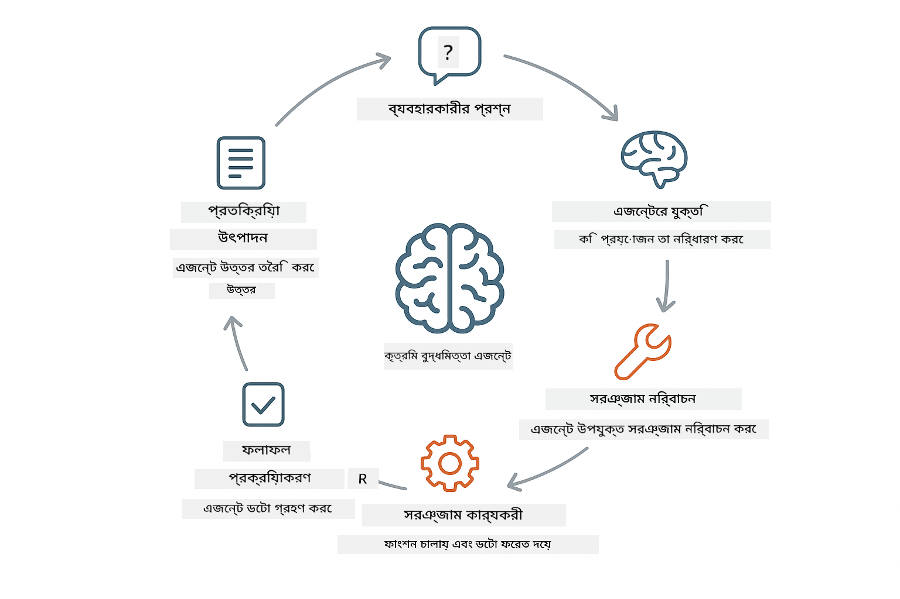
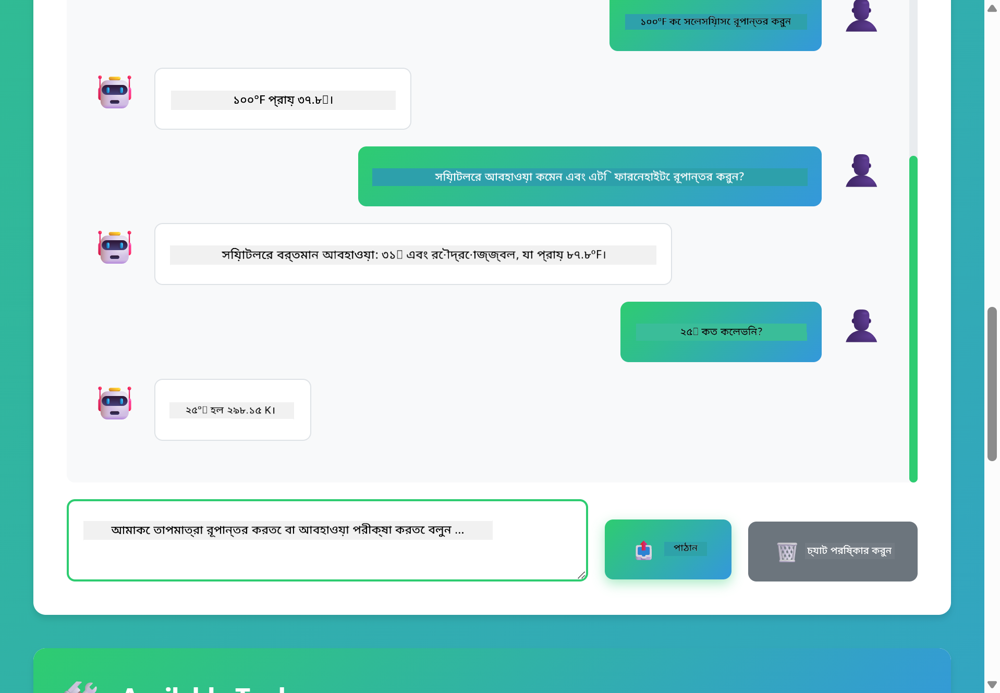

<!--
CO_OP_TRANSLATOR_METADATA:
{
  "original_hash": "13ec450c12cdd1a863baa2b778f27cd7",
  "translation_date": "2025-12-30T22:42:33+00:00",
  "source_file": "04-tools/README.md",
  "language_code": "bn"
}
-->
# Module 04: AI Agents with Tools

## Table of Contents

- [কী শিখবেন](../../../04-tools)
- [প্রয়োজনীয়তা](../../../04-tools)
- [টুলসমূহসহ AI এজেন্ট বোঝা](../../../04-tools)
- [টুল কলিং কিভাবে কাজ করে](../../../04-tools)
  - [টুল সংজ্ঞা](../../../04-tools)
  - [সিদ্ধান্ত গ্রহণ](../../../04-tools)
  - [নির্বাহ](../../../04-tools)
  - [প্রতিক্রিয়া জেনারেশন](../../../04-tools)
- [টুল চেইনিং](../../../04-tools)
- [অ্যাপ্লিকেশন চালান](../../../04-tools)
- [অ্যাপ্লিকেশন ব্যবহার](../../../04-tools)
  - [সহজ টুল ব্যবহারের চেষ্টা করুন](../../../04-tools)
  - [টুল চেইনিং পরীক্ষা করুন](../../../04-tools)
  - [কনভারসেশন ফ্লো দেখুন](../../../04-tools)
  - [রিজনিং পর্যবেক্ষণ করুন](../../../04-tools)
  - [বিভিন্ন অনুরোধ নিয়ে পরীক্ষা-নিরীক্ষা করুন](../../../04-tools)
- [কী ধারণা](../../../04-tools)
  - [ReAct প্যাটার্ন (রিজনিং এবং অ্যাক্টিং)](../../../04-tools)
  - [টুল বর্ণনা গুরুত্বপূর্ণ](../../../04-tools)
  - [সেশন ম্যানেজমেন্ট](../../../04-tools)
  - [ত্রুটি হ্যান্ডলিং](../../../04-tools)
- [উপলব্ধ টুলসমূহ](../../../04-tools)
- [কখন টুল-ভিত্তিক এজেন্ট ব্যবহার করবেন](../../../04-tools)
- [পরবর্তী ধাপ](../../../04-tools)

## What You'll Learn

এখন পর্যন্ত আপনি AI-র সাথে কথোপকথন করা, প্রম্পট গঠন করা, এবং আপনার ডকুমেন্টে ভিত্তি করে উত্তর দেওয়া শিখেছেন। কিন্তু একটি মৌলিক সীমাবদ্ধতা আছে: ভাষা মডেল শুধুমাত্র টেক্সট তৈরি করতে পারে। তারা আবহাওয়া পরীক্ষা করতে পারে না, হিসাব করতে পারে না, ডাটাবেস কুয়েরি করতে পারে না বা বাহ্যিক সিস্টেমের সাথে ইন্টারঅ্যাক্ট করতে পারে না।

টুলগুলি এটা বদলে দেয়। মডেলকে এমন ফাংশন অ্যাক্সেস দিলে যেগুলো সে কল করতে পারে, আপনি এটিকে একটি টেক্সট জেনারেটর থেকে একটি এজেন্টে রূপান্তর করেন যা অ্যাকশন নিতে পারে। মডেল সিদ্ধান্ত নেয় কখন টুল দরকার, কোন টুল ব্যবহার করবে এবং কী প্যারামিটার পাঠাবে। আপনার কোড ফাংশনটি চালায় এবং ফলাফল ফেরত দেয়। মডেল সেই ফলাফলকে তার প্রতিক্রিয়ায় অন্তর্ভুক্ত করে।

## Prerequisites

- সম্পন্ন করা Module 01 (Azure OpenAI resources deployed)
- রুট ডিরেক্টরিতে `.env` ফাইল যার মধ্যে Azure ক্রেডেনশিয়াল আছে (Module 01-এ `azd up` দ্বারা তৈরি)

> **বিঃদ্রঃ:** যদি আপনি Module 01 সম্পন্ন না করে থাকেন, প্রথমে সেখানে থাকা ডিপ্লয়মেন্ট নির্দেশনা অনুসরণ করুন।

## Understanding AI Agents with Tools

> **📝 নোট:** এই মডিউলে "এজেন্ট" শব্দটি টুল-কলিং সক্ষমতা যুক্ত AI সহকারী বোঝায়। এটি সেই **Agentic AI** প্যাটার্নগুলির থেকে আলাদা (স্বায়ত্তশাসিত এজেন্ট যাদের পরিকল্পনা, মেমরি, এবং বহু-ধাপ রিজনিং রয়েছে) যা আমরা [Module 05: MCP](../05-mcp/README.md) এ কভার করব।

টুলসমূহসহ একটি AI এজেন্ট একটি রিজনিং এবং অ্যাক্টিং প্যাটার্ন (ReAct) অনুসরণ করে:

1. ব্যবহারকারী একটি প্রশ্ন জিজ্ঞাসা করে
2. এজেন্ট নিরুপণ করে যে কী জানতে হবে
3. এজেন্ট সিদ্ধান্ত নেয় এটি একটি উত্তর দিতে টুলের প্রয়োজন কিনা
4. যদি প্রয়োজন হয়, এজেন্ট উপযুক্ত প্যারামিটার নিয়ে সংশ্লিষ্ট টুল কল করে
5. টুল চালায় এবং ডেটা ফেরত দেয়
6. এজেন্ট ফলাফলটি অন্তর্ভুক্ত করে এবং চূড়ান্ত উত্তর প্রদান করে



*ReAct প্যাটার্ন - কিভাবে AI এজেন্টরা সমস্যার সমাধানের জন্য রিজনিং এবং অ্যাক্টিং-এর মধ্যে পালাবদল করে*

এটি স্বয়ংক্রিয়ভাবে ঘটে। আপনি টুলগুলো এবং তাদের বর্ণনা সংজ্ঞায়িত করেন। মডেল কখন এবং কীভাবে এগুলো ব্যবহার করবে সে সম্পর্কে সিদ্ধান্ত গ্রহণ করে।

## How Tool Calling Works

**Tool Definitions** - [WeatherTool.java](../../../04-tools/src/main/java/com/example/langchain4j/agents/tools/WeatherTool.java) | [TemperatureTool.java](../../../04-tools/src/main/java/com/example/langchain4j/agents/tools/TemperatureTool.java)

আপনি পরিষ্কার বর্ণনা এবং প্যারামিটার স্পেসিফিকেশন সহ ফাংশন সংজ্ঞায়িত করেন। মডেল সিস্টেম প্রম্পটে এই বর্ণনাগুলো দেখে এবং বুঝে প্রতিটি টুল কী করে।

```java
@Component
public class WeatherTool {
    
    @Tool("Get the current weather for a location")
    public String getCurrentWeather(@P("Location name") String location) {
        // আপনার আবহাওয়া অনুসন্ধান লজিক
        return "Weather in " + location + ": 22°C, cloudy";
    }
}

@AiService
public interface Assistant {
    String chat(@MemoryId String sessionId, @UserMessage String message);
}

// সহকারীটি Spring Boot দ্বারা স্বয়ংক্রিয়ভাবে নিম্নলিখিতগুলোর সাথে সংযুক্ত:
// - ChatModel bean
// - @Component ক্লাসগুলোর সকল @Tool পদ্ধতি
// - ChatMemoryProvider সেশন ব্যবস্থাপনার জন্য
```

> **🤖 GitHub Copilot Chat দিয়ে চেষ্টা করুন:** খুলে দেখুন [`WeatherTool.java`](../../../04-tools/src/main/java/com/example/langchain4j/agents/tools/WeatherTool.java) এবং জিজ্ঞাসা করুন:
> - "আমি mock ডেটার পরিবর্তে একটি বাস্তব weather API যেমন OpenWeatherMap কিভাবে ইন্টিগ্রেট করব?"
> - "কোন ধরনের টুল বর্ণনা ভাল যাতে AI সেটি সঠিকভাবে ব্যবহার করতে পারে?"
> - "টুল ইম্প্লিমেন্টেশনে API ত্রুটি এবং রেট লিমিট কিভাবে হ্যান্ডেল করব?"

**Decision Making**

যখন একজন ব্যবহারকারী জিজ্ঞাসা করে "What's the weather in Seattle?", মডেলটি বুঝতে পারে যে এটি weather টুলটি দরকার। এটি লোকেশন প্যারামিটার "Seattle" সেট করে একটি ফাংশন কল জেনারেট করে।

**Execution** - [AgentService.java](../../../04-tools/src/main/java/com/example/langchain4j/agents/service/AgentService.java)

Spring Boot সমস্ত রেজিস্টার্ড টুলসহ ডিক্লারেটিভ `@AiService` ইন্টারফেসকে অটো-ওয়্যার করে, এবং LangChain4j টুল কলগুলি স্বয়ংক্রিয়ভাবে এক্সিকিউট করে।

> **🤖 GitHub Copilot Chat দিয়ে চেষ্টা করুন:** খুলে দেখুন [`AgentService.java`](../../../04-tools/src/main/java/com/example/langchain4j/agents/service/AgentService.java) এবং জিজ্ঞাসা করুন:
> - "ReAct প্যাটার্ন কিভাবে কাজ করে এবং এটি AI এজেন্টদের জন্য কেন কার্যকর?"
> - "এজেন্ট কোন টুল ব্যবহার করবে এবং কোন ক্রমে তা কিভাবে সিদ্ধান্ত নেয়?"
> - "যদি একটি টুল এক্সিকিউশন ব্যর্থ হয় - ত্রুটিগুলি কিভাবে দৃঢ়ভাবে হ্যান্ডেল করা উচিত?"

**Response Generation**

মডেল আবহাওয়ার ডেটা পায় এবং সেটিকে ব্যবহারকারীর জন্য প্রাকৃতিক ভাষার একটি প্রতিক্রিয়াতে ফরম্যাট করে।

### কেন ডিক্লারেটিভ AI সার্ভিস ব্যবহার করবেন?

এই মডিউলটি LangChain4j-এর Spring Boot ইন্টিগ্রেশন ব্যবহার করে ডিক্লারেটিভ `@AiService` ইন্টারফেসের সাথে:

- **Spring Boot auto-wiring** - ChatModel এবং টুলগুলি স্বয়ংক্রিয়ভাবে ইনজেক্ট হয়
- **@MemoryId প্যাটার্ন** - স্বয়ংক্রিয় সেশন-ভিত্তিক মেমরি ম্যানেজমেন্ট
- **একক ইনস্ট্যান্স** - অ্যাসিস্ট্যান্ট একবার তৈরি হয়ে পুনঃব্যবহার করা হয় পারফরম্যান্স উন্নতির জন্য
- **টাইপ-সেফ এক্সিকিউশন** - Java মেথড সরাসরি টাইপ কনভার্শনসহ কল করা যায়
- **মাল্টি-টার্ন অর্কেস্ট্রেশন** - টুল চেইনিং স্বয়ংক্রিয়ভাবে হ্যান্ডেল করে
- **জিরো বয়লারপ্লেট** - কোনো ম্যানুয়াল AiServices.builder() কল বা memory HashMap লাগে না

বিকল্প পদ্ধতিগুলো (ম্যানুয়াল `AiServices.builder()`) আরও কোড দাবি করে এবং Spring Boot ইন্টিগ্রেশনের সুবিধা মিস করে।

## Tool Chaining

**Tool Chaining** - AI একাধিক টুল ক্রমান্বয়ে কল করতে পারে। জিজ্ঞাসা করুন "What's the weather in Seattle and should I bring an umbrella?" এবং দেখুন এটি কিভাবে `getCurrentWeather` কল এবং বৃষ্টি সংক্রান্ত সরঞ্জাম বেছে নেয়।

<a href="images/tool-chaining.png"></a>

*ক্রমবর্ধমান টুল কল - একটি টুলের আউটপুট পরবর্তী সিদ্ধান্তে ফিড করে*

**Graceful Failures** - এমন একটি শহরের আবহাওয়ার অনুরোধ করুন যা mock ডেটায় নেই। টুল একটি ত্রুটি বার্তা ফেরত দেয়, এবং AI ব্যাখ্যা করে যে এটি সাহায্য করতে পারছে না। টুলগুলি নিরাপদভাবে ব্যর্থ হয়।

এটি একক কথোপকথনের টার্নে ঘটে। এজেন্ট স্বায়ত্তশাসিতভাবে একাধিক টুল কল অর্কেস্ট্রেট করে।

## Run the Application

**ডিপ্লয়মেন্ট যাচাই করুন:**

নিশ্চিত করুন যে রুট ডিরেক্টরিতে `.env` ফাইলটি আছে এবং এতে Azure ক্রেডেনশিয়াল রয়েছে (Module 01 চলাকালে তৈরি):
```bash
cat ../.env  # AZURE_OPENAI_ENDPOINT, API_KEY, DEPLOYMENT দেখানো উচিত
```

**অ্যাপ্লিকেশন শুরু করুন:**

> **বিঃদ্রঃ:** যদি আপনি ইতিমধ্যে Module 01 থেকে `./start-all.sh` ব্যবহার করে সমস্ত অ্যাপ্লিকেশন শুরু করে থাকেন, এই মডিউলটি ইতিমধ্যে পোর্ট 8084-এ চলছে। নিচের স্টার্ট কমান্ডগুলোটি বাদ দিয়ে সরাসরি http://localhost:8084 দেখতে পারেন।

**Option 1: Spring Boot Dashboard ব্যবহার করা (VS Code ব্যবহারকারীদের জন্য সুপারিশকৃত)**

ডেভ কনটেইনারে Spring Boot Dashboard এক্সটেনশন অন্তর্ভুক্ত আছে, যা সমস্ত Spring Boot অ্যাপ্লিকেশন পরিচালনার একটি ভিজ্যুয়াল ইন্টারফেস প্রদান করে। আপনি এটি VS Code-এর Activity Bar-এ বাম পাশে Spring Boot আইকন থেকে পেতে পারেন।

Spring Boot Dashboard থেকে, আপনি:
- ওয়ার্কস্পেসে উপলব্ধ সকল Spring Boot অ্যাপ দেখতে পারবেন
- এক ক্লিকে অ্যাপ্লিকেশন শুরু/বন্ধ করতে পারবেন
- রিয়েল-টাইমে অ্যাপ্লিকেশন লগ দেখতে পারবেন
- অ্যাপ্লিকেশন স্ট্যাটাস মনিটর করতে পারবেন

শুধু "tools" এর পাশে প্লে বোতামে ক্লিক করে এই মডিউল শুরু করুন, অথবা সব মডিউল একসাথে শুরু করুন।


**Option 2: শেল স্ক্রিপ্ট ব্যবহার করা**

সমস্ত ওয়েব অ্যাপ্লিকেশন শুরু করুন (মডিউল 01-04):

**Bash:**
```bash
cd ..  # রুট ডিরেক্টরি থেকে
./start-all.sh
```

**PowerShell:**
```powershell
cd ..  # রুট ডিরেক্টরি থেকে
.\start-all.ps1
```

অথবা কেবল এই মডিউলটি শুরু করুন:

**Bash:**
```bash
cd 04-tools
./start.sh
```

**PowerShell:**
```powershell
cd 04-tools
.\start.ps1
```

উভয় স্ক্রিপ্টই স্বয়ংক্রিয়ভাবে মূল `.env` ফাইল থেকে এনভায়রনমেন্ট ভ্যারিয়েবল লোড করে এবং JAR গুলো না থাকলে বিল্ড করে নেবে।

> **নোট:** আপনি যদি সব মডিউল ম্যানুয়ালি বিল্ড করতে পছন্দ করেন:
>
> **Bash:**
> ```bash
> cd ..  # Go to root directory
> mvn clean package -DskipTests
> ```
>
> **PowerShell:**
> ```powershell
> cd ..  # Go to root directory
> mvn clean package -DskipTests
> ```

আপনার ব্রাউজারে http://localhost:8084 খুলুন।

**বন্ধ করতে:**

**Bash:**
```bash
./stop.sh  # শুধুমাত্র এই মডিউল
# অথবা
cd .. && ./stop-all.sh  # সব মডিউল
```

**PowerShell:**
```powershell
.\stop.ps1  # শুধুমাত্র এই মডিউল
# অথবা
cd ..; .\stop-all.ps1  # সমস্ত মডিউল
```

## Using the Application

অ্যাপ্লিকেশনটি একটি ওয়েব ইন্টারফেস প্রদান করে যেখানে আপনি এমন একটি AI এজেন্টের সাথে ইন্টারঅ্যাক্ট করতে পারেন যার কাছে আবহাওয়া এবং তাপমাত্রা রূপান্তর টুল আছে।

<a href="images/tools-homepage.png"></a>

*AI এজেন্ট টুলস ইন্টারফেস - দ্রুত উদাহরণ এবং টুলের সাথে চ্যাটের ইন্টারফেস*

**সহজ টুল ব্যবহারের চেষ্টা করুন**

একটি সরল অনুরোধ দিয়ে শুরু করুন: "Convert 100 degrees Fahrenheit to Celsius"। এজেন্ট বুঝে নেয় যে এটি তাপমাত্রা রূপান্তর টুলটি ব্যবহার করবে, সঠিক প্যারামিটার নিয়ে কল করে এবং ফলাফল ফেরত দেয়। লক্ষ্য করুন কতটা স্বাভাবিক লাগে - আপনাকে কোন টুল ব্যবহার করতে হবে বা কিভাবে কল করতে হবে তা নির্দিষ্ট করতে হয়নি।

**টুল চেইনিং পরীক্ষা করুন**

এবার কিছু বেশি জটিল চেষ্টা করুন: "What's the weather in Seattle and convert it to Fahrenheit?" দেখুন এজেন্ট কিভাবে ধাপে ধাপে কাজ করে। প্রথমে এটি আবহাওয়া নেয় (যা সেলসিয়াসে ফেরত দেয়), বুঝে নেয় Fahrenheit-এ রূপান্তর করতে হবে, রূপান্তর টুল কল করে, এবং উভয় ফলাফল একসাথে মিলিয়ে একটি প্রতিক্রিয়া তৈরি করে।

**কনভারসেশন ফ্লো দেখুন**

চ্যাট ইন্টারফেস কথোপকথনের ইতিহাস সংরক্ষণ করে, যা আপনাকে বহু-টার্ন ইন্টারঅ্যাকশন করার সুবিধা দেয়। আপনি সমস্ত পূর্বের প্রশ্ন ও উত্তর দেখতে পাবেন, ফলে কথোপকথন ট্র্যাক করা এবং বুঝতে সহজ হয় যে এজেন্ট কীভাবে একাধিক এক্সচেঞ্জ ধরে কনটেক্সট তৈরি করে।

<a href="images/tools-conversation-demo.png"></a>

*মাল্টি-টার্ন কথোপকথন যা সহজ রূপান্তর, আবহাওয়া লুকআপ, এবং টুল চেইনিং দেখাচ্ছে*

**বিভিন্ন অনুরোধ নিয়ে পরীক্ষা-নিরীক্ষা করুন**

বিভিন্ন কম্বিনেশন চেষ্টা করুন:
- আবহাওয়ার লুকআপ: "What's the weather in Tokyo?"
- তাপমাত্রা রূপান্তর: "What is 25°C in Kelvin?"
- সমন্বিত প্রশ্ন: "Check the weather in Paris and tell me if it's above 20°C"

লক্ষ্য করুন কিভাবে এজেন্ট প্রাকৃতিক ভাষা ব্যাখ্যা করে এবং উপযুক্ত টুল কলগুলোর সাথে মিলায়।

## Key Concepts

**ReAct Pattern (Reasoning and Acting)**

এজেন্ট রিজনিং (কী করা উচিত তা সিদ্ধান্ত নেওয়া) এবং অ্যাক্টিং (টুল ব্যবহার করে পদক্ষেপ নেওয়া)–এর মধ্যে পালাবদল করে। এই প্যাটার্ন কেবল নির্দেশনা অনুসরণ করার চেয়ে স্বায়ত্তশাসিত সমস্যা সমাধান সক্ষম করে।

**Tool Descriptions Matter**

আপনার টুল বর্ণনার মান সরাসরি নির্ধারণ করে এজেন্ট কতো ভালভাবে এগুলো ব্যবহার করবে। স্পষ্ট, নির্দিষ্ট বর্ণনা মডেলকে বুঝতে সাহায্য করে কখন এবং কীভাবে প্রতিটি টুল কল করতে হবে।

**Session Management**

`@MemoryId` অ্যানোটেশন স্বয়ংক্রিয় সেশন-ভিত্তিক মেমরি ম্যানেজমেন্ট সক্ষম করে। প্রতিটি সেশন আইডির জন্য `ChatMemory`-র আলাদা উদাহরণ `ChatMemoryProvider` বীন দ্বারা পরিচালিত হয়, ফলে ম্যানুয়াল মেমরি ট্র্যাকিংয়ের প্রয়োজন নেই।

**Error Handling**

টুল ব্যর্থ করতে পারে - API টাইমআউট, প্যারামিটার অবৈধ হতে পারে, বাহ্যিক সার্ভিস ডাউন হতে পারে। প্রোডাকশন এজেন্টগুলোকে ত্রুটি হ্যান্ডলিং দরকার যাতে মডেল সমস্যাগুলো ব্যাখ্যা করতে পারে বা বিকল্প চেষ্টা করতে পারে।

## Available Tools

**Weather Tools** (ডেমো জন্য mock ডেটা):
- কোনো লোকেশনের জন্য বর্তমান আবহাওয়া পান
- বহু-দিনের পূর্বাভাস পান

**Temperature Conversion Tools**:
- Celsius থেকে Fahrenheit
- Fahrenheit থেকে Celsius
- Celsius থেকে Kelvin
- Kelvin থেকে Celsius
- Fahrenheit থেকে Kelvin
- Kelvin থেকে Fahrenheit

এগুলো সহজ উদাহরণ, কিন্তু প্যাটার্নটি যেকোনো ফাংশনে প্রসারিত করা যায়: ডাটাবেস কুয়েরি, API কল, গণনা, ফাইল অপারেশন, বা সিস্টেম কমান্ড।

## When to Use Tool-Based Agents

**টুল ব্যবহার করুন যখন:**
- উত্তর দিতে রিয়েল-টাইম ডেটা প্রয়োজন (আবহাওয়া, স্টক প্রাইস, ইনভেন্টরি)
- সাধারণ অঙ্ক ছাড়া জটিল হিসাব করতে হবে
- ডাটাবেস বা API-তে অ্যাক্সেস করতে হবে
- অ্যাকশন নিতে হবে (ইমেল পাঠানো, টিকেট তৈরি করা, রেকর্ড আপডেট করা)
- একাধিক ডেটা সোর্স মিলিয়ে কাজ করতে হবে

**টুল ব্যবহার করবেন না যখন:**
- প্রশ্নগুলো সাধারণ জ্ঞানের ভিত্তিতে উত্তরযোগ্য
- উত্তর শুধুমাত্র কথোপকথনমুখী
- টুল লেটেন্সি অভিজ্ঞতাকে অনেক ধীর করে দেবে

## Next Steps

**পরবর্তী মডিউল:** [05-mcp - Model Context Protocol (MCP)](../05-mcp/README.md)

---

**নেভিগেশন:** [← Previous: Module 03 - RAG](../03-rag/README.md) | [Back to Main](../README.md) | [Next: Module 05 - MCP →](../05-mcp/README.md)

---

<!-- CO-OP TRANSLATOR DISCLAIMER START -->
অস্বীকারোক্তি:
এই নথিটি AI অনুবাদ সেবা Co-op Translator (https://github.com/Azure/co-op-translator) ব্যবহার করে অনূদিত করা হয়েছে। যদিও আমরা সঠিকতার জন্য যত্নশীল, অনুগ্রহ করে মনে রাখবেন যে স্বয়ংক্রিয় অনুবাদে ত্রুটি বা অযথা অসঙ্গতি থাকতে পারে। উৎস ভাষায় থাকা মূল নথিটিকেই প্রামাণিক উৎস হিসেবে গণ্য করা উচিত। গুরুত্বপূর্ণ তথ্যের ক্ষেত্রে পেশাদার মানুষের অনুবাদ গ্রহণ করার পরামর্শ দেওয়া হয়। এই অনুবাদ ব্যবহারের ফলে সৃষ্ট কোনো ভুল বোঝাবুঝি বা ভুল ব্যাখ্যার জন্য আমরা দায়ী থাকব না।
<!-- CO-OP TRANSLATOR DISCLAIMER END -->