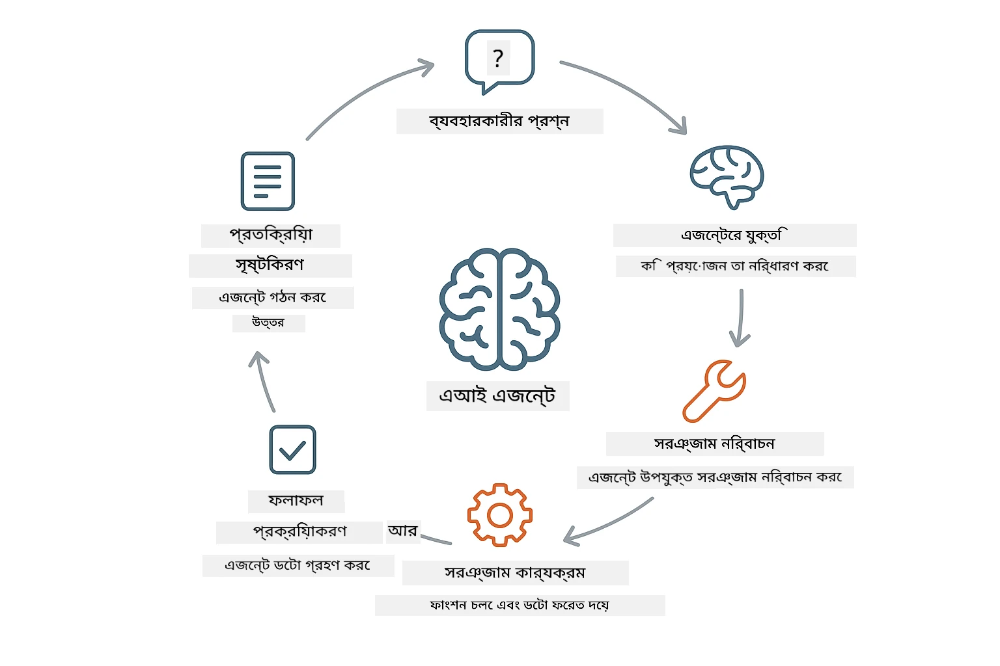
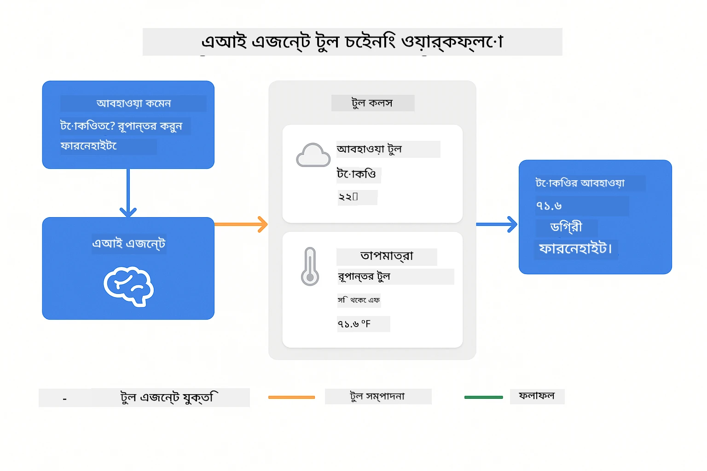
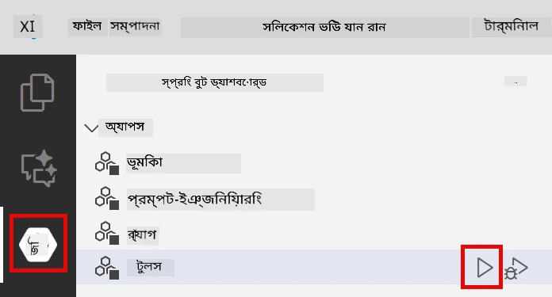
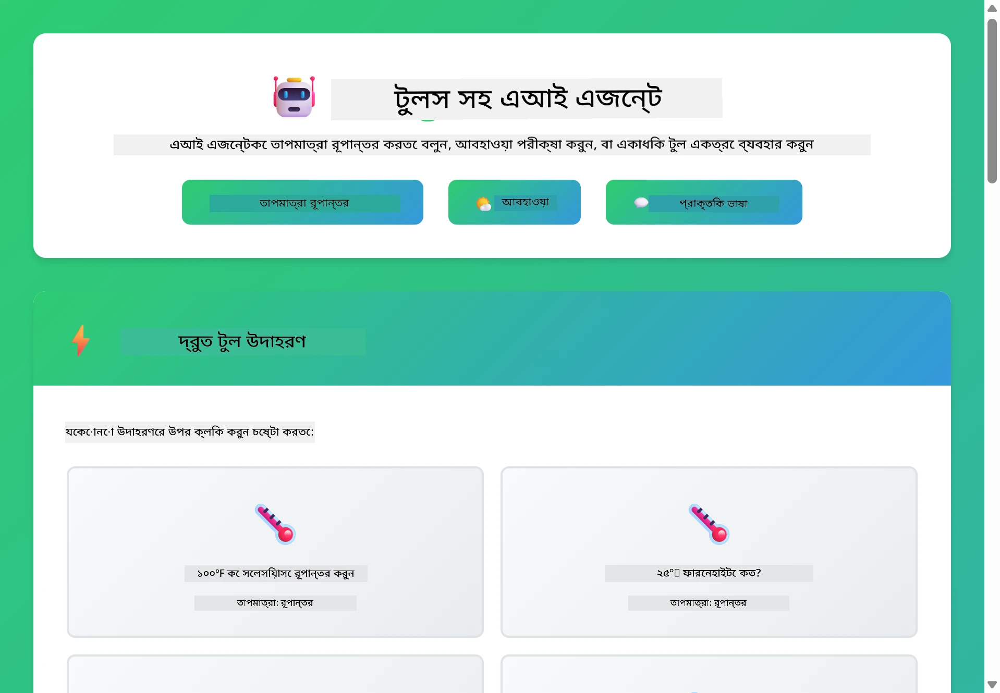

# Module 04: টুলসসহ AI এজেন্ট

## Table of Contents

- [আপনি যা শিখবেন](../../../04-tools)
- [প্রয়োজনীয়তাসমূহ](../../../04-tools)
- [টুলসসহ AI এজেন্ট বোঝা](../../../04-tools)
- [কীভাবে টুল কলিং কাজ করে](../../../04-tools)
  - [টুল সংজ্ঞা](../../../04-tools)
  - [নির্দেশ গ্রহণ](../../../04-tools)
  - [কার্যনির্বাহ](../../../04-tools)
  - [প্রতিক্রিয়া তৈরি](../../../04-tools)
- [টুল চেইনিং](../../../04-tools)
- [অ্যাপ্লিকেশন চালান](../../../04-tools)
- [অ্যাপ্লিকেশন ব্যবহার](../../../04-tools)
  - [সহজ টুল ব্যবহারের চেষ্টা](../../../04-tools)
  - [টুল চেইনিং পরীক্ষা করুন](../../../04-tools)
  - [কথোপকথনের প্রবাহ দেখুন](../../../04-tools)
  - [বিভিন্ন অনুরোধ নিয়ে পরীক্ষা-নিরীক্ষা](../../../04-tools)
- [মূল ধারণা](../../../04-tools)
  - [ReAct প্যাটার্ন (যুক্তি ও ক্রিয়া)](../../../04-tools)
  - [টুল বিবরণ গুরুত্বপূর্ণ](../../../04-tools)
  - [সেশন পরিচালনা](../../../04-tools)
  - [ত্রুটি পরিচালনা](../../../04-tools)
- [উপলব্ধ টুলস](../../../04-tools)
- [কখন টুল-ভিত্তিক এজেন্ট ব্যবহার করবেন](../../../04-tools)
- [পরবর্তী ধাপ](../../../04-tools)

## আপনি যা শিখবেন

এখন পর্যন্ত, আপনি শিখেছেন কীভাবে AI এর সাথে কথোপকথন করতে হয়, প্রম্পটগুলো কার্যকরভাবে গঠন করতে হয়, এবং উত্তরগুলোকে আপনার ডকুমেন্টে ভিত্তি করে তৈরি করতে হয়। তবে একটি মৌলিক সীমাবদ্ধতা রয়ে গেছে: ভাষা মডেল শুধুমাত্র টেক্সট তৈরি করতে পারে। তারা আবহাওয়া পরীক্ষা করতে পারে না, গণনা করতে পারে না, ডাটাবেস থেকে তথ্য নিতে পারে না বা বাহ্যিক সিস্টেমের সাথে ইন্টারঅ্যাক্ট করতে পারে না।

টুলস এ ক্ষেত্রে পরিবর্তন আনে। মডেলকে ফাংশনগুলোর অ্যাক্সেস দিলে, আপনি এটিকে একটি টেক্সট জেনারেটর থেকে একটি এজেন্টে রূপান্তরিত করেন যা কর্ম গ্রহণ করতে পারে। মডেল সিদ্ধান্ত নেয় কখন তার একটি টুল দরকার, কোন টুল ব্যবহার করবে এবং কী প্যারামিটার পাঠাবে। আপনার কোড ফাংশন চালায় এবং ফলাফল ফেরত দেয়। মডেল সেই ফলাফলটি তার উত্তরে অন্তর্ভুক্ত করে।

## প্রয়োজনীয়তাসমূহ

- মডিউল ০১ সম্পন্ন (Azure OpenAI রিসোর্স ডিপ্লয় করা হয়েছে)
- মূল ডিরেক্টরিতে `.env` ফাইল যেখানে Azure ক্রেডেনশিয়াল আছে (`azd up` দ্বারা তৈরি মডিউল ০১-এ)

> **দ্রষ্টব্য:** যদি আপনি মডিউল ০১ সম্পন্ন না করে থাকেন, আগে সেখানে দেওয়া ডিপ্লয়মেন্ট নির্দেশনা অনুসরণ করুন।

## টুলসসহ AI এজেন্ট বোঝা

> **📝 দ্রষ্টব্য:** এই মডিউলে "এজেন্ট" বলতে বোঝানো হচ্ছে সেই AI সহকারী যারা টুল কলিং ক্ষমতা যুক্ত। এটি ভিন্ন একটি বিষয়ে যা আমাদের [মডিউল ০৫: MCP](../05-mcp/README.md) এ থাকবে — যেখানে থাকবে স্বায়ত্তশাসিত এজেন্ট যারা পরিকল্পনা, স্মৃতি এবং বহু-ধাপ যুক্তি ব্যবহার করে।

একটি টুলসহ AI এজেন্ট যুক্তি ও কর্ম প্যাটার্ন (ReAct) অনুসরণ করে:

১. ব্যবহারকারী একটি প্রশ্ন করে  
২. এজেন্ট ভাবতে শুরু করে কী জানতে হবে  
৩. এজেন্ট সিদ্ধান্ত নেয় উত্তর দিতে টুল দরকার কিনা  
৪. যদি দরকার হয়, এজেন্ট সঠিক প্যারামিটার সহ উপযুক্ত টুল কল করে  
৫. টুল কার্যকর হয় এবং তথ্য ফেরত দেয়  
৬. এজেন্ট ফলাফল অন্তর্ভুক্ত করে চূড়ান্ত উত্তর প্রদান করে



*ReAct প্যাটার্ন — কীভাবে AI এজেন্ট যুক্তি বিবেচনা ও কর্মজীবন অতিক্রম করে সমস্যার সমাধান করে*

এটি স্বয়ংক্রিয়ভাবে ঘটে। আপনি টুলস এবং তাদের বিবরণ নির্ধারণ করেন। মডেল সিদ্ধান্ত নেয় কখন এবং কিভাবে তাদের ব্যবহার করবে।

## কীভাবে টুল কলিং কাজ করে

### টুল সংজ্ঞা

[WeatherTool.java](../../../04-tools/src/main/java/com/example/langchain4j/agents/tools/WeatherTool.java) | [TemperatureTool.java](../../../04-tools/src/main/java/com/example/langchain4j/agents/tools/TemperatureTool.java)

আপনি পরিষ্কার বর্ণনা এবং প্যারামিটার স্পেসিফিকেশন সহ ফাংশন নির্ধারণ করেন। মডেল সিস্টেম প্রম্পটে এই বর্ণনাগুলো দেখে এবং বুঝে প্রতিটি টুল কি করে।

```java
@Component
public class WeatherTool {
    
    @Tool("Get the current weather for a location")
    public String getCurrentWeather(@P("Location name") String location) {
        // আপনার আবহাওয়া অনুসন্ধান লজিক
        return "Weather in " + location + ": 22°C, cloudy";
    }
}

@AiService
public interface Assistant {
    String chat(@MemoryId String sessionId, @UserMessage String message);
}

// সহকারী স্বয়ংক্রিয়ভাবে Spring Boot দ্বারা সংযুক্ত হয়েছে:
// - ChatModel বিন
// - @Component ক্লাস থেকে সমস্ত @Tool পদ্ধতি
// - সেশন ব্যবস্থাপনার জন্য ChatMemoryProvider
```

> **🤖 [GitHub Copilot](https://github.com/features/copilot) চ্যাট দিয়ে চেষ্টা করুন:** [`WeatherTool.java`](../../../04-tools/src/main/java/com/example/langchain4j/agents/tools/WeatherTool.java) খুলুন এবং প্রশ্ন করুন:  
> - "মক ডেটার বদলে কীভাবে আসল OpenWeatherMap API ইন্টিগ্রেট করব?"  
> - "একটি ভালো টুল বর্ণনা কীভাবে হওয়া উচিত যা AI এর সঠিক ব্যবহার নিশ্চিত করে?"  
> - "টুল ইমপ্লিমেন্টেশনে API ত্রুটি ও রেট লিমিট কিভাবে হ্যান্ডেল করব?"  

### সিদ্ধান্ত গ্রহণ

যখন কেউ জিজ্ঞাসা করে "সিয়াটেলের আবহাওয়া কেমন?", মডেল বুঝে এটি আবহাওয়া টুল দরকার। এটি একটি ফাংশন কল তৈরি করে যেখানে লোকেশন প্যারামিটার "Seattle" নির্ধারিত থাকে।

### কার্যনির্বাহ

[AgentService.java](../../../04-tools/src/main/java/com/example/langchain4j/agents/service/AgentService.java)

Spring Boot স্বয়ংক্রিয়ভাবে `@AiService` ইন্টারফেসকে সমস্ত নিবন্ধিত টুলসের সাথে যুক্ত করে এবং LangChain4j টুল কলগুলো স্বয়ংক্রিয়ভাবে কার্যকর করে।

> **🤖 [GitHub Copilot](https://github.com/features/copilot) চ্যাট দিয়ে চেষ্টা করুন:** [`AgentService.java`](../../../04-tools/src/main/java/com/example/langchain4j/agents/service/AgentService.java) খুলুন এবং প্রশ্ন করুন:  
> - "ReAct প্যাটার্ন কীভাবে কাজ করে এবং কেন AI এজেন্টদের জন্য কার্যকর?"  
> - "এজেন্ট কীভাবে সিদ্ধান্ত নেয় কোন টুল এবং কোন ক্রমে ব্যবহার করবেন?"  
> - "টুল কার্যনির্বাহ ব্যর্থ হলে কী হবে — কিভাবে ত্রুটি সঠিকভাবে হ্যান্ডেল করব?"  

### প্রতিক্রিয়া তৈরি

মডেল আবহাওয়ার ডেটা পায় এবং এটি ব্যবহারকারীর জন্য প্রাকৃত ভাষায় উত্তরে রূপান্তর করে।

### কেন ডিক্লেয়ারেটিভ AI সার্ভিস ব্যবহার করবেন?

এই মডিউল LangChain4j এর Spring Boot ইন্টিগ্রেশন ব্যবহার করে ডিক্লেয়ারেটিভ `@AiService` ইন্টারফেস:

- **Spring Boot অটো-ওয়্যারিং** - চ্যাটমডেল ও টুলস স্বয়ংক্রিয় ইনজেকশন  
- **@MemoryId প্যাটার্ন** - স্বয়ংক্রিয় সেশন ভিত্তিক মেমরি ব্যবস্থাপনা  
- **একক ইনস্ট্যান্স** - সহকারী একবার তৈরি হয়ে পুনরায় ব্যবহার হয় উন্নত পারফরম্যান্স জন্য  
- **টাইপ-সেফ এক্সিকিউশন** - Java মেথড সরাসরি টাইপ কনভার্সন সহ কল করা হয়  
- **মাল্টি-টার্ন অর্কেস্ট্রেশন** - টুল চেইনিং স্বয়ংক্রিয়ভাবে পরিচালনা করে  
- **জিরো বয়লারপ্লেট** - ম্যানুয়াল AiServices.builder() কলের প্রয়োজন নেই  

বিকল্প পন্থা (ম্যানুয়াল `AiServices.builder()`) বেশি কোড ও Spring Boot ইন্টিগ্রেশন সুবিধা মিস করে।

## টুল চেইনিং

**টুল চেইনিং** - AI একাধিক টুল ক্রমানুসারে কল করতে পারে। উদাহরণস্বরূপ, জিজ্ঞেস করুন "সিয়াটেলে আবহাওয়া কেমন এবং ছাতা এনেছে কি না?" এবং দেখুন কীভাবে এটি `getCurrentWeather` কল করে রেইন গিয়ারের ব্যাপারে যুক্তি তৈরি করে।

<a href="images/tool-chaining.png"></a>

*ক্রমাগত টুল কল - এক টুলের আউটপুট পরবর্তী সিদ্ধান্তে ব্যবহার হয়*

**নমনীয় ব্যর্থতা** - এমন একটি শহরের আবহাওয়া জিজ্ঞাসা করুন যা মক ডেটাতে নেই। টুল একটি ত্রুটি বার্তা দেয় এবং AI ব্যাখ্যা করে কেন এটি সাহায্য করতে পারছে না। টুলস নিরাপদে ব্যর্থ হয়।

এটি একটি একক কথোপকথন টার্নে ঘটে। এজেন্ট স্বয়ংক্রিয়ভাবে একাধিক টুল কল পরিচালনা করে।

## অ্যাপ্লিকেশন চালান

**ডিপ্লয়মেন্ট যাচাই করুন:**

মডিউল ০১ চলাকালীন তৈরি `.env` ফাইলটি মূল ডিরেক্টরিতে আছে তা নিশ্চিত করুন:
```bash
cat ../.env  # AZURE_OPENAI_ENDPOINT, API_KEY, DEPLOYMENT দেখানো উচিত
```

**অ্যাপ্লিকেশন শুরু করুন:**

> **দ্রষ্টব্য:** আপনি যদি মডিউল ০১ থেকে `./start-all.sh` ব্যবহার করে সমস্ত অ্যাপ্লিকেশন ইতিমধ্যেই শুরু করে থাকেন, তাহলে এই মডিউলটি পোর্ট 8084 এ চলছে। নিচের স্টার্ট কমান্ডগুলো উপেক্ষা করে সরাসরি http://localhost:8084 তে যান।

**বিকল্প ১: Spring Boot ড্যাশবোর্ড ব্যবহার (VS Code ইউজারদের জন্য সুপারিশকৃত)**

ডেভ কন্টেইনারে Spring Boot ড্যাশবোর্ড এক্সটেনশন অন্তর্ভুক্ত, যা সমস্ত Spring Boot অ্যাপ্লিকেশন ব্যবস্থাপনা করার ভিজ্যুয়াল ইন্টারফেস দেয়। VS Code এর বাম পাশে অ্যাক্টিভিটি বার থেকে Spring Boot আইকন খুঁজে নিন।

ড্যাশবোর্ড থেকে আপনি:
- ওয়ার্কস্পেসের সব Spring Boot অ্যাপ দেখতে পারবেন  
- এক ক্লিকে অ্যাপ চালু/বন্ধ করতে পারবেন  
- রিয়েল-টাইমে অ্যাপ্লিকেশন লগ দেখতে পারবেন  
- অ্যাপ্লিকেশন স্ট্যাটাস মনিটর করতে পারবেন  

শুধু "tools" এর পাশে প্লে বাটনে ক্লিক করে এই মডিউলটি শুরু করুন, অথবা সব মডিউল একসাথে চালু করুন।



**বিকল্প ২: শেল স্ক্রিপ্ট ব্যবহার**

সকল ওয়েব অ্যাপ্লিকেশন (মডুল ০১-০৪) শুরু করুন:

**Bash:**
```bash
cd ..  # মূল ডিরেক্টরি থেকে
./start-all.sh
```

**PowerShell:**
```powershell
cd ..  # রুট ডিরেক্টরি থেকে
.\start-all.ps1
```

অথবা শুধুমাত্র এই মডিউল শুরু করুন:

**Bash:**
```bash
cd 04-tools
./start.sh
```

**PowerShell:**
```powershell
cd 04-tools
.\start.ps1
```

উভয় স্ক্রিপ্ট স্বয়ংক্রিয়ভাবে মূল `.env` ফাইল থেকে পরিবেশ পরিবর্তনশীল লোড করে এবং যদি JAR ফাইল না থাকে তবে সেগুলো তৈরি করবে।

> **দ্রষ্টব্য:** আপনি যদি শুরু করার আগে সব মডিউল ম্যানুয়ালি বিল্ড করতে চান:  
>  
> **Bash:**  
> ```bash
> cd ..  # Go to root directory
> mvn clean package -DskipTests
> ```
>  
> **PowerShell:**  
> ```powershell
> cd ..  # Go to root directory
> mvn clean package -DskipTests
> ```

আপনার ব্রাউজারে http://localhost:8084 খুলুন।

**বন্দ করার জন্য:**

**Bash:**
```bash
./stop.sh  # শুধুমাত্র এই মডিউল
# অথবা
cd .. && ./stop-all.sh  # সব মডিউলগুলো
```

**PowerShell:**
```powershell
.\stop.ps1  # শুধুমাত্র এই মডিউল
# অথবা
cd ..; .\stop-all.ps1  # সমস্ত মডিউল
```

## অ্যাপ্লিকেশন ব্যবহার

এই অ্যাপ্লিকেশনটি একটি ওয়েব ইন্টারফেস প্রদান করে যেখানে আপনি এমন একটি AI এজেন্টের সাথে ইন্টারঅ্যাক্ট করতে পারেন যার কাছে আবহাওয়া এবং তাপমাত্রা রূপান্তর টুলস আছে।

<a href="images/tools-homepage.png"></a>

*AI এজেন্ট টুলস ইন্টারফেস - দ্রুত উদাহরণ এবং টুলসের সাথে কথা বলার জন্য চ্যাট ইন্টারফেস*

### সহজ টুল ব্যবহারের চেষ্টা

সরল অনুরোধ দিয়ে শুরু করুন: "100 ডিগ্রি ফারেনহাইটকে সেলসিয়াসে রূপান্তর করো"। এজেন্ট বুঝে পায় তাকে তাপমাত্রা রূপান্তর টুল ব্যবহার করতে হবে, সঠিক প্যারামিটার নিয়ে কল করে এবং ফলাফল ফেরত দেয়। লক্ষ্য করুন কতটা প্রাকৃত এটি লাগে — আপনি নির্দিষ্ট করেননি কোন টুল ব্যবহার করতে হবে বা কিভাবে কল করতে হবে।

### টুল চেইনিং পরীক্ষা করুন

এখন কিছু জটিল চেষ্টা করুন: "সিয়াটেলের আবহাওয়া কেমন এবং এটিকে ফারেনহাইটে রূপান্তর করো?" ধাপে ধাপে এজেন্ট কাজ করে। প্রথমে আবহাওয়া (সেলসিয়াসে) পায়, বুঝে ফারেনহাইটে রূপান্তর করতে হবে, রূপান্তর টুল কল করে, এবং উভয় ফলাফল একত্রে একটি উত্তরে দেয়।

### কথোপকথনের প্রবাহ দেখুন

চ্যাট ইন্টারফেস কথোপকথনের ইতিহাস সংরক্ষণ করে, যা আপনাকে মাল্টি-টার্ন ইন্টারঅ্যাকশন করতে দেয়। আপনি আগের সকল প্রশ্ন ও উত্তর দেখে কথোপকথন ট্র্যাক করতে পারেন এবং কিভাবে এজেন্ট একাধিক বিনিময়ে প্রসঙ্গ তৈরি করে তা বুঝতে পারেন।

<a href="images/tools-conversation-demo.png"></a>

*মাল্টি-টার্ন কথোপকথনে সহজ রূপান্তর, আবহাওয়া অনুসন্ধান, এবং টুল চেইনিং দেখানো হয়েছে*

### বিভিন্ন অনুরোধ নিয়ে পরীক্ষা-নিরীক্ষা করুন

বিভিন্ন সংমিশ্রণ চেষ্টা করুন:  
- আবহাওয়া অনুসন্ধান: "টোকিওর আবহাওয়া কেমন?"  
- তাপমাত্রা রূপান্তর: "২৫°C কত K?"  
- সংযুক্ত প্রশ্ন: "প্যারিসের আবহাওয়া চেক করো এবং বলো এটি ২০°C-এর উপরে কি?"  

দৃষ্টিনন্দন হবে কিভাবে এজেন্ট প্রাকৃতিক ভাষা ব্যাখ্যা করে এবং উপযুক্ত টুল কলের সাথে ম্যাপ করে।

## মূল ধারণা

### ReAct প্যাটার্ন (যুক্তি ও কর্ম)

এজেন্ট যুক্তি গ্রহণ (কি করতে হবে) এবং কাজ করা (টুল ব্যবহার) এর মধ্যে পার্থক্য করে। এই প্যাটার্নটি শুধুমাত্র নির্দেশ অনুসরণের বাইরে গিয়ে স্বায়ত্তশাসিত সমস্যা সমাধান সক্ষম করে।

### টুল বিবরণ গুরুত্বপূর্ণ

আপনার টুল বিবরণের গুণগত মান সরাসরি প্রভাব ফেলে কিভাবে এজেন্ট সেগুলো ব্যবহারে দক্ষ হয়। স্পষ্ট, নির্দিষ্ট বর্ণনা মডেলকে বুঝতে সাহায্য করে কখন এবং কীভাবে প্রতিটি টুল কল করতে হবে।

### সেশন পরিচালনা

`@MemoryId` অ্যানোটেশন স্বয়ংক্রিয় সেশন ভিত্তিক মেমরি পরিচালনা সক্ষম করে। প্রতিটি সেশন আইডি এর নিজস্ব `ChatMemory` ইনস্ট্যান্স পায় যা `ChatMemoryProvider` বিন দ্বারা পরিচালিত হয়, তাই ম্যানুয়াল মেমরি ট্র্যাকের দরকার নেই।

### ত্রুটি পরিচালনা

টুলস ব্যর্থ হতে পারে — API টাইমআউট, অনিয়মিত প্যারামিটার, বাহ্যিক সার্ভিস ডাউন ইত্যাদি। প্রোডাকশন এজেন্টদের ট্রুতি হ্যান্ডেলিং দরকার যেন মডেল সমস্যা ব্যাখ্যা করতে পারে বা বিকল্প চেষ্টা করতে পারে।

## উপলব্ধ টুলস

**আবহাওয়া টুলস** (ডেমোনস্ট্রেশনের জন্য মক ডেটা):  
- একটি স্থানের বর্তমান আবহাওয়া পাওয়া  
- একাধিক দিনের পূর্বাভাস পাওয়া  

**তাপমাত্রা রূপান্তর টুলস**:  
- সেলসিয়াস থেকে ফারেনহাইট  
- ফারেনহাইট থেকে সেলসিয়াস  
- সেলসিয়াস থেকে কেভলিন  
- কেভলিন থেকে সেলসিয়াস  
- ফারেনহাইট থেকে কেভলিন  
- কেভলিন থেকে ফারেনহাইট  

এগুলো সহজ উদাহরণ, তবে প্যাটার্ন যে কোনো ফাংশনে প্রয়োগযোগ্য: ডাটাবেস কোয়েরি, API কল, গণনা, ফাইল অপারেশন, বা সিস্টেম কমান্ড।

## কখন টুল-ভিত্তিক এজেন্ট ব্যবহার করবেন

**টুল ব্যবহার করুন যখন:**  
- উত্তর দিতে রিয়েল-টাইম ডেটা প্রয়োজন (আবহাওয়া, স্টক মূল্য, ইনভেন্টরি)  
- সরল গণনার বাইরে কাজ করতে হয়  
- ডাটাবেস বা API অ্যাক্সেস করতে হয়  
- কর্ম গ্রহণ যেমন ইমেল পাঠানো, টিকেট তৈরি, রেকর্ড আপডেট দরকার  
- বিভিন্ন ডেটা উৎস একত্রিত করতে হয়  

**টুল ব্যবহার ডিজাইন করবেন না যখন:**  
- প্রশ্ন সাধারণ জ্ঞান থেকে উত্তরযোগ্য  
- উত্তর সম্পূর্ণ কথোপকথনমূলক  
- টুল ব্যবহারের কারণে উত্তর বিলম্বিত হলে ব্যবহারকারীর অভিজ্ঞতা খারাপ হবে  

## পরবর্তী ধাপ

**পরবর্তী মডিউল:** [০৫-mcp - মডেল কনটেক্সট প্রোটোকল (MCP)](../05-mcp/README.md)

---

**নেভিগেশন:** [← পূর্বের: মডিউল ০৩ - RAG](../03-rag/README.md) | [মেইনে ফিরে যান](../README.md) | [পরবর্তী: মডিউল ০৫ - MCP →](../05-mcp/README.md)

---

<!-- CO-OP TRANSLATOR DISCLAIMER START -->
**অস্বীকারোক্তি**:  
এই নথিটি AI অনুবাদ পরিষেবা [Co-op Translator](https://github.com/Azure/co-op-translator) ব্যবহার করে অনূদিত হয়েছে। আমরা যথাসাধ্য সঠিকতা নিশ্চিত করার চেষ্টা করি, তবে দয়া করে অবশ্যই জানুন যে স্বয়ংক্রিয় অনুবাদে ত্রুটি বা অসঙ্গতি থাকতে পারে। মূল নথি তার মুল ভাষায় সর্বোচ্চ প্রাধান্যপ্রাপ্ত উৎস বিবেচনা করতে হবে। গুরুত্বপূর্ণ তথ্যের জন্য পেশাদার মানব অনুবাদ সুপারিশ করা হয়। এই অনুবাদের ব্যবহার থেকে সৃষ্ট কোনো ভুল বোঝাবুঝি বা ভুল ব্যাখ্যার জন্য আমরা দায়ী নই।
<!-- CO-OP TRANSLATOR DISCLAIMER END -->