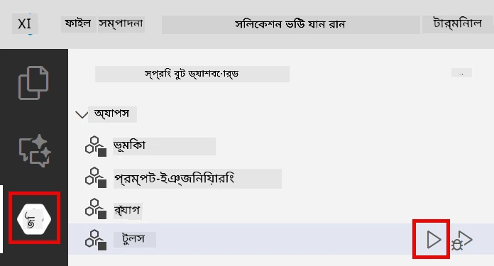
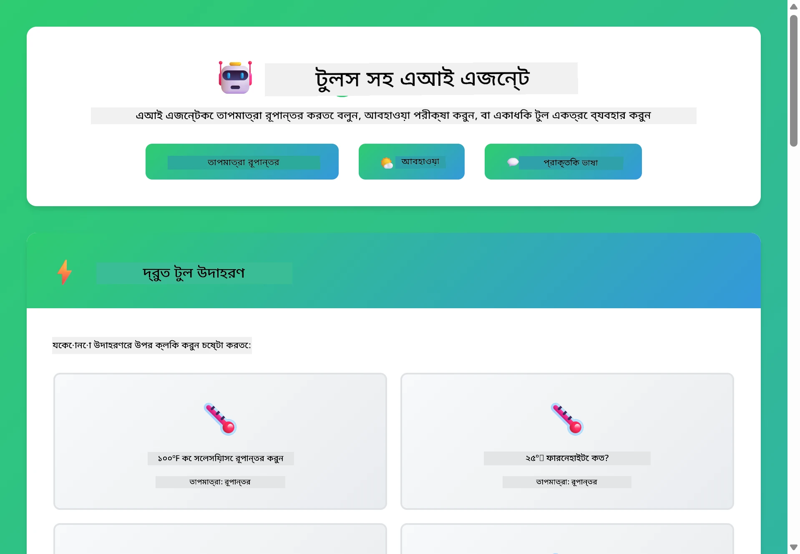
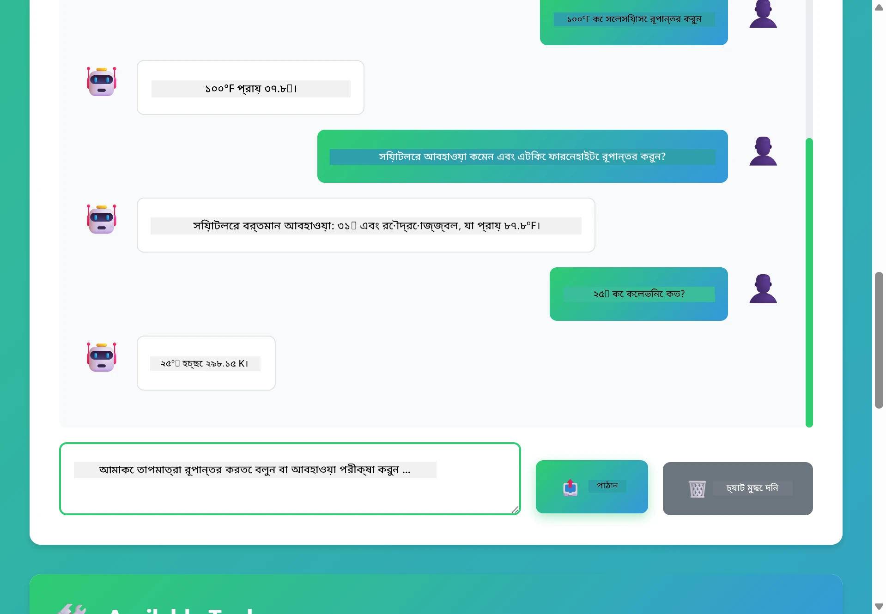

# মডিউল ০৪: টুলসসহ AI এজেন্টস

## বিষয়বস্তু তালিকা

- [ভিডিও ওয়াকথ্রু](#ভিডিও-ওয়াকথ্রু)
- [আপনি কি শিখবেন](#আপনি-কি-শিখবেন)
- [প্রাক-শর্ত](#প্রাক-শর্ত)
- [টুলসসহ AI এজেন্টস বোঝা](#টুলসসহ-ai-এজেন্টস-বোঝা)
- [কিভাবে টুল কলিং কাজ করে](#কিভাবে-টুল-কলিং-কাজ-করে)
  - [টুল সংজ্ঞা](#টুল-সংজ্ঞা)
  - [সিদ্ধান্ত গ্রহণ](#সিদ্ধান্ত-গ্রহণ)
  - [কার্যকরী اجرا](#কার্যকরী-اجرا)
  - [প্রতিক্রিয়া প্রস্তুতি](#প্রতিক্রিয়া-প্রস্তুতি)
  - [স্থাপত্য: স্প্রিং বুট অটো-ওয়্যারিং](#স্থাপত্য-স্প্রিং-বুট-অটো-ওয়্যারিং)
- [টুল চেইনিং](#টুল-চেইনিং)
- [অ্যাপ্লিকেশন চালান](#অ্যাপ্লিকেশন-চালান)
- [অ্যাপ্লিকেশন ব্যবহার](#অ্যাপ্লিকেশন-ব্যবহার)
  - [সহজ টুল ব্যবহার চেষ্টা করুন](#সহজ-টুল-ব্যবহার-চেষ্টা-করুন)
  - [টুল চেইনিং পরীক্ষা করুন](#টুল-চেইনিং-পরীক্ষা-করুন)
  - [আলোচনা প্রবাহ দেখুন](#কথোপকথনের-প্রবাহ-দেখুন)
  - [বিভিন্ন অনুরোধ নিয়ে পরীক্ষা করুন](#বিভিন্ন-অনুরোধ-নিয়ে-পরীক্ষা-করুন)
- [মূল ধারণা](#মূল-ধারণাসমূহ)
  - [ReAct প্যাটার্ন (যুক্তিবিদ্যা ও কার্যক্রম)](#react-প্যাটার্ন-যুক্তি-ও-কর্ম)
  - [টুল বর্ণনা গুরুত্বপূর্ণ](#টুল-বর্ণনা-গুরুত্বপূর্ণ)
  - [সেশন ব্যবস্থাপনা](#সেশন-ম্যানেজমেন্ট)
  - [ত্রুটি পরিচালনা](#ত্রুটি-হ্যান্ডলিং)
- [উপলব্ধ টুলস](#উপলব্ধ-টুলস)
- [কখন টুল-ভিত্তিক এজেন্ট ব্যবহার করবেন](#কখন-টুল-ভিত্তিক-এজেন্ট-ব্যবহার-করবেন)
- [টুলস বনাম RAG](#টুলস-বনাম-rag)
- [পরবর্তী ধাপ](#পরবর্তী-ধাপ)

## ভিডিও ওয়াকথ্রু

এই লাইভ সেশনটি দেখুন যা এই মডিউল শুরু করার পদ্ধতি ব্যাখ্যা করে:

<a href="https://www.youtube.com/watch?v=O_J30kZc0rw"></a>

## আপনি কি শিখবেন

এখন পর্যন্ত, আপনি শিখেছেন কিভাবে AI-এর সাথে কথোপকথন করবেন, প্রম্পটগুলো কার্যকরভাবে গঠন করবেন, এবং আপনার ডকুমেন্টে প্রতিক্রিয়া ভিত্তি করবেন। কিন্তু এখনো একটি মৌলিক সীমাবদ্ধতা রয়ে গেছে: ভাষার মডেল শুধুমাত্র টেক্সট তৈরি করতে পারে। এটি আবহাওয়া চেক করতে, গণনা করতে, ডেটাবেজ প্রশ্ন করতে বা বাইরের সিস্টেমের সাথে ইন্টারঅ্যাক্ট করতে পারবে না।

টুলস এটা পরিবর্তন করে। মডেলকে কল করতে পারার জন্য ফাংশনের প্রবেশাধিকার দিয়ে, আপনি এটিকে টেক্সট জেনারেটর থেকে এমন একটি এজেন্টে পরিণত করেন যা পদক্ষেপ নিতে পারে। মডেল সিদ্ধান্ত নেয় কখন একটি টুল দরকার, কোন টুল ব্যবহার করবে এবং কি প্যারামিটার পাঠাবে। আপনার কোড ফাংশনটি চালায় এবং ফলাফল ফেরত দেয়। মডেল ঐ ফলাফলকে তার প্রতিক্রিয়ায় অন্তর্ভুক্ত করে।

## প্রাক-শর্ত

- সম্পন্ন [মডিউল ০১ - পরিচিতি](../01-introduction/README.md) (Azure OpenAI রিসোর্স ডিপ্লয় করা হয়েছে)
- পূর্ববর্তী মডিউলগুলি সম্পন্ন করা সুপারিশ করা হয়েছে (এই মডিউল [মডিউল ০৩ এর RAG ধারণা](../03-rag/README.md) উল্লেখ করে টুলস বনাম RAG তুলনায়)
- `.env` ফাইল মূল ডিরেক্টরিতে Azure প্রমাণপত্রাদি সহ (মডিউল ০১-এ `azd up` দ্বারা তৈরি)

> **বিঃদ্রঃ:** যদি আপনি মডিউল ০১ সম্পন্ন না করে থাকেন, আগে সেখানে ডিপ্লয়মেন্ট নির্দেশনাগুলো অনুসরণ করুন।

## টুলসসহ AI এজেন্টস বোঝা

> **📝 নোট:** এই মডিউলে "এজেন্টস" শব্দটি টুল কলিং সক্ষমতা সহ উন্নত AI সহকারী বোঝায়। এটি ভিন্ন একটি বিষয় হলো **Agentic AI** প্যাটার্নস (স্বয়ংক্রিয় এজেন্টস যাদের পরিকল্পনা, স্মৃতি, ও বহু-পর্ব যুক্তি থাকে) যা আমরা [মডিউল ০৫: MCP](../05-mcp/README.md)-এ আলোচনা করব।

টুল ছাড়া, একটি ভাষার মডেল কেবল তার প্রশিক্ষণ ডেটা থেকে টেক্সট তৈরি করতে পারে। বর্তমান আবহাওয়া জানতে চাইলে, এটি অনুমান করতে হবে। টুল দিলে, এটি একটি আবহাওয়া API কল করতে পারে, গণনা করতে পারে বা ডেটাবেজ প্রশ্ন করতে পারে — তারপর ঐ বাস্তব ফলাফলগুলোকে তার প্রতিক্রিয়ায় নিয়ে আসতে পারে।


*বিনা টুলে মডেল অনুমান করে — টুলসহ এটি API কল করতে পারে, গণনা চালাতে পারে, এবং রিয়েল-টাইম ডেটা ফেরত দিতে পারে।*

একটি টুলসহ AI এজেন্ট অনুসরণ করে **যুক্তিবিদ্যা ও কার্যক্রম (ReAct)** প্যাটার্ন। মডেল শুধু সাড়া দেয় না — এটি চিন্তা করে কি দরকার, টুল কল করে কাজ করে, ফলাফল দেখে, এবং সিদ্ধান্ত নেয় আবার কাজ করবে কিনা বা চূড়ান্ত উত্তর দেবে:

১. **যুক্তি করো** — এজেন্ট ব্যবহারকারীর প্রশ্ন বিশ্লেষণ করে কি তথ্য দরকার দিচ্ছে নির্ধারণ করে  
২. **কার্যকরী হও** — এজেন্ট সঠিক টুল নির্বাচন করে, সঠিক প্যারামিটার জেনারেট করে, এবং কল করে  
৩. **পর্যবেক্ষণ করো** — এজেন্ট টুলের আউটপুট পায় এবং ফলাফল মূল্যায়ন করে  
৪. **পুনরাবৃত্তি বা প্রতিক্রিয়া প্রদান করো** — যদি বেশি তথ্য দরকার, এজেন্ট পুনরায় লুপ করে; নয়তো প্রাকৃতিক ভাষায় উত্তর রচনা করে  


*ReAct চক্র — এজেন্ট কি করব তা ভাবছে, টুল কল করে কাজ করছে, ফলাফল পর্যবেক্ষণ করছে, এবং লুপ করে যতক্ষণ না চূড়ান্ত উত্তর দিতে পারে।*

এটি স্বয়ংক্রিয়ভাবে ঘটে। আপনি টুলগুলি ও তাদের বর্ণনা নির্ধারণ করেন। মডেল সিদ্ধান্ত নেয় কখন এবং কিভাবে সেগুলো ব্যবহার করবে।

## কিভাবে টুল কলিং কাজ করে

### টুল সংজ্ঞা

[WeatherTool.java](../../../04-tools/src/main/java/com/example/langchain4j/agents/tools/WeatherTool.java) | [TemperatureTool.java](../../../04-tools/src/main/java/com/example/langchain4j/agents/tools/TemperatureTool.java)

আপনি ফাংশনগুলো স্পষ্ট বর্ণনা এবং প্যারামিটার স্পেসিফিকেশনের সাথে সংজ্ঞায়িত করেন। মডেল এই বর্ণনাগুলো তার সিস্টেম প্রম্পটে দেখে এবং বুঝতে পারে প্রতিটি টুল কি করে।

```java
@Component
public class WeatherTool {
    
    @Tool("Get the current weather for a location")
    public String getCurrentWeather(@P("Location name") String location) {
        // আপনার আবহাওয়ার অনুসন্ধান লজিক
        return "Weather in " + location + ": 22°C, cloudy";
    }
}

@AiService
public interface Assistant {
    String chat(@MemoryId String sessionId, @UserMessage String message);
}

// Spring Boot স্বয়ংক্রিয়ভাবে সহকারীকে যুক্ত করে নিচের সাথে:
// - ChatModel বীন
// - @Component ক্লাস থেকে সকল @Tool পদ্ধতি
// - সেশন পরিচালনার জন্য ChatMemoryProvider
```

নীচের ডায়াগ্রাম প্রতিটি অ্যানোটেশন ভাঙ্গে এবং দেখায় কিভাবে প্রতিটা অংশ AI-কে সাহায্য করে কখন টুল কল করতে হবে এবং কি আর্গুমেন্ট পাঠাতে হবে:


*একটি টুল সংজ্ঞার কাঠামো — @Tool AI-কে বলে কখন এটি ব্যবহার করতে, @P প্রতিটি প্যারামিটার বর্ণনা করে, এবং @AiService স্টার্টআপে সবকিছু সংযুক্ত করে।*

> **🤖 [GitHub Copilot](https://github.com/features/copilot) চ্যাট দিয়ে চেষ্টা করুন:** [`WeatherTool.java`](../../../04-tools/src/main/java/com/example/langchain4j/agents/tools/WeatherTool.java) খুলুন এবং জিজ্ঞাসা করুন:  
> - "কিভাবে বাস্তব আবহাওয়া API যেমন OpenWeatherMap ইন্টিগ্রেট করব মক ডেটার পরিবর্তে?"  
> - "কী ভালো টুল বর্ণনা তৈরি করে যা AI-কে সঠিক ব্যবহার করতে সাহায্য করে?"  
> - "API এরর এবং রেট লিমিট কিভাবে হ্যান্ডেল করব টুল ইমপ্লিমেন্টেশনে?"

### সিদ্ধান্ত গ্রহণ

যখন ব্যবহারকারী জিজ্ঞাসা করে "সিয়াটেলের আবহাওয়া কেমন?", মডেল যেকোনো টুল এলোমেলোভাবে বেছে নেয় না। এটি ব্যবহারকারীর উদ্দেশ্য প্রতিটি টুলের বর্ণনার সাথে তুলনা করে, প্রাসঙ্গিকতার জন্য স্কোর করে, এবং সেরা মিল নির্বাচন করে। পরে সঠিক প্যারামিটার সহ একটি কাঠামোবদ্ধ ফাংশন কল তৈরি করে — এখানে, `location` কে `"Seattle"` সেট করে।

যদি কোনো টুল ব্যবহারকারীর অনুরোধ মেলাতে না পারে, মডেল তার নিজের জ্ঞান থেকে উত্তর দেয়। যদি একাধিক টুল মেলে তবে সবচেয়ে নির্দিষ্টটি বেছে নেয়।


*মডেল ব্যবহারকারীর উদ্দেশ্যের বিরুদ্ধে প্রতিটি টুল মূল্যায়ন করে এবং সেরা মিল নির্বাচন করে — এ জন্য স্পষ্ট, নির্দিষ্ট টুল বর্ণনা লেখা গুরুত্বপূর্ণ।*

### কার্যকরী اجرا

[AgentService.java](../../../04-tools/src/main/java/com/example/langchain4j/agents/service/AgentService.java)

স্প্রিং বুট ডিক্লারেটিভ `@AiService` ইন্টারফেসটির সাথে সমস্ত নিবন্ধিত টুলস অটো-ওয়্যার করে, এবং LangChain4j স্বয়ংক্রিয়ভাবে টুল কল চালায়। পিছনের দৃশ্যে, একটি পূর্ণাঙ্গ টুল কল ছয় ধাপে প্রবাহিত হয় — ব্যবহারকারীর প্রাকৃতিক ভাষার প্রশ্ন থেকে শুরু করে পুনরায় প্রাকৃতিক ভাষার উত্তর পর্যন্ত:


*শেষ থেকে শেষ পর্যন্ত প্রবাহ — ব্যবহারকারী প্রশ্ন করে, মডেল একটি টুল বেছে নেয়, LangChain4j সেটি চালায়, এবং মডেল ফলাফলকে একটি প্রাকৃতিক প্রতিক্রিয়ায় বুনে দেয়।*

পিছনের দৃশ্যে, `AiServices` যেকোনো টুলের জন্য টুল-কলিং লুপ চালায় — এখানে একটি সাধারণ `Calculator` দিয়ে উদাহরণ দেওয়া হয়েছে। নিচের সিকুয়েন্স ডায়াগ্রামটি ঠিক কি ঘটে তা দেখায়:


*টুল-কলিং লুপ — `AiServices` আপনার বার্তা ও টুল স্কিমাস LLM-এ পাঠায়, LLM `add(42, 58)` মত ফাংশন কল দিয়ে উত্তর দেয়, LangChain4j লোকালি `Calculator` মেথড চালায়, এবং ফলাফল চূড়ান্ত উত্তরের জন্য ফেরত দেয়।*

> **🤖 [GitHub Copilot](https://github.com/features/copilot) চ্যাট দিয়ে চেষ্টা করুন:** [`AgentService.java`](../../../04-tools/src/main/java/com/example/langchain4j/agents/service/AgentService.java) খুলুন এবং জিজ্ঞাসা করুন:  
> - "ReAct প্যাটার্ন কিভাবে কাজ করে এবং AI এজেন্টসের জন্য কেন কার্যকর?"  
> - "এজেন্ট কিভাবে সিদ্ধান্ত নেয় কোন টুল ব্যবহার করতে এবং কি ক্রমে?"  
> - "যদি কোনো টুল কার্যকরী করা ব্যর্থ হয় — শক্তভাবে ত্রুটি কীভাবে হ্যান্ডেল করব?"

### প্রতিক্রিয়া প্রস্তুতি

মডেল আবহাওয়ার তথ্য পায় এবং এটি ব্যবহারকারীর জন্য প্রাকৃতিক ভাষায় প্রতিক্রিয়া তৈরি করে।

### স্থাপত্য: স্প্রিং বুট অটো-ওয়্যারিং

এই মডিউলটি LangChain4j এর স্প্রিং বুট ইন্টিগ্রেশনের সাথে ডিক্লারেটিভ `@AiService` ইন্টারফেস ব্যবহার করে। স্টার্টআপে স্প্রিং বুট প্রতিটি `@Component` খুঁজে পায় যা `@Tool` মেথড ধারণ করে, আপনার `ChatModel` বিন এবং `ChatMemoryProvider` — তারপর এগুলো একটি একক `Assistant` ইন্টারফেসে একত্রিত করে শূন্য বয়লারপ্লেট দিয়ে।


*@AiService ইন্টারফেস ChatModel, টুল উপাদান, এবং মেমোরি প্রোভাইডারকে একত্রিত করে — স্প্রিং বুট সব ওয়্যারিং স্বয়ংক্রিয়ভাবে করে।*

এখানে সম্পূর্ণ অনুরোধ জীবনচক্র একটি সিকুয়েন্স ডায়াগ্রামে — HTTP অনুরোধ থেকে শুরু করে কন্ট্রোলার, সার্ভিস, অটো-ওয়্যারড প্রোঅক্সি পর্যন্ত, এবং টুল কার্যকরী করতে ফিরে যাওয়া:


*সম্পূর্ণ স্প্রিং বুট অনুরোধ জীবনচক্র — HTTP অনুরোধ কন্ট্রোলার ও সার্ভিস হয়ে অটো-ওয়্যারড Assistant প্রোঅক্সিতে যায়, যা স্বয়ংক্রিয়ভাবে LLM ও টুল কলসমূহ সমন্বয় করে।*

এই পদ্ধতির প্রধান সুবিধাসমূহ:

- **স্প্রিং বুট অটো-ওয়্যারিং** — ChatModel এবং টুলস স্বয়ংক্রিয় ইনজেকশন  
- **@MemoryId প্যাটার্ন** — স্বয়ংক্রিয় সেশন-ভিত্তিক মেমোরি ব্যবস্থাপনা  
- **একক ইনস্ট্যান্স** — অ্যাসিস্ট্যান্ট একবার তৈরি করে উন্নত পারফরমেন্সের জন্য পুনর্ব্যবহার  
- **টাইপ-সেফ কার্যকরী اجرا** — জাভা মেথড সরাসরি টাইপ রূপান্তরের মাধ্যমে কল করা  
- **মাল্টি-টার্ন অর্কেস্ট্রেশন** — স্বয়ংক্রিয় টুল চেইনিং পরিচালনা  
- **শূন্য বয়লারপ্লেট** — কোনো ম্যানুয়াল `AiServices.builder()` কল বা মেমোরি HashMap নেই  

বিকল্প পদ্ধতিগুলি (ম্যানুয়াল `AiServices.builder()`) অনেক কোড প্রয়োজন এবং স্প্রিং বুট ইন্টিগ্রেশনের সুবিধাগুলো মিস করে।

## টুল চেইনিং

**টুল চেইনিং** — টুল-ভিত্তিক এজেন্টের প্রকৃত শক্তি তখন প্রকাশ পায় যখন একটি প্রশ্নে একাধিক টুল দরকার হয়। বলুন "সিয়াটেলের আবহাওয়া ফারেনহাইটে কেমন?" এবং এজেন্ট স্বয়ংক্রিয়ভাবে দুইটি টুল চেইন করে: প্রথমে `getCurrentWeather` কল করে সেলসিয়াসে তাপমাত্রা পায়, তারপর সেটি `celsiusToFahrenheit`-এ পাঠিয়ে রূপান্তর করে — সব এক কথোপকথন পর্বে।


*টুল চেইনিং কাজে — এজেন্ট প্রথমে getCurrentWeather কল করে, তারপর সেলসিয়াস ফলাফলকে celsiusToFahrenheit-এ পাঠায়, এবং মিলিত উত্তর দেয়।*

**সুশৃঙ্খল ব্যর্থতা** — এমন শহরের আবহাওয়া জিজ্ঞাসা করুন যা মক ডেটায় নেই। টুল ত্রুটি বার্তা দেয়, এবং AI ব্যাখ্যা করে তা সাহায্য করতে পারে না, পুরো অ্যাপ্লিকেশন ক্র্যাশ করে না। টুলস নিরাপদে ব্যর্থ হয়। নিচের ডায়াগ্রাম দুটি পদ্ধতির তুলনা করে — সঠিক ত্রুটি পরিচালনায় এজেন্ট ব্যতিক্রম ধরে সাহায্যপূর্ণ উত্তর দেয়, অন্যদিকে ত্রুটি না হলে পুরো অ্যাপ্লিকেশন ক্র্যাশ করে:


*যখন কোনো টুল ব্যর্থ হয়, এজেন্ট ত্রুটি ধরে সাহায্যপূর্ণ ব্যাখ্যা সহ সাড়া দেয় ক্র্যাশ না করে।*

এটি এক কথোপকথন পর্বে ঘটে। এজেন্ট স্বয়ংক্রিয়ভাবে একাধিক টুল কল সমন্বয় করে।

## অ্যাপ্লিকেশন চালান

**ডিপ্লয়মেন্ট যাচাই:**

নিশ্চিত করুন মূল ডিরেক্টরিতে `.env` ফাইল আছে Azure প্রমাণপত্রাদি সহ (মডিউল ০১ চলাকালীন তৈরি)। এই মডিউল ডিরেক্টরি থেকে চালান (`04-tools/`):

**Bash:**
```bash
cat ../.env  # AZURE_OPENAI_ENDPOINT, API_KEY, DEPLOYMENT দেখানো উচিত
```

**PowerShell:**
```powershell
Get-Content ..\.env  # প্রদর্শন করা উচিত AZURE_OPENAI_ENDPOINT, API_KEY, DEPLOYMENT
```

**অ্যাপ্লিকেশন শুরু করুন:**

> **বিঃদ্রঃ:** যদি আপনি ইতোমধ্যে সব অ্যাপ্লিকেশন চালু করে থাকেন `./start-all.sh` দিয়ে মূল ডিরেক্টরি থেকে (মডিউল ০১ এ বর্ণিত), এই মডিউলটি ইতোমধ্যে ৮০৮৪ পোর্টে চলছে। আপনি নিচের শুরু কমান্ড বাদ দিতে পারেন এবং সরাসরি http://localhost:8084 এ যেতে পারেন।

**বিকল্প ১: স্প্রিং বুট ড্যাশবোর্ড ব্যবহার (VS কোড ব্যবহারকারীদের জন্য সুপারিশকৃত)**

ডেভ কন্টেইনারে স্প্রিং বুট ড্যাশবোর্ড এক্সটেনশন রয়েছে, যা সমস্ত স্প্রিং বুট অ্যাপ্লিকেশন পরিচালনার জন্য ভিজ্যুয়াল ইন্টারফেস দেয়। আপনি এটি VS কোডের বাম পাশের অ্যাক্টিভিটি বারে (স্প্রিং বুট আইকন দেখুন) পাবেন।

স্প্রিং বুট ড্যাশবোর্ড থেকে আপনি:  
- ওয়ার্কস্পেসের সব স্প্রিং বুট অ্যাপ্লিকেশন দেখতে পারেন  
- এক ক্লিকে অ্যাপ্লিকেশন শুরু/বন্ধ করতে পারেন  
- বাস্তব সময় লগ দেখতে পারেন  
- অ্যাপ্লিকেশনের অবস্থা পর্যবেক্ষণ করতে পারেন  

শুধুমাত্র "tools" এর পাশে প্লে বোতাম ক্লিক করে এই মডিউল শুরু করুন, অথবা সব মডিউল একসাথে চালু করুন।

স্প্রিং বুট ড্যাশবোর্ড VS কোডে কেমন দেখায়, তা হলো:


*VS কোডে Spring Boot ড্যাশবোর্ড — এক জায়গা থেকে সব মডিউল শুরু, বন্ধ এবং পর্যবেক্ষণ করুন*

**বিকল্প ২: শেল স্ক্রিপ্ট ব্যবহার**

সব ওয়েব অ্যাপ্লিকেশন (মডিউল ০১-০৪) শুরু করুন:

**Bash:**
```bash
cd ..  # রুট ডিরেক্টরি থেকে
./start-all.sh
```

**PowerShell:**
```powershell
cd ..  # রুট ডিরেক্টরি থেকে
.\start-all.ps1
```

অথবা শুধুমাত্র এই মডিউল শুরু করুন:

**Bash:**
```bash
cd 04-tools
./start.sh
```

**PowerShell:**
```powershell
cd 04-tools
.\start.ps1
```

উভয় স্ক্রিপ্ট স্বয়ংক্রিয়ভাবে রুট `.env` ফাইল থেকে পরিবেশ ভেরিয়েবল লোড করবে এবং যদি JAR ফাইল না থাকে তবে তা তৈরি করবে।

> **দ্রষ্টব্য:** আপনি যদি শুরু করার আগে সব মডিউল ম্যানুয়ালি তৈরি করতে চান:
>
> **Bash:**
> ```bash
> cd ..  # Go to root directory
> mvn clean package -DskipTests
> ```
>
> **PowerShell:**
> ```powershell
> cd ..  # Go to root directory
> mvn clean package -DskipTests
> ```

আপনার ব্রাউজারে http://localhost:8084 খুলুন।

**বন্ধ করতে:**

**Bash:**
```bash
./stop.sh  # শুধুমাত্র এই মডিউল
# অথবা
cd .. && ./stop-all.sh  # সব মডিউলগুলি
```

**PowerShell:**
```powershell
.\stop.ps1  # শুধুমাত্র এই মডিউল
# অথবা
cd ..; .\stop-all.ps1  # সমস্ত মডিউল
```

## অ্যাপ্লিকেশন ব্যবহার

অ্যাপ্লিকেশনটি একটি ওয়েব ইন্টারফেস প্রদান করে যেখানে আপনি এমন একটি AI এজেন্টের সাথে যোগাযোগ করতে পারেন যার হাতে আবহাওয়া এবং তাপমাত্রা রূপান্তর সরঞ্জাম রয়েছে। ইন্টারফেসটি দেখতে কেমন — এতে দ্রুত শুরু করার উদাহরণ এবং অনুরোধ পাঠানোর জন্য একটি চ্যাট প্যানেল অন্তর্ভুক্ত:

<a href="images/tools-homepage.png"></a>

*AI এজেন্ট টুলস ইন্টারফেস - দ্রুত উদাহরণ এবং টুলসের সাথে যোগাযোগের জন্য চ্যাট ইন্টারফেস*

### সহজ টুল ব্যবহার চেষ্টা করুন

সরল অনুরোধ দিয়ে শুরু করুন: "100 ডিগ্রি ফারেনহাইট কে সেলসিয়াসে রূপান্তর করুন"। এজেন্ট বুঝতে পারছে এটি তাপমাত্রা রূপান্তরের টুল ব্যবহার করবে, সঠিক প্যারামিটার সহ টুলকে কল করে এবং ফলাফল ফিরিয়ে দেয়। লক্ষ্য করুন এটা কতটা স্বাভাবিক — আপনি নির্দিষ্ট করেননি কোন টুল ব্যবহার করবেন বা কীভাবে কল করবেন।

### টুল চেইনিং পরীক্ষা করুন

এখন কিছু বেশি জটিল চেষ্টা করুন: "সিয়াটলের আবহাওয়া কেমন এবং এটা ফারেনহাইটে রূপান্তর করুন?" ধাপে ধাপে এজেন্ট এই কাজ করছে। প্রথমে আবহাওয়া নিয়ে আসে (যা সেলসিয়াসে ফলাফল দেয়), বুঝতে পারে ফারেনহাইটে রূপান্তর করতে হবে, রূপান্তর টুল কল করে, এবং উভয় ফলাফল একত্র করে একটি উত্তর তৈরি করে।

### কথোপকথনের প্রবাহ দেখুন

চ্যাট ইন্টারফেস কথোপকথনের ইতিহাস সংরক্ষণ করে, যা আপনাকে একাধিক দফায় যোগাযোগ করার সুযোগ দেয়। আপনি আগের সব প্রশ্ন এবং উত্তর দেখতে পারেন, যা কথোপকথন ট্র্যাক এবং কিভাবে এজেন্ট একাধিক বিনিময়ে প্রসঙ্গ গড়ে তোলে বুঝতে সহজ করে।

<a href="images/tools-conversation-demo.png"></a>

*সহজ রূপান্তর, আবহাওয়া খোঁজ ও টুল চেইনিং দেখানো একাধিক দফার কথোপকথন*

### বিভিন্ন অনুরোধ নিয়ে পরীক্ষা করুন

বিভিন্ন কম্বিনেশন চেষ্টা করুন:
- আবহাওয়া খোঁজ: "টোকিওর আবহাওয়া কেমন?"
- তাপমাত্রা রূপান্তর: "২৫°C কত কেলভিন?"
- মিশ্র অনুরোধ: "প্যারিসের আবহাওয়া পরীক্ষা করুন এবং বলুন এটি ২০°C এর উপরে কি না"

লক্ষ্য করুন এজেন্ট কিভাবে প্রাকৃতিক ভাষা বোঝে এবং যথোপযুক্ত টুল কলস এ ম্যাপ করে।

## মূল ধারণাসমূহ

### ReAct প্যাটার্ন (যুক্তি ও কর্ম)

এজেন্ট যুক্তি করার (কী করতে হবে সিদ্ধান্ত নেওয়া) এবং কর্ম (টুল ব্যবহারের) মধ্যে পাল্টা কাজ করে। এই প্যাটার্ন স্বয়ংক্রিয় সমস্যা সমাধান সক্ষম করে, শুধু নির্দেশনা অনুসরণের বদলে।

### টুল বর্ণনা গুরুত্বপূর্ণ

আপনার টুলের বর্ণনার গুণাগুণ সরাসরি নির্ধারণ করে এজেন্ট টুলগুলো কত ভাল ব্যবহার করে। পরিষ্কার, স্পষ্ট বর্ণনা মডেলকে সাহায্য করে কখন এবং কিভাবে টুল কল করতে হবে বুঝতে।

### সেশন ম্যানেজমেন্ট

`@MemoryId` এনোটেশন স্বয়ংক্রিয় সেশন-ভিত্তিক মেমোরি ব্যবস্থাপনা সক্ষম করে। প্রতিটি সেশন আইডি আলাদা `ChatMemory` ইনস্ট্যান্স পায় যা `ChatMemoryProvider` বিন দ্বারা পরিচালিত হয়, ফলে একাধিক ব্যবহারকারী একই সাথে এজেন্টের সাথে কথা বলতে পারে তাদের কথোপকথন মিশে না। নিচের চিত্রটি দেখায় কীভাবে একাধিক ব্যবহারকারী তাদের সেশন আইডি অনুযায়ী পৃথক মেমোরি স্টোরে রাউট হয়:


*প্রতিটি সেশন আইডি পৃথক কথোপকথন ইতিহাসে ম্যাপ হয় — ব্যবহারকারীরা একে অপরের বার্তা দেখে না।*

### ত্রুটি হ্যান্ডলিং

টুলস ব্যর্থ হতে পারে — API টাইমআউট, প্যারামিটার ভুল হতে পারে, বাহ্যিক সার্ভিস বন্ধ হতে পারে। প্রডাকশন এজেন্টে ত্রুটি হ্যান্ডলিং থাকা উচিত যাতে মডেল সমস্যা ব্যাখ্যা করতে পারে বা বিকল্প চেষ্টা করতে পারে, পুরো অ্যাপ্লিকেশন ক্র্যাশ না করে। যখন একটি টুল এক্সেপশন ছুড়ে ফেলে, LangChain4j তা ধরে নেয় এবং ত্রুটি বার্তাটি মডেলে ফেরত দেয়, যা তখন প্রাকৃতিক ভাষায় সমস্যা ব্যাখ্যা করতে পারে।

## উপলব্ধ টুলস

নিচের চিত্রটি দেখায় আপনি যে বিস্তৃত টুল ইকোসিস্টেম তৈরি করতে পারেন। এই মডিউল আবহাওয়া এবং তাপমাত্রার টুলস প্রদর্শন করে, তবে একই `@Tool` প্যাটার্ন যেকোনো জাভা মেথডের জন্য কাজ করে — ডাটাবেস কোয়েরি থেকে পেমেন্ট প্রসেসিং পর্যন্ত।


*@Tool দিয়ে এনোটেট করা যেকোনো জাভা মেথড AI’র জন্য উপলব্ধ হয় — প্যাটার্নটি ডাটাবেস, API, ইমেইল, ফাইল অপারেশনসহ আরও প্রসারিত।*

## কখন টুল-ভিত্তিক এজেন্ট ব্যবহার করবেন

প্রতিটি অনুরোধে টুল প্রয়োজন হয় না। সিদ্ধান্ত হয় AI বাহ্যিক সিস্টেমের সাথে যোগাযোগ করবে কিনা বা নিজের জ্ঞান থেকে উত্তর দেবে কিনা। নিচের গাইডটি সংক্ষেপে বলে কখন টুল দরকার এবং কখন অপ্রয়োজনীয়:


*দ্রুত সিদ্ধান্ত নেওয়ার গাইড — টুলস বাস্তবসময় ডেটা, হিসাব ও কার্যকলাপের জন্য; সাধারণ জ্ঞান ও সৃজনশীল কাজের জন্য দরকার হয় না।*

## টুলস বনাম RAG

মডিউল ০৩ এবং ০৪ দুটোই AI-কে আরও যোগ্য করে তবে মৌলিকভাবে ভিন্নভাবে। RAG মডেলকে **জ্ঞান** অ্যাক্সেস করায় ডকুমেন্ট রিট্রিভ করে। টুলস মডেলকে **কার্য** করতে দেয় ফাংশন কল করে। নিচের চিত্রটি সাইড বাই সাইড তুলনা করে — প্রতিটি কর্মপ্রবাহ কিভাবে কাজ করে এবং তাদের ট্রেড-অফ রয়েছে:


*RAG স্থির ডকুমেন্ট থেকে তথ্য আনয়নে, টুলস কার্য সম্পাদন ও বাস্তবসময় ডেটা আনয়নে ব্যবহৃত হয়। অনেক প্রডাকশন সিস্টেম উভয়ই ব্যবহার করে।*

অ্যাকচুয়ালি, অনেক প্রডাকশন সিস্টেম উভয় পদ্ধতির সমন্বয় করে: RAG আপনার ডকুমেন্টেশনে ভিত্তি স্থাপন করতে, আর টুলস লایভ ডেটা আনতে বা অপারেশন চালাতে।

## পরবর্তী ধাপ

**পরবর্তী মডিউল:** [05-mcp - মডেল কনটেক্সট প্রোটোকল (MCP)](../05-mcp/README.md)

---

**নেভিগেশন:** [← পূর্ববর্তী: মডিউল ০৩ - RAG](../03-rag/README.md) | [মূল পৃষ্ঠায় ফিরে যান](../README.md) | [পরবর্তী: মডিউল ০৫ - MCP →](../05-mcp/README.md)

---

<!-- CO-OP TRANSLATOR DISCLAIMER START -->
**অস্বীকৃতি**:
এই নথিটি AI অনুবাদ পরিষেবা [Co-op Translator](https://github.com/Azure/co-op-translator) ব্যবহার করে অনূদিত হয়েছে। যদিও আমরা শুদ্ধতার জন্য চেষ্টা করি, অনুগ্রহ করে মনে রাখবেন যে স্বয়ংক্রিয় অনুবাদে ত্রুটি বা অসঙ্গতি থাকতে পারে। মূল নথিটি তার স্বভাষায় কর্তৃত্বপূর্ণ উৎস হিসেবে বিবেচিত হওয়া উচিত। গুরুত্বপূর্ণ তথ্যের জন্য পেশাদার মানব অনুবাদ সুপারিশ করা হয়। এই অনুবাদের ব্যবহারে প্রয়োজনীয় ভুল বোঝাবুঝি বা ভুল ব্যাখ্যার জন্য আমরা দায়বদ্ধ নই।
<!-- CO-OP TRANSLATOR DISCLAIMER END -->