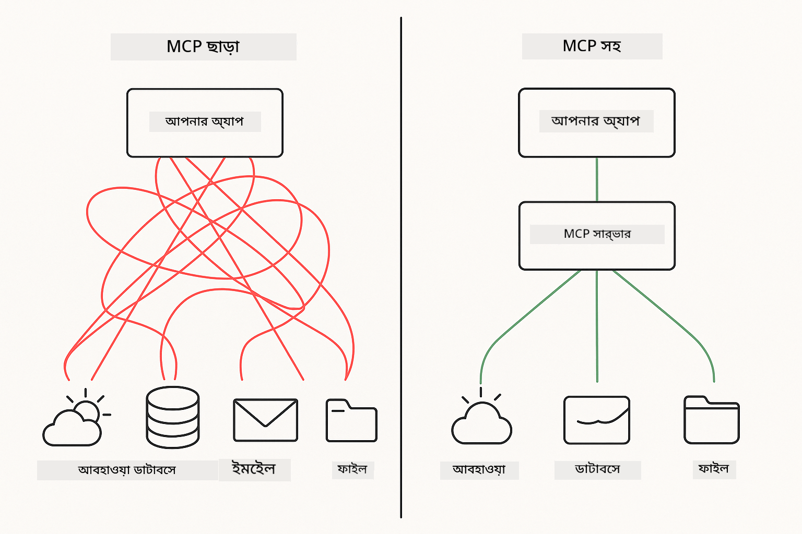
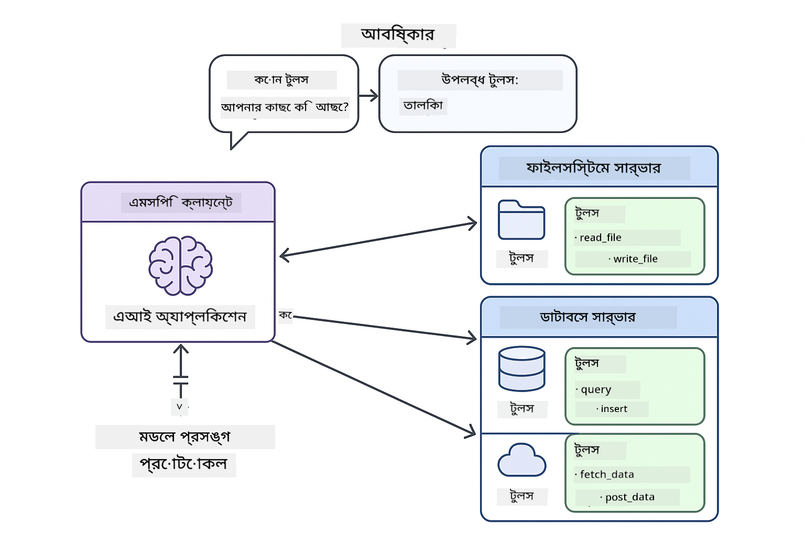
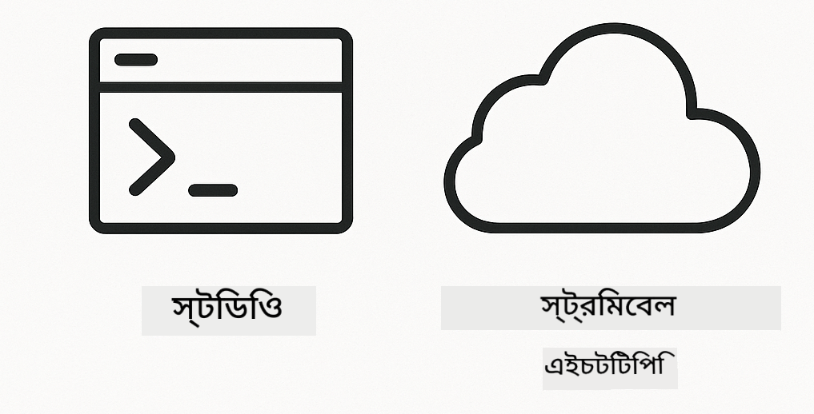

<!--
CO_OP_TRANSLATOR_METADATA:
{
  "original_hash": "c25ec1f10ef156c53e190cdf8b0711ab",
  "translation_date": "2025-12-13T17:45:13+00:00",
  "source_file": "05-mcp/README.md",
  "language_code": "bn"
}
-->
# মডিউল ০৫: মডেল কনটেক্সট প্রোটোকল (MCP)

## বিষয়বস্তু

- [আপনি যা শিখবেন](../../../05-mcp)
- [MCP বোঝা](../../../05-mcp)
- [MCP কীভাবে কাজ করে](../../../05-mcp)
  - [সার্ভার-ক্লায়েন্ট আর্কিটেকচার](../../../05-mcp)
  - [টুল আবিষ্কার](../../../05-mcp)
  - [ট্রান্সপোর্ট মেকানিজম](../../../05-mcp)
- [প্রয়োজনীয়তা](../../../05-mcp)
- [এই মডিউলটি যা কভার করে](../../../05-mcp)
- [দ্রুত শুরু](../../../05-mcp)
  - [উদাহরণ ১: রিমোট ক্যালকুলেটর (স্ট্রিমেবল HTTP)](../../../05-mcp)
  - [উদাহরণ ২: ফাইল অপারেশন (Stdio)](../../../05-mcp)
  - [উদাহরণ ৩: গিট বিশ্লেষণ (ডকার)](../../../05-mcp)
- [মূল ধারণা](../../../05-mcp)
  - [ট্রান্সপোর্ট নির্বাচন](../../../05-mcp)
  - [টুল আবিষ্কার](../../../05-mcp)
  - [সেশন ম্যানেজমেন্ট](../../../05-mcp)
  - [ক্রস-প্ল্যাটফর্ম বিবেচনা](../../../05-mcp)
- [কখন MCP ব্যবহার করবেন](../../../05-mcp)
- [MCP ইকোসিস্টেম](../../../05-mcp)
- [অভিনন্দন!](../../../05-mcp)
  - [পরবর্তী কী?](../../../05-mcp)
- [সমস্যা সমাধান](../../../05-mcp)

## আপনি যা শিখবেন

আপনি কথোপকথনমূলক AI তৈরি করেছেন, প্রম্পট দক্ষতা অর্জন করেছেন, ডকুমেন্টে ভিত্তি করে উত্তর দিয়েছেন, এবং টুলস সহ এজেন্ট তৈরি করেছেন। কিন্তু সব টুলস আপনার নির্দিষ্ট অ্যাপ্লিকেশনের জন্য কাস্টম তৈরি ছিল। যদি আপনি আপনার AI কে এমন একটি স্ট্যান্ডার্ডাইজড টুল ইকোসিস্টেমে অ্যাক্সেস দিতে পারেন যা কেউ তৈরি ও শেয়ার করতে পারে?

মডেল কনটেক্সট প্রোটোকল (MCP) ঠিক তাই প্রদান করে - AI অ্যাপ্লিকেশনগুলোকে বাইরের টুলস আবিষ্কার এবং ব্যবহার করার জন্য একটি স্ট্যান্ডার্ড উপায়। প্রতিটি ডেটা সোর্স বা সার্ভিসের জন্য কাস্টম ইন্টিগ্রেশন লেখার পরিবর্তে, আপনি MCP সার্ভারগুলোর সাথে সংযোগ করেন যারা তাদের ক্ষমতাগুলো একটি সঙ্গতিপূর্ণ ফরম্যাটে প্রকাশ করে। আপনার AI এজেন্ট তখন স্বয়ংক্রিয়ভাবে এই টুলস আবিষ্কার ও ব্যবহার করতে পারে।



*MCP এর আগে: জটিল পয়েন্ট-টু-পয়েন্ট ইন্টিগ্রেশন। MCP এর পরে: একটি প্রোটোকল, অসীম সম্ভাবনা।*

## MCP বোঝা

MCP AI উন্নয়নের একটি মৌলিক সমস্যা সমাধান করে: প্রতিটি ইন্টিগ্রেশন কাস্টম। GitHub অ্যাক্সেস করতে চান? কাস্টম কোড। ফাইল পড়তে চান? কাস্টম কোড। ডাটাবেস প্রশ্ন করতে চান? কাস্টম কোড। এবং এই ইন্টিগ্রেশনগুলো অন্য AI অ্যাপ্লিকেশনের সাথে কাজ করে না।

MCP এটিকে স্ট্যান্ডার্ড করে তোলে। একটি MCP সার্ভার স্পষ্ট বর্ণনা এবং স্কিমাস সহ টুলস প্রকাশ করে। যেকোন MCP ক্লায়েন্ট সংযোগ করতে পারে, উপলব্ধ টুলস আবিষ্কার করতে পারে এবং সেগুলো ব্যবহার করতে পারে। একবার তৈরি করুন, সর্বত্র ব্যবহার করুন।



*মডেল কনটেক্সট প্রোটোকল আর্কিটেকচার - স্ট্যান্ডার্ডাইজড টুল আবিষ্কার এবং কার্যকরীতা*

## MCP কীভাবে কাজ করে

**সার্ভার-ক্লায়েন্ট আর্কিটেকচার**

MCP একটি ক্লায়েন্ট-সার্ভার মডেল ব্যবহার করে। সার্ভারগুলো টুলস প্রদান করে - ফাইল পড়া, ডাটাবেস প্রশ্ন, API কল। ক্লায়েন্ট (আপনার AI অ্যাপ্লিকেশন) সার্ভারগুলোর সাথে সংযোগ করে এবং তাদের টুলস ব্যবহার করে।

**টুল আবিষ্কার**

আপনার ক্লায়েন্ট যখন একটি MCP সার্ভারের সাথে সংযোগ করে, তখন এটি জিজ্ঞাসা করে "আপনার কাছে কোন টুলস আছে?" সার্ভার উপলব্ধ টুলসের একটি তালিকা দেয়, প্রতিটির বর্ণনা এবং প্যারামিটার স্কিমাস সহ। আপনার AI এজেন্ট ব্যবহারকারীর অনুরোধ অনুযায়ী কোন টুলস ব্যবহার করবে তা সিদ্ধান্ত নিতে পারে।

**ট্রান্সপোর্ট মেকানিজম**

MCP দুটি ট্রান্সপোর্ট মেকানিজম সংজ্ঞায়িত করে: রিমোট সার্ভারের জন্য HTTP, স্থানীয় প্রসেসের জন্য Stdio (ডকার কন্টেইনারসহ):



*MCP ট্রান্সপোর্ট মেকানিজম: রিমোট সার্ভারের জন্য HTTP, স্থানীয় প্রসেসের জন্য Stdio (ডকার কন্টেইনারসহ)*

**স্ট্রিমেবল HTTP** - [StreamableHttpDemo.java](../../../05-mcp/src/main/java/com/example/langchain4j/mcp/StreamableHttpDemo.java)

রিমোট সার্ভারের জন্য। আপনার অ্যাপ্লিকেশন নেটওয়ার্কে কোথাও চলমান একটি সার্ভারে HTTP অনুরোধ করে। রিয়েল-টাইম যোগাযোগের জন্য সার্ভার-সেন্ট ইভেন্ট ব্যবহার করে।

```java
McpTransport httpTransport = new StreamableHttpMcpTransport.Builder()
    .url("http://localhost:3001/mcp")
    .timeout(Duration.ofSeconds(60))
    .logRequests(true)
    .logResponses(true)
    .build();
```

> **🤖 [GitHub Copilot](https://github.com/features/copilot) চ্যাট দিয়ে চেষ্টা করুন:** খুলুন [`StreamableHttpDemo.java`](../../../05-mcp/src/main/java/com/example/langchain4j/mcp/StreamableHttpDemo.java) এবং জিজ্ঞাসা করুন:
> - "MCP সরাসরি টুল ইন্টিগ্রেশনের থেকে কিভাবে আলাদা, যেমন মডিউল ০৪ তে?"
> - "অ্যাপ্লিকেশনগুলোর মধ্যে টুল শেয়ারিংয়ের জন্য MCP ব্যবহারের সুবিধাগুলো কী?"
> - "MCP সার্ভারে সংযোগ ব্যর্থতা বা টাইমআউট কিভাবে হ্যান্ডেল করব?"

**Stdio** - [StdioTransportDemo.java](../../../05-mcp/src/main/java/com/example/langchain4j/mcp/StdioTransportDemo.java)

স্থানীয় প্রসেসের জন্য। আপনার অ্যাপ্লিকেশন একটি সাবপ্রসেস হিসেবে সার্ভার চালায় এবং স্ট্যান্ডার্ড ইনপুট/আউটপুটের মাধ্যমে যোগাযোগ করে। ফাইল সিস্টেম অ্যাক্সেস বা কমান্ড-লাইন টুলসের জন্য উপযোগী।

```java
McpTransport stdioTransport = new StdioMcpTransport.Builder()
    .command(List.of(
        npmCmd, "exec",
        "@modelcontextprotocol/server-filesystem@0.6.2",
        resourcesDir
    ))
    .logEvents(false)
    .build();
```

> **🤖 [GitHub Copilot](https://github.com/features/copilot) চ্যাট দিয়ে চেষ্টা করুন:** খুলুন [`StdioTransportDemo.java`](../../../05-mcp/src/main/java/com/example/langchain4j/mcp/StdioTransportDemo.java) এবং জিজ্ঞাসা করুন:
> - "Stdio ট্রান্সপোর্ট কিভাবে কাজ করে এবং কখন HTTP এর পরিবর্তে এটি ব্যবহার করা উচিত?"
> - "LangChain4j MCP সার্ভার প্রসেসের লাইফসাইকেল কিভাবে ম্যানেজ করে?"
> - "AI কে ফাইল সিস্টেম অ্যাক্সেস দেওয়ার নিরাপত্তা প্রভাব কী?"

**ডকার (Stdio ব্যবহার করে)** - [GitRepositoryAnalyzer.java](../../../05-mcp/src/main/java/com/example/langchain4j/mcp/GitRepositoryAnalyzer.java)

কন্টেইনারাইজড সার্ভিসের জন্য। `docker run` এর মাধ্যমে ডকার কন্টেইনারের সাথে stdio ট্রান্সপোর্ট ব্যবহার করে যোগাযোগ করে। জটিল ডিপেন্ডেন্সি বা বিচ্ছিন্ন পরিবেশের জন্য ভালো।

```java
McpTransport dockerTransport = new StdioMcpTransport.Builder()
    .command(List.of(
        "docker", "run",
        "-e", "GITHUB_PERSONAL_ACCESS_TOKEN=" + System.getenv("GITHUB_TOKEN"),
        "-v", volumeMapping,
        "-i", "mcp/git"
    ))
    .logEvents(true)
    .build();
```

> **🤖 [GitHub Copilot](https://github.com/features/copilot) চ্যাট দিয়ে চেষ্টা করুন:** খুলুন [`GitRepositoryAnalyzer.java`](../../../05-mcp/src/main/java/com/example/langchain4j/mcp/GitRepositoryAnalyzer.java) এবং জিজ্ঞাসা করুন:
> - "ডকার ট্রান্সপোর্ট কিভাবে MCP সার্ভারগুলোকে বিচ্ছিন্ন করে এবং এর সুবিধাগুলো কী?"
> - "হোস্ট এবং MCP কন্টেইনারের মধ্যে ডেটা শেয়ার করার জন্য ভলিউম মাউন্ট কিভাবে কনফিগার করব?"
> - "প্রোডাকশনে ডকার-ভিত্তিক MCP সার্ভার লাইফসাইকেল ম্যানেজমেন্টের সেরা অনুশীলন কী?"

## উদাহরণ চালানো

### প্রয়োজনীয়তা

- Java 21+, Maven 3.9+
- Node.js 16+ এবং npm (MCP সার্ভারগুলোর জন্য)
- **ডকার ডেস্কটপ** - উদাহরণ ৩ এর জন্য অবশ্যই **চলমান** থাকতে হবে (শুধুমাত্র ইনস্টল করা নয়)
- GitHub পার্সোনাল অ্যাক্সেস টোকেন `.env` ফাইলে কনফিগার করা (মডিউল ০০ থেকে)

> **দ্রষ্টব্য:** যদি আপনি এখনও আপনার GitHub টোকেন সেটআপ না করে থাকেন, [মডিউল ০০ - দ্রুত শুরু](../00-quick-start/README.md) দেখুন নির্দেশনার জন্য।

> **⚠️ ডকার ব্যবহারকারীরা:** উদাহরণ ৩ চালানোর আগে, `docker ps` দিয়ে ডকার ডেস্কটপ চালু আছে কিনা যাচাই করুন। যদি সংযোগ ত্রুটি দেখায়, ডকার ডেস্কটপ চালু করুন এবং প্রায় ৩০ সেকেন্ড অপেক্ষা করুন।

## দ্রুত শুরু

**VS কোড ব্যবহার:** এক্সপ্লোরারে যেকোন ডেমো ফাইলে রাইট-ক্লিক করে **"Run Java"** নির্বাচন করুন, অথবা রান এবং ডিবাগ প্যানেল থেকে লঞ্চ কনফিগারেশন ব্যবহার করুন (প্রথমে `.env` ফাইলে আপনার টোকেন যোগ করা নিশ্চিত করুন)।

**Maven ব্যবহার:** বিকল্পভাবে, নিচের উদাহরণগুলো কমান্ড লাইনে চালাতে পারেন।

**⚠️ গুরুত্বপূর্ণ:** কিছু উদাহরণের জন্য প্রয়োজনীয়তা আছে (যেমন MCP সার্ভার চালানো বা ডকার ইমেজ তৈরি করা)। প্রতিটি উদাহরণের শর্তাবলী চালানোর আগে পরীক্ষা করুন।

### উদাহরণ ১: রিমোট ক্যালকুলেটর (স্ট্রিমেবল HTTP)

এটি নেটওয়ার্ক-ভিত্তিক টুল ইন্টিগ্রেশন প্রদর্শন করে।

**⚠️ প্রয়োজনীয়তা:** প্রথমে MCP সার্ভার চালু করতে হবে (নীচের টার্মিনাল ১ দেখুন)।

**টার্মিনাল ১ - MCP সার্ভার চালু করুন:**

**Bash:**
```bash
git clone https://github.com/modelcontextprotocol/servers.git
cd servers/src/everything
npm install
node dist/streamableHttp.js
```

**PowerShell:**
```powershell
git clone https://github.com/modelcontextprotocol/servers.git
cd servers/src/everything
npm install
node dist/streamableHttp.js
```

**টার্মিনাল ২ - উদাহরণ চালান:**

**VS কোড ব্যবহার:** `StreamableHttpDemo.java` এ রাইট-ক্লিক করে **"Run Java"** নির্বাচন করুন।

**Maven ব্যবহার:**

**Bash:**
```bash
export GITHUB_TOKEN=your_token_here
cd 05-mcp
mvn compile exec:java -Dexec.mainClass=com.example.langchain4j.mcp.StreamableHttpDemo
```

**PowerShell:**
```powershell
$env:GITHUB_TOKEN=your_token_here
cd 05-mcp
mvn --% compile exec:java -Dexec.mainClass=com.example.langchain4j.mcp.StreamableHttpDemo
```

এজেন্ট উপলব্ধ টুলস আবিষ্কার করবে, তারপর ক্যালকুলেটর ব্যবহার করে যোগফল করবে।

### উদাহরণ ২: ফাইল অপারেশন (Stdio)

এটি স্থানীয় সাবপ্রসেস-ভিত্তিক টুলস প্রদর্শন করে।

**✅ কোন প্রয়োজনীয়তা নেই** - MCP সার্ভার স্বয়ংক্রিয়ভাবে চালু হয়।

**VS কোড ব্যবহার:** `StdioTransportDemo.java` এ রাইট-ক্লিক করে **"Run Java"** নির্বাচন করুন।

**Maven ব্যবহার:**

**Bash:**
```bash
export GITHUB_TOKEN=your_token_here
cd 05-mcp
mvn compile exec:java -Dexec.mainClass=com.example.langchain4j.mcp.StdioTransportDemo
```

**PowerShell:**
```powershell
$env:GITHUB_TOKEN=your_token_here
cd 05-mcp
mvn --% compile exec:java -Dexec.mainClass=com.example.langchain4j.mcp.StdioTransportDemo
```

অ্যাপ্লিকেশন স্বয়ংক্রিয়ভাবে একটি ফাইলসিস্টেম MCP সার্ভার চালু করে এবং একটি স্থানীয় ফাইল পড়ে। লক্ষ্য করুন কিভাবে সাবপ্রসেস ম্যানেজমেন্ট আপনার জন্য পরিচালিত হয়।

**প্রত্যাশিত আউটপুট:**
```
Assistant response: The content of the file is "Kaboom!".
```

### উদাহরণ ৩: গিট বিশ্লেষণ (ডকার)

এটি কন্টেইনারাইজড টুল সার্ভার প্রদর্শন করে।

**⚠️ প্রয়োজনীয়তা:** 
1. **ডকার ডেস্কটপ অবশ্যই চালু থাকতে হবে** (শুধুমাত্র ইনস্টল নয়)
2. **উইন্ডোজ ব্যবহারকারীরা:** WSL 2 মোড সুপারিশকৃত (ডকার ডেস্কটপ সেটিংস → জেনারেল → "Use the WSL 2 based engine")। Hyper-V মোডে ম্যানুয়াল ফাইল শেয়ারিং কনফিগারেশন প্রয়োজন।
3. প্রথমে ডকার ইমেজ তৈরি করতে হবে (নীচের টার্মিনাল ১ দেখুন)

**ডকার চালু আছে কিনা যাচাই করুন:**

**Bash:**
```bash
docker ps  # একটি ত্রুটি নয়, কন্টেইনার তালিকা দেখানো উচিত
```

**PowerShell:**
```powershell
docker ps  # একটি ত্রুটি নয়, কন্টেইনার তালিকা দেখানো উচিত
```

যদি "Cannot connect to Docker daemon" বা "The system cannot find the file specified" এরকম ত্রুটি দেখায়, ডকার ডেস্কটপ চালু করুন এবং প্রায় ৩০ সেকেন্ড অপেক্ষা করুন।

**সমস্যা সমাধান:**
- AI যদি খালি রিপোজিটরি বা কোন ফাইল না পাওয়ার রিপোর্ট করে, তাহলে ভলিউম মাউন্ট (`-v`) কাজ করছে না।
- **উইন্ডোজ Hyper-V ব্যবহারকারীরা:** প্রজেক্ট ডিরেক্টরিটি ডকার ডেস্কটপ সেটিংস → রিসোর্সেস → ফাইল শেয়ারিং এ যোগ করুন, তারপর ডকার ডেস্কটপ রিস্টার্ট করুন।
- **সুপারিশকৃত সমাধান:** স্বয়ংক্রিয় ফাইল শেয়ারিংয়ের জন্য WSL 2 মোডে স্যুইচ করুন (সেটিংস → জেনারেল → "Use the WSL 2 based engine" সক্রিয় করুন)।

**টার্মিনাল ১ - ডকার ইমেজ তৈরি করুন:**

**Bash:**
```bash
cd servers/src/git
docker build -t mcp/git .
```

**PowerShell:**
```powershell
cd servers/src/git
docker build -t mcp/git .
```

**টার্মিনাল ২ - বিশ্লেষক চালান:**

**VS কোড ব্যবহার:** `GitRepositoryAnalyzer.java` এ রাইট-ক্লিক করে **"Run Java"** নির্বাচন করুন।

**Maven ব্যবহার:**

**Bash:**
```bash
export GITHUB_TOKEN=your_token_here
cd 05-mcp
mvn compile exec:java -Dexec.mainClass=com.example.langchain4j.mcp.GitRepositoryAnalyzer
```

**PowerShell:**
```powershell
$env:GITHUB_TOKEN=your_token_here
cd 05-mcp
mvn --% compile exec:java -Dexec.mainClass=com.example.langchain4j.mcp.GitRepositoryAnalyzer
```

অ্যাপ্লিকেশন একটি ডকার কন্টেইনার চালু করে, আপনার রিপোজিটরি মাউন্ট করে, এবং AI এজেন্টের মাধ্যমে রিপোজিটরি কাঠামো ও বিষয়বস্তু বিশ্লেষণ করে।

## মূল ধারণা

**ট্রান্সপোর্ট নির্বাচন**

আপনার টুলস কোথায় আছে তার উপর ভিত্তি করে নির্বাচন করুন:
- রিমোট সার্ভিস → স্ট্রিমেবল HTTP
- স্থানীয় ফাইল সিস্টেম → Stdio
- জটিল ডিপেন্ডেন্সি → ডকার

**টুল আবিষ্কার**

MCP ক্লায়েন্ট সংযোগের সময় স্বয়ংক্রিয়ভাবে উপলব্ধ টুলস আবিষ্কার করে। আপনার AI এজেন্ট টুল বর্ণনা দেখে ব্যবহারকারীর অনুরোধ অনুযায়ী কোন টুল ব্যবহার করবে তা সিদ্ধান্ত নেয়।

**সেশন ম্যানেজমেন্ট**

স্ট্রিমেবল HTTP ট্রান্সপোর্ট সেশন বজায় রাখে, যা রিমোট সার্ভারের সাথে স্টেটফুল ইন্টারঅ্যাকশন সম্ভব করে। Stdio এবং ডকার ট্রান্সপোর্ট সাধারণত স্টেটলেস।

**ক্রস-প্ল্যাটফর্ম বিবেচনা**

উদাহরণগুলো প্ল্যাটফর্ম পার্থক্য স্বয়ংক্রিয়ভাবে হ্যান্ডেল করে (উইন্ডোজ বনাম ইউনিক্স কমান্ড পার্থক্য, ডকারের জন্য পাথ রূপান্তর)। এটি বিভিন্ন পরিবেশে প্রোডাকশন ডিপ্লয়মেন্টের জন্য গুরুত্বপূর্ণ।

## কখন MCP ব্যবহার করবেন

**MCP ব্যবহার করুন যখন:**
- আপনি বিদ্যমান টুল ইকোসিস্টেম ব্যবহার করতে চান
- এমন টুল তৈরি করছেন যা একাধিক অ্যাপ্লিকেশন ব্যবহার করবে
- তৃতীয় পক্ষের সার্ভিস স্ট্যান্ডার্ড প্রোটোকলের মাধ্যমে ইন্টিগ্রেট করতে চান
- কোড পরিবর্তন ছাড়াই টুল ইমপ্লিমেন্টেশন পরিবর্তন করতে চান

**কাস্টম টুল ব্যবহার করুন (মডিউল ০৪) যখন:**
- অ্যাপ্লিকেশন-নির্দিষ্ট ফাংশনালিটি তৈরি করছেন
- পারফরম্যান্স গুরুত্বপূর্ণ (MCP অতিরিক্ত ওভারহেড যোগ করে)
- আপনার টুলগুলো সহজ এবং পুনঃব্যবহারযোগ্য নয়
- সম্পূর্ণ নিয়ন্ত্রণ প্রয়োজন কার্যকরীতা উপর

## MCP ইকোসিস্টেম

মডেল কনটেক্সট প্রোটোকল একটি ওপেন স্ট্যান্ডার্ড যার একটি বাড়তে থাকা ইকোসিস্টেম রয়েছে:

- সাধারণ কাজের জন্য অফিসিয়াল MCP সার্ভার (ফাইলসিস্টেম, গিট, ডাটাবেস)
- বিভিন্ন সার্ভিসের জন্য কমিউনিটি-অবদানকৃত সার্ভার
- স্ট্যান্ডার্ডাইজড টুল বর্ণনা এবং স্কিমাস
- ক্রস-ফ্রেমওয়ার্ক সামঞ্জস্যতা (যেকোন MCP ক্লায়েন্টের সাথে কাজ করে)

এই স্ট্যান্ডার্ডাইজেশন মানে একটি AI অ্যাপ্লিকেশনের জন্য তৈরি টুলস অন্যদের সাথেও কাজ করে, একটি শেয়ার্ড ক্ষমতার ইকোসিস্টেম তৈরি করে।

## অভিনন্দন!

আপনি LangChain4j ফর বিগিনার্স কোর্স সম্পন্ন করেছেন। আপনি শিখেছেন:

- মেমোরি সহ কথোপকথনমূলক AI কিভাবে তৈরি করবেন (মডিউল ০১)
- বিভিন্ন কাজের জন্য প্রম্পট ইঞ্জিনিয়ারিং প্যাটার্ন (মডিউল ০২)
- RAG দিয়ে ডকুমেন্টে ভিত্তি করে উত্তর প্রদান (মডিউল ০৩)
- কাস্টম টুলস সহ AI এজেন্ট তৈরি (মডিউল ০৪)
- MCP এর মাধ্যমে স্ট্যান্ডার্ডাইজড টুল ইন্টিগ্রেশন (মডিউল ০৫)

এখন আপনার কাছে প্রোডাকশন AI অ্যাপ্লিকেশন তৈরি করার ভিত্তি রয়েছে। আপনি শিখেছেন ধারণাগুলো নির্দিষ্ট ফ্রেমওয়ার্ক বা মডেল নির্বিশেষে প্রযোজ্য - এগুলো AI ইঞ্জিনিয়ারিংয়ের মৌলিক প্যাটার্ন।

### পরবর্তী কী?

মডিউলগুলো শেষ করার পর, [টেস্টিং গাইড](../docs/TESTING.md) অন্বেষণ করুন LangChain4j টেস্টিং ধারণাগুলো কার্যকরীভাবে দেখতে।

**অফিসিয়াল রিসোর্স:**
- [LangChain4j ডকুমেন্টেশন](https://docs.langchain4j.dev/) - বিস্তৃত গাইড এবং API রেফারেন্স
- [LangChain4j GitHub](https://github.com/langchain4j/langchain4j) - সোর্স কোড এবং উদাহরণ
- [LangChain4j টিউটোরিয়াল](https://docs.langchain4j.dev/tutorials/) - বিভিন্ন ব্যবহারের জন্য ধাপে ধাপে টিউটোরিয়াল

এই কোর্স সম্পন্ন করার জন্য ধন্যবাদ!

---

**নেভিগেশন:** [← পূর্ববর্তী: মডিউল ০৪ - টুলস](../04-tools/README.md) | [প্রধান পৃষ্ঠায় ফিরে যান](../README.md)

---

## সমস্যা সমাধান

### PowerShell Maven কমান্ড সিনট্যাক্স
**সমস্যা**: Maven কমান্ডগুলি ত্রুটি `Unknown lifecycle phase ".mainClass=..."` সহ ব্যর্থ হয়

**কারণ**: PowerShell `=` কে একটি ভেরিয়েবল অ্যাসাইনমেন্ট অপারেটর হিসেবে ব্যাখ্যা করে, যা Maven প্রপার্টি সিনট্যাক্স ভেঙে দেয়

**সমাধান**: Maven কমান্ডের আগে stop-parsing অপারেটর `--%` ব্যবহার করুন:

**PowerShell:**
```powershell
mvn --% compile exec:java -Dexec.mainClass=com.example.langchain4j.mcp.StreamableHttpDemo
```

**Bash:**
```bash
mvn compile exec:java -Dexec.mainClass=com.example.langchain4j.mcp.StreamableHttpDemo
```

`--%` অপারেটর PowerShell কে বলে বাকি সমস্ত আর্গুমেন্টগুলি Maven-এ ব্যাখ্যা ছাড়াই সরাসরি পাঠাতে।

### Docker সংযোগ সমস্যা

**সমস্যা**: Docker কমান্ডগুলি "Cannot connect to Docker daemon" বা "The system cannot find the file specified" ত্রুটি দেখায়

**কারণ**: Docker Desktop চলছে না বা সম্পূর্ণরূপে আরম্ভ হয়নি

**সমাধান**: 
1. Docker Desktop চালু করুন
2. সম্পূর্ণ আরম্ভের জন্য প্রায় ৩০ সেকেন্ড অপেক্ষা করুন
3. `docker ps` দিয়ে যাচাই করুন (এটি কন্টেইনার তালিকা দেখানো উচিত, ত্রুটি নয়)
4. তারপর আপনার উদাহরণ চালান

### Windows Docker ভলিউম মাউন্টিং

**সমস্যা**: Git রিপোজিটরি বিশ্লেষক খালি রিপোজিটরি বা কোনো ফাইল দেখায় না

**কারণ**: ফাইল শেয়ারিং কনফিগারেশনের কারণে ভলিউম মাউন্ট (`-v`) কাজ করছে না

**সমাধান**:
- **প্রস্তাবিত:** WSL 2 মোডে স্যুইচ করুন (Docker Desktop Settings → General → "Use the WSL 2 based engine")
- **বিকল্প (Hyper-V):** Docker Desktop Settings → Resources → File sharing-এ প্রকল্প ডিরেক্টরি যোগ করুন, তারপর Docker Desktop পুনরায় চালু করুন

---

<!-- CO-OP TRANSLATOR DISCLAIMER START -->
**অস্বীকৃতি**:  
এই নথিটি AI অনুবাদ সেবা [Co-op Translator](https://github.com/Azure/co-op-translator) ব্যবহার করে অনূদিত হয়েছে। আমরা যথাসাধ্য সঠিকতার চেষ্টা করি, তবে স্বয়ংক্রিয় অনুবাদে ত্রুটি বা অসঙ্গতি থাকতে পারে। মূল নথিটি তার নিজস্ব ভাষায়ই কর্তৃত্বপূর্ণ উৎস হিসেবে বিবেচিত হওয়া উচিত। গুরুত্বপূর্ণ তথ্যের জন্য পেশাদার মানব অনুবাদ গ্রহণ করার পরামর্শ দেওয়া হয়। এই অনুবাদের ব্যবহারে সৃষ্ট কোনো ভুল বোঝাবুঝি বা ভুল ব্যাখ্যার জন্য আমরা দায়ী নই।
<!-- CO-OP TRANSLATOR DISCLAIMER END -->