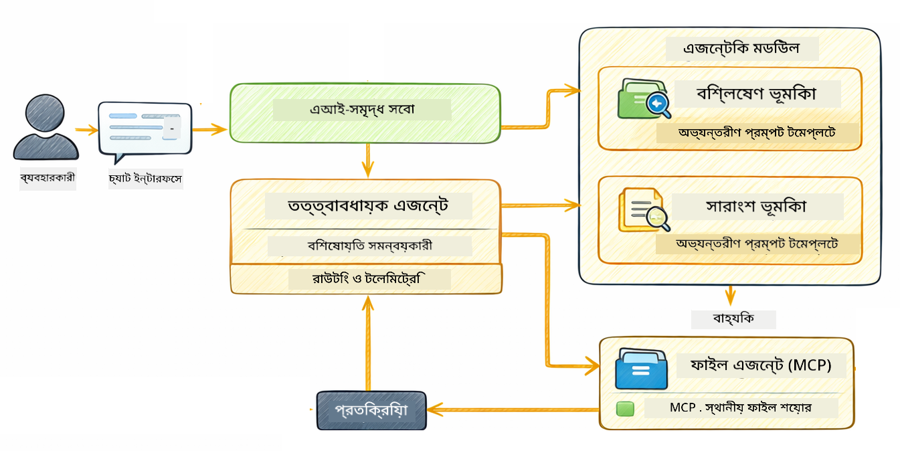

<!--
CO_OP_TRANSLATOR_METADATA:
{
  "original_hash": "f89f4c106d110e4943c055dd1a2f1dff",
  "translation_date": "2025-12-30T22:39:18+00:00",
  "source_file": "05-mcp/README.md",
  "language_code": "bn"
}
-->
# মডিউল 05: মডেল কনটেক্সট প্রোটোকল (MCP)

## Table of Contents

- [কি শিখবেন](../../../05-mcp)
- [MCP কি?](../../../05-mcp)
- [MCP কিভাবে কাজ করে](../../../05-mcp)
- [এজেনটিক মডিউল](../../../05-mcp)
- [উদাহরণ চালানো](../../../05-mcp)
  - [প্রয়োজনীয়তাদি](../../../05-mcp)
- [দ্রুত শুরু](../../../05-mcp)
  - [ফাইল অপারেশন (Stdio)](../../../05-mcp)
  - [সুপারভাইজার এজেন্ট](../../../05-mcp)
    - [আউটপুট বোঝা](../../../05-mcp)
    - [এজেনটিক মডিউল ফিচারগুলির ব্যাখ্যা](../../../05-mcp)
- [মূল ধারণা](../../../05-mcp)
- [অভিনন্দন!](../../../05-mcp)
  - [পরবর্তী কি?](../../../05-mcp)

## কি শিখবেন

আপনি কনভারসেশনাল এআই তৈরি করেছেন, প্রম্পট দক্ষতা আয়ত্ত করেছেন, ডকুমেন্টে উত্তর ভিত্তিক করেছেন, এবং টুলস সহ এজেন্ট তৈরি করেছেন। কিন্তু সবগুলো টুল আপনার নির্দিষ্ট অ্যাপ্লিকেশনের জন্য কাস্টম-বিল্ট ছিল। যদি আপনি আপনার এআইকে এমন একটি স্ট্যান্ডার্ডাইজড টুল ইকোসিস্টেম অ্যাক্সেস দিতে পারেন যা যেকোনো কেউ তৈরি করে শেয়ার করতে পারে, তাহলে কী হবে? এই মডিউলে, আপনি ঠিক তাই কিভাবে করা যায় Model Context Protocol (MCP) এবং LangChain4j-এর এজেনটিক মডিউল ব্যবহার করে শিখবেন। আমরা প্রথমে একটি সহজ MCP ফাইল রিডার দেখাবো এবং তারপর দেখাবো কিভাবে এটি সুপারভাইজার এজেন্ট প্যাটার্ন ব্যবহার করে উন্নত এজেনটিক ওয়ার্কফ্লোতে সহজে ইন্টিগ্রেট হয়।

## MCP কি?

Model Context Protocol (MCP) ঠিক এটাই প্রদান করে - AI অ্যাপ্লিকেশনগুলিকে বাহ্যিক টুল আবিষ্কার এবং ব্যবহার করার জন্য একটি স্ট্যান্ডার্ড উপায়। প্রতিটি ডেটা সর্স বা সার্ভিসের জন্য কাস্টম ইন্টিগ্রেশন লিখার বদলে, আপনি MCP সার্ভারগুলির সাথে সংযুক্ত হন যা তাদের সক্ষমতাগুলোকে একটি সঙ্গতিপূর্ণ ফরম্যাটে প্রকাশ করে। আপনার এআই এজেন্ট তখন স্বয়ংক্রিয়ভাবে এই টুলগুলো আবিষ্কার এবং ব্যবহার করতে পারে।


*MCP-এর আগে: জটিল পয়েন্ট-টু-পয়েন্ট ইন্টিগ্রেশন। MCP-এর পরে: এক প্রোটোকল, অসীম সম্ভাব্যতা।*

MCP AI ডেভেলপমেন্টে একটি মৌলিক সমস্যা সমাধান করে: প্রতিটি ইন্টিগ্রেশন কাস্টম। GitHub অ্যাক্সেস করতে চান? কাস্টম কোড। ফাইল পড়তে চান? কাস্টম কোড। ডাটাবেস কোয়েরি করতে চান? কাস্টম কোড। এবং এগুলোর কোনোটাই অন্যান্য AI অ্যাপ্লিকেশনের সাথে কাজ করে না।

MCP এটাকে স্ট্যান্ডার্ডাইজ করে। একটি MCP সার্ভার টুলগুলো স্পষ্ট বর্ণনা এবং স্কিমাসহ প্রকাশ করে। যেকোন MCP ক্লায়েন্ট কানেক্ট করতে পারে, উপলব্ধ টুলগুলো আবিষ্কার করতে পারে, এবং সেগুলো ব্যবহার করতে পারে। একবার তৈরি করুন, সর্বত্র ব্যবহার করুন।


*Model Context Protocol আর্কিটেকচার - স্ট্যান্ডার্ডাইজড টুল আবিষ্কার ও এক্সিকিউশন*

## MCP কিভাবে কাজ করে

**সার্ভার-ক্লায়েন্ট আর্কিটেকচার**

MCP ক্লায়েন্ট-সার্ভার মডেল ব্যবহার করে। সার্ভারগুলো টুল সরবরাহ করে - ফাইল পড়া, ডেটাবেস কোয়েরি, API কল করা। ক্লায়েন্টরা (আপনার AI অ্যাপ্লিকেশন) সার্ভারগুলোর সাথে সংযুক্ত হয় এবং তাদের টুলগুলো ব্যবহার করে।

LangChain4j-এ MCP ব্যবহার করতে, এই Maven ডিপেন্ডেন্সিটি যোগ করুন:

```xml
<dependency>
    <groupId>dev.langchain4j</groupId>
    <artifactId>langchain4j-mcp</artifactId>
    <version>${langchain4j.version}</version>
</dependency>
```

**টুল আবিষ্কার**

আপনার ক্লায়েন্ট যখন MCP সার্ভারের সাথে সংযুক্ত হয়, তখন এটি জিজ্ঞাসা করে "আপনার কাছে কি কি টুল আছে?" সার্ভার উপলব্ধ টুলগুলোর একটি তালিকা দিয়ে উত্তর দেয়, প্রতিটি টুলের বর্ণনা এবং প্যারামিটার স্কিমাসহ। আপনার AI এজেন্ট তখন ব্যবহারকারীর অনুরোধের উপর ভিত্তি করে কোন টুলগুলো ব্যবহার করবে তা সিদ্ধান্ত নিতে পারে।

**ট্রান্সপোর্ট মেকানিজমসমূহ**

MCP বিভিন্ন ট্রান্সপোর্ট মেকানিজম সমর্থন করে। এই মডিউল লোকাল প্রসেসগুলির জন্য Stdio ট্রান্সপোর্ট প্রদর্শন করে:


*MCP ট্রান্সপোর্ট মেকানিজম: রিমোট সার্ভারের জন্য HTTP, লোকাল প্রসেসগুলির জন্য Stdio*

**Stdio** - [StdioTransportDemo.java](../../../05-mcp/src/main/java/com/example/langchain4j/mcp/StdioTransportDemo.java)

লোকাল প্রসেসগুলির জন্য। আপনার অ্যাপ্লিকেশন একটি সাবপ্রসেস হিসেবে একটি সার্ভার স্পন করে এবং স্ট্যান্ডার্ড ইনপুট/আউটপুটের মাধ্যমে যোগাযোগ করে। ফাইলসিস্টেম অ্যাক্সেস বা কমান্ড-লাইন টুলসের জন্য উপযোগী।

```java
McpTransport stdioTransport = new StdioMcpTransport.Builder()
    .command(List.of(
        npmCmd, "exec",
        "@modelcontextprotocol/server-filesystem@2025.12.18",
        resourcesDir
    ))
    .logEvents(false)
    .build();
```

> **🤖 GitHub Copilot Chat-এ চেষ্টা করুন:** Open [`StdioTransportDemo.java`](../../../05-mcp/src/main/java/com/example/langchain4j/mcp/StdioTransportDemo.java) এবং জিজ্ঞাসা করুন:
> - "Stdio ট্রান্সপোর্ট কিভাবে কাজ করে এবং কখন আমি এটি HTTP এর পরিবর্তে ব্যবহার করব?"
> - "LangChain4j কিভাবে স্পনকৃত MCP সার্ভার প্রসেসগুলোর লাইফসাইকেল পরিচালনা করে?"
> - "এআই-কে ফাইল সিস্টেম অ্যাক্সেস দেওয়ার নিরাপত্তাগত প্রভাবগুলো কী?"

## এজেনটিক মডিউল

যদিও MCP স্ট্যান্ডার্ডাইজড টুল সরবরাহ করে, LangChain4j-এর **agentic মডিউল** সেই টুলগুলোকে অর্‌কেস্ট্রেট করার জন্য একটি ঘোষনামূলক উপায় প্রদান করে। `@Agent` অ্যানোটেশন এবং `AgenticServices` আপনাকে ইন্টারফেসের মাধ্যমে এজেন্ট আচরণ সংজ্ঞায়িত করতে দেয়, ত্যাগ করে ইম্পেরেটিভ কোড।

এই মডিউলে, আপনি অন্বেষণ করবেন **সুপারভাইজার এজেন্ট** প্যাটার্ন — একটি উন্নত এজেনটিক AI পদ্ধতি যেখানে একটি "সুপারভাইজার" এজেন্ট ডাইনামিকভাবে সিদ্ধান্ত নেয় কোন সাব-এজেন্টগুলোকে ব্যবহার করতে হবে ব্যবহারকারীর অনুরোধের উপর ভিত্তি করে। আমরা দুটো কনসেপ্ট মিলিয়ে দেখাবো কিভাবে আমাদের এক সাব-এজেন্টকে MCP-চালিত ফাইল অ্যাক্সেস সক্ষমতা দেয়া যায়।

agentic মডিউল ব্যবহার করতে, এই Maven ডিপেন্ডেন্সিটি যোগ করুন:

```xml
<dependency>
    <groupId>dev.langchain4j</groupId>
    <artifactId>langchain4j-agentic</artifactId>
    <version>${langchain4j.mcp.version}</version>
</dependency>
```

> **⚠️ পরীক্ষামূলক:** `langchain4j-agentic` মডিউলটি **পরীক্ষামূলক** এবং পরিবর্তনের বিষয় হতে পারে। AI অ্যাসিস্ট্যান্ট তৈরির স্থিতিশীল উপায় এখনও `langchain4j-core` কাস্টম টুলস (মডিউল 04) ব্যবহার করা।

## উদাহরণ চালানো

### প্রয়োজনীয়তাদি

- Java 21+, Maven 3.9+
- Node.js 16+ এবং npm (MCP সার্ভারগুলির জন্য)
- রুট ডিরেক্টরির `.env` ফাইলে কনফিগার করা পরিবেশ ভেরিয়েবলসমূহ:
  - **StdioTransportDemo-এর জন্য:** `GITHUB_TOKEN` (GitHub Personal Access Token)
  - **SupervisorAgentDemo-এর জন্য:** `AZURE_OPENAI_ENDPOINT`, `AZURE_OPENAI_API_KEY`, `AZURE_OPENAI_DEPLOYMENT` (মডিউল 01-04 এর মত)

> **নোট:** যদি আপনি এখনও পরিবেশ ভেরিয়েবল সেট করেননি, নির্দেশনার জন্য দেখুন [Module 00 - Quick Start](../00-quick-start/README.md), অথবা রুট ডিরেক্টরিতে `.env.example` কপি করে `.env` নাম দিন এবং আপনার মানগুলো পূরণ করুন।

## দ্রুত শুরু

**VS Code ব্যবহার করলে:** Explorer-এ যে কোনো ডেমো ফাইলে রাইট-ক্লিক করে **"Run Java"** নির্বাচন করুন, অথবা Run and Debug প্যানেল থেকে লঞ্চ কনফিগারেশনগুলো ব্যবহার করুন (নিশ্চিত করুন যে আপনি `.env` ফাইলে আপনার টোকেন যোগ করে রেখেছেন)।

**Maven ব্যবহার করলে:** বিকল্পভাবে, নিচের উদাহরণগুলোর সাহায্যে কমান্ড লাইনে চালাতে পারেন।

### ফাইল অপারেশন (Stdio)

এটি লোকাল সাবপ্রসেস-ভিত্তিক টুলগুলো প্রদর্শন করে।

**✅ কোন প্রয়োজনীয়তা নেই** - MCP সার্ভার স্বয়ংক্রিয়ভাবে স্পন করা হয়।

**VS Code ব্যবহার করলে:** `StdioTransportDemo.java`-তে রাইট-ক্লিক করে **"Run Java"** নির্বাচন করুন।

**Maven ব্যবহার করলে:**

**Bash:**
```bash
export GITHUB_TOKEN=your_token_here
cd 05-mcp
mvn compile exec:java -Dexec.mainClass=com.example.langchain4j.mcp.StdioTransportDemo
```

**PowerShell:**
```powershell
$env:GITHUB_TOKEN=your_token_here
cd 05-mcp
mvn --% compile exec:java -Dexec.mainClass=com.example.langchain4j.mcp.StdioTransportDemo
```

অ্যাপ্লিকেশন স্বয়ংক্রিয়ভাবে একটি ফাইলসিস্টেম MCP সার্ভার স্পন করে এবং একটি লোকাল ফাইল পড়ে। লক্ষ্য করুন কিভাবে সাবপ্রসেস পরিচালনা আপনার জন্য হ্যান্ডেল করা হয়েছে।

**প্রত্যাশিত আউটপুট:**
```
Assistant response: The file provides an overview of LangChain4j, an open-source Java library
for integrating Large Language Models (LLMs) into Java applications...
```

### সুপারভাইজার এজেন্ট




**সুপারভাইজার এজেন্ট প্যাটার্ন** একটি **নমনীয়** এজেনটিক AI ফর্ম। ধারাবাহিক ওয়ার্কফ্লো (ক্রমিক, লুপ, প্যারালাল) থেকে ভিন্নভাবে, একজন সুপারভাইজার LLM ব্যবহার করে স্বয়ংক্রিয়ভাবে সিদ্ধান্ত নেয় কোন এজেন্টগুলোকে ব্যবহার করতে হবে ব্যবহারকারীর অনুরোধ অনুযায়ী।

**সুপারভাইজারকে MCP-এর সাথে মিলানো:** এই উদাহরণে, আমরা `FileAgent`-কে MCP ফাইল সিস্টেম টুলসের অ্যাক্সেস দিই `toolProvider(mcpToolProvider)` ব্যবহার করে। যখন একজন ব্যবহারকারী "ফাইল পড়ে বিশ্লেষণ কর" বলে, সুপারভাইজার অনুরোধটি বিশ্লেষণ করে এবং একটি এক্সিকিউশন প্ল্যান তৈরি করে। তারপর এটি অনুরোধটি `FileAgent`-এ রুট করে, যা MCP-এর `read_file` টুল ব্যবহার করে কনটেন্ট পুনরুদ্ধার করে। সুপারভাইজার সেই কনটেন্ট `AnalysisAgent`-এ পাঠায় ব্যাখ্যার জন্য, এবং ঐচ্ছিকভাবে `SummaryAgent`-কে ফলসংক্ষেপ করার জন্য ডাকে।

এটি দেখায় কিভাবে MCP টুলগুলো এজেনটিক ওয়ার্কফ্লোতে নির্বিঘ্নে ইন্টিগ্রেট হয় — সুপারভাইজারকে জানা লাগেনা ফাইলগুলো কিভাবে পড়া হয়, কেবল সেটা যে `FileAgent` তা করতে পারে। সুপারভাইজার বিভিন্ন ধরণের অনুরোধে ডাইনামিকভাবে মানিয়ে নেয় এবং বাৎসরিকভাবে শেষ এজেন্টের উত্তর বা সমস্ত অপারেশনের সারসংক্ষেপ ফেরত দেয়।

**স্টার্ট স্ক্রিপ্ট ব্যবহার করা (প্রস্তাবিত):**

স্টার্ট স্ক্রিপ্টগুলো স্বয়ংক্রিয়ভাবে রুট `.env` ফাইল থেকে পরিবেশ ভেরিয়েবল লোড করে:

**Bash:**
```bash
cd 05-mcp
chmod +x start.sh
./start.sh
```

**PowerShell:**
```powershell
cd 05-mcp
.\start.ps1
```

**VS Code ব্যবহার করলে:** `SupervisorAgentDemo.java`-তে রাইট-ক্লিক করে **"Run Java"** নির্বাচন করুন (শুধু নিশ্চিত হোন আপনার `.env` ফাইল কনফিগার করা আছে)।

**সুপারভাইজার কিভাবে কাজ করে:**

```java
// নির্দিষ্ট সক্ষমতা সহ একাধিক এজেন্ট সংজ্ঞায়িত করুন
FileAgent fileAgent = AgenticServices.agentBuilder(FileAgent.class)
        .chatModel(model)
        .toolProvider(mcpToolProvider)  // ফাইল অপারেশনের জন্য MCP টুলস রয়েছে
        .build();

AnalysisAgent analysisAgent = AgenticServices.agentBuilder(AnalysisAgent.class)
        .chatModel(model)
        .build();

SummaryAgent summaryAgent = AgenticServices.agentBuilder(SummaryAgent.class)
        .chatModel(model)
        .build();

// এই এজেন্টগুলোকে সমন্বয়কারী একটি Supervisor তৈরি করুন
SupervisorAgent supervisor = AgenticServices.supervisorBuilder()
        .chatModel(model)  // "planner" মডেল
        .subAgents(fileAgent, analysisAgent, summaryAgent)
        .responseStrategy(SupervisorResponseStrategy.SUMMARY)
        .build();

// Supervisor স্বয়ংক্রিয়ভাবে সিদ্ধান্ত নেয় কোন এজেন্টকে আহ্বান করতে হবে
// শুধু একটি স্বাভাবিক ভাষার অনুরোধ দিন - LLM বাস্তবায়নের পরিকল্পনা করবে
String response = supervisor.invoke("Read the file at /path/file.txt and analyze it");
```

সম্পূর্ণ ইমপ্লিমেন্টেশনের জন্য দেখুন [SupervisorAgentDemo.java](../../../05-mcp/src/main/java/com/example/langchain4j/mcp/SupervisorAgentDemo.java) ।

> **🤖 GitHub Copilot Chat-এ চেষ্টা করুন:** Open [`SupervisorAgentDemo.java`](../../../05-mcp/src/main/java/com/example/langchain4j/mcp/SupervisorAgentDemo.java) এবং জিজ্ঞাসা করুন:
> - "সুপারভাইজার কিভাবে সিদ্ধান্ত নেয় কোন এজেন্টগুলো ডাকা হবে?"
> - "সুপারভাইজার এবং সিকোয়েন্সিয়াল ওয়ার্কফ্লো প্যাটার্নগুলোর মধ্যে পার্থক্য কি?"
> - "কিভাবে আমি সুপারভাইজারের প্ল্যানিং আচরণ কাস্টমাইজ করতে পারি?"

#### আউটপুট বোঝা

ডেমো চালালে, আপনি দেখবেন সুপারভাইজার কীভাবে একাধিক এজেন্ট অর্‌কেস্ট্রেট করে তার একটি গঠিত ওয়াকথ্রু। এখানে প্রতিটি সেকশনের অর্থ কী:

```
======================================================================
  SUPERVISOR AGENT DEMO
======================================================================

This demo shows how a Supervisor Agent orchestrates multiple specialized agents.
The Supervisor uses an LLM to decide which agent to call based on the task.
```

**হেডার** ডেমোটি পরিচয় করায় এবং মূল ধারণা ব্যাখ্যা করে: সুপারভাইজার কোন এজেন্ট কল করবে তা সিদ্ধান্ত নেওয়ার জন্য একটি LLM ব্যবহার করে (হার্ডকোডেড নিয়ম নয়)।

```
--- AVAILABLE AGENTS -------------------------------------------------
  [FILE]     FileAgent     - Reads files using MCP filesystem tools
  [ANALYZE]  AnalysisAgent - Analyzes content for structure, tone, and themes
  [SUMMARY]  SummaryAgent  - Creates concise summaries of content
```

**উপলব্ধ এজেন্টগুলো** দেখায় তিনটি বিশেষীকৃত এজেন্ট যেগুলো সুপারভাইজার নির্বাচন করতে পারে। প্রতিটি এজেন্টের একটি নির্দিষ্ট সক্ষমতা আছে:
- **FileAgent** MCP টুলস ব্যবহার করে ফাইল পড়তে পারে (বহির্ভূত সক্ষমতা)
- **AnalysisAgent** কনটেন্ট বিশ্লেষণ করে (শুধু LLM সক্ষমতা)
- **SummaryAgent** সারসংক্ষেপ তৈরি করে (শুধু LLM সক্ষমতা)

```
--- USER REQUEST -----------------------------------------------------
  "Read the file at .../file.txt and analyze what it's about"
```

**ব্যবহারকারীর অনুরোধ** দেখায় কী জিজ্ঞাসা করা হয়েছে। সুপারভাইজারকে এটাকে পার্স করে সিদ্ধান্ত নিতে হবে কোন এজেন্টগুলো ডাকা হবে।

```
--- SUPERVISOR ORCHESTRATION -----------------------------------------
  The Supervisor will now decide which agents to invoke and in what order...

  +-- STEP 1: Supervisor chose -> FileAgent (reading file via MCP)
  |
  |   Input: .../file.txt
  |
  |   Result: LangChain4j is an open-source Java library designed to simplify...
  +-- [OK] FileAgent (reading file via MCP) completed

  +-- STEP 2: Supervisor chose -> AnalysisAgent (analyzing content)
  |
  |   Input: LangChain4j is an open-source Java library...
  |
  |   Result: Structure: The content is organized into clear paragraphs that int...
  +-- [OK] AnalysisAgent (analyzing content) completed
```

**সুপারভাইজার অর্‌কেস্ট্রেশন** যেখানে যাদু ঘটে। লক্ষ্য করুন কিভাবে:
1. সুপারভাইজার **প্রথমে FileAgent নির্বাচন করলো** কারণ অনুরোধে "ফাইল পড়ে" বলা ছিল
2. FileAgent MCP-এর `read_file` টুল ব্যবহার করে ফাইলের কনটেন্ট পুনরুদ্ধার করলো
3. সুপারভাইজার তারপর **AnalysisAgent নির্বাচন করলো** এবং ফাইল কনটেন্ট তা-কে পাঠালো
4. AnalysisAgent স্ট্রাকচার, টোন, এবং থিম বিশ্লেষণ করলো

মনোযোগ করুন সুপারভাইজার এই সিদ্ধান্তগুলো **স্বয়ংক্রিয়ভাবে** নিয়েছে ব্যবহারকারীর অনুরোধের ভিত্তিতে — কোন হার্ডকোডেড ওয়ার্কফ্লো নেই!

**চূড়ান্ত উত্তর** হলো সুপারভাইজারের সংকলিত উত্তর, যা এটি ডাকা সকল এজেন্টের আউটপুট মিলিয়ে তৈরি করে। উদাহরণটি এজেনটিক স্কোপ ডাম্প করে দেখায় প্রতিটি এজেন্ট দ্বারা স্টোর করা সারাংশ এবং বিশ্লেষণের ফলাফল।

```
--- FINAL RESPONSE ---------------------------------------------------
I read the contents of the file and analyzed its structure, tone, and key themes.
The file introduces LangChain4j as an open-source Java library for integrating
large language models...

--- AGENTIC SCOPE (Shared Memory) ------------------------------------
  Agents store their results in a shared scope for other agents to use:
  * summary: LangChain4j is an open-source Java library...
  * analysis: Structure: The content is organized into clear paragraphs that in...
```

### এজেনটিক মডিউল ফিচারগুলির ব্যাখ্যা

উদাহরণটি agentic মডিউলের কয়েকটি উন্নত ফিচার প্রদর্শন করে। চলুন Agentic Scope এবং Agent Listeners ঘনিষ্ঠভাবে দেখি।

**Agentic Scope** দেখায় শেয়ার করা মেমরি যেখানে এজেন্টগুলো তাদের ফলাফল `@Agent(outputKey="...")` ব্যবহার করে সংরক্ষণ করেছে। এটি অনুমোদন করে:
- পরে আসা এজেন্টগুলো পূর্ববর্তী এজেন্টদের আউটপুট অ্যাক্সেস করতে পারে
- সুপারভাইজার একটি চূড়ান্ত উত্তর সংকলন করতে পারে
- আপনি প্রতিটি এজেন্ট কী তৈরি করেছে তা পরিদর্শন করতে পারেন

```java
ResultWithAgenticScope<String> result = supervisor.invokeWithAgenticScope(request);
AgenticScope scope = result.agenticScope();
String story = scope.readState("story");
List<AgentInvocation> history = scope.agentInvocations("analysisAgent");
```

**Agent Listeners** এজেন্ট এক্সিকিউশনের মনিটরিং ও ডিবাগিং সক্ষম করে। ডেমোতে যে ধাপে ধাপে আউটপুট দেখা যায় তা একটি AgentListener থেকে আসে যা প্রতিটি এজেন্ট ইনভোকেশনে হুক করে:
- **beforeAgentInvocation** - যখন সুপারভাইজার একটি এজেন্ট নির্বাচন করে কল করা হয়, এটি দেখা যায় কোন এজেন্টটি কেন নির্বাচন করা হয়েছে
- **afterAgentInvocation** - যখন একটি এজেন্ট সম্পন্ন হয়, এটি তার ফলাফল দেখায়
- **inheritedBySubagents** - যখন true থাকে, লিসেনারটি হায়ারারকির সমস্ত এজেন্ট মনিটর করে

```java
AgentListener monitor = new AgentListener() {
    private int step = 0;
    
    @Override
    public void beforeAgentInvocation(AgentRequest request) {
        step++;
        System.out.println("  +-- STEP " + step + ": " + request.agentName());
    }
    
    @Override
    public void afterAgentInvocation(AgentResponse response) {
        System.out.println("  +-- [OK] " + response.agentName() + " completed");
    }
    
    @Override
    public boolean inheritedBySubagents() {
        return true; // সমস্ত উপ-এজেন্টে ছড়িয়ে দিন
    }
};
```

সুপারভাইজার প্যাটার্নের বাইরে, `langchain4j-agentic` মডিউল Several শক্তিশালী ওয়ার্কফ্লো প্যাটার্ন এবং ফিচার সরবরাহ করে:

| প্যাটার্ন | বর্ণনা | ব্যবহারকেস |
|---------|-------------|----------|
| **ক্রমিক (Sequential)** | এজেন্টগুলো ক্রম অনুযায়ী এক্সিকিউট হবে, আউটপুট পরেরটিতে প্রবাহিত হবে | পাইপলাইন: রিসার্চ → বিশ্লেষণ → রিপোর্ট |
| **প্যারালাল (Parallel)** | এজেন্টগুলো একসাথে চলবে | স্বতন্ত্র কাজ: আবহাওয়া + সংবাদ + স্টক |
| **লুপ (Loop)** | শর্ত পূরণ না হওয়া পর্যন্ত পুনরাবৃত্তি | গুণমান স্কোরিং: স্কোর ≥ 0.8 হওয়া পর্যন্ত পরিমার্জন |
| **শর্তগত (Conditional)** | শর্তের উপর ভিত্তি করে রুটিং | শ্রেণীবিভাগ → স্পেশালিস্ট এজেন্টের কাছে রুট করা |
| **মানব-ইন-দা-লুপ (Human-in-the-Loop)** | মানব যাচাইকরণ যোগ করা | অনুমোদন ওয়ার্কফ্লো, কনটেন্ট রিভিউ |

## মূল ধারণা

**MCP** উপযোগী যখন আপনি বিদ্যমান টুল ইকোসিস্টেম ব্যবহার করতে চান, এমন টুল তৈরি করতে চান যা একাধিক অ্যাপ্লিকেশন শেয়ার করতে পারে, তৃতীয়-পক্ষ সার্ভিস স্ট্যান্ডার্ড প্রোটোকলের মাধ্যমে ইন্টিগ্রেট করতে চান, বা টুল ইমপ্লিমেন্টেশন বদলে ফেলতে চান কোড পরিবর্তন ছাড়াই।

**এজেনটিক মডিউল** সবচেয়ে ভালো কাজ করে যখন আপনি `@Agent` অ্যানোটেশন দিয়ে ঘোষনামূলক এজেন্ট সংজ্ঞা চান, আপনাকে ওয়ার্কফ্লো অর্‌কেস্ট্রেশন (ক্রমিক, লুপ, প্যারালাল) দরকার, ইন্টারফেস-ভিত্তিক এজেন্ট ডিজাইন ইম্পেরেটিভ কোডের পরিবর্তে পছন্দ করেন, অথবা আপনি একাধিক এজেন্ট কম্বাইন করছেন যারা `outputKey` এর মাধ্যমে আউটপুট শেয়ার করে।

**সুপারভাইজার এজেন্ট প্যাটার্ন** তখন উজ্জ্বল হয় যখন ওয়ার্কফ্লো পূর্বানুমেয় নয় এবং আপনি চান LLM সিদ্ধান্ত নিক, যখন আপনার অনেক বিশেষায়িত এজেন্ট আছে যেগুলো ডাইনামিক অর্‌কেস্ট্রেশন প্রয়োজন, যখন কথোপকথনমূলক সিস্টেম তৈরি করছেন যা বিভিন্ন সক্ষমতায় রুট করে, বা যখন আপনি সবচেয়ে নমনীয়, অভিযোজ্য এজেন্ট আচরণ চান।

## অভিনন্দন!

আপনি LangChain4j for Beginners কোর্স সমাপ্ত করেছেন। আপনি শিখেছেন:

- কিভাবে মেমরিসহ কনভারসেশনাল এআই তৈরি করবেন (মডিউল 01)
- বিভিন্ন কাজের জন্য প্রম্পট ইঞ্জিনিয়ারিং প্যাটার্ন (মডিউল 02)
- RAG ব্যবহার করে আপনার ডকুমেন্টে উত্তর ভিত্তিক করা (মডিউল 03)
- কাস্টম টুলস ব্যবহার করে মৌলিক AI এজেন্ট (অ্যাসিস্ট্যান্ট) তৈরি করা (মডিউল 04)
- স্ট্যান্ডার্ডাইজড টুলগুলোকে LangChain4j MCP এবং Agentic মডিউলগুলোর সাথে একত্রিত করা (Module 05)

### পরবর্তী কী?

মডিউলগুলো সম্পন্ন করার পরে, LangChain4j টেস্টিং ধারণাগুলো কার্যকরভাবে দেখতে [টেস্টিং গাইড](../docs/TESTING.md) অন্বেষণ করুন।

**অফিশিয়াল রিসোর্স:**
- [LangChain4j Documentation](https://docs.langchain4j.dev/) - বিস্তৃত নির্দেশিকা এবং API রেফারেন্স
- [LangChain4j GitHub](https://github.com/langchain4j/langchain4j) - সোর্স কোড এবং উদাহরণ
- [LangChain4j Tutorials](https://docs.langchain4j.dev/tutorials/) - বিভিন্ন ব্যবহারকেসের জন্য ধাপে ধাপে টিউটোরিয়াল

এই কোর্সটি সম্পন্ন করার জন্য ধন্যবাদ!

---

**নেভিগেশন:** [← পূর্ববর্তী: Module 04 - Tools](../04-tools/README.md) | [মূল পৃষ্ঠায় ফিরে](../README.md)

---

<!-- CO-OP TRANSLATOR DISCLAIMER START -->
অস্বীকৃতি:
এই নথিটি AI অনুবাদ সেবা Co-op Translator (https://github.com/Azure/co-op-translator) ব্যবহার করে অনুবাদ করা হয়েছে। আমরা যথাসম্ভব সঠিক অনুবাদ করার চেষ্টা করি, তবুও স্বয়ংক্রিয় অনুবাদে ত্রুটি বা ভুল থাকতে পারে। মূল নথিটি সংশ্লিষ্ট স্থানীয় ভাষায়ই প্রামাণ্য উৎস হিসেবে বিবেচনা করা উচিত। গুরুত্বপূর্ণ তথ্যের জন্য পেশাদার মানব অনুবাদ করার পরামর্শ দেওয়া হয়। এই অনুবাদ ব্যবহারের ফলে কোনো ভুল বোঝাবুঝি বা ভুল ব্যাখ্যার জন্য আমরা দায়ী নই।
<!-- CO-OP TRANSLATOR DISCLAIMER END -->