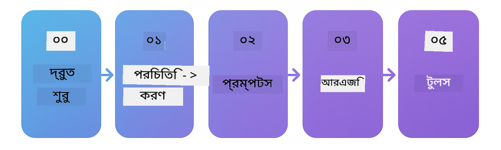

<!--
CO_OP_TRANSLATOR_METADATA:
{
  "original_hash": "69c7e2616c66df6cc296492fbfcad9ec",
  "translation_date": "2025-12-13T12:22:22+00:00",
  "source_file": "README.md",
  "language_code": "bn"
}
-->

# LangChain4j শুরু করার জন্য

LangChain4j এবং Azure OpenAI GPT-5 দিয়ে AI অ্যাপ্লিকেশন তৈরি করার জন্য একটি কোর্স, মৌলিক চ্যাট থেকে AI এজেন্ট পর্যন্ত।

**LangChain4j নতুন?** মূল শব্দ এবং ধারণাগুলির সংজ্ঞার জন্য [Glossary](docs/GLOSSARY.md) দেখুন।

## বিষয়বস্তু সূচি

1. [দ্রুত শুরু](00-quick-start/README.md) - LangChain4j দিয়ে শুরু করুন
2. [পরিচিতি](01-introduction/README.md) - LangChain4j এর মৌলিক বিষয় শিখুন
3. [প্রম্পট ইঞ্জিনিয়ারিং](02-prompt-engineering/README.md) - কার্যকর প্রম্পট ডিজাইন আয়ত্ত করুন
4. [RAG (রিট্রিভাল-অগমেন্টেড জেনারেশন)](03-rag/README.md) - বুদ্ধিমান জ্ঞানভিত্তিক সিস্টেম তৈরি করুন
5. [টুলস](04-tools/README.md) - AI এজেন্টের সাথে বাহ্যিক টুলস এবং API ইন্টিগ্রেট করুন
6. [MCP (মডেল কনটেক্সট প্রোটোকল)](05-mcp/README.md) - মডেল কনটেক্সট প্রোটোকলের সাথে কাজ করুন
---

## শেখার পথ

[দ্রুত শুরু](00-quick-start/README.md) মডিউল দিয়ে শুরু করুন এবং প্রতিটি মডিউল অতিক্রম করে ধাপে ধাপে আপনার দক্ষতা গড়ে তুলুন। মৌলিক বিষয়গুলি বুঝতে আপনি মৌলিক উদাহরণগুলি চেষ্টা করবেন, তারপর GPT-5 এর সাথে গভীরভাবে জানার জন্য [পরিচিতি](01-introduction/README.md) মডিউলে যাবেন।

মডিউলগুলি সম্পন্ন করার পরে, LangChain4j পরীক্ষার ধারণাগুলি কার্যকরভাবে দেখতে [Testing Guide](docs/TESTING.md) অন্বেষণ করুন।

> **নোট:** এই প্রশিক্ষণে GitHub মডেল এবং Azure OpenAI উভয়ই ব্যবহার করা হয়। [দ্রুত শুরু](00-quick-start/README.md) এবং [MCP](05-mcp/README.md) মডিউলগুলি GitHub মডেল ব্যবহার করে (কোন Azure সাবস্ক্রিপশন প্রয়োজন নেই), যখন মডিউল ১-৪ Azure OpenAI GPT-5 ব্যবহার করে।

## GitHub Copilot দিয়ে শেখা

দ্রুত কোডিং শুরু করতে, এই প্রকল্পটি GitHub Codespace বা আপনার লোকাল IDE তে devcontainer সহ খুলুন। এই কোর্সে ব্যবহৃত devcontainer GitHub Copilot সহ প্রি-কনফিগার করা হয়েছে AI পেয়ারড প্রোগ্রামিংয়ের জন্য।

প্রতিটি কোড উদাহরণে GitHub Copilot কে জিজ্ঞাসা করার জন্য প্রস্তাবিত প্রশ্ন রয়েছে যা আপনার বোঝাপড়া গভীর করবে। 💡/🤖 প্রম্পটগুলি খুঁজুন:

- **জাভা ফাইল হেডার** - প্রতিটি উদাহরণের জন্য নির্দিষ্ট প্রশ্ন
- **মডিউল README** - কোড উদাহরণের পরে অনুসন্ধানমূলক প্রম্পট

**কিভাবে ব্যবহার করবেন:** যেকোনো কোড ফাইল খুলুন এবং Copilot কে প্রস্তাবিত প্রশ্ন করুন। এটি কোডবেসের সম্পূর্ণ প্রসঙ্গ জানে এবং ব্যাখ্যা, সম্প্রসারণ এবং বিকল্প প্রস্তাব করতে পারে।

আরও জানতে চান? দেখুন [Copilot for AI Paired Programming](https://aka.ms/GitHubCopilotAI)।

## অতিরিক্ত সম্পদ

### LangChain

---

### Azure / Edge / MCP / Agents

---

### Generative AI সিরিজ

[-9333EA?style=for-the-badge&labelColor=E5E7EB&color=9333EA)](https://github.com/microsoft/Generative-AI-for-beginners-dotnet?WT.mc_id=academic-105485-koreyst)
[-C084FC?style=for-the-badge&labelColor=E5E7EB&color=C084FC)](https://github.com/microsoft/generative-ai-for-beginners-java?WT.mc_id=academic-105485-koreyst)
[-E879F9?style=for-the-badge&labelColor=E5E7EB&color=E879F9)](https://github.com/microsoft/generative-ai-with-javascript?WT.mc_id=academic-105485-koreyst)

---

### মূল শেখা

---

### Copilot সিরিজ

## সাহায্য নেওয়া

যদি আপনি আটকে যান বা AI অ্যাপ তৈরি সম্পর্কে কোনো প্রশ্ন থাকে, যোগ দিন:

যদি আপনার পণ্য প্রতিক্রিয়া বা ত্রুটি থাকে, দেখুন:

## লাইসেন্স

MIT লাইসেন্স - বিস্তারিত দেখতে [LICENSE](../../LICENSE) ফাইল দেখুন।

---

<!-- CO-OP TRANSLATOR DISCLAIMER START -->
**অস্বীকৃতি**:  
এই নথিটি AI অনুবাদ সেবা [Co-op Translator](https://github.com/Azure/co-op-translator) ব্যবহার করে অনূদিত হয়েছে। আমরা যথাসাধ্য সঠিকতার চেষ্টা করি, তবে স্বয়ংক্রিয় অনুবাদে ত্রুটি বা অসঙ্গতি থাকতে পারে। মূল নথিটি তার নিজস্ব ভাষায়ই কর্তৃত্বপূর্ণ উৎস হিসেবে বিবেচিত হওয়া উচিত। গুরুত্বপূর্ণ তথ্যের জন্য পেশাদার মানব অনুবাদ গ্রহণ করার পরামর্শ দেওয়া হয়। এই অনুবাদের ব্যবহারে সৃষ্ট কোনো ভুল বোঝাবুঝি বা ভুল ব্যাখ্যার জন্য আমরা দায়ী নই।
<!-- CO-OP TRANSLATOR DISCLAIMER END -->