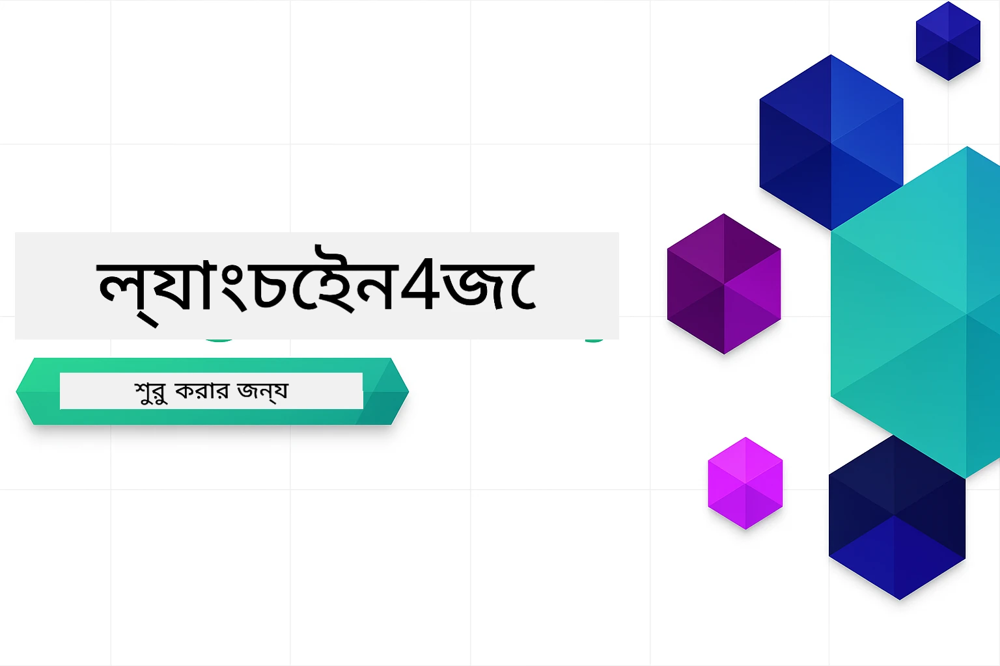

### 🌐 মাল্টি-ভাষা সাপোর্ট

#### গিটহাব অ্যাকশনের মাধ্যমে সহায়তা (স্বয়ংক্রিয় এবং সর্বদা আপ-টু-ডেট)

<!-- CO-OP TRANSLATOR LANGUAGES TABLE START -->
[Arabic](../ar/README.md) | [Bengali](./README.md) | [Bulgarian](../bg/README.md) | [Burmese (Myanmar)](../my/README.md) | [Chinese (Simplified)](../zh-CN/README.md) | [Chinese (Traditional, Hong Kong)](../zh-HK/README.md) | [Chinese (Traditional, Macau)](../zh-MO/README.md) | [Chinese (Traditional, Taiwan)](../zh-TW/README.md) | [Croatian](../hr/README.md) | [Czech](../cs/README.md) | [Danish](../da/README.md) | [Dutch](../nl/README.md) | [Estonian](../et/README.md) | [Finnish](../fi/README.md) | [French](../fr/README.md) | [German](../de/README.md) | [Greek](../el/README.md) | [Hebrew](../he/README.md) | [Hindi](../hi/README.md) | [Hungarian](../hu/README.md) | [Indonesian](../id/README.md) | [Italian](../it/README.md) | [Japanese](../ja/README.md) | [Kannada](../kn/README.md) | [Korean](../ko/README.md) | [Lithuanian](../lt/README.md) | [Malay](../ms/README.md) | [Malayalam](../ml/README.md) | [Marathi](../mr/README.md) | [Nepali](../ne/README.md) | [Nigerian Pidgin](../pcm/README.md) | [Norwegian](../no/README.md) | [Persian (Farsi)](../fa/README.md) | [Polish](../pl/README.md) | [Portuguese (Brazil)](../pt-BR/README.md) | [Portuguese (Portugal)](../pt-PT/README.md) | [Punjabi (Gurmukhi)](../pa/README.md) | [Romanian](../ro/README.md) | [Russian](../ru/README.md) | [Serbian (Cyrillic)](../sr/README.md) | [Slovak](../sk/README.md) | [Slovenian](../sl/README.md) | [Spanish](../es/README.md) | [Swahili](../sw/README.md) | [Swedish](../sv/README.md) | [Tagalog (Filipino)](../tl/README.md) | [Tamil](../ta/README.md) | [Telugu](../te/README.md) | [Thai](../th/README.md) | [Turkish](../tr/README.md) | [Ukrainian](../uk/README.md) | [Urdu](../ur/README.md) | [Vietnamese](../vi/README.md)

> **অন্তর্জালে ক্লোন করতে পছন্দ করেন?**

> এই রিপোজিটরিতে ৫০+ ভাষার অনুবাদ সংযুক্ত রয়েছে যা ডাউনলোড সাইজ যথেষ্ট বাড়িয়ে দেয়। অনুবাদ ছাড়া ক্লোন করার জন্য sparse checkout ব্যবহার করুন:
> ```bash
> git clone --filter=blob:none --sparse https://github.com/microsoft/LangChain4j-for-Beginners.git
> cd LangChain4j-for-Beginners
> git sparse-checkout set --no-cone '/*' '!translations' '!translated_images'
> ```
> এটি আপনাকে দ্রুত ডাউনলোডের সাথে কোর্স সম্পন্ন করতে প্রয়োজনীয় সবকিছু দেবে।
<!-- CO-OP TRANSLATOR LANGUAGES TABLE END -->

# LangChain4j শিখতে নবীনদের জন্য

LangChain4j এবং Azure OpenAI GPT-5 দিয়ে এআই অ্যাপ্লিকেশন তৈরি করার জন্য একটি কোর্স, প্রাথমিক চ্যাট থেকে শুরু করে এআই এজেন্ট পর্যন্ত।

**LangChain4j এ নতুন?** মূল শব্দ ও ধারণার জন্য [Glossary](docs/GLOSSARY.md) দেখুন।

## বিষয়সূচি

1. [দ্রুত শুরু](00-quick-start/README.md) - LangChain4j দিয়ে শুরু করুন
2. [ভূমিকা](01-introduction/README.md) - LangChain4j এর মৌলিক বিষয় শিখুন
3. [প্রম্পট ইঞ্জিনিয়ারিং](02-prompt-engineering/README.md) - কার্যকর প্রম্পট ডিজাইনে দক্ষ হন
4. [RAG (Retrieval-Augmented Generation)](03-rag/README.md) - বুদ্ধিমান জ্ঞান-ভিত্তিক সিস্টেম তৈরি করুন
5. [টুলস](04-tools/README.md) - বহিরাগত টুল ও সহজ সহকারী ইন্টিগ্রেট করুন
6. [MCP (Model Context Protocol)](05-mcp/README.md) - Model Context Protocol (MCP) ও Agentic মডিউলের সাথে কাজ করুন
---

## শেখার পথ

> **দ্রুত শুরু**

1. এই রিপোজিটরিটি আপনার গিটহাব অ্যাকাউন্টে fork করুন
2. **Code** → **Codespaces** ট্যাবে ক্লিক করুন → **...** → **New with options...**
3. ডিফল্ট সেটিংস ব্যবহার করুন – এই কোর্সের জন্য তৈরি Development container নির্বাচন করবে
4. **Create codespace** এ ক্লিক করুন
5. পরিবেশ প্রস্তুত হতে ৫-১০ মিনিট অপেক্ষা করুন
6. শুরু করতে সরাসরি [দ্রুত শুরু](./00-quick-start/README.md) এ যান!

মডিউলগুলি শেষ করার পর LangChain4j টেস্টিং ধারণাগুলো দেখতে [Testing Guide](docs/TESTING.md) দেখুন।

> **নোট:** এই ট্রেনিংয়ে GitHub Models এবং Azure OpenAI উভয় ব্যবহার করা হয়। [দ্রুত শুরু](00-quick-start/README.md) মডিউলে GitHub Models ব্যবহার করা হয় (Azure সাবস্ক্রিপশন প্রয়োজন নেই), আর মডিউল ১-৫ তে Azure OpenAI ব্যবহৃত হয়।

## GitHub Copilot এর সাথে শেখা

দ্রুত কোডিং শুরু করতে, এই প্রজেক্টটি GitHub Codespace অথবা আপনার লোকাল IDE তে devcontainer সহ খুলুন। এই কোর্সে ব্যবহৃত devcontainer এ AI জোড়া প্রোগ্রামিং এর জন্য GitHub Copilot প্রি-কনফিগার্ড রয়েছে।

প্রতিটি কোড উদাহরণে GitHub Copilot কে জিজ্ঞাসা করার জন্য প্রশںগুলির প্রস্তাব দেয়া হয়েছে, যা আপনার বোঝাপড়া গভীর করবে। খুঁজে পান 💡/🤖 প্রম্পট:

- **জাভা ফাইল হেডারগুলিতে** - প্রতিটি উদাহরণের নির্দিষ্ট প্রশ্ন
- **মডিউল রিডমিগুলিতে** - কোড উদাহরণের পর অন্বেষণমূলক প্রম্পট

**কিভাবে ব্যবহার করবেন:** কোনো কোড ফাইল খুলুন এবং Copilot কে প্রস্তাবিত প্রশ্নগুলি জিজ্ঞাসা করুন। এটি কোডবেসের পূর্ণ প্রসঙ্গ বুঝে এবং ব্যাখ্যা, সম্প্রসারণ ও বিকল্প সুপারিশ করতে পারে।

আরও জানতে চান? [Copilot for AI Paired Programming](https://aka.ms/GitHubCopilotAI) দেখুন।

## অতিরিক্ত সম্পদ

<!-- CO-OP TRANSLATOR OTHER COURSES START -->
### LangChain
[](https://aka.ms/langchain4j-for-beginners)
[](https://aka.ms/langchainjs-for-beginners?WT.mc_id=m365-94501-dwahlin)

---

### Azure / Edge / MCP / Agents
[](https://github.com/microsoft/AZD-for-beginners?WT.mc_id=academic-105485-koreyst)
[](https://github.com/microsoft/edgeai-for-beginners?WT.mc_id=academic-105485-koreyst)
[](https://github.com/microsoft/mcp-for-beginners?WT.mc_id=academic-105485-koreyst)
[](https://github.com/microsoft/ai-agents-for-beginners?WT.mc_id=academic-105485-koreyst)

---
 
### Generative AI Series
[](https://github.com/microsoft/generative-ai-for-beginners?WT.mc_id=academic-105485-koreyst)
[-9333EA?style=for-the-badge&labelColor=E5E7EB&color=9333EA)](https://github.com/microsoft/Generative-AI-for-beginners-dotnet?WT.mc_id=academic-105485-koreyst)
[-C084FC?style=for-the-badge&labelColor=E5E7EB&color=C084FC)](https://github.com/microsoft/generative-ai-for-beginners-java?WT.mc_id=academic-105485-koreyst)
[-E879F9?style=for-the-badge&labelColor=E5E7EB&color=E879F9)](https://github.com/microsoft/generative-ai-with-javascript?WT.mc_id=academic-105485-koreyst)

---
 
### Core Learning
[](https://aka.ms/ml-beginners?WT.mc_id=academic-105485-koreyst)
[](https://aka.ms/datascience-beginners?WT.mc_id=academic-105485-koreyst)
[](https://aka.ms/ai-beginners?WT.mc_id=academic-105485-koreyst)
[](https://github.com/microsoft/Security-101?WT.mc_id=academic-96948-sayoung)
[](https://aka.ms/webdev-beginners?WT.mc_id=academic-105485-koreyst)
[](https://aka.ms/iot-beginners?WT.mc_id=academic-105485-koreyst)
[](https://github.com/microsoft/xr-development-for-beginners?WT.mc_id=academic-105485-koreyst)

---
 
### Copilot Series

[](https://aka.ms/GitHubCopilotAI?WT.mc_id=academic-105485-koreyst)
[](https://github.com/microsoft/mastering-github-copilot-for-dotnet-csharp-developers?WT.mc_id=academic-105485-koreyst)
[](https://github.com/microsoft/CopilotAdventures?WT.mc_id=academic-105485-koreyst)
<!-- CO-OP TRANSLATOR OTHER COURSES END -->

## সাহায্য পাওয়া

যদি আপনি আটকে যান বা AI অ্যাপ তৈরি সম্পর্কে কোন প্রশ্ন থাকে, যোগ দিন:

[](https://aka.ms/foundry/discord)

যদি আপনার পণ্য প্রতিক্রিয়া বা তৈরির সময় ত্রুটি থাকে তাহলে দেখুন:

[](https://aka.ms/foundry/forum)

## লাইসেন্স

MIT লাইসেন্স - বিস্তারিত দেখতে [LICENSE](../../LICENSE) ফাইল দেখুন।

---

<!-- CO-OP TRANSLATOR DISCLAIMER START -->
**অস্বীকৃতি**:  
এই নথিটি AI অনুবাদ পরিষেবা [Co-op Translator](https://github.com/Azure/co-op-translator) ব্যবহার করে অনুবাদ করা হয়েছে। আমরা যথাসাধ্য সঠিকতার জন্য চেষ্টা করি, তবে অনুগ্রহ করে লক্ষ্য করুন যে স্বয়ংক্রিয় অনুবাদে ত্রুটি বা ভুল থাকতে পারে। মূল ভাষায় থাকা অরिजनাল নথিটিকে কর্তৃপক্ষপূর্ণ উত্স হিসেবে বিবেচনা করা উচিত। গুরুত্বপূর্ণ তথ্যের জন্য পেশাদার মানব অনুবাদের পরামর্শ দেওয়া হয়। এই অনুবাদের ব্যবহারে কোনো ভুল বোঝাবুঝি বা ব্যখ্যায় আমরা দায়ি নয়।
<!-- CO-OP TRANSLATOR DISCLAIMER END -->