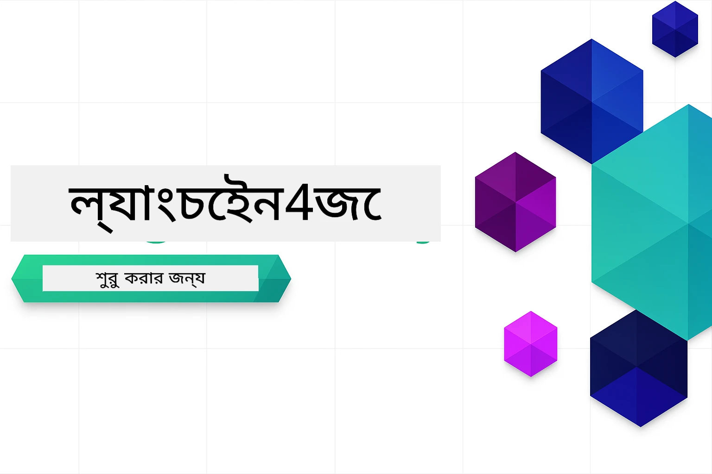

# LangChain4j শিক্ষানবিসদের জন্য

LangChain4j এবং Azure OpenAI GPT-5.2 দিয়ে এআই অ্যাপ্লিকেশন তৈরি করার জন্য একটি কোর্স, যা মৌলিক চ্যাট থেকে শুরু করে AI এজেন্ট পর্যন্ত।

### 🌐 বহুভাষিক সমর্থন

#### GitHub Action দ্বারা সমর্থিত (স্বয়ংক্রিয় এবং সর্বদা আপ-টু-ডেট)

<!-- CO-OP TRANSLATOR LANGUAGES TABLE START -->
[Arabic](../ar/README.md) | [Bengali](./README.md) | [Bulgarian](../bg/README.md) | [Burmese (Myanmar)](../my/README.md) | [Chinese (Simplified)](../zh-CN/README.md) | [Chinese (Traditional, Hong Kong)](../zh-HK/README.md) | [Chinese (Traditional, Macau)](../zh-MO/README.md) | [Chinese (Traditional, Taiwan)](../zh-TW/README.md) | [Croatian](../hr/README.md) | [Czech](../cs/README.md) | [Danish](../da/README.md) | [Dutch](../nl/README.md) | [Estonian](../et/README.md) | [Finnish](../fi/README.md) | [French](../fr/README.md) | [German](../de/README.md) | [Greek](../el/README.md) | [Hebrew](../he/README.md) | [Hindi](../hi/README.md) | [Hungarian](../hu/README.md) | [Indonesian](../id/README.md) | [Italian](../it/README.md) | [Japanese](../ja/README.md) | [Kannada](../kn/README.md) | [Khmer](../km/README.md) | [Korean](../ko/README.md) | [Lithuanian](../lt/README.md) | [Malay](../ms/README.md) | [Malayalam](../ml/README.md) | [Marathi](../mr/README.md) | [Nepali](../ne/README.md) | [Nigerian Pidgin](../pcm/README.md) | [Norwegian](../no/README.md) | [Persian (Farsi)](../fa/README.md) | [Polish](../pl/README.md) | [Portuguese (Brazil)](../pt-BR/README.md) | [Portuguese (Portugal)](../pt-PT/README.md) | [Punjabi (Gurmukhi)](../pa/README.md) | [Romanian](../ro/README.md) | [Russian](../ru/README.md) | [Serbian (Cyrillic)](../sr/README.md) | [Slovak](../sk/README.md) | [Slovenian](../sl/README.md) | [Spanish](../es/README.md) | [Swahili](../sw/README.md) | [Swedish](../sv/README.md) | [Tagalog (Filipino)](../tl/README.md) | [Tamil](../ta/README.md) | [Telugu](../te/README.md) | [Thai](../th/README.md) | [Turkish](../tr/README.md) | [Ukrainian](../uk/README.md) | [Urdu](../ur/README.md) | [Vietnamese](../vi/README.md)

> **স্থানীয়ভাবে ক্লোন করতে চান?**
>
> এই রেপোজিটরিটিতে ৫০+ ভাষার অনুবাদ রয়েছে যা ডাউনলোডের আকার অনেক বাড়ায়। অনুবাদ ছাড়া ক্লোন করতে sparse checkout ব্যবহার করুন:
>
> **Bash / macOS / Linux:**
> ```bash
> git clone --filter=blob:none --sparse https://github.com/microsoft/LangChain4j-for-Beginners.git
> cd LangChain4j-for-Beginners
> git sparse-checkout set --no-cone '/*' '!translations' '!translated_images'
> ```
>
> **CMD (Windows):**
> ```cmd
> git clone --filter=blob:none --sparse https://github.com/microsoft/LangChain4j-for-Beginners.git
> cd LangChain4j-for-Beginners
> git sparse-checkout set --no-cone "/*" "!translations" "!translated_images"
> ```
>
> এভাবে আপনি দ্রুত ডাউনলোড সহ কোর্স সম্পূর্ণ করতে সবকিছু পাবেন।
<!-- CO-OP TRANSLATOR LANGUAGES TABLE END -->

## বিষয়বস্তু তালিকা

1. [পরিচিতি](01-introduction/README.md) - LangChain4j এর মূল বিষয়গুলো শেখা
2. [প্রম্পট ইঞ্জিনিয়ারিং](02-prompt-engineering/README.md) - কার্যকর প্রম্পট ডিজাইনে দক্ষতা অর্জন
3. [RAG (রিট্রিভাল-অগমেন্টেড জেনারেশন)](03-rag/README.md) - বুদ্ধিমান জ্ঞানে ভিত্তিক সিস্টেম তৈরি করুন
4. [উপকরণ](04-tools/README.md) - বাইরের উপকরণ এবং সহজ সহকারী একত্রিত করা
5. [MCP (মডেল কনটেক্সট প্রোটোকল)](05-mcp/README.md) - Model Context Protocol (MCP) এবং Agentic মডিউলের সঙ্গে কাজ করা

### ভিডিও ওয়াকথ্রু

প্রতিটি মডিউলের একটি সংযুক্ত লাইভ সেশন রয়েছে যেখানে আমরা ধাপে ধাপে ধারণা এবং কোড ব্যাখ্যা করি।

| মডিউল | ভিডিও |
|--------|-------|
| 01 - পরিচিতি | [LangChain4j দিয়ে শুরু করা](https://www.youtube.com/live/nl_troDm8rQ) |
| 02 - প্রম্পট ইঞ্জিনিয়ারিং | [LangChain4j দিয়ে প্রম্পট ইঞ্জিনিয়ারিং](https://www.youtube.com/live/PJ6aBaE6bog) |
| 03 - RAG | [LangChain4j দিয়ে RAG](https://www.youtube.com/watch?v=_olq75ZH_eY) |
| 04 - টুলস এবং 05 - MCP | [টুলস এবং MCP দিয়ে AI এজেন্ট](https://www.youtube.com/watch?v=O_J30kZc0rw) |

---

## শেখার পথ

**LangChain4j এ নতুন?** মূল টার্ম এবং ধারণার সংজ্ঞাগুলির জন্য [Glossary](docs/GLOSSARY.md) দেখুন।

> **দ্রুত শুরু**

1. আপনার GitHub অ্যাকাউন্টে এই রেপোজিটরি ফর্ক করুন
2. **Code** → **Codespaces** ট্যাব → **...** → **New with options...** এ ক্লিক করুন
3. ডিফল্ট ব্যবহার করুন – এটি এই কোর্সের জন্য তৈরি Development container নির্বাচন করবে
4. **Create codespace** ক্লিক করুন
5. পরিবেশ প্রস্তুত হতে ৫-১০ মিনিট অপেক্ষা করুন
6. শুরুতেই [পরিচিতি](./01-introduction/README.md) এ যান!

মডিউল সমাপ্তির পরে, LangChain4j পরীক্ষার ধারণাগুলো দেখতে [Testing Guide](docs/TESTING.md) অনুসন্ধান করুন।

> **দ্রষ্টব্য:** এই প্রশিক্ষণটি Azure OpenAI ব্যবহার করে। যদি আপনি আগে থেকে না থাকেন তবে একটি [FREE Azure account](https://aka.ms/azure-free-account) নিয়ে শুরু করুন।


## GitHub Copilot এর মাধ্যমে শেখা

দ্রুত কোডিং শুরু করতে, এই প্রোজেক্টটি GitHub Codespace অথবা আপনার স্থানীয় IDE তে devcontainer ব্যবহার করে খুলুন। এই কোর্সে ব্যবহৃত devcontainer পূর্বে GitHub Copilot দ্বারা AI জোড়া প্রোগ্রামিং এর জন্য কনফিগার করা আছে।

প্রতিটি কোড উদাহরণ সহ প্রস্তাবিত প্রশ্নগুলিও থাকে যেগুলো GitHub Copilot কে জিজ্ঞাসা করে আপনার বোধগম্যতা গভীর করতে পারেন। 💡/🤖 প্রম্পটগুলোর জন্য খুঁজুন:

- **জাভা ফাইল হেডার** - প্রতিটি উদাহরণের নির্দিষ্ট প্রশ্ন
- **মডিউল README গুলো** - কোড উদাহরণের পরে অনুসন্ধান প্রম্পট

**কিভাবে ব্যবহার করবেন:** যেকোনো কোড ফাইল খুলুন এবং প্রস্তাবিত প্রশ্নগুলো Copilot কে জিজ্ঞাসা করুন। এটি পুরো কোডবেসের প্রসঙ্গ জানে এবং ব্যাখ্যা, সম্প্রসারণ ও বিকল্প পরামর্শ দিতে সক্ষম।

আরও জানতে চান? দেখুন [AI Paired Programming এর জন্য Copilot](https://aka.ms/GitHubCopilotAI)।

## অতিরিক্ত সম্পদ

<!-- CO-OP TRANSLATOR OTHER COURSES START -->
### LangChain
[](https://aka.ms/langchain4j-for-beginners)
[](https://aka.ms/langchainjs-for-beginners?WT.mc_id=m365-94501-dwahlin)
[](https://github.com/microsoft/langchain-for-beginners?WT.mc_id=m365-94501-dwahlin)
---

### Azure / Edge / MCP / Agents
[](https://github.com/microsoft/AZD-for-beginners?WT.mc_id=academic-105485-koreyst)
[](https://github.com/microsoft/edgeai-for-beginners?WT.mc_id=academic-105485-koreyst)
[](https://github.com/microsoft/mcp-for-beginners?WT.mc_id=academic-105485-koreyst)
[](https://github.com/microsoft/ai-agents-for-beginners?WT.mc_id=academic-105485-koreyst)

---
 
### Generative AI Series
[](https://github.com/microsoft/generative-ai-for-beginners?WT.mc_id=academic-105485-koreyst)
[-9333EA?style=for-the-badge&labelColor=E5E7EB&color=9333EA)](https://github.com/microsoft/Generative-AI-for-beginners-dotnet?WT.mc_id=academic-105485-koreyst)
[-C084FC?style=for-the-badge&labelColor=E5E7EB&color=C084FC)](https://github.com/microsoft/generative-ai-for-beginners-java?WT.mc_id=academic-105485-koreyst)
[-E879F9?style=for-the-badge&labelColor=E5E7EB&color=E879F9)](https://github.com/microsoft/generative-ai-with-javascript?WT.mc_id=academic-105485-koreyst)

---
 
### Core Learning
[](https://aka.ms/ml-beginners?WT.mc_id=academic-105485-koreyst)
[](https://aka.ms/datascience-beginners?WT.mc_id=academic-105485-koreyst)
[](https://aka.ms/ai-beginners?WT.mc_id=academic-105485-koreyst)
[](https://github.com/microsoft/Security-101?WT.mc_id=academic-96948-sayoung)

[](https://aka.ms/webdev-beginners?WT.mc_id=academic-105485-koreyst)
[](https://aka.ms/iot-beginners?WT.mc_id=academic-105485-koreyst)
[](https://github.com/microsoft/xr-development-for-beginners?WT.mc_id=academic-105485-koreyst)

---
 
### কপাইলট সিরিজ
[](https://aka.ms/GitHubCopilotAI?WT.mc_id=academic-105485-koreyst)
[](https://github.com/microsoft/mastering-github-copilot-for-dotnet-csharp-developers?WT.mc_id=academic-105485-koreyst)
[](https://github.com/microsoft/CopilotAdventures?WT.mc_id=academic-105485-koreyst)
<!-- CO-OP TRANSLATOR OTHER COURSES END -->

## সাহায্য পাওয়া

যদি আপনি আটকে যান বা AI অ্যাপ তৈরি করার বিষয়ে কোনও প্রশ্ন থাকে, যোগ দিন:

[](https://aka.ms/foundry/discord)

যদি আপনার পণ্য প্রতিক্রিয়া বা ত্রুটি থাকে, নির্মাণ করার সময় এখানে যান:

[](https://aka.ms/foundry/forum)

## লাইসেন্স

MIT লাইসেন্স - বিস্তারিত দেখতে [LICENSE](../../LICENSE) ফাইল দেখুন।

---

<!-- CO-OP TRANSLATOR DISCLAIMER START -->
**অস্বীকৃতি**:
এই নথিটি AI অনুবাদ পরিষেবা [Co-op Translator](https://github.com/Azure/co-op-translator) ব্যবহার করে অনূদিত হয়েছে। যদিও আমরা শুদ্ধতার জন্য চেষ্টা করি, অনুগ্রহ করে মনে রাখবেন যে স্বয়ংক্রিয় অনুবাদে ত্রুটি বা অসঙ্গতি থাকতে পারে। মূল নথিটি তার স্বভাষায় কর্তৃত্বপূর্ণ উৎস হিসেবে বিবেচিত হওয়া উচিত। গুরুত্বপূর্ণ তথ্যের জন্য পেশাদার মানব অনুবাদ সুপারিশ করা হয়। এই অনুবাদের ব্যবহারে প্রয়োজনীয় ভুল বোঝাবুঝি বা ভুল ব্যাখ্যার জন্য আমরা দায়বদ্ধ নই।
<!-- CO-OP TRANSLATOR DISCLAIMER END -->