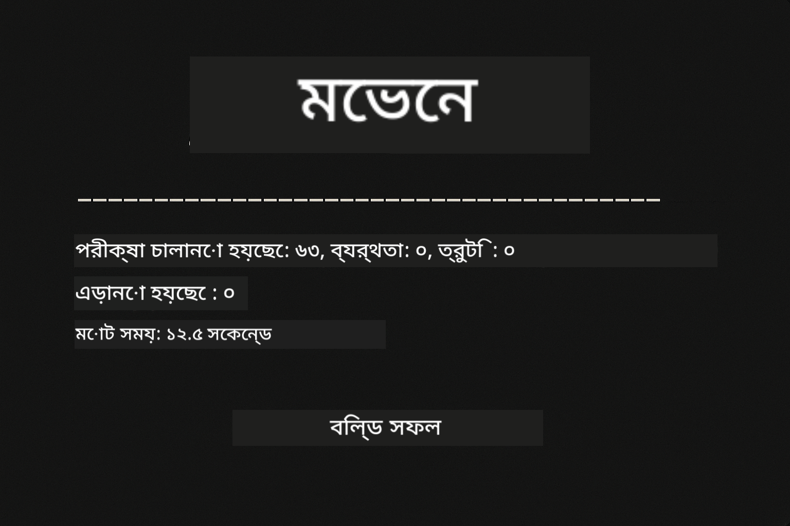
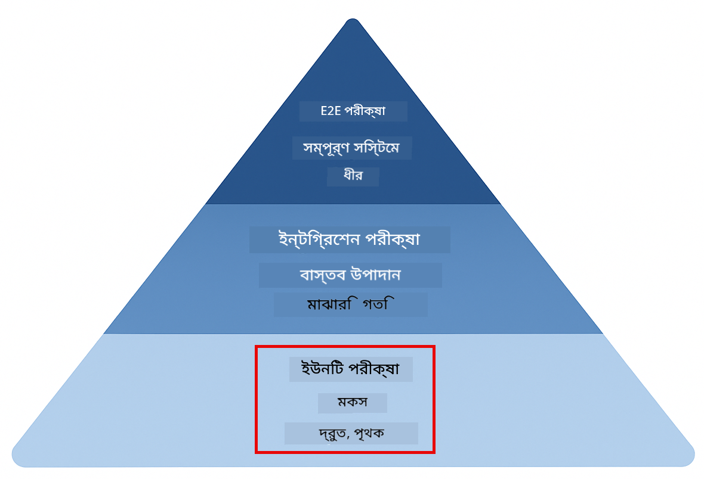
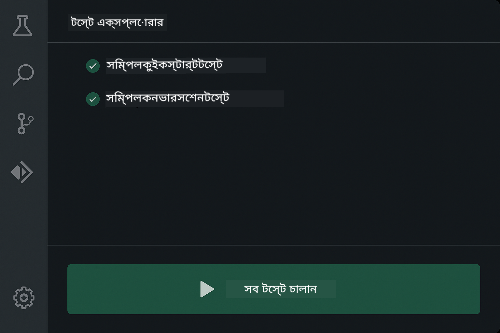
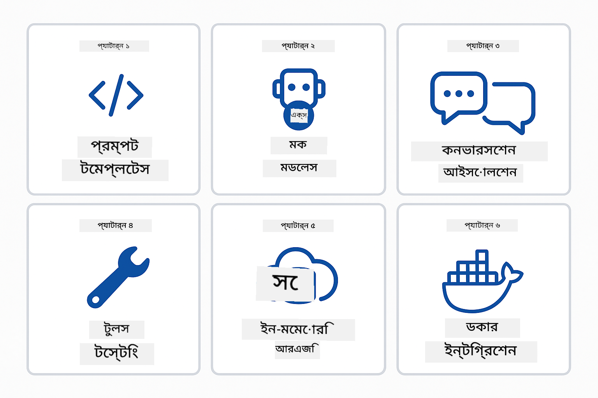
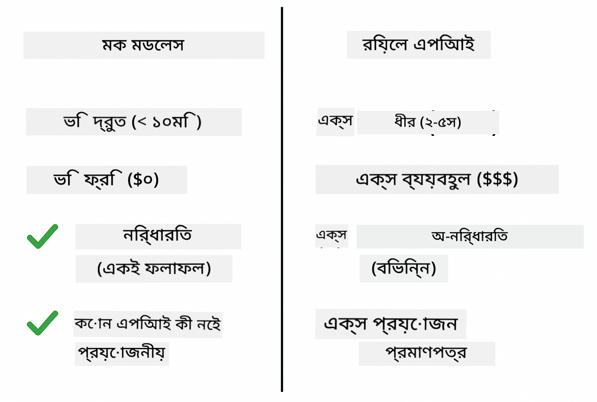
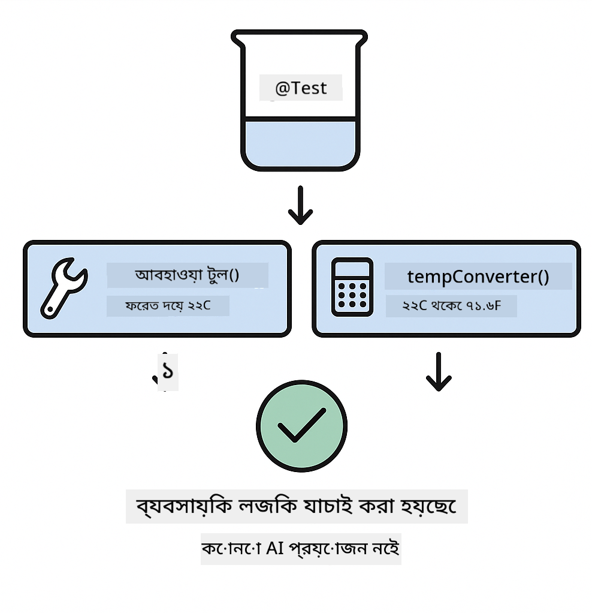
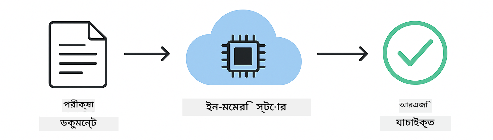
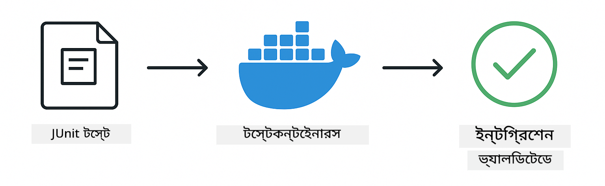

<!--
CO_OP_TRANSLATOR_METADATA:
{
  "original_hash": "b975537560c404d5f254331832811e78",
  "translation_date": "2025-12-13T20:50:17+00:00",
  "source_file": "docs/TESTING.md",
  "language_code": "bn"
}
-->
# LangChain4j অ্যাপ্লিকেশন পরীক্ষা

## বিষয়বস্তু

- [দ্রুত শুরু](../../../docs)
- [পরীক্ষাগুলো কি কভার করে](../../../docs)
- [পরীক্ষাগুলো চালানো](../../../docs)
- [VS কোডে পরীক্ষা চালানো](../../../docs)
- [পরীক্ষার প্যাটার্ন](../../../docs)
- [পরীক্ষার দর্শন](../../../docs)
- [পরবর্তী ধাপ](../../../docs)

এই গাইডটি আপনাকে এমন পরীক্ষাগুলোর মাধ্যমে নিয়ে যাবে যা দেখায় কীভাবে API কী বা বাহ্যিক সেবা ছাড়াই AI অ্যাপ্লিকেশন পরীক্ষা করা যায়।

## দ্রুত শুরু

একটি কমান্ড দিয়ে সব পরীক্ষা চালান:

**Bash:**
```bash
mvn test
```

**PowerShell:**
```powershell
mvn --% test
```



*সফল পরীক্ষার ফলাফল যেখানে সব পরীক্ষা পাস করেছে এবং কোনো ব্যর্থতা নেই*

## পরীক্ষাগুলো কি কভার করে

এই কোর্সটি **ইউনিট টেস্ট** এর উপর ফোকাস করে যা লোকালি চলে। প্রতিটি পরীক্ষা একটি নির্দিষ্ট LangChain4j ধারণাকে আলাদাভাবে প্রদর্শন করে।



*পরীক্ষার পিরামিড যা ইউনিট টেস্ট (দ্রুত, বিচ্ছিন্ন), ইন্টিগ্রেশন টেস্ট (বাস্তব উপাদান), এবং এন্ড-টু-এন্ড টেস্ট (ডকার সহ পূর্ণ সিস্টেম) এর মধ্যে ভারসাম্য দেখায়। এই প্রশিক্ষণ ইউনিট টেস্টিং কভার করে।*

| মডিউল | পরীক্ষা | ফোকাস | মূল ফাইলসমূহ |
|--------|-------|-------|-----------|
| **00 - দ্রুত শুরু** | 6 | প্রম্পট টেমপ্লেট এবং ভেরিয়েবল প্রতিস্থাপন | `SimpleQuickStartTest.java` |
| **01 - পরিচিতি** | 8 | কথোপকথন মেমরি এবং স্টেটফুল চ্যাট | `SimpleConversationTest.java` |
| **02 - প্রম্পট ইঞ্জিনিয়ারিং** | 12 | GPT-5 প্যাটার্ন, আগ্রহের স্তর, কাঠামোবদ্ধ আউটপুট | `SimpleGpt5PromptTest.java` |
| **03 - RAG** | 10 | ডকুমেন্ট ইনজেশন, এমবেডিং, সাদৃশ্য অনুসন্ধান | `DocumentServiceTest.java` |
| **04 - টুলস** | 12 | ফাংশন কলিং এবং টুল চেইনিং | `SimpleToolsTest.java` |
| **05 - MCP** | 15 | মডেল কনটেক্সট প্রোটোকল ডকার সহ | `SimpleMcpTest.java`, `McpDockerTransportTest.java` |

## পরীক্ষাগুলো চালানো

**রুট থেকে সব পরীক্ষা চালান:**

**Bash:**
```bash
mvn test
```

**PowerShell:**
```powershell
mvn --% test
```

**নির্দিষ্ট মডিউলের পরীক্ষা চালান:**

**Bash:**
```bash
cd 01-introduction && mvn test
# অথবা রুট থেকে
mvn test -pl 01-introduction
```

**PowerShell:**
```powershell
cd 01-introduction; mvn --% test
# অথবা রুট থেকে
mvn --% test -pl 01-introduction
```

**একটি নির্দিষ্ট টেস্ট ক্লাস চালান:**

**Bash:**
```bash
mvn test -Dtest=SimpleConversationTest
```

**PowerShell:**
```powershell
mvn --% test -Dtest=SimpleConversationTest
```

**নির্দিষ্ট একটি টেস্ট মেথড চালান:**

**Bash:**
```bash
mvn test -Dtest=SimpleConversationTest#কথোপকথনের ইতিহাস বজায় রাখা উচিত
```

**PowerShell:**
```powershell
mvn --% test -Dtest=SimpleConversationTest#কথোপকথনের ইতিহাস বজায় রাখা উচিত
```

## VS কোডে পরীক্ষা চালানো

যদি আপনি Visual Studio Code ব্যবহার করেন, তাহলে Test Explorer গ্রাফিক্যাল ইন্টারফেস প্রদান করে যা থেকে পরীক্ষা চালানো এবং ডিবাগ করা যায়।



*VS কোড টেস্ট এক্সপ্লোরার দেখাচ্ছে টেস্ট ট্রি যেখানে সব Java টেস্ট ক্লাস এবং পৃথক টেস্ট মেথড রয়েছে*

**VS কোডে পরীক্ষা চালানোর জন্য:**

1. Activity Bar-এ বীকার আইকনে ক্লিক করে Test Explorer খুলুন
2. টেস্ট ট্রি এক্সপ্যান্ড করে সব মডিউল এবং টেস্ট ক্লাস দেখুন
3. যেকোনো টেস্টের পাশে প্লে বাটনে ক্লিক করে আলাদাভাবে চালান
4. "Run All Tests" ক্লিক করে পুরো স্যুট চালান
5. যেকোনো টেস্টে রাইট-ক্লিক করে "Debug Test" নির্বাচন করে ব্রেকপয়েন্ট সেট করুন এবং কোড ধাপে ধাপে চালান

Test Explorer পাস হওয়া টেস্টের জন্য সবুজ চেকমার্ক দেখায় এবং ব্যর্থ হলে বিস্তারিত ত্রুটি বার্তা দেয়।

## পরীক্ষার প্যাটার্ন



*LangChain4j অ্যাপ্লিকেশনের জন্য ছয়টি পরীক্ষার প্যাটার্ন: প্রম্পট টেমপ্লেট, মকিং মডেল, কথোপকথন বিচ্ছিন্নতা, টুলস টেস্টিং, ইন-মেমরি RAG, এবং ডকার ইন্টিগ্রেশন*

### প্যাটার্ন ১: প্রম্পট টেমপ্লেট পরীক্ষা

সবচেয়ে সহজ প্যাটার্ন হল প্রম্পট টেমপ্লেট পরীক্ষা করা যা কোনো AI মডেল কল করে না। আপনি যাচাই করেন যে ভেরিয়েবল প্রতিস্থাপন সঠিকভাবে কাজ করছে এবং প্রম্পটগুলি প্রত্যাশিত ফরম্যাটে আছে।


*প্রম্পট টেমপ্লেট পরীক্ষা দেখাচ্ছে ভেরিয়েবল প্রতিস্থাপনের প্রবাহ: প্লেসহোল্ডারসহ টেমপ্লেট → মান প্রয়োগ → ফরম্যাটেড আউটপুট যাচাই*

```java
@Test
@DisplayName("Should format prompt template with variables")
void testPromptTemplateFormatting() {
    PromptTemplate template = PromptTemplate.from(
        "Best time to visit {{destination}} for {{activity}}?"
    );
    
    Prompt prompt = template.apply(Map.of(
        "destination", "Paris",
        "activity", "sightseeing"
    ));
    
    assertThat(prompt.text()).isEqualTo("Best time to visit Paris for sightseeing?");
}
```

এই পরীক্ষা `00-quick-start/src/test/java/com/example/langchain4j/quickstart/SimpleQuickStartTest.java` এ অবস্থিত।

**চালান:**

**Bash:**
```bash
cd 00-quick-start && mvn test -Dtest=SimpleQuickStartTest#টেস্টপ্রম্পটটেমপ্লেটফরম্যাটিং
```

**PowerShell:**
```powershell
cd 00-quick-start; mvn --% test -Dtest=SimpleQuickStartTest#টেস্টপ্রম্পটটেমপ্লেটফরম্যাটিং
```

### প্যাটার্ন ২: ভাষা মডেল মকিং

কথোপকথন লজিক পরীক্ষা করার সময়, Mockito ব্যবহার করে নকল মডেল তৈরি করুন যা পূর্বনির্ধারিত প্রতিক্রিয়া দেয়। এতে পরীক্ষা দ্রুত, বিনামূল্যে এবং নির্ধারিত হয়।



*তুলনা দেখাচ্ছে কেন মক টেস্টিং পছন্দনীয়: দ্রুত, বিনামূল্যে, নির্ধারিত এবং API কী ছাড়াই*

```java
@ExtendWith(MockitoExtension.class)
class SimpleConversationTest {
    
    private ConversationService conversationService;
    
    @Mock
    private OpenAiOfficialChatModel mockChatModel;
    
    @BeforeEach
    void setUp() {
        ChatResponse mockResponse = ChatResponse.builder()
            .aiMessage(AiMessage.from("This is a test response"))
            .build();
        when(mockChatModel.chat(anyList())).thenReturn(mockResponse);
        
        conversationService = new ConversationService(mockChatModel);
    }
    
    @Test
    void shouldMaintainConversationHistory() {
        String conversationId = conversationService.startConversation();
        
        ChatResponse mockResponse1 = ChatResponse.builder()
            .aiMessage(AiMessage.from("Response 1"))
            .build();
        ChatResponse mockResponse2 = ChatResponse.builder()
            .aiMessage(AiMessage.from("Response 2"))
            .build();
        ChatResponse mockResponse3 = ChatResponse.builder()
            .aiMessage(AiMessage.from("Response 3"))
            .build();
        
        when(mockChatModel.chat(anyList()))
            .thenReturn(mockResponse1)
            .thenReturn(mockResponse2)
            .thenReturn(mockResponse3);

        conversationService.chat(conversationId, "First message");
        conversationService.chat(conversationId, "Second message");
        conversationService.chat(conversationId, "Third message");

        List<ChatMessage> history = conversationService.getHistory(conversationId);
        assertThat(history).hasSize(6); // ৩ ব্যবহারকারী + ৩ এআই বার্তা
    }
}
```

এই প্যাটার্ন `01-introduction/src/test/java/com/example/langchain4j/service/SimpleConversationTest.java` এ আছে। মক নিশ্চিত করে যে মেমরি ব্যবস্থাপনা সঠিকভাবে কাজ করছে।

### প্যাটার্ন ৩: কথোপকথন বিচ্ছিন্নতা পরীক্ষা

কথোপকথন মেমরি একাধিক ব্যবহারকারীকে আলাদা রাখতে হবে। এই পরীক্ষা যাচাই করে যে কথোপকথনগুলো কনটেক্সট মিশ্রিত হয় না।


*কথোপকথন বিচ্ছিন্নতা পরীক্ষা দেখাচ্ছে বিভিন্ন ব্যবহারকারীর জন্য আলাদা মেমরি স্টোর যাতে কনটেক্সট মিশ্রিত না হয়*

```java
@Test
void shouldIsolateConversationsByid() {
    String conv1 = conversationService.startConversation();
    String conv2 = conversationService.startConversation();
    
    ChatResponse mockResponse = ChatResponse.builder()
        .aiMessage(AiMessage.from("Response"))
        .build();
    when(mockChatModel.chat(anyList())).thenReturn(mockResponse);

    conversationService.chat(conv1, "Message for conversation 1");
    conversationService.chat(conv2, "Message for conversation 2");

    List<ChatMessage> history1 = conversationService.getHistory(conv1);
    List<ChatMessage> history2 = conversationService.getHistory(conv2);
    
    assertThat(history1).hasSize(2);
    assertThat(history2).hasSize(2);
}
```

প্রতিটি কথোপকথন তার নিজস্ব স্বাধীন ইতিহাস রাখে। প্রোডাকশন সিস্টেমে, এই বিচ্ছিন্নতা মাল্টি-ইউজার অ্যাপ্লিকেশনের জন্য অত্যন্ত গুরুত্বপূর্ণ।

### প্যাটার্ন ৪: টুলস স্বাধীনভাবে পরীক্ষা

টুলস হল ফাংশন যা AI কল করতে পারে। সেগুলো সরাসরি পরীক্ষা করুন যাতে নিশ্চিত হওয়া যায় সেগুলো AI সিদ্ধান্তের বাইরে সঠিক কাজ করে।



*টুলস স্বাধীনভাবে পরীক্ষা দেখাচ্ছে মক টুল এক্সিকিউশন AI কল ছাড়াই ব্যবসায়িক লজিক যাচাই করার জন্য*

```java
@Test
void shouldConvertCelsiusToFahrenheit() {
    TemperatureTool tempTool = new TemperatureTool();
    String result = tempTool.celsiusToFahrenheit(25.0);
    assertThat(result).containsPattern("77[.,]0°F");
}

@Test
void shouldDemonstrateToolChaining() {
    WeatherTool weatherTool = new WeatherTool();
    TemperatureTool tempTool = new TemperatureTool();

    String weatherResult = weatherTool.getCurrentWeather("Seattle");
    assertThat(weatherResult).containsPattern("\\d+°C");

    String conversionResult = tempTool.celsiusToFahrenheit(22.0);
    assertThat(conversionResult).containsPattern("71[.,]6°F");
}
```

এই পরীক্ষা `04-tools/src/test/java/com/example/langchain4j/agents/tools/SimpleToolsTest.java` থেকে এসেছে যা AI জড়িত না থেকে টুল লজিক যাচাই করে। চেইনিং উদাহরণ দেখায় কিভাবে একটি টুলের আউটপুট অন্যটির ইনপুটে যায়।

### প্যাটার্ন ৫: ইন-মেমরি RAG পরীক্ষা

RAG সিস্টেম সাধারণত ভেক্টর ডাটাবেস এবং এমবেডিং সেবা প্রয়োজন। ইন-মেমরি প্যাটার্ন আপনাকে সম্পূর্ণ পাইপলাইন বাহ্যিক নির্ভরতা ছাড়াই পরীক্ষা করতে দেয়।



*ইন-মেমরি RAG পরীক্ষার ওয়ার্কফ্লো দেখাচ্ছে ডকুমেন্ট পার্সিং, এমবেডিং স্টোরেজ, এবং সাদৃশ্য অনুসন্ধান ডাটাবেস ছাড়াই*

```java
@Test
void testProcessTextDocument() {
    String content = "This is a test document.\nIt has multiple lines.";
    InputStream inputStream = new ByteArrayInputStream(content.getBytes(StandardCharsets.UTF_8));
    
    DocumentService.ProcessedDocument result = 
        documentService.processDocument(inputStream, "test.txt");

    assertNotNull(result);
    assertTrue(result.segments().size() > 0);
    assertEquals("test.txt", result.segments().get(0).metadata().getString("filename"));
}
```

এই পরীক্ষা `03-rag/src/test/java/com/example/langchain4j/rag/service/DocumentServiceTest.java` থেকে এসেছে যা মেমরিতে একটি ডকুমেন্ট তৈরি করে এবং চাঙ্কিং ও মেটাডেটা হ্যান্ডলিং যাচাই করে।

### প্যাটার্ন ৬: ডকার সহ ইন্টিগ্রেশন টেস্টিং

কিছু ফিচার বাস্তব অবকাঠামো প্রয়োজন। MCP মডিউল Testcontainers ব্যবহার করে ডকার কন্টেইনার চালু করে ইন্টিগ্রেশন টেস্ট করে। এগুলো যাচাই করে আপনার কোড বাস্তব সেবার সাথে কাজ করে এবং টেস্ট বিচ্ছিন্নতা বজায় থাকে।



*MCP ইন্টিগ্রেশন টেস্টিং Testcontainers সহ দেখাচ্ছে স্বয়ংক্রিয় কন্টেইনার লাইফসাইকেল: শুরু, পরীক্ষা চালানো, বন্ধ, এবং ক্লিনআপ*

`05-mcp/src/test/java/com/example/langchain4j/mcp/McpDockerTransportTest.java` এর পরীক্ষা চালাতে ডকার চালু থাকতে হবে।

**চালান:**

**Bash:**
```bash
cd 05-mcp && mvn test
```

**PowerShell:**
```powershell
cd 05-mcp; mvn --% test
```

## পরীক্ষার দর্শন

আপনার কোড পরীক্ষা করুন, AI নয়। আপনার পরীক্ষা যাচাই করবে আপনি কীভাবে প্রম্পট তৈরি করছেন, মেমরি পরিচালনা করছেন, এবং টুলস চালাচ্ছেন। AI প্রতিক্রিয়া পরিবর্তনশীল এবং পরীক্ষার দাবিতে থাকা উচিত নয়। নিজেকে জিজ্ঞাসা করুন আপনার প্রম্পট টেমপ্লেট সঠিকভাবে ভেরিয়েবল প্রতিস্থাপন করছে কিনা, AI সঠিক উত্তর দিচ্ছে কিনা নয়।

ভাষা মডেলের জন্য মক ব্যবহার করুন। এগুলো বাহ্যিক নির্ভরতা যা ধীর, ব্যয়বহুল, এবং অ-নির্ধারিত। মকিং পরীক্ষাকে দ্রুত (মিলিসেকেন্ডে), বিনামূল্যে (কোনো API খরচ ছাড়াই), এবং নির্ধারিত করে তোলে।

পরীক্ষাগুলো স্বাধীন রাখুন। প্রতিটি পরীক্ষা নিজস্ব ডেটা সেটআপ করবে, অন্য পরীক্ষার উপর নির্ভর করবে না, এবং নিজেই ক্লিনআপ করবে। পরীক্ষাগুলো চালানোর ক্রম নির্বিশেষে পাস হওয়া উচিত।

সুখী পথের বাইরে এজ কেস পরীক্ষা করুন। খালি ইনপুট, খুব বড় ইনপুট, বিশেষ অক্ষর, অবৈধ প্যারামিটার, এবং সীমান্ত শর্ত পরীক্ষা করুন। এগুলো প্রায়ই এমন বাগ ফাঁস করে যা সাধারণ ব্যবহার ফাঁস করে না।

বর্ণনামূলক নাম ব্যবহার করুন। `shouldMaintainConversationHistoryAcrossMultipleMessages()` এর সাথে `test1()` তুলনা করুন। প্রথমটি স্পষ্ট বলে কি পরীক্ষা হচ্ছে, যা ব্যর্থতা ডিবাগ করা সহজ করে।

## পরবর্তী ধাপ

এখন যেহেতু আপনি পরীক্ষার প্যাটার্ন বুঝেছেন, প্রতিটি মডিউলে গভীরভাবে প্রবেশ করুন:

- **[00 - দ্রুত শুরু](../00-quick-start/README.md)** - প্রম্পট টেমপ্লেটের বেসিক দিয়ে শুরু করুন
- **[01 - পরিচিতি](../01-introduction/README.md)** - কথোপকথন মেমরি ব্যবস্থাপনা শিখুন
- **[02 - প্রম্পট ইঞ্জিনিয়ারিং](../02-prompt-engineering/README.md)** - GPT-5 প্রম্পটিং প্যাটার্ন মাস্টার করুন
- **[03 - RAG](../03-rag/README.md)** - রিট্রিভাল-অগমেন্টেড জেনারেশন সিস্টেম তৈরি করুন
- **[04 - টুলস](../04-tools/README.md)** - ফাংশন কলিং এবং টুল চেইন বাস্তবায়ন করুন
- **[05 - MCP](../05-mcp/README.md)** - মডেল কনটেক্সট প্রোটোকল ডকার সহ ইন্টিগ্রেট করুন

প্রতিটি মডিউলের README এখানে পরীক্ষিত ধারণাগুলোর বিস্তারিত ব্যাখ্যা দেয়।

---

**নেভিগেশন:** [← প্রধান পৃষ্ঠায় ফিরে যান](../README.md)

---

<!-- CO-OP TRANSLATOR DISCLAIMER START -->
**অস্বীকৃতি**:  
এই নথিটি AI অনুবাদ সেবা [Co-op Translator](https://github.com/Azure/co-op-translator) ব্যবহার করে অনূদিত হয়েছে। আমরা যথাসাধ্য সঠিকতার চেষ্টা করি, তবে স্বয়ংক্রিয় অনুবাদে ত্রুটি বা অসঙ্গতি থাকতে পারে। মূল নথিটি তার নিজস্ব ভাষায়ই কর্তৃত্বপূর্ণ উৎস হিসেবে বিবেচিত হওয়া উচিত। গুরুত্বপূর্ণ তথ্যের জন্য পেশাদার মানব অনুবাদ গ্রহণ করার পরামর্শ দেওয়া হয়। এই অনুবাদের ব্যবহারে সৃষ্ট কোনো ভুল বোঝাবুঝি বা ভুল ব্যাখ্যার জন্য আমরা দায়ী নই।
<!-- CO-OP TRANSLATOR DISCLAIMER END -->