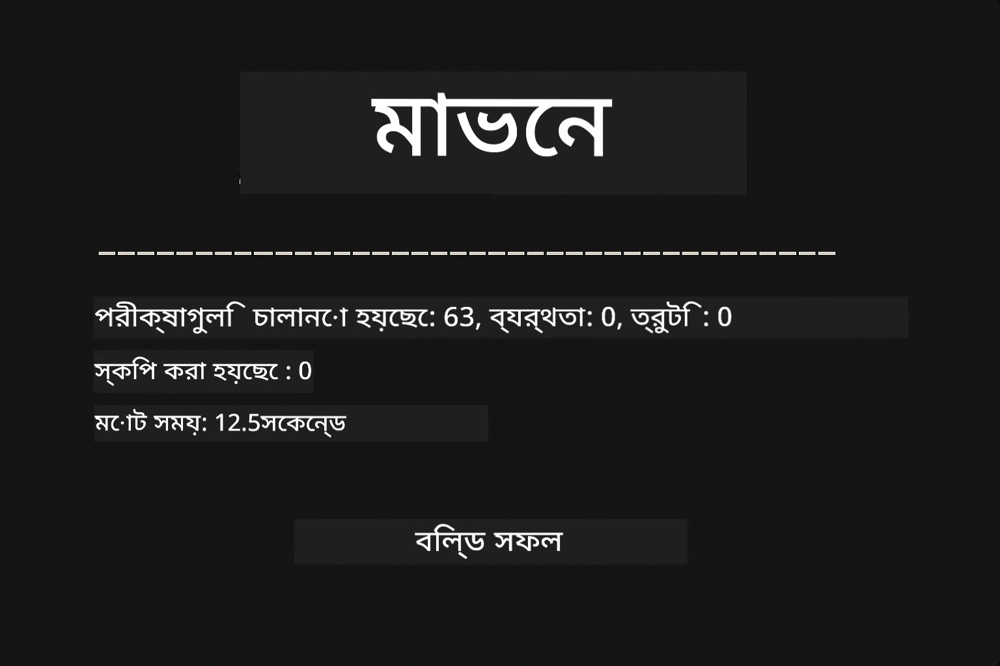
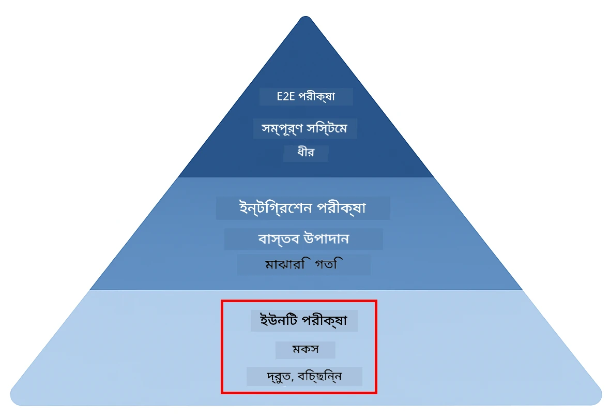
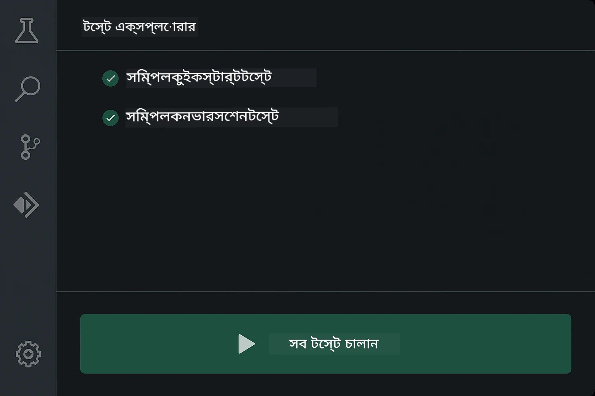
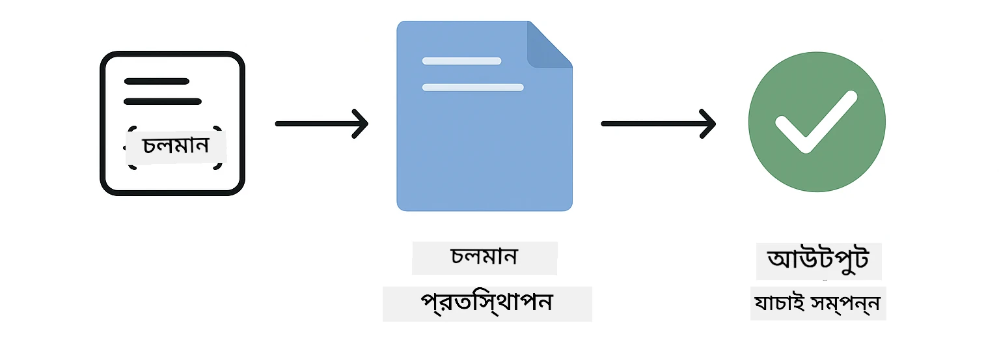
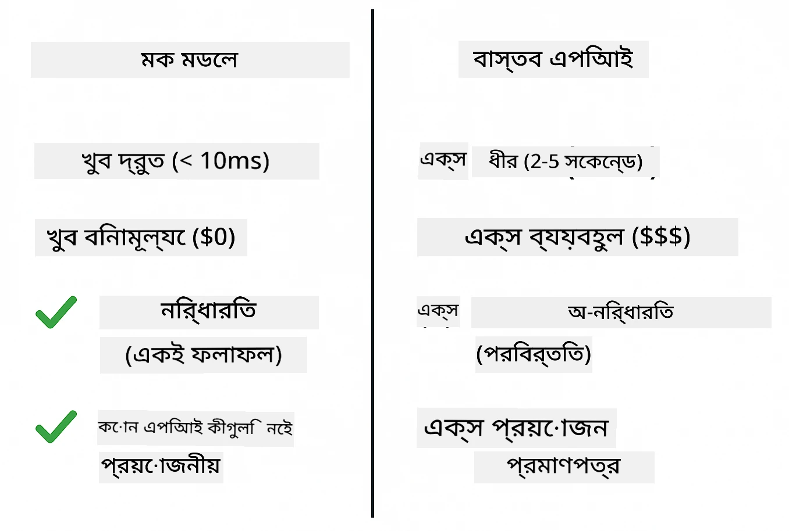
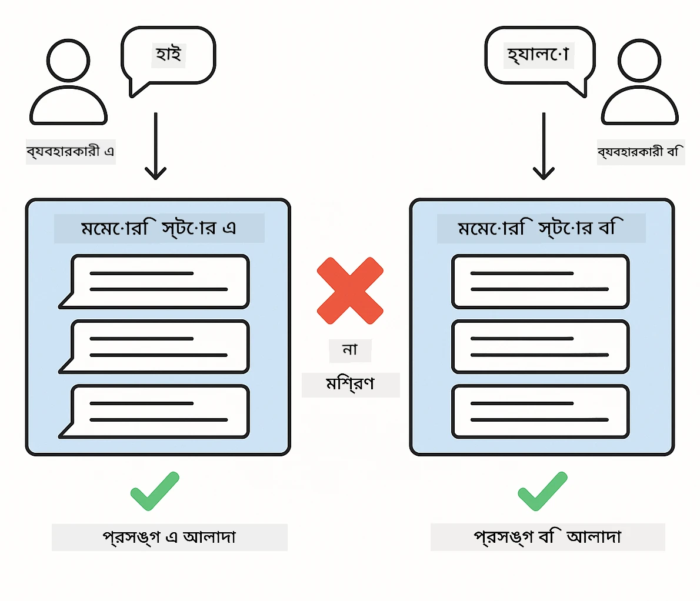
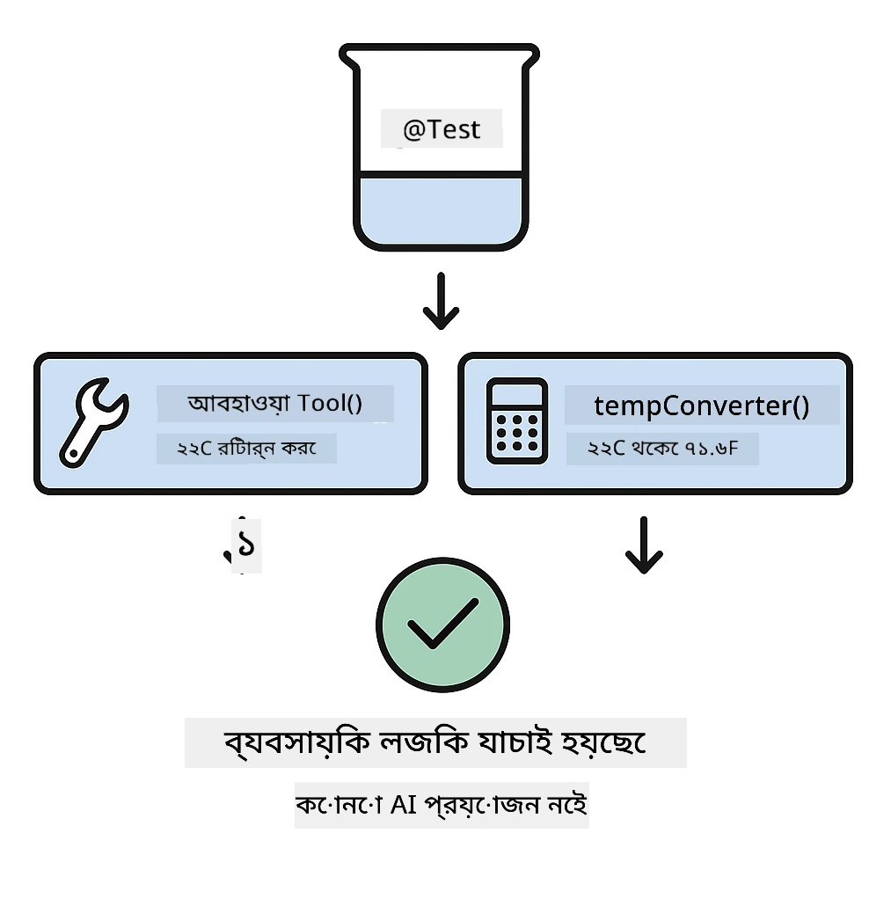
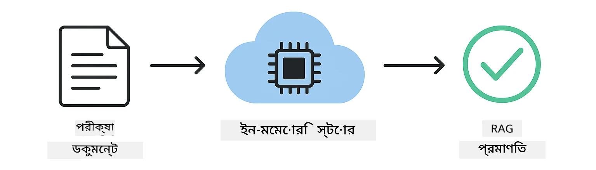

# LangChain4j অ্যাপ্লিকেশনগুলি পরীক্ষা করা

## বিষয়বস্তু সূচি

- [দ্রুত শুরু](#দ্রুত-শুরু)
- [পরীক্ষাগুলো কি অন্তর্ভুক্ত করে](#পরীক্ষাগুলো-কি-অন্তর্ভুক্ত-করে)
- [পরীক্ষাগুলো চালানো](#পরীক্ষাগুলো-চালানো)
- [VS Code-এ পরীক্ষাগুলো চালানো](#vs-code-এ-পরীক্ষাগুলো-চালানো)
- [পরীক্ষার প্যাটার্নসমূহ](#পরীক্ষার-প্যাটার্নসমূহ)
- [পরীক্ষার দর্শন](#পরীক্ষার-দর্শন)
- [পরবর্তী ধাপসমূহ](#পরবর্তী-ধাপসমূহ)

এই গাইডটি আপনাকে এমন পরীক্ষাগুলো দেখাবে যা API কী বা বাহ্যিক সার্ভিস ছাড়াই AI অ্যাপ্লিকেশনগুলি কিভাবে পরীক্ষা করতে হয় তা প্রদর্শন করে।

## দ্রুত শুরু

একটি কমান্ড দিয়ে সকল পরীক্ষা চালান:

**Bash:**
```bash
mvn test
```

**PowerShell:**
```powershell
mvn --% test
```

যখন সব পরীক্ষার ফলাফল পাস হয়, নিচের স্ক্রিনশটের মতো আউটপুট দেখতে পাবেন — পরীক্ষাগুলো শূন্য ত্রুটির সাথে চলছে।



*সফল পরীক্ষা চালানোর ফলাফল যেখানে সব পরীক্ষা শূন্য ত্রুটি নিয়ে সফল হয়েছে*

## পরীক্ষাগুলো কি অন্তর্ভুক্ত করে

এই কোর্সটি **একক ইউনিট পরীক্ষার** উপর ফোকাস করে যা স্থানীয়ভাবে চলে। প্রতিটি পরীক্ষা একটি LangChain4j ধারণা আলাদাভাবে প্রদর্শন করে। নিচের পরীক্ষার পিরামিড দেখায় যে ইউনিট পরীক্ষা কোথায় ফিট করে — এগুলো দ্রুত, নির্ভরযোগ্য ভিত্তি, যার উপর আপনার বাকি পরীক্ষা কৌশল গড়ে ওঠে।



*পরীক্ষার পিরামিড যা ইউনিট পরীক্ষা (দ্রুত, স্বতন্ত্র), ইন্টিগ্রেশন পরীক্ষা (বাস্তব উপাদান), এবং এন্ড-টু-এন্ড পরীক্ষা এর মধ্যে ভারসাম্য প্রদর্শন করে। এই প্রশিক্ষণ ইউনিট টেস্টিং আচ্ছাদন করে।*

| মডিউল | পরীক্ষা সংখ্যা | ফোকাস | মূল ফাইলসমূহ |
|--------|---------------|--------|--------------|
| **01 - পরিচিতি** | ৮ | কথোপকথন স্মৃতি ও অবস্থা সম্পন্ন চ্যাট | `SimpleConversationTest.java` |
| **02 - প্রম্পট ইঞ্জিনিয়ারিং** | ১২ | GPT-5.2 প্যাটার্ন, আগ্রহ স্তর, গঠনমূলক আউটপুট | `SimpleGpt5PromptTest.java` |
| **03 - RAG** | ১০ | ডকুমেন্ট ইনজেশন, এম্বেডিং, সাদৃশ্য অনুসন্ধান | `DocumentServiceTest.java` |
| **04 - টুলস** | ১২ | ফাংশন কলিং ও টুল চেইনিং | `SimpleToolsTest.java` |
| **05 - MCP** | ৮ | স্টডিও ট্রান্সপোর্টসহ মডেল কনটেক্সট প্রোটোকল | `SimpleMcpTest.java` |

## পরীক্ষাগুলো চালানো

**রুট থেকে সব পরীক্ষা চালান:**

**Bash:**
```bash
mvn test
```

**PowerShell:**
```powershell
mvn --% test
```

**নির্দিষ্ট মডিউলের পরীক্ষাগুলো চালান:**

**Bash:**
```bash
cd 01-introduction && mvn test
# বা রুট থেকে
mvn test -pl 01-introduction
```

**PowerShell:**
```powershell
cd 01-introduction; mvn --% test
# অথবা রুট থেকে
mvn --% test -pl 01-introduction
```

**একক টেস্ট ক্লাস চালান:**

**Bash:**
```bash
mvn test -Dtest=SimpleConversationTest
```

**PowerShell:**
```powershell
mvn --% test -Dtest=SimpleConversationTest
```

**নির্দিষ্ট একটি টেস্ট মেথড চালান:**

**Bash:**
```bash
mvn test -Dtest=SimpleConversationTest#কথোপকথনের ইতিহাস বজায় রাখা উচিত
```

**PowerShell:**
```powershell
mvn --% test -Dtest=SimpleConversationTest#কথোপকথন ইতিহাস বজায় রাখা উচিত
```

## VS Code-এ পরীক্ষাগুলো চালানো

আপনি যদি Visual Studio Code ব্যবহার করেন, তাহলে Test Explorer গ্রাফিকাল ইন্টারফেস প্রদান করে পরীক্ষাগুলো চালানো এবং ডিবাগ করার জন্য।



*VS Code Test Explorer যা সব Java টেস্ট ক্লাস এবং পৃথক টেস্ট মেথডের টেস্ট ট্রি দেখাচ্ছে*

**VS Code-এ পরীক্ষাগুলো চালানোর জন্য:**

1. Activity Bar-এ বীকার আইকনে ক্লিক করে Test Explorer খুলুন
2. টেস্ট ট্রি এক্সপ্যান্ড করে সব মডিউল ও টেস্ট ক্লাস দেখুন
3. কোন একটি টেস্টের পাশে প্লে বাটনে ক্লিক করে ব্যক্তিগতভাবে চালান
4. "Run All Tests" ক্লিক করে পুরো স্যুট চালান
5. কোন টেস্টে রাইট-ক্লিক করে "Debug Test" নির্বাচন করে ব্রেকপয়েন্ট বসিয়ে কোড স্টেপ করুন

টেস্ট এক্সপ্লোরার পাস করা টেস্টের জন্য সবুজ চেকমার্ক দেখায় এবং ব্যর্থ হলে বিস্তারিত ত্রুটি বার্তা দেয়।

## পরীক্ষার প্যাটার্নসমূহ

### প্যাটার্ন ১: প্রম্পট টেমপ্লেট পরীক্ষা

সবচেয়ে সহজ প্যাটার্ন হলো প্রম্পট টেমপ্লেট পরীক্ষা যা কোনো AI মডেল কল করে না। আপনি যাচাই করেন ভেরিয়েবল স্থাপন সঠিক হচ্ছে এবং প্রম্পটগুলো প্রত্যাশিত ফরম্যাটে আসে।



*প্রম্পট টেমপ্লেট পরীক্ষা যা ভেরিয়েবল স্থাপনের ফ্লো দেখায়: প্লেসহোল্ডারসহ টেমপ্লেট → মান প্রয়োগ → যাচাইকৃত ফরম্যাটেড আউটপুট*

```java
@Test
@DisplayName("Should format prompt template with variables")
void testPromptTemplateFormatting() {
    PromptTemplate template = PromptTemplate.from(
        "Best time to visit {{destination}} for {{activity}}?"
    );
    
    Prompt prompt = template.apply(Map.of(
        "destination", "Paris",
        "activity", "sightseeing"
    ));
    
    assertThat(prompt.text()).isEqualTo("Best time to visit Paris for sightseeing?");
}
```

এই প্যাটার্ন নিশ্চিত করে যে ভেরিয়েবল স্থাপন সঠিক এবং প্রম্পটগুলো প্রত্যাশিত রূপে ফরম্যাটেড — কোনো API কী বা মডেল কলের প্রয়োজন নেই।

### প্যাটার্ন ২: ভাষা মডেল মকিং

কথোপকথনের লজিক পরীক্ষা করার সময়, Mockito ব্যবহার করে কৃত্রিম মডেল তৈরি করুন যা পূর্বনির্ধারিত উত্তর দেয়। এভাবে পরীক্ষা দ্রুত, বিনামূল্যে এবং নিশ্চিত হয়।



*তুলনা দেখায় কেন পরীক্ষার জন্য মক পছন্দনীয়: দ্রুত, বিনামূল্যে, নিশ্চিত, এবং API কী প্রয়োজন হয় না*

```java
@ExtendWith(MockitoExtension.class)
class SimpleConversationTest {
    
    private ConversationService conversationService;
    
    @Mock
    private OpenAiOfficialChatModel mockChatModel;
    
    @BeforeEach
    void setUp() {
        ChatResponse mockResponse = ChatResponse.builder()
            .aiMessage(AiMessage.from("This is a test response"))
            .build();
        when(mockChatModel.chat(anyList())).thenReturn(mockResponse);
        
        conversationService = new ConversationService(mockChatModel);
    }
    
    @Test
    void shouldMaintainConversationHistory() {
        String conversationId = conversationService.startConversation();
        
        ChatResponse mockResponse1 = ChatResponse.builder()
            .aiMessage(AiMessage.from("Response 1"))
            .build();
        ChatResponse mockResponse2 = ChatResponse.builder()
            .aiMessage(AiMessage.from("Response 2"))
            .build();
        ChatResponse mockResponse3 = ChatResponse.builder()
            .aiMessage(AiMessage.from("Response 3"))
            .build();
        
        when(mockChatModel.chat(anyList()))
            .thenReturn(mockResponse1)
            .thenReturn(mockResponse2)
            .thenReturn(mockResponse3);

        conversationService.chat(conversationId, "First message");
        conversationService.chat(conversationId, "Second message");
        conversationService.chat(conversationId, "Third message");

        List<ChatMessage> history = conversationService.getHistory(conversationId);
        assertThat(history).hasSize(6); // ৩ ব্যবহারকারী + ৩ এআই বার্তা
    }
}
```

এই প্যাটার্ন `01-introduction/src/test/java/com/example/langchain4j/service/SimpleConversationTest.java` এ আছে। মক নিশ্চিত করে যে আচরণ সঙ্গতিপূর্ণ, যাতে আপনি যাচাই করতে পারেন স্মৃতি পরিচালনা সঠিক হচ্ছে।

### প্যাটার্ন ৩: কথোপকথন বিচ্ছিন্নতা পরীক্ষা

কথোপকথনের স্মৃতি একাধিক ব্যবহারকারীর আলাদা রাখতে হবে। এই পরীক্ষা যাচাই করে যে কথোপকথনগুলি ভিন্ন ভিন্ন প্রসঙ্গ মিশ্রিত হয় না।



*কথোপকথন বিচ্ছিন্নতা পরীক্ষা যা আলাদা ব্যবহারকারীর স্মৃতি স্টোর আলাদা রাখে যেন প্রসঙ্গ না মিশ্রিত হয়*

```java
@Test
void shouldIsolateConversationsByid() {
    String conv1 = conversationService.startConversation();
    String conv2 = conversationService.startConversation();
    
    ChatResponse mockResponse = ChatResponse.builder()
        .aiMessage(AiMessage.from("Response"))
        .build();
    when(mockChatModel.chat(anyList())).thenReturn(mockResponse);

    conversationService.chat(conv1, "Message for conversation 1");
    conversationService.chat(conv2, "Message for conversation 2");

    List<ChatMessage> history1 = conversationService.getHistory(conv1);
    List<ChatMessage> history2 = conversationService.getHistory(conv2);
    
    assertThat(history1).hasSize(2);
    assertThat(history2).hasSize(2);
}
```

প্রতিটি কথোপকথন তার স্বাধীন ইতিহাস সংরক্ষণ করে। উৎপাদন সিস্টেমে, বহুব্যবহারকারী অ্যাপ্লিকেশনের জন্য এই বিচ্ছিন্নতা অত্যাবশ্যক।

### প্যাটার্ন ৪: টুলস স্বাধীনভাবে পরীক্ষা

টুলস এমন ফাংশন যা AI কল করতে পারে। AI সিদ্ধান্তের বাইরেই সরাসরি টুলগুলো পরীক্ষা করুন যেন তারা সঠিক কাজ করে।



*টুলস স্বাধীনভাবে পরীক্ষা, AI কল ছাড়াই ব্যবসায়িক লজিক যাচাই করার জন্য*

```java
@Test
void shouldConvertCelsiusToFahrenheit() {
    TemperatureTool tempTool = new TemperatureTool();
    String result = tempTool.celsiusToFahrenheit(25.0);
    assertThat(result).containsPattern("77[.,]0°F");
}

@Test
void shouldDemonstrateToolChaining() {
    WeatherTool weatherTool = new WeatherTool();
    TemperatureTool tempTool = new TemperatureTool();

    String weatherResult = weatherTool.getCurrentWeather("Seattle");
    assertThat(weatherResult).containsPattern("\\d+°C");

    String conversionResult = tempTool.celsiusToFahrenheit(22.0);
    assertThat(conversionResult).containsPattern("71[.,]6°F");
}
```

`04-tools/src/test/java/com/example/langchain4j/agents/tools/SimpleToolsTest.java` থেকে এই পরীক্ষাগুলো AI সম্পৃক্ততা ছাড়া টুল লজিক নিশ্চিত করে। চেইনিং উদাহরণে একটি টুলের আউটপুট অন্যটির ইনপুটে ফিড হয়।

### প্যাটার্ন ৫: ইন-মেমরি RAG পরীক্ষা

RAG সিস্টেম সাধারণত ভেক্টর ডাটাবেস এবং এম্বেডিং সার্ভিসের প্রয়োজন হয়। ইন-মেমরি প্যাটার্নটি আপনাকে সম্পূর্ণ পাইপলাইন পরীক্ষা করতে দেয় বাহ্যিক নির্ভরতা ছাড়াই।



*ইন-মেমরি RAG পরীক্ষা ওয়ার্কফ্লো যা ডকুমেন্ট পার্সিং, এম্বেডিং সংরক্ষণ, এবং সাদৃশ্য অনুসন্ধান দেখায় ডাটাবেসের প্রয়োজন ছাড়াই*

```java
@Test
void testProcessTextDocument() {
    String content = "This is a test document.\nIt has multiple lines.";
    InputStream inputStream = new ByteArrayInputStream(content.getBytes(StandardCharsets.UTF_8));
    
    DocumentService.ProcessedDocument result = 
        documentService.processDocument(inputStream, "test.txt");

    assertNotNull(result);
    assertTrue(result.segments().size() > 0);
    assertEquals("test.txt", result.segments().get(0).metadata().getString("filename"));
}
```

`03-rag/src/test/java/com/example/langchain4j/rag/service/DocumentServiceTest.java` থেকে এই পরীক্ষা ইন-মেমরিতে একটি ডকুমেন্ট তৈরি করে এবং চাংকিং ও মেটাডাটা পরিচালনা যাচাই করে।

### প্যাটার্ন ৬: MCP ইন্টিগ্রেশন পরীক্ষা

MCP মডিউল মডেল কনটেক্সট প্রোটোকল ইন্টিগ্রেশন পরীক্ষা করে stdio ট্রান্সপোর্ট ব্যবহার করে। এই পরীক্ষাগুলো যাচাই করে যে আপনার অ্যাপ MCP সার্ভার সাব-প্রসেস হিসেবে স্পন এবং যোগাযোগ করতে পারে।

`05-mcp/src/test/java/com/example/langchain4j/mcp/SimpleMcpTest.java` এ পরীক্ষাগুলো MCP ক্লায়েন্ট আচরণ যাচাই করে।

**চালান:**

**Bash:**
```bash
cd 05-mcp && mvn test
```

**PowerShell:**
```powershell
cd 05-mcp; mvn --% test
```

## পরীক্ষার দর্শন

আপনার কোড পরীক্ষা করুন, AI নয়। আপনার পরীক্ষাগুলো লিখিত কোড যাচাই করবে যেমন প্রম্পট কিভাবে গঠিত হচ্ছে, স্মৃতি কিভাবে পরিচালিত হচ্ছে, এবং টুলস কিভাবে কার্যকর হচ্ছে তা দেখে। AI প্রতিক্রিয়া পরিবর্তনশীল এবং পরীক্ষার দাবিতে থাকা উচিত নয়। নিজেকে প্রশ্ন করুন যে আপনার প্রম্পট টেমপ্লেট ভেরিয়েবল সঠিকভাবে প্রতিস্থাপন করছে কিনা, AI সঠিক উত্তর দিচ্ছে কিনা নয়।

ভাষা মডেলের জন্য মক ব্যবহার করুন। এগুলো বাহ্যিক নির্ভরতা, যা ধীর, খরচবহুল এবং অনির্ধারিত। মকিং পরীক্ষাকে দ্রুত করে, মিলিসেকেন্ডে সেকেন্ডের বদলে, বিনামূল্যে করে, এবং নিশ্চিত করে প্রত্যেক বার একই ফলাফল দেয়।

পরীক্ষাগুলো স্বাধীন রাখুন। প্রতিটি পরীক্ষা নিজস্ব ডাটা তৈরি করবে, অন্য পরীক্ষার ওপর নির্ভর করবে না, এবং নিজের পরিছন্নতা করবে। পরীক্ষা সঞ্চালনের ক্রম নির্বিশেষে পাস করা উচিত।

সুখী পথের বাইরে প্রান্তিক ক্ষেত্রে পরীক্ষা করুন। খালি ইনপুট, অত্যন্ত বড় ইনপুট, বিশেষ অক্ষর, অবৈধ প্যারামিটার, এবং সীমান্ত অবস্থান চেষ্টা করুন। এগুলো প্রায়ই এমন বাগ উদঘাটন করে যা সাধারণ ব্যবহার দেখায় না।

বর্ণনামূলক নাম ব্যবহার করুন। `shouldMaintainConversationHistoryAcrossMultipleMessages()` এবং `test1()` তুলনা করুন। প্রথমটি ঠিক কী পরীক্ষা হচ্ছে তা বলে, ব্যর্থতা ডিবাগ করা সহজ করে।

## পরবর্তী ধাপসমূহ

এখন যখন আপনি পরীক্ষার প্যাটার্নগুলো বুঝে গেছেন, প্রতিটি মডিউলে গভীরতর যান:

- **[01 - পরিচিতি](../01-introduction/README.md)** - কথোপকথন স্মৃতি ব্যবস্থাপনা শিখুন
- **[02 - প্রম্পট ইঞ্জিনিয়ারিং](../02-prompt-engineering/README.md)** - GPT-5.2 প্রম্পটিং প্যাটার্ন মাস্টার করুন
- **[03 - RAG](../03-rag/README.md)** - রিট্রিভাল-অগমেন্টেড জেনারেশন সিস্টেম তৈরি করুন
- **[04 - টুলস](../04-tools/README.md)** - ফাংশন কলিং এবং টুল চেইন বাস্তবায়ন করুন
- **[05 - MCP](../05-mcp/README.md)** - মডেল কনটেক্সট প্রোটোকল ইন্টিগ্রেট করুন

প্রতিটি মডিউলের README এখানে পরীক্ষিত ধারণাগুলোর বিস্তারিত ব্যাখ্যা প্রদান করে।

---

**নেভিগেশন:** [← প্রধান পৃষ্ঠায় ফিরে যান](../README.md)

---

<!-- CO-OP TRANSLATOR DISCLAIMER START -->
**অস্বীকৃতি**:
এই নথিটি AI অনুবাদ পরিষেবা [Co-op Translator](https://github.com/Azure/co-op-translator) ব্যবহার করে অনূদিত হয়েছে। যদিও আমরা শুদ্ধতার জন্য চেষ্টা করি, অনুগ্রহ করে মনে রাখবেন যে স্বয়ংক্রিয় অনুবাদে ত্রুটি বা অসঙ্গতি থাকতে পারে। মূল নথিটি তার স্বভাষায় কর্তৃত্বপূর্ণ উৎস হিসেবে বিবেচিত হওয়া উচিত। গুরুত্বপূর্ণ তথ্যের জন্য পেশাদার মানব অনুবাদ সুপারিশ করা হয়। এই অনুবাদের ব্যবহারে প্রয়োজনীয় ভুল বোঝাবুঝি বা ভুল ব্যাখ্যার জন্য আমরা দায়বদ্ধ নই।
<!-- CO-OP TRANSLATOR DISCLAIMER END -->