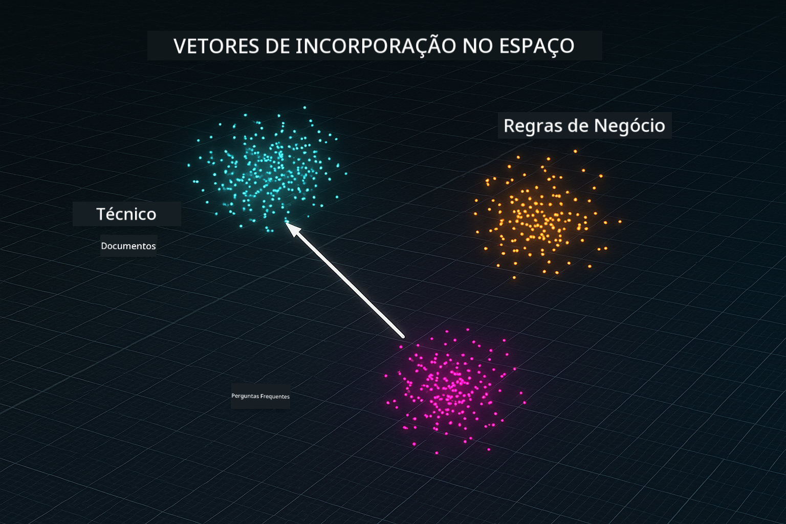
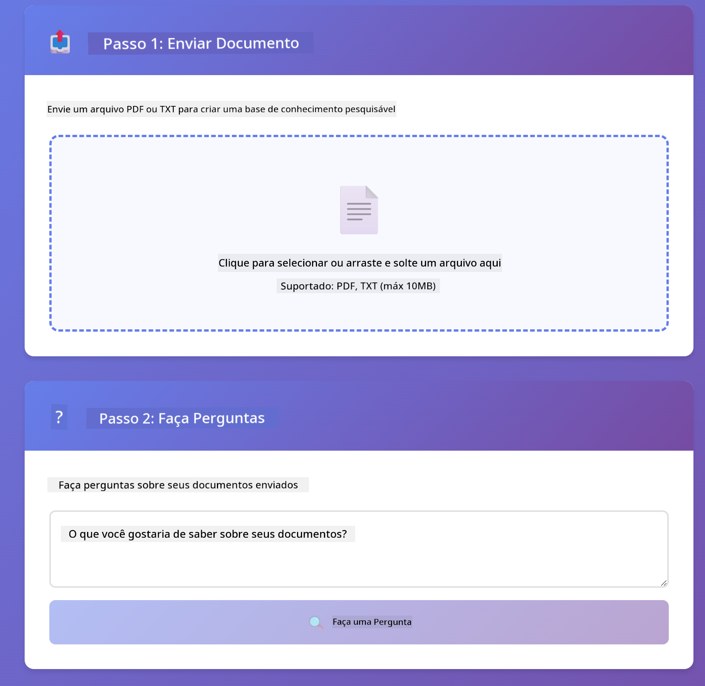

<!--
CO_OP_TRANSLATOR_METADATA:
{
  "original_hash": "f538a51cfd13147d40d84e936a0f485c",
  "translation_date": "2025-12-13T16:59:32+00:00",
  "source_file": "03-rag/README.md",
  "language_code": "br"
}
-->
# Módulo 03: RAG (Geração Aumentada por Recuperação)

## Índice

- [O que você vai aprender](../../../03-rag)
- [Pré-requisitos](../../../03-rag)
- [Entendendo o RAG](../../../03-rag)
- [Como funciona](../../../03-rag)
  - [Processamento de Documentos](../../../03-rag)
  - [Criando Embeddings](../../../03-rag)
  - [Busca Semântica](../../../03-rag)
  - [Geração de Respostas](../../../03-rag)
- [Executar a Aplicação](../../../03-rag)
- [Usando a Aplicação](../../../03-rag)
  - [Enviar um Documento](../../../03-rag)
  - [Fazer Perguntas](../../../03-rag)
  - [Verificar Referências de Fonte](../../../03-rag)
  - [Experimentar com Perguntas](../../../03-rag)
- [Conceitos-Chave](../../../03-rag)
  - [Estratégia de Chunking](../../../03-rag)
  - [Pontuações de Similaridade](../../../03-rag)
  - [Armazenamento em Memória](../../../03-rag)
  - [Gerenciamento da Janela de Contexto](../../../03-rag)
- [Quando o RAG é Importante](../../../03-rag)
- [Próximos Passos](../../../03-rag)

## O que você vai aprender

Nos módulos anteriores, você aprendeu como ter conversas com IA e estruturar seus prompts de forma eficaz. Mas há uma limitação fundamental: modelos de linguagem só sabem o que aprenderam durante o treinamento. Eles não conseguem responder perguntas sobre as políticas da sua empresa, a documentação do seu projeto ou qualquer informação que não tenha sido incluída no treinamento.

O RAG (Geração Aumentada por Recuperação) resolve esse problema. Em vez de tentar ensinar o modelo com suas informações (o que é caro e impraticável), você dá a ele a capacidade de buscar em seus documentos. Quando alguém faz uma pergunta, o sistema encontra informações relevantes e as inclui no prompt. O modelo então responde com base nesse contexto recuperado.

Pense no RAG como dar ao modelo uma biblioteca de referência. Quando você faz uma pergunta, o sistema:

1. **Consulta do Usuário** - Você faz uma pergunta  
2. **Embedding** - Converte sua pergunta em um vetor  
3. **Busca Vetorial** - Encontra pedaços de documentos similares  
4. **Montagem do Contexto** - Adiciona os pedaços relevantes ao prompt  
5. **Resposta** - O LLM gera uma resposta baseada no contexto  

Isso fundamenta as respostas do modelo nos seus dados reais, em vez de depender do conhecimento do treinamento ou inventar respostas.


*Fluxo de trabalho do RAG - da consulta do usuário à busca semântica até a geração de resposta contextual*

## Pré-requisitos

- Módulo 01 concluído (recursos Azure OpenAI implantados)  
- Arquivo `.env` no diretório raiz com credenciais Azure (criado pelo `azd up` no Módulo 01)  

> **Nota:** Se você não concluiu o Módulo 01, siga as instruções de implantação lá primeiro.

## Como funciona

**Processamento de Documentos** - [DocumentService.java](../../../03-rag/src/main/java/com/example/langchain4j/rag/service/DocumentService.java)

Quando você envia um documento, o sistema o divide em pedaços — partes menores que cabem confortavelmente na janela de contexto do modelo. Esses pedaços se sobrepõem ligeiramente para que você não perca o contexto nas bordas.

```java
Document document = FileSystemDocumentLoader.loadDocument("sample-document.txt");

DocumentSplitter splitter = DocumentSplitters
    .recursive(300, 30, new OpenAiTokenizer());

List<TextSegment> segments = splitter.split(document);
```

> **🤖 Experimente com o [GitHub Copilot](https://github.com/features/copilot) Chat:** Abra [`DocumentService.java`](../../../03-rag/src/main/java/com/example/langchain4j/rag/service/DocumentService.java) e pergunte:  
> - "Como o LangChain4j divide documentos em pedaços e por que a sobreposição é importante?"  
> - "Qual é o tamanho ideal dos pedaços para diferentes tipos de documentos e por quê?"  
> - "Como lidar com documentos em múltiplos idiomas ou com formatação especial?"

**Criando Embeddings** - [LangChainRagConfig.java](../../../03-rag/src/main/java/com/example/langchain4j/rag/config/LangChainRagConfig.java)

Cada pedaço é convertido em uma representação numérica chamada embedding — essencialmente uma impressão digital matemática que captura o significado do texto. Textos similares produzem embeddings similares.

```java
@Bean
public EmbeddingModel embeddingModel() {
    return OpenAiOfficialEmbeddingModel.builder()
        .baseUrl(azureOpenAiEndpoint)
        .apiKey(azureOpenAiKey)
        .modelName(azureEmbeddingDeploymentName)
        .build();
}

EmbeddingStore<TextSegment> embeddingStore = 
    new InMemoryEmbeddingStore<>();
```



*Documentos representados como vetores no espaço de embeddings - conteúdos similares se agrupam*

**Busca Semântica** - [RagService.java](../../../03-rag/src/main/java/com/example/langchain4j/rag/service/RagService.java)

Quando você faz uma pergunta, sua pergunta também vira um embedding. O sistema compara o embedding da sua pergunta com os embeddings de todos os pedaços de documentos. Ele encontra os pedaços com significados mais similares — não apenas palavras-chave correspondentes, mas similaridade semântica real.

```java
Embedding queryEmbedding = embeddingModel.embed(question).content();

List<EmbeddingMatch<TextSegment>> matches = 
    embeddingStore.findRelevant(queryEmbedding, 5, 0.7);

for (EmbeddingMatch<TextSegment> match : matches) {
    String relevantText = match.embedded().text();
    double score = match.score();
}
```

> **🤖 Experimente com o [GitHub Copilot](https://github.com/features/copilot) Chat:** Abra [`RagService.java`](../../../03-rag/src/main/java/com/example/langchain4j/rag/service/RagService.java) e pergunte:  
> - "Como funciona a busca por similaridade com embeddings e o que determina a pontuação?"  
> - "Qual limiar de similaridade devo usar e como isso afeta os resultados?"  
> - "Como lidar com casos onde nenhum documento relevante é encontrado?"

**Geração de Respostas** - [RagService.java](../../../03-rag/src/main/java/com/example/langchain4j/rag/service/RagService.java)

Os pedaços mais relevantes são incluídos no prompt para o modelo. O modelo lê esses pedaços específicos e responde sua pergunta com base nessa informação. Isso previne alucinações — o modelo só pode responder com o que está à sua frente.

## Executar a Aplicação

**Verifique a implantação:**

Certifique-se de que o arquivo `.env` existe no diretório raiz com as credenciais Azure (criado durante o Módulo 01):  
```bash
cat ../.env  # Deve mostrar AZURE_OPENAI_ENDPOINT, API_KEY, DEPLOYMENT
```
  
**Inicie a aplicação:**

> **Nota:** Se você já iniciou todas as aplicações usando `./start-all.sh` do Módulo 01, este módulo já está rodando na porta 8081. Você pode pular os comandos de início abaixo e ir direto para http://localhost:8081.

**Opção 1: Usando o Spring Boot Dashboard (Recomendado para usuários VS Code)**

O container de desenvolvimento inclui a extensão Spring Boot Dashboard, que fornece uma interface visual para gerenciar todas as aplicações Spring Boot. Você pode encontrá-la na Barra de Atividades à esquerda do VS Code (procure o ícone do Spring Boot).

No Spring Boot Dashboard, você pode:  
- Ver todas as aplicações Spring Boot disponíveis no workspace  
- Iniciar/parar aplicações com um clique  
- Visualizar logs da aplicação em tempo real  
- Monitorar o status da aplicação  

Basta clicar no botão de play ao lado de "rag" para iniciar este módulo, ou iniciar todos os módulos de uma vez.


**Opção 2: Usando scripts shell**

Inicie todas as aplicações web (módulos 01-04):

**Bash:**  
```bash
cd ..  # A partir do diretório raiz
./start-all.sh
```
  
**PowerShell:**  
```powershell
cd ..  # A partir do diretório raiz
.\start-all.ps1
```
  
Ou inicie apenas este módulo:

**Bash:**  
```bash
cd 03-rag
./start.sh
```
  
**PowerShell:**  
```powershell
cd 03-rag
.\start.ps1
```
  
Ambos os scripts carregam automaticamente as variáveis de ambiente do arquivo `.env` raiz e irão construir os JARs se eles não existirem.

> **Nota:** Se preferir construir todos os módulos manualmente antes de iniciar:  
>  
> **Bash:**  
> ```bash
> cd ..  # Go to root directory
> mvn clean package -DskipTests
> ```
>  
> **PowerShell:**  
> ```powershell
> cd ..  # Go to root directory
> mvn clean package -DskipTests
> ```
  
Abra http://localhost:8081 no seu navegador.

**Para parar:**

**Bash:**  
```bash
./stop.sh  # Apenas este módulo
# Ou
cd .. && ./stop-all.sh  # Todos os módulos
```
  
**PowerShell:**  
```powershell
.\stop.ps1  # Apenas este módulo
# Ou
cd ..; .\stop-all.ps1  # Todos os módulos
```
  
## Usando a Aplicação

A aplicação fornece uma interface web para envio de documentos e perguntas.

<a href="images/rag-homepage.png"></a>

*Interface da aplicação RAG - envie documentos e faça perguntas*

**Enviar um Documento**

Comece enviando um documento — arquivos TXT funcionam melhor para testes. Um `sample-document.txt` está disponível neste diretório e contém informações sobre recursos do LangChain4j, implementação do RAG e melhores práticas — perfeito para testar o sistema.

O sistema processa seu documento, divide em pedaços e cria embeddings para cada pedaço. Isso acontece automaticamente ao enviar.

**Fazer Perguntas**

Agora faça perguntas específicas sobre o conteúdo do documento. Tente algo factual que esteja claramente declarado no documento. O sistema busca pedaços relevantes, os inclui no prompt e gera uma resposta.

**Verificar Referências de Fonte**

Note que cada resposta inclui referências de fonte com pontuações de similaridade. Essas pontuações (de 0 a 1) mostram o quão relevante cada pedaço foi para sua pergunta. Pontuações mais altas significam melhores correspondências. Isso permite que você verifique a resposta com o material fonte.

<a href="images/rag-query-results.png"></a>

*Resultados da consulta mostrando resposta com referências de fonte e pontuações de relevância*

**Experimentar com Perguntas**

Tente diferentes tipos de perguntas:  
- Fatos específicos: "Qual é o tema principal?"  
- Comparações: "Qual a diferença entre X e Y?"  
- Resumos: "Resuma os pontos-chave sobre Z"  

Observe como as pontuações de relevância mudam conforme sua pergunta combina com o conteúdo do documento.

## Conceitos-Chave

**Estratégia de Chunking**

Documentos são divididos em pedaços de 300 tokens com 30 tokens de sobreposição. Esse equilíbrio garante que cada pedaço tenha contexto suficiente para ser significativo, mantendo-os pequenos o bastante para incluir múltiplos pedaços em um prompt.

**Pontuações de Similaridade**

As pontuações variam de 0 a 1:  
- 0.7-1.0: Altamente relevante, correspondência exata  
- 0.5-0.7: Relevante, bom contexto  
- Abaixo de 0.5: Filtrado, muito diferente  

O sistema só recupera pedaços acima do limiar mínimo para garantir qualidade.

**Armazenamento em Memória**

Este módulo usa armazenamento em memória para simplicidade. Quando você reinicia a aplicação, os documentos enviados são perdidos. Sistemas de produção usam bancos de dados vetoriais persistentes como Qdrant ou Azure AI Search.

**Gerenciamento da Janela de Contexto**

Cada modelo tem uma janela máxima de contexto. Você não pode incluir todos os pedaços de um documento grande. O sistema recupera os N pedaços mais relevantes (padrão 5) para ficar dentro dos limites, fornecendo contexto suficiente para respostas precisas.

## Quando o RAG é Importante

**Use RAG quando:**  
- Responder perguntas sobre documentos proprietários  
- Informações mudam frequentemente (políticas, preços, especificações)  
- Precisar de precisão com atribuição de fonte  
- Conteúdo é grande demais para caber em um único prompt  
- Você precisa de respostas verificáveis e fundamentadas  

**Não use RAG quando:**  
- Perguntas requerem conhecimento geral que o modelo já tem  
- Dados em tempo real são necessários (RAG funciona com documentos enviados)  
- Conteúdo é pequeno o suficiente para incluir diretamente nos prompts  

## Próximos Passos

**Próximo Módulo:** [04-tools - Agentes de IA com Ferramentas](../04-tools/README.md)

---

**Navegação:** [← Anterior: Módulo 02 - Engenharia de Prompt](../02-prompt-engineering/README.md) | [Voltar ao Início](../README.md) | [Próximo: Módulo 04 - Ferramentas →](../04-tools/README.md)

---

<!-- CO-OP TRANSLATOR DISCLAIMER START -->
**Aviso Legal**:  
Este documento foi traduzido utilizando o serviço de tradução por IA [Co-op Translator](https://github.com/Azure/co-op-translator). Embora nos esforcemos para garantir a precisão, esteja ciente de que traduções automáticas podem conter erros ou imprecisões. O documento original em seu idioma nativo deve ser considerado a fonte autorizada. Para informações críticas, recomenda-se tradução profissional realizada por humanos. Não nos responsabilizamos por quaisquer mal-entendidos ou interpretações incorretas decorrentes do uso desta tradução.
<!-- CO-OP TRANSLATOR DISCLAIMER END -->