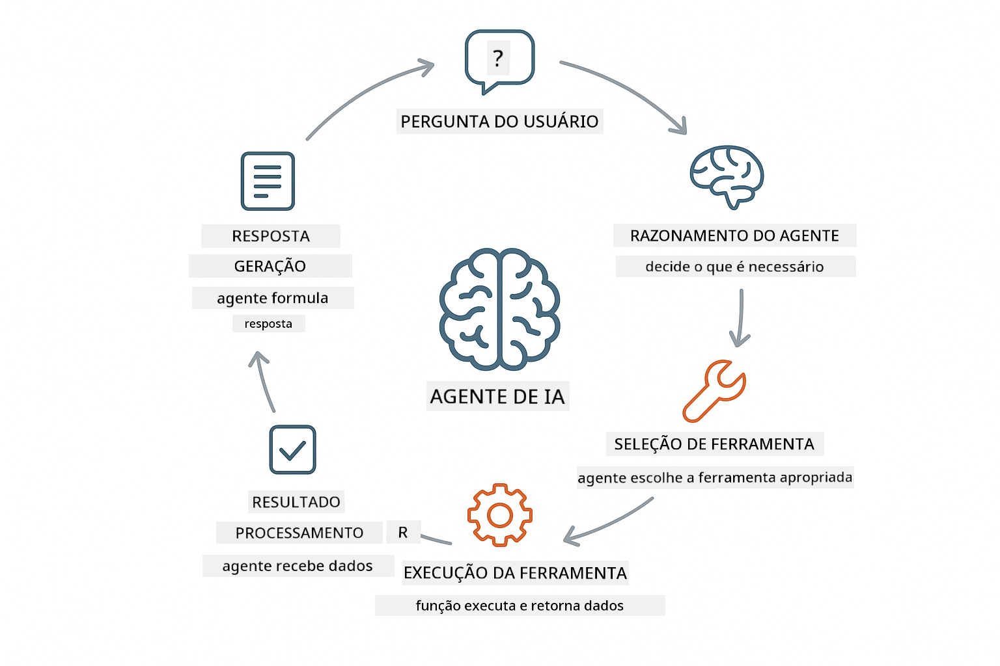
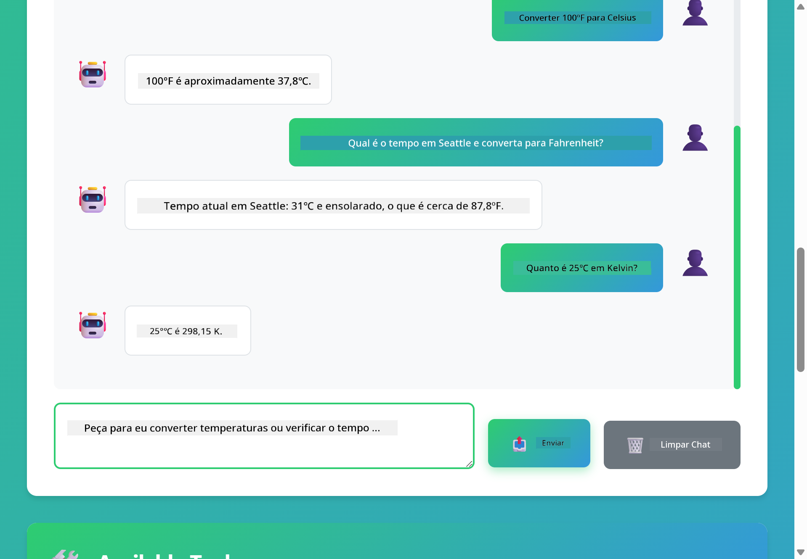

<!--
CO_OP_TRANSLATOR_METADATA:
{
  "original_hash": "13ec450c12cdd1a863baa2b778f27cd7",
  "translation_date": "2025-12-30T23:55:36+00:00",
  "source_file": "04-tools/README.md",
  "language_code": "br"
}
-->
# Módulo 04: Agentes de IA com Ferramentas

## Sumário

- [O que Você Vai Aprender](../../../04-tools)
- [Pré-requisitos](../../../04-tools)
- [Entendendo Agentes de IA com Ferramentas](../../../04-tools)
- [Como o Uso de Ferramentas Funciona](../../../04-tools)
  - [Definições de Ferramentas](../../../04-tools)
  - [Tomada de Decisão](../../../04-tools)
  - [Execução](../../../04-tools)
  - [Geração de Resposta](../../../04-tools)
- [Encadeamento de Ferramentas](../../../04-tools)
- [Executar a Aplicação](../../../04-tools)
- [Usando a Aplicação](../../../04-tools)
  - [Tente Uso Simples de Ferramenta](../../../04-tools)
  - [Teste o Encadeamento de Ferramentas](../../../04-tools)
  - [Veja o Fluxo da Conversa](../../../04-tools)
  - [Observe o Raciocínio](../../../04-tools)
  - [Experimente Pedidos Diferentes](../../../04-tools)
- [Conceitos Chave](../../../04-tools)
  - [Padrão ReAct (Raciocínio e Ação)](../../../04-tools)
  - [Descrições de Ferramentas Importam](../../../04-tools)
  - [Gerenciamento de Sessão](../../../04-tools)
  - [Tratamento de Erros](../../../04-tools)
- [Ferramentas Disponíveis](../../../04-tools)
- [Quando Usar Agentes Baseados em Ferramentas](../../../04-tools)
- [Próximos Passos](../../../04-tools)

## O que Você Vai Aprender

Até agora, você aprendeu como manter conversas com IA, estruturar prompts de forma eficaz e fundamentar respostas em seus documentos. Mas ainda existe uma limitação fundamental: modelos de linguagem só conseguem gerar texto. Eles não conseguem checar o tempo, realizar cálculos, consultar bancos de dados ou interagir com sistemas externos.

Ferramentas mudam isso. Ao dar ao modelo acesso a funções que ele pode chamar, você o transforma de um gerador de texto em um agente que pode tomar ações. O modelo decide quando precisa de uma ferramenta, qual ferramenta usar e quais parâmetros passar. Seu código executa a função e retorna o resultado. O modelo incorpora esse resultado na sua resposta.

## Pré-requisitos

- Conclusão do Módulo 01 (recursos do Azure OpenAI implantados)
- Arquivo `.env` no diretório raiz com credenciais do Azure (criado por `azd up` no Módulo 01)

> **Observação:** Se você não completou o Módulo 01, siga primeiro as instruções de implantação lá.

## Entendendo Agentes de IA com Ferramentas

> **📝 Observação:** O termo "agentes" neste módulo refere-se a assistentes de IA aprimorados com capacidade de chamar ferramentas. Isso é diferente dos padrões de **Agentic AI** (agentes autônomos com planejamento, memória e raciocínio em múltiplos passos) que cobriremos em [Module 05: MCP](../05-mcp/README.md).

Um agente de IA com ferramentas segue um padrão de raciocínio e ação (ReAct):

1. Usuário faz uma pergunta
2. Agente raciocina sobre o que precisa saber
3. Agente decide se precisa de uma ferramenta para responder
4. Se sim, o agente chama a ferramenta apropriada com os parâmetros corretos
5. A ferramenta executa e retorna dados
6. O agente incorpora o resultado e fornece a resposta final



*O padrão ReAct - como agentes de IA alternam entre raciocínio e ação para resolver problemas*

Isso acontece automaticamente. Você define as ferramentas e suas descrições. O modelo lida com a tomada de decisão sobre quando e como usá-las.

## Como o Uso de Ferramentas Funciona

**Definições de Ferramentas** - [WeatherTool.java](../../../04-tools/src/main/java/com/example/langchain4j/agents/tools/WeatherTool.java) | [TemperatureTool.java](../../../04-tools/src/main/java/com/example/langchain4j/agents/tools/TemperatureTool.java)

Você define funções com descrições claras e especificações de parâmetros. O modelo vê essas descrições no seu prompt de sistema e entende o que cada ferramenta faz.

```java
@Component
public class WeatherTool {
    
    @Tool("Get the current weather for a location")
    public String getCurrentWeather(@P("Location name") String location) {
        // Sua lógica de consulta do tempo
        return "Weather in " + location + ": 22°C, cloudy";
    }
}

@AiService
public interface Assistant {
    String chat(@MemoryId String sessionId, @UserMessage String message);
}

// O Assistente é configurado automaticamente pelo Spring Boot com:
// - bean ChatModel
// - Todos os métodos @Tool de classes @Component
// - ChatMemoryProvider para gerenciamento de sessão
```

> **🤖 Experimente com o Chat do [GitHub Copilot](https://github.com/features/copilot):** Abra [`WeatherTool.java`](../../../04-tools/src/main/java/com/example/langchain4j/agents/tools/WeatherTool.java) e pergunte:
> - "Como eu integraria uma API de clima real como o OpenWeatherMap em vez de dados mock?"
> - "O que faz uma boa descrição de ferramenta que ajuda a IA a usá-la corretamente?"
> - "Como eu trato erros de API e limites de taxa nas implementações de ferramentas?"

**Tomada de Decisão**

Quando um usuário pergunta "Qual é o tempo em Seattle?", o modelo reconhece que precisa da ferramenta de clima. Ele gera uma chamada de função com o parâmetro de localização definido para "Seattle".

**Execução** - [AgentService.java](../../../04-tools/src/main/java/com/example/langchain4j/agents/service/AgentService.java)

O Spring Boot injeta automaticamente a interface declarativa `@AiService` com todas as ferramentas registradas, e o LangChain4j executa chamadas de ferramentas automaticamente.

> **🤖 Experimente com o Chat do [GitHub Copilot](https://github.com/features/copilot):** Abra [`AgentService.java`](../../../04-tools/src/main/java/com/example/langchain4j/agents/service/AgentService.java) e pergunte:
> - "Como o padrão ReAct funciona e por que é eficaz para agentes de IA?"
> - "Como o agente decide qual ferramenta usar e em que ordem?"
> - "O que acontece se a execução de uma ferramenta falhar - como devo tratar erros de forma robusta?"

**Geração de Resposta**

O modelo recebe os dados do tempo e os formata em uma resposta em linguagem natural para o usuário.

### Por que Usar Serviços de IA Declarativos?

Este módulo usa a integração do LangChain4j com Spring Boot por meio de interfaces declarativas `@AiService`:

- **Injeção automática do Spring Boot** - ChatModel e ferramentas injetados automaticamente
- **Padrão @MemoryId** - Gerenciamento de memória baseado em sessão automático
- **Instância única** - Assistente criado uma vez e reutilizado para melhor desempenho
- **Execução com tipagem segura** - Métodos Java chamados diretamente com conversão de tipos
- **Orquestração multi-turno** - Lida com encadeamento de ferramentas automaticamente
- **Zero boilerplate** - Sem chamadas manuais AiServices.builder() ou HashMap de memória

Abordagens alternativas (manual `AiServices.builder()`) exigem mais código e perdem os benefícios da integração com o Spring Boot.

## Encadeamento de Ferramentas

**Encadeamento de Ferramentas** - A IA pode chamar várias ferramentas em sequência. Pergunte "Qual é o tempo em Seattle e devo levar um guarda-chuva?" e observe-o encadear `getCurrentWeather` com raciocínio sobre equipamento para chuva.

<a href="images/tool-chaining.png"></a>

*Chamadas de ferramenta sequenciais - a saída de uma ferramenta alimenta a próxima decisão*

**Falhas Graciosas** - Peça o tempo em uma cidade que não está nos dados mock. A ferramenta retorna uma mensagem de erro, e a IA explica que não pode ajudar. Ferramentas falham com segurança.

Isso acontece em uma única troca de conversa. O agente orquestra múltiplas chamadas de ferramentas de forma autônoma.

## Executar a Aplicação

**Verifique a implantação:**

Certifique-se de que o arquivo `.env` exista no diretório raiz com credenciais do Azure (criado durante o Módulo 01):
```bash
cat ../.env  # Deve mostrar AZURE_OPENAI_ENDPOINT, API_KEY, DEPLOYMENT
```

**Inicie a aplicação:**

> **Observação:** Se você já iniciou todas as aplicações usando `./start-all.sh` do Módulo 01, este módulo já está em execução na porta 8084. Você pode pular os comandos de inicialização abaixo e ir diretamente para http://localhost:8084.

**Opção 1: Usando o Spring Boot Dashboard (Recomendado para usuários do VS Code)**

O dev container inclui a extensão Spring Boot Dashboard, que fornece uma interface visual para gerenciar todas as aplicações Spring Boot. Você pode encontrá-la na Barra de Atividades à esquerda do VS Code (procure o ícone do Spring Boot).

No Spring Boot Dashboard, você pode:
- Ver todas as aplicações Spring Boot disponíveis no workspace
- Iniciar/parar aplicações com um único clique
- Visualizar logs da aplicação em tempo real
- Monitorar o status da aplicação

Basta clicar no botão de play ao lado de "tools" para iniciar este módulo, ou iniciar todos os módulos de uma vez.


**Opção 2: Usando scripts de shell**

Inicie todas as aplicações web (módulos 01-04):

**Bash:**
```bash
cd ..  # A partir do diretório raiz
./start-all.sh
```

**PowerShell:**
```powershell
cd ..  # Do diretório raiz
.\start-all.ps1
```

Ou inicie apenas este módulo:

**Bash:**
```bash
cd 04-tools
./start.sh
```

**PowerShell:**
```powershell
cd 04-tools
.\start.ps1
```

Ambos os scripts carregam automaticamente as variáveis de ambiente do arquivo `.env` na raiz e irão compilar os JARs se eles não existirem.

> **Observação:** Se preferir compilar todos os módulos manualmente antes de iniciar:
>
> **Bash:**
> ```bash
> cd ..  # Go to root directory
> mvn clean package -DskipTests
> ```
>
> **PowerShell:**
> ```powershell
> cd ..  # Go to root directory
> mvn clean package -DskipTests
> ```

Abra http://localhost:8084 no seu navegador.

**Para parar:**

**Bash:**
```bash
./stop.sh  # Somente este módulo
# Ou
cd .. && ./stop-all.sh  # Todos os módulos
```

**PowerShell:**
```powershell
.\stop.ps1  # Apenas este módulo
# Ou
cd ..; .\stop-all.ps1  # Todos os módulos
```

## Usando a Aplicação

A aplicação fornece uma interface web onde você pode interagir com um agente de IA que tem acesso a ferramentas de clima e conversão de temperatura.

<a href="images/tools-homepage.png"></a>

*A interface AI Agent Tools - exemplos rápidos e interface de chat para interagir com ferramentas*

**Tente Uso Simples de Ferramenta**

Comece com um pedido direto: "Converta 100 graus Fahrenheit para Celsius". O agente reconhece que precisa da ferramenta de conversão de temperatura, a chama com os parâmetros corretos e retorna o resultado. Observe como isso parece natural - você não especificou qual ferramenta usar nem como chamá-la.

**Teste o Encadeamento de Ferramentas**

Agora tente algo mais complexo: "Qual é o tempo em Seattle e converta para Fahrenheit?" Observe o agente trabalhar em etapas. Primeiro obtém o clima (que retorna em Celsius), reconhece que precisa converter para Fahrenheit, chama a ferramenta de conversão e combina ambos os resultados em uma única resposta.

**Veja o Fluxo da Conversa**

A interface de chat mantém o histórico da conversa, permitindo interações multi-turno. Você pode ver todas as consultas e respostas anteriores, tornando fácil acompanhar a conversa e entender como o agente constrói contexto ao longo de múltiplas trocas.

<a href="images/tools-conversation-demo.png"></a>

*Conversa multi-turno mostrando conversões simples, consultas de clima e encadeamento de ferramentas*

**Experimente Pedidos Diferentes**

Tente várias combinações:
- Consultas de clima: "Qual é o tempo em Tokyo?"
- Conversões de temperatura: "Quanto é 25°C em Kelvin?"
- Consultas combinadas: "Verifique o tempo em Paris e diga se está acima de 20°C"

Observe como o agente interpreta linguagem natural e a mapeia para chamadas de ferramentas apropriadas.

## Conceitos Chave

**Padrão ReAct (Raciocínio e Ação)**

O agente alterna entre raciocínio (decidir o que fazer) e ação (usar ferramentas). Esse padrão possibilita solução de problemas de forma autônoma em vez de apenas responder instruções.

**Descrições de Ferramentas Importam**

A qualidade das descrições das suas ferramentas afeta diretamente o quão bem o agente as usa. Descrições claras e específicas ajudam o modelo a entender quando e como chamar cada ferramenta.

**Gerenciamento de Sessão**

A anotação `@MemoryId` habilita o gerenciamento automático de memória baseado em sessão. Cada ID de sessão obtém sua própria instância de `ChatMemory` gerenciada pelo bean `ChatMemoryProvider`, eliminando a necessidade de rastreamento manual de memória.

**Tratamento de Erros**

Ferramentas podem falhar - APIs expirarem, parâmetros poderem ser inválidos, serviços externos caírem. Agentes de produção precisam de tratamento de erros para que o modelo possa explicar problemas ou tentar alternativas.

## Ferramentas Disponíveis

**Ferramentas de Clima** (dados mock para demonstração):
- Obter o clima atual para um local
- Obter previsão para vários dias

**Ferramentas de Conversão de Temperatura**:
- Celsius para Fahrenheit
- Fahrenheit para Celsius
- Celsius para Kelvin
- Kelvin para Celsius
- Fahrenheit para Kelvin
- Kelvin para Fahrenheit

Estes são exemplos simples, mas o padrão se estende a qualquer função: consultas a banco de dados, chamadas de API, cálculos, operações com arquivos ou comandos do sistema.

## Quando Usar Agentes Baseados em Ferramentas

**Use ferramentas quando:**
- Responder requer dados em tempo real (clima, preços de ações, inventário)
- Você precisa realizar cálculos além da matemática simples
- Acessar bancos de dados ou APIs
- Tomar ações (enviar e-mails, criar tickets, atualizar registros)
- Combinar múltiplas fontes de dados

**Não use ferramentas quando:**
- Perguntas podem ser respondidas a partir de conhecimento geral
- A resposta é puramente conversacional
- A latência da ferramenta tornaria a experiência lenta demais

## Próximos Passos

**Próximo Módulo:** [05-mcp - Model Context Protocol (MCP)](../05-mcp/README.md)

---

**Navegação:** [← Anterior: Module 03 - RAG](../03-rag/README.md) | [Voltar ao Início](../README.md) | [Próximo: Module 05 - MCP →](../05-mcp/README.md)

---

<!-- CO-OP TRANSLATOR DISCLAIMER START -->
**Isenção de responsabilidade**:
Este documento foi traduzido usando o serviço de tradução por IA [Co-op Translator](https://github.com/Azure/co-op-translator). Embora nos esforcemos pela precisão, esteja ciente de que traduções automatizadas podem conter erros ou imprecisões. O documento original em seu idioma nativo deve ser considerado a fonte autorizada. Para informações críticas, recomenda-se tradução profissional realizada por um tradutor humano. Não nos responsabilizamos por quaisquer mal-entendidos ou interpretações equivocadas decorrentes do uso desta tradução.
<!-- CO-OP TRANSLATOR DISCLAIMER END -->