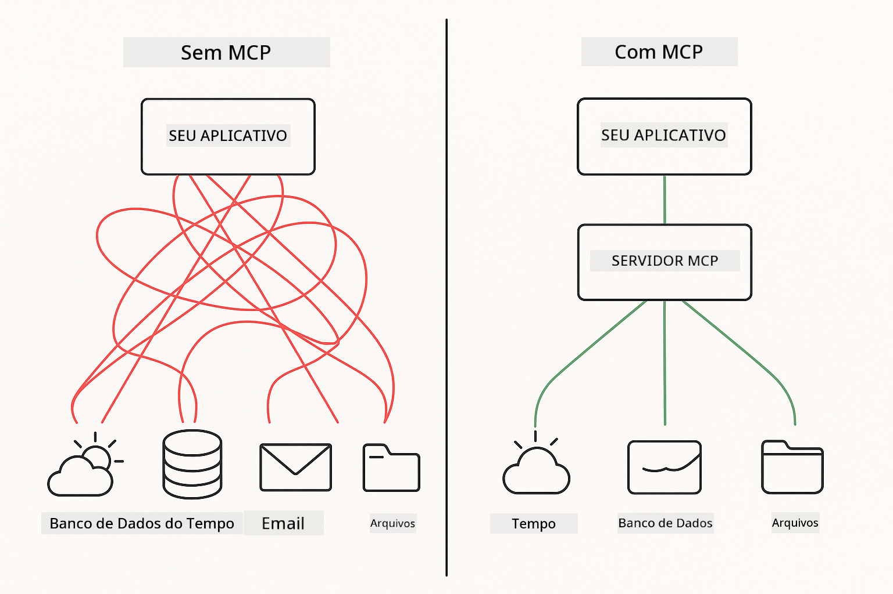
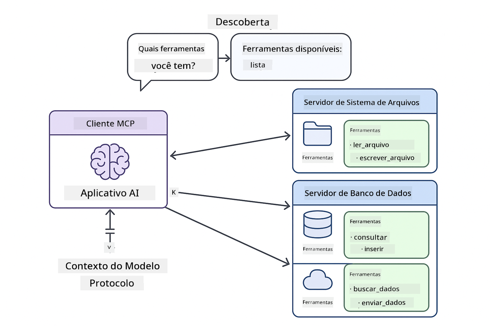
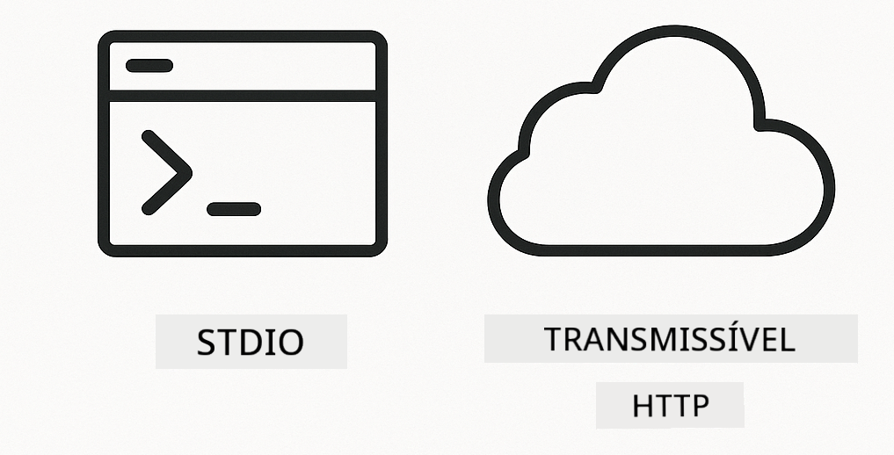
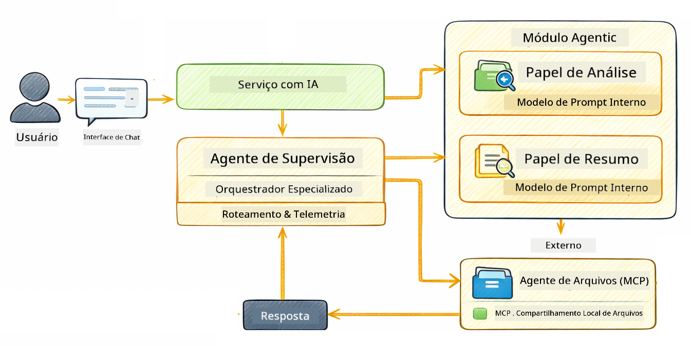

<!--
CO_OP_TRANSLATOR_METADATA:
{
  "original_hash": "f89f4c106d110e4943c055dd1a2f1dff",
  "translation_date": "2025-12-30T23:53:15+00:00",
  "source_file": "05-mcp/README.md",
  "language_code": "br"
}
-->
# Módulo 05: Model Context Protocol (MCP)

## Table of Contents

- [O que você vai aprender](../../../05-mcp)
- [O que é o MCP?](../../../05-mcp)
- [Como o MCP Funciona](../../../05-mcp)
- [O Módulo Agentic](../../../05-mcp)
- [Executando os Exemplos](../../../05-mcp)
  - [Pré-requisitos](../../../05-mcp)
- [Início Rápido](../../../05-mcp)
  - [Operações de Arquivo (Stdio)](../../../05-mcp)
  - [Agente Supervisor](../../../05-mcp)
    - [Entendendo a Saída](../../../05-mcp)
    - [Explicação dos Recursos do Módulo Agentic](../../../05-mcp)
- [Conceitos-Chave](../../../05-mcp)
- [Parabéns!](../../../05-mcp)
  - [Próximos Passos](../../../05-mcp)

## What You'll Learn

Você já construiu IA conversacional, dominou prompts, fundamentou respostas em documentos e criou agentes com ferramentas. Mas todas essas ferramentas foram feitas sob medida para sua aplicação específica. E se você pudesse dar à sua IA acesso a um ecossistema padronizado de ferramentas que qualquer pessoa pode criar e compartilhar? Neste módulo, você aprenderá a fazer exatamente isso com o Model Context Protocol (MCP) e o módulo agentic do LangChain4j. Primeiro mostramos um leitor de arquivos MCP simples e depois mostramos como ele se integra facilmente em fluxos de trabalho agentic avançados usando o padrão Supervisor Agent.

## What is MCP?

O Model Context Protocol (MCP) oferece exatamente isso - uma maneira padrão para aplicações de IA descobrirem e usarem ferramentas externas. Em vez de escrever integrações personalizadas para cada fonte de dados ou serviço, você se conecta a servidores MCP que expõem suas capacidades em um formato consistente. Seu agente de IA pode então descobrir e usar essas ferramentas automaticamente.



*Antes do MCP: Integrações ponto-a-ponto complexas. Depois do MCP: Um protocolo, possibilidades infinitas.*

O MCP resolve um problema fundamental no desenvolvimento de IA: toda integração é personalizada. Quer acessar o GitHub? Código personalizado. Quer ler arquivos? Código personalizado. Quer consultar um banco de dados? Código personalizado. E nenhuma dessas integrações funciona com outras aplicações de IA.

O MCP padroniza isso. Um servidor MCP expõe ferramentas com descrições claras e esquemas de parâmetros. Qualquer cliente MCP pode se conectar, descobrir ferramentas disponíveis e usá-las. Construa uma vez, use em qualquer lugar.



*Arquitetura do Model Context Protocol - descoberta e execução de ferramentas padronizadas*

## How MCP Works

**Arquitetura Servidor-Cliente**

O MCP usa um modelo cliente-servidor. Servidores fornecem ferramentas - leitura de arquivos, consultas a bancos de dados, chamadas de APIs. Clientes (sua aplicação de IA) se conectam aos servidores e usam suas ferramentas.

Para usar o MCP com LangChain4j, adicione esta dependência Maven:

```xml
<dependency>
    <groupId>dev.langchain4j</groupId>
    <artifactId>langchain4j-mcp</artifactId>
    <version>${langchain4j.version}</version>
</dependency>
```

**Descoberta de Ferramentas**

Quando seu cliente se conecta a um servidor MCP, ele pergunta "Quais ferramentas você tem?" O servidor responde com uma lista de ferramentas disponíveis, cada uma com descrições e esquemas de parâmetros. Seu agente de IA pode então decidir quais ferramentas usar com base nas solicitações dos usuários.

**Mecanismos de Transporte**

O MCP suporta diferentes mecanismos de transporte. Este módulo demonstra o transporte Stdio para processos locais:



*Mecanismos de transporte do MCP: HTTP para servidores remotos, Stdio para processos locais*

**Stdio** - [StdioTransportDemo.java](../../../05-mcp/src/main/java/com/example/langchain4j/mcp/StdioTransportDemo.java)

Para processos locais. Sua aplicação cria um servidor como subprocesso e se comunica através da entrada/saída padrão. Útil para acesso ao sistema de arquivos ou ferramentas de linha de comando.

```java
McpTransport stdioTransport = new StdioMcpTransport.Builder()
    .command(List.of(
        npmCmd, "exec",
        "@modelcontextprotocol/server-filesystem@2025.12.18",
        resourcesDir
    ))
    .logEvents(false)
    .build();
```

> **🤖 Experimente com [GitHub Copilot](https://github.com/features/copilot) Chat:** Abra [`StdioTransportDemo.java`](../../../05-mcp/src/main/java/com/example/langchain4j/mcp/StdioTransportDemo.java) e pergunte:
> - "Como o transporte Stdio funciona e quando devo usá-lo vs HTTP?"
> - "Como o LangChain4j gerencia o ciclo de vida dos processos de servidor MCP iniciados?"
> - "Quais são as implicações de segurança ao dar à IA acesso ao sistema de arquivos?"

## The Agentic Module

Enquanto o MCP fornece ferramentas padronizadas, o módulo **agentic** do LangChain4j fornece uma maneira declarativa de construir agentes que orquestram essas ferramentas. A anotação `@Agent` e os `AgenticServices` permitem que você defina o comportamento do agente por meio de interfaces em vez de código imperativo.

Neste módulo, você explorará o padrão **Supervisor Agent** — uma abordagem agentic avançada onde um agente "supervisor" decide dinamicamente quais subagentes invocar com base nas solicitações dos usuários. Vamos combinar ambos os conceitos dando a um dos nossos subagentes capacidades de acesso a arquivos via MCP.

Para usar o módulo agentic, adicione esta dependência Maven:

```xml
<dependency>
    <groupId>dev.langchain4j</groupId>
    <artifactId>langchain4j-agentic</artifactId>
    <version>${langchain4j.mcp.version}</version>
</dependency>
```

> **⚠️ Experimental:** O módulo `langchain4j-agentic` é **experimental** e sujeito a mudanças. A forma estável de construir assistentes de IA continua sendo `langchain4j-core` com ferramentas personalizadas (Módulo 04).

## Running the Examples

### Prerequisites

- Java 21+, Maven 3.9+
- Node.js 16+ e npm (para servidores MCP)
- Variáveis de ambiente configuradas no arquivo `.env` (a partir do diretório raiz):
  - **Para StdioTransportDemo:** `GITHUB_TOKEN` (Token de Acesso Pessoal do GitHub)
  - **Para SupervisorAgentDemo:** `AZURE_OPENAI_ENDPOINT`, `AZURE_OPENAI_API_KEY`, `AZURE_OPENAI_DEPLOYMENT` (mesmos das Módulos 01-04)

> **Nota:** Se você ainda não configurou suas variáveis de ambiente, veja [Module 00 - Quick Start](../00-quick-start/README.md) para instruções, ou copie `.env.example` para `.env` no diretório raiz e preencha seus valores.

## Quick Start

**Usando VS Code:** Simplesmente clique com o botão direito em qualquer arquivo de demonstração no Explorer e selecione **"Run Java"**, ou use as configurações de inicialização do painel Run and Debug (certifique-se de ter adicionado seu token ao arquivo `.env` primeiro).

**Usando Maven:** Alternativamente, você pode executar pela linha de comando com os exemplos abaixo.

### File Operations (Stdio)

Isto demonstra ferramentas baseadas em subprocessos locais.

**✅ Sem pré-requisitos** - o servidor MCP é iniciado automaticamente.

**Usando VS Code:** Clique com o botão direito em `StdioTransportDemo.java` e selecione **"Run Java"**.

**Usando Maven:**

**Bash:**
```bash
export GITHUB_TOKEN=your_token_here
cd 05-mcp
mvn compile exec:java -Dexec.mainClass=com.example.langchain4j.mcp.StdioTransportDemo
```

**PowerShell:**
```powershell
$env:GITHUB_TOKEN=your_token_here
cd 05-mcp
mvn --% compile exec:java -Dexec.mainClass=com.example.langchain4j.mcp.StdioTransportDemo
```

A aplicação inicia automaticamente um servidor MCP de sistema de arquivos e lê um arquivo local. Observe como o gerenciamento do subprocesso é tratado para você.

**Saída esperada:**
```
Assistant response: The file provides an overview of LangChain4j, an open-source Java library
for integrating Large Language Models (LLMs) into Java applications...
```

### Supervisor Agent




O **padrão Supervisor Agent** é uma forma **flexível** de IA agentic. Ao contrário de fluxos determinísticos (sequencial, loop, paralelo), um Supervisor usa um LLM para decidir autonomamente quais agentes invocar com base na solicitação do usuário.

**Combinando Supervisor com MCP:** Neste exemplo, damos ao `FileAgent` acesso às ferramentas de sistema de arquivos do MCP via `toolProvider(mcpToolProvider)`. Quando um usuário pede para "ler e analisar um arquivo", o Supervisor analisa a solicitação e gera um plano de execução. Em seguida, ele encaminha a solicitação para o `FileAgent`, que usa a ferramenta `read_file` do MCP para obter o conteúdo. O Supervisor passa esse conteúdo para o `AnalysisAgent` para interpretação, e opcionalmente invoca o `SummaryAgent` para condensar os resultados.

Isto demonstra como as ferramentas MCP se integram perfeitamente em fluxos agentic — o Supervisor não precisa saber *como* os arquivos são lidos, apenas que o `FileAgent` pode fazê-lo. O Supervisor adapta-se dinamicamente a diferentes tipos de solicitações e retorna ou a resposta do último agente ou um resumo de todas as operações.

**Usando os Scripts de Inicialização (Recomendado):**

Os scripts de inicialização carregam automaticamente as variáveis de ambiente do arquivo `.env` na raiz:

**Bash:**
```bash
cd 05-mcp
chmod +x start.sh
./start.sh
```

**PowerShell:**
```powershell
cd 05-mcp
.\start.ps1
```

**Usando VS Code:** Clique com o botão direito em `SupervisorAgentDemo.java` e selecione **"Run Java"** (certifique-se de que seu arquivo `.env` está configurado).

**Como o Supervisor Funciona:**

```java
// Defina vários agentes com capacidades específicas
FileAgent fileAgent = AgenticServices.agentBuilder(FileAgent.class)
        .chatModel(model)
        .toolProvider(mcpToolProvider)  // Possui ferramentas MCP para operações de arquivos
        .build();

AnalysisAgent analysisAgent = AgenticServices.agentBuilder(AnalysisAgent.class)
        .chatModel(model)
        .build();

SummaryAgent summaryAgent = AgenticServices.agentBuilder(SummaryAgent.class)
        .chatModel(model)
        .build();

// Crie um Supervisor que orquestra esses agentes
SupervisorAgent supervisor = AgenticServices.supervisorBuilder()
        .chatModel(model)  // O modelo "planner"
        .subAgents(fileAgent, analysisAgent, summaryAgent)
        .responseStrategy(SupervisorResponseStrategy.SUMMARY)
        .build();

// O Supervisor decide autonomamente quais agentes invocar
// Basta passar uma solicitação em linguagem natural - o LLM planeja a execução
String response = supervisor.invoke("Read the file at /path/file.txt and analyze it");
```

Veja [SupervisorAgentDemo.java](../../../05-mcp/src/main/java/com/example/langchain4j/mcp/SupervisorAgentDemo.java) para a implementação completa.

> **🤖 Experimente com [GitHub Copilot](https://github.com/features/copilot) Chat:** Abra [`SupervisorAgentDemo.java`](../../../05-mcp/src/main/java/com/example/langchain4j/mcp/SupervisorAgentDemo.java) e pergunte:
> - "Como o Supervisor decide quais agentes invocar?"
> - "Qual é a diferença entre os padrões Supervisor e Fluxo Sequencial?"
> - "Como posso personalizar o comportamento de planejamento do Supervisor?"

#### Understanding the Output

Quando você executar o demo, verá um passo a passo estruturado de como o Supervisor orquestra múltiplos agentes. Aqui está o que cada seção significa:

```
======================================================================
  SUPERVISOR AGENT DEMO
======================================================================

This demo shows how a Supervisor Agent orchestrates multiple specialized agents.
The Supervisor uses an LLM to decide which agent to call based on the task.
```

**O cabeçalho** apresenta o demo e explica o conceito central: o Supervisor usa um LLM (não regras codificadas) para decidir quais agentes chamar.

```
--- AVAILABLE AGENTS -------------------------------------------------
  [FILE]     FileAgent     - Reads files using MCP filesystem tools
  [ANALYZE]  AnalysisAgent - Analyzes content for structure, tone, and themes
  [SUMMARY]  SummaryAgent  - Creates concise summaries of content
```

**Agentes Disponíveis** mostra os três agentes especializados que o Supervisor pode escolher. Cada agente tem uma capacidade específica:
- **FileAgent** pode ler arquivos usando ferramentas MCP (capacidade externa)
- **AnalysisAgent** analisa conteúdo (capacidade puramente LLM)
- **SummaryAgent** cria resumos (capacidade puramente LLM)

```
--- USER REQUEST -----------------------------------------------------
  "Read the file at .../file.txt and analyze what it's about"
```

**Solicitação do Usuário** mostra o que foi pedido. O Supervisor deve analisar isso e decidir quais agentes invocar.

```
--- SUPERVISOR ORCHESTRATION -----------------------------------------
  The Supervisor will now decide which agents to invoke and in what order...

  +-- STEP 1: Supervisor chose -> FileAgent (reading file via MCP)
  |
  |   Input: .../file.txt
  |
  |   Result: LangChain4j is an open-source Java library designed to simplify...
  +-- [OK] FileAgent (reading file via MCP) completed

  +-- STEP 2: Supervisor chose -> AnalysisAgent (analyzing content)
  |
  |   Input: LangChain4j is an open-source Java library...
  |
  |   Result: Structure: The content is organized into clear paragraphs that int...
  +-- [OK] AnalysisAgent (analyzing content) completed
```

**Orquestração do Supervisor** é onde a mágica acontece. Observe como:
1. O Supervisor **escolheu o FileAgent primeiro** porque a solicitação mencionava "ler o arquivo"
2. FileAgent usou a ferramenta `read_file` do MCP para recuperar o conteúdo do arquivo
3. O Supervisor então **escolheu o AnalysisAgent** e passou o conteúdo do arquivo para ele
4. AnalysisAgent analisou a estrutura, o tom e os temas

Observe que o Supervisor tomou essas decisões **autonomamente** com base na solicitação do usuário — sem fluxo de trabalho codificado!

**Resposta Final** é a resposta sintetizada do Supervisor, combinando as saídas de todos os agentes que ele invocou. O exemplo despeja o escopo agentic mostrando o resumo e os resultados da análise armazenados por cada agente.

```
--- FINAL RESPONSE ---------------------------------------------------
I read the contents of the file and analyzed its structure, tone, and key themes.
The file introduces LangChain4j as an open-source Java library for integrating
large language models...

--- AGENTIC SCOPE (Shared Memory) ------------------------------------
  Agents store their results in a shared scope for other agents to use:
  * summary: LangChain4j is an open-source Java library...
  * analysis: Structure: The content is organized into clear paragraphs that in...
```

### Explicação dos Recursos do Módulo Agentic

O exemplo demonstra vários recursos avançados do módulo agentic. Vamos olhar mais de perto o Agentic Scope e os Agent Listeners.

**Agentic Scope** mostra a memória compartilhada onde os agentes armazenaram seus resultados usando `@Agent(outputKey="...")`. Isso permite:
- Agentes posteriores acessarem as saídas de agentes anteriores
- O Supervisor sintetizar uma resposta final
- Você inspecionar o que cada agente produziu

```java
ResultWithAgenticScope<String> result = supervisor.invokeWithAgenticScope(request);
AgenticScope scope = result.agenticScope();
String story = scope.readState("story");
List<AgentInvocation> history = scope.agentInvocations("analysisAgent");
```

**Agent Listeners** permitem monitoramento e depuração da execução dos agentes. A saída passo a passo que você vê no demo vem de um AgentListener que se conecta a cada invocação de agente:
- **beforeAgentInvocation** - Chamado quando o Supervisor seleciona um agente, permitindo ver qual agente foi escolhido e por quê
- **afterAgentInvocation** - Chamado quando um agente conclui, mostrando seu resultado
- **inheritedBySubagents** - Quando verdadeiro, o listener monitora todos os agentes na hierarquia

```java
AgentListener monitor = new AgentListener() {
    private int step = 0;
    
    @Override
    public void beforeAgentInvocation(AgentRequest request) {
        step++;
        System.out.println("  +-- STEP " + step + ": " + request.agentName());
    }
    
    @Override
    public void afterAgentInvocation(AgentResponse response) {
        System.out.println("  +-- [OK] " + response.agentName() + " completed");
    }
    
    @Override
    public boolean inheritedBySubagents() {
        return true; // Propagar para todos os sub-agentes
    }
};
```

Além do padrão Supervisor, o módulo `langchain4j-agentic` fornece vários padrões de fluxo de trabalho e recursos poderosos:

| Pattern | Description | Use Case |
|---------|-------------|----------|
| **Sequential** | Execute agentes em ordem, a saída flui para o próximo | Pipelines: pesquisa → analisar → relatório |
| **Parallel** | Execute agentes simultaneamente | Tarefas independentes: clima + notícias + ações |
| **Loop** | Itere até que a condição seja satisfeita | Pontuação de qualidade: refinar até que a pontuação ≥ 0.8 |
| **Conditional** | Roteie com base em condições | Classificar → encaminhar para agente especialista |
| **Human-in-the-Loop** | Adicione pontos de verificação humanos | Fluxos de aprovação, revisão de conteúdo |

## Key Concepts

**MCP** é ideal quando você quer aproveitar ecossistemas de ferramentas existentes, construir ferramentas que múltiplas aplicações possam compartilhar, integrar serviços de terceiros com protocolos padrão, ou trocar implementações de ferramentas sem alterar o código.

**O Módulo Agentic** funciona melhor quando você quer definições declarativas de agentes com anotações `@Agent`, precisa orquestração de fluxo de trabalho (sequencial, loop, paralelo), prefere design de agentes baseado em interfaces em vez de código imperativo, ou está combinando múltiplos agentes que compartilham saídas via `outputKey`.

**O padrão Supervisor Agent** se destaca quando o fluxo de trabalho não é previsível de antemão e você quer que o LLM decida, quando você tem múltiplos agentes especializados que precisam de orquestração dinâmica, ao construir sistemas conversacionais que roteiam para diferentes capacidades, ou quando você quer o comportamento de agente mais flexível e adaptável.

## Congratulations!

Você concluiu o curso LangChain4j for Beginners. Você aprendeu:

- Como construir IA conversacional com memória (Módulo 01)
- Padrões de engenharia de prompts para diferentes tarefas (Módulo 02)
- Fundamentar respostas em seus documentos com RAG (Módulo 03)
- Criar agentes de IA básicos (assistentes) com ferramentas personalizadas (Módulo 04)
- Integrando ferramentas padronizadas com os módulos LangChain4j MCP e Agentic (Módulo 05)

### O que vem a seguir?

Após concluir os módulos, explore o [Guia de Testes](../docs/TESTING.md) para ver os conceitos de teste do LangChain4j em prática.

**Recursos Oficiais:**
- [LangChain4j Documentation](https://docs.langchain4j.dev/) - Guias abrangentes e referência de API
- [LangChain4j GitHub](https://github.com/langchain4j/langchain4j) - Código-fonte e exemplos
- [LangChain4j Tutorials](https://docs.langchain4j.dev/tutorials/) - Tutoriais passo a passo para vários casos de uso

Obrigado por concluir este curso!

---

**Navegação:** [← Anterior: Módulo 04 - Ferramentas](../04-tools/README.md) | [Voltar ao Início](../README.md)

---

<!-- CO-OP TRANSLATOR DISCLAIMER START -->
Isenção de responsabilidade:
Este documento foi traduzido usando o serviço de tradução por IA Co-op Translator (https://github.com/Azure/co-op-translator). Embora nos esforcemos para garantir a precisão, esteja ciente de que traduções automáticas podem conter erros ou imprecisões. O documento original, em seu idioma nativo, deve ser considerado a fonte autorizada. Para informações críticas, recomenda-se a tradução profissional feita por um tradutor humano. Não nos responsabilizamos por quaisquer mal-entendidos ou interpretações incorretas decorrentes do uso desta tradução.
<!-- CO-OP TRANSLATOR DISCLAIMER END -->