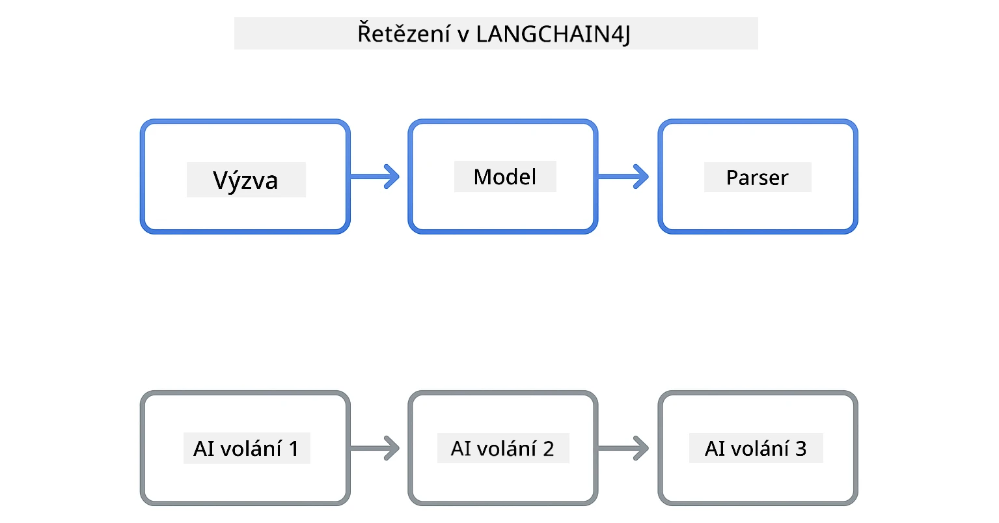
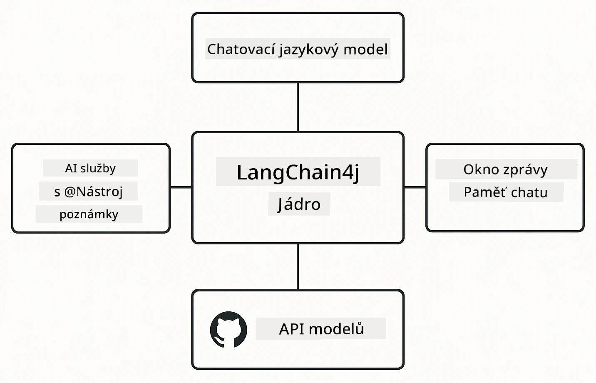

# Modul 00: Rychlý start

## Obsah

- [Úvod](../../../00-quick-start)
- [Co je LangChain4j?](../../../00-quick-start)
- [Závislosti LangChain4j](../../../00-quick-start)
- [Požadavky](../../../00-quick-start)
- [Nastavení](../../../00-quick-start)
  - [1. Získání GitHub tokenu](../../../00-quick-start)
  - [2. Nastavení tokenu](../../../00-quick-start)
- [Spuštění příkladů](../../../00-quick-start)
  - [1. Základní chat](../../../00-quick-start)
  - [2. Vzory promptů](../../../00-quick-start)
  - [3. Volání funkcí](../../../00-quick-start)
  - [4. Otázky a odpovědi k dokumentu (RAG)](../../../00-quick-start)
  - [5. Odpovědná AI](../../../00-quick-start)
- [Co každý příklad ukazuje](../../../00-quick-start)
- [Další kroky](../../../00-quick-start)
- [Řešení problémů](../../../00-quick-start)

## Úvod

Tento rychlý start je určen k co nejrychlejšímu uvedení do provozu s LangChain4j. Pokrývá absolutní základy budování AI aplikací s LangChain4j a GitHub modely. V dalších modulech použijete Azure OpenAI s LangChain4j k vytvoření pokročilejších aplikací.

## Co je LangChain4j?

LangChain4j je Java knihovna, která usnadňuje vytváření aplikací poháněných AI. Místo práce s HTTP klienty a JSON parsováním pracujete s čistými Java API.

„Řetězec“ v LangChain znamená propojení několika komponent – můžete spojit prompt s modelem a parserem nebo řetězit více AI volání, kde jeden výstup slouží jako další vstup. Tento rychlý start se zaměřuje na základy před prozkoumáním složitějších řetězců.



*Řetězení komponent v LangChain4j – stavební bloky propojené k vytvoření výkonných AI pracovních toků*

Použijeme tři základní komponenty:

**ChatLanguageModel** – Rozhraní pro interakce s AI modelem. Zavolejte `model.chat("prompt")` a získejte odpověď jako řetězec. Používáme `OpenAiOfficialChatModel`, který funguje s endpointy kompatibilními s OpenAI, jako jsou GitHub Modely.

**AiServices** – Vytváří typově bezpečná rozhraní AI služeb. Definujte metody, označte je anotací `@Tool` a LangChain4j se postará o orchestraci. AI automaticky volá vaše Java metody, když je to potřeba.

**MessageWindowChatMemory** – Udržuje historii konverzace. Bez toho jsou jednotlivé požadavky nezávislé. S ní si AI pamatuje předchozí zprávy a udržuje kontext přes více kol.



*Architektura LangChain4j – základní komponenty fungují společně, aby poháněly vaše AI aplikace*

## Závislosti LangChain4j

Tento rychlý start používá dvě závislosti Maven v souboru [`pom.xml`](../../../00-quick-start/pom.xml):

```xml
<!-- Core LangChain4j library -->
<dependency>
    <groupId>dev.langchain4j</groupId>
    <artifactId>langchain4j</artifactId> <!-- Inherited from BOM in root pom.xml -->
</dependency>

<!-- OpenAI integration (works with GitHub Models) -->
<dependency>
    <groupId>dev.langchain4j</groupId>
    <artifactId>langchain4j-open-ai-official</artifactId> <!-- Inherited from BOM in root pom.xml -->
</dependency>
```

Modul `langchain4j-open-ai-official` poskytuje třídu `OpenAiOfficialChatModel`, která se připojuje k API kompatibilním s OpenAI. GitHub Modely používají stejný formát API, takže není potřeba žádný speciální adaptér – stačí nastavit základní URL na `https://models.github.ai/inference`.

## Požadavky

**Používáte Dev Container?** Java a Maven jsou již nainstalované. Potřebujete jen GitHub Personal Access Token.

**Lokální vývoj:**
- Java 21+, Maven 3.9+
- GitHub Personal Access Token (instrukce níže)

> **Poznámka:** Tento modul používá `gpt-4.1-nano` z GitHub modelů. Neměňte název modelu v kódu – je nakonfigurován pro spolupráci s dostupnými GitHub modely.

## Nastavení

### 1. Získání GitHub tokenu

1. Přejděte na [GitHub Nastavení → Personal Access Tokens](https://github.com/settings/personal-access-tokens)
2. Klikněte na „Generate new token“
3. Nastavte popisný název (např. „LangChain4j Demo“)
4. Nastavte expiraci (doporučeno 7 dní)
5. V sekci „Account permissions“ najděte „Models“ a nastavte na „Read-only“
6. Klikněte na „Generate token“
7. Zkopírujte a uložte token – znovu se nezobrazí

### 2. Nastavení tokenu

**Možnost 1: Použití VS Code (doporučeno)**

Pokud používáte VS Code, přidejte token do souboru `.env` ve složce projektu:

Pokud `.env` neexistuje, zkopírujte `.env.example` do `.env` nebo vytvořte nový `.env` soubor v kořenové složce projektu.

**Příklad souboru `.env`:**
```bash
# V /workspaces/LangChain4j-for-Beginners/.env
GITHUB_TOKEN=your_token_here
```

Poté stačí kliknout pravým tlačítkem na jakýkoliv demo soubor (např. `BasicChatDemo.java`) v Průzkumníku a vybrat **„Run Java“** nebo použít konfigurační spouštěče v panelu Spuštění a ladění.

**Možnost 2: Použití Terminálu**

Nastavte token jako proměnnou prostředí:

**Bash:**
```bash
export GITHUB_TOKEN=your_token_here
```

**PowerShell:**
```powershell
$env:GITHUB_TOKEN=your_token_here
```

## Spuštění příkladů

**Ve VS Code:** Stačí kliknout pravým tlačítkem na jakýkoliv demo soubor v Průzkumníku a vybrat **„Run Java“**, nebo použít konfigurační spouštěče v panelu Spuštění a ladění (nezapomeňte nejdříve přidat token do `.env`).

**Přes Maven:** Alternativně můžete spustit z příkazové řádky:

### 1. Základní chat

**Bash:**
```bash
mvn compile exec:java -Dexec.mainClass=com.example.langchain4j.quickstart.BasicChatDemo
```

**PowerShell:**
```powershell
mvn --% compile exec:java -Dexec.mainClass=com.example.langchain4j.quickstart.BasicChatDemo
```

### 2. Vzory promptů

**Bash:**
```bash
mvn compile exec:java -Dexec.mainClass=com.example.langchain4j.quickstart.PromptEngineeringDemo
```

**PowerShell:**
```powershell
mvn --% compile exec:java -Dexec.mainClass=com.example.langchain4j.quickstart.PromptEngineeringDemo
```

Ukazuje zero-shot, few-shot, chain-of-thought a role-based prompting.

### 3. Volání funkcí

**Bash:**
```bash
mvn compile exec:java -Dexec.mainClass=com.example.langchain4j.quickstart.ToolIntegrationDemo
```

**PowerShell:**
```powershell
mvn --% compile exec:java -Dexec.mainClass=com.example.langchain4j.quickstart.ToolIntegrationDemo
```

AI automaticky volá vaše Java metody, když je to potřeba.

### 4. Otázky a odpovědi k dokumentu (RAG)

**Bash:**
```bash
mvn compile exec:java -Dexec.mainClass=com.example.langchain4j.quickstart.SimpleReaderDemo
```

**PowerShell:**
```powershell
mvn --% compile exec:java -Dexec.mainClass=com.example.langchain4j.quickstart.SimpleReaderDemo
```

Ptejte se na obsah v souboru `document.txt`.

### 5. Odpovědná AI

**Bash:**
```bash
mvn compile exec:java -Dexec.mainClass=com.example.langchain4j.quickstart.ResponsibleAIDemo
```

**PowerShell:**
```powershell
mvn --% compile exec:java -Dexec.mainClass=com.example.langchain4j.quickstart.ResponsibleAIDemo
```

Ukazuje, jak AI bezpečnostní filtry blokují škodlivý obsah.

## Co každý příklad ukazuje

**Základní chat** - [BasicChatDemo.java](../../../00-quick-start/src/main/java/com/example/langchain4j/quickstart/BasicChatDemo.java)

Začněte zde pro ukázku LangChain4j v nejjednodušší podobě. Vytvoříte `OpenAiOfficialChatModel`, odešlete prompt přes `.chat()` a získáte odpověď. Tento příklad ukazuje základy: jak inicializovat modely s vlastním endpointem a klíčem API. Jakmile tento vzor pochopíte, vše ostatní na něm staví.

```java
ChatLanguageModel model = OpenAiOfficialChatModel.builder()
    .baseUrl("https://models.github.ai/inference")
    .apiKey(System.getenv("GITHUB_TOKEN"))
    .modelName("gpt-4.1-nano")
    .build();

String response = model.chat("What is LangChain4j?");
System.out.println(response);
```

> **🤖 Vyzkoušejte s [GitHub Copilot](https://github.com/features/copilot) Chat:** Otevřete [`BasicChatDemo.java`](../../../00-quick-start/src/main/java/com/example/langchain4j/quickstart/BasicChatDemo.java) a zeptejte se:
> - „Jak bych přepnul z GitHub modelů na Azure OpenAI v tomto kódu?“
> - „Jaké další parametry mohu nastavit v OpenAiOfficialChatModel.builder()?“
> - „Jak mohu přidat streamování odpovědí místo čekání na kompletní odpověď?“

**Inženýrství promptů** - [PromptEngineeringDemo.java](../../../00-quick-start/src/main/java/com/example/langchain4j/quickstart/PromptEngineeringDemo.java)

Nyní, když víte, jak komunikovat s modelem, pojďme prozkoumat, co mu říkáte. Tento demo příklad používá stejnou konfiguraci modelu, ale ukazuje čtyři různé vzory promptů. Vyzkoušejte zero-shot prompt pro přímé instrukce, few-shot prompty učící se z příkladů, chain-of-thought pro postupné odhalování myšlení a role-based prompty nastavující kontext. Uvidíte, jak stejný model dává dramaticky odlišné výsledky podle způsobu, jakým formulujete svůj požadavek.

```java
PromptTemplate template = PromptTemplate.from(
    "What's the best time to visit {{destination}} for {{activity}}?"
);

Prompt prompt = template.apply(Map.of(
    "destination", "Paris",
    "activity", "sightseeing"
));

String response = model.chat(prompt.text());
```

> **🤖 Vyzkoušejte s [GitHub Copilot](https://github.com/features/copilot) Chat:** Otevřete [`PromptEngineeringDemo.java`](../../../00-quick-start/src/main/java/com/example/langchain4j/quickstart/PromptEngineeringDemo.java) a zeptejte se:
> - „Jaký je rozdíl mezi zero-shot a few-shot promptingem a kdy který použít?“
> - „Jak parametr temperature ovlivňuje odpovědi modelu?“
> - „Jaké jsou techniky, jak zabránit útokům prompt injection v produkci?“
> - „Jak mohu vytvořit znovupoužitelné objekty PromptTemplate pro běžné vzory?“

**Integrace nástrojů** - [ToolIntegrationDemo.java](../../../00-quick-start/src/main/java/com/example/langchain4j/quickstart/ToolIntegrationDemo.java)

Tady LangChain4j ukazuje svou sílu. Použijete `AiServices` k vytvoření AI asistenta, který může volat vaše Java metody. Stačí označit metody anotací `@Tool("description")` a LangChain4j se o vše postará – AI rozhodne, kdy který nástroj použít na základě toho, na co se uživatel ptá. Toto ukazuje volání funkcí, klíčovou techniku pro budování AI, která nejen odpovídá na otázky, ale i jedná.

```java
@Tool("Performs addition of two numeric values")
public double add(double a, double b) {
    return a + b;
}

MathAssistant assistant = AiServices.create(MathAssistant.class, model);
String response = assistant.chat("What is 25 plus 17?");
```

> **🤖 Vyzkoušejte s [GitHub Copilot](https://github.com/features/copilot) Chat:** Otevřete [`ToolIntegrationDemo.java`](../../../00-quick-start/src/main/java/com/example/langchain4j/quickstart/ToolIntegrationDemo.java) a zeptejte se:
> - „Jak funguje anotace @Tool a co LangChain4j s ní dělá v pozadí?“
> - „Může AI volat více nástrojů za sebou k vyřešení složitých problémů?“
> - „Co se stane, když nástroj vyhodí výjimku – jak mám řešit chyby?“
> - „Jak bych integroval reálné API místo tohoto příkladu kalkulačky?“

**Otázky a odpovědi k dokumentu (RAG)** - [SimpleReaderDemo.java](../../../00-quick-start/src/main/java/com/example/langchain4j/quickstart/SimpleReaderDemo.java)

Zde uvidíte základ RAG (retrieval-augmented generation). Místo spolehání na tréninková data modelu načtete obsah ze souboru [`document.txt`](../../../00-quick-start/document.txt) a začleníte ho do promptu. AI odpovídá na základě vašeho dokumentu, ne na základě své obecné znalosti. Je to první krok k budování systémů, které mohou pracovat s vašimi vlastními daty.

```java
Document document = FileSystemDocumentLoader.loadDocument("document.txt");
String content = document.text();

String prompt = "Based on this document: " + content + 
                "\nQuestion: What is the main topic?";
String response = model.chat(prompt);
```

> **Poznámka:** Tento jednoduchý přístup načítá celý dokument do promptu. Pro velké soubory (>10KB) překročíte limity kontextu. Modul 03 pokrývá dělení na části a vektorové hledání pro produkční RAG systémy.

> **🤖 Vyzkoušejte s [GitHub Copilot](https://github.com/features/copilot) Chat:** Otevřete [`SimpleReaderDemo.java`](../../../00-quick-start/src/main/java/com/example/langchain4j/quickstart/SimpleReaderDemo.java) a zeptejte se:
> - „Jak RAG zabraňuje halucinacím AI ve srovnání s použitím tréninkových dat modelu?“
> - „Jaký je rozdíl mezi tímto jednoduchým přístupem a použitím vektorových embeddingů pro retrieval?“
> - „Jak bych to škáloval pro více dokumentů nebo větší znalostní báze?“
> - „Jaké jsou nejlepší postupy pro strukturování promptu, aby AI použila jen poskytnutý kontext?“

**Odpovědná AI** - [ResponsibleAIDemo.java](../../../00-quick-start/src/main/java/com/example/langchain4j/quickstart/ResponsibleAIDemo.java)

Budujte bezpečnost AI s obranou do hloubky. Tento demo příklad ukazuje dvě vrstvy ochrany spolupracující:

**Část 1: LangChain4j Input Guardrails** – Blokují nebezpečné prompty dříve, než dorazí na LLM. Vytvořte si vlastní guardraily, které kontrolují zakázaná klíčová slova nebo vzory. Tyto běží ve vašem kódu, takže jsou rychlé a zdarma.

```java
class DangerousContentGuardrail implements InputGuardrail {
    @Override
    public InputGuardrailResult validate(UserMessage userMessage) {
        String text = userMessage.singleText().toLowerCase();
        if (text.contains("explosives")) {
            return fatal("Blocked: contains prohibited keyword");
        }
        return success();
    }
}
```

**Část 2: Filtry bezpečnosti poskytovatele** – GitHub Modely mají zabudované filtry, které chytnou to, co vaše guardraily mohou přehlédnout. Uvidíte tvrdé blokace (chyby HTTP 400) při vážných porušeních a měkké odmítnutí, kdy AI zdvořile odmítne.

> **🤖 Vyzkoušejte s [GitHub Copilot](https://github.com/features/copilot) Chat:** Otevřete [`ResponsibleAIDemo.java`](../../../00-quick-start/src/main/java/com/example/langchain4j/quickstart/ResponsibleAIDemo.java) a zeptejte se:
> - „Co je InputGuardrail a jak si vytvořím vlastní?“
> - „Jaký je rozdíl mezi tvrdým blokem a měkkým odmítnutím?“
> - „Proč používat guardraily i filtry poskytovatele dohromady?“

## Další kroky

**Další modul:** [01-introduction - Začínáme s LangChain4j a gpt-5 na Azure](../01-introduction/README.md)

---

**Navigace:** [← Zpět na hlavní stránku](../README.md) | [Další: Modul 01 - Úvod →](../01-introduction/README.md)

---

## Řešení problémů

### První sestavení Maven

**Problém:** První spuštění `mvn clean compile` nebo `mvn package` trvá dlouho (10-15 minut)

**Příčina:** Maven musí při prvním sestavení stáhnout všechny závislosti projektu (Spring Boot, knihovny LangChain4j, Azure SDK atd.).

**Řešení:** Toto je normální chování. Následující sestavení budou mnohem rychlejší, protože závislosti jsou uloženy v místní cache. Doba stahování závisí na rychlosti vaší sítě.

### Syntaxe příkazů Maven v PowerShellu

**Problém:** Maven příkazy selhávají s chybou `Unknown lifecycle phase ".mainClass=..."`

**Příčina:** PowerShell interpretuje `=` jako přiřazení proměnné a tím narušuje syntaxi Maven vlastností.
**Řešení**: Použijte operátor zastavení parsování `--%` před příkazem Maven:

**PowerShell:**
```powershell
mvn --% compile exec:java -Dexec.mainClass=com.example.langchain4j.quickstart.BasicChatDemo
```

**Bash:**
```bash
mvn compile exec:java -Dexec.mainClass=com.example.langchain4j.quickstart.BasicChatDemo
```

Operátor `--%` říká PowerShellu, aby všechny zbylé argumenty předal Mavenovi doslovně bez interpretace.

### Zobrazování Emoji ve Windows PowerShellu

**Problém**: Odpovědi AI zobrazují v PowerShellu místo emoji nesmyslné znaky (např. `????` nebo `â??`)

**Příčina**: Výchozí kódování PowerShellu nepodporuje UTF-8 emoji

**Řešení**: Spusťte tento příkaz před spuštěním Java aplikací:
```cmd
chcp 65001
```

Tím se v terminálu vynutí kódování UTF-8. Alternativně použijte Windows Terminal s lepší podporou Unicode.

### Ladění API Volání

**Problém**: Chyby autentizace, limity rychlosti nebo neočekávané odpovědi od AI modelu

**Řešení**: Příklady zahrnují `.logRequests(true)` a `.logResponses(true)`, které zobrazují volání API v konzoli. To pomáhá při řešení chyb autentizace, limitů rychlosti nebo neočekávaných odpovědí. V produkci tyto volby odstraňte, aby se snížil šum v logu.

---

<!-- CO-OP TRANSLATOR DISCLAIMER START -->
**Prohlášení o vyloučení odpovědnosti**:  
Tento dokument byl přeložen pomocí AI překladatelské služby [Co-op Translator](https://github.com/Azure/co-op-translator). Přestože usilujeme o přesnost, vezměte prosím na vědomí, že automatizované překlady mohou obsahovat chyby nebo nepřesnosti. Originální dokument v jeho mateřském jazyce by měl být považován za závazný zdroj. Pro zásadní informace se doporučuje odborný překlad provedený člověkem. Nejsme odpovědní za žádné nedorozumění nebo chybná vyložení, které mohou vzniknout použitím tohoto překladu.
<!-- CO-OP TRANSLATOR DISCLAIMER END -->