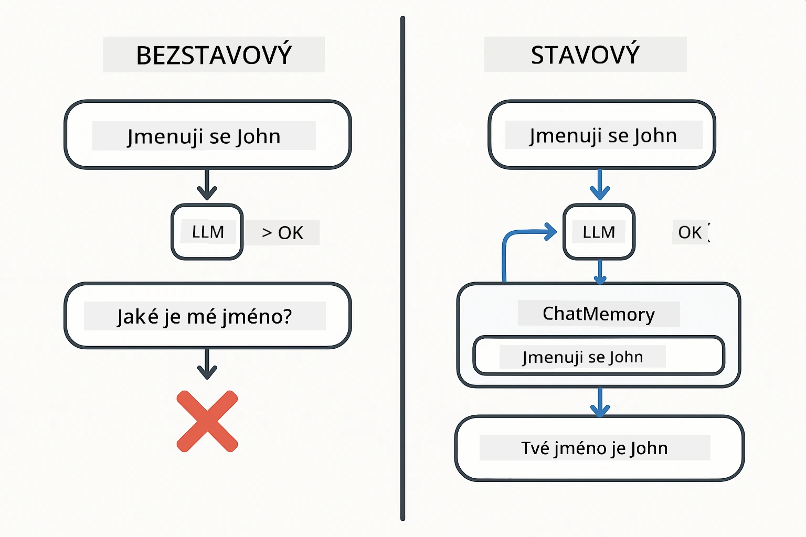
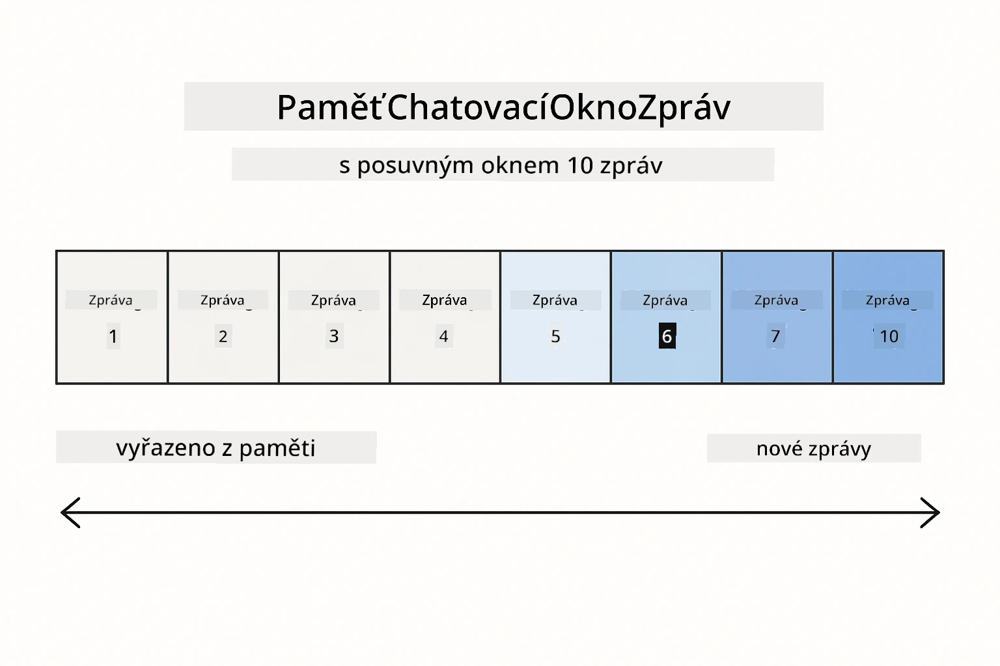
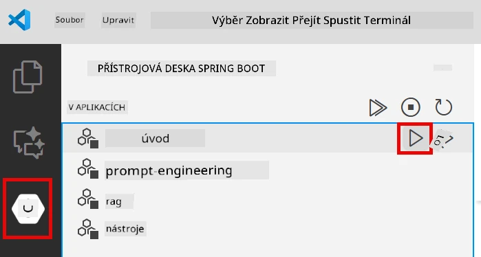
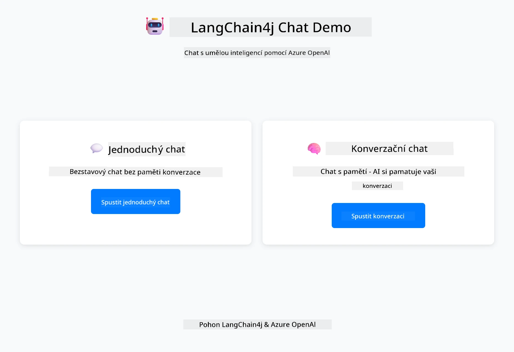
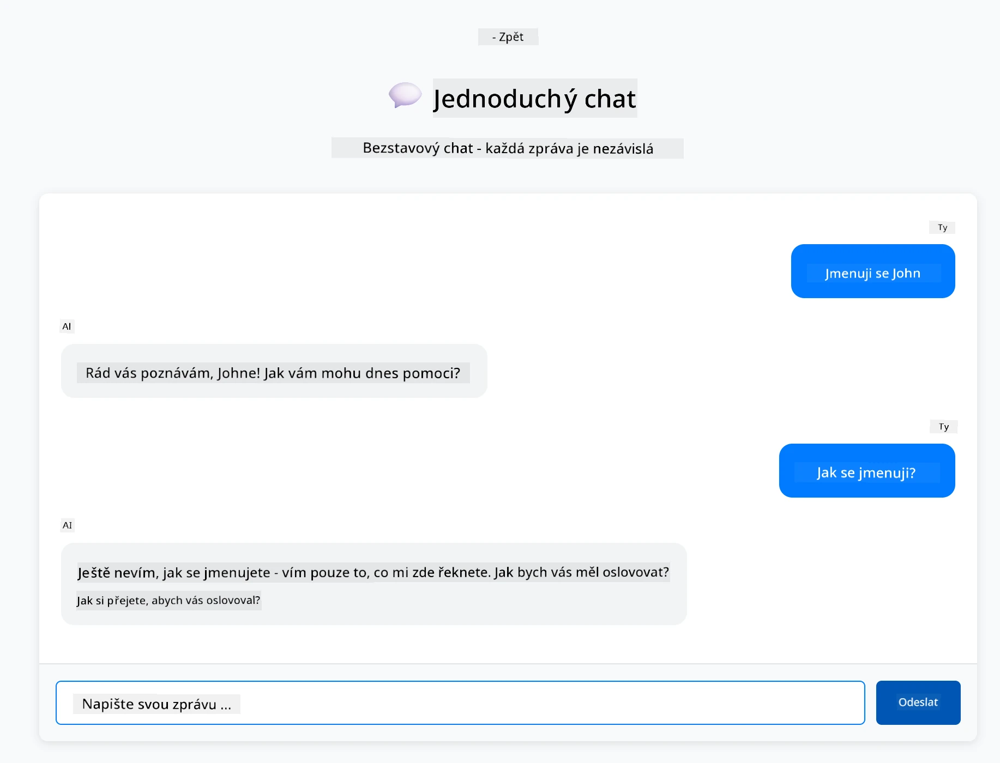
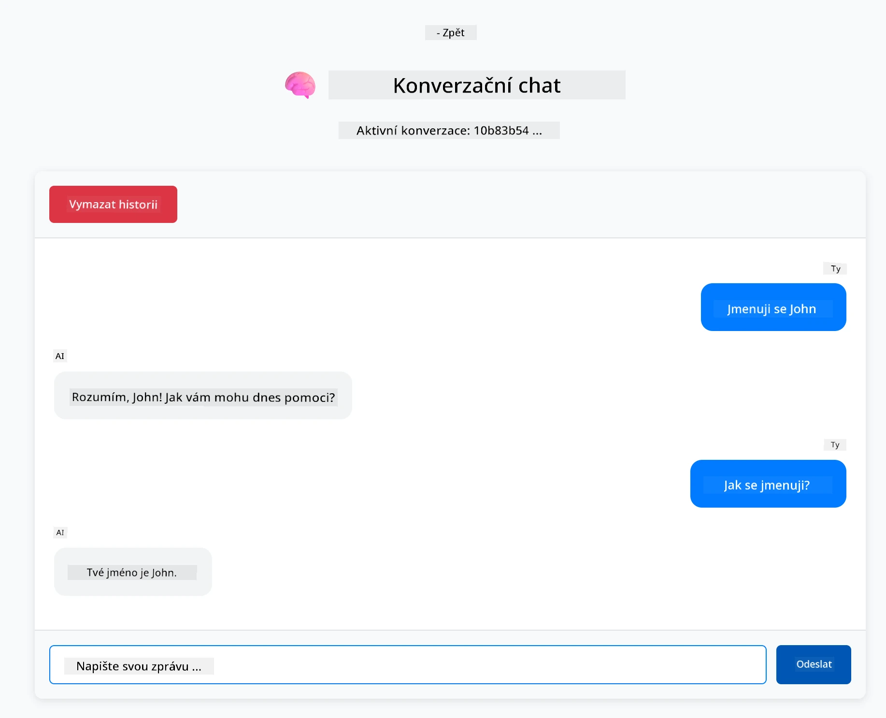

# Modul 01: Začínáme s LangChain4j

## Obsah

- [Co se naučíte](../../../01-introduction)
- [Požadavky](../../../01-introduction)
- [Pochopení základního problému](../../../01-introduction)
- [Pochopení tokenů](../../../01-introduction)
- [Jak funguje paměť](../../../01-introduction)
- [Jak to používá LangChain4j](../../../01-introduction)
- [Nasazení infrastruktury Azure OpenAI](../../../01-introduction)
- [Spuštění aplikace lokálně](../../../01-introduction)
- [Používání aplikace](../../../01-introduction)
  - [Bezstavový chat (levý panel)](../../../01-introduction)
  - [Stavový chat (pravý panel)](../../../01-introduction)
- [Další kroky](../../../01-introduction)

## Co se naučíte

Pokud jste dokončili rychlý start, viděli jste, jak posílat výzvy a získávat odpovědi. To je základ, ale skutečné aplikace potřebují víc. Tento modul vás naučí, jak vytvořit konverzační AI, která si pamatuje kontext a udržuje stav – rozdíl mezi jednorázovou ukázkou a produkční aplikací.

V celém průvodci budeme používat Azure OpenAI GPT-5, protože jeho pokročilé schopnosti uvažování činí chování různých vzorů zřetelnějším. Když přidáte paměť, jasně uvidíte rozdíl. To usnadňuje pochopení, co každý komponent přináší vaší aplikaci.

Vytvoříte jednu aplikaci, která demonstruje oba vzory:

**Bezstavový chat** – Každý požadavek je nezávislý. Model si nepamatuje předchozí zprávy. To je vzor, který jste použili v rychlém startu.

**Stavová konverzace** – Každý požadavek zahrnuje historii konverzace. Model udržuje kontext přes více kol. To je to, co vyžadují produkční aplikace.

## Požadavky

- Azure předplatné s přístupem k Azure OpenAI
- Java 21, Maven 3.9+
- Azure CLI (https://learn.microsoft.com/en-us/cli/azure/install-azure-cli)
- Azure Developer CLI (azd) (https://learn.microsoft.com/en-us/azure/developer/azure-developer-cli/install-azd)

> **Poznámka:** Java, Maven, Azure CLI a Azure Developer CLI (azd) jsou předinstalovány v poskytnutém devcontaineru.

> **Poznámka:** Tento modul používá GPT-5 na Azure OpenAI. Nasazení je automaticky nakonfigurováno přes `azd up` – neměňte název modelu v kódu.

## Pochopení základního problému

Jazykové modely jsou bezstavové. Každé volání API je nezávislé. Pokud pošlete "Jmenuji se John" a pak se zeptáte "Jak se jmenuji?", model neví, že jste se právě představil. Každý požadavek bere, jako by to byla první konverzace, kterou jste kdy vedli.

To je v pořádku pro jednoduché otázky a odpovědi, ale k ničemu pro skutečné aplikace. Boti zákaznické podpory si musí pamatovat, co jste jim řekli. Osobní asistenti potřebují kontext. Každá vícekroková konverzace vyžaduje paměť.



*Rozdíl mezi bezstavovými (nezávislými voláními) a stavovými (s kontextem) konverzacemi*

## Pochopení tokenů

Než se pustíte do konverzací, je důležité pochopit tokeny – základní jednotky textu, které jazykové modely zpracovávají:


*Příklad, jak je text rozdělen na tokeny – "I love AI!" se stává 4 samostatnými jednotkami zpracování*

Tokeny jsou způsob, jakým AI modely měří a zpracovávají text. Slova, interpunkce a dokonce i mezery mohou být tokeny. Váš model má limit, kolik tokenů může zpracovat najednou (400 000 pro GPT-5, s až 272 000 vstupními tokeny a 128 000 výstupními tokeny). Pochopení tokenů vám pomůže řídit délku konverzace a náklady.

## Jak funguje paměť

Paměť chatu řeší bezstavový problém tím, že udržuje historii konverzace. Před odesláním požadavku modelu rámec přidá relevantní předchozí zprávy. Když se zeptáte "Jak se jmenuji?", systém ve skutečnosti pošle celou historii konverzace, což umožní modelu vidět, že jste dříve řekl "Jmenuji se John."

LangChain4j poskytuje implementace paměti, které to automaticky zvládají. Vy si zvolíte, kolik zpráv chcete uchovat, a rámec spravuje kontextové okno.



*MessageWindowChatMemory udržuje posuvné okno nedávných zpráv a automaticky odstraňuje staré*

## Jak to používá LangChain4j

Tento modul rozšiřuje rychlý start integrací Spring Boot a přidáním paměti konverzace. Takto do sebe jednotlivé části zapadají:

**Závislosti** – Přidejte dvě knihovny LangChain4j:

```xml
<dependency>
    <groupId>dev.langchain4j</groupId>
    <artifactId>langchain4j</artifactId> <!-- Inherited from BOM in root pom.xml -->
</dependency>
<dependency>
    <groupId>dev.langchain4j</groupId>
    <artifactId>langchain4j-open-ai-official</artifactId> <!-- Inherited from BOM in root pom.xml -->
</dependency>
```

**Chat model** – Nakonfigurujte Azure OpenAI jako Spring bean ([LangChainConfig.java](../../../01-introduction/src/main/java/com/example/langchain4j/config/LangChainConfig.java)):

```java
@Bean
public OpenAiOfficialChatModel openAiOfficialChatModel() {
    return OpenAiOfficialChatModel.builder()
            .baseUrl(azureEndpoint)
            .apiKey(azureApiKey)
            .modelName(deploymentName)
            .timeout(Duration.ofMinutes(5))
            .maxRetries(3)
            .build();
}
```

Builder čte přihlašovací údaje z proměnných prostředí nastavených `azd up`. Nastavení `baseUrl` na váš Azure endpoint umožňuje klientovi OpenAI pracovat s Azure OpenAI.

**Paměť konverzace** – Sledujte historii chatu pomocí MessageWindowChatMemory ([ConversationService.java](../../../01-introduction/src/main/java/com/example/langchain4j/service/ConversationService.java)):

```java
ChatMemory memory = MessageWindowChatMemory.withMaxMessages(10);

memory.add(UserMessage.from("My name is John"));
memory.add(AiMessage.from("Nice to meet you, John!"));

memory.add(UserMessage.from("What's my name?"));
AiMessage aiMessage = chatModel.chat(memory.messages()).aiMessage();
memory.add(aiMessage);
```

Vytvořte paměť s `withMaxMessages(10)`, aby se uchovalo posledních 10 zpráv. Přidávejte uživatelské a AI zprávy s typovými obaly: `UserMessage.from(text)` a `AiMessage.from(text)`. Historii získáte pomocí `memory.messages()` a pošlete ji modelu. Služba ukládá samostatné instance paměti pro každé ID konverzace, což umožňuje více uživatelům chatovat současně.

> **🤖 Vyzkoušejte s [GitHub Copilot](https://github.com/features/copilot) Chat:** Otevřete [`ConversationService.java`](../../../01-introduction/src/main/java/com/example/langchain4j/service/ConversationService.java) a zeptejte se:
> - "Jak MessageWindowChatMemory rozhoduje, které zprávy zahodit, když je okno plné?"
> - "Mohu implementovat vlastní úložiště paměti pomocí databáze místo paměti v RAM?"
> - "Jak bych přidal shrnutí pro kompresi staré historie konverzace?"

Bezstavový chat endpoint paměť zcela přeskočí – jen `chatModel.chat(prompt)` jako v rychlém startu. Stavový endpoint přidává zprávy do paměti, získává historii a zahrnuje tento kontext s každým požadavkem. Stejná konfigurace modelu, různé vzory.

## Nasazení infrastruktury Azure OpenAI

**Bash:**
```bash
cd 01-introduction
azd up  # Vyberte předplatné a umístění (doporučeno eastus2)
```

**PowerShell:**
```powershell
cd 01-introduction
azd up  # Vyberte předplatné a umístění (doporučeno eastus2)
```

> **Poznámka:** Pokud narazíte na chybu timeoutu (`RequestConflict: Cannot modify resource ... provisioning state is not terminal`), jednoduše spusťte `azd up` znovu. Azure zdroje mohou být stále v procesu nasazování na pozadí a opakování umožní dokončení nasazení, jakmile zdroje dosáhnou konečného stavu.

Toto provede:
1. Nasazení Azure OpenAI zdroje s modely GPT-5 a text-embedding-3-small
2. Automatické vygenerování souboru `.env` v kořenovém adresáři projektu s přihlašovacími údaji
3. Nastavení všech potřebných proměnných prostředí

**Máte problémy s nasazením?** Podívejte se do [Infrastructure README](infra/README.md) pro podrobné řešení problémů včetně konfliktů názvů subdomén, manuálních kroků nasazení v Azure Portalu a pokynů pro konfiguraci modelu.

**Ověřte úspěšnost nasazení:**

**Bash:**
```bash
cat ../.env  # Mělo by zobrazit AZURE_OPENAI_ENDPOINT, API_KEY atd.
```

**PowerShell:**
```powershell
Get-Content ..\.env  # Mělo by zobrazit AZURE_OPENAI_ENDPOINT, API_KEY atd.
```

> **Poznámka:** Příkaz `azd up` automaticky generuje soubor `.env`. Pokud jej budete chtít později aktualizovat, můžete buď upravit `.env` ručně, nebo jej znovu vygenerovat spuštěním:
>
> **Bash:**
> ```bash
> cd ..
> bash .azd-env.sh
> ```
>
> **PowerShell:**
> ```powershell
> cd ..
> .\.azd-env.ps1
> ```

## Spuštění aplikace lokálně

**Ověřte nasazení:**

Ujistěte se, že soubor `.env` existuje v kořenovém adresáři s přihlašovacími údaji Azure:

**Bash:**
```bash
cat ../.env  # Mělo by zobrazit AZURE_OPENAI_ENDPOINT, API_KEY, DEPLOYMENT
```

**PowerShell:**
```powershell
Get-Content ..\.env  # Mělo by zobrazit AZURE_OPENAI_ENDPOINT, API_KEY, DEPLOYMENT
```

**Spusťte aplikace:**

**Možnost 1: Použití Spring Boot Dashboard (doporučeno pro uživatele VS Code)**

Dev container obsahuje rozšíření Spring Boot Dashboard, které poskytuje vizuální rozhraní pro správu všech Spring Boot aplikací. Najdete jej v Activity Bar na levé straně VS Code (hledejte ikonu Spring Boot).

Ze Spring Boot Dashboard můžete:
- Vidět všechny dostupné Spring Boot aplikace v pracovním prostoru
- Spouštět/zastavovat aplikace jedním kliknutím
- Zobrazovat logy aplikací v reálném čase
- Monitorovat stav aplikací

Jednoduše klikněte na tlačítko přehrávání vedle "introduction" pro spuštění tohoto modulu, nebo spusťte všechny moduly najednou.



**Možnost 2: Použití shell skriptů**

Spusťte všechny webové aplikace (moduly 01-04):

**Bash:**
```bash
cd ..  # Z kořenového adresáře
./start-all.sh
```

**PowerShell:**
```powershell
cd ..  # Z kořenového adresáře
.\start-all.ps1
```

Nebo spusťte jen tento modul:

**Bash:**
```bash
cd 01-introduction
./start.sh
```

**PowerShell:**
```powershell
cd 01-introduction
.\start.ps1
```

Oba skripty automaticky načtou proměnné prostředí ze souboru `.env` v kořenovém adresáři a pokud JAR soubory neexistují, sestaví je.

> **Poznámka:** Pokud chcete všechny moduly sestavit ručně před spuštěním:
>
> **Bash:**
> ```bash
> cd ..  # Go to root directory
> mvn clean package -DskipTests
> ```
>
> **PowerShell:**
> ```powershell
> cd ..  # Go to root directory
> mvn clean package -DskipTests
> ```

Otevřete http://localhost:8080 ve svém prohlížeči.

**Pro zastavení:**

**Bash:**
```bash
./stop.sh  # Pouze tento modul
# Nebo
cd .. && ./stop-all.sh  # Všechny moduly
```

**PowerShell:**
```powershell
.\stop.ps1  # Pouze tento modul
# Nebo
cd ..; .\stop-all.ps1  # Všechny moduly
```

## Používání aplikace

Aplikace poskytuje webové rozhraní se dvěma implementacemi chatu vedle sebe.



*Dashboard zobrazující možnosti Jednoduchý chat (bezstavový) a Konverzační chat (stavový)*

### Bezstavový chat (levý panel)

Vyzkoušejte nejdříve toto. Zeptejte se "Jmenuji se John" a pak hned "Jak se jmenuji?" Model si to nepamatuje, protože každá zpráva je nezávislá. To demonstruje základní problém integrace jazykového modelu – žádný kontext konverzace.



*AI si nepamatuje vaše jméno z předchozí zprávy*

### Stavový chat (pravý panel)

Nyní vyzkoušejte stejnou sekvenci zde. Zeptejte se "Jmenuji se John" a pak "Jak se jmenuji?" Tentokrát si to pamatuje. Rozdíl je v MessageWindowChatMemory – udržuje historii konverzace a zahrnuje ji s každým požadavkem. Takto funguje produkční konverzační AI.



*AI si pamatuje vaše jméno z dřívější části konverzace*

Oba panely používají stejný model GPT-5. Jediný rozdíl je paměť. To jasně ukazuje, co paměť přináší vaší aplikaci a proč je nezbytná pro reálné použití.

## Další kroky

**Další modul:** [02-prompt-engineering - Prompt Engineering s GPT-5](../02-prompt-engineering/README.md)

---

**Navigace:** [← Předchozí: Modul 00 - Rychlý start](../00-quick-start/README.md) | [Zpět na hlavní stránku](../README.md) | [Další: Modul 02 - Prompt Engineering →](../02-prompt-engineering/README.md)

---

<!-- CO-OP TRANSLATOR DISCLAIMER START -->
**Prohlášení o vyloučení odpovědnosti**:  
Tento dokument byl přeložen pomocí AI překladatelské služby [Co-op Translator](https://github.com/Azure/co-op-translator). Přestože usilujeme o přesnost, mějte prosím na paměti, že automatizované překlady mohou obsahovat chyby nebo nepřesnosti. Původní dokument v jeho mateřském jazyce by měl být považován za autoritativní zdroj. Pro kritické informace se doporučuje profesionální lidský překlad. Nejsme odpovědní za jakékoliv nedorozumění nebo nesprávné výklady vyplývající z použití tohoto překladu.
<!-- CO-OP TRANSLATOR DISCLAIMER END -->