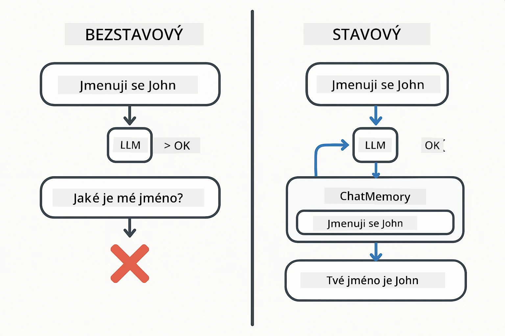
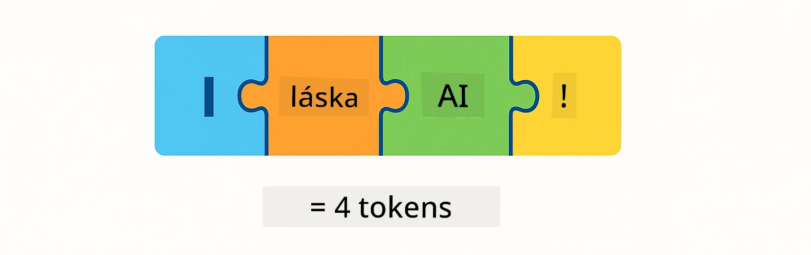
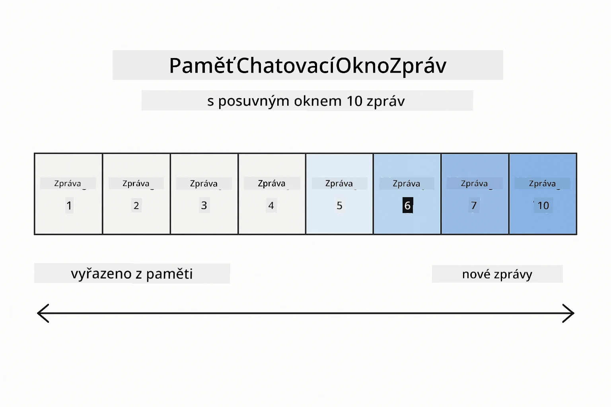
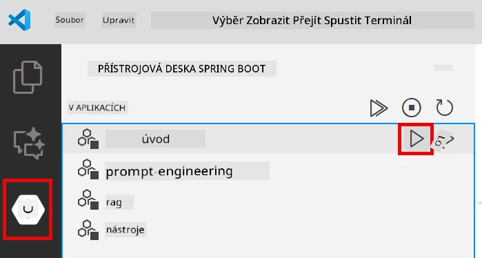
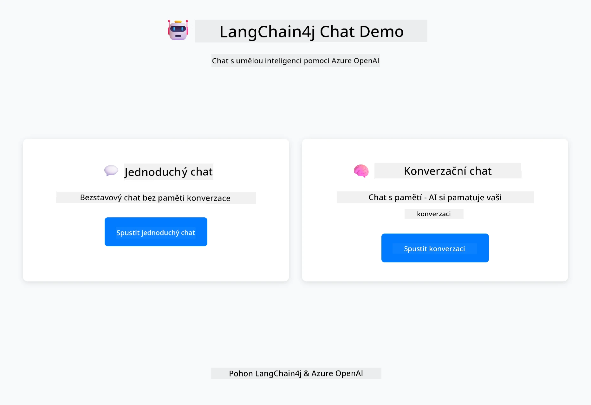
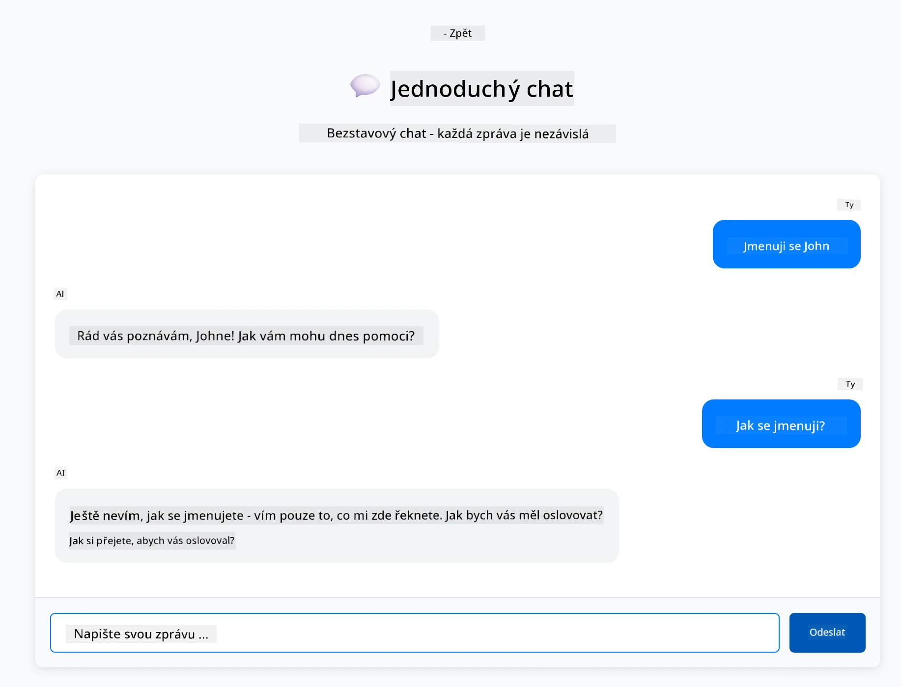
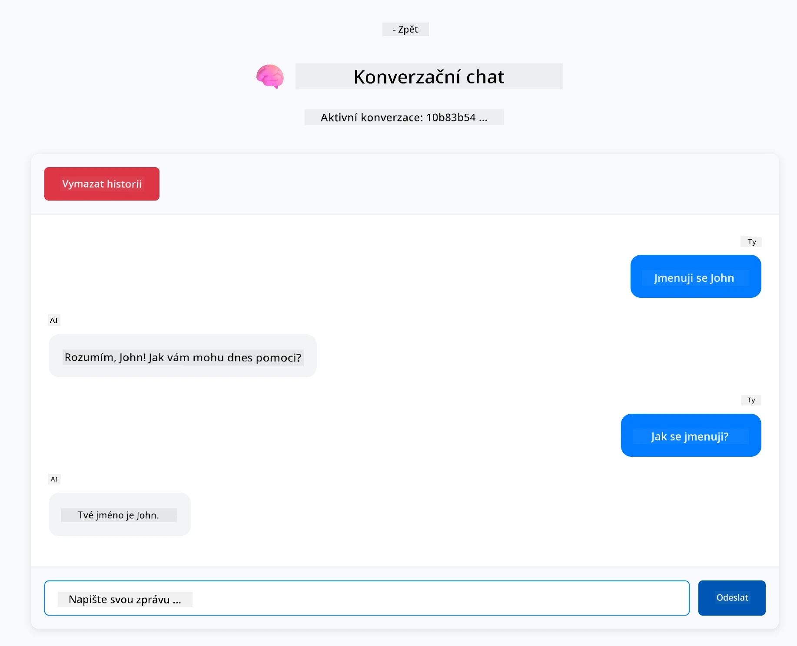

# Modul 01: Začínáme s LangChain4j

## Obsah

- [Video průvodce](#video-průvodce)
- [Co se naučíte](#co-se-naučíte)
- [Předpoklady](#předpoklady)
- [Porozumění hlavnímu problému](#porozumění-hlavnímu-problému)
- [Porozumění tokenům](#porozumění-tokenům)
- [Jak funguje paměť](#jak-funguje-paměť)
- [Jak to používá LangChain4j](#jak-to-používá-langchain4j)
- [Nasazení infrastruktury Azure OpenAI](#nasazení-infrastruktury-azure-openai)
- [Spuštění aplikace lokálně](#spuštění-aplikace-lokálně)
- [Použití aplikace](#použití-aplikace)
  - [Bezstavový chat (levý panel)](#bezstavový-chat-levý-panel)
  - [Stavový chat (pravý panel)](#stavový-chat-pravý-panel)
- [Další kroky](#další-kroky)

## Video průvodce

Sledujte tuto živou session, která vysvětluje, jak začít s tímto modulem:

<a href="https://www.youtube.com/live/nl_troDm8rQ?si=6b85S8xGjWnT2fX9"></a>

## Co se naučíte

Toto je váš výchozí bod s LangChain4j a Azure OpenAI. Začínáme se základy a postupně stavíme produkční aplikace. Tento modul se soustředí na konverzační AI, která si pamatuje kontext a udržuje stav — základní koncepty, na kterých staví všechny následující moduly.

Použijeme Azure OpenAI GPT-5.2 během celé této příručky, protože jeho pokročilé schopnosti dedukce činí chování různých vzorů jasněji viditelným. Když přidáte paměť, uvidíte rozdíl jasně. To usnadňuje porozumění tomu, co každý komponent přináší vaší aplikaci.

Vytvoříte jednu aplikaci, která ukazuje oba vzory:

**Bezstavový chat** - Každý požadavek je nezávislý. Model si nepamatuje předchozí zprávy. Je to nejjednodušší výchozí bod.

**Stavová konverzace** - Každý požadavek obsahuje historii konverzace. Model udržuje kontext přes více zpráv. To je požadavek v produkčních aplikacích.

## Předpoklady

- Azure předplatné s přístupem k Azure OpenAI
- Java 21, Maven 3.9+
- Azure CLI (https://learn.microsoft.com/en-us/cli/azure/install-azure-cli)
- Azure Developer CLI (azd) (https://learn.microsoft.com/en-us/azure/developer/azure-developer-cli/install-azd)

> **Poznámka:** Java, Maven, Azure CLI a Azure Developer CLI (azd) jsou předinstalované v poskytnutém devcontaineru.

> **Poznámka:** Tento modul používá GPT-5.2 na Azure OpenAI. Nasazení je automaticky nakonfigurováno pomocí `azd up` - neměňte název modelu v kódu.

## Porozumění hlavnímu problému

Jazykové modely jsou bezstavové. Každé API volání je nezávislé. Pokud pošlete "Jmenuji se John" a pak se zeptáte "Jak se jmenuji?", model nemá tušení, že jste se právě představil. Každý požadavek považuje za první konverzaci, kterou jste kdy vedli.

To je v pořádku pro jednoduché otázky a odpovědi, ale pro skutečné aplikace to je k ničemu. Chatboti zákaznické podpory si musí pamatovat, co jste jim řekli. Osobní asistenti potřebují kontext. Každá konverzace s více zprávami vyžaduje paměť.

Následující diagram kontrastuje dva přístupy — vlevo bezstavové volání, které zapomene vaše jméno; vpravo stavové volání podporované ChatMemory, které si jméno pamatuje.



*Rozdíl mezi bezstavovými (nezávislými voláními) a stavovými (kontextově uvědomělými) konverzacemi*

## Porozumění tokenům

Než se pustíte do konverzací, je důležité pochopit tokeny - základní jednotky textu, které jazykové modely zpracovávají:



*Příklad, jak se text rozdělí na tokeny - "I love AI!" se stane 4 samostatnými jednotkami pro zpracování*

Tokeny jsou způsob, jakým AI modely měří a zpracovávají text. Slova, interpunkce a dokonce i mezery mohou být tokeny. Váš model má limit, kolik tokenů může zpracovat najednou (400 000 pro GPT-5.2, se až 272 000 vstupními tokeny a 128 000 výstupními tokeny). Porozumění tokenům vám pomůže řídit délku konverzace a náklady.

## Jak funguje paměť

Paměť chatu řeší problém bezstavovosti tím, že uchovává historii konverzace. Před odesláním požadavku modelu framework přidá relevantní předchozí zprávy. Když se zeptáte "Jak se jmenuji?", systém ve skutečnosti pošle celou historii konverzace, což umožní modelu vidět, že jste předtím řekl "Jmenuji se John."

LangChain4j poskytuje implementace paměti, které to automaticky řeší. Vy si vyberete, kolik zpráv chcete uchovat, a framework spravuje kontextové okno. Níže uvedený diagram ukazuje, jak MessageWindowChatMemory udržuje posuvné okno nedávných zpráv.



*MessageWindowChatMemory udržuje posuvné okno nedávných zpráv a automaticky odstraňuje staré*

## Jak to používá LangChain4j

Tento modul integruje Spring Boot a přidává paměť konverzace. Takto do sebe části zapadají:

**Závislosti** - Přidejte dvě knihovny LangChain4j:

```xml
<dependency>
    <groupId>dev.langchain4j</groupId>
    <artifactId>langchain4j</artifactId> <!-- Inherited from BOM in root pom.xml -->
</dependency>
<dependency>
    <groupId>dev.langchain4j</groupId>
    <artifactId>langchain4j-open-ai-official</artifactId> <!-- Inherited from BOM in root pom.xml -->
</dependency>
```

**Chat model** - Nakonfigurujte Azure OpenAI jako Spring bean ([LangChainConfig.java](../../../01-introduction/src/main/java/com/example/langchain4j/config/LangChainConfig.java)):

```java
@Bean
public OpenAiOfficialChatModel openAiOfficialChatModel() {
    return OpenAiOfficialChatModel.builder()
            .baseUrl(azureEndpoint)
            .apiKey(azureApiKey)
            .modelName(deploymentName)
            .timeout(Duration.ofMinutes(5))
            .maxRetries(3)
            .build();
}
```

Builder čte přihlašovací údaje z proměnných prostředí nastavených pomocí `azd up`. Nastavení `baseUrl` na váš Azure endpoint umožňuje klientovi OpenAI fungovat s Azure OpenAI.

**Paměť konverzace** - Sledujte historii chatu s MessageWindowChatMemory ([ConversationService.java](../../../01-introduction/src/main/java/com/example/langchain4j/service/ConversationService.java)):

```java
ChatMemory memory = MessageWindowChatMemory.withMaxMessages(10);

memory.add(UserMessage.from("My name is John"));
memory.add(AiMessage.from("Nice to meet you, John!"));

memory.add(UserMessage.from("What's my name?"));
AiMessage aiMessage = chatModel.chat(memory.messages()).aiMessage();
memory.add(aiMessage);
```

Vytvořte paměť s `withMaxMessages(10)`, aby se uchovalo posledních 10 zpráv. Přidejte uživatelské a AI zprávy s typovými obaly: `UserMessage.from(text)` a `AiMessage.from(text)`. Získejte historii s `memory.messages()` a pošlete ji modelu. Služba uchovává samostatné instance paměti pro každý ID konverzace, což umožňuje více uživatelům chatovat současně.

> **🤖 Vyzkoušejte s [GitHub Copilot](https://github.com/features/copilot) Chat:** Otevřete [`ConversationService.java`](../../../01-introduction/src/main/java/com/example/langchain4j/service/ConversationService.java) a zeptejte se:
> - "Jak MessageWindowChatMemory rozhoduje, které zprávy zahodit, když je okno plné?"
> - "Mohu implementovat vlastní úložiště paměti pomocí databáze místo paměti v RAM?"
> - "Jak bych přidal shrnutí pro kompresi staré historie konverzace?"

Bezstavový chat endpoint paměť zcela vynechává - pouze `chatModel.chat(prompt)` jako rychlý start. Stavový endpoint přidává zprávy do paměti, získává historii a zahrnuje tento kontext s každým požadavkem. Stejná konfigurace modelu, různé vzory.

## Nasazení infrastruktury Azure OpenAI

**Bash:**
```bash
cd 01-introduction
azd up  # Vyberte předplatné a umístění (doporučeno eastus2)
```

**PowerShell:**
```powershell
cd 01-introduction
azd up  # Vyberte předplatné a umístění (doporučeno eastus2)
```

> **Poznámka:** Pokud narazíte na chybu timeoutu (`RequestConflict: Cannot modify resource ... provisioning state is not terminal`), jednoduše spusťte znovu `azd up`. Azure zdroje mohou stále probíhat na pozadí a opakování umožní dokončení nasazení, jakmile zdroje dosáhnou konečného stavu.

Toto provede:
1. Nasazení zdroje Azure OpenAI s GPT-5.2 a modely text-embedding-3-small
2. Automatické vygenerování souboru `.env` v kořenovém adresáři projektu s přihlašovacími údaji
3. Nastavení všech potřebných proměnných prostředí

**Máte problémy s nasazením?** Viz [Infrastructure README](infra/README.md) pro podrobné návody k řešení problémů včetně konfliktů názvů subdomén, ručního nasazení přes Azure Portal a návodů k konfiguraci modelu.

**Ověření úspěšnosti nasazení:**

**Bash:**
```bash
cat ../.env  # Mělo by zobrazit AZURE_OPENAI_ENDPOINT, API_KEY atd.
```

**PowerShell:**
```powershell
Get-Content ..\.env  # Mělo by zobrazit AZURE_OPENAI_ENDPOINT, API_KEY, atd.
```

> **Poznámka:** Příkaz `azd up` automaticky generuje `.env` soubor. Pokud ho budete potřebovat později aktualizovat, můžete buď upravit `.env` soubor ručně, nebo ho znovu vygenerovat spuštěním:
>
> **Bash:**
> ```bash
> cd ..
> bash .azd-env.sh
> ```
>
> **PowerShell:**
> ```powershell
> cd ..
> .\.azd-env.ps1
> ```

## Spuštění aplikace lokálně

**Ověření nasazení:**

Ujistěte se, že soubor `.env` existuje v kořenovém adresáři s údaji pro Azure. Spusťte to z adresáře modulu (`01-introduction/`):

**Bash:**
```bash
cat ../.env  # Mělo by zobrazit AZURE_OPENAI_ENDPOINT, API_KEY, DEPLOYMENT
```

**PowerShell:**
```powershell
Get-Content ..\.env  # Mělo by zobrazit AZURE_OPENAI_ENDPOINT, API_KEY, DEPLOYMENT
```

**Spuštění aplikací:**

**Možnost 1: Použití Spring Boot Dashboard (doporučeno pro uživatele VS Code)**

Dev container obsahuje rozšíření Spring Boot Dashboard, které poskytuje vizuální rozhraní pro správu všech Spring Boot aplikací. Najdete ho v Activity Bar na levé straně VS Code (ikona Spring Boot).

Ze Spring Boot Dashboard můžete:
- Vidět všechny dostupné Spring Boot aplikace v pracovním prostoru
- Spustit/zastavit aplikace jedním kliknutím
- Zobrazit logy aplikací v reálném čase
- Monitorovat stav aplikace

Stačí kliknout na tlačítko play vedle "introduction" pro spuštění tohoto modulu, nebo spustit všechny moduly najednou.



*Spring Boot Dashboard ve VS Code — spusťte, zastavte a monitorujte všechny moduly z jednoho místa*

**Možnost 2: Použití shell skriptů**

Spusťte všechny webové aplikace (moduly 01-04):

**Bash:**
```bash
cd ..  # Z kořenového adresáře
./start-all.sh
```

**PowerShell:**
```powershell
cd ..  # Z kořenového adresáře
.\start-all.ps1
```

Nebo spusťte pouze tento modul:

**Bash:**
```bash
cd 01-introduction
./start.sh
```

**PowerShell:**
```powershell
cd 01-introduction
.\start.ps1
```

Oba skripty automaticky načtou proměnné prostředí ze souboru `.env` v kořenovém adresáři a postaví JARy, pokud neexistují.

> **Poznámka:** Pokud chcete nejprve ručně postavit všechny moduly před spuštěním:
>
> **Bash:**
> ```bash
> cd ..  # Go to root directory
> mvn clean package -DskipTests
> ```
>
> **PowerShell:**
> ```powershell
> cd ..  # Go to root directory
> mvn clean package -DskipTests
> ```

Otevřete v prohlížeči http://localhost:8080.

**Zastavení aplikace:**

**Bash:**
```bash
./stop.sh  # Pouze tento modul
# Nebo
cd .. && ./stop-all.sh  # Všechny moduly
```

**PowerShell:**
```powershell
.\stop.ps1  # Pouze tento modul
# Nebo
cd ..; .\stop-all.ps1  # Všechny moduly
```

## Použití aplikace

Aplikace poskytuje webové rozhraní se dvěma implementacemi chatu vedle sebe.



*Dashboard zobrazuje možnosti Simple Chat (bezstavový) a Conversational Chat (stavový)*

### Bezstavový chat (levý panel)

Vyzkoušejte to jako první. Zeptejte se "Jmenuji se John" a pak okamžitě "Jak se jmenuji?". Model si to nepamatuje, protože každá zpráva je nezávislá. To ukazuje hlavní problém základní integrace jazykového modelu - žádný kontext konverzace.



*AI si nepamatuje vaše jméno z předchozí zprávy*

### Stavový chat (pravý panel)

Nyní vyzkoušejte stejnou sekvenci zde. Zeptejte se "Jmenuji se John" a pak "Jak se jmenuji?". Tentokrát si to pamatuje. Rozdíl je v MessageWindowChatMemory - udržuje historii konverzace a zahrnuje ji s každým požadavkem. Takto funguje produkční konverzační AI.



*AI si pamatuje vaše jméno z předchozí části konverzace*

Oba panely používají stejný model GPT-5.2. Jediný rozdíl je paměť. To jasně ukazuje, co paměť přináší vaší aplikaci a proč je nezbytná pro skutečné použití.

## Další kroky

**Další modul:** [02-prompt-engineering - Prompt Engineering s GPT-5.2](../02-prompt-engineering/README.md)

---

**Navigace:** [← Zpět na hlavní](../README.md) | [Další: Modul 02 - Prompt Engineering →](../02-prompt-engineering/README.md)

---

<!-- CO-OP TRANSLATOR DISCLAIMER START -->
**Prohlášení o omezení odpovědnosti**:
Tento dokument byl přeložen pomocí AI překladatelské služby [Co-op Translator](https://github.com/Azure/co-op-translator). Přestože usilujeme o co největší přesnost, mějte prosím na paměti, že automatizované překlady mohou obsahovat chyby nebo nepřesnosti. Originální dokument v jeho mateřském jazyce by měl být považován za autoritativní zdroj. Pro kritické informace se doporučuje profesionální lidský překlad. Nejsme odpovědní za jakékoli nedorozumění nebo nesprávné interpretace vzniklé použitím tohoto překladu.
<!-- CO-OP TRANSLATOR DISCLAIMER END -->