<!--
CO_OP_TRANSLATOR_METADATA:
{
  "original_hash": "8d787826cad7e92bf5cdbd116b1e6116",
  "translation_date": "2025-12-13T16:23:00+00:00",
  "source_file": "02-prompt-engineering/README.md",
  "language_code": "cs"
}
-->
# Modul 02: Prompt Engineering s GPT-5

## Obsah

- [Co se naučíte](../../../02-prompt-engineering)
- [Požadavky](../../../02-prompt-engineering)
- [Pochopení prompt engineeringu](../../../02-prompt-engineering)
- [Jak to využívá LangChain4j](../../../02-prompt-engineering)
- [Základní vzory](../../../02-prompt-engineering)
- [Použití existujících Azure zdrojů](../../../02-prompt-engineering)
- [Snímky obrazovky aplikace](../../../02-prompt-engineering)
- [Prozkoumání vzorů](../../../02-prompt-engineering)
  - [Nízká vs vysoká ochota](../../../02-prompt-engineering)
  - [Provádění úkolů (preambly nástrojů)](../../../02-prompt-engineering)
  - [Sebereflexivní kód](../../../02-prompt-engineering)
  - [Strukturovaná analýza](../../../02-prompt-engineering)
  - [Vícekolový chat](../../../02-prompt-engineering)
  - [Krok za krokem uvažování](../../../02-prompt-engineering)
  - [Omezený výstup](../../../02-prompt-engineering)
- [Co se skutečně učíte](../../../02-prompt-engineering)
- [Další kroky](../../../02-prompt-engineering)

## Co se naučíte

V předchozím modulu jste viděli, jak paměť umožňuje konverzační AI a používali jste GitHub Models pro základní interakce. Nyní se zaměříme na to, jak klást otázky – tedy samotné prompty – pomocí Azure OpenAI GPT-5. Způsob, jakým strukturalizujete své prompty, dramaticky ovlivňuje kvalitu odpovědí, které dostanete.

Použijeme GPT-5, protože zavádí řízení uvažování – můžete modelu říct, kolik má před odpovědí přemýšlet. To dělá různé strategie promptování zřetelnějšími a pomáhá vám pochopit, kdy použít který přístup. Také využijeme méně omezení rychlosti u GPT-5 v Azure ve srovnání s GitHub Models.

## Požadavky

- Dokončený Modul 01 (nasazeny Azure OpenAI zdroje)
- Soubor `.env` v kořenovém adresáři s Azure přihlašovacími údaji (vytvořený příkazem `azd up` v Modulu 01)

> **Poznámka:** Pokud jste Modul 01 nedokončili, nejprve postupujte podle tamních pokynů k nasazení.

## Pochopení prompt engineeringu

Prompt engineering je o navrhování vstupního textu, který vám konzistentně přinese požadované výsledky. Nejde jen o kladení otázek – jde o strukturování požadavků tak, aby model přesně pochopil, co chcete a jak to dodat.

Představte si to jako dávání instrukcí kolegovi. „Oprav chybu“ je vágní. „Oprav výjimku null pointer v UserService.java na řádku 45 přidáním kontroly null“ je konkrétní. Jazykové modely fungují stejně – důležitá je konkrétnost a struktura.

## Jak to využívá LangChain4j

Tento modul demonstruje pokročilé vzory promptování pomocí stejného základu LangChain4j z předchozích modulů, se zaměřením na strukturu promptů a řízení uvažování.


*Jak LangChain4j propojuje vaše prompty s Azure OpenAI GPT-5*

**Závislosti** – Modul 02 používá následující závislosti langchain4j definované v `pom.xml`:
```xml
<dependency>
    <groupId>dev.langchain4j</groupId>
    <artifactId>langchain4j</artifactId> <!-- Inherited from BOM in root pom.xml -->
</dependency>
<dependency>
    <groupId>dev.langchain4j</groupId>
    <artifactId>langchain4j-open-ai-official</artifactId> <!-- Inherited from BOM in root pom.xml -->
</dependency>
```

**Konfigurace OpenAiOfficialChatModel** – [LangChainConfig.java](../../../02-prompt-engineering/src/main/java/com/example/langchain4j/prompts/config/LangChainConfig.java)

Chat model je manuálně nakonfigurován jako Spring bean pomocí oficiálního klienta OpenAI, který podporuje Azure OpenAI endpointy. Klíčový rozdíl oproti Modulu 01 je v tom, jak strukturalizujeme prompty posílané do `chatModel.chat()`, nikoli v samotném nastavení modelu.

**Systémové a uživatelské zprávy** – [Gpt5PromptService.java](../../../02-prompt-engineering/src/main/java/com/example/langchain4j/prompts/service/Gpt5PromptService.java)

LangChain4j odděluje typy zpráv pro přehlednost. `SystemMessage` nastavuje chování a kontext AI (např. „Jste recenzent kódu“), zatímco `UserMessage` obsahuje skutečný požadavek. Toto oddělení umožňuje udržet konzistentní chování AI napříč různými uživatelskými dotazy.

```java
SystemMessage systemMsg = SystemMessage.from(
    "You are a helpful Java programming expert."
);

UserMessage userMsg = UserMessage.from(
    "Explain what a List is in Java"
);

String response = chatModel.chat(systemMsg, userMsg);
```

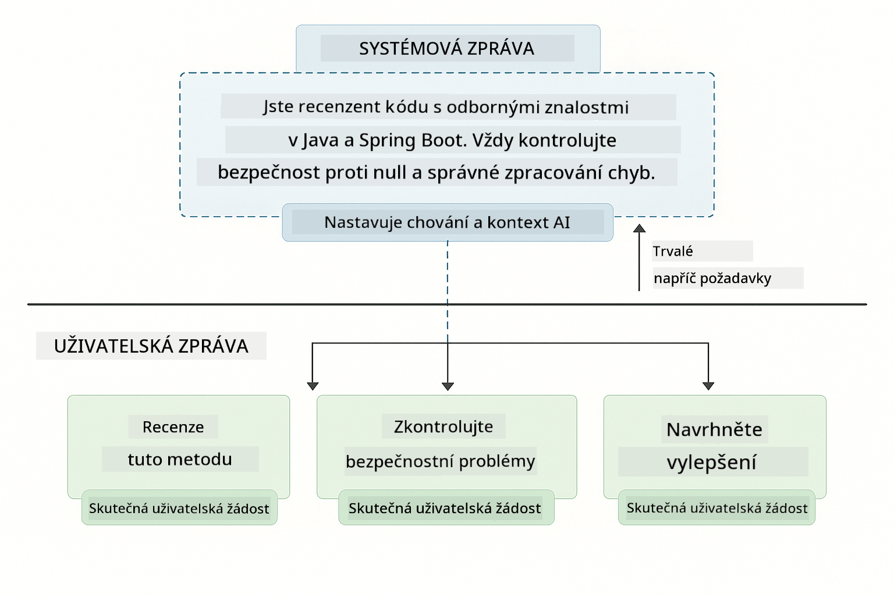

*SystemMessage poskytuje trvalý kontext, zatímco UserMessages obsahují jednotlivé požadavky*

**MessageWindowChatMemory pro vícekolové konverzace** – Pro vzor vícekolového rozhovoru znovu používáme `MessageWindowChatMemory` z Modulu 01. Každá relace má vlastní instanci paměti uloženou v `Map<String, ChatMemory>`, což umožňuje více současných konverzací bez míchání kontextu.

**Šablony promptů** – Skutečný důraz je zde na prompt engineering, nikoli na nové API LangChain4j. Každý vzor (nízká ochota, vysoká ochota, provádění úkolů atd.) používá stejnou metodu `chatModel.chat(prompt)`, ale s pečlivě strukturovanými texty promptů. XML tagy, instrukce a formátování jsou součástí textu promptu, nikoli funkcí LangChain4j.

**Řízení uvažování** – Úsilí o uvažování GPT-5 je řízeno instrukcemi v promptu jako „maximálně 2 kroky uvažování“ nebo „prozkoumej důkladně“. Jsou to techniky prompt engineeringu, nikoli konfigurace LangChain4j. Knihovna jednoduše předává vaše prompty modelu.

Hlavní závěr: LangChain4j poskytuje infrastrukturu (připojení k modelu přes [LangChainConfig.java](../../../02-prompt-engineering/src/main/java/com/example/langchain4j/prompts/config/LangChainConfig.java), paměť, zpracování zpráv přes [Gpt5PromptService.java](../../../02-prompt-engineering/src/main/java/com/example/langchain4j/prompts/service/Gpt5PromptService.java)), zatímco tento modul vás učí, jak v této infrastruktuře vytvářet efektivní prompty.

## Základní vzory

Ne všechny problémy vyžadují stejný přístup. Některé otázky potřebují rychlé odpovědi, jiné hluboké přemýšlení. Některé vyžadují viditelné uvažování, jiné jen výsledky. Tento modul pokrývá osm vzorů promptování – každý optimalizovaný pro různé scénáře. Vyzkoušíte si je všechny, abyste pochopili, kdy který přístup funguje nejlépe.

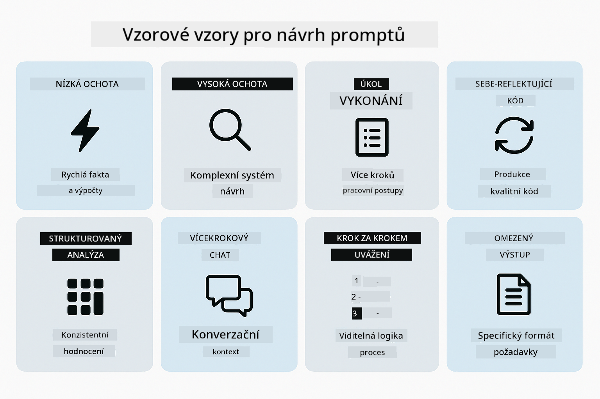

*Přehled osmi vzorů prompt engineeringu a jejich použití*

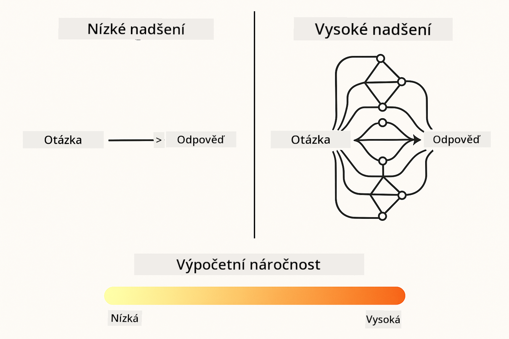

*Nízká ochota (rychlé, přímé) vs vysoká ochota (důkladné, průzkumné) přístupy k uvažování*

**Nízká ochota (rychlé a zaměřené)** – Pro jednoduché otázky, kde chcete rychlé, přímé odpovědi. Model provádí minimální uvažování – maximálně 2 kroky. Použijte to pro výpočty, vyhledávání nebo přímočaré otázky.

```java
String prompt = """
    <reasoning_effort>low</reasoning_effort>
    <instruction>maximum 2 reasoning steps</instruction>
    
    What is 15% of 200?
    """;

String response = chatModel.chat(prompt);
```

> 💡 **Prozkoumejte s GitHub Copilot:** Otevřete [`Gpt5PromptService.java`](../../../02-prompt-engineering/src/main/java/com/example/langchain4j/prompts/service/Gpt5PromptService.java) a zeptejte se:
> - „Jaký je rozdíl mezi nízkou a vysokou ochotou ve vzorech promptování?“
> - „Jak XML tagy v promtech pomáhají strukturovat odpověď AI?“
> - „Kdy mám použít vzory sebereflexe vs přímé instrukce?“

**Vysoká ochota (hluboké a důkladné)** – Pro složité problémy, kde chcete komplexní analýzu. Model důkladně prozkoumává a ukazuje podrobné uvažování. Použijte to pro návrh systémů, architektonická rozhodnutí nebo složitý výzkum.

```java
String prompt = """
    <reasoning_effort>high</reasoning_effort>
    <instruction>explore thoroughly, show detailed reasoning</instruction>
    
    Design a caching strategy for a high-traffic REST API.
    """;

String response = chatModel.chat(prompt);
```

**Provádění úkolů (postup krok za krokem)** – Pro vícekrokové pracovní postupy. Model poskytuje plán dopředu, popisuje každý krok při práci a pak dává shrnutí. Použijte to pro migrace, implementace nebo jakýkoli vícekrokový proces.

```java
String prompt = """
    <task>Create a REST endpoint for user registration</task>
    <preamble>Provide an upfront plan</preamble>
    <narration>Narrate each step as you work</narration>
    <summary>Summarize what was accomplished</summary>
    """;

String response = chatModel.chat(prompt);
```

Chain-of-Thought promptování explicitně žádá model, aby ukázal svůj proces uvažování, což zlepšuje přesnost u složitých úkolů. Postupné rozdělení pomáhá jak lidem, tak AI pochopit logiku.

> **🤖 Vyzkoušejte s [GitHub Copilot](https://github.com/features/copilot) Chat:** Zeptejte se na tento vzor:
> - „Jak bych přizpůsobil vzor provádění úkolů pro dlouhotrvající operace?“
> - „Jaké jsou nejlepší praktiky pro strukturování preamblů nástrojů v produkčních aplikacích?“
> - „Jak mohu zachytit a zobrazit průběžné aktualizace pokroku v UI?“


*Plán → Provedení → Shrnutí pracovního postupu pro vícekrokové úkoly*

**Sebereflexivní kód** – Pro generování produkčního kódu. Model generuje kód, kontroluje jej podle kvalitativních kritérií a iterativně jej zlepšuje. Použijte to při vytváření nových funkcí nebo služeb.

```java
String prompt = """
    <task>Create an email validation service</task>
    <quality_criteria>
    - Correct logic and error handling
    - Best practices (clean code, proper naming)
    - Performance optimization
    - Security considerations
    </quality_criteria>
    <instruction>Generate code, evaluate against criteria, improve iteratively</instruction>
    """;

String response = chatModel.chat(prompt);
```

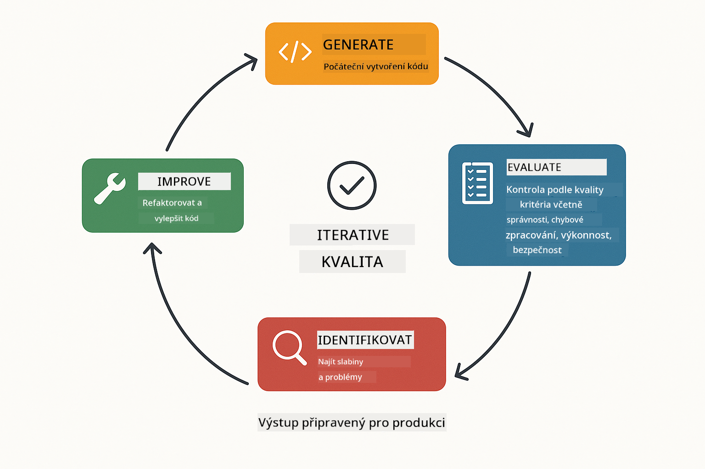

*Iterační smyčka zlepšování – generuj, vyhodnoť, identifikuj problémy, zlepši, opakuj*

**Strukturovaná analýza** – Pro konzistentní hodnocení. Model kontroluje kód pomocí pevného rámce (správnost, praktiky, výkon, bezpečnost). Použijte to pro revize kódu nebo hodnocení kvality.

```java
String prompt = """
    <code>
    public List getUsers() {
        return database.query("SELECT * FROM users");
    }
    </code>
    
    <framework>
    Evaluate using these categories:
    1. Correctness - Logic and functionality
    2. Best Practices - Code quality
    3. Performance - Efficiency concerns
    4. Security - Vulnerabilities
    </framework>
    """;

String response = chatModel.chat(prompt);
```

> **🤖 Vyzkoušejte s [GitHub Copilot](https://github.com/features/copilot) Chat:** Zeptejte se na strukturovanou analýzu:
> - „Jak mohu přizpůsobit rámec analýzy pro různé typy revizí kódu?“
> - „Jak nejlépe programově zpracovat a reagovat na strukturovaný výstup?“
> - „Jak zajistit konzistentní úrovně závažnosti napříč různými revizními sezeními?“

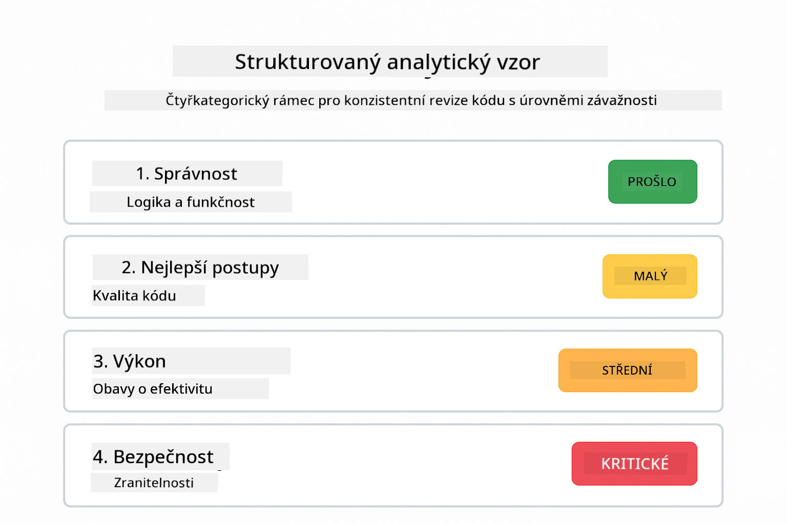

*Rámec se čtyřmi kategoriemi pro konzistentní revize kódu s úrovněmi závažnosti*

**Vícekolový chat** – Pro konverzace, které potřebují kontext. Model si pamatuje předchozí zprávy a staví na nich. Použijte to pro interaktivní pomoc nebo složité otázky a odpovědi.

```java
ChatMemory memory = MessageWindowChatMemory.withMaxMessages(10);

memory.add(UserMessage.from("What is Spring Boot?"));
AiMessage aiMessage1 = chatModel.chat(memory.messages()).aiMessage();
memory.add(aiMessage1);

memory.add(UserMessage.from("Show me an example"));
AiMessage aiMessage2 = chatModel.chat(memory.messages()).aiMessage();
memory.add(aiMessage2);
```

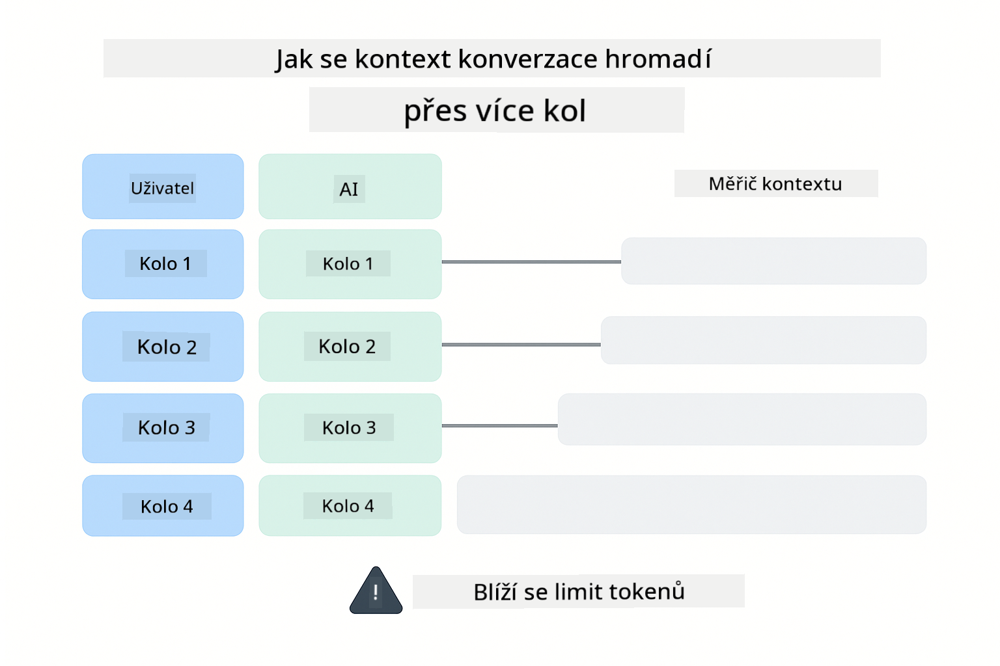

*Jak se kontext konverzace hromadí přes více kol až do dosažení limitu tokenů*

**Krok za krokem uvažování** – Pro problémy vyžadující viditelnou logiku. Model ukazuje explicitní uvažování pro každý krok. Použijte to pro matematické úlohy, logické hádanky nebo když potřebujete pochopit myšlenkový proces.

```java
String prompt = """
    <instruction>Show your reasoning step-by-step</instruction>
    
    If a train travels 120 km in 2 hours, then stops for 30 minutes,
    then travels another 90 km in 1.5 hours, what is the average speed
    for the entire journey including the stop?
    """;

String response = chatModel.chat(prompt);
```


*Rozklad problémů na explicitní logické kroky*

**Omezený výstup** – Pro odpovědi s konkrétními požadavky na formát. Model přísně dodržuje pravidla formátu a délky. Použijte to pro shrnutí nebo když potřebujete přesnou strukturu výstupu.

```java
String prompt = """
    <constraints>
    - Exactly 100 words
    - Bullet point format
    - Technical terms only
    </constraints>
    
    Summarize the key concepts of machine learning.
    """;

String response = chatModel.chat(prompt);
```

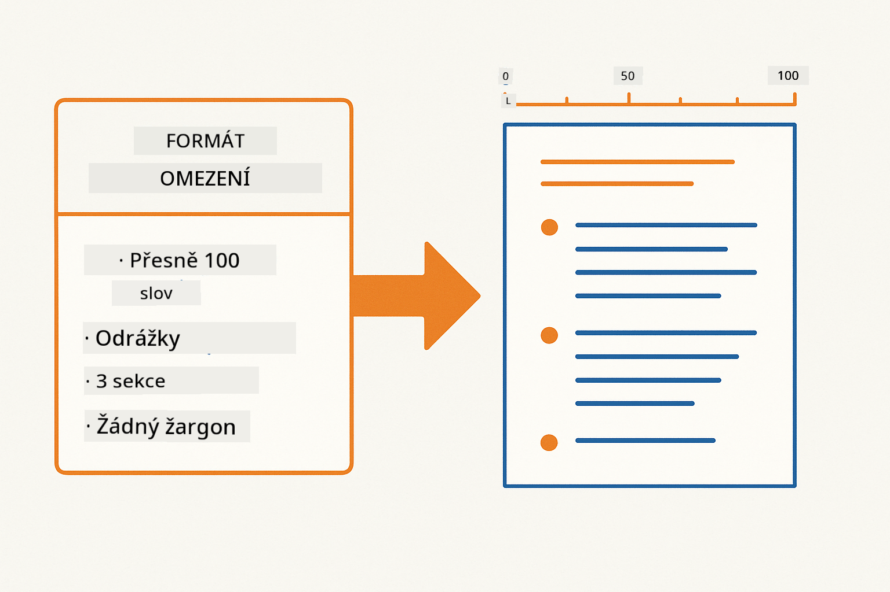

*Vynucování specifických požadavků na formát, délku a strukturu*

## Použití existujících Azure zdrojů

**Ověření nasazení:**

Ujistěte se, že soubor `.env` existuje v kořenovém adresáři s Azure přihlašovacími údaji (vytvořený během Modulu 01):
```bash
cat ../.env  # Mělo by zobrazit AZURE_OPENAI_ENDPOINT, API_KEY, DEPLOYMENT
```

**Spuštění aplikace:**

> **Poznámka:** Pokud jste již spustili všechny aplikace pomocí `./start-all.sh` z Modulu 01, tento modul již běží na portu 8083. Můžete přeskočit níže uvedené příkazy a jít přímo na http://localhost:8083.

**Možnost 1: Použití Spring Boot Dashboard (doporučeno pro uživatele VS Code)**

Vývojový kontejner obsahuje rozšíření Spring Boot Dashboard, které poskytuje vizuální rozhraní pro správu všech Spring Boot aplikací. Najdete jej v Activity Bar na levé straně VS Code (hledáte ikonu Spring Boot).

Ze Spring Boot Dashboard můžete:
- Vidět všechny dostupné Spring Boot aplikace v pracovním prostoru
- Spouštět/zastavovat aplikace jedním kliknutím
- Zobrazovat logy aplikací v reálném čase
- Monitorovat stav aplikací

Jednoduše klikněte na tlačítko přehrávání vedle „prompt-engineering“ pro spuštění tohoto modulu, nebo spusťte všechny moduly najednou.

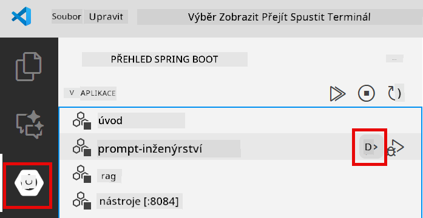

**Možnost 2: Použití shell skriptů**

Spusťte všechny webové aplikace (moduly 01-04):

**Bash:**
```bash
cd ..  # Z kořenového adresáře
./start-all.sh
```

**PowerShell:**
```powershell
cd ..  # Z kořenového adresáře
.\start-all.ps1
```

Nebo spusťte jen tento modul:

**Bash:**
```bash
cd 02-prompt-engineering
./start.sh
```

**PowerShell:**
```powershell
cd 02-prompt-engineering
.\start.ps1
```

Oba skripty automaticky načtou proměnné prostředí ze souboru `.env` v kořenovém adresáři a pokud JAR soubory neexistují, sestaví je.

> **Poznámka:** Pokud chcete všechny moduly sestavit ručně před spuštěním:
>
> **Bash:**
> ```bash
> cd ..  # Go to root directory
> mvn clean package -DskipTests
> ```
>
> **PowerShell:**
> ```powershell
> cd ..  # Go to root directory
> mvn clean package -DskipTests
> ```

Otevřete http://localhost:8083 ve svém prohlížeči.

**Pro zastavení:**

**Bash:**
```bash
./stop.sh  # Pouze tento modul
# Nebo
cd .. && ./stop-all.sh  # Všechny moduly
```

**PowerShell:**
```powershell
.\stop.ps1  # Pouze tento modul
# Nebo
cd ..; .\stop-all.ps1  # Všechny moduly
```

## Snímky obrazovky aplikace


*Hlavní dashboard zobrazující všech 8 vzorů prompt engineeringu s jejich charakteristikami a použitím*

## Prozkoumání vzorů

Webové rozhraní vám umožní experimentovat s různými strategiemi promptování. Každý vzor řeší jiné problémy – vyzkoušejte je a uvidíte, kdy který přístup vyniká.

### Nízká vs vysoká ochota

Zeptejte se jednoduchou otázku jako „Kolik je 15 % z 200?“ pomocí Nízké ochoty. Dostanete okamžitou, přímou odpověď. Nyní se zeptejte na něco složitého jako „Navrhni caching strategii pro API s vysokou návštěvností“ pomocí Vysoké ochoty. Sledujte, jak model zpomalí a poskytne podrobné uvažování. Stejný model, stejná struktura otázky – ale prompt mu říká, kolik má přemýšlet.

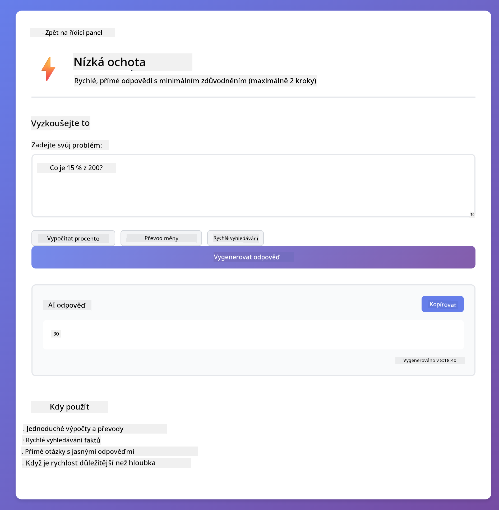
*Rychlý výpočet s minimálním uvažováním*

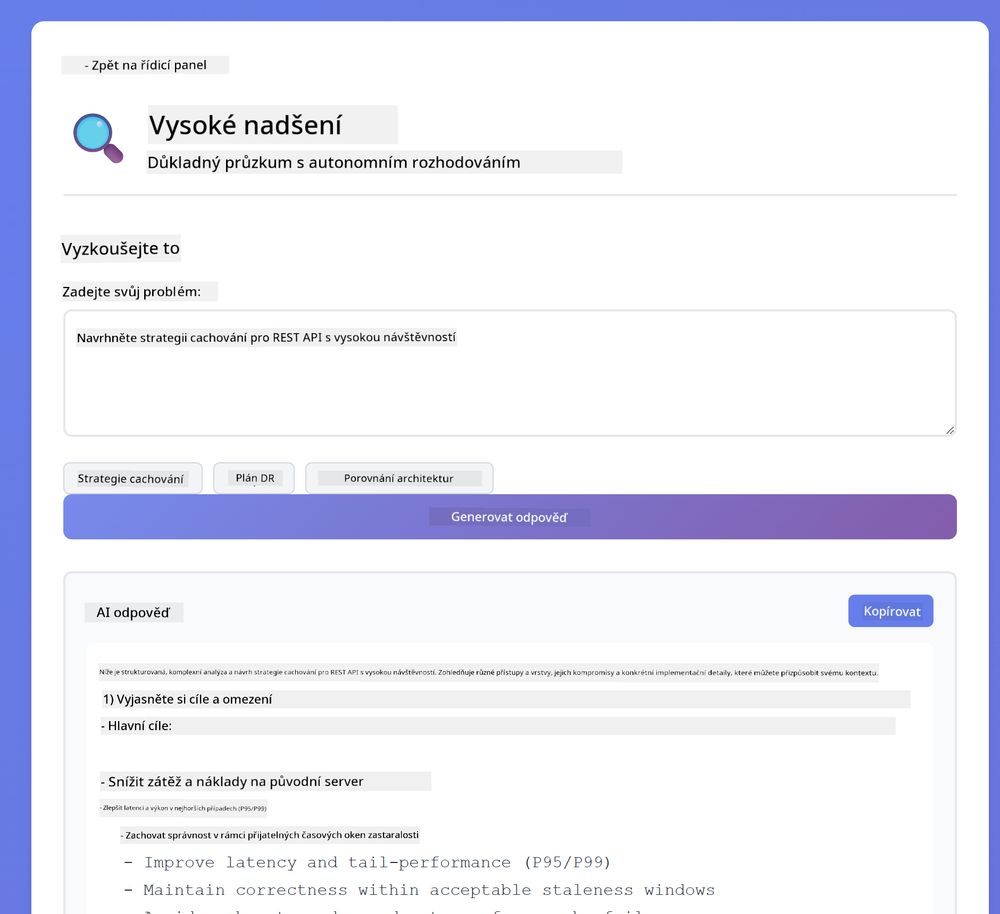

*Komplexní strategie cachování (2,8MB)*

### Provádění úkolu (úvodní texty nástrojů)

Vícekrokové pracovní postupy těží z předběžného plánování a komentování postupu. Model popisuje, co udělá, komentuje každý krok a pak shrnuje výsledky.


*Vytvoření REST endpointu s komentováním krok za krokem (3,9MB)*

### Sebereflektivní kód

Zkuste "Vytvořit službu pro ověření e-mailu". Místo pouhého generování kódu a zastavení model generuje, hodnotí podle kvalitativních kritérií, identifikuje slabiny a zlepšuje. Uvidíte, jak iteruje, dokud kód nesplní produkční standardy.


*Kompletní služba pro ověření e-mailu (5,2MB)*

### Strukturovaná analýza

Revize kódu potřebují konzistentní hodnotící rámce. Model analyzuje kód pomocí pevných kategorií (správnost, praktiky, výkon, bezpečnost) s úrovněmi závažnosti.

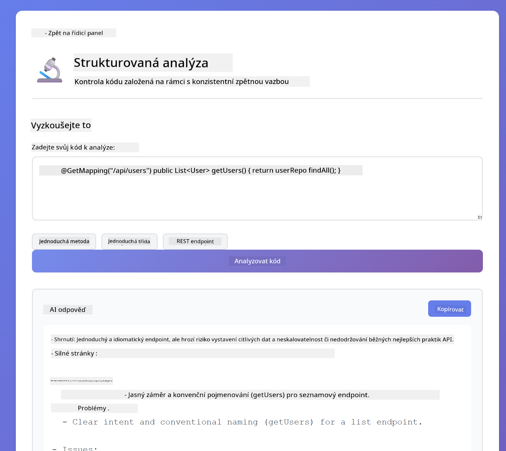

*Revize kódu založená na rámcích*

### Vícekrokový chat

Zeptejte se "Co je Spring Boot?" a hned potom "Ukaž mi příklad". Model si pamatuje první otázku a dá vám konkrétní příklad Spring Boot. Bez paměti by druhá otázka byla příliš vágní.


*Zachování kontextu napříč otázkami*

### Uvažování krok za krokem

Vyberte matematický problém a zkuste ho s uvažováním krok za krokem a s nízkou ochotou. Nízká ochota vám dá jen odpověď – rychle, ale neprůhledně. Krok za krokem ukazuje každý výpočet a rozhodnutí.

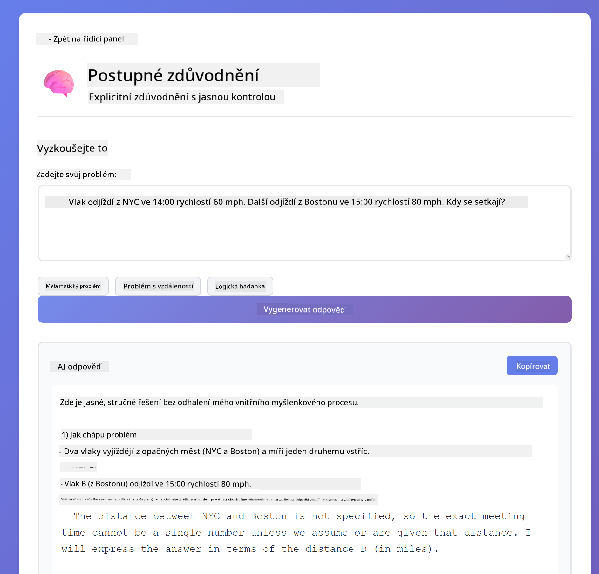

*Matematický problém s explicitními kroky*

### Omezený výstup

Když potřebujete specifické formáty nebo počet slov, tento vzor vynucuje přísné dodržení. Zkuste vygenerovat shrnutí přesně se 100 slovy v odrážkovém formátu.

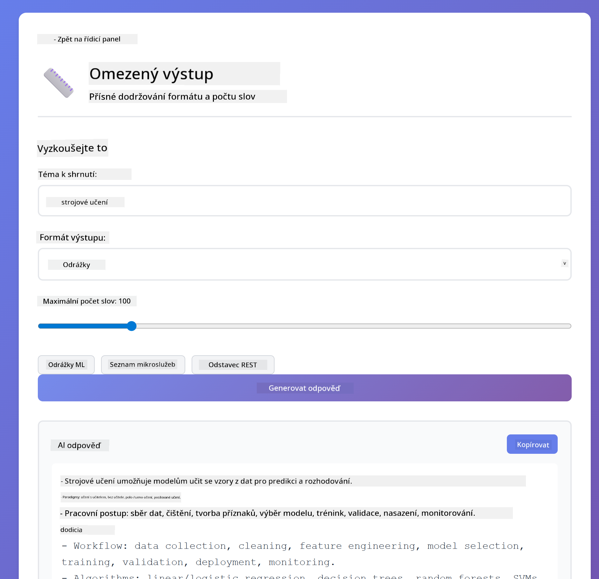

*Shrnutí strojového učení s kontrolou formátu*

## Co se opravdu učíte

**Úsilí o uvažování mění vše**

GPT-5 vám umožňuje řídit výpočetní úsilí pomocí vašich promptů. Nízké úsilí znamená rychlé odpovědi s minimálním zkoumáním. Vysoké úsilí znamená, že model si dává čas na hluboké přemýšlení. Učíte se přizpůsobit úsilí složitosti úkolu – neztrácejte čas na jednoduché otázky, ale ani nespěchejte u složitých rozhodnutí.

**Struktura řídí chování**

Všimli jste si XML tagů v promptech? Nejsou jen dekorativní. Modely spolehlivěji následují strukturované instrukce než volný text. Když potřebujete vícekrokové procesy nebo složitou logiku, struktura pomáhá modelu sledovat, kde je a co přijde dál.

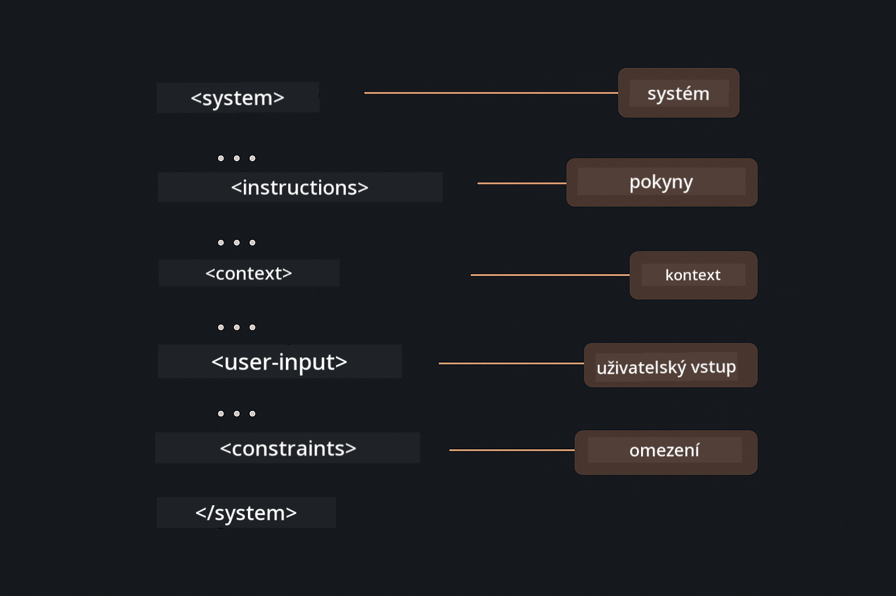

*Anatomie dobře strukturovaného promptu s jasnými sekcemi a organizací ve stylu XML*

**Kvalita díky sebehodnocení**

Vzory sebereflexe fungují tak, že explicitně stanovují kvalitativní kritéria. Místo toho, abyste doufali, že model "to udělá správně", říkáte mu přesně, co "správně" znamená: správná logika, zpracování chyb, výkon, bezpečnost. Model pak může hodnotit svůj vlastní výstup a zlepšovat se. To proměňuje generování kódu z loterie na proces.

**Kontext je omezený**

Vícekrokové konverzace fungují tak, že s každým požadavkem zahrnují historii zpráv. Ale existuje limit – každý model má maximální počet tokenů. Jak konverzace rostou, budete potřebovat strategie, jak udržet relevantní kontext, aniž byste narazili na strop. Tento modul vám ukáže, jak paměť funguje; později se naučíte, kdy shrnovat, kdy zapomínat a kdy vyhledávat.

## Další kroky

**Další modul:** [03-rag - RAG (Retrieval-Augmented Generation)](../03-rag/README.md)

---

**Navigace:** [← Předchozí: Modul 01 - Úvod](../01-introduction/README.md) | [Zpět na hlavní stránku](../README.md) | [Další: Modul 03 - RAG →](../03-rag/README.md)

---

<!-- CO-OP TRANSLATOR DISCLAIMER START -->
**Prohlášení o vyloučení odpovědnosti**:  
Tento dokument byl přeložen pomocí AI překladatelské služby [Co-op Translator](https://github.com/Azure/co-op-translator). Přestože usilujeme o přesnost, mějte prosím na paměti, že automatické překlady mohou obsahovat chyby nebo nepřesnosti. Původní dokument v jeho mateřském jazyce by měl být považován za autoritativní zdroj. Pro důležité informace se doporučuje profesionální lidský překlad. Nejsme odpovědní za jakékoli nedorozumění nebo nesprávné výklady vyplývající z použití tohoto překladu.
<!-- CO-OP TRANSLATOR DISCLAIMER END -->