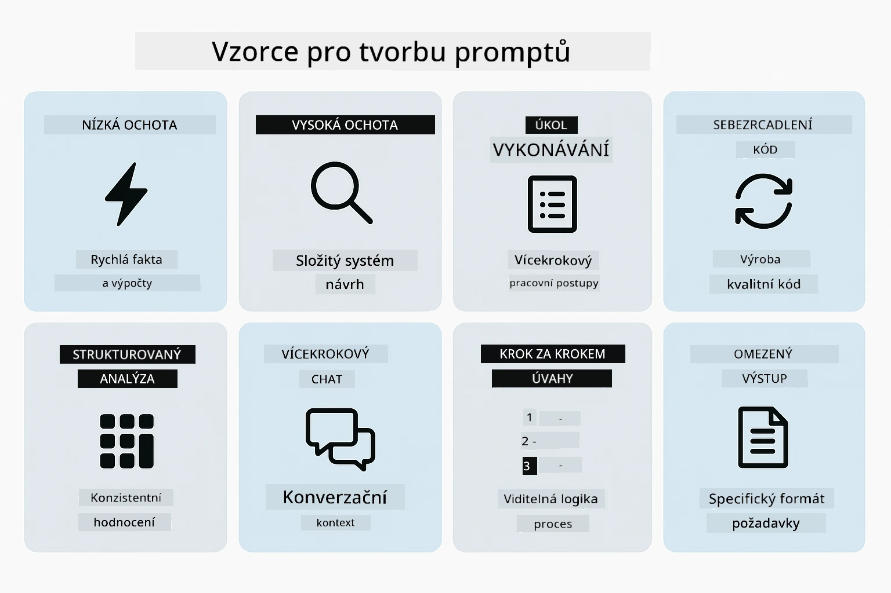
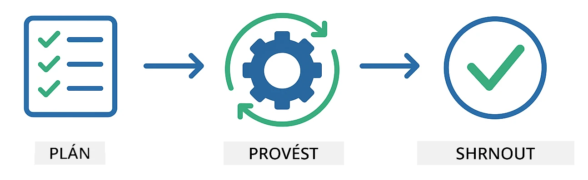
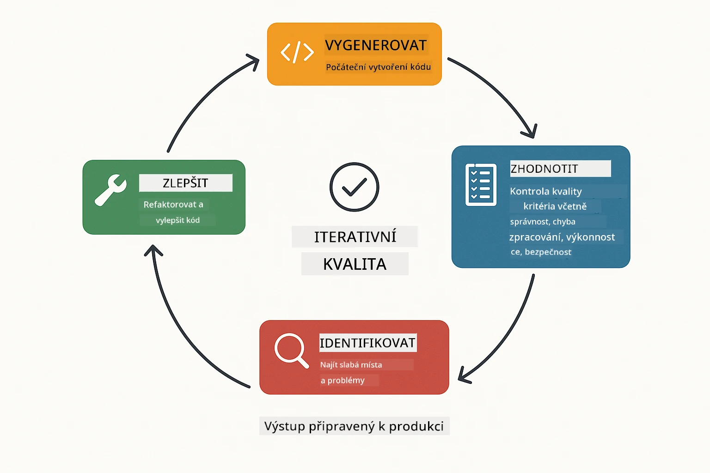
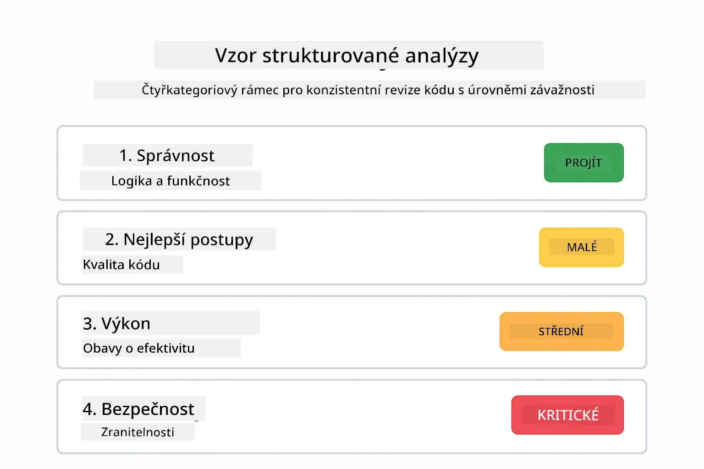
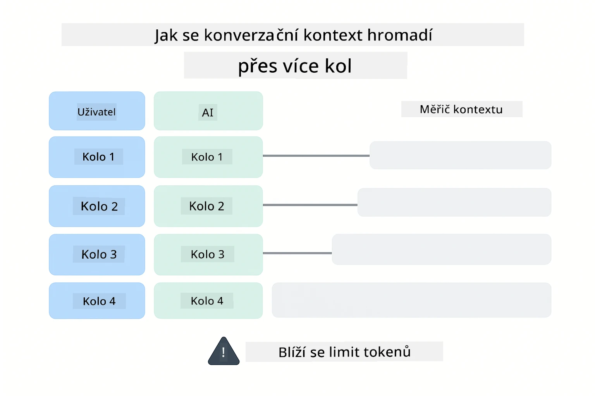
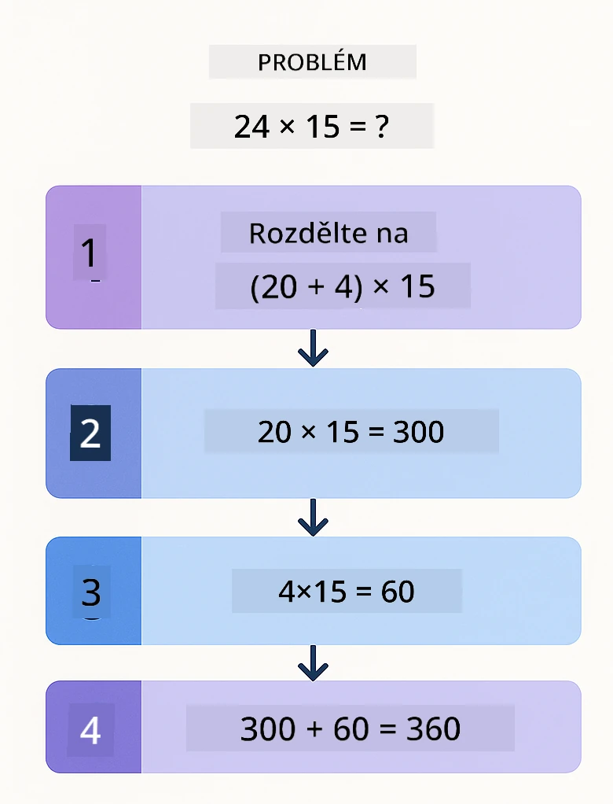
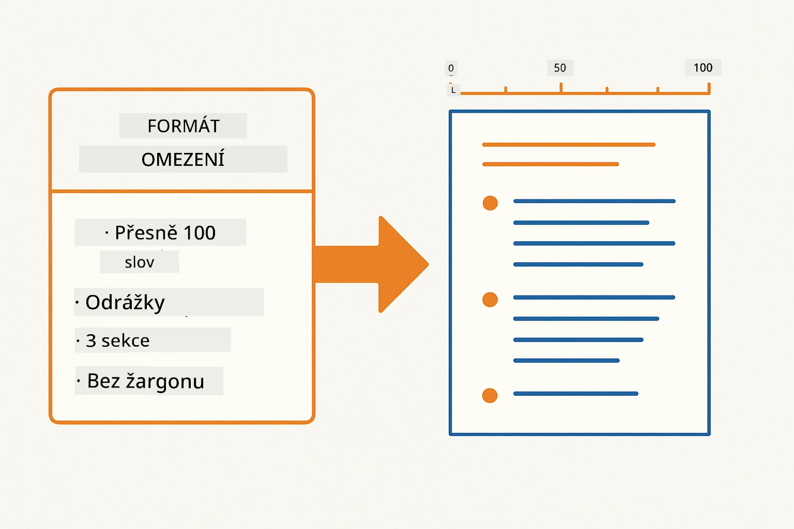
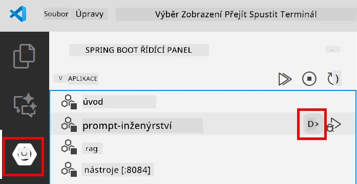
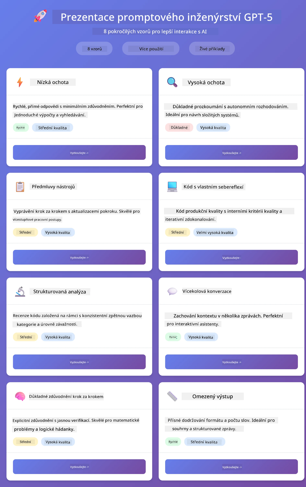
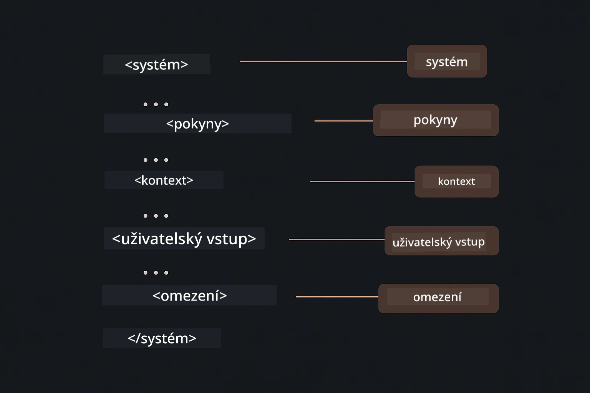

# Modul 02: Prompt engineering s GPT-5.2

## Obsah

- [Video průvodce](#video-průvodce)
- [Co se naučíte](#co-se-naučíte)
- [Požadavky](#požadavky)
- [Pochopení prompt engineeringu](#pochopení-prompt-engineeringu)
- [Základy prompt engineeringu](#základy-prompt-engineeringu)
  - [Zero-Shot Prompting](#zero-shot-prompting)
  - [Few-Shot Prompting](#few-shot-prompting)
  - [Chain of Thought](#chain-of-thought)
  - [Role-Based Prompting](#role-based-prompting)
  - [Promptové šablony](#promptové-šablony)
- [Pokročilé vzory](#pokročilé-vzory)
- [Spuštění aplikace](#spuštění-aplikace)
- [Snímky obrazovky aplikace](#snímky-aplikace)
- [Prozkoumání vzorů](#prozkoumání-vzorů)
  - [Nízká vs vysoká ochota](#nízká-vs-vysoká-ochota)
  - [Provedení úkolu (tool preambule)](#vykonávání-úkolu-preambuly-nástrojů)
  - [Sebereflexivní kód](#sebereflektující-kód)
  - [Strukturovaná analýza](#strukturovaná-analýza)
  - [Vícekolová konverzace](#vícekrokový-rozhovor)
  - [Krok za krokem uvažování](#krok-za-krokem-uvažování)
  - [Omezený výstup](#omezený-výstup)
- [Co se skutečně učíte](#co-se-skutečně-učíte)
- [Další kroky](#další-kroky)

## Video průvodce

Sledujte tuto živou relaci, která vysvětluje, jak začít s tímto modulem:

<a href="https://www.youtube.com/live/PJ6aBaE6bog?si=LDshyBrTRodP-wke"></a>

## Co se naučíte

Následující diagram poskytuje přehled klíčových témat a dovedností, které v tomto modulu získáte — od technik zdokonalování promptů až po krok za krokem pracovní postup, který budete následovat.


V předchozím modulu jste viděli, jak paměť umožňuje konverzační AI s Azure OpenAI. Nyní se zaměříme na to, jak pokládat otázky — tedy samotné prompty — s použitím Azure OpenAI GPT-5.2. Způsob, jak prompt strukturalizujete, dramaticky ovlivňuje kvalitu odpovědí, které získáte. Začneme přehledem základních technik promptování, poté přejdeme k osmi pokročilým vzorům, které plně využívají schopnosti GPT-5.2.

Použijeme GPT-5.2, protože zavádí kontrolu uvažování — můžete modelu říct, kolik uvažování má před odpovědí provést. To jinak přístupy k promptování výrazně odlišuje a pomáhá vám pochopit, kdy použít který způsob.

## Požadavky

- Dokončen Modul 01 (nasazení zdrojů Azure OpenAI)
- Soubor `.env` v kořenovém adresáři s přihlašovacími údaji Azure (vytvořený příkazem `azd up` v Modulu 01)

> **Poznámka:** Pokud jste Modul 01 nedokončili, nejprve postupujte podle pokynů k nasazení tam.

## Pochopení prompt engineeringu

V jádru je prompt engineering rozdíl mezi vágními a přesnými instrukcemi, jak ukazuje následující srovnání.


Prompt engineering znamená navrhování vstupního textu, který vám konzistentně přinese požadované výsledky. Nejde jen o pokládání otázek — jde o strukturování požadavků tak, aby model přesně pochopil, co chcete, a jak to má dodat.

Představte si to jako dávání instrukcí kolegovi. "Oprav chybu" je vágní. "Oprav nulový ukazatel výjimky v UserService.java řádek 45 přidáním kontroly na null" je konkrétní. Jazykové modely fungují stejně — specifita a struktura jsou důležité.

Níže je diagram, který ukazuje, jak LangChain4j sedí do tohoto obrazu — propojuje vzory promptů s modelem pomocí komponent SystemMessage a UserMessage.


LangChain4j poskytuje infrastrukturu — připojení k modelu, paměť a typy zpráv — zatímco vzory promptů jsou jen pečlivě strukturovaný text, který touto infrastrukturou posíláte. Klíčové stavební bloky jsou `SystemMessage` (který nastavuje chování a roli AI) a `UserMessage` (který nese váš skutečný požadavek).

## Základy prompt engineeringu

Pět základních technik níže tvoří základ efektivního prompt engineeringu. Každá řeší jiný aspekt, jak komunikovat s jazykovými modely.


Než se ponoříme do pokročilých vzorů v tomto modulu, připomeňme si pět základních technik promptování. Jsou to stavební kameny, které by měl znát každý prompt engineer.

### Zero-Shot Prompting

Nejjednodušší přístup: dejte modelu přímý příkaz bez příkladů. Model se spoléhá zcela na své tréninkové znalosti, aby úkol pochopil a vykonal. Funguje to dobře u přímočarých požadavků, kde je očekávané chování zřejmé.


*Přímá instrukce bez příkladů — model odvozuje úkol pouze z instrukce*

```java
String prompt = "Classify this sentiment: 'I absolutely loved the movie!'";
String response = model.chat(prompt);
// Odpověď: "Pozitivní"
```

**Kdy použít:** Jednoduché klasifikace, přímé otázky, překlady nebo jakýkoliv úkol, který model zvládá bez dalšího vedení.

### Few-Shot Prompting

Dejte příklady, které demonstrují vzor, podle kterého má model postupovat. Model se naučí očekávaný vstupně-výstupní formát z vašich příkladů a aplikuje ho na nové vstupy. To výrazně zlepšuje konzistenci u úkolů, kde požadovaný formát nebo chování není zřejmé.


*Učení z příkladů — model identifikuje vzor a aplikuje ho na nové vstupy*

```java
String prompt = """
    Classify the sentiment as positive, negative, or neutral.
    
    Examples:
    Text: "This product exceeded my expectations!" → Positive
    Text: "It's okay, nothing special." → Neutral
    Text: "Waste of money, very disappointed." → Negative
    
    Now classify this:
    Text: "Best purchase I've made all year!"
    """;
String response = model.chat(prompt);
```

**Kdy použít:** Vlastní klasifikace, konzistentní formátování, úkoly z konkrétních domén nebo když jsou výsledky zero-shot nekonzistentní.

### Chain of Thought

Požádejte model, aby ukázal své uvažování krok za krokem. Místo skoku rovnou k odpovědi rozebírá problém a postupně prochází každou část explicitně. To zlepšuje přesnost u matematických, logických a vícestupňových úloh.


*Krok za krokem uvažování — rozklad složitých problémů na explicitní logické kroky*

```java
String prompt = """
    Problem: A store has 15 apples. They sell 8 apples and then 
    receive a shipment of 12 more apples. How many apples do they have now?
    
    Let's solve this step-by-step:
    """;
String response = model.chat(prompt);
// Model ukazuje: 15 - 8 = 7, pak 7 + 12 = 19 jablek
```

**Kdy použít:** Matematické problémy, logické hádanky, ladění chyb nebo jakýkoliv úkol, kde zobrazení uvažovacího procesu zlepšuje přesnost a důvěru.

### Role-Based Prompting

Nastavte AI personu nebo roli předtím, než položíte otázku. To poskytuje kontext, který formuje tón, hloubku a zaměření odpovědi. „Softwarový architekt“ dá jiné rady než „junior programátor“ nebo „auditor bezpečnosti“.


*Nastavení kontextu a persony — stejná otázka dostane různou odpověď podle přiřazené role*

```java
String prompt = """
    You are an experienced software architect reviewing code.
    Provide a brief code review for this function:
    
    def calculate_total(items):
        total = 0
        for item in items:
            total = total + item['price']
        return total
    """;
String response = model.chat(prompt);
```

**Kdy použít:** Revize kódu, doučování, analýzy specifické domény nebo když potřebujete odpovědi přizpůsobené určité úrovni odbornosti nebo perspektivě.

### Promptové šablony

Vytvářejte znovupoužitelné prompty s proměnnými zástupnými znaky. Místo psaní nového promptu pokaždé definujte šablonu jednou a vyplňte různými hodnotami. Třída `PromptTemplate` z LangChain4j to usnadňuje syntaxí `{{variable}}`.


*Znovupoužitelné prompty s proměnnými zástupnými znaky — jedna šablona, mnoho použití*

```java
PromptTemplate template = PromptTemplate.from(
    "What's the best time to visit {{destination}} for {{activity}}?"
);

Prompt prompt = template.apply(Map.of(
    "destination", "Paris",
    "activity", "sightseeing"
));

String response = model.chat(prompt.text());
```

**Kdy použít:** Opakované dotazy s různými vstupy, hromadné zpracování, budování znovupoužitelných AI pracovních postupů nebo jakákoli situace, kde struktura promptu zůstává stejná, ale data se mění.

---

Těchto pět základů vám dá pevnou sadu nástrojů pro většinu promptovacích úkolů. Zbytek tohoto modulu na ně staví s **osmi pokročilými vzory**, které využívají řízení uvažování GPT-5.2, sebehodnocení a schopnosti strukturovaného výstupu.

## Pokročilé vzory

Po pokrytí základů přejděme k osmi pokročilým vzorům, které tento modul činí výjimečným. Ne všechny problémy vyžadují stejný přístup. Některé otázky potřebují rychlé odpovědi, jiné hluboké zamyšlení. Některé potřebují viditelné uvažování, jiné jen výsledky. Každý vzor níže je optimalizován pro jiný scénář — a řízení uvažování GPT-5.2 dělá rozdíly ještě zřetelnější.



*Přehled osmi vzorů prompt engineeringu a jejich použití*

GPT-5.2 přidává dalším rozměrem k těmto vzorům: *řízení uvažování*. Posuvník níže ukazuje, jak můžete upravit množství myšlení modelu — od rychlých, přímých odpovědí po hlubokou, důkladnou analýzu.


*Řízení uvažování GPT-5.2 vám umožňuje určit, kolik uvažování má model provést — od rychlých přímých odpovědí po hluboké zkoumání*

**Nízká ochota (rychlé a zaměřené)** - Pro jednoduché otázky, kde chcete rychlé, přímé odpovědi. Model provádí minimální uvažování - maximálně 2 kroky. Použijte pro výpočty, vyhledávání nebo přímočaré otázky.

```java
String prompt = """
    <context_gathering>
    - Search depth: very low
    - Bias strongly towards providing a correct answer as quickly as possible
    - Usually, this means an absolute maximum of 2 reasoning steps
    - If you think you need more time, state what you know and what's uncertain
    </context_gathering>
    
    Problem: What is 15% of 200?
    
    Provide your answer:
    """;

String response = chatModel.chat(prompt);
```

> 💡 **Prozkoumejte s GitHub Copilot:** Otevřete [`Gpt5PromptService.java`](../../../02-prompt-engineering/src/main/java/com/example/langchain4j/prompts/service/Gpt5PromptService.java) a zeptejte se:
> - "Jaký je rozdíl mezi nízkou a vysokou ochotou u vzorů promptování?"
> - "Jak XML tagy v promptech pomáhají strukturovat odpověď AI?"
> - "Kdy použít sebereflexivní vzory versus přímé instrukce?"

**Vysoká ochota (hluboké a důkladné)** - Pro složité problémy, kde chcete komplexní analýzu. Model zkoumá důkladně a ukazuje podrobné uvažování. Použijte pro návrhy systémů, architektonická rozhodnutí nebo složitý výzkum.

```java
String prompt = """
    Analyze this problem thoroughly and provide a comprehensive solution.
    Consider multiple approaches, trade-offs, and important details.
    Show your analysis and reasoning in your response.
    
    Problem: Design a caching strategy for a high-traffic REST API.
    """;

String response = chatModel.chat(prompt);
```

**Provedení úkolu (postup krok za krokem)** - Pro vícestupňové pracovní postupy. Model poskytne úvodní plán, průběžně vysvětluje každý krok a pak dá shrnutí. Použijte pro migrace, implementace nebo jakýkoliv vícestupňový proces.

```java
String prompt = """
    <task_execution>
    1. First, briefly restate the user's goal in a friendly way
    
    2. Create a step-by-step plan:
       - List all steps needed
       - Identify potential challenges
       - Outline success criteria
    
    3. Execute each step:
       - Narrate what you're doing
       - Show progress clearly
       - Handle any issues that arise
    
    4. Summarize:
       - What was completed
       - Any important notes
       - Next steps if applicable
    </task_execution>
    
    <tool_preambles>
    - Always begin by rephrasing the user's goal clearly
    - Outline your plan before executing
    - Narrate each step as you go
    - Finish with a distinct summary
    </tool_preambles>
    
    Task: Create a REST endpoint for user registration
    
    Begin execution:
    """;

String response = chatModel.chat(prompt);
```

Chain-of-Thought promptování explicitně žádá model, aby ukázal svůj uvažovací proces, což zvyšuje přesnost u složitých úloh. Postupné rozebrání pomáhá lidem i AI chápat logiku.

> **🤖 Vyzkoušejte s [GitHub Copilot](https://github.com/features/copilot) Chat:** Zeptejte se na tento vzor:
> - "Jak bych přizpůsobil vzor provedení úkolu pro dlouhodobé operace?"
> - "Jaké jsou nejlepší praktiky pro strukturování tool preambulí v produkčních aplikacích?"
> - "Jak zachytit a zobrazit průběžné aktualizace průběhu v uživatelském rozhraní?"

Níže je diagram, který ilustruje tento pracovní postup Plán → Provedení → Shrnutí.



*Pracovní postup Plán → Provedení → Shrnutí pro vícestupňové úkoly*

**Sebereflexivní kód** - Pro generování kódu kvality pro produkci. Model generuje kód podle produkčních standardů s řádným ošetřením chyb. Použijte při budování nových funkcí nebo služeb.

```java
String prompt = """
    Generate Java code with production-quality standards: Create an email validation service
    Keep it simple and include basic error handling.
    """;

String response = chatModel.chat(prompt);
```

Níže je diagram této iterativní smyčky zdokonalování — generuj, vyhodnoť, identifikuj slabiny a zdokonaluj, dokud kód nesplní produkční požadavky.



*Iterativní smyčka zdokonalování - generuj, vyhodnoť, identifikuj problémy, zlepšuj, opakuj*

**Strukturovaná analýza** - Pro konzistentní hodnocení. Model přezkoumá kód podle pevného rámce (správnost, praktiky, výkon, bezpečnost, udržovatelnost). Použijte při revizích kódu nebo hodnocení kvality.

```java
String prompt = """
    <analysis_framework>
    You are an expert code reviewer. Analyze the code for:
    
    1. Correctness
       - Does it work as intended?
       - Are there logical errors?
    
    2. Best Practices
       - Follows language conventions?
       - Appropriate design patterns?
    
    3. Performance
       - Any inefficiencies?
       - Scalability concerns?
    
    4. Security
       - Potential vulnerabilities?
       - Input validation?
    
    5. Maintainability
       - Code clarity?
       - Documentation?
    
    <output_format>
    Provide your analysis in this structure:
    - Summary: One-sentence overall assessment
    - Strengths: 2-3 positive points
    - Issues: List any problems found with severity (High/Medium/Low)
    - Recommendations: Specific improvements
    </output_format>
    </analysis_framework>
    
    Code to analyze:
    ```
    public List getUsers() {
        return database.query("SELECT * FROM users");
    }
    ```
    Provide your structured analysis:
    """;

String response = chatModel.chat(prompt);
```

> **🤖 Vyzkoušejte s [GitHub Copilot](https://github.com/features/copilot) Chat:** Zeptejte se na strukturovanou analýzu:
> - "Jak přizpůsobit rámec analýzy pro různé typy revizí kódu?"
> - "Jak nejlépe zpracovat a programově reagovat na strukturovaný výstup?"
> - "Jak zajistit konzistentní úrovně závažnosti napříč různými revizními sezeními?"

Následující diagram ukazuje, jak tento strukturovaný rámec organizuje revizi kódu do konzistentních kategorií se závažnostmi.



*Rámec pro konzistentní revize kódu se závažnostmi*

**Vícekolová konverzace** - Pro konverzace, které potřebují kontext. Model si pamatuje předchozí zprávy a staví na nich. Použijte pro interaktivní podpůrné relace nebo složité otázky a odpovědi.

```java
ChatMemory memory = MessageWindowChatMemory.withMaxMessages(10);

memory.add(UserMessage.from("What is Spring Boot?"));
AiMessage aiMessage1 = chatModel.chat(memory.messages()).aiMessage();
memory.add(aiMessage1);

memory.add(UserMessage.from("Show me an example"));
AiMessage aiMessage2 = chatModel.chat(memory.messages()).aiMessage();
memory.add(aiMessage2);
```

Níže vizualizace ukazuje, jak se konverzační kontext hromadí s každým kolem a jak to souvisí s limitem tokenů modelu.



*Jak se konverzační kontext hromadí během více kol až do dosažení limitu tokenů*

**Krok za krokem uvažování** - Pro problémy vyžadující viditelnou logiku. Model zobrazuje explicitní uvažování pro každý krok. Použijte pro matematické problémy, logické hádanky nebo kdy potřebujete pochopit myšlenkový proces.

```java
String prompt = """
    <instruction>Show your reasoning step-by-step</instruction>
    
    If a train travels 120 km in 2 hours, then stops for 30 minutes,
    then travels another 90 km in 1.5 hours, what is the average speed
    for the entire journey including the stop?
    """;

String response = chatModel.chat(prompt);
```

Níže je diagram, který ilustruje, jak model rozděluje problémy na explicitní, číslované logické kroky.


*Rozklad problémů na explicitní logické kroky*

**Omezený výstup** - Pro odpovědi s konkrétními požadavky na formát. Model přesně dodržuje pravidla formátu a délky. Použijte to pro souhrny nebo když potřebujete přesnou strukturu výstupu.

```java
String prompt = """
    <constraints>
    - Exactly 100 words
    - Bullet point format
    - Technical terms only
    </constraints>
    
    Summarize the key concepts of machine learning.
    """;

String response = chatModel.chat(prompt);
```

Následující diagram ukazuje, jak omezení vedou model k produkci výstupu, který přesně vyhovuje vašim požadavkům na formát a délku.



*Vynucení specifických požadavků na formát, délku a strukturu*

## Spuštění aplikace

**Ověření nasazení:**

Ujistěte se, že soubor `.env` existuje v kořenovém adresáři a obsahuje Azure přihlašovací údaje (vytvořené během modulu 01). Spusťte to z adresáře modulu (`02-prompt-engineering/`):

**Bash:**
```bash
cat ../.env  # Mělo by zobrazit AZURE_OPENAI_ENDPOINT, API_KEY, DEPLOYMENT
```

**PowerShell:**
```powershell
Get-Content ..\.env  # Mělo by zobrazovat AZURE_OPENAI_ENDPOINT, API_KEY, DEPLOYMENT
```

**Spuštění aplikace:**

> **Poznámka:** Pokud jste již spustili všechny aplikace pomocí `./start-all.sh` z kořenového adresáře (jak je popsáno v modulu 01), tento modul již běží na portu 8083. Můžete tedy přeskočit níže uvedené spouštěcí příkazy a přejít přímo na http://localhost:8083.

**Možnost 1: Použití Spring Boot Dashboard (doporučeno pro uživatele VS Code)**

Vývojový kontejner obsahuje rozšíření Spring Boot Dashboard, které poskytuje vizuální rozhraní pro správu všech Spring Boot aplikací. Najdete ho v panelu aktivit vlevo ve VS Code (hledejte ikonu Spring Boot).

Ze Spring Boot Dashboard můžete:
- Vidět všechny dostupné Spring Boot aplikace v pracovní ploše
- Jedním kliknutím spustit/zastavit aplikace
- Sledovat logy aplikace v reálném čase
- Monitorovat stav aplikace

Jednoduše klikněte na tlačítko „play“ vedle „prompt-engineering“ pro spuštění tohoto modulu, nebo spusťte všechny moduly současně.



*Spring Boot Dashboard ve VS Code — spuštění, zastavení a sledování všech modulů na jednom místě*

**Možnost 2: Použití shell skriptů**

Spusťte všechny webové aplikace (moduly 01–04):

**Bash:**
```bash
cd ..  # Z kořenového adresáře
./start-all.sh
```

**PowerShell:**
```powershell
cd ..  # Ze základního adresáře
.\start-all.ps1
```

Nebo spusťte jen tento modul:

**Bash:**
```bash
cd 02-prompt-engineering
./start.sh
```

**PowerShell:**
```powershell
cd 02-prompt-engineering
.\start.ps1
```

Oba skripty automaticky načítají proměnné prostředí ze souboru `.env` v kořenovém adresáři a postaví JARy, pokud neexistují.

> **Poznámka:** Pokud dáváte přednost manuálnímu sestavení všech modulů před spuštěním:
>
> **Bash:**
> ```bash
> cd ..  # Go to root directory
> mvn clean package -DskipTests
> ```
>
> **PowerShell:**
> ```powershell
> cd ..  # Go to root directory
> mvn clean package -DskipTests
> ```

Otevřete http://localhost:8083 ve svém prohlížeči.

**Pro zastavení:**

**Bash:**
```bash
./stop.sh  # Pouze tento modul
# Nebo
cd .. && ./stop-all.sh  # Všechny moduly
```

**PowerShell:**
```powershell
.\stop.ps1  # Pouze tento modul
# Nebo
cd ..; .\stop-all.ps1  # Všechny moduly
```

## Snímky aplikace

Zde je hlavní rozhraní modulu pro prompt engineering, kde můžete experimentovat se všemi osmi vzory vedle sebe.



*Hlavní panel zobrazuje všech 8 vzorů prompt engineeringu s jejich charakteristikami a použitím*

## Prozkoumání vzorů

Webové rozhraní umožňuje experimentovat s různými strategiemi zadávání. Každý vzor řeší jiné problémy – vyzkoušejte je a zjistěte, kdy který přístup exceluje.

> **Poznámka: Streamování vs Nestreamování** — Každá stránka vzoru nabízí dvě tlačítka: **🔴 Stream Response (Live)** a možnost **Nestreamování**. Streamování používá Server-Sent Events (SSE), aby zobrazilo tokeny v reálném čase, jak je model generuje, takže okamžitě vidíte postup. Nestreamovaná volba čeká na celou odpověď, než ji zobrazí. U promptů, které vyvolávají hluboké uvažování (např. High Eagerness, Self-Reflecting Code), může nestreamované volání trvat velmi dlouho – někdy minuty – bez viditelné zpětné vazby. **Při experimentování s komplexními prompty používejte streamování**, abyste viděli, jak model pracuje, a předešli dojmu, že požadavek vypršel.
>
> **Poznámka: Požadavky na prohlížeč** — Funkce streamování používá Fetch Streams API (`response.body.getReader()`), které vyžaduje plnohodnotný prohlížeč (Chrome, Edge, Firefox, Safari). Nepracuje v integrovaném Simple Browseru VS Code, protože jeho webview nepodporuje API ReadableStream. Pokud používáte Simple Browser, nestreamovaná tlačítka fungují normálně – pouze streamovaná tlačítka jsou ovlivněna. Pro plný zážitek otevřete `http://localhost:8083` v externím prohlížeči.

### Nízká vs vysoká ochota

Zeptejte se jednoduché otázky jako „Co je 15 % ze 200?“ s nízkou ochotou. Dostanete okamžitou, přímočaře danou odpověď. Teď položte něco složitého, například „Navrhni caching strategii pro vysoce zatížené API“ s vysokou ochotou. Klikněte na **🔴 Stream Response (Live)** a sledujte, jak se modelovo podrobné uvažování objevuje token po tokenu. Stejný model, stejná struktura otázky – ale prompt mu říká, kolik má přemýšlet.

### Vykonávání úkolu (preambuly nástrojů)

Vícekrokové pracovní postupy těží z předběžného plánování a popisu průběhu. Model popíše, co udělá, komentuje každý krok a nakonec shrne výsledky.

### Sebereflektující kód

Vyzkoušejte „Vytvoř službu pro validaci e-mailů“. Místo toho, aby jen vytvořil kód a skončil, model generuje, hodnotí vůči kvalitativním kritériím, identifikuje slabiny a zlepšuje ho. Uvidíte ho iterovat, dokud kód nesplní produkční standardy.

### Strukturovaná analýza

Kontroly kódu vyžadují konzistentní hodnoticí rámce. Model analyzuje kód podle pevně daných kategorií (správnost, postupy, výkon, bezpečnost) s úrovněmi závažnosti.

### Vícekrokový rozhovor

Zeptejte se „Co je Spring Boot?“ a hned potom „Ukaž mi příklad“. Model si pamatuje první otázku a poskytne vám konkrétní příklad spring bootu. Bez paměti by druhá otázka byla příliš vágní.

### Krok za krokem uvažování

Vyberte si matematický problém a vyzkoušejte ho s krokovým uvažováním i s nízkou ochotou. Nízká ochota vám dá jen odpověď – rychle, ale nejasně. Krok za krokem ukazuje každý výpočet a rozhodnutí.

### Omezený výstup

Když potřebujete specifické formáty nebo délku textu, tento vzor vynucuje přísné dodržení. Zkuste vytvořit souhrn přesně o 100 slovech v bodech.

## Co se skutečně učíte

**Úsilí o uvažování mění všechno**

GPT-5.2 vám umožňuje ovládat výpočetní úsilí skrze vaše prompty. Nízké úsilí znamená rychlé odpovědi s minimálním zkoumáním. Vysoké úsilí znamená, že model si dává načas a hluboce přemýšlí. Učíte se přizpůsobovat úsilí složitosti úkolu – neztrácejte čas s jednoduchými otázkami, ale ani nespěchejte u složitých rozhodnutí.

**Struktura vede chování**

Všimli jste si XML tagů v prompty? Nejsou jen dekorativní. Modely spolehlivěji dodržují strukturované instrukce než volný text. Když potřebujete vícekrokové procesy nebo složitou logiku, struktura pomáhá modelu sledovat, kde je a co přijde dál. Níže uvedený diagram rozebírá dobře strukturovaný prompt a ukazuje, jak tagy jako `<system>`, `<instructions>`, `<context>`, `<user-input>` a `<constraints>` organizují vaše pokyny do přehledných sekcí.



*Anatomie dobře strukturovaného promptu s jasnými sekcemi a organizací ve stylu XML*

**Kvalita prostřednictvím sebehodnocení**

Sebereflektující vzory fungují tak, že zpřesňují kritéria kvality. Místo doufání, že model „to udělá správně“, mu přesně říkáte, co znamená „správně“: správná logika, ošetření chyb, výkon, bezpečnost. Model pak může vlastní výstup vyhodnotit a vylepšit. To proměňuje generování kódu z loterie na proces.

**Kontext je omezený**

Vícekolové konverzace fungují tak, že ke každému požadavku přikládají historii zpráv. Ale je tu limit – každý model má maximální počet tokenů. Jak konverzace roste, budete potřebovat strategie, jak udržet relevantní kontext, aniž byste ho překročili. Tento modul vám ukáže, jak paměť funguje; později se naučíte, kdy shrnovat, kdy zapomínat a kdy znovu získávat.

## Další kroky

**Další modul:** [03-rag - RAG (Retrieval-Augmented Generation)](../03-rag/README.md)

---

**Navigace:** [← Předchozí: Modul 01 - Úvod](../01-introduction/README.md) | [Zpět na hlavní](../README.md) | [Další: Modul 03 - RAG →](../03-rag/README.md)

---

<!-- CO-OP TRANSLATOR DISCLAIMER START -->
**Prohlášení o omezení odpovědnosti**:
Tento dokument byl přeložen pomocí AI překladatelské služby [Co-op Translator](https://github.com/Azure/co-op-translator). Přestože usilujeme o co největší přesnost, mějte prosím na paměti, že automatizované překlady mohou obsahovat chyby nebo nepřesnosti. Originální dokument v jeho mateřském jazyce by měl být považován za autoritativní zdroj. Pro kritické informace se doporučuje profesionální lidský překlad. Nejsme odpovědní za jakékoli nedorozumění nebo nesprávné interpretace vzniklé použitím tohoto překladu.
<!-- CO-OP TRANSLATOR DISCLAIMER END -->