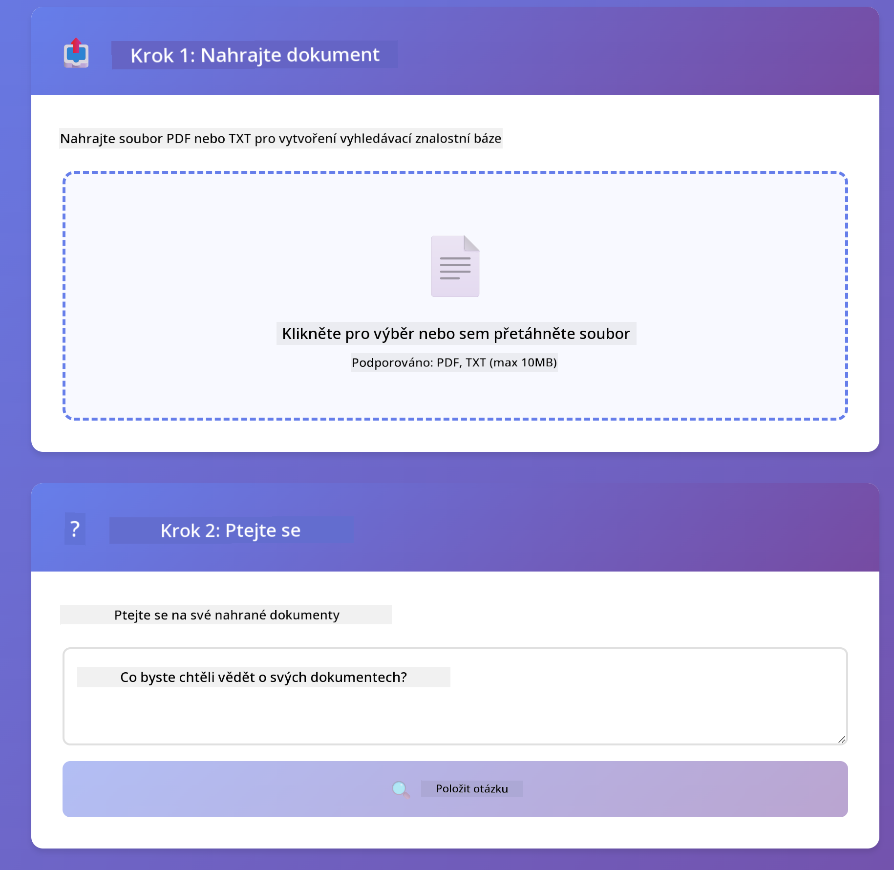

<!--
CO_OP_TRANSLATOR_METADATA:
{
  "original_hash": "f538a51cfd13147d40d84e936a0f485c",
  "translation_date": "2025-12-13T17:14:11+00:00",
  "source_file": "03-rag/README.md",
  "language_code": "cs"
}
-->
# Modul 03: RAG (Retrieval-Augmented Generation)

## Obsah

- [Co se naučíte](../../../03-rag)
- [Požadavky](../../../03-rag)
- [Pochopení RAG](../../../03-rag)
- [Jak to funguje](../../../03-rag)
  - [Zpracování dokumentů](../../../03-rag)
  - [Vytváření embeddingů](../../../03-rag)
  - [Sémantické vyhledávání](../../../03-rag)
  - [Generování odpovědí](../../../03-rag)
- [Spuštění aplikace](../../../03-rag)
- [Používání aplikace](../../../03-rag)
  - [Nahrání dokumentu](../../../03-rag)
  - [Pokládání otázek](../../../03-rag)
  - [Kontrola zdrojových odkazů](../../../03-rag)
  - [Experimentování s otázkami](../../../03-rag)
- [Klíčové koncepty](../../../03-rag)
  - [Strategie dělení na části](../../../03-rag)
  - [Skóre podobnosti](../../../03-rag)
  - [Ukládání v paměti](../../../03-rag)
  - [Správa kontextového okna](../../../03-rag)
- [Kdy je RAG důležité](../../../03-rag)
- [Další kroky](../../../03-rag)

## Co se naučíte

V předchozích modulech jste se naučili, jak vést konverzace s AI a efektivně strukturovat své prompt. Ale existuje základní omezení: jazykové modely vědí jen to, co se naučily během tréninku. Nemohou odpovídat na otázky týkající se politik vaší firmy, dokumentace vašich projektů nebo jakýchkoli informací, na které nebyly trénovány.

RAG (Retrieval-Augmented Generation) tento problém řeší. Místo toho, abyste model učili vaše informace (což je drahé a nepraktické), dáváte mu možnost prohledávat vaše dokumenty. Když někdo položí otázku, systém najde relevantní informace a zahrne je do promptu. Model pak odpovídá na základě tohoto získaného kontextu.

Představte si RAG jako poskytnutí referenční knihovny modelu. Když položíte otázku, systém:

1. **Uživatelský dotaz** - Položíte otázku
2. **Embedding** - Převádí vaši otázku na vektor
3. **Vektorové vyhledávání** - Najde podobné části dokumentu
4. **Sestavení kontextu** - Přidá relevantní části do promptu
5. **Odpověď** - LLM generuje odpověď na základě kontextu

Tímto způsobem jsou odpovědi modelu založené na vašich skutečných datech místo spoléhání se na znalosti z tréninku nebo vymýšlení odpovědí.


*Průběh RAG - od uživatelského dotazu přes sémantické vyhledávání až po generování odpovědi s kontextem*

## Požadavky

- Dokončený Modul 01 (nasazeny Azure OpenAI zdroje)
- Soubor `.env` v kořenovém adresáři s Azure přihlašovacími údaji (vytvořený pomocí `azd up` v Modulu 01)

> **Poznámka:** Pokud jste Modul 01 nedokončili, nejprve postupujte podle tamních pokynů k nasazení.

## Jak to funguje

**Zpracování dokumentů** - [DocumentService.java](../../../03-rag/src/main/java/com/example/langchain4j/rag/service/DocumentService.java)

Když nahrajete dokument, systém jej rozdělí na části – menší úseky, které pohodlně zapadnou do kontextového okna modelu. Tyto části se mírně překrývají, aby nedošlo ke ztrátě kontextu na hranicích.

```java
Document document = FileSystemDocumentLoader.loadDocument("sample-document.txt");

DocumentSplitter splitter = DocumentSplitters
    .recursive(300, 30, new OpenAiTokenizer());

List<TextSegment> segments = splitter.split(document);
```

> **🤖 Vyzkoušejte s [GitHub Copilot](https://github.com/features/copilot) Chat:** Otevřete [`DocumentService.java`](../../../03-rag/src/main/java/com/example/langchain4j/rag/service/DocumentService.java) a zeptejte se:
> - "Jak LangChain4j rozděluje dokumenty na části a proč je překrytí důležité?"
> - "Jaká je optimální velikost části pro různé typy dokumentů a proč?"
> - "Jak řešit dokumenty v několika jazycích nebo se speciálním formátováním?"

**Vytváření embeddingů** - [LangChainRagConfig.java](../../../03-rag/src/main/java/com/example/langchain4j/rag/config/LangChainRagConfig.java)

Každá část je převedena na číselnou reprezentaci zvanou embedding – v podstatě matematický otisk, který zachycuje význam textu. Podobné texty produkují podobné embeddingy.

```java
@Bean
public EmbeddingModel embeddingModel() {
    return OpenAiOfficialEmbeddingModel.builder()
        .baseUrl(azureOpenAiEndpoint)
        .apiKey(azureOpenAiKey)
        .modelName(azureEmbeddingDeploymentName)
        .build();
}

EmbeddingStore<TextSegment> embeddingStore = 
    new InMemoryEmbeddingStore<>();
```


*Dokumenty reprezentované jako vektory v embeddingovém prostoru – podobný obsah se shlukuje*

**Sémantické vyhledávání** - [RagService.java](../../../03-rag/src/main/java/com/example/langchain4j/rag/service/RagService.java)

Když položíte otázku, i ona se převede na embedding. Systém porovná embedding vaší otázky se všemi embeddingy částí dokumentů. Najde části s nejpodobnějším významem – nejen podle klíčových slov, ale skutečnou sémantickou podobnost.

```java
Embedding queryEmbedding = embeddingModel.embed(question).content();

List<EmbeddingMatch<TextSegment>> matches = 
    embeddingStore.findRelevant(queryEmbedding, 5, 0.7);

for (EmbeddingMatch<TextSegment> match : matches) {
    String relevantText = match.embedded().text();
    double score = match.score();
}
```

> **🤖 Vyzkoušejte s [GitHub Copilot](https://github.com/features/copilot) Chat:** Otevřete [`RagService.java`](../../../03-rag/src/main/java/com/example/langchain4j/rag/service/RagService.java) a zeptejte se:
> - "Jak funguje vyhledávání podobnosti s embeddingy a co určuje skóre?"
> - "Jaký práh podobnosti bych měl použít a jak ovlivňuje výsledky?"
> - "Jak řešit situace, kdy nejsou nalezeny žádné relevantní dokumenty?"

**Generování odpovědí** - [RagService.java](../../../03-rag/src/main/java/com/example/langchain4j/rag/service/RagService.java)

Nejrelevantnější části jsou zahrnuty do promptu pro model. Model si přečte tyto konkrétní části a odpoví na vaši otázku na základě těchto informací. Tím se zabrání halucinacím – model může odpovídat pouze z toho, co má před sebou.

## Spuštění aplikace

**Ověření nasazení:**

Ujistěte se, že soubor `.env` existuje v kořenovém adresáři s Azure přihlašovacími údaji (vytvořený během Modulu 01):
```bash
cat ../.env  # Mělo by zobrazit AZURE_OPENAI_ENDPOINT, API_KEY, DEPLOYMENT
```

**Spuštění aplikace:**

> **Poznámka:** Pokud jste již spustili všechny aplikace pomocí `./start-all.sh` z Modulu 01, tento modul již běží na portu 8081. Můžete přeskočit níže uvedené příkazy a jít přímo na http://localhost:8081.

**Možnost 1: Použití Spring Boot Dashboard (doporučeno pro uživatele VS Code)**

Vývojový kontejner obsahuje rozšíření Spring Boot Dashboard, které poskytuje vizuální rozhraní pro správu všech Spring Boot aplikací. Najdete jej v Activity Bar na levé straně VS Code (ikona Spring Boot).

Ze Spring Boot Dashboard můžete:
- Vidět všechny dostupné Spring Boot aplikace v pracovním prostoru
- Spouštět/zastavovat aplikace jedním kliknutím
- Zobrazovat logy aplikací v reálném čase
- Monitorovat stav aplikací

Stačí kliknout na tlačítko přehrávání vedle "rag" pro spuštění tohoto modulu, nebo spustit všechny moduly najednou.


**Možnost 2: Použití shell skriptů**

Spusťte všechny webové aplikace (moduly 01-04):

**Bash:**
```bash
cd ..  # Z kořenového adresáře
./start-all.sh
```

**PowerShell:**
```powershell
cd ..  # Z kořenového adresáře
.\start-all.ps1
```

Nebo spusťte jen tento modul:

**Bash:**
```bash
cd 03-rag
./start.sh
```

**PowerShell:**
```powershell
cd 03-rag
.\start.ps1
```

Oba skripty automaticky načtou proměnné prostředí ze souboru `.env` v kořenovém adresáři a pokud JAR soubory neexistují, sestaví je.

> **Poznámka:** Pokud chcete všechny moduly sestavit ručně před spuštěním:
>
> **Bash:**
> ```bash
> cd ..  # Go to root directory
> mvn clean package -DskipTests
> ```
>
> **PowerShell:**
> ```powershell
> cd ..  # Go to root directory
> mvn clean package -DskipTests
> ```

Otevřete v prohlížeči http://localhost:8081.

**Pro zastavení:**

**Bash:**
```bash
./stop.sh  # Pouze tento modul
# Nebo
cd .. && ./stop-all.sh  # Všechny moduly
```

**PowerShell:**
```powershell
.\stop.ps1  # Pouze tento modul
# Nebo
cd ..; .\stop-all.ps1  # Všechny moduly
```

## Používání aplikace

Aplikace poskytuje webové rozhraní pro nahrávání dokumentů a kladení otázek.

<a href="images/rag-homepage.png"></a>

*Rozhraní aplikace RAG – nahrávejte dokumenty a pokládejte otázky*

**Nahrání dokumentu**

Začněte nahráním dokumentu – pro testování nejlépe fungují TXT soubory. V tomto adresáři je k dispozici `sample-document.txt`, který obsahuje informace o funkcích LangChain4j, implementaci RAG a osvědčené postupy – ideální pro testování systému.

Systém váš dokument zpracuje, rozdělí na části a vytvoří embeddingy pro každou část. To probíhá automaticky při nahrání.

**Pokládání otázek**

Nyní položte konkrétní otázky týkající se obsahu dokumentu. Zkuste něco faktického, co je v dokumentu jasně uvedeno. Systém vyhledá relevantní části, zahrne je do promptu a vygeneruje odpověď.

**Kontrola zdrojových odkazů**

Všimněte si, že každá odpověď obsahuje odkazy na zdroje se skóre podobnosti. Toto skóre (od 0 do 1) ukazuje, jak relevantní byla každá část k vaší otázce. Vyšší skóre znamená lepší shodu. To vám umožní ověřit odpověď podle zdrojového materiálu.

<a href="images/rag-query-results.png"></a>

*Výsledky dotazu zobrazující odpověď se zdrojovými odkazy a skóre relevance*

**Experimentování s otázkami**

Vyzkoušejte různé typy otázek:
- Konkrétní fakta: "Jaké je hlavní téma?"
- Porovnání: "Jaký je rozdíl mezi X a Y?"
- Shrnutí: "Shrňte klíčové body o Z"

Sledujte, jak se skóre relevance mění podle toho, jak dobře vaše otázka odpovídá obsahu dokumentu.

## Klíčové koncepty

**Strategie dělení na části**

Dokumenty jsou rozděleny na části o 300 tokenech s překrytím 30 tokenů. Tento kompromis zajišťuje, že každá část má dostatek kontextu, aby byla smysluplná, a zároveň je dostatečně malá, aby bylo možné do promptu zahrnout více částí.

**Skóre podobnosti**

Skóre se pohybují od 0 do 1:
- 0,7-1,0: Vysoce relevantní, přesná shoda
- 0,5-0,7: Relevantní, dobrý kontext
- Pod 0,5: Filtrováno, příliš odlišné

Systém načítá pouze části nad minimálním prahem, aby zajistil kvalitu.

**Ukládání v paměti**

Tento modul používá pro jednoduchost ukládání v paměti. Po restartu aplikace jsou nahrané dokumenty ztraceny. Produkční systémy používají perzistentní vektorové databáze jako Qdrant nebo Azure AI Search.

**Správa kontextového okna**

Každý model má maximální velikost kontextového okna. Nelze zahrnout všechny části z velkého dokumentu. Systém načítá top N nejrelevantnějších částí (výchozí 5), aby zůstal v limitech a zároveň poskytl dostatek kontextu pro přesné odpovědi.

## Kdy je RAG důležité

**Použijte RAG, když:**
- Odpovídáte na otázky týkající se proprietárních dokumentů
- Informace se často mění (politiky, ceny, specifikace)
- Přesnost vyžaduje uvedení zdroje
- Obsah je příliš velký na zahrnutí do jednoho promptu
- Potřebujete ověřitelné, podložené odpovědi

**Nepoužívejte RAG, když:**
- Otázky vyžadují obecné znalosti, které model již má
- Potřebujete data v reálném čase (RAG pracuje s nahranými dokumenty)
- Obsah je dostatečně malý na přímé zahrnutí do promptu

## Další kroky

**Další modul:** [04-tools - AI Agents with Tools](../04-tools/README.md)

---

**Navigace:** [← Předchozí: Modul 02 - Prompt Engineering](../02-prompt-engineering/README.md) | [Zpět na hlavní stránku](../README.md) | [Další: Modul 04 - Tools →](../04-tools/README.md)

---

<!-- CO-OP TRANSLATOR DISCLAIMER START -->
**Prohlášení o vyloučení odpovědnosti**:  
Tento dokument byl přeložen pomocí AI překladatelské služby [Co-op Translator](https://github.com/Azure/co-op-translator). Přestože usilujeme o přesnost, mějte prosím na paměti, že automatické překlady mohou obsahovat chyby nebo nepřesnosti. Původní dokument v jeho mateřském jazyce by měl být považován za autoritativní zdroj. Pro důležité informace se doporučuje profesionální lidský překlad. Nejsme odpovědní za jakékoliv nedorozumění nebo nesprávné výklady vyplývající z použití tohoto překladu.
<!-- CO-OP TRANSLATOR DISCLAIMER END -->