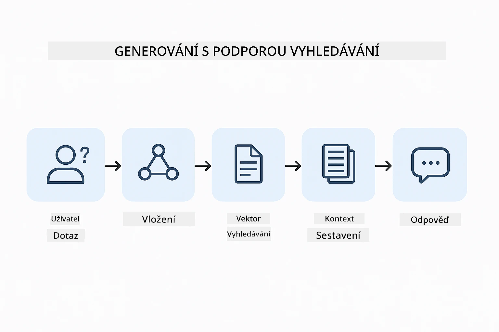
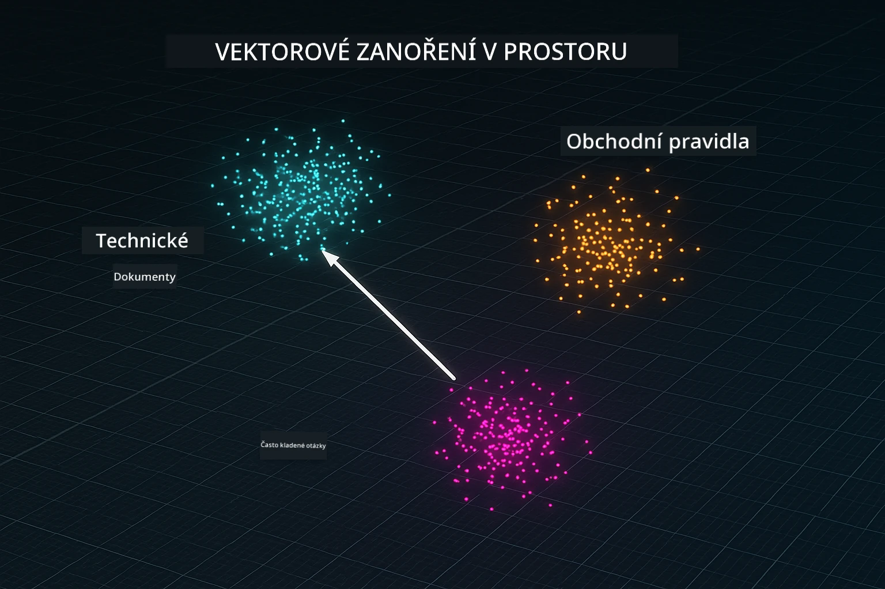
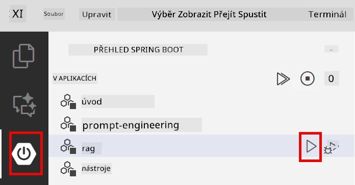
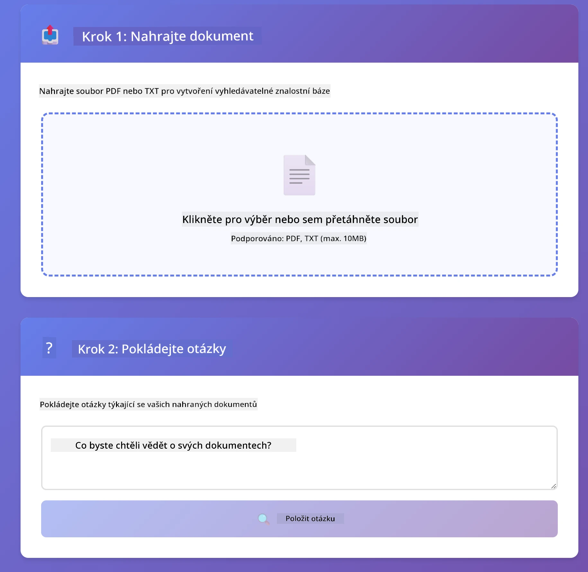
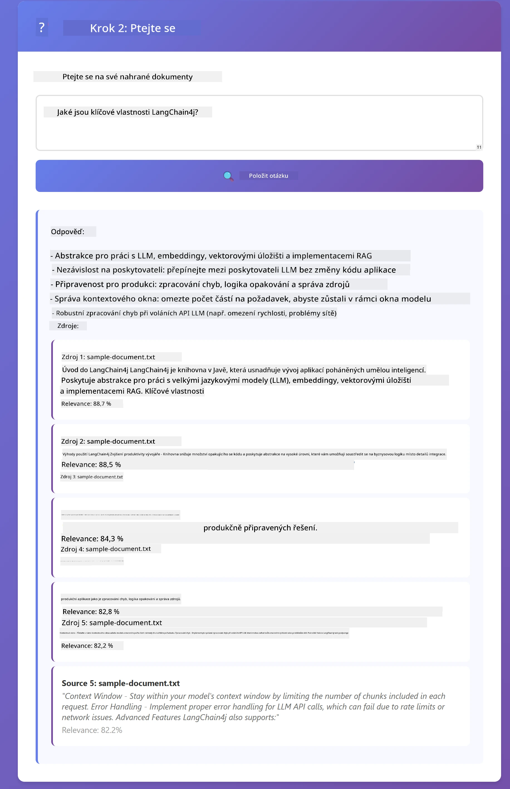

<!--
CO_OP_TRANSLATOR_METADATA:
{
  "original_hash": "81d087662fb3dd7b7124bce1a9c9ec86",
  "translation_date": "2026-01-06T00:50:45+00:00",
  "source_file": "03-rag/README.md",
  "language_code": "cs"
}
-->
# Modul 03: RAG (Retrieval-Augmented Generation)

## Obsah

- [Co se naučíte](../../../03-rag)
- [Předpoklady](../../../03-rag)
- [Pochopení RAG](../../../03-rag)
- [Jak to funguje](../../../03-rag)
  - [Zpracování dokumentů](../../../03-rag)
  - [Vytváření embeddingů](../../../03-rag)
  - [Sémantické vyhledávání](../../../03-rag)
  - [Generování odpovědí](../../../03-rag)
- [Spuštění aplikace](../../../03-rag)
- [Používání aplikace](../../../03-rag)
  - [Nahrání dokumentu](../../../03-rag)
  - [Pokládání otázek](../../../03-rag)
  - [Kontrola zdrojových odkazů](../../../03-rag)
  - [Experimentování s otázkami](../../../03-rag)
- [Klíčové koncepty](../../../03-rag)
  - [Strategie dělení na části](../../../03-rag)
  - [Skóre podobnosti](../../../03-rag)
  - [Ukládání v paměti](../../../03-rag)
  - [Správa kontextového okna](../../../03-rag)
- [Kdy je RAG důležitý](../../../03-rag)
- [Další kroky](../../../03-rag)

## Co se naučíte

V předchozích modulech jste se naučili vést konverzace s AI a efektivně strukturovat své příkazy. Ale existuje základní omezení: jazykové modely vědí pouze to, co se naučily během tréninku. Nemohou odpovídat na otázky týkající se politik vaší společnosti, dokumentace vašich projektů nebo jakýchkoli informací, na kterých nebyly trénovány.

RAG (Retrieval-Augmented Generation) tento problém řeší. Místo toho, abyste se model snažili naučit vaše informace (což je nákladné a nepraktické), dáváte mu možnost vyhledávat ve vašich dokumentech. Když někdo položí otázku, systém najde relevantní informace a zahrne je do promptu. Model poté odpovídá na základě tohoto načteného kontextu.

Představte si RAG jako poskytnutí referenční knihovny modelu. Když položíte otázku, systém:

1. **Dotaz uživatele** – položíte otázku  
2. **Embedding** – převede vaši otázku na vektor  
3. **Vektorové vyhledávání** – najde podobné části dokumentu  
4. **Sestavení kontextu** – přidá relevantní části do promptu  
5. **Odpověď** – LLM generuje odpověď na základě kontextu

To zakládá odpovědi modelu na vašich skutečných datech místo spoléhání se na znalosti z tréninku nebo vymýšlení odpovědí.



*Průběh RAG - od dotazu uživatele přes sémantické vyhledávání k generování kontextové odpovědi*

## Předpoklady

- Dokončený Modul 01 (nasazeny Azure OpenAI zdroje)  
- `.env` soubor v kořenovém adresáři s Azure přihlašovacími údaji (vytvořeno `azd up` v Modulu 01)  

> **Poznámka:** Pokud jste Modul 01 nedokončili, postupujte nejdříve podle tamních instrukcí pro nasazení.

## Jak to funguje

### Zpracování dokumentů

[DocumentService.java](../../../03-rag/src/main/java/com/example/langchain4j/rag/service/DocumentService.java)

Když nahrajete dokument, systém jej rozdělí na části – menší kousky, které pohodlně zapadnou do kontextového okna modelu. Tyto části se mírně překrývají, aby se neztratil kontext na hranicích.

```java
Document document = FileSystemDocumentLoader.loadDocument("sample-document.txt");

DocumentSplitter splitter = DocumentSplitters
    .recursive(300, 30, new OpenAiTokenizer());

List<TextSegment> segments = splitter.split(document);
```

> **🤖 Vyzkoušejte s [GitHub Copilot](https://github.com/features/copilot) Chat:** Otevřete [`DocumentService.java`](../../../03-rag/src/main/java/com/example/langchain4j/rag/service/DocumentService.java) a zeptejte se:  
> - "Jak LangChain4j dělí dokumenty na části a proč je překryv důležitý?"  
> - "Jaká je optimální velikost částí pro různé typy dokumentů a proč?"  
> - "Jak se vypořádat s dokumenty v několika jazycích nebo se speciálním formátováním?"

### Vytváření embeddingů

[LangChainRagConfig.java](../../../03-rag/src/main/java/com/example/langchain4j/rag/config/LangChainRagConfig.java)

Každá část je převedena do číselné reprezentace zvané embedding – v podstatě matematický otisk, který zachycuje význam textu. Podobné texty mají podobné embeddingy.

```java
@Bean
public EmbeddingModel embeddingModel() {
    return OpenAiOfficialEmbeddingModel.builder()
        .baseUrl(azureOpenAiEndpoint)
        .apiKey(azureOpenAiKey)
        .modelName(azureEmbeddingDeploymentName)
        .build();
}

EmbeddingStore<TextSegment> embeddingStore = 
    new InMemoryEmbeddingStore<>();
```



*Dokumenty reprezentované jako vektory v embeddingovém prostoru – podobný obsah se shlukuje*

### Sémantické vyhledávání

[RagService.java](../../../03-rag/src/main/java/com/example/langchain4j/rag/service/RagService.java)

Když položíte otázku, i ona se převede na embedding. Systém porovná embedding vaší otázky se všemi embeddingy částí dokumentů. Najde části s nejpodobnějším významem – ne jen klíčová slova, ale skutečnou sémantickou podobnost.

```java
Embedding queryEmbedding = embeddingModel.embed(question).content();

List<EmbeddingMatch<TextSegment>> matches = 
    embeddingStore.findRelevant(queryEmbedding, 5, 0.7);

for (EmbeddingMatch<TextSegment> match : matches) {
    String relevantText = match.embedded().text();
    double score = match.score();
}
```

> **🤖 Vyzkoušejte s [GitHub Copilot](https://github.com/features/copilot) Chat:** Otevřete [`RagService.java`](../../../03-rag/src/main/java/com/example/langchain4j/rag/service/RagService.java) a zeptejte se:  
> - "Jak funguje vyhledávání podle podobnosti s embeddingy a co určuje skóre?"  
> - "Jaký práh podobnosti použít a jak ovlivňuje výsledky?"  
> - "Jak řešit situace, kdy nejsou nalezeny relevantní dokumenty?"

### Generování odpovědí

[RagService.java](../../../03-rag/src/main/java/com/example/langchain4j/rag/service/RagService.java)

Nejrelevantnější části jsou zahrnuty do promptu pro model. Model si přečte tyto konkrétní části a odpoví na otázku na základě těchto informací. To zabraňuje halucinacím – model může odpovídat jen na základě toho, co má před sebou.

## Spuštění aplikace

**Ověření nasazení:**

Zkontrolujte, že `.env` soubor existuje v kořenovém adresáři s Azure přihlašovacími údaji (vytvořeno během Modulu 01):
```bash
cat ../.env  # Mělo by zobrazovat AZURE_OPENAI_ENDPOINT, API_KEY, DEPLOYMENT
```

**Spuštění aplikace:**

> **Poznámka:** Pokud jste již spustili všechny aplikace pomocí `./start-all.sh` z Modulu 01, tento modul již běží na portu 8081. Můžete přeskočit spouštěcí příkazy níže a jít přímo na http://localhost:8081.

**Možnost 1: Použití Spring Boot Dashboard (doporučeno pro uživatele VS Code)**

Vývojářský kontejner obsahuje rozšíření Spring Boot Dashboard, které poskytuje vizuální rozhraní pro správu všech Spring Boot aplikací. Najdete jej v postranním panelu vlevo ve VS Code (ikona Spring Boot).

Ze Spring Boot Dashboard můžete:  
- Vidět všechny dostupné Spring Boot aplikace ve workspace  
- Spustit/zastavit aplikace jedním kliknutím  
- Zobrazovat logy aplikací v reálném čase  
- Monitorovat stav aplikací  

Jednoduše klikněte na tlačítko přehrávání vedle "rag" pro spuštění tohoto modulu, nebo spusťte všechny moduly najednou.



**Možnost 2: Použití shell skriptů**

Spusťte všechny webové aplikace (moduly 01-04):

**Bash:**
```bash
cd ..  # Z kořenového adresáře
./start-all.sh
```

**PowerShell:**
```powershell
cd ..  # Z kořenového adresáře
.\start-all.ps1
```

Nebo spusťte pouze tento modul:

**Bash:**
```bash
cd 03-rag
./start.sh
```

**PowerShell:**
```powershell
cd 03-rag
.\start.ps1
```

Oba skripty automaticky načítají proměnné prostředí z kořenového `.env` souboru a pokud JAR soubory neexistují, automaticky je sestaví.

> **Poznámka:** Pokud chcete sestavit všechny moduly ručně před spuštěním:  
>  
> **Bash:**
> ```bash
> cd ..  # Go to root directory
> mvn clean package -DskipTests
> ```
  
> **PowerShell:**
> ```powershell
> cd ..  # Go to root directory
> mvn clean package -DskipTests
> ```
  
Otevřete http://localhost:8081 ve vašem prohlížeči.

**Pro zastavení:**

**Bash:**
```bash
./stop.sh  # Pouze tento modul
# Nebo
cd .. && ./stop-all.sh  # Všechny moduly
```

**PowerShell:**
```powershell
.\stop.ps1  # Pouze tento modul
# Nebo
cd ..; .\stop-all.ps1  # Všechny moduly
```

## Používání aplikace

Aplikace poskytuje webové rozhraní pro nahrávání dokumentů a kladení otázek.

<a href="images/rag-homepage.png"></a>

*Rozhraní RAG aplikace – nahrávejte dokumenty a pokládejte otázky*

### Nahrání dokumentu

Začněte nahráním dokumentu – pro testování nejlépe fungují TXT soubory. V tomto adresáři je k dispozici `sample-document.txt`, který obsahuje informace o funkcích LangChain4j, implementaci RAG a osvědčené postupy – ideální pro testování systému.

Systém váš dokument zpracuje, rozdělí ho na části a pro každou část vytvoří embeddingy. To probíhá automaticky při nahrání.

### Pokládání otázek

Nyní pokládejte konkrétní otázky týkající se obsahu dokumentu. Zkuste něco faktického, co je v dokumentu jasně uvedeno. Systém vyhledá relevantní části, přidá je do promptu a vygeneruje odpověď.

### Kontrola zdrojových odkazů

Všimněte si, že každá odpověď obsahuje zdrojové odkazy se skóre podobnosti. Tato skóre (0 až 1) ukazují, jak relevantní byla každá část k vaší otázce. Vyšší skóre znamenají lepší shodu. To vám umožní ověřit odpověď podle zdrojového materiálu.

<a href="images/rag-query-results.png"></a>

*Výsledky dotazu zobrazující odpověď se zdrojovými odkazy a skóre relevance*

### Experimentování s otázkami

Zkuste různé typy otázek:  
- Konkrétní fakta: „Jaké je hlavní téma?“  
- Srovnání: „Jaký je rozdíl mezi X a Y?“  
- Shrnutí: „Shrňte klíčové body o Z“

Sledujte, jak se skóre relevance mění podle toho, jak dobře vaše otázka odpovídá obsahu dokumentu.

## Klíčové koncepty

### Strategie dělení na části

Dokumenty jsou rozděleny do 300 tokenových částí s 30 tokeny překryvu. Tento poměr zajišťuje, že každá část obsahuje dostatek kontextu, aby byla smysluplná, a zároveň je dostatečně malá, aby se jich do promptu vešlo více.

### Skóre podobnosti

Skóre se pohybují od 0 do 1:  
- 0.7–1.0: Vysoce relevantní, přesná shoda  
- 0.5–0.7: Relevantní, dobrý kontext  
- Pod 0.5: Filtrováno, příliš rozdílné  

Systém vyhledává pouze části nad minimálním prahem, aby byla zajištěna kvalita.

### Ukládání v paměti

Tento modul používá pro jednoduchost úložiště v paměti. Po restartu aplikace jsou nahrané dokumenty ztraceny. Produkční systémy používají perzistentní vektorové databáze jako Qdrant nebo Azure AI Search.

### Správa kontextového okna

Každý model má maximální velikost kontextového okna. Nelze zahrnout všechny části velkého dokumentu. Systém vytáhne top N nejrelevantnějších částí (výchozí hodnota 5), aby zůstal v limitech a zároveň poskytl dostatek kontextu pro přesné odpovědi.

## Kdy je RAG důležitý

**Použijte RAG, když:**  
- Odpovídáte na otázky ohledně důvěrných dokumentů  
- Informace se často mění (politiky, ceny, specifikace)  
- Přesnost vyžaduje uvedení zdroje  
- Obsah je příliš rozsáhlý na zahrnutí do jednoho promptu  
- Potřebujete ověřitelné a podložené odpovědi

**Nepoužívejte RAG, když:**  
- Otázky vyžadují obecné znalosti, které model již má  
- Potřebujete data v reálném čase (RAG funguje na nahraných dokumentech)  
- Obsah je dostatečně malý, aby šel vložit přímo do promptu

## Další kroky

**Další modul:** [04-tools - AI agenti s nástroji](../04-tools/README.md)

---

**Navigace:** [← Předchozí: Modul 02 - Prompt Engineering](../02-prompt-engineering/README.md) | [Zpět na hlavní stránku](../README.md) | [Další: Modul 04 - Tools →](../04-tools/README.md)

---

<!-- CO-OP TRANSLATOR DISCLAIMER START -->
**Disclaimer** (Prohlášení o vyloučení odpovědnosti):
Tento dokument byl přeložen pomocí AI překladatelské služby [Co-op Translator](https://github.com/Azure/co-op-translator). I když usilujeme o přesnost, mějte prosím na paměti, že automatizované překlady mohou obsahovat chyby nebo nepřesnosti. Původní dokument v jeho mateřském jazyce by měl být považován za autorizovaný zdroj. Pro kritické informace se doporučuje profesionální lidský překlad. Nejsme odpovědni za žádné nedorozumění nebo chybné výklady vyplývající z použití tohoto překladu.
<!-- CO-OP TRANSLATOR DISCLAIMER END -->