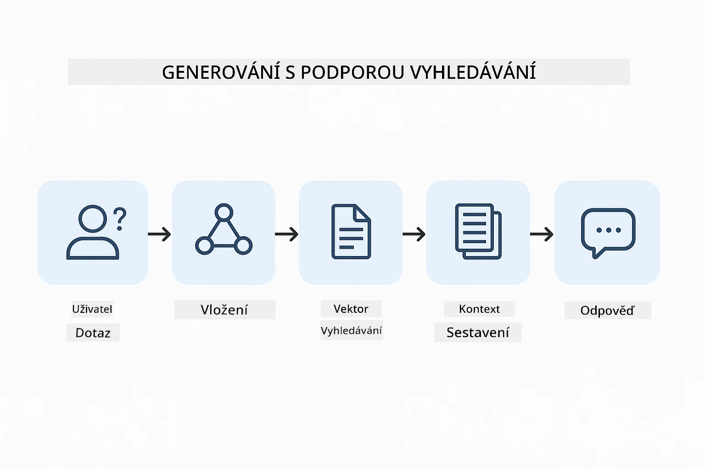
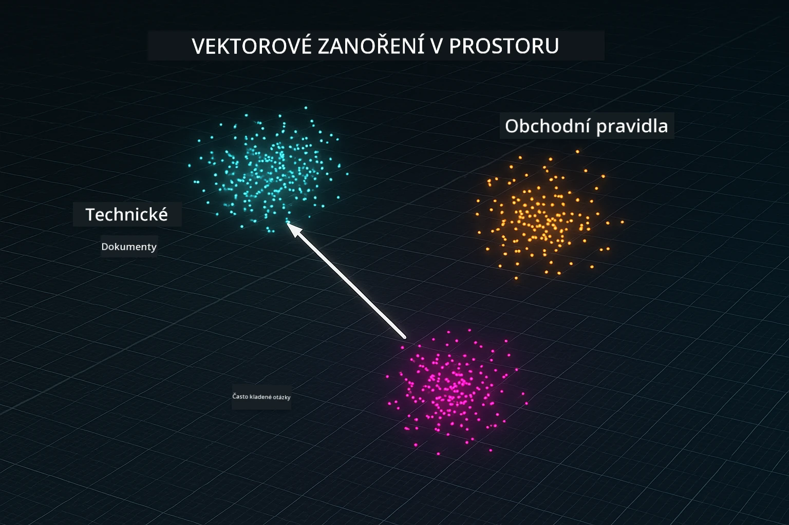
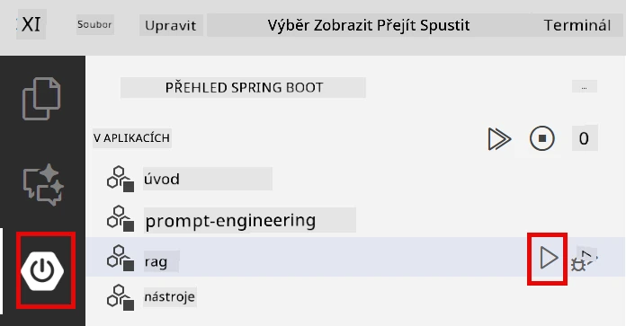
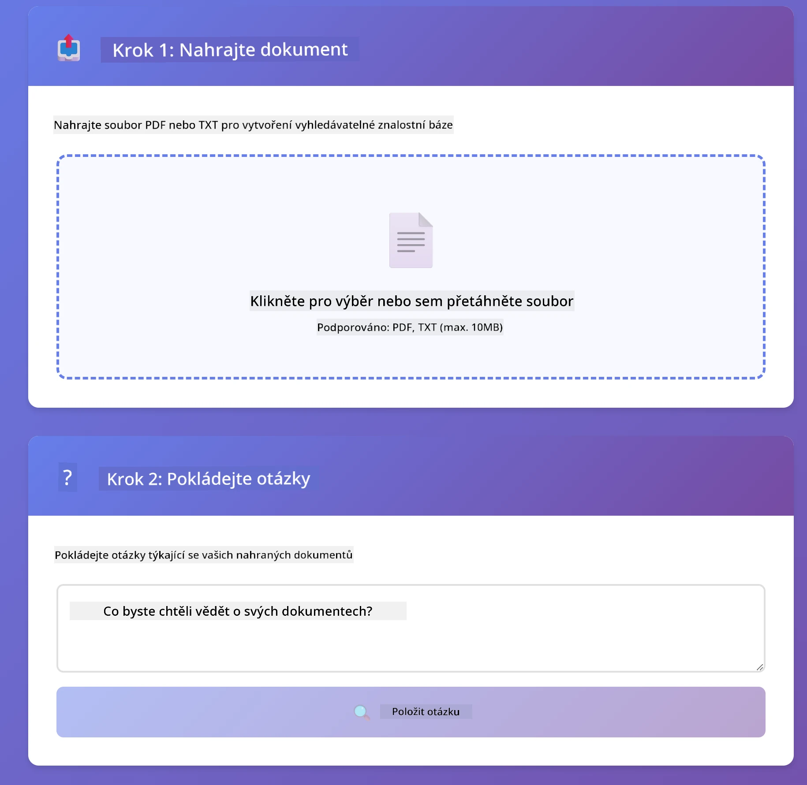
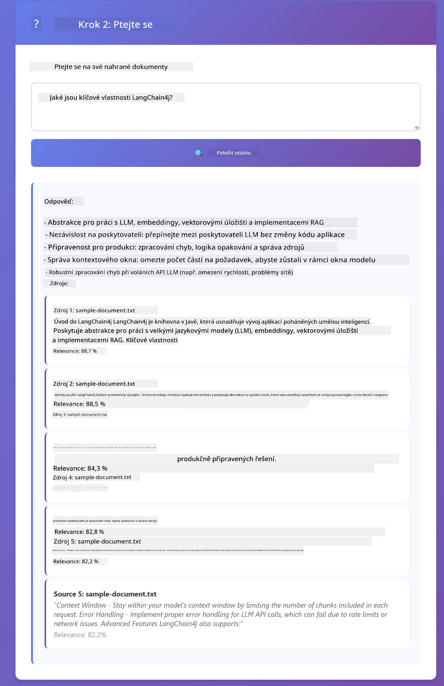

# Modul 03: RAG (Generování s využitím vyhledávání informací)

## Obsah

- [Video průvodce](#video-průvodce)
- [Co se naučíte](#co-se-naučíte)
- [Požadavky](#požadavky)
- [Pochopení RAG](#pochopení-rag)
  - [Který přístup RAG tento tutoriál používá?](#který-přístup-rag-tento-tutoriál-používá)
- [Jak to funguje](#jak-to-funguje)
  - [Zpracování dokumentu](#zpracování-dokumentu)
  - [Vytváření embeddingů](#vytváření-embeddingů)
  - [Sémantické vyhledávání](#sémantické-vyhledávání)
  - [Generování odpovědi](#generování-odpovědí)
- [Spuštění aplikace](#spuštění-aplikace)
- [Používání aplikace](#použití-aplikace)
  - [Nahrání dokumentu](#nahrání-dokumentu)
  - [Pokládání otázek](#pokládejte-otázky)
  - [Kontrola zdrojových referencí](#kontrola-zdrojových-odkazů)
  - [Experimentování s otázkami](#experimentujte-s-otázkami)
- [Klíčové koncepty](#klíčové-pojmy)
  - [Strategie dělení na části](#strategie-rozdělení-na-části)
  - [Skóre podobnosti](#skóre-podobnosti)
  - [Ukládání v paměti](#paměťové-uložení)
  - [Správa kontextového okna](#správa-kontextového-okna)
- [Kdy je RAG důležité](#kdy-má-rag-smysl)
- [Další kroky](#další-kroky)

## Video průvodce

Sledujte tuto živou relaci, která vysvětluje, jak začít s tímto modulem:

<a href="https://www.youtube.com/watch?v=_olq75ZH_eY"></a>

## Co se naučíte

V předchozích modulech jste se naučili, jak vést rozhovory s AI a efektivně strukturovat vaše výzvy (prompty). Existuje však základní omezení: jazykové modely znají jen to, co se naučily během tréninku. Nemohou odpovídat na otázky týkající se politiky vaší společnosti, dokumentace vašich projektů ani jakýchkoli informací, na kterých nebyly trénovány.

RAG (Generování s využitím vyhledávání informací) tento problém řeší. Místo toho, aby model učil vaše informace (což je nákladné a nepraktické), dáváte mu možnost prohledávat vaše dokumenty. Když někdo položí otázku, systém najde relevantní informace a zahrne je do výzvy. Model pak odpovídá na základě tohoto získaného kontextu.

Představte si RAG jako poskytnutí referenční knihovny modelu. Když položíte otázku, systém:

1. **Uživatelský dotaz** – Položíte otázku  
2. **Embedding** – Převádí vaši otázku na vektor  
3. **Vektorové hledání** – Najde podobné části dokumentů  
4. **Sestavení kontextu** – Přidá relevantní části do výzvy  
5. **Odpověď** – LLM generuje odpověď na základě kontextu  

Tímto způsobem jsou odpovědi modelu ukotvené ve vašich skutečných datech, místo aby se spoléhal pouze na znalosti ze svého tréninku nebo vymýšlel odpovědi.

## Požadavky

- Dokončený [Modul 01 - Úvod](../01-introduction/README.md) (nasazené Azure OpenAI zdroje, včetně modelu embeddingu `text-embedding-3-small`)  
- `.env` soubor v kořenovém adresáři s Azure přihlašovacími údaji (vytvořený příkazem `azd up` v modulu 01)

> **Poznámka:** Pokud jste modul 01 nedokončili, nejprve postupujte podle jeho instalačních pokynů. Příkaz `azd up` nasazuje jak GPT chatovací model, tak embeddingový model, který tento modul používá.

## Pochopení RAG

Následující diagram ilustruje základní koncept: místo spoléhání se pouze na tréninková data modelu dává RAG modelu referenční knihovnu vašich dokumentů, které konzultuje před tím, než vygeneruje každou odpověď.


*Tento diagram ukazuje rozdíl mezi standardním LLM (který tipuje podle tréninkových dat) a RAG vylepšeným LLM (který předem konzultuje vaše dokumenty).*

Takto jsou jednotlivé části propojeny koncový na konec. Uživatelská otázka prochází čtyřmi fázemi — embedding, vektorové hledání, sestavení kontextu a generování odpovědi — přičemž každá staví na předchozí:



*Tento diagram ukazuje koncový RAG pipeline — uživatelský dotaz prochází embeddingem, vektorovým hledáním, sestavením kontextu a generováním odpovědi.*

Zbytek tohoto modulu podrobně popisuje každou fázi s kódem, který můžete spustit a upravit.

### Který přístup RAG tento tutoriál používá?

LangChain4j nabízí tři způsoby implementace RAG, každý s jinou úrovní abstrakce. Následující diagram je porovnává vedle sebe:


*Tento diagram porovnává tři LangChain4j přístupy RAG — Easy, Native a Advanced — ukazující jejich klíčové komponenty a kdy který použít.*

| Přístup | Co dělá | Kompromis |
|---|---|---|
| **Easy RAG** | Automaticky propojuje vše přes `AiServices` a `ContentRetriever`. Anotujete rozhraní, připojíte retriever a LangChain4j za scénou řeší embedding, hledání a sestavení výzvy. | Minimální kód, ale nevidíte, co se děje v každém kroku. |
| **Native RAG** | Zavoláte embedding model, hledáte ve skladu, sestavíte výzvu a sami vygenerujete odpověď – krok po kroku explicitně. | Více kódu, ale každá fáze je viditelná a upravitelná. |
| **Advanced RAG** | Používá framework `RetrievalAugmentor` s pluggables pro transformery dotazů, routery, přeřazovače a injektory obsahu pro produkční pipeline. | Maximální flexibilita, ale podstatně větší složitost. |

**Tento tutoriál používá Native přístup.** Každý krok RAG pipeline — embedování dotazu, vyhledávání ve vektorovém skladu, sestavení kontextu a generování odpovědi — je explicitně napsán v [`RagService.java`](../../../03-rag/src/main/java/com/example/langchain4j/rag/service/RagService.java). Toto je záměrné: jako výukový materiál je důležitější, abyste viděli a rozuměli každé fázi, než aby byl kód zkrácený. Jakmile pochopíte, jak jsou části propojeny, můžete přejít na Easy RAG pro rychlé prototypy nebo Advanced RAG pro produkční systémy.

> **💡 Zajímá vás Easy RAG?** LangChain4j také nabízí *Easy RAG* přístup, kde `AiServices` a `ContentRetriever` automaticky řeší embedding, vyhledávání a sestavení výzvy. Tento modul jde explicitnější cestou – rozbírá tu pipeline, abyste mohli vidět a řídit každou fázi.

Níže vidíte Easy RAG pipeline. Všimněte si, jak `AiServices` a `EmbeddingStoreContentRetriever` skrývají veškerou složitost — načtete dokument, připojíte retriever a dostanete odpovědi. Native přístup v tomto modulu rozbírá tyto skryté kroky:


*Tento diagram ukazuje Easy RAG pipeline. Porovnejte s Native přístupem v tomto modulu: Easy RAG skrývá embedding, vyhledávání a sestavení výzvy za `AiServices` a `ContentRetriever` — načtete dokument, připojíte retriever a získáte odpovědi. Native přístup tento pipeline rozbírá, takže vy voláte každý krok (embed, hledání, sestavení kontextu, generování) sami, což vám dává plnou viditelnost a kontrolu.*

## Jak to funguje

RAG pipeline v tomto modulu se skládá ze čtyř fází, které běží v pořadí pokaždé, když uživatel položí otázku. Nejprve je nahraný dokument **parsován a rozdělen na části** o rozumné velikosti. Tyto části se pak převedou na **vektorové embeddingy** a uloží tak, aby je bylo možné matematicky porovnávat. Když přijde dotaz, systém provede **sémantické vyhledávání** nejrelevantnějších částí a nakonec je předá jako kontext LLM pro **generování odpovědi**. Níže uvedené sekce popisují každou fázi s konkrétním kódem a diagramy. Pojďme se podívat na první krok.

### Zpracování dokumentu

[DocumentService.java](../../../03-rag/src/main/java/com/example/langchain4j/rag/service/DocumentService.java)

Když nahrajete dokument, systém jej parsuje (PDF nebo prostý text), přidá metadata jako název souboru a pak jej rozbije na části — menší segmenty, které pohodlně pasují do kontextového okna modelu. Tyto části se mírně překrývají, aby se neztratil kontext na hranicích.

```java
// Analyzujte nahraný soubor a zabalte jej do dokumentu LangChain4j
Document document = Document.from(content, metadata);

// Rozdělte na části po 300 tokenech s přesahem 30 tokenů
DocumentSplitter splitter = DocumentSplitters
    .recursive(300, 30);

List<TextSegment> segments = splitter.split(document);
```
  
Níže uvedený diagram ukazuje, jak to vizuálně funguje. Každá část sdílí některé tokeny se sousedy — překrytí 30 tokeny zajišťuje, že žádný důležitý kontext nezmizí mezi částmi:


*Tento diagram ukazuje dokument rozdělený na části o 300 tokenech s překrytím 30 tokenů, čímž se uchovává kontext na hranicích částí.*

> **🤖 Vyzkoušejte s [GitHub Copilot](https://github.com/features/copilot) Chat:** Otevřete [`DocumentService.java`](../../../03-rag/src/main/java/com/example/langchain4j/rag/service/DocumentService.java) a zeptejte se:  
> - "Jak LangChain4j dělí dokumenty na části a proč je překrývání důležité?"  
> - "Jaká je optimální velikost části pro různé typy dokumentů a proč?"  
> - "Jak zacházet s dokumenty v několika jazycích nebo se speciálním formátováním?"

### Vytváření embeddingů

[LangChainRagConfig.java](../../../03-rag/src/main/java/com/example/langchain4j/rag/config/LangChainRagConfig.java)

Každá část se převede na číselnou reprezentaci nazývanou embedding — v podstatě převod významu na čísla. Embeddingový model není „inteligentní“ jako chatovací model; nedokáže plnit instrukce, uvažovat ani odpovídat na otázky. Co umí, je namapovat text do matematického prostoru, kde podobné významy leží blízko sebe — „auto“ blízko „automobil“, „vrácení peněz“ blízko „návrat mého dluhu“. Můžeme tedy chatovací model přirovnat k člověku, se kterým mluvíte, zatímco embeddingový model je velmi dobrý třídicí systém.

Následující diagram vizualizuje tento koncept — text vstupuje, vycházejí číselné vektory, a podobné významy vedou k sousedním vektorům:


*Tento diagram ukazuje, jak embeddingový model převádí text na číselné vektory, umisťující podobné významy — jako „auto“ a „automobil“ — blízko sebe ve vektorovém prostoru.*

```java
@Bean
public EmbeddingModel embeddingModel() {
    return OpenAiOfficialEmbeddingModel.builder()
        .baseUrl(azureOpenAiEndpoint)
        .apiKey(azureOpenAiKey)
        .modelName(azureEmbeddingDeploymentName)
        .build();
}

EmbeddingStore<TextSegment> embeddingStore = 
    new InMemoryEmbeddingStore<>();
```
  
Níže uvedený diagram tříd ukazuje dva samostatné toky v RAG pipeline a třídy LangChain4j, které je implementují. **Tok importu** (běží jednou při nahrání) rozděluje dokument, embeduje části a ukládá je pomocí `.addAll()`. **Tok dotazu** (běží při každé otázce uživatele) embeduje otázku, hledá ve skladu přes `.search()` a předává odpovídající kontext chatovacímu modelu. Oba toky se setkávají na sdíleném rozhraní `EmbeddingStore<TextSegment>`:


*Tento diagram ukazuje dva toky v RAG pipeline — import a dotaz — a jak se propojují přes sdílený EmbeddingStore.*

Jakmile jsou embeddingy uloženy, podobný obsah se přirozeně shlukuje ve vektorovém prostoru. Vizualizace níže ukazuje, jak související dokumenty končí jako blízké body, což umožňuje sémantické vyhledávání:



*Tato vizualizace ukazuje, jak se související dokumenty shlukují ve 3D vektorovém prostoru, přičemž témata jako technická dokumentace, obchodní pravidla a FAQ tvoří samostatné skupiny.*

Při vyhledávání systém následuje čtyři kroky: embeduje dokumenty jednou, embeduje dotaz při každém hledání, porovnává vektor dotazu se všemi uloženými vektory pomocí kosinové podobnosti a vrací top-K nejvýše hodnocené části. Níže uvedený diagram prochází každý krok a příslušné třídy LangChain4j:


*Tento diagram ukazuje čtyřkrokový proces vyhledávání embeddingu: embedování dokumentů, embedování dotazu, porovnávání vektorů kosinovou podobností a vrácení top-K výsledků.*

### Sémantické vyhledávání

[RagService.java](../../../03-rag/src/main/java/com/example/langchain4j/rag/service/RagService.java)

Když položíte otázku, také se z ní vytvoří embedding. Systém pak porovná embedding vaší otázky se všemi embeddingy částí dokumentů. Najde části s nejpodobnějším významem - nejen s odpovídajícími klíčovými slovy, ale skutečnou sémantickou podobností.

```java
Embedding queryEmbedding = embeddingModel.embed(question).content();

EmbeddingSearchRequest searchRequest = EmbeddingSearchRequest.builder()
    .queryEmbedding(queryEmbedding)
    .maxResults(5)
    .minScore(0.5)
    .build();

EmbeddingSearchResult<TextSegment> searchResult = embeddingStore.search(searchRequest);
List<EmbeddingMatch<TextSegment>> matches = searchResult.matches();

for (EmbeddingMatch<TextSegment> match : matches) {
    String relevantText = match.embedded().text();
    double score = match.score();
}
```
  
Níže uvedený diagram porovnává sémantické vyhledávání s tradičním hledáním podle klíčových slov. Hledání podle klíčového slova „vozidlo“ může přeskočit část o „auty a náklaďáky“, ale sémantické vyhledávání chápe, že to znamená to samé, a vrátí ji jako vysoké skórující shodu:


*Tento diagram porovnává vyhledávání na základě klíčových slov a sémantické vyhledávání, ukazující, jak sémantické vyhledávání vrací konceptuálně související obsah i tehdy, když se přesná klíčová slova liší.*

Pod kapotou se podobnost měří pomocí kosinové podobnosti — v podstatě se ptáme „ukazují tyto dva šipky stejným směrem?“ Dvě části mohou mít zcela odlišná slova, ale pokud významově souhlasí, jejich vektory ukazují stejným směrem a skórují blízko 1,0:


*Tento diagram ilustruje kosinovou podobnost jako úhel mezi vektorovými vloženími — více zarovnané vektory dosahují skóre blíže k 1,0, což značí vyšší sémantickou podobnost.*

> **🤖 Vyzkoušejte s [GitHub Copilot](https://github.com/features/copilot) Chat:** Otevřete [`RagService.java`](../../../03-rag/src/main/java/com/example/langchain4j/rag/service/RagService.java) a zeptejte se:
> - "Jak funguje vyhledávání podobnosti s vloženími a co určuje skóre?"
> - "Jaký práh podobnosti bych měl použít a jak ovlivňuje výsledky?"
> - "Jak zacházet s případy, kdy nejsou nalezeny žádné relevantní dokumenty?"

### Generování odpovědí

[RagService.java](../../../03-rag/src/main/java/com/example/langchain4j/rag/service/RagService.java)

Nejrelevantnější části jsou sestaveny do strukturované výzvy, která obsahuje explicitní instrukce, získaný kontext a uživatelovu otázku. Model čte právě tyto konkrétní části a odpovídá na základě těchto informací — může použít pouze to, co má před sebou, což zabraňuje halucinacím.

```java
String context = matches.stream()
    .map(match -> match.embedded().text())
    .collect(Collectors.joining("\n\n"));

String prompt = String.format("""
    Answer the question based on the following context.
    If the answer cannot be found in the context, say so.

    Context:
    %s

    Question: %s

    Answer:""", context, request.question());

String answer = chatModel.chat(prompt);
```

Níže uvedený diagram ukazuje tento proces sestavení — části s nejvyšším skóre z kroku vyhledávání jsou vloženy do šablony výzvy a `OpenAiOfficialChatModel` generuje podloženou odpověď:


*Tento diagram ukazuje, jak jsou části s nejvyšším skóre sestaveny do strukturované výzvy, což umožňuje modelu generovat podloženou odpověď z vašich dat.*

## Spuštění aplikace

**Ověření nasazení:**

Ujistěte se, že soubor `.env` existuje v kořenovém adresáři s přihlašovacími údaji Azure (vytvořeno během modulu 01). Spusťte to z adresáře modulu (`03-rag/`):

**Bash:**
```bash
cat ../.env  # Mělo by zobrazit AZURE_OPENAI_ENDPOINT, API_KEY, DEPLOYMENT
```

**PowerShell:**
```powershell
Get-Content ..\.env  # Mělo by zobrazit AZURE_OPENAI_ENDPOINT, API_KEY, DEPLOYMENT
```

**Spusťte aplikaci:**

> **Poznámka:** Pokud jste již spustili všechny aplikace pomocí `./start-all.sh` z kořenového adresáře (jak je popsáno v modulu 01), tento modul už běží na portu 8081. Můžete přeskočit níže uvedené příkazy pro spuštění a jít přímo na http://localhost:8081.

**Možnost 1: Použití Spring Boot Dashboard (doporučeno pro uživatele VS Code)**

Vývojářský kontejner obsahuje rozšíření Spring Boot Dashboard, které poskytuje vizuální rozhraní pro správu všech aplikací Spring Boot. Najdete jej v postranním panelu vlevo ve VS Code (hledejte ikonu Spring Boot).

Ze Spring Boot Dashboard můžete:
- Vidět všechny dostupné aplikace Spring Boot v pracovním prostoru
- Spouštět/ukončovat aplikace jedním kliknutím
- Zobrazovat logy aplikací v reálném čase
- Monitorovat stav aplikací

Jednoduše klikněte na tlačítko spuštění vedle "rag" pro spuštění tohoto modulu, nebo spusťte všechny moduly najednou.



*Tento snímek obrazovky ukazuje Spring Boot Dashboard ve VS Code, kde můžete vizuálně spouštět, zastavovat a sledovat aplikace.*

**Možnost 2: Použití shell skriptů**

Spusťte všechny webové aplikace (moduly 01-04):

**Bash:**
```bash
cd ..  # Z kořenového adresáře
./start-all.sh
```

**PowerShell:**
```powershell
cd ..  # Z kořenového adresáře
.\start-all.ps1
```

Nebo spusťte jen tento modul:

**Bash:**
```bash
cd 03-rag
./start.sh
```

**PowerShell:**
```powershell
cd 03-rag
.\start.ps1
```

Oba skripty automaticky načítají proměnné prostředí z kořenového souboru `.env` a sestaví JARy, pokud ještě neexistují.

> **Poznámka:** Pokud preferujete sestavení všech modulů ručně před spuštěním:
>
> **Bash:**
> ```bash
> cd ..  # Go to root directory
> mvn clean package -DskipTests
> ```

> **PowerShell:**
> ```powershell
> cd ..  # Go to root directory
> mvn clean package -DskipTests
> ```

Otevřete v prohlížeči http://localhost:8081.

**Pro zastavení:**

**Bash:**
```bash
./stop.sh  # Tento modul pouze
# Nebo
cd .. && ./stop-all.sh  # Všechny moduly
```

**PowerShell:**
```powershell
.\stop.ps1  # Pouze tento modul
# Nebo
cd ..; .\stop-all.ps1  # Všechny moduly
```

## Použití aplikace

Aplikace poskytuje webové rozhraní pro nahrávání dokumentů a kladení otázek.

<a href="images/rag-homepage.png"></a>

*Tento snímek obrazovky ukazuje rozhraní aplikace RAG, kde nahráváte dokumenty a kladete otázky.*

### Nahrání dokumentu

Začněte nahráním dokumentu - pro testování nejlépe fungují soubory TXT. V tomto adresáři je k dispozici `sample-document.txt`, který obsahuje informace o funkcích LangChain4j, implementaci RAG a osvědčené postupy — ideální pro testování systému.

Systém váš dokument zpracuje, rozlomí na části a vytvoří vložení pro každou část. To se děje automaticky při nahrání.

### Pokládejte otázky

Nyní položte konkrétní otázky týkající se obsahu dokumentu. Zkuste něco faktického, co je v dokumentu jasně uvedeno. Systém vyhledá relevantní části, zahrne je do výzvy a vygeneruje odpověď.

### Kontrola zdrojových odkazů

Všimněte si, že každá odpověď obsahuje odkazy na zdroje s hodnotami podobnosti. Tyto hodnoty (0 až 1) ukazují, jak relevantní byla každá část vůči vaší otázce. Vyšší skóre znamená lepší shodu. To vám umožní ověřit odpověď vůči zdrojovému materiálu.

<a href="images/rag-query-results.png"></a>

*Tento snímek obrazovky ukazuje výsledky dotazu s vygenerovanou odpovědí, zdrojovými odkazy a skóre relevance pro každou získanou část.*

### Experimentujte s otázkami

Vyzkoušejte různé typy otázek:
- Konkrétní fakta: "Jaké je hlavní téma?"
- Porovnání: "Jaký je rozdíl mezi X a Y?"
- Shrnutí: "Shrňte klíčové body o Z"

Sledujte, jak se skóre relevance mění podle toho, jak dobře vaše otázka odpovídá obsahu dokumentu.

## Klíčové pojmy

### Strategie rozdělení na části

Dokumenty se rozdělují na části o 300 znacích s překryvem 30 znaků. Tento kompromis zajišťuje, že každá část má dostatek kontextu, aby byla smysluplná, ale zároveň je dostatečně malá, aby se do výzvy vešlo více částí.

### Skóre podobnosti

Každá získaná část má skóre podobnosti mezi 0 a 1, které ukazuje, jak přesně odpovídá uživatelově otázce. Níže uvedený diagram vizualizuje rozsahy skóre a jak systém používá tato skóre k filtrování výsledků:


*Tento diagram ukazuje rozsahy skóre od 0 do 1 s minimálním prahem 0,5, který filtruje nerelevantní části.*

Skóre se pohybují od 0 do 1:
- 0,7-1,0: Vysoce relevantní, přesná shoda
- 0,5-0,7: Relevantní, dobrý kontext
- Pod 0,5: Odfiltrováno, příliš rozdílné

Systém získává pouze části nad minimálním prahem, aby zajistil kvalitu.

Vložení fungují dobře, když se významové shluky vyčistí, ale mají slepá místa. Níže uvedený diagram ukazuje běžné režimy selhání — části, které jsou příliš velké, produkují nejasné vektory, části, které jsou příliš malé, postrádají kontext, nejednoznačné termíny směřují k více shlukům a přesné vyhledávání (ID, čísla dílů) ve vkládáních vůbec nefunguje:


*Tento diagram ukazuje běžné režimy selhání vložení: části příliš velké, části příliš malé, nejednoznačné termíny vedoucí k více shlukům a přesné vyhledávání jako ID.*

### Paměťové uložení

Tento modul používá pro jednoduchost paměťové uložení. Po restartu aplikace se nahrané dokumenty ztratí. Produkční systémy používají perzistentní vektorové databáze jako Qdrant nebo Azure AI Search.

### Správa kontextového okna

Každý model má maximální velikost kontextového okna. Nemůžete zahrnout všechny části z velkého dokumentu. Systém získává prvních N nejrelevantnějších částí (ve výchozím nastavení 5), aby zůstal v limitech a zároveň poskytl dostatek kontextu pro přesné odpovědi.

## Kdy má RAG smysl

RAG není vždy správný přístup. Níže uvedený průvodce rozhodnutím vám pomůže určit, kdy RAG přidává hodnotu a kdy stačí jednodušší přístupy — jako přímé zahrnutí obsahu do výzvy nebo spoléhání na vestavěné znalosti modelu:


*Tento diagram ukazuje průvodce rozhodnutím, kdy RAG přidává hodnotu versus kdy postačí jednodušší přístupy.*

## Další kroky

**Další modul:** [04-tools - AI Agent s nástroji](../04-tools/README.md)

---

**Navigace:** [← Předchozí: Modul 02 - Tvorba výzev](../02-prompt-engineering/README.md) | [Zpět na hlavní stránku](../README.md) | [Další: Modul 04 - Nástroje →](../04-tools/README.md)

---

<!-- CO-OP TRANSLATOR DISCLAIMER START -->
**Prohlášení o omezení odpovědnosti**:
Tento dokument byl přeložen pomocí AI překladatelské služby [Co-op Translator](https://github.com/Azure/co-op-translator). Přestože usilujeme o co největší přesnost, mějte prosím na paměti, že automatizované překlady mohou obsahovat chyby nebo nepřesnosti. Originální dokument v jeho mateřském jazyce by měl být považován za autoritativní zdroj. Pro kritické informace se doporučuje profesionální lidský překlad. Nejsme odpovědní za jakékoli nedorozumění nebo nesprávné interpretace vzniklé použitím tohoto překladu.
<!-- CO-OP TRANSLATOR DISCLAIMER END -->