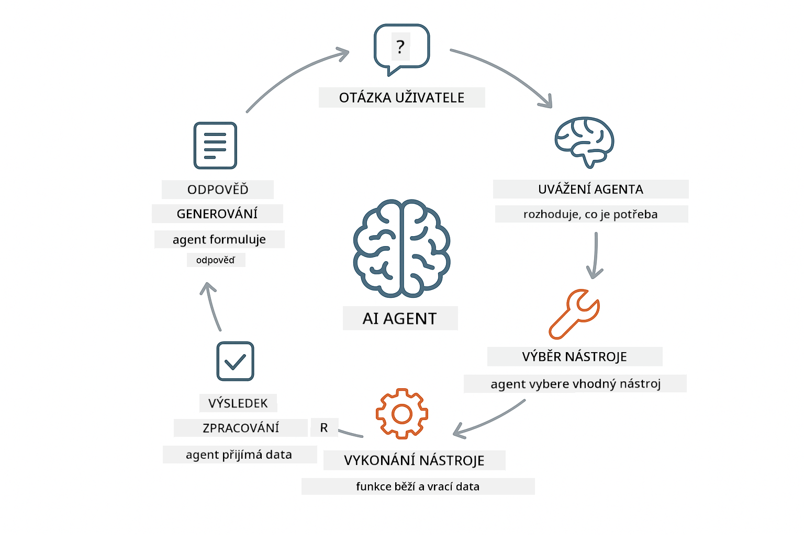
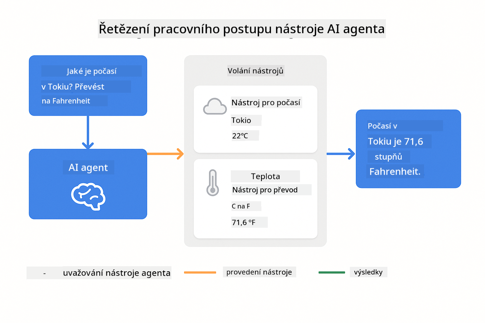
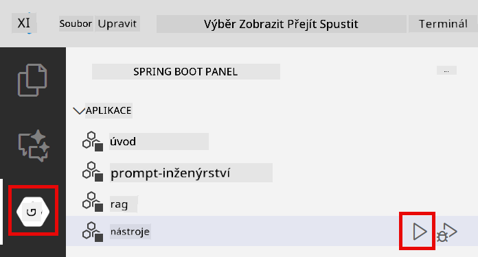
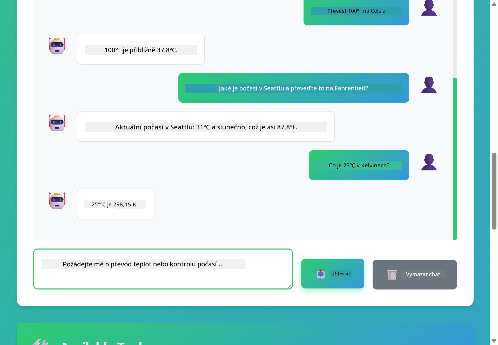

<!--
CO_OP_TRANSLATOR_METADATA:
{
  "original_hash": "aa23f106e7f53270924c9dd39c629004",
  "translation_date": "2025-12-13T19:18:37+00:00",
  "source_file": "04-tools/README.md",
  "language_code": "cs"
}
-->
# Modul 04: AI agenti s nástroji

## Obsah

- [Co se naučíte](../../../04-tools)
- [Požadavky](../../../04-tools)
- [Pochopení AI agentů s nástroji](../../../04-tools)
- [Jak funguje volání nástrojů](../../../04-tools)
  - [Definice nástrojů](../../../04-tools)
  - [Rozhodování](../../../04-tools)
  - [Provedení](../../../04-tools)
  - [Generování odpovědi](../../../04-tools)
- [Řetězení nástrojů](../../../04-tools)
- [Spuštění aplikace](../../../04-tools)
- [Používání aplikace](../../../04-tools)
  - [Vyzkoušejte jednoduché použití nástroje](../../../04-tools)
  - [Otestujte řetězení nástrojů](../../../04-tools)
  - [Sledujte tok konverzace](../../../04-tools)
  - [Pozorujte uvažování](../../../04-tools)
  - [Experimentujte s různými požadavky](../../../04-tools)
- [Klíčové koncepty](../../../04-tools)
  - [Vzor ReAct (Uvažování a jednání)](../../../04-tools)
  - [Popisy nástrojů jsou důležité](../../../04-tools)
  - [Správa relací](../../../04-tools)
  - [Zpracování chyb](../../../04-tools)
- [Dostupné nástroje](../../../04-tools)
- [Kdy používat agenty založené na nástrojích](../../../04-tools)
- [Další kroky](../../../04-tools)

## Co se naučíte

Doposud jste se naučili, jak vést konverzace s AI, efektivně strukturovat výzvy a zakládat odpovědi na vašich dokumentech. Přesto existuje základní omezení: jazykové modely mohou generovat pouze text. Nemohou kontrolovat počasí, provádět výpočty, dotazovat se do databází ani komunikovat s externími systémy.

Nástroje toto mění. Tím, že modelu dáte přístup k funkcím, které může volat, proměníte ho z generátoru textu na agenta, který může podnikat akce. Model rozhoduje, kdy potřebuje nástroj, který nástroj použít a jaké parametry předat. Váš kód funkci vykoná a vrátí výsledek. Model tento výsledek začlení do své odpovědi.

## Požadavky

- Dokončený Modul 01 (nasazeny Azure OpenAI zdroje)
- Soubor `.env` v kořenovém adresáři s Azure přihlašovacími údaji (vytvořený pomocí `azd up` v Modulu 01)

> **Poznámka:** Pokud jste Modul 01 nedokončili, nejprve postupujte podle tamních pokynů k nasazení.

## Pochopení AI agentů s nástroji

AI agent s nástroji následuje vzor uvažování a jednání (ReAct):

1. Uživatel položí otázku
2. Agent uvažuje, co potřebuje vědět
3. Agent rozhodne, zda potřebuje nástroj k odpovědi
4. Pokud ano, agent zavolá příslušný nástroj s vhodnými parametry
5. Nástroj provede akci a vrátí data
6. Agent začlení výsledek a poskytne konečnou odpověď



*Vzor ReAct – jak AI agenti střídavě uvažují a jednají, aby řešili problémy*

Toto probíhá automaticky. Definujete nástroje a jejich popisy. Model se stará o rozhodování, kdy a jak je použít.

## Jak funguje volání nástrojů

**Definice nástrojů** - [WeatherTool.java](../../../04-tools/src/main/java/com/example/langchain4j/agents/tools/WeatherTool.java) | [TemperatureTool.java](../../../04-tools/src/main/java/com/example/langchain4j/agents/tools/TemperatureTool.java)

Definujete funkce s jasnými popisy a specifikacemi parametrů. Model vidí tyto popisy ve svém systémovém promptu a rozumí, co každý nástroj dělá.

```java
@Component
public class WeatherTool {
    
    @Tool("Get the current weather for a location")
    public String getCurrentWeather(@P("Location name") String location) {
        // Vaše logika vyhledávání počasí
        return "Weather in " + location + ": 22°C, cloudy";
    }
}

@AiService
public interface Assistant {
    String chat(@MemoryId String sessionId, @UserMessage String message);
}

// Asistent je automaticky propojen pomocí Spring Boot s:
// - Bean ChatModel
// - Všechny metody @Tool z tříd označených @Component
// - ChatMemoryProvider pro správu relací
```

> **🤖 Vyzkoušejte s [GitHub Copilot](https://github.com/features/copilot) Chat:** Otevřete [`WeatherTool.java`](../../../04-tools/src/main/java/com/example/langchain4j/agents/tools/WeatherTool.java) a zeptejte se:
> - "Jak bych integroval skutečné API počasí jako OpenWeatherMap místo simulovaných dat?"
> - "Co dělá dobrý popis nástroje, který pomáhá AI jej správně používat?"
> - "Jak řešit chyby API a limity volání v implementacích nástrojů?"

**Rozhodování**

Když uživatel položí otázku "Jaké je počasí v Seattlu?", model rozpozná, že potřebuje nástroj počasí. Vygeneruje volání funkce s parametrem lokace nastaveným na "Seattle".

**Provedení** - [AgentService.java](../../../04-tools/src/main/java/com/example/langchain4j/agents/service/AgentService.java)

Spring Boot automaticky propojí deklarativní rozhraní `@AiService` se všemi registrovanými nástroji a LangChain4j volání nástrojů provádí automaticky.

> **🤖 Vyzkoušejte s [GitHub Copilot](https://github.com/features/copilot) Chat:** Otevřete [`AgentService.java`](../../../04-tools/src/main/java/com/example/langchain4j/agents/service/AgentService.java) a zeptejte se:
> - "Jak funguje vzor ReAct a proč je efektivní pro AI agenty?"
> - "Jak agent rozhoduje, který nástroj použít a v jakém pořadí?"
> - "Co se stane, když selže provedení nástroje – jak robustně řešit chyby?"

**Generování odpovědi**

Model obdrží data o počasí a naformátuje je do přirozené jazykové odpovědi pro uživatele.

### Proč používat deklarativní AI služby?

Tento modul využívá integraci LangChain4j se Spring Bootem pomocí deklarativních rozhraní `@AiService`:

- **Automatické propojení Spring Bootem** – ChatModel a nástroje jsou automaticky injektovány
- **Vzor @MemoryId** – Automatická správa paměti na základě relace
- **Jedna instance** – Asistent vytvořen jednou a znovu použit pro lepší výkon
- **Typově bezpečné volání** – Java metody volány přímo s konverzí typů
- **Orchestrace více kroků** – Automaticky řeší řetězení nástrojů
- **Žádný boilerplate** – Žádné ruční volání AiServices.builder() nebo správa paměti v HashMap

Alternativní přístupy (ruční `AiServices.builder()`) vyžadují více kódu a postrádají výhody integrace se Spring Bootem.

## Řetězení nástrojů

**Řetězení nástrojů** – AI může volat více nástrojů za sebou. Zeptejte se "Jaké je počasí v Seattlu a mám si vzít deštník?" a sledujte, jak řetězí `getCurrentWeather` s uvažováním o dešti.

<a href="images/tool-chaining.png"></a>

*Sekvenční volání nástrojů – výstup jednoho nástroje vstupuje do dalšího rozhodnutí*

**Elegantní selhání** – Zeptejte se na počasí ve městě, které není v simulovaných datech. Nástroj vrátí chybovou zprávu a AI vysvětlí, že nemůže pomoci. Nástroje selhávají bezpečně.

To probíhá v jednom kole konverzace. Agent autonomně orchestruje více volání nástrojů.

## Spuštění aplikace

**Ověření nasazení:**

Ujistěte se, že soubor `.env` existuje v kořenovém adresáři s Azure přihlašovacími údaji (vytvořený během Modulu 01):
```bash
cat ../.env  # Mělo by zobrazit AZURE_OPENAI_ENDPOINT, API_KEY, DEPLOYMENT
```

**Spuštění aplikace:**

> **Poznámka:** Pokud jste již spustili všechny aplikace pomocí `./start-all.sh` z Modulu 01, tento modul již běží na portu 8084. Můžete přeskočit níže uvedené příkazy a jít přímo na http://localhost:8084.

**Možnost 1: Použití Spring Boot Dashboard (doporučeno pro uživatele VS Code)**

Vývojové prostředí obsahuje rozšíření Spring Boot Dashboard, které poskytuje vizuální rozhraní pro správu všech Spring Boot aplikací. Najdete ho v Activity Bar na levé straně VS Code (ikona Spring Boot).

Ze Spring Boot Dashboard můžete:
- Vidět všechny dostupné Spring Boot aplikace v pracovním prostoru
- Spouštět/zastavovat aplikace jedním kliknutím
- Prohlížet logy aplikací v reálném čase
- Monitorovat stav aplikací

Stačí kliknout na tlačítko přehrávání vedle "tools" pro spuštění tohoto modulu, nebo spustit všechny moduly najednou.



**Možnost 2: Použití shell skriptů**

Spusťte všechny webové aplikace (moduly 01-04):

**Bash:**
```bash
cd ..  # Z kořenového adresáře
./start-all.sh
```

**PowerShell:**
```powershell
cd ..  # Z kořenového adresáře
.\start-all.ps1
```

Nebo spusťte jen tento modul:

**Bash:**
```bash
cd 04-tools
./start.sh
```

**PowerShell:**
```powershell
cd 04-tools
.\start.ps1
```

Oba skripty automaticky načtou proměnné prostředí ze souboru `.env` v kořenovém adresáři a pokud JAR soubory neexistují, sestaví je.

> **Poznámka:** Pokud chcete před spuštěním ručně sestavit všechny moduly:
>
> **Bash:**
> ```bash
> cd ..  # Go to root directory
> mvn clean package -DskipTests
> ```
>
> **PowerShell:**
> ```powershell
> cd ..  # Go to root directory
> mvn clean package -DskipTests
> ```

Otevřete http://localhost:8084 ve vašem prohlížeči.

**Pro zastavení:**

**Bash:**
```bash
./stop.sh  # Pouze tento modul
# Nebo
cd .. && ./stop-all.sh  # Všechny moduly
```

**PowerShell:**
```powershell
.\stop.ps1  # Pouze tento modul
# Nebo
cd ..; .\stop-all.ps1  # Všechny moduly
```

## Používání aplikace

Aplikace poskytuje webové rozhraní, kde můžete komunikovat s AI agentem, který má přístup k nástrojům pro počasí a převod teplot.

<a href="images/tools-homepage.png"></a>

*Rozhraní AI Agent Tools – rychlé příklady a chat pro interakci s nástroji*

**Vyzkoušejte jednoduché použití nástroje**

Začněte jednoduchým požadavkem: "Převést 100 stupňů Fahrenheita na Celsia". Agent rozpozná, že potřebuje nástroj pro převod teploty, zavolá ho s vhodnými parametry a vrátí výsledek. Všimněte si, jak přirozené to působí – neurčili jste, který nástroj použít ani jak ho volat.

**Otestujte řetězení nástrojů**

Nyní zkuste něco složitějšího: "Jaké je počasí v Seattlu a převeď to na Fahrenheit?" Sledujte, jak agent postupuje krok za krokem. Nejprve získá počasí (které je v Celsiích), rozpozná potřebu převodu na Fahrenheit, zavolá nástroj pro převod a oba výsledky zkombinuje do jedné odpovědi.

**Sledujte tok konverzace**

Chatové rozhraní uchovává historii konverzace, což umožňuje vícekrokové interakce. Vidíte všechny předchozí dotazy a odpovědi, což usnadňuje sledování konverzace a pochopení, jak agent buduje kontext přes více výměn.

<a href="images/tools-conversation-demo.png"></a>

*Vícekroková konverzace ukazující jednoduché převody, vyhledávání počasí a řetězení nástrojů*

**Experimentujte s různými požadavky**

Vyzkoušejte různé kombinace:
- Vyhledávání počasí: "Jaké je počasí v Tokiu?"
- Převody teplot: "Kolik je 25 °C v Kelvinech?"
- Kombinované dotazy: "Zkontroluj počasí v Paříži a řekni mi, jestli je nad 20 °C"

Všimněte si, jak agent interpretuje přirozený jazyk a mapuje ho na vhodná volání nástrojů.

## Klíčové koncepty

**Vzor ReAct (Uvažování a jednání)**

Agent střídavě uvažuje (rozhoduje, co dělat) a jedná (používá nástroje). Tento vzor umožňuje autonomní řešení problémů místo pouhých odpovědí na instrukce.

**Popisy nástrojů jsou důležité**

Kvalita popisů vašich nástrojů přímo ovlivňuje, jak dobře je agent používá. Jasné, specifické popisy pomáhají modelu pochopit, kdy a jak každý nástroj volat.

**Správa relací**

Anotace `@MemoryId` umožňuje automatickou správu paměti na základě relace. Každé ID relace dostane vlastní instanci `ChatMemory` spravovanou beanem `ChatMemoryProvider`, což eliminuje potřebu ručního sledování paměti.

**Zpracování chyb**

Nástroje mohou selhat – API může vypršet, parametry mohou být neplatné, externí služby mohou být nedostupné. Produkční agenti potřebují zpracování chyb, aby model mohl vysvětlit problémy nebo zkusit alternativy.

## Dostupné nástroje

**Nástroje pro počasí** (simulovaná data pro demonstraci):
- Získat aktuální počasí pro lokaci
- Získat předpověď na více dní

**Nástroje pro převod teplot:**
- Celsia na Fahrenheit
- Fahrenheit na Celsia
- Celsia na Kelvin
- Kelvin na Celsia
- Fahrenheit na Kelvin
- Kelvin na Fahrenheit

Jsou to jednoduché příklady, ale vzor lze rozšířit na jakoukoli funkci: dotazy do databáze, volání API, výpočty, operace se soubory nebo systémové příkazy.

## Kdy používat agenty založené na nástrojích

**Používejte nástroje, když:**
- Odpověď vyžaduje aktuální data (počasí, ceny akcií, skladové zásoby)
- Potřebujete provádět výpočty nad rámec jednoduché matematiky
- Přistupujete k databázím nebo API
- Provádíte akce (odesílání e-mailů, vytváření tiketů, aktualizace záznamů)
- Kombinujete více zdrojů dat

**Nepoužívejte nástroje, když:**
- Otázky lze zodpovědět z obecné znalosti
- Odpověď je čistě konverzační
- Latence nástroje by zpomalila uživatelský zážitek

## Další kroky

**Další modul:** [05-mcp - Model Context Protocol (MCP)](../05-mcp/README.md)

---

**Navigace:** [← Předchozí: Modul 03 - RAG](../03-rag/README.md) | [Zpět na hlavní stránku](../README.md) | [Další: Modul 05 - MCP →](../05-mcp/README.md)

---

<!-- CO-OP TRANSLATOR DISCLAIMER START -->
**Prohlášení o vyloučení odpovědnosti**:  
Tento dokument byl přeložen pomocí AI překladatelské služby [Co-op Translator](https://github.com/Azure/co-op-translator). Přestože usilujeme o přesnost, mějte prosím na paměti, že automatické překlady mohou obsahovat chyby nebo nepřesnosti. Původní dokument v jeho mateřském jazyce by měl být považován za autoritativní zdroj. Pro kritické informace se doporučuje profesionální lidský překlad. Nejsme odpovědní za jakékoliv nedorozumění nebo nesprávné výklady vyplývající z použití tohoto překladu.
<!-- CO-OP TRANSLATOR DISCLAIMER END -->