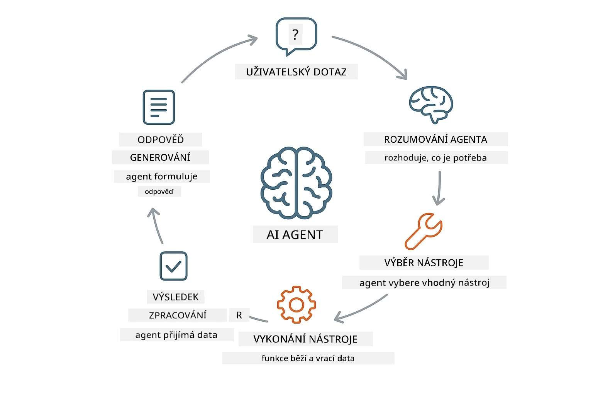
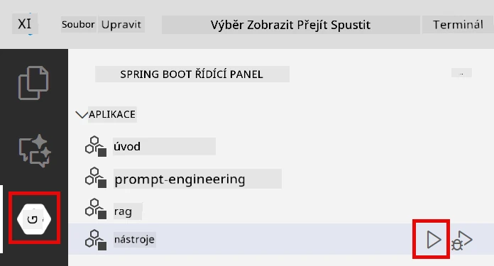
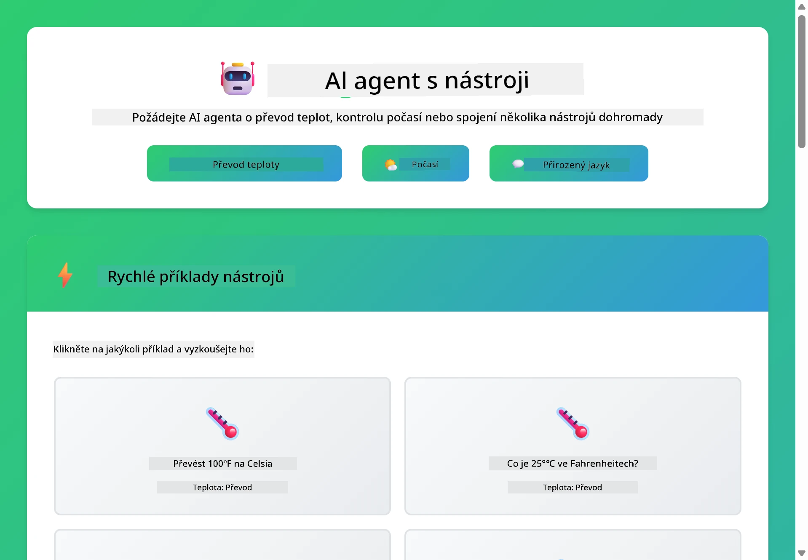

# Modul 04: AI agenti s nástroji

## Obsah

- [Co se naučíte](../../../04-tools)
- [Předpoklady](../../../04-tools)
- [Pochopení AI agentů s nástroji](../../../04-tools)
- [Jak funguje volání nástrojů](../../../04-tools)
  - [Definice nástrojů](../../../04-tools)
  - [Rozhodování](../../../04-tools)
  - [Provedení](../../../04-tools)
  - [Generování odpovědi](../../../04-tools)
- [Řetězení nástrojů](../../../04-tools)
- [Spuštění aplikace](../../../04-tools)
- [Použití aplikace](../../../04-tools)
  - [Vyzkoušejte jednoduché použití nástroje](../../../04-tools)
  - [Otestujte řetězení nástrojů](../../../04-tools)
  - [Sledujte tok konverzace](../../../04-tools)
  - [Experimentujte s různými požadavky](../../../04-tools)
- [Klíčové koncepty](../../../04-tools)
  - [Vzorec ReAct (učení a jednání)](../../../04-tools)
  - [Význam popisů nástrojů](../../../04-tools)
  - [Správa relací](../../../04-tools)
  - [Zpracování chyb](../../../04-tools)
- [Dostupné nástroje](../../../04-tools)
- [Kdy používat agenty založené na nástrojích](../../../04-tools)
- [Další kroky](../../../04-tools)

## Co se naučíte

Zatím jste se naučili, jak vést konverzace s AI, efektivně strukturovat výzvy a zakládat odpovědi na vašich dokumentech. Přesto existuje zásadní omezení: jazykové modely umí pouze generovat text. Nemohou kontrolovat počasí, provádět výpočty, dotazovat databáze ani komunikovat s externími systémy.

Nástroje toto mění. Tím, že modelu umožníte volat funkce, přeměníte jej z generátoru textu na agenta, který může podnikat akce. Model rozhoduje, kdy nástroj potřebuje, který nástroj použije a jaké parametry předá. Váš kód provede funkci a vrátí výsledek. Model tento výsledek zahrne do své odpovědi.

## Předpoklady

- Dokončený Modul 01 (nasazení Azure OpenAI zdrojů)
- `.env` soubor v kořenovém adresáři s přístupy do Azure (vytvořený příkazem `azd up` v Modulu 01)

> **Poznámka:** Pokud jste neabsolvovali Modul 01, nejprve postupujte podle nasazovacích instrukcí tam.

## Pochopení AI agentů s nástroji

> **📝 Poznámka:** Termín „agenti“ v tomto modulu označuje AI asistenty rozšířené o schopnost volání nástrojů. Liší se to od vzorců **Agentic AI** (autonomních agentů s plánováním, pamětí a vícestupňovým uvažováním), které probereme v [Modulu 05: MCP](../05-mcp/README.md).

AI agent s nástroji se řídí vzorcem uvažování a jednání (ReAct):

1. Uživatelská otázka
2. Agent přemýšlí, co potřebuje zjistit
3. Agent rozhodne, zda potřebuje nástroj k odpovědi
4. Pokud ano, agent zavolá odpovídající nástroj s patřičnými parametry
5. Nástroj provede volání a vrátí data
6. Agent zařadí výsledek a poskytne finální odpověď



*Vzor ReAct - jak AI agenti střídají uvažování a jednání k řešení problémů*

Tento proces probíhá automaticky. Vy definujete nástroje a jejich popisy, model se postará o rozhodování, kdy a jak je použít.

## Jak funguje volání nástrojů

### Definice nástrojů

[WeatherTool.java](../../../04-tools/src/main/java/com/example/langchain4j/agents/tools/WeatherTool.java) | [TemperatureTool.java](../../../04-tools/src/main/java/com/example/langchain4j/agents/tools/TemperatureTool.java)

Definujete funkce s jasnými popisy a specifikací parametrů. Model tyto popisy vidí ve svém systémovém promptu a chápe, co který nástroj dělá.

```java
@Component
public class WeatherTool {
    
    @Tool("Get the current weather for a location")
    public String getCurrentWeather(@P("Location name") String location) {
        // Vaše logika vyhledávání počasí
        return "Weather in " + location + ": 22°C, cloudy";
    }
}

@AiService
public interface Assistant {
    String chat(@MemoryId String sessionId, @UserMessage String message);
}

// Asistent je automaticky propojen pomocí Spring Boot s:
// - Bean ChatModel
// - Všechny metody @Tool z tříd označených @Component
// - ChatMemoryProvider pro správu relace
```

> **🤖 Vyzkoušejte s [GitHub Copilot](https://github.com/features/copilot) Chat:** Otevřete [`WeatherTool.java`](../../../04-tools/src/main/java/com/example/langchain4j/agents/tools/WeatherTool.java) a zeptejte se:
> - „Jak bych integroval reálné API počasí jako OpenWeatherMap místo simulovaných dat?“
> - „Co dělá dobrý popis nástroje, který pomáhá AI používat jej správně?“
> - „Jak řešit chyby API a omezení rychlosti ve voláních nástrojů?“

### Rozhodování

Když uživatel položí otázku „Jaké je počasí v Seattlu?“, model rozpozná, že potřebuje nástroj počasí. Vygeneruje volání funkce s parametrem lokace nastaveným na „Seattle“.

### Provedení

[AgentService.java](../../../04-tools/src/main/java/com/example/langchain4j/agents/service/AgentService.java)

Spring Boot automaticky propojí deklarativní rozhraní `@AiService` se všemi registrovanými nástroji a LangChain4j automaticky provede volání nástrojů.

> **🤖 Vyzkoušejte s [GitHub Copilot](https://github.com/features/copilot) Chat:** Otevřete [`AgentService.java`](../../../04-tools/src/main/java/com/example/langchain4j/agents/service/AgentService.java) a zeptejte se:
> - „Jak funguje vzorec ReAct a proč je pro AI agenty efektivní?“
> - „Jak agent rozhoduje, který nástroj použít a v jakém pořadí?“
> - „Co se stane, když zavolání nástroje selže – jak robustně řešit chyby?“

### Generování odpovědi

Model obdrží data o počasí a formátuje je do přirozené odpovědi pro uživatele.

### Proč používat deklarativní AI služby?

Tento modul využívá integraci LangChain4j s Spring Boot, která podporuje deklarativní rozhraní `@AiService`:

- **Automatické propojení Spring Bootem** - ChatModel a nástroje jsou automaticky injektovány
- **Vzorec @MemoryId** - Automatická správa paměti na základě relace
- **Jediná instance** - Asistent je vytvořen jednou a znovu použit pro lepší výkon
- **Typově bezpečné volání** - Java metody jsou volány přímo s převodem typů
- **Vícekolové řízení** - Automaticky se řeší řetězení nástrojů
- **Žádný zbytečný kód** - Žádné manuální volání AiServices.builder() nebo správa paměťových HashMap

Alternativní přístupy (manuální `AiServices.builder()`) vyžadují více kódu a postrádají výhody integrace se Spring Bootem.

## Řetězení nástrojů

**Řetězení nástrojů** - AI může volat více nástrojů po sobě. Zeptejte se „Jaké je počasí v Seattlu a mám si vzít deštník?“ a sledujte, jak spojí `getCurrentWeather` s úvahami o dešti.

<a href="images/tool-chaining.png"></a>

*Sekvenční volání nástrojů - výstup jednoho nástroje se používá pro další rozhodnutí*

**Jemné selhání** - Zkuste zjistit počasí ve městě, které není v simulovaných datech. Nástroj vrátí chybovou zprávu a AI vysvětlí, že nemůže pomoci. Nástroje selhávají bezpečně.

To probíhá v rámci jednoho kola konverzace. Agent autonomně koordinuje vícenásobná volání nástrojů.

## Spuštění aplikace

**Ověřte nasazení:**

Ujistěte se, že `.env` soubor v kořenovém adresáři s Azure přihlašovacími údaji (vytvořený během Modulu 01) je přítomen:
```bash
cat ../.env  # Mělo by zobrazit AZURE_OPENAI_ENDPOINT, API_KEY, DEPLOYMENT
```

**Spuštění aplikace:**

> **Poznámka:** Pokud jste již spustili všechny aplikace pomocí `./start-all.sh` z Modulu 01, tento modul již běží na portu 8084. Můžete přeskočit níže uvedené příkazy a přejít rovnou na http://localhost:8084.

**Možnost 1: Použití Spring Boot Dashboard (doporučeno pro uživatele VS Code)**

Vývojářský kontejner obsahuje rozšíření Spring Boot Dashboard, které nabízí vizuální rozhraní pro správu všech Spring Boot aplikací. Najdete jej v Activity Bar na levé straně VS Code (ikona Spring Boot).

Ve Spring Boot Dashboard můžete:
- Vidět všechny dostupné Spring Boot aplikace v pracovním prostoru
- Jedním kliknutím spustit/zastavit aplikace
- Prohlížet logy aplikací v reálném čase
- Monitorovat stav aplikací

Jednoduše klikněte na tlačítko přehrávání vedle „tools“, abyste spustili tento modul, nebo spusťte všechny moduly najednou.



**Možnost 2: Použití shell skriptů**

Spusťte všechny webové aplikace (moduly 01-04):

**Bash:**
```bash
cd ..  # Ze kořenového adresáře
./start-all.sh
```

**PowerShell:**
```powershell
cd ..  # Ze kořenového adresáře
.\start-all.ps1
```

Nebo spusťte jen tento modul:

**Bash:**
```bash
cd 04-tools
./start.sh
```

**PowerShell:**
```powershell
cd 04-tools
.\start.ps1
```

Oba skripty automaticky načítají proměnné prostředí z kořenového `.env` souboru a postaví JAR soubory, pokud neexistují.

> **Poznámka:** Chcete-li sestavit všechny moduly ručně před spuštěním:
>
> **Bash:**
> ```bash
> cd ..  # Go to root directory
> mvn clean package -DskipTests
> ```
>
> **PowerShell:**
> ```powershell
> cd ..  # Go to root directory
> mvn clean package -DskipTests
> ```

Otevřete http://localhost:8084 ve svém prohlížeči.

**Pro zastavení:**

**Bash:**
```bash
./stop.sh  # Pouze tento modul
# Nebo
cd .. && ./stop-all.sh  # Všechny moduly
```

**PowerShell:**
```powershell
.\stop.ps1  # Pouze tento modul
# Nebo
cd ..; .\stop-all.ps1  # Všechny moduly
```

## Použití aplikace

Aplikace poskytuje webové rozhraní, kde můžete komunikovat s AI agentem, který má přístup k nástrojům počasí a převodu teplot.

<a href="images/tools-homepage.png"></a>

*Rozhraní nástrojů AI agenta – rychlé příklady a chatovací rozhraní pro interakci s nástroji*

### Vyzkoušejte jednoduché použití nástroje

Začněte jednoduchým požadavkem: „Převeď 100 stupňů Fahrenheita na Celsia“. Agent rozpozná potřebu nástroje pro převod teplot, zavolá jej s správnými parametry a vrátí výsledek. Všimněte si, jak přirozené to působí – neurčili jste žádný konkrétní nástroj ani způsob volání.

### Otestujte řetězení nástrojů

Teď zkuste něco složitějšího: „Jaké je počasí v Seattlu a převed ho na Fahrenheity?“ Sledujte, jak agent postupuje krok za krokem. Nejprve získá počasí (v Celsiích), pak rozpozná potřebu převodu na Fahrenheity, zavolá konverzní nástroj a oba výsledky zkombinuje do jedné odpovědi.

### Sledujte tok konverzace

Chatovací rozhraní udržuje historii konverzace, umožňuje tak vícekolové interakce. Můžete vidět všechny předchozí dotazy a odpovědi, což usnadňuje sledování kontextu a pochopení, jak agent buduje kontext přes více výměn.

<a href="images/tools-conversation-demo.png"></a>

*Vícekroková konverzace ukazující jednoduché převody, dotazy počasí a řetězení nástrojů*

### Experimentujte s různými požadavky

Zkoušejte různé kombinace:
- Dotazy na počasí: „Jaké je počasí v Tokiu?“
- Převody teplot: „Kolik je 25 °C v Kelvinech?“
- Kombinované dotazy: „Zkontroluj počasí v Paříži a řekni mi, zda je nad 20 °C“

Všimněte si, jak agent interpretuje přirozený jazyk a mapuje jej na vhodná volání nástrojů.

## Klíčové koncepty

### Vzorec ReAct (učení a jednání)

Agent střídá fáze uvažování (rozhodování, co udělat) a jednání (použití nástrojů). Tento vzorec umožňuje autonomní řešení problémů místo pouhého reagování na instrukce.

### Význam popisů nástrojů

Kvalita popisů vašich nástrojů přímo ovlivňuje, jak dobře je agent používá. Jasné a konkrétní popisy pomáhají modelu pochopit, kdy a jak volat jednotlivé nástroje.

### Správa relací

Anotace `@MemoryId` umožňuje automatickou správu paměti na základě relace. Každé ID relace dostává vlastní instanci `ChatMemory`, kterou spravuje bean `ChatMemoryProvider`, takže není potřeba ručně sledovat paměť.

### Zpracování chyb

Nástroje mohou selhat – API nemusí odpovídat včas, parametry mohou být neplatné, externí služby mohou být nedostupné. Produkční agenti musí mít zpracování chyb, aby model mohl vysvětlit problémy nebo zkusit alternativy.

## Dostupné nástroje

**Nástroje počasí** (simulovaná data pro ukázku):
- Získání aktuálního počasí pro lokaci
- Získání předpovědi na několik dní

**Nástroje pro převod teplot:**
- Celsia na Fahrenheita
- Fahrenheita na Celsia
- Celsia na Kelviny
- Kelviny na Celsia
- Fahrenheita na Kelviny
- Kelviny na Fahrenheita

Jsou to jednoduché příklady, ale vzorec lze rozšířit na libovolné funkce: dotazy do databáze, volání API, výpočty, práci se soubory nebo systémové příkazy.

## Kdy používat agenty založené na nástrojích

**Používejte nástroje, když:**
- Odpověď vyžaduje aktuální data (počasí, ceny akcií, skladové zásoby)
- Potřebujete provádět výpočty složitější než běžná matematika
- Přistupujete k databázím nebo API
- Podnikáte akce (odesílání e-mailů, vytváření tiketů, aktualizace záznamů)
- Kombinujete více zdrojů dat

**Nepoužívejte nástroje, když:**
- Otázky lze zodpovědět ze všeobecných znalostí
- Odpověď je čistě konverzační
- Latence nástroje by způsobila příliš pomalou odezvu

## Další kroky

**Další modul:** [05-mcp - Model Context Protocol (MCP)](../05-mcp/README.md)

---

**Navigace:** [← Předchozí: Modul 03 - RAG](../03-rag/README.md) | [Zpět na hlavní stránku](../README.md) | [Další: Modul 05 - MCP →](../05-mcp/README.md)

---

<!-- CO-OP TRANSLATOR DISCLAIMER START -->
**Prohlášení o vyloučení odpovědnosti**:  
Tento dokument byl přeložen pomocí AI překladatelské služby [Co-op Translator](https://github.com/Azure/co-op-translator). Přestože usilujeme o přesnost, mějte prosím na paměti, že automatické překlady mohou obsahovat chyby nebo nepřesnosti. Původní dokument v jeho mateřském jazyce by měl být považován za autoritativní zdroj. Pro důležité informace se doporučuje profesionální lidský překlad. Nejsme odpovědní za jakékoliv nedorozumění nebo mylné výklady vzniklé používáním tohoto překladu.
<!-- CO-OP TRANSLATOR DISCLAIMER END -->