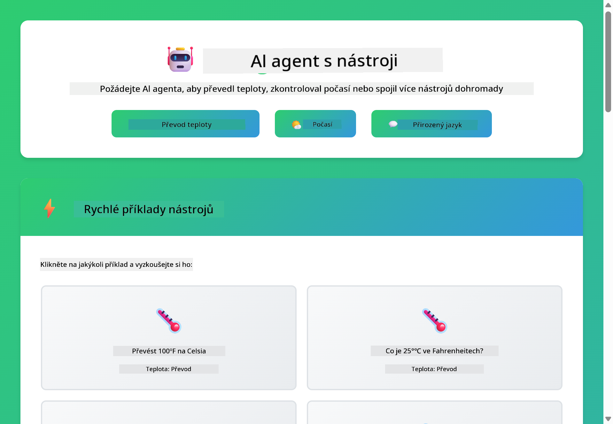

<!--
CO_OP_TRANSLATOR_METADATA:
{
  "original_hash": "13ec450c12cdd1a863baa2b778f27cd7",
  "translation_date": "2025-12-31T04:19:14+00:00",
  "source_file": "04-tools/README.md",
  "language_code": "cs"
}
-->
# Module 04: AI agenti s nástroji

## Table of Contents

- [Co se naučíte](../../../04-tools)
- [Požadavky](../../../04-tools)
- [Pochopení AI agentů s nástroji](../../../04-tools)
- [Jak volání nástrojů funguje](../../../04-tools)
  - [Definice nástrojů](../../../04-tools)
  - [Rozhodování](../../../04-tools)
  - [Vykonání](../../../04-tools)
  - [Generování odpovědí](../../../04-tools)
- [Řetězení nástrojů](../../../04-tools)
- [Spusťte aplikaci](../../../04-tools)
- [Používání aplikace](../../../04-tools)
  - [Vyzkoušejte jednoduché použití nástroje](../../../04-tools)
  - [Otestujte řetězení nástrojů](../../../04-tools)
  - [Sledujte tok konverzace](../../../04-tools)
  - [Pozorujte uvažování](../../../04-tools)
  - [Experimentujte s různými dotazy](../../../04-tools)
- [Klíčové pojmy](../../../04-tools)
  - [Vzor ReAct (Reasoning and Acting)](../../../04-tools)
  - [Popisy nástrojů jsou důležité](../../../04-tools)
  - [Správa relací](../../../04-tools)
  - [Ošetření chyb](../../../04-tools)
- [Dostupné nástroje](../../../04-tools)
- [Kdy použít agenty založené na nástrojích](../../../04-tools)
- [Další kroky](../../../04-tools)

## What You'll Learn

Doposud jste se naučili, jak vést konverzace s AI, efektivně strukturovat prompt a zakotvit odpovědi ve vašich dokumentech. Nicméně stále existuje základní omezení: jazykové modely mohou pouze generovat text. Nemohou zkontrolovat počasí, provádět výpočty, dotazovat databáze nebo interagovat s externími systémy.

Nástroje to mění. Když modelu poskytnete funkce, které může volat, proměníte jej z generátoru textu na agenta, který může vykonávat akce. Model rozhodne, kdy potřebuje nástroj, který nástroj použít a jaké parametry předat. Váš kód funkci vykoná a vrátí výsledek. Model začlení tento výsledek do své odpovědi.

## Prerequisites

- Dokončen Modul 01 (Azure OpenAI prostředky nasazeny)
- Soubor `.env` v kořenovém adresáři s Azure přihlašovacími údaji (vytvořený pomocí `azd up` v Modulu 01)

> **Poznámka:** Pokud jste Modulu 01 nedokončili, nejprve postupujte podle tamních pokynů pro nasazení.

## Pochopení AI agentů s nástroji

> **📝 Poznámka:** Termín "agenti" v tomto modulu odkazuje na AI asistenty rozšířené o schopnosti volat nástroje. To se liší od vzorů **Agentic AI** (autonomní agenti s plánováním, pamětí a vícekrokovým uvažováním), které probereme v [Module 05: MCP](../05-mcp/README.md).

AI agent s nástroji následuje vzorec uvažování a jednání (ReAct):

1. Uživatel položí otázku
2. Agent uvažuje o tom, co potřebuje vědět
3. Agent rozhodne, zda potřebuje nástroj k odpovědi
4. Pokud ano, agent zavolá vhodný nástroj s správnými parametry
5. Nástroj vykoná a vrátí data
6. Agent zahrne výsledek a poskytne konečnou odpověď


*Vzor ReAct - jak si AI agenti střídají uvažování a jednání při řešení problémů*

To probíhá automaticky. Definujete nástroje a jejich popisy. Model se stará o rozhodování, kdy a jak je použít.

## Jak volání nástrojů funguje

**Definice nástrojů** - [WeatherTool.java](../../../04-tools/src/main/java/com/example/langchain4j/agents/tools/WeatherTool.java) | [TemperatureTool.java](../../../04-tools/src/main/java/com/example/langchain4j/agents/tools/TemperatureTool.java)

Definujete funkce s jasnými popisy a specifikacemi parametrů. Model vidí tyto popisy ve svém systémovém promptu a rozumí, co který nástroj dělá.

```java
@Component
public class WeatherTool {
    
    @Tool("Get the current weather for a location")
    public String getCurrentWeather(@P("Location name") String location) {
        // Vaše logika vyhledávání počasí
        return "Weather in " + location + ": 22°C, cloudy";
    }
}

@AiService
public interface Assistant {
    String chat(@MemoryId String sessionId, @UserMessage String message);
}

// Asistent je Spring Bootem automaticky propojen s:
// - ChatModel bean
// - Všechny metody označené @Tool z tříd @Component
// - ChatMemoryProvider pro správu relací
```

> **🤖 Vyzkoušejte s [GitHub Copilot](https://github.com/features/copilot) Chatem:** Otevřete [`WeatherTool.java`](../../../04-tools/src/main/java/com/example/langchain4j/agents/tools/WeatherTool.java) a zeptejte se:
> - "Jak bych integroval skutečné API pro počasí jako OpenWeatherMap místo mock dat?"
> - "Co dělá dobrý popis nástroje, který pomůže AI jej správně použít?"
> - "Jak řeším chyby API a limity rychlosti v implementacích nástrojů?"

**Rozhodování**

Když uživatel položí otázku "Jaké je počasí v Seattlu?", model rozpozná, že potřebuje nástroj pro počasí. Generuje volání funkce s parametrem location nastaveným na "Seattle".

**Vykonání** - [AgentService.java](../../../04-tools/src/main/java/com/example/langchain4j/agents/service/AgentService.java)

Spring Boot automaticky injektuje deklarativní rozhraní `@AiService` se všemi registrovanými nástroji a LangChain4j vykonává volání nástrojů automaticky.

> **🤖 Vyzkoušejte s [GitHub Copilot](https://github.com/features/copilot) Chatem:** Otevřete [`AgentService.java`](../../../04-tools/src/main/java/com/example/langchain4j/agents/service/AgentService.java) a zeptejte se:
> - "Jak funguje vzor ReAct a proč je efektivní pro AI agenty?"
> - "Jak se agent rozhoduje, který nástroj použít a v jakém pořadí?"
> - "Co se stane, když selže vykonání nástroje - jak robustně řešit chyby?"

**Generování odpovědí**

Model obdrží data o počasí a naformátuje je do přirozeného jazyka pro uživatele.

### Proč používat deklarativní AI služby?

Tento modul používá integraci LangChain4j se Spring Bootem s deklarativními rozhraními `@AiService`:

- **Spring Boot automatické injektování** - ChatModel a nástroje jsou automaticky vloženy
- **Vzor `@MemoryId`** - Automatická správa paměti založená na relacích
- **Jedna instance** - Asistent vytvořený jednou a znovu použitý pro lepší výkon
- **Typově bezpečné vykonání** - Java metody jsou volány přímo s převodem typů
- **Orchestrace více kroků** - Automaticky zpracovává řetězení nástrojů
- **Žádný zbytečný kód** - Bez manuálních volání AiServices.builder() nebo HashMap paměti

Alternativní přístupy (manuální `AiServices.builder()`) vyžadují více kódu a postrádají výhody integrace se Spring Bootem.

## Řetězení nástrojů

**Řetězení nástrojů** - AI může volat více nástrojů za sebou. Zeptejte se "Jaké je počasí v Seattlu a mám si vzít deštník?" a sledujte, jak řetězí `getCurrentWeather` s uvažováním o oblečení proti dešti.

<a href="images/tool-chaining.png"></a>

*Sekvenční volání nástrojů - výstup jednoho nástroje slouží jako vstup pro další rozhodnutí*

**Elegantní selhání** - Zeptejte se na počasí ve městě, které není v mock datech. Nástroj vrátí chybovou zprávu a AI vysvětlí, že nemůže pomoci. Nástroje selhávají bezpečně.

To proběhne v jednom dialogovém kroku. Agent autonomně orchestruje více volání nástrojů.

## Spusťte aplikaci

**Ověření nasazení:**

Ujistěte se, že soubor `.env` existuje v kořenovém adresáři s Azure přihlašovacími údaji (vytvořeno během Modulu 01):
```bash
cat ../.env  # Mělo by zobrazit AZURE_OPENAI_ENDPOINT, API_KEY, DEPLOYMENT
```

**Spusťte aplikaci:**

> **Poznámka:** Pokud jste již spustili všechny aplikace pomocí `./start-all.sh` z Modulu 01, tento modul již běží na portu 8084. Můžete přeskočit níže uvedené příkazy a přejít přímo na http://localhost:8084.

**Možnost 1: Použití řídicího panelu Spring Boot (doporučeno pro uživatele VS Code)**

Dev kontejner obsahuje rozšíření Spring Boot Dashboard, které poskytuje vizuální rozhraní pro správu všech Spring Boot aplikací. Najdete jej v postranním panelu na levé straně VS Code (hledejte ikonu Spring Boot).

Z řídicího panelu Spring Boot můžete:
- Vidět všechny dostupné Spring Boot aplikace v workspace
- Spouštět/zastavovat aplikace jedním kliknutím
- Zobrazovat logy aplikací v reálném čase
- Monitorovat stav aplikací

Jednoduše klikněte na tlačítko přehrát vedle "tools" pro spuštění tohoto modulu, nebo spusťte všechny moduly najednou.


**Možnost 2: Použití shell skriptů**

Spusťte všechny webové aplikace (moduly 01-04):

**Bash:**
```bash
cd ..  # Z kořenového adresáře
./start-all.sh
```

**PowerShell:**
```powershell
cd ..  # Z kořenového adresáře
.\start-all.ps1
```

Nebo spusťte pouze tento modul:

**Bash:**
```bash
cd 04-tools
./start.sh
```

**PowerShell:**
```powershell
cd 04-tools
.\start.ps1
```

Oba skripty automaticky načtou proměnné prostředí ze souboru `.env` v kořenovém adresáři a sestaví JARy, pokud neexistují.

> **Poznámka:** Pokud dáváte přednost ručnímu buildu všech modulů před spuštěním:
>
> **Bash:**
> ```bash
> cd ..  # Go to root directory
> mvn clean package -DskipTests
> ```
>
> **PowerShell:**
> ```powershell
> cd ..  # Go to root directory
> mvn clean package -DskipTests
> ```

Otevřete http://localhost:8084 ve svém prohlížeči.

**Pro zastavení:**

**Bash:**
```bash
./stop.sh  # Pouze tento modul
# Nebo
cd .. && ./stop-all.sh  # Všechny moduly
```

**PowerShell:**
```powershell
.\stop.ps1  # Pouze tento modul
# Nebo
cd ..; .\stop-all.ps1  # Všechny moduly
```

## Používání aplikace

Aplikace poskytuje webové rozhraní, kde můžete interagovat s AI agentem, který má přístup k nástrojům pro počasí a převod teplot.

<a href="images/tools-homepage.png"></a>

*Rozhraní AI Agent Tools - rychlé příklady a chatovací rozhraní pro interakci s nástroji*

**Vyzkoušejte jednoduché použití nástroje**

Začněte přímočarým dotazem: "Převést 100 stupňů Fahrenheita na Celsia". Agent rozpozná, že potřebuje nástroj pro převod teploty, zavolá jej se správnými parametry a vrátí výsledek. Všimněte si, jak přirozené to působí - neurčili jste, který nástroj použít ani jak jej volat.

**Otestujte řetězení nástrojů**

Zkuste něco složitějšího: "Jaké je počasí v Seattlu a převeďte to na Fahrenheit?" Sledujte, jak agent pracuje v několika krocích. Nejprve získá počasí (vrací se v Celsiích), rozpozná potřebu převést na Fahrenheit, zavolá nástroj pro převod a kombinuje oba výsledky do jedné odpovědi.

**Sledujte tok konverzace**

Chatovací rozhraní uchovává historii konverzace, což umožňuje vícekrokové interakce. Můžete vidět všechny předchozí dotazy a odpovědi, takže je snadné sledovat kontext a pochopit, jak agent buduje kontext přes více výměn.

<a href="images/tools-conversation-demo.png"></a>

*Vícekroková konverzace ukazující jednoduché převody, dotazy na počasí a řetězení nástrojů*

**Experimentujte s různými dotazy**

Vyzkoušejte různé kombinace:
- Dotazy na počasí: "Jaké je počasí v Tokiu?"
- Převody teplot: "Kolik je 25°C v Kelvinech?"
- Kombinované dotazy: "Zkontroluj počasí v Paříži a řekni mi, jestli je nad 20°C"

Všimněte si, jak agent interpretuje přirozený jazyk a mapuje ho na vhodná volání nástrojů.

## Klíčové pojmy

**Vzor ReAct (Reasoning and Acting)**

Agent střídá uvažování (rozhodování, co dělat) a jednání (používání nástrojů). Tento vzor umožňuje autonomní řešení problémů místo pouhého odpovídání na instrukce.

**Popisy nástrojů jsou důležité**

Kvalita vašich popisů nástrojů přímo ovlivňuje, jak dobře je agent použije. Jasné, konkrétní popisy pomáhají modelu pochopit, kdy a jak zavolat každý nástroj.

**Správa relací**

Anotace `@MemoryId` umožňuje automatickou správu paměti založenou na relacích. Každé ID relace získá vlastní instanci `ChatMemory` spravovanou beanem `ChatMemoryProvider`, čímž odpadá potřeba ručního sledování paměti.

**Ošetření chyb**

Nástroje mohou selhat - API mohou vypršet, parametry mohou být neplatné, externí služby mohou padnout. Produkční agenti potřebují ošetření chyb, aby model mohl vysvětlit problémy nebo zkusit alternativy.

## Dostupné nástroje

**Nástroje pro počasí** (mock data pro demonstraci):
- Získat aktuální počasí pro lokaci
- Získat vícedenní předpověď

**Nástroje pro převod teploty**:
- Celsia na Fahrenheit
- Fahrenheit na Celsia
- Celsia na Kelvin
- Kelvin na Celsia
- Fahrenheit na Kelvin
- Kelvin na Fahrenheit

To jsou jednoduché příklady, ale vzor lze rozšířit na jakoukoli funkci: dotazy do databází, volání API, výpočty, operace se soubory nebo systémové příkazy.

## Kdy použít agenty založené na nástrojích

**Použijte nástroje, když:**
- Odpověď vyžaduje aktuální data (počasí, ceny akcií, inventář)
- Potřebujete provádět výpočty přesahující jednoduchou matematiku
- Přistupujete k databázím nebo API
- Provádíte akce (odesílání e-mailů, vytváření ticketů, aktualizace záznamů)
- Kombinujete více zdrojů dat

**Nepoužívejte nástroje, když:**
- Otázky lze zodpovědět z obecných znalostí
- Odpověď je čistě konverzační
- Latence nástroje by zkušenost příliš zpomalila

## Další kroky

**Další modul:** [05-mcp - Protokol modelového kontextu (MCP)](../05-mcp/README.md)

---

**Navigace:** [← Předchozí: Modul 03 - RAG](../03-rag/README.md) | [Zpět na hlavní](../README.md) | [Další: Modul 05 - MCP →](../05-mcp/README.md)

---

<!-- CO-OP TRANSLATOR DISCLAIMER START -->
Zřeknutí se odpovědnosti:
Tento dokument byl přeložen pomocí AI překladatelské služby Co-op Translator (https://github.com/Azure/co-op-translator). Ačkoli usilujeme o co největší přesnost, vezměte prosím na vědomí, že automatické překlady mohou obsahovat chyby nebo nepřesnosti. Originální dokument v jeho původním jazyce by měl být považován za závazný zdroj. Pro zásadní informace doporučujeme využít profesionální lidský překlad. Nezodpovídáme za jakákoli nedorozumění nebo mylné výklady vyplývající z použití tohoto překladu.
<!-- CO-OP TRANSLATOR DISCLAIMER END -->