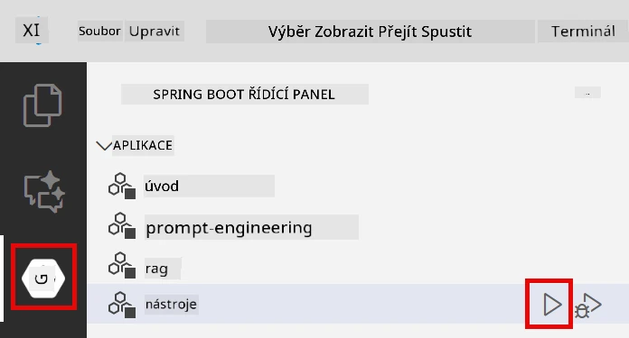
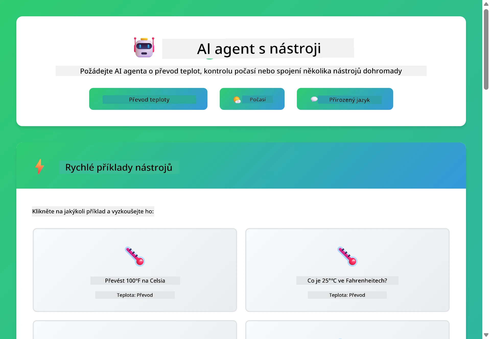
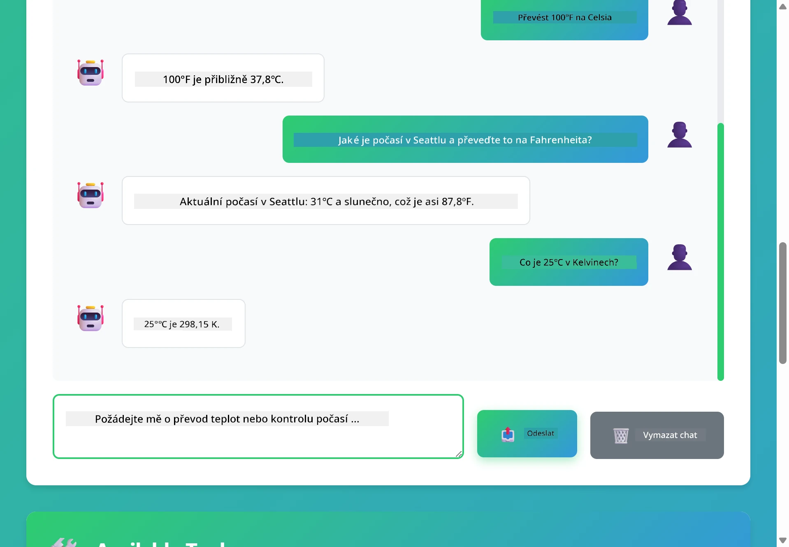

# Modul 04: AI agenti s nástroji

## Obsah

- [Video průvodce](#video-průvodce)
- [Co se naučíte](#co-se-naučíte)
- [Předpoklady](#předpoklady)
- [Pochopení AI agentů s nástroji](#pochopení-ai-agentů-s-nástroji)
- [Jak funguje volání nástrojů](#jak-funguje-volání-nástrojů)
  - [Definice nástrojů](#definice-nástrojů)
  - [Rozhodování](#rozhodování)
  - [Provedení](#provedení)
  - [Generování odpovědi](#generování-odpovědi)
  - [Architektura: Spring Boot Auto-Wiring](#architektura-spring-boot-auto-wiring)
- [Řetězení nástrojů](#řetězení-nástrojů)
- [Spuštění aplikace](#spuštění-aplikace)
- [Používání aplikace](#použití-aplikace)
  - [Vyzkoušejte jednoduché použití nástroje](#vyzkoušejte-jednoduché-použití-nástroje)
  - [Testujte řetězení nástrojů](#otestujte-řetězení-nástrojů)
  - [Sledujte průběh konverzace](#sledujte-tok-konverzace)
  - [Experimentujte s různými požadavky](#experimentujte-s-různými-požadavky)
- [Klíčové koncepty](#klíčové-koncepty)
  - [Vzor ReAct (Reasoning and Acting)](#vzor-react-rozumování-a-jednání)
  - [Popisy nástrojů jsou důležité](#popisy-nástrojů-jsou-důležité)
  - [Správa relace](#správa-relací)
  - [Zpracování chyb](#zpracování-chyb)
- [Dostupné nástroje](#dostupné-nástroje)
- [Kdy používat agenty založené na nástrojích](#kdy-používat-agenty-založené-na-nástrojích)
- [Nástroje vs RAG](#nástroje-vs-rag)
- [Další kroky](#další-kroky)

## Video průvodce

Sledujte tuto živou relaci, která vysvětluje, jak začít s tímto modulem:

<a href="https://www.youtube.com/watch?v=O_J30kZc0rw"></a>

## Co se naučíte

Doposud jste se naučili vést konverzace s AI, efektivně strukturovat výzvy a zakládat odpovědi na vašich dokumentech. Přesto existuje základní omezení: jazykové modely mohou generovat pouze text. Nemohou kontrolovat počasí, počítat, dotazovat se do databází ani komunikovat s externími systémy.

Nástroje to mění. Tím, že modelu dáte přístup k funkcím, které může volat, transformujete ho z generátoru textu na agenta, který může konat. Model rozhoduje, kdy potřebuje nástroj, který nástroj použít a jaké parametry předat. Vaše kód provede funkci a vrátí výsledek. Model pak výsledek začlení do své odpovědi.

## Předpoklady

- Dokončen [Modul 01 - Úvod](../01-introduction/README.md) (nasazené zdroje Azure OpenAI)
- Doporučeno dokončit předchozí moduly (tento modul odkazuje na [koncepty RAG z Modulu 03](../03-rag/README.md) v porovnání Nástroje vs RAG)
- Soubor `.env` v kořenovém adresáři s přihlašovacími údaji Azure (vytvořený pomocí `azd up` v Modulu 01)

> **Poznámka:** Pokud jste nedokončili Modul 01, nejprve postupujte podle instalačních pokynů tam.

## Pochopení AI agentů s nástroji

> **📝 Poznámka:** Termín „agenti“ v tomto modulu označuje AI asistenty vylepšené schopností volání nástrojů. To se liší od **Agentic AI** vzorů (autonomní agenti s plánováním, pamětí a vícekrokovým odvozováním), které probereme v [Modulu 05: MCP](../05-mcp/README.md).

Bez nástrojů může jazykový model generovat pouze text ze svých tréninkových dat. Zeptáte-li se na aktuální počasí, musí hádat. Když mu dáte nástroje, může volat API počasí, provádět výpočty nebo dotazovat databázi — a tyto skutečné výsledky začlenit do odpovědi.


*Bez nástrojů model jen hádá – s nástroji může volat API, provádět výpočty a vracet aktuální data.*

AI agent s nástroji následuje vzor **Reasoning and Acting (ReAct)**. Model nejen odpovídá — přemýšlí o tom, co potřebuje, jedná voláním nástroje, sleduje výsledek a rozhoduje, zda jednat znovu nebo poskytnout finální odpověď:

1. **Rozumí** — agent analyzuje otázku uživatele a určuje, jaké informace potřebuje
2. **Jedná** — agent vybere správný nástroj, vytvoří správné parametry a zavolá ho
3. **Sleduje** — agent přijme výstup nástroje a vyhodnotí výsledek
4. **Opakuje nebo odpoví** — pokud je potřeba více dat, agent se vrátí k prvnímu kroku; jinak sestaví odpověď v přirozeném jazyce


*Cyklus ReAct — agent přemýšlí, jak jednat, provádí volání nástroje, sleduje výsledek a opakuje, dokud nemůže poskytnout finální odpověď.*

Tento proces probíhá automaticky. Definujete nástroje a jejich popisy. Model se postará o rozhodování, kdy a jak je použít.

## Jak funguje volání nástrojů

### Definice nástrojů

[WeatherTool.java](../../../04-tools/src/main/java/com/example/langchain4j/agents/tools/WeatherTool.java) | [TemperatureTool.java](../../../04-tools/src/main/java/com/example/langchain4j/agents/tools/TemperatureTool.java)

Definujete funkce s jasnými popisy a specifikacemi parametrů. Model tyto popisy vidí ve svém systémovém promptu a rozumí, k čemu každý nástroj slouží.

```java
@Component
public class WeatherTool {
    
    @Tool("Get the current weather for a location")
    public String getCurrentWeather(@P("Location name") String location) {
        // Vaše logika vyhledávání počasí
        return "Weather in " + location + ": 22°C, cloudy";
    }
}

@AiService
public interface Assistant {
    String chat(@MemoryId String sessionId, @UserMessage String message);
}

// Asistent je automaticky propojen pomocí Spring Boot s:
// - ChatModel bean
// - Všechny metody @Tool z tříd označených @Component
// - ChatMemoryProvider pro správu relací
```

Níže uvedený diagram rozebírá každou anotaci a ukazuje, jak každý prvek pomáhá AI pochopit, kdy nástroj volat a jaké argumenty předat:


*Anatomie definice nástroje — @Tool řekne AI, kdy ho použít, @P popisuje každý parametr a @AiService vše při spuštění propojí.*

> **🤖 Vyzkoušejte s [GitHub Copilot](https://github.com/features/copilot) Chat:** Otevřete [`WeatherTool.java`](../../../04-tools/src/main/java/com/example/langchain4j/agents/tools/WeatherTool.java) a zeptejte se:
> - "Jak bych integroval reálné API počasí jako OpenWeatherMap místo simulovaných dat?"
> - "Co tvoří dobrý popis nástroje, který pomůže AI použít ho správně?"
> - "Jak řešit chyby API a limity volání v implementaci nástrojů?"

### Rozhodování

Když uživatel položí otázku „Jaké je počasí v Seattlu?“, model náhodně nenabízí nástroj. Porovnává uživatelův záměr s popisy všech nástrojů, které má k dispozici, hodnotí každý podle relevance a vybere nejlepší shodu. Poté vygeneruje strukturované volání funkce s odpovídajícími parametry – v tomto případě nastaví `location` na `"Seattle"`.

Pokud žádný nástroj neodpovídá požadavku uživatele, model odpovídá ze svých znalostí. Pokud jich odpovídá více, vybere ten nejkonkrétnější.


*Model hodnotí každý dostupný nástroj vzhledem k záměru uživatele a vybírá nejlepší shodu — proto je důležité psát jasné, konkrétní popisy nástrojů.*

### Provedení

[AgentService.java](../../../04-tools/src/main/java/com/example/langchain4j/agents/service/AgentService.java)

Spring Boot automaticky propojí deklarativní rozhraní `@AiService` se všemi registrovanými nástroji a LangChain4j provádí volání nástrojů automaticky. Za scénou prochází celé volání nástroje šesti fázemi – od uživatelovy otázky v přirozeném jazyce až po odpověď také v přirozeném jazyce:


*Konečný tok — uživatel položí otázku, model vybere nástroj, LangChain4j ho spustí a model výsledek začlení do odpovědi.*

Pod kapotou `AiServices` provádí stejnou smyčku volání nástrojů pro libovolný nástroj — zde znázorněno na jednoduchém `Calculator`. Níže uvedený sekvenční diagram ukazuje přesně, co se děje:


*Smyčka volání nástrojů — `AiServices` posílá vaši zprávu a schémata nástrojů do LLM, LLM odpoví voláním funkce jako `add(42, 58)`, LangChain4j provede metodu `Calculator` lokálně a výsledek vrací zpět pro konečnou odpověď.*

> **🤖 Vyzkoušejte s [GitHub Copilot](https://github.com/features/copilot) Chat:** Otevřete [`AgentService.java`](../../../04-tools/src/main/java/com/example/langchain4j/agents/service/AgentService.java) a zeptejte se:
> - "Jak funguje vzor ReAct a proč je efektivní pro AI agenty?"
> - "Jak agent rozhoduje, který nástroj použít a v jakém pořadí?"
> - "Co se stane, pokud se provedení nástroje nezdaří – jak robustně řešit chyby?"

### Generování odpovědi

Model obdrží data o počasí a formátuje je do odpovědi v přirozeném jazyce pro uživatele.

### Architektura: Spring Boot Auto-Wiring

Tento modul používá integraci LangChain4j se Spring Bootem s deklarativními rozhraními `@AiService`. Při spuštění Spring Boot detekuje všechny `@Component` obsahující metody s `@Tool`, váš `ChatModel` bean a `ChatMemoryProvider` — a pak je všechny propojí do jediného rozhraní `Assistant` bez potřeby boilterplate kódu.


*Rozhraní @AiService spojuje ChatModel, komponenty nástrojů a poskytovatele paměti — Spring Boot vše propojuje automaticky.*

Zde je celý životní cyklus požadavku jako sekvenční diagram — od HTTP požadavku přes controller, službu a auto-vázaný proxy až po provedení nástroje a zpět:


*Kompletní životní cyklus požadavku ve Spring Bootu — HTTP požadavek prochází přes controller a službu k auto-vázanému proxy Asistenta, který automaticky koordinuje LLM a volání nástrojů.*

Klíčové výhody tohoto přístupu:

- **Spring Boot auto-wiring** — ChatModel a nástroje jsou automaticky vloženy
- **vzor @MemoryId** — Automatická správa paměti na bázi relace
- **Jedna instance** — Assistant je vytvořen jednou a opakovaně použit pro lepší výkon
- **Bezpečné typy** — Metody Javy jsou volány přímo s konverzí typů
- **Více kroků orchestrace** — Automaticky zvládá řetězení nástrojů
- **Žádný boilerplate** — Žádné ruční volání `AiServices.builder()` nebo paměťové HashMapy

Alternativní přístupy (ruční `AiServices.builder()`) vyžadují více kódu a postrádají výhody integrace se Spring Bootem.

## Řetězení nástrojů

**Řetězení nástrojů** — Skutečná síla agentů založených na nástrojích se ukáže, když jedna otázka vyžaduje více nástrojů. Zeptejte se „Jaké je počasí v Seattlu ve Fahrenheit?“ a agent automaticky řetězí dva nástroje: nejprve zavolá `getCurrentWeather` pro získání teploty v Celsiích, potom předá tuto hodnotu do `celsiusToFahrenheit` pro převod — to vše v jednom kole konverzace.


*Řetězení nástrojů v akci — agent nejprve volá getCurrentWeather, pak předává výsledek ve Celsiích do celsiusToFahrenheit a poskytne kombinovanou odpověď.*

**Elegantní selhání** — Zeptejte se na počasí ve městě, které není v simulovaných datech. Nástroj vrátí chybovou zprávu a AI vysvětlí, že nemůže pomoci, místo aby spadl program. Nástroje selhávají bezpečně. Níže uvedený diagram porovnává oba přístupy — s řádnou obsluhou chyb agent chybu zachytí a odpoví nápomocně, bez ní celá aplikace spadne:


*Když nástroj selže, agent zachytí chybu a odpoví s užitečným vysvětlením místo pádu aplikace.*

To probíhá v jednom kole konverzace. Agent autonomně orchestruje vícenásobná volání nástrojů.

## Spuštění aplikace

**Ověření nasazení:**

Zkontrolujte, že v kořenovém adresáři existuje soubor `.env` s přihlašovacími údaji Azure (vytvořen během Modulu 01). Spusťte toto z adresáře modulu (`04-tools/`):

**Bash:**
```bash
cat ../.env  # Mělo by zobrazit AZURE_OPENAI_ENDPOINT, API_KEY, DEPLOYMENT
```

**PowerShell:**
```powershell
Get-Content ..\.env  # Mělo by zobrazit AZURE_OPENAI_ENDPOINT, API_KEY, DEPLOYMENT
```

**Spuštění aplikace:**

> **Poznámka:** Pokud jste už spustili všechny aplikace pomocí `./start-all.sh` z kořenového adresáře (jak je popsáno v Modulu 01), tento modul už běží na portu 8084. Můžete přeskočit příkazy ke spuštění níže a jít přímo na http://localhost:8084.

**Možnost 1: Použití Spring Boot Dashboard (doporučeno pro uživatele VS Code)**

Vývojový kontejner obsahuje rozšíření Spring Boot Dashboard, které poskytuje vizuální rozhraní pro správu všech Spring Boot aplikací. Najdete ho v postranním panelu vlevo ve VS Code (ikona Spring Boot).

Ve Spring Boot Dashboard můžete:
- Vidět všechny dostupné Spring Boot aplikace v pracovním prostoru
- Spustit/zastavit aplikace jedním kliknutím
- Zobrazit logy aplikací v reálném čase
- Monitorovat stav aplikací

Jednoduše klikněte na tlačítko přehrávání vedle „tools“ pro spuštění tohoto modulu nebo spusťte všechny moduly najednou.

Takto vypadá Spring Boot Dashboard ve VS Code:


*Spring Boot Dashboard ve VS Code — spuštění, zastavení a monitorování všech modulů na jednom místě*

**Možnost 2: Použití shell skriptů**

Spusťte všechny webové aplikace (moduly 01-04):

**Bash:**
```bash
cd ..  # Z kořenového adresáře
./start-all.sh
```

**PowerShell:**
```powershell
cd ..  # Ze základního adresáře
.\start-all.ps1
```

Nebo spusťte pouze tento modul:

**Bash:**
```bash
cd 04-tools
./start.sh
```

**PowerShell:**
```powershell
cd 04-tools
.\start.ps1
```

Oba skripty automaticky načítají proměnné prostředí z kořenového souboru `.env` a vytvoří JARy, pokud neexistují.

> **Poznámka:** Pokud preferujete ruční sestavení všech modulů před spuštěním:
>
> **Bash:**
> ```bash
> cd ..  # Go to root directory
> mvn clean package -DskipTests
> ```
>
> **PowerShell:**
> ```powershell
> cd ..  # Go to root directory
> mvn clean package -DskipTests
> ```

Otevřete http://localhost:8084 ve svém prohlížeči.

**Pro zastavení:**

**Bash:**
```bash
./stop.sh  # Pouze tento modul
# Nebo
cd .. && ./stop-all.sh  # Všechny moduly
```

**PowerShell:**
```powershell
.\stop.ps1  # Pouze tento modul
# Nebo
cd ..; .\stop-all.ps1  # Všechny moduly
```

## Použití aplikace

Aplikace poskytuje webové rozhraní, kde můžete komunikovat s AI agentem, který má přístup k nástrojům pro počasí a převod teplot. Takto rozhraní vypadá — zahrnuje rychlé příklady a chatovací panel pro odesílání požadavků:

<a href="images/tools-homepage.png"></a>

*Rozhraní AI Agent Tools – rychlé příklady a chatovací rozhraní pro interakci s nástroji*

### Vyzkoušejte jednoduché použití nástroje

Začněte jednoduchým požadavkem: „Převést 100 stupňů Fahrenheita na Celsia“. Agent rozpozná, že potřebuje nástroj pro převod teplot, zavolá ho s správnými parametry a vrátí výsledek. Všimněte si, jak přirozené to působí – neurčili jste, který nástroj použít nebo jak ho vyvolat.

### Otestujte řetězení nástrojů

Nyní zkuste složitější požadavek: „Jaké je počasí v Seattlu a převeď to na Fahrenheit?“ Sledujte, jak agent postupuje krok za krokem. Nejprve získá počasí (které vrací v Celsiích), rozpozná potřebu převodu na Fahrenheit, zavolá převodní nástroj a oba výsledky zkombinuje do jedné odpovědi.

### Sledujte tok konverzace

Chatovací rozhraní uchovává historii konverzace, což umožňuje vícetahové interakce. Můžete vidět všechny předchozí dotazy a odpovědi, což usnadňuje sledování konverzace a pochopení, jak agent buduje kontext během více výměn.

<a href="images/tools-conversation-demo.png"></a>

*Vícetahová konverzace ukazující jednoduché převody, vyhledávání počasí a řetězení nástrojů*

### Experimentujte s různými požadavky

Vyzkoušejte různé kombinace:
- Vyhledávání počasí: „Jaké je počasí v Tokiu?“
- Převody teplot: „Kolik je 25 °C v Kelvinech?“
- Kombinované dotazy: „Zkontroluj počasí v Paříži a řekni mi, jestli je nad 20 °C“

Všimněte si, jak agent interpretuje přirozený jazyk a mapuje ho na vhodné volání nástrojů.

## Klíčové koncepty

### Vzor ReAct (Rozumování a jednání)

Agent střídá fáze rozumování (rozhodování, co dělat) a jednání (použití nástrojů). Tento vzor umožňuje autonomní řešení problémů místo pouhého reagování na pokyny.

### Popisy nástrojů jsou důležité

Kvalita popisů vašich nástrojů přímo ovlivňuje, jak je agent využívá. Jasné, konkrétní popisy pomáhají modelu pochopit, kdy a jak každý nástroj zavolat.

### Správa relací

Anotace `@MemoryId` umožňuje automatickou správu paměti na základě relací. Každé ID relace má vlastní instanci `ChatMemory`, kterou spravuje bean `ChatMemoryProvider`, takže více uživatelů může komunikovat s agentem současně bez prolínání konverzací. Následující diagram ukazuje, jak jsou uživatelé směrováni do izolovaných pamětí podle ID relací:


*Každé ID relace odpovídá izolované historii konverzace — uživatelé nikdy nevidí zprávy ostatních.*

### Zpracování chyb

Nástroje mohou selhat — API může vypršet čas, parametry mohou být neplatné, externí služby mohou být nedostupné. Produkční agenti potřebují zpracování chyb, aby model mohl vysvětlit problémy nebo zkusit alternativy namísto zhroucení celé aplikace. Když nástroj vyhodí výjimku, LangChain4j ji zachytí a předá chybovou zprávu zpět modelu, který pak může problém vysvětlit přirozeným jazykem.

## Dostupné nástroje

Diagram níže ukazuje široký ekosystém nástrojů, které můžete vytvářet. Tento modul demonstruje nástroje pro počasí a teploty, ale stejný vzor `@Tool` funguje pro jakoukoli metodu v Javě — od databázových dotazů po zpracování plateb.


*Každá Java metoda anotovaná `@Tool` se stává dostupnou AI — vzor se rozšiřuje na databáze, API, e-maily, souborové operace a další.*

## Kdy používat agenty založené na nástrojích

Ne každý požadavek vyžaduje nástroje. Rozhodnutí závisí na tom, zda AI potřebuje interagovat s externími systémy, nebo zda může odpovědět ze svých znalostí. Následující průvodce shrnuje, kdy nástroje přidávají hodnotu a kdy jsou zbytečné:


*Rychlý rozhodovací průvodce — nástroje jsou pro data v reálném čase, výpočty a akce; obecné znalosti a kreativní úkoly je nepotřebují.*

## Nástroje vs RAG

Moduly 03 a 04 rozšiřují schopnosti AI, ale zcela odlišnými způsoby. RAG poskytuje modelu přístup ke **znalostem** vyhledáváním dokumentů. Nástroje dávají modelu schopnost podnikat **akce** zavoláním funkcí. Níže je porovnání těchto dvou přístupů vedle sebe — od fungování workflow až po kompromisy mezi nimi:


*RAG vyhledává informace ve statických dokumentech — nástroje vykonávají akce a získávají dynamická, aktuální data. Mnoho produkčních systémů kombinuje obojí.*

V praxi mnoho produkčních systémů kombinuje oba přístupy: RAG pro zakotvení odpovědí v dokumentaci a nástroje pro získávání živých dat nebo provádění operací.

## Další kroky

**Další modul:** [05-mcp - Model Context Protocol (MCP)](../05-mcp/README.md)

---

**Navigace:** [← Předchozí: Modul 03 - RAG](../03-rag/README.md) | [Zpět na hlavní stránku](../README.md) | [Další: Modul 05 - MCP →](../05-mcp/README.md)

---

<!-- CO-OP TRANSLATOR DISCLAIMER START -->
**Prohlášení o omezení odpovědnosti**:
Tento dokument byl přeložen pomocí AI překladatelské služby [Co-op Translator](https://github.com/Azure/co-op-translator). Přestože usilujeme o co největší přesnost, mějte prosím na paměti, že automatizované překlady mohou obsahovat chyby nebo nepřesnosti. Originální dokument v jeho mateřském jazyce by měl být považován za autoritativní zdroj. Pro kritické informace se doporučuje profesionální lidský překlad. Nejsme odpovědní za jakékoli nedorozumění nebo nesprávné interpretace vzniklé použitím tohoto překladu.
<!-- CO-OP TRANSLATOR DISCLAIMER END -->