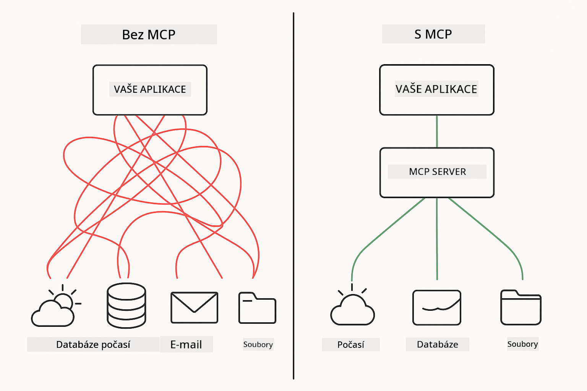
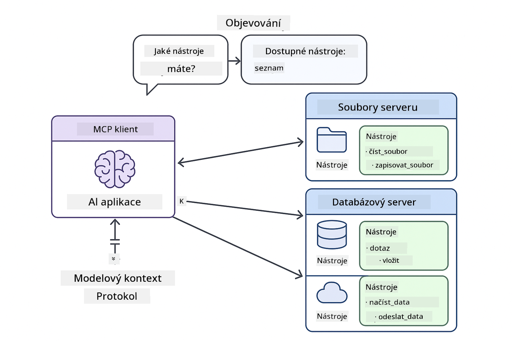

<!--
CO_OP_TRANSLATOR_METADATA:
{
  "original_hash": "c25ec1f10ef156c53e190cdf8b0711ab",
  "translation_date": "2025-12-13T18:03:26+00:00",
  "source_file": "05-mcp/README.md",
  "language_code": "cs"
}
-->
# Modul 05: Protokol kontextu modelu (MCP)

## Obsah

- [Co se naučíte](../../../05-mcp)
- [Pochopení MCP](../../../05-mcp)
- [Jak MCP funguje](../../../05-mcp)
  - [Architektura server-klient](../../../05-mcp)
  - [Objevování nástrojů](../../../05-mcp)
  - [Přenosové mechanismy](../../../05-mcp)
- [Požadavky](../../../05-mcp)
- [Co tento modul pokrývá](../../../05-mcp)
- [Rychlý start](../../../05-mcp)
  - [Příklad 1: Vzdálená kalkulačka (Streamable HTTP)](../../../05-mcp)
  - [Příklad 2: Operace se soubory (Stdio)](../../../05-mcp)
  - [Příklad 3: Analýza Git (Docker)](../../../05-mcp)
- [Klíčové koncepty](../../../05-mcp)
  - [Výběr přenosu](../../../05-mcp)
  - [Objevování nástrojů](../../../05-mcp)
  - [Správa relací](../../../05-mcp)
  - [Meziplatformní úvahy](../../../05-mcp)
- [Kdy použít MCP](../../../05-mcp)
- [Ekosystém MCP](../../../05-mcp)
- [Gratulujeme!](../../../05-mcp)
  - [Co dál?](../../../05-mcp)
- [Řešení problémů](../../../05-mcp)

## Co se naučíte

Postavili jste konverzační AI, zvládli promptování, zakotvili odpovědi v dokumentech a vytvořili agenty s nástroji. Ale všechny tyto nástroje byly na míru vytvořené pro vaši konkrétní aplikaci. Co kdybyste mohli své AI poskytnout přístup ke standardizovanému ekosystému nástrojů, které může kdokoli vytvářet a sdílet?

Protokol kontextu modelu (MCP) poskytuje přesně to - standardní způsob, jak AI aplikace mohou objevovat a používat externí nástroje. Místo psaní vlastních integrací pro každý zdroj dat nebo službu se připojíte k MCP serverům, které vystavují své schopnosti v konzistentním formátu. Váš AI agent pak může tyto nástroje automaticky objevovat a používat.



*Před MCP: složité bodové integrace. Po MCP: jeden protokol, nekonečné možnosti.*

## Pochopení MCP

MCP řeší základní problém ve vývoji AI: každá integrace je na míru. Chcete přistupovat k GitHubu? Vlastní kód. Chcete číst soubory? Vlastní kód. Chcete dotazovat databázi? Vlastní kód. A žádná z těchto integrací nefunguje s jinými AI aplikacemi.

MCP to standardizuje. MCP server vystavuje nástroje s jasnými popisy a schématy. Jakýkoli MCP klient se může připojit, objevit dostupné nástroje a používat je. Postav jednou, používej všude.



*Architektura Protokolu kontextu modelu - standardizované objevování a spouštění nástrojů*

## Jak MCP funguje

**Architektura server-klient**

MCP používá model klient-server. Servery poskytují nástroje - čtení souborů, dotazování databází, volání API. Klienti (vaše AI aplikace) se připojují k serverům a používají jejich nástroje.

**Objevování nástrojů**

Když se váš klient připojí k MCP serveru, zeptá se „Jaké nástroje máte?“ Server odpoví seznamem dostupných nástrojů, každý s popisy a schématy parametrů. Váš AI agent pak může rozhodnout, které nástroje použít na základě požadavků uživatele.

**Přenosové mechanismy**

MCP definuje dva přenosové mechanismy: HTTP pro vzdálené servery, Stdio pro lokální procesy (včetně Docker kontejnerů):


*Přenosové mechanismy MCP: HTTP pro vzdálené servery, Stdio pro lokální procesy (včetně Docker kontejnerů)*

**Streamable HTTP** - [StreamableHttpDemo.java](../../../05-mcp/src/main/java/com/example/langchain4j/mcp/StreamableHttpDemo.java)

Pro vzdálené servery. Vaše aplikace posílá HTTP požadavky na server běžící někde v síti. Používá Server-Sent Events pro komunikaci v reálném čase.

```java
McpTransport httpTransport = new StreamableHttpMcpTransport.Builder()
    .url("http://localhost:3001/mcp")
    .timeout(Duration.ofSeconds(60))
    .logRequests(true)
    .logResponses(true)
    .build();
```

> **🤖 Vyzkoušejte s [GitHub Copilot](https://github.com/features/copilot) Chat:** Otevřete [`StreamableHttpDemo.java`](../../../05-mcp/src/main/java/com/example/langchain4j/mcp/StreamableHttpDemo.java) a zeptejte se:
> - "Jak se MCP liší od přímé integrace nástrojů jako v Modulu 04?"
> - "Jaké jsou výhody používání MCP pro sdílení nástrojů mezi aplikacemi?"
> - "Jak řešit výpadky spojení nebo timeouty u MCP serverů?"

**Stdio** - [StdioTransportDemo.java](../../../05-mcp/src/main/java/com/example/langchain4j/mcp/StdioTransportDemo.java)

Pro lokální procesy. Vaše aplikace spustí server jako podproces a komunikuje přes standardní vstup/výstup. Užitočné pro přístup k souborovému systému nebo příkazové nástroje.

```java
McpTransport stdioTransport = new StdioMcpTransport.Builder()
    .command(List.of(
        npmCmd, "exec",
        "@modelcontextprotocol/server-filesystem@0.6.2",
        resourcesDir
    ))
    .logEvents(false)
    .build();
```

> **🤖 Vyzkoušejte s [GitHub Copilot](https://github.com/features/copilot) Chat:** Otevřete [`StdioTransportDemo.java`](../../../05-mcp/src/main/java/com/example/langchain4j/mcp/StdioTransportDemo.java) a zeptejte se:
> - "Jak funguje Stdio přenos a kdy ho použít oproti HTTP?"
> - "Jak LangChain4j spravuje životní cyklus spuštěných MCP serverových procesů?"
> - "Jaké jsou bezpečnostní dopady poskytnutí AI přístupu k souborovému systému?"

**Docker (používá Stdio)** - [GitRepositoryAnalyzer.java](../../../05-mcp/src/main/java/com/example/langchain4j/mcp/GitRepositoryAnalyzer.java)

Pro kontejnerizované služby. Používá stdio přenos pro komunikaci s Docker kontejnerem přes `docker run`. Vhodné pro složité závislosti nebo izolovaná prostředí.

```java
McpTransport dockerTransport = new StdioMcpTransport.Builder()
    .command(List.of(
        "docker", "run",
        "-e", "GITHUB_PERSONAL_ACCESS_TOKEN=" + System.getenv("GITHUB_TOKEN"),
        "-v", volumeMapping,
        "-i", "mcp/git"
    ))
    .logEvents(true)
    .build();
```

> **🤖 Vyzkoušejte s [GitHub Copilot](https://github.com/features/copilot) Chat:** Otevřete [`GitRepositoryAnalyzer.java`](../../../05-mcp/src/main/java/com/example/langchain4j/mcp/GitRepositoryAnalyzer.java) a zeptejte se:
> - "Jak Docker přenos izoluje MCP servery a jaké jsou výhody?"
> - "Jak nakonfigurovat připojení svazků pro sdílení dat mezi hostitelem a MCP kontejnery?"
> - "Jaké jsou nejlepší postupy pro správu životního cyklu Docker-based MCP serverů v produkci?"

## Spuštění příkladů

### Požadavky

- Java 21+, Maven 3.9+
- Node.js 16+ a npm (pro MCP servery)
- **Docker Desktop** - musí být **SPUŠTĚN** pro Příklad 3 (není dostačující jen instalace)
- GitHub osobní přístupový token nakonfigurovaný v souboru `.env` (z Modulu 00)

> **Poznámka:** Pokud jste ještě nenastavili svůj GitHub token, podívejte se na [Modul 00 - Rychlý start](../00-quick-start/README.md) pro instrukce.

> **⚠️ Uživatelé Dockeru:** Před spuštěním Příkladu 3 ověřte, že Docker Desktop běží příkazem `docker ps`. Pokud vidíte chyby připojení, spusťte Docker Desktop a počkejte cca 30 sekund na inicializaci.

## Rychlý start

**Použití VS Code:** Jednoduše klikněte pravým tlačítkem na jakýkoli demo soubor v Průzkumníku a vyberte **"Run Java"**, nebo použijte spouštěcí konfigurace z panelu Spustit a ladit (nejprve si přidejte token do `.env` souboru).

**Použití Maven:** Alternativně můžete spustit příklady z příkazové řádky podle níže uvedených příkladů.

**⚠️ Důležité:** Některé příklady mají požadavky (např. spuštění MCP serveru nebo sestavení Docker image). Před spuštěním si zkontrolujte požadavky každého příkladu.

### Příklad 1: Vzdálená kalkulačka (Streamable HTTP)

Ukazuje integraci nástrojů přes síť.

**⚠️ Požadavek:** Nejprve musíte spustit MCP server (viz Terminál 1 níže).

**Terminál 1 - Spuštění MCP serveru:**

**Bash:**
```bash
git clone https://github.com/modelcontextprotocol/servers.git
cd servers/src/everything
npm install
node dist/streamableHttp.js
```

**PowerShell:**
```powershell
git clone https://github.com/modelcontextprotocol/servers.git
cd servers/src/everything
npm install
node dist/streamableHttp.js
```

**Terminál 2 - Spuštění příkladu:**

**Použití VS Code:** Klikněte pravým tlačítkem na `StreamableHttpDemo.java` a vyberte **"Run Java"**.

**Použití Maven:**

**Bash:**
```bash
export GITHUB_TOKEN=your_token_here
cd 05-mcp
mvn compile exec:java -Dexec.mainClass=com.example.langchain4j.mcp.StreamableHttpDemo
```

**PowerShell:**
```powershell
$env:GITHUB_TOKEN=your_token_here
cd 05-mcp
mvn --% compile exec:java -Dexec.mainClass=com.example.langchain4j.mcp.StreamableHttpDemo
```

Sledujte, jak agent objeví dostupné nástroje a poté použije kalkulačku pro provedení sčítání.

### Příklad 2: Operace se soubory (Stdio)

Ukazuje nástroje založené na lokálních podprocesech.

**✅ Není potřeba žádné nastavení** - MCP server je spuštěn automaticky.

**Použití VS Code:** Klikněte pravým tlačítkem na `StdioTransportDemo.java` a vyberte **"Run Java"**.

**Použití Maven:**

**Bash:**
```bash
export GITHUB_TOKEN=your_token_here
cd 05-mcp
mvn compile exec:java -Dexec.mainClass=com.example.langchain4j.mcp.StdioTransportDemo
```

**PowerShell:**
```powershell
$env:GITHUB_TOKEN=your_token_here
cd 05-mcp
mvn --% compile exec:java -Dexec.mainClass=com.example.langchain4j.mcp.StdioTransportDemo
```

Aplikace automaticky spustí MCP server pro souborový systém a přečte lokální soubor. Všimněte si, jak je správa podprocesu zajištěna za vás.

**Očekávaný výstup:**
```
Assistant response: The content of the file is "Kaboom!".
```

### Příklad 3: Analýza Git (Docker)

Ukazuje servery nástrojů v kontejnerech.

**⚠️ Požadavky:** 
1. **Docker Desktop musí být SPUŠTĚN** (není dostačující jen instalace)
2. **Uživatelé Windows:** Doporučen režim WSL 2 (Nastavení Docker Desktop → Obecné → "Použít engine založený na WSL 2"). Režim Hyper-V vyžaduje manuální konfiguraci sdílení souborů.
3. Nejprve musíte sestavit Docker image (viz Terminál 1 níže)

**Ověření, že Docker běží:**

**Bash:**
```bash
docker ps  # Měla by zobrazit seznam kontejnerů, ne chybu
```

**PowerShell:**
```powershell
docker ps  # Měla by zobrazit seznam kontejnerů, ne chybu
```

Pokud vidíte chybu jako „Nelze se připojit k Docker daemon“ nebo „Systém nemůže najít zadaný soubor“, spusťte Docker Desktop a počkejte na inicializaci (~30 sekund).

**Řešení problémů:**
- Pokud AI hlásí prázdné repozitáře nebo žádné soubory, připojení svazku (`-v`) nefunguje.
- **Uživatelé Windows Hyper-V:** Přidejte adresář projektu do Nastavení Docker Desktop → Zdroje → Sdílení souborů a restartujte Docker Desktop.
- **Doporučené řešení:** Přepněte na režim WSL 2 pro automatické sdílení souborů (Nastavení → Obecné → povolit "Použít engine založený na WSL 2").

**Terminál 1 - Sestavení Docker image:**

**Bash:**
```bash
cd servers/src/git
docker build -t mcp/git .
```

**PowerShell:**
```powershell
cd servers/src/git
docker build -t mcp/git .
```

**Terminál 2 - Spuštění analyzátoru:**

**Použití VS Code:** Klikněte pravým tlačítkem na `GitRepositoryAnalyzer.java` a vyberte **"Run Java"**.

**Použití Maven:**

**Bash:**
```bash
export GITHUB_TOKEN=your_token_here
cd 05-mcp
mvn compile exec:java -Dexec.mainClass=com.example.langchain4j.mcp.GitRepositoryAnalyzer
```

**PowerShell:**
```powershell
$env:GITHUB_TOKEN=your_token_here
cd 05-mcp
mvn --% compile exec:java -Dexec.mainClass=com.example.langchain4j.mcp.GitRepositoryAnalyzer
```

Aplikace spustí Docker kontejner, připojí váš repozitář a analyzuje strukturu a obsah repozitáře prostřednictvím AI agenta.

## Klíčové koncepty

**Výběr přenosu**

Vyberte podle toho, kde vaše nástroje žijí:
- Vzdálené služby → Streamable HTTP
- Lokální souborový systém → Stdio
- Složité závislosti → Docker

**Objevování nástrojů**

MCP klienti automaticky objevují dostupné nástroje při připojení. Váš AI agent vidí popisy nástrojů a rozhoduje, které použít na základě požadavku uživatele.

**Správa relací**

Streamable HTTP přenos udržuje relace, umožňující stavové interakce s vzdálenými servery. Stdio a Docker přenosy jsou obvykle bezstavové.

**Meziplatformní úvahy**

Příklady automaticky řeší rozdíly mezi platformami (rozdíly v příkazech Windows vs Unix, převody cest pro Docker). To je důležité pro produkční nasazení v různých prostředích.

## Kdy použít MCP

**Použijte MCP, když:**
- Chcete využít existující ekosystémy nástrojů
- Stavíte nástroje, které budou používat různé aplikace
- Integrujete služby třetích stran se standardními protokoly
- Potřebujete měnit implementace nástrojů bez změn kódu

**Použijte vlastní nástroje (Modul 04), když:**
- Stavíte funkčnost specifickou pro aplikaci
- Je kritický výkon (MCP přidává režii)
- Vaše nástroje jsou jednoduché a nebudou znovu použity
- Potřebujete plnou kontrolu nad vykonáváním

## Ekosystém MCP

Protokol kontextu modelu je otevřený standard s rostoucím ekosystémem:

- Oficiální MCP servery pro běžné úkoly (souborový systém, Git, databáze)
- Servery přispěné komunitou pro různé služby
- Standardizované popisy nástrojů a schémata
- Kompatibilita napříč frameworky (funguje s jakýmkoli MCP klientem)

Tato standardizace znamená, že nástroje vytvořené pro jednu AI aplikaci fungují i s jinými, čímž vzniká sdílený ekosystém schopností.

## Gratulujeme!

Dokončili jste kurz LangChain4j pro začátečníky. Naučili jste se:

- Jak stavět konverzační AI s pamětí (Modul 01)
- Vzory promptování pro různé úkoly (Modul 02)
- Zakotvení odpovědí ve vašich dokumentech pomocí RAG (Modul 03)
- Vytváření AI agentů s vlastními nástroji (Modul 04)
- Integraci standardizovaných nástrojů přes MCP (Modul 05)

Nyní máte základy pro tvorbu produkčních AI aplikací. Koncepty, které jste se naučili, platí bez ohledu na konkrétní frameworky nebo modely - jsou to základní vzory v AI inženýrství.

### Co dál?

Po dokončení modulů prozkoumejte [Průvodce testováním](../docs/TESTING.md), kde uvidíte koncepty testování LangChain4j v praxi.

**Oficiální zdroje:**
- [Dokumentace LangChain4j](https://docs.langchain4j.dev/) - komplexní návody a API reference
- [LangChain4j GitHub](https://github.com/langchain4j/langchain4j) - zdrojový kód a příklady
- [LangChain4j Tutoriály](https://docs.langchain4j.dev/tutorials/) - krok za krokem návody pro různé případy použití

Děkujeme, že jste dokončili tento kurz!

---

**Navigace:** [← Předchozí: Modul 04 - Nástroje](../04-tools/README.md) | [Zpět na hlavní stránku](../README.md)

---

## Řešení problémů

### Syntaxe příkazu Maven v PowerShellu
**Problém**: Příkazy Maven selhávají s chybou `Unknown lifecycle phase ".mainClass=..."`

**Příčina**: PowerShell interpretuje `=` jako operátor přiřazení proměnné, což narušuje syntaxi vlastností Maven

**Řešení**: Použijte operátor zastavení parsování `--%` před příkazem Maven:

**PowerShell:**
```powershell
mvn --% compile exec:java -Dexec.mainClass=com.example.langchain4j.mcp.StreamableHttpDemo
```

**Bash:**
```bash
mvn compile exec:java -Dexec.mainClass=com.example.langchain4j.mcp.StreamableHttpDemo
```

Operátor `--%` říká PowerShellu, aby všechny zbývající argumenty předal Maven doslovně bez interpretace.

### Problémy s připojením k Dockeru

**Problém**: Příkazy Docker selhávají s hláškou "Cannot connect to Docker daemon" nebo "The system cannot find the file specified"

**Příčina**: Docker Desktop neběží nebo není plně inicializován

**Řešení**: 
1. Spusťte Docker Desktop
2. Počkejte přibližně 30 sekund na plnou inicializaci
3. Ověřte pomocí `docker ps` (mělo by zobrazit seznam kontejnerů, nikoli chybu)
4. Poté spusťte svůj příklad

### Připojování svazků Docker ve Windows

**Problém**: Analyzátor Git repozitáře hlásí prázdný repozitář nebo žádné soubory

**Příčina**: Připojení svazku (`-v`) nefunguje kvůli konfiguraci sdílení souborů

**Řešení**:
- **Doporučeno:** Přepněte na režim WSL 2 (Nastavení Docker Desktop → Obecné → "Use the WSL 2 based engine")
- **Alternativa (Hyper-V):** Přidejte adresář projektu do Nastavení Docker Desktop → Zdroje → Sdílení souborů, poté restartujte Docker Desktop

---

<!-- CO-OP TRANSLATOR DISCLAIMER START -->
**Prohlášení o vyloučení odpovědnosti**:  
Tento dokument byl přeložen pomocí AI překladatelské služby [Co-op Translator](https://github.com/Azure/co-op-translator). Přestože usilujeme o přesnost, mějte prosím na paměti, že automatizované překlady mohou obsahovat chyby nebo nepřesnosti. Původní dokument v jeho mateřském jazyce by měl být považován za autoritativní zdroj. Pro kritické informace se doporučuje profesionální lidský překlad. Nejsme odpovědní za jakékoliv nedorozumění nebo nesprávné výklady vyplývající z použití tohoto překladu.
<!-- CO-OP TRANSLATOR DISCLAIMER END -->