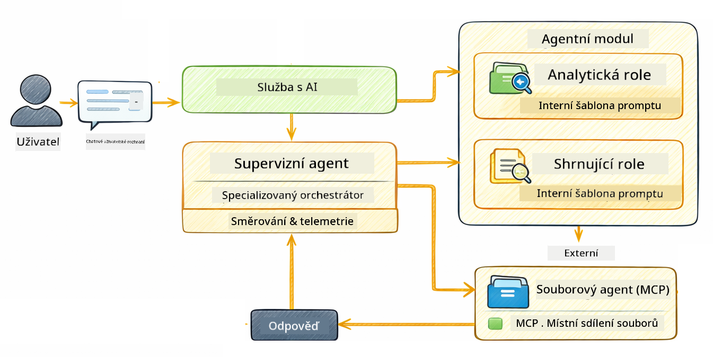

<!--
CO_OP_TRANSLATOR_METADATA:
{
  "original_hash": "f89f4c106d110e4943c055dd1a2f1dff",
  "translation_date": "2025-12-31T04:15:53+00:00",
  "source_file": "05-mcp/README.md",
  "language_code": "cs"
}
-->
# Modul 05: Model Context Protocol (MCP)

## Obsah

- [Co se naučíte](../../../05-mcp)
- [Co je MCP?](../../../05-mcp)
- [Jak MCP funguje](../../../05-mcp)
- [Agentický modul](../../../05-mcp)
- [Spouštění příkladů](../../../05-mcp)
  - [Požadavky](../../../05-mcp)
- [Rychlý start](../../../05-mcp)
  - [Operace se soubory (Stdio)](../../../05-mcp)
  - [Supervisor Agent](../../../05-mcp)
    - [Porozumění výstupu](../../../05-mcp)
    - [Vysvětlení funkcí Agentic modulu](../../../05-mcp)
- [Klíčové koncepty](../../../05-mcp)
- [Gratulujeme!](../../../05-mcp)
  - [Co dál?](../../../05-mcp)

## Co se naučíte

Vytvořili jste konverzační AI, zvládli práci s promptami, ukotvili odpovědi v dokumentech a vytvořili agenty s nástroji. Ale všechny tyto nástroje byly vlastně přizpůsobeny pro vaši konkrétní aplikaci. Co kdybyste mohli dát své AI přístup ke standardizovanému ekosystému nástrojů, které může kdokoliv vytvořit a sdílet? V tomto modulu se naučíte přesně to s Model Context Protocol (MCP) a agentickým modulem LangChain4j. Nejprve ukážeme jednoduchý MCP čtečku souborů a potom předvedeme, jak se snadno integruje do pokročilých agentických pracovních postupů pomocí vzoru Supervisor Agent.

## Co je MCP?

Model Context Protocol (MCP) poskytuje přesně to — standardní způsob, jak mohou AI aplikace objevovat a používat externí nástroje. Místo psaní vlastních integrací pro každý zdroj dat nebo službu se připojíte k MCP serverům, které zveřejňují své schopnosti ve konzistentním formátu. Váš AI agent pak může tyto nástroje automaticky objevit a použít.


*Před MCP: složité bodové integrace. Po MCP: jeden protokol, nekonečné možnosti.*

MCP řeší základní problém v AI vývoji: každá integrace je vlastní. Chcete přistupovat k GitHubu? Vlastní kód. Chcete číst soubory? Vlastní kód. Chcete dotazovat databázi? Vlastní kód. A žádné z těchto integrací nefungují s jinými AI aplikacemi.

MCP to standardizuje. MCP server vystavuje nástroje s jasnými popisy a schématy parametrů. Jakýkoliv MCP klient se může připojit, objevit dostupné nástroje a použít je. Vytvořte jednou, použijte všude.


*Architektura Model Context Protocol - standardizované objevování a spuštění nástrojů*

## Jak MCP funguje

**Architektura server-klient**

MCP používá model klient-server. Servery poskytují nástroje - čtení souborů, dotazování databází, volání API. Klienti (vaše AI aplikace) se připojují k serverům a používají jejich nástroje.

To použijete MCP s LangChain4j, přidejte tuto Maven závislost:

```xml
<dependency>
    <groupId>dev.langchain4j</groupId>
    <artifactId>langchain4j-mcp</artifactId>
    <version>${langchain4j.version}</version>
</dependency>
```

**Objevování nástrojů**

Když se váš klient připojí k MCP serveru, ptá se "Jaké nástroje máte?" Server odpoví seznamem dostupných nástrojů, každý s popisem a schématem parametrů. Váš AI agent se pak rozhodne, které nástroje použije na základě požadavku uživatele.

**Přenosové mechanismy**

MCP podporuje různé přenosové mechanismy. Tento modul demonstruje Stdio transport pro lokální procesy:


*MCP přenosové mechanismy: HTTP pro vzdálené servery, Stdio pro lokální procesy*

**Stdio** - [StdioTransportDemo.java](../../../05-mcp/src/main/java/com/example/langchain4j/mcp/StdioTransportDemo.java)

Pro lokální procesy. Vaše aplikace spustí server jako podproces a komunikuje přes standardní vstup/výstup. Užitečné pro přístup k souborovému systému nebo nástroje příkazové řádky.

```java
McpTransport stdioTransport = new StdioMcpTransport.Builder()
    .command(List.of(
        npmCmd, "exec",
        "@modelcontextprotocol/server-filesystem@2025.12.18",
        resourcesDir
    ))
    .logEvents(false)
    .build();
```

> **🤖 Vyzkoušejte s [GitHub Copilot](https://github.com/features/copilot) Chat:** Otevřete [`StdioTransportDemo.java`](../../../05-mcp/src/main/java/com/example/langchain4j/mcp/StdioTransportDemo.java) a zeptejte se:
> - "Jak funguje Stdio transport a kdy bych ho měl používat oproti HTTP?"
> - "Jak LangChain4j spravuje životní cyklus spuštěných MCP serverových procesů?"
> - "Jaké jsou bezpečnostní dopady, když AI má přístup k souborovému systému?"

## Agentický modul

Zatímco MCP poskytuje standardizované nástroje, LangChain4jův **agentic modul** poskytuje deklarativní způsob, jak budovat agenty, kteří tyto nástroje orchestrují. Anotace `@Agent` a `AgenticServices` vám umožňují definovat chování agenta pomocí rozhraní místo imperativního kódu.

V tomto modulu prozkoumáte vzor **Supervisor Agent** — pokročilý agentický přístup, kde "supervisor" agent dynamicky rozhoduje, které pod-agenty vyvolat na základě požadavků uživatele. Kombinujeme oba koncepty tak, že jednomu z našich pod-agentů dáme schopnost přístupu k souborům pomocí MCP.

Aby to fungovalo s agentickým modulem, přidejte tuto Maven závislost:

```xml
<dependency>
    <groupId>dev.langchain4j</groupId>
    <artifactId>langchain4j-agentic</artifactId>
    <version>${langchain4j.mcp.version}</version>
</dependency>
```

> **⚠️ Experimentální:** Modul `langchain4j-agentic` je **experimentální** a může se měnit. Stabilním způsobem, jak budovat AI asistenty, zůstává `langchain4j-core` s vlastními nástroji (Modul 04).

## Spouštění příkladů

### Požadavky

- Java 21+, Maven 3.9+
- Node.js 16+ a npm (pro MCP servery)
- Proměnné prostředí nakonfigurované v souboru `.env` (z kořenového adresáře):
  - **Pro StdioTransportDemo:** `GITHUB_TOKEN` (GitHub Personal Access Token)
  - **Pro SupervisorAgentDemo:** `AZURE_OPENAI_ENDPOINT`, `AZURE_OPENAI_API_KEY`, `AZURE_OPENAI_DEPLOYMENT` (stejné jako v Modulech 01-04)

> **Poznámka:** Pokud jste ještě nenakonfigurovali proměnné prostředí, podívejte se na [Module 00 - Quick Start](../00-quick-start/README.md) pro instrukce, nebo zkopírujte `.env.example` do `.env` v kořenovém adresáři a vyplňte své hodnoty.

## Rychlý start

**Použití VS Code:** Jednoduše klikněte pravým tlačítkem na libovolný demo soubor v Průzkumníku a vyberte **"Run Java"**, nebo použijte spouštěcí konfigurace z panelu Run and Debug (ujistěte se, že jste nejprve přidali svůj token do souboru `.env`).

**Použití Maven:** Alternativně můžete spouštět z příkazové řádky pomocí níže uvedených příkladů.

### Operace se soubory (Stdio)

Toto demonstruje nástroje založené na lokálních podprocesech.

**✅ Není potřeba žádných předpokladů** - MCP server je spuštěn automaticky.

**Použití VS Code:** Klikněte pravým tlačítkem na `StdioTransportDemo.java` a vyberte **"Run Java"**.

**Použití Maven:**

**Bash:**
```bash
export GITHUB_TOKEN=your_token_here
cd 05-mcp
mvn compile exec:java -Dexec.mainClass=com.example.langchain4j.mcp.StdioTransportDemo
```

**PowerShell:**
```powershell
$env:GITHUB_TOKEN=your_token_here
cd 05-mcp
mvn --% compile exec:java -Dexec.mainClass=com.example.langchain4j.mcp.StdioTransportDemo
```

Aplikace automaticky spustí filesystem MCP server a přečte místní soubor. Všimněte si, jak je správa podprocesů vyřešena za vás.

**Očekávaný výstup:**
```
Assistant response: The file provides an overview of LangChain4j, an open-source Java library
for integrating Large Language Models (LLMs) into Java applications...
```

### Supervisor Agent




Vzor **Supervisor Agent** je **flexibilní** forma agentické AI. Na rozdíl od deterministických pracovních postupů (sekvenční, smyčka, paralelní) Supervisor používá LLM, aby autonomně rozhodl, které agenty vyvolat na základě požadavku uživatele.

**Kombinace Supervisora s MCP:** V tomto příkladu dáváme `FileAgent` přístup k MCP nástrojům souborového systému pomocí `toolProvider(mcpToolProvider)`. Když uživatel požádá o "přečtení a analýzu souboru", Supervisor analyzuje požadavek a vygeneruje plán provedení. Poté směruje požadavek na `FileAgent`, který použije MCP nástroj `read_file` k získání obsahu. Supervisor předá tento obsah `AnalysisAgent`, aby ho interpretoval, a volitelně vyvolá `SummaryAgent`, aby výsledky zestručnil.

To ukazuje, jak se MCP nástroje bezproblémově integrují do agentických pracovních postupů — Supervisor nemusí vědět, jak se soubory čtou, pouze že `FileAgent` to dokáže. Supervisor se dynamicky přizpůsobuje různým typům požadavků a vrací buď odpověď posledního agenta, nebo shrnutí všech operací.

**Použití startovacích skriptů (doporučeno):**

Startovací skripty automaticky načtou proměnné prostředí z kořenového souboru `.env`:

**Bash:**
```bash
cd 05-mcp
chmod +x start.sh
./start.sh
```

**PowerShell:**
```powershell
cd 05-mcp
.\start.ps1
```

**Použití VS Code:** Klikněte pravým tlačítkem na `SupervisorAgentDemo.java` a vyberte **"Run Java"** (ujistěte se, že máte nakonfigurovaný soubor `.env`).

**Jak Supervisor funguje:**

```java
// Definujte více agentů se specifickými schopnostmi
FileAgent fileAgent = AgenticServices.agentBuilder(FileAgent.class)
        .chatModel(model)
        .toolProvider(mcpToolProvider)  // Má MCP nástroje pro operace se soubory
        .build();

AnalysisAgent analysisAgent = AgenticServices.agentBuilder(AnalysisAgent.class)
        .chatModel(model)
        .build();

SummaryAgent summaryAgent = AgenticServices.agentBuilder(SummaryAgent.class)
        .chatModel(model)
        .build();

// Vytvořte supervizora, který tyto agenty koordinuje
SupervisorAgent supervisor = AgenticServices.supervisorBuilder()
        .chatModel(model)  // Model "planner"
        .subAgents(fileAgent, analysisAgent, summaryAgent)
        .responseStrategy(SupervisorResponseStrategy.SUMMARY)
        .build();

// Supervizor autonomně rozhoduje, které agenty vyvolat
// Stačí předat požadavek v přirozeném jazyce - LLM naplánuje provedení
String response = supervisor.invoke("Read the file at /path/file.txt and analyze it");
```

Viz [SupervisorAgentDemo.java](../../../05-mcp/src/main/java/com/example/langchain4j/mcp/SupervisorAgentDemo.java) pro kompletní implementaci.

> **🤖 Vyzkoušejte s [GitHub Copilot](https://github.com/features/copilot) Chat:** Otevřete [`SupervisorAgentDemo.java`](../../../05-mcp/src/main/java/com/example/langchain4j/mcp/SupervisorAgentDemo.java) a zeptejte se:
> - "Jak se Supervisor rozhoduje, které agenty vyvolat?"
> - "Jaký je rozdíl mezi Supervisor a sekvenčním workflow patternem?"
> - "Jak mohu přizpůsobit plánovací chování Supervisora?"

#### Porozumění výstupu

Když spustíte demo, uvidíte strukturovaný průchod tím, jak Supervisor orchestruje více agentů. Takto každá sekce vyjadřuje:

```
======================================================================
  SUPERVISOR AGENT DEMO
======================================================================

This demo shows how a Supervisor Agent orchestrates multiple specialized agents.
The Supervisor uses an LLM to decide which agent to call based on the task.
```

**Záhlaví** uvádí demo a vysvětluje základní koncept: Supervisor používá LLM (ne tvrdě zakódovaná pravidla) k rozhodování, které agenty zavolat.

```
--- AVAILABLE AGENTS -------------------------------------------------
  [FILE]     FileAgent     - Reads files using MCP filesystem tools
  [ANALYZE]  AnalysisAgent - Analyzes content for structure, tone, and themes
  [SUMMARY]  SummaryAgent  - Creates concise summaries of content
```

**Dostupní agenti** ukazují tři specializované agenty, které si Supervisor může zvolit. Každý agent má konkrétní schopnost:
- **FileAgent** může číst soubory pomocí MCP nástrojů (externí schopnost)
- **AnalysisAgent** analyzuje obsah (čistě LLM schopnost)
- **SummaryAgent** vytváří shrnutí (čistě LLM schopnost)

```
--- USER REQUEST -----------------------------------------------------
  "Read the file at .../file.txt and analyze what it's about"
```

**Požadavek uživatele** ukazuje, co bylo požadováno. Supervisor musí tento požadavek rozparsovat a rozhodnout, které agenty vyvolat.

```
--- SUPERVISOR ORCHESTRATION -----------------------------------------
  The Supervisor will now decide which agents to invoke and in what order...

  +-- STEP 1: Supervisor chose -> FileAgent (reading file via MCP)
  |
  |   Input: .../file.txt
  |
  |   Result: LangChain4j is an open-source Java library designed to simplify...
  +-- [OK] FileAgent (reading file via MCP) completed

  +-- STEP 2: Supervisor chose -> AnalysisAgent (analyzing content)
  |
  |   Input: LangChain4j is an open-source Java library...
  |
  |   Result: Structure: The content is organized into clear paragraphs that int...
  +-- [OK] AnalysisAgent (analyzing content) completed
```

**Orchestrace Supervisora** je místo, kde se děje magie. Sledujte, jak:
1. Supervisor si **vybral FileAgent jako první**, protože požadavek zmiňoval "přečíst soubor"
2. FileAgent použil MCP nástroj `read_file` k získání obsahu souboru
3. Supervisor poté **vybral AnalysisAgent** a předal mu obsah souboru
4. AnalysisAgent analyzoval strukturu, tón a témata

Všimněte si, že Supervisor tato rozhodnutí učinil **autonomně** na základě požadavku uživatele — bez tvrdě zakódovaného pracovního postupu!

**Konečná odpověď** je syntetizovaná odpověď Supervisora, kombinující výstupy všech agentů, které vyvolal. Příklad vypisuje agentický scope, ukazující shrnutí a výsledky analýzy uložené každým agentem.

```
--- FINAL RESPONSE ---------------------------------------------------
I read the contents of the file and analyzed its structure, tone, and key themes.
The file introduces LangChain4j as an open-source Java library for integrating
large language models...

--- AGENTIC SCOPE (Shared Memory) ------------------------------------
  Agents store their results in a shared scope for other agents to use:
  * summary: LangChain4j is an open-source Java library...
  * analysis: Structure: The content is organized into clear paragraphs that in...
```

### Vysvětlení funkcí Agentic modulu

Příklad ukazuje několik pokročilých vlastností agentického modulu. Pojďme se blíže podívat na Agentic Scope a Agent Listeners.

**Agentic Scope** zobrazuje sdílenou paměť, kde si agenti ukládají své výsledky pomocí `@Agent(outputKey="...")`. To umožňuje:
- Pozdějším agentům přistupovat k výstupům dřívějších agentů
- Supervisorovi syntetizovat finální odpověď
- Vám prohlédnout, co každý agent vytvořil

```java
ResultWithAgenticScope<String> result = supervisor.invokeWithAgenticScope(request);
AgenticScope scope = result.agenticScope();
String story = scope.readState("story");
List<AgentInvocation> history = scope.agentInvocations("analysisAgent");
```

**Agent Listeners** umožňují sledování a debugování provedení agenta. Krok-za-krokem výstup, který vidíte v demu, pochází z AgentListeneru, který se připojuje k každému volání agenta:
- **beforeAgentInvocation** - Volá se, když Supervisor vybere agenta, což vám umožní vidět, který agent byl zvolen a proč
- **afterAgentInvocation** - Volá se, když agent dokončí, zobrazující jeho výsledek
- **inheritedBySubagents** - Když je true, listener sleduje všechny agenty v hierarchii

```java
AgentListener monitor = new AgentListener() {
    private int step = 0;
    
    @Override
    public void beforeAgentInvocation(AgentRequest request) {
        step++;
        System.out.println("  +-- STEP " + step + ": " + request.agentName());
    }
    
    @Override
    public void afterAgentInvocation(AgentResponse response) {
        System.out.println("  +-- [OK] " + response.agentName() + " completed");
    }
    
    @Override
    public boolean inheritedBySubagents() {
        return true; // Propagovat všem podagentům
    }
};
```

Kromě vzoru Supervisor poskytuje modul `langchain4j-agentic` několik výkonných pracovních vzorů a funkcí:

| Pattern | Description | Use Case |
|---------|-------------|----------|
| **Sequential** | Provádí agenty za sebou, výstup plyne do dalšího | Pipeline: research → analyze → report |
| **Parallel** | Spouští agenty souběžně | Nezávislé úlohy: počasí + zprávy + akcie |
| **Loop** | Iteruje dokud není splněna podmínka | Hodnocení kvality: vylepšovat dokud skóre ≥ 0.8 |
| **Conditional** | Směruje na základě podmínek | Klasifikace → předání specialistovi |
| **Human-in-the-Loop** | Přidává lidské kontrolní body | Schvalovací workflow, revize obsahu |

## Klíčové koncepty

**MCP** je ideální, když chcete využívat existující ekosystémy nástrojů, vytvářet nástroje, které může sdílet více aplikací, integrovat služby třetích stran pomocí standardních protokolů, nebo měnit implementace nástrojů bez změny kódu.

**Agentic Module** funguje nejlépe, když chcete deklarativní definice agentů pomocí anotací `@Agent`, potřebujete orchestraci pracovních postupů (sekvenční, smyčka, paralelní), preferujete návrh agentů založený na rozhraních před imperativním kódem, nebo kombinujete více agentů, kteří sdílejí výstupy přes `outputKey`.

**Vzor Supervisor Agent** vyniká, když pracovní postup není předvídatelný dopředu a chcete, aby LLM rozhodoval, když máte více specializovaných agentů, kteří potřebují dynamickou orchestraci, při budování konverzačních systémů, které směrují na různé schopnosti, nebo když chcete nejflexibilnější, adaptivní chování agenta.

## Gratulujeme!

Dokončili jste kurz LangChain4j pro začátečníky. Naučili jste se:

- Jak postavit konverzační AI s pamětí (Modul 01)
- Vzory návrhu promptů pro různé úlohy (Modul 02)
- Ukotvování odpovědí ve vašich dokumentech pomocí RAG (Modul 03)
- Vytváření základních AI agentů (asistentů) s vlastními nástroji (Modul 04)
- Integrace standardizovaných nástrojů s moduly LangChain4j MCP a Agentic (Modul 05)

### Co dál?

Po dokončení modulů si prohlédněte [Průvodce testováním](../docs/TESTING.md), abyste viděli testovací koncepty LangChain4j v praxi.

**Oficiální zdroje:**
- [Dokumentace LangChain4j](https://docs.langchain4j.dev/) - Komplexní průvodce a referenční dokumentace API
- [GitHub LangChain4j](https://github.com/langchain4j/langchain4j) - Zdrojový kód a příklady
- [Tutoriály LangChain4j](https://docs.langchain4j.dev/tutorials/) - Krok za krokem návody pro různé případy použití

Děkujeme za absolvování tohoto kurzu!

---

**Navigace:** [← Předchozí: Modul 04 - Nástroje](../04-tools/README.md) | [Zpět na hlavní](../README.md)

---

<!-- CO-OP TRANSLATOR DISCLAIMER START -->
Prohlášení o vyloučení odpovědnosti:
Tento dokument byl přeložen pomocí služby automatického překladu [Co-op Translator](https://github.com/Azure/co-op-translator). I když usilujeme o co největší přesnost, mějte prosím na paměti, že automatické překlady mohou obsahovat chyby nebo nepřesnosti. Původní dokument v jeho původním jazyce by měl být považován za autoritativní zdroj. Pro kritické informace se doporučuje profesionální lidský překlad. Za případná nedorozumění nebo mylné výklady vzniklé použitím tohoto překladu neneseme odpovědnost.
<!-- CO-OP TRANSLATOR DISCLAIMER END -->