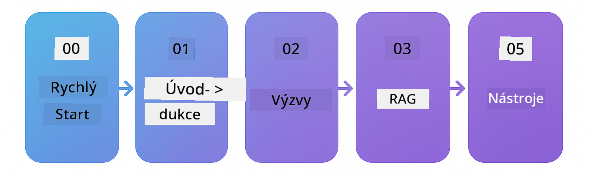

<!--
CO_OP_TRANSLATOR_METADATA:
{
  "original_hash": "69c7e2616c66df6cc296492fbfcad9ec",
  "translation_date": "2025-12-13T12:43:54+00:00",
  "source_file": "README.md",
  "language_code": "cs"
}
-->

# LangChain4j pro začátečníky

Kurz pro vytváření AI aplikací s LangChain4j a Azure OpenAI GPT-5, od základního chatu po AI agenty.

**Nový v LangChain4j?** Podívejte se na [Glosář](docs/GLOSSARY.md) pro definice klíčových pojmů a konceptů.

## Obsah

1. [Rychlý start](00-quick-start/README.md) - Začněte s LangChain4j
2. [Úvod](01-introduction/README.md) - Naučte se základy LangChain4j
3. [Návrh promptů](02-prompt-engineering/README.md) - Ovládněte efektivní návrh promptů
4. [RAG (Retrieval-Augmented Generation)](03-rag/README.md) - Vytvářejte inteligentní systémy založené na znalostech
5. [Nástroje](04-tools/README.md) - Integrujte externí nástroje a API s AI agenty
6. [MCP (Model Context Protocol)](05-mcp/README.md) - Pracujte s protokolem Model Context Protocol
---

## Učební cesta

Začněte modulem [Rychlý start](00-quick-start/README.md) a postupujte krok za krokem přes jednotlivé moduly, abyste si vybudovali dovednosti. Vyzkoušíte základní příklady, abyste pochopili základy, než přejdete k modulu [Úvod](01-introduction/README.md) pro hlubší seznámení s GPT-5.

Po dokončení modulů prozkoumejte [Průvodce testováním](docs/TESTING.md), kde uvidíte koncepty testování LangChain4j v praxi.

> **Poznámka:** Tento kurz používá jak GitHub Models, tak Azure OpenAI. Moduly [Rychlý start](00-quick-start/README.md) a [MCP](05-mcp/README.md) používají GitHub Models (není potřeba předplatné Azure), zatímco moduly 1-4 používají Azure OpenAI GPT-5.

## Učení s GitHub Copilot

Pro rychlý start s kódováním otevřete tento projekt v GitHub Codespace nebo ve svém lokálním IDE s poskytnutým devcontainerem. Devcontainer použitý v tomto kurzu je přednastavený s GitHub Copilot pro AI párové programování.

Každý příklad kódu obsahuje navrhované otázky, které můžete položit GitHub Copilotovi pro hlubší pochopení. Hledejte výzvy 💡/🤖 v:

- **Hlavičkách Java souborů** - Otázky specifické pro každý příklad
- **README modulů** - Výzvy k prozkoumání po příkladech kódu

**Jak používat:** Otevřete jakýkoli soubor s kódem a položte Copilotovi navrhované otázky. Má plný kontext kódu a může vysvětlit, rozšířit a navrhnout alternativy.

Chcete se dozvědět více? Podívejte se na [Copilot pro AI párové programování](https://aka.ms/GitHubCopilotAI).

## Další zdroje

### LangChain

---

### Azure / Edge / MCP / Agenti

---
 
### Série Generativní AI

[-9333EA?style=for-the-badge&labelColor=E5E7EB&color=9333EA)](https://github.com/microsoft/Generative-AI-for-beginners-dotnet?WT.mc_id=academic-105485-koreyst)
[-C084FC?style=for-the-badge&labelColor=E5E7EB&color=C084FC)](https://github.com/microsoft/generative-ai-for-beginners-java?WT.mc_id=academic-105485-koreyst)
[-E879F9?style=for-the-badge&labelColor=E5E7EB&color=E879F9)](https://github.com/microsoft/generative-ai-with-javascript?WT.mc_id=academic-105485-koreyst)

---
 
### Základní učení

---
 
### Série Copilot

## Získání pomoci

Pokud narazíte na problém nebo máte otázky ohledně tvorby AI aplikací, připojte se:

Pokud máte zpětnou vazbu k produktu nebo chyby při vývoji, navštivte:

## Licence

MIT Licence - Podrobnosti naleznete v souboru [LICENSE](../../LICENSE).

---

<!-- CO-OP TRANSLATOR DISCLAIMER START -->
**Prohlášení o vyloučení odpovědnosti**:  
Tento dokument byl přeložen pomocí AI překladatelské služby [Co-op Translator](https://github.com/Azure/co-op-translator). Přestože usilujeme o přesnost, mějte prosím na paměti, že automatizované překlady mohou obsahovat chyby nebo nepřesnosti. Původní dokument v jeho mateřském jazyce by měl být považován za autoritativní zdroj. Pro důležité informace se doporučuje profesionální lidský překlad. Nejsme odpovědní za jakékoliv nedorozumění nebo nesprávné výklady vyplývající z použití tohoto překladu.
<!-- CO-OP TRANSLATOR DISCLAIMER END -->