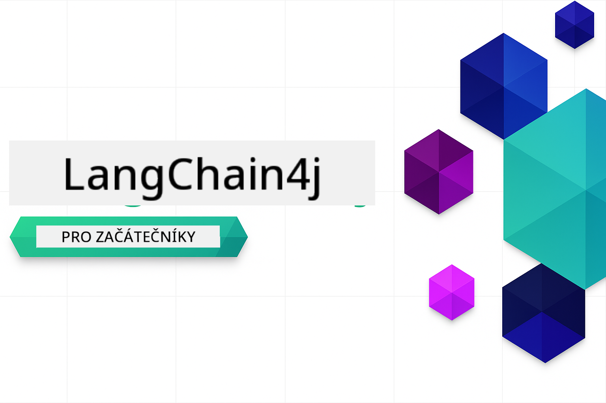

<!--
CO_OP_TRANSLATOR_METADATA:
{
  "original_hash": "d61ab6c245562094cc3dddecf08b50d3",
  "translation_date": "2025-12-31T04:11:54+00:00",
  "source_file": "README.md",
  "language_code": "cs"
}
-->


### 🌐 Podpora více jazyků

#### Podpora přes GitHub Action (automatizované a vždy aktuální)

<!-- CO-OP TRANSLATOR LANGUAGES TABLE START -->
[Arabština](../ar/README.md) | [Bengálština](../bn/README.md) | [Bulharština](../bg/README.md) | [Barmsky (Myanmar)](../my/README.md) | [Čínština (zjednodušená)](../zh/README.md) | [Čínština (tradiční, Hongkong)](../hk/README.md) | [Čínština (tradiční, Macau)](../mo/README.md) | [Čínština (tradiční, Tchaj-wan)](../tw/README.md) | [Chorvatština](../hr/README.md) | [Čeština](./README.md) | [Dánština](../da/README.md) | [Nizozemština](../nl/README.md) | [Estonština](../et/README.md) | [Finština](../fi/README.md) | [Francouzština](../fr/README.md) | [Němčina](../de/README.md) | [Řečtina](../el/README.md) | [Hebrejština](../he/README.md) | [Hindština](../hi/README.md) | [Maďarština](../hu/README.md) | [Indonéština](../id/README.md) | [Italština](../it/README.md) | [Japonština](../ja/README.md) | [Kannadština](../kn/README.md) | [Korejština](../ko/README.md) | [Litevština](../lt/README.md) | [Malajština](../ms/README.md) | [malajálamština](../ml/README.md) | [Maráthština](../mr/README.md) | [Nepálština](../ne/README.md) | [Nigerijský pidžin](../pcm/README.md) | [Norština](../no/README.md) | [Perština (fársí)](../fa/README.md) | [Polština](../pl/README.md) | [Portugalština (Brazílie)](../br/README.md) | [Portugalština (Portugalsko)](../pt/README.md) | [Paňdžábština (Gurmukhi)](../pa/README.md) | [Rumunština](../ro/README.md) | [Ruština](../ru/README.md) | [Srbština (cyrilice)](../sr/README.md) | [Slovenština](../sk/README.md) | [Slovinština](../sl/README.md) | [Španělština](../es/README.md) | [Svahilština](../sw/README.md) | [Švédština](../sv/README.md) | [Tagalog (filipínština)](../tl/README.md) | [Tamilština](../ta/README.md) | [Telugština](../te/README.md) | [Thajština](../th/README.md) | [Turečtina](../tr/README.md) | [Ukrajinština](../uk/README.md) | [Urdština](../ur/README.md) | [Vietnamština](../vi/README.md)
<!-- CO-OP TRANSLATOR LANGUAGES TABLE END -->

# LangChain4j pro začátečníky

Kurz pro vytváření AI aplikací s LangChain4j a Azure OpenAI GPT-5, od základního chatu až po AI agenty.

**Nový v LangChain4j?** Podívejte se na [Glosář](docs/GLOSSARY.md) pro definice klíčových pojmů a konceptů.

## Obsah

1. [Rychlý start](00-quick-start/README.md) - Začněte s LangChain4j
2. [Úvod](01-introduction/README.md) - Naučte se základy LangChain4j
3. [Návrh promptů](02-prompt-engineering/README.md) - Ovládněte efektivní návrh promptů
4. [RAG (Retrieval-Augmented Generation)](03-rag/README.md) - Vytvořte inteligentní systémy založené na znalostech
5. [Nástroje](04-tools/README.md) - Integrujte externí nástroje a jednoduché asistenty
6. [MCP (Model Context Protocol)](05-mcp/README.md) - Pracujte s protokolem Model Context (MCP) a agentickými moduly
---

##  Učební plán

> **Rychlý start**

1. Forkněte tento repozitář do svého účtu na GitHubu
2. Klikněte na **Code** → kartu **Codespaces** → **...** → **New with options...**
3. Použijte výchozí nastavení – to vybere Development container vytvořený pro tento kurz
4. Klikněte na **Create codespace**
5. Počkejte 5-10 minut, než bude prostředí připraveno
6. Přejděte přímo na [Rychlý start](./00-quick-start/README.md) a začněte!

> **Preferujete klonovat lokálně?**
>
> Tento repozitář obsahuje více než 50 překladů, které výrazně zvětšují velikost stažení. Pokud chcete klonovat bez překladů, použijte sparse checkout:
> ```bash
> git clone --filter=blob:none --sparse https://github.com/microsoft/LangChain4j-for-Beginners.git
> cd LangChain4j-for-Beginners
> git sparse-checkout set --no-cone '/*' '!translations' '!translated_images'
> ```
> Tím získáte vše potřebné k dokončení kurzu s mnohem rychlejším stažením.

Po dokončení modulů si prohlédněte [Průvodce testováním](docs/TESTING.md), abyste viděli testovací koncepty LangChain4j v akci.

> **Poznámka:** Tento kurz využívá jak GitHub Models, tak Azure OpenAI. Moduly [Rychlý start](00-quick-start/README.md) a [MCP](05-mcp/README.md) používají GitHub Models (není potřeba předplatné Azure), zatímco moduly 1-4 používají Azure OpenAI GPT-5.


## Učení s GitHub Copilot

Chcete-li rychle začít psát kód, otevřete tento projekt v GitHub Codespace nebo ve svém lokálním IDE s přiloženým devcontainerem. Devcontainer použitý v tomto kurzu je předkonfigurován s GitHub Copilot pro párované AI programování.

Každý příklad kódu obsahuje navrhované otázky, které můžete položit GitHub Copilot, abyste prohloubili své porozumění. Hledejte výzvy 💡/🤖 v:

- **Záhlaví Java souborů** - Otázky specifické pro každý příklad
- **README modulů** - Podněty k prozkoumání po příkladech kódu

**Jak používat:** Otevřete libovolný soubor s kódem a zeptejte se Copilota na navrhované otázky. Má plný kontext kódu a může vysvětlit, rozšířit a navrhnout alternativy.

Chcete se dozvědět více? Podívejte se na [Copilot pro párované programování AI](https://aka.ms/GitHubCopilotAI).


## Další zdroje

<!-- CO-OP TRANSLATOR OTHER COURSES START -->
### LangChain
[](https://aka.ms/langchain4j-for-beginners)
[](https://aka.ms/langchainjs-for-beginners?WT.mc_id=m365-94501-dwahlin)

---

### Azure / Edge / MCP / Agenti
[](https://github.com/microsoft/AZD-for-beginners?WT.mc_id=academic-105485-koreyst)
[](https://github.com/microsoft/edgeai-for-beginners?WT.mc_id=academic-105485-koreyst)
[](https://github.com/microsoft/mcp-for-beginners?WT.mc_id=academic-105485-koreyst)
[](https://github.com/microsoft/ai-agents-for-beginners?WT.mc_id=academic-105485-koreyst)

---
 
### Série Generativní AI
[](https://github.com/microsoft/generative-ai-for-beginners?WT.mc_id=academic-105485-koreyst)
[-9333EA?style=for-the-badge&labelColor=E5E7EB&color=9333EA)](https://github.com/microsoft/Generative-AI-for-beginners-dotnet?WT.mc_id=academic-105485-koreyst)
[-C084FC?style=for-the-badge&labelColor=E5E7EB&color=C084FC)](https://github.com/microsoft/generative-ai-for-beginners-java?WT.mc_id=academic-105485-koreyst)
[-E879F9?style=for-the-badge&labelColor=E5E7EB&color=E879F9)](https://github.com/microsoft/generative-ai-with-javascript?WT.mc_id=academic-105485-koreyst)

---
 
### Základní kurzy
[](https://aka.ms/ml-beginners?WT.mc_id=academic-105485-koreyst)
[](https://aka.ms/datascience-beginners?WT.mc_id=academic-105485-koreyst)
[](https://aka.ms/ai-beginners?WT.mc_id=academic-105485-koreyst)
[](https://github.com/microsoft/Security-101?WT.mc_id=academic-96948-sayoung)
[](https://aka.ms/webdev-beginners?WT.mc_id=academic-105485-koreyst)
[](https://aka.ms/iot-beginners?WT.mc_id=academic-105485-koreyst)
[](https://github.com/microsoft/xr-development-for-beginners?WT.mc_id=academic-105485-koreyst)

---
 
### Série Copilot
[](https://aka.ms/GitHubCopilotAI?WT.mc_id=academic-105485-koreyst)
[](https://github.com/microsoft/mastering-github-copilot-for-dotnet-csharp-developers?WT.mc_id=academic-105485-koreyst)
[](https://github.com/microsoft/CopilotAdventures?WT.mc_id=academic-105485-koreyst)
<!-- CO-OP TRANSLATOR OTHER COURSES END -->

## Získání pomoci

Pokud se zaseknete nebo budete mít jakékoli dotazy ohledně vytváření aplikací s umělou inteligencí, připojte se:

[](https://aka.ms/foundry/discord)

Pokud máte připomínky k produktu nebo zjistíte chyby během vývoje, navštivte:

[](https://aka.ms/foundry/forum)

## Licence

Licence MIT - Podrobnosti naleznete v souboru [LICENSE](../../LICENSE).

---

<!-- CO-OP TRANSLATOR DISCLAIMER START -->
Upozornění:
Tento dokument byl přeložen pomocí AI překladatelské služby [Co-op Translator](https://github.com/Azure/co-op-translator). I když usilujeme o přesnost, mějte prosím na paměti, že automatické překlady mohou obsahovat chyby nebo nepřesnosti. Původní dokument v jeho mateřském jazyce by měl být považován za závazný zdroj. Pro kritické informace se doporučuje profesionální lidský překlad. Nejsme odpovědní za jakákoli nedorozumění nebo chybné výklady vyplývající z použití tohoto překladu.
<!-- CO-OP TRANSLATOR DISCLAIMER END -->