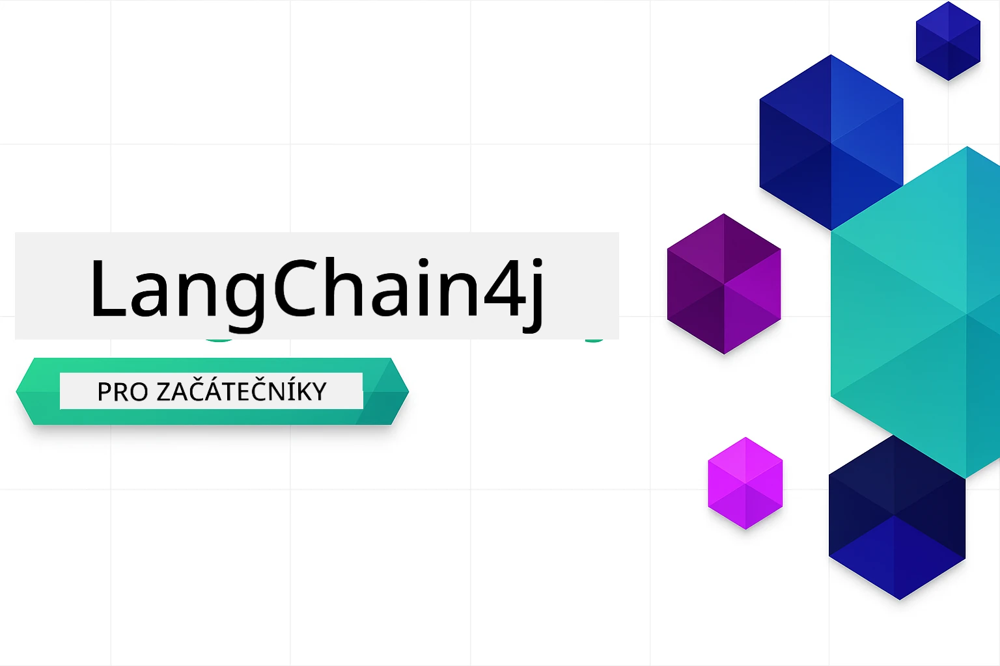

# LangChain4j pro začátečníky

Kurz pro vytváření AI aplikací s LangChain4j a Azure OpenAI GPT-5.2, od základního chatu až po AI agenty.

### 🌐 Podpora více jazyků

#### Podporováno přes GitHub Action (automatizováno a vždy aktuální)

<!-- CO-OP TRANSLATOR LANGUAGES TABLE START -->
[Arabština](../ar/README.md) | [Bengálština](../bn/README.md) | [Bulharština](../bg/README.md) | [Barmština (Myanmar)](../my/README.md) | [Čínština (zjednodušená)](../zh-CN/README.md) | [Čínština (tradiční, Hong Kong)](../zh-HK/README.md) | [Čínština (tradiční, Macau)](../zh-MO/README.md) | [Čínština (tradiční, Taiwan)](../zh-TW/README.md) | [Chorvatština](../hr/README.md) | [Čeština](./README.md) | [Dánština](../da/README.md) | [Nizozemština](../nl/README.md) | [Estonština](../et/README.md) | [Finština](../fi/README.md) | [Francouzština](../fr/README.md) | [Němčina](../de/README.md) | [Řečtina](../el/README.md) | [Hebrejština](../he/README.md) | [Hindština](../hi/README.md) | [Maďarština](../hu/README.md) | [Indonéština](../id/README.md) | [Italština](../it/README.md) | [ japonština](../ja/README.md) | [Kannadština](../kn/README.md) | [Khmérština](../km/README.md) | [Korejština](../ko/README.md) | [Litevština](../lt/README.md) | [Malajština](../ms/README.md) | [Malayalam](../ml/README.md) | [Maráthština](../mr/README.md) | [Nepálština](../ne/README.md) | [Nigerijská pidžinština](../pcm/README.md) | [Norština](../no/README.md) | [Perština (Farsi)](../fa/README.md) | [Polština](../pl/README.md) | [Portugalština (Brazílie)](../pt-BR/README.md) | [Portugalština (Portugalsko)](../pt-PT/README.md) | [Paňdžábština (Gurmukhí)](../pa/README.md) | [Rumunština](../ro/README.md) | [Ruština](../ru/README.md) | [Srbština (cyrilice)](../sr/README.md) | [Slovenština](../sk/README.md) | [Slovinština](../sl/README.md) | [Španělština](../es/README.md) | [Svahilština](../sw/README.md) | [Švédština](../sv/README.md) | [Tagalog (Filipínština)](../tl/README.md) | [Tamil](../ta/README.md) | [Telugština](../te/README.md) | [Thajština](../th/README.md) | [Turečtina](../tr/README.md) | [Ukrajinština](../uk/README.md) | [Urdu](../ur/README.md) | [Vietnamština](../vi/README.md)

> **Raději klonovat lokálně?**
>
> Toto úložiště obsahuje více než 50 překladů jazyků, což výrazně zvyšuje velikost stahování. Pokud chcete klonovat bez překladů, použijte sparse checkout:
>
> **Bash / macOS / Linux:**
> ```bash
> git clone --filter=blob:none --sparse https://github.com/microsoft/LangChain4j-for-Beginners.git
> cd LangChain4j-for-Beginners
> git sparse-checkout set --no-cone '/*' '!translations' '!translated_images'
> ```
>
> **CMD (Windows):**
> ```cmd
> git clone --filter=blob:none --sparse https://github.com/microsoft/LangChain4j-for-Beginners.git
> cd LangChain4j-for-Beginners
> git sparse-checkout set --no-cone "/*" "!translations" "!translated_images"
> ```
>
> To vám poskytne vše potřebné pro dokončení kurzu s mnohem rychlejším stažením.
<!-- CO-OP TRANSLATOR LANGUAGES TABLE END -->

## Obsah

1. [Úvod](01-introduction/README.md) - Naučte se základy LangChain4j
2. [Prompt Engineering](02-prompt-engineering/README.md) - Ovládněte efektivní návrh promptů
3. [RAG (Retrieval-Augmented Generation)](03-rag/README.md) - Vytvářejte inteligentní systémy založené na znalostech
4. [Nástroje](04-tools/README.md) - Integrace externích nástrojů a jednoduchých asistentů
5. [MCP (Model Context Protocol)](05-mcp/README.md) - Práce s protokolem Model Context Protocol (MCP) a Agentickými moduly

### Video průvodci

Každý modul má doprovodnou živou relaci, kde krok za krokem procházíme koncepty a kód.

| Modul | Video |
|--------|-------|
| 01 - Úvod | [Začínáme s LangChain4j](https://www.youtube.com/live/nl_troDm8rQ) |
| 02 - Prompt Engineering | [Prompt Engineering s LangChain4j](https://www.youtube.com/live/PJ6aBaE6bog) |
| 03 - RAG | [RAG s LangChain4j](https://www.youtube.com/watch?v=_olq75ZH_eY) |
| 04 - Nástroje & 05 - MCP | [AI agenti s nástroji a MCP](https://www.youtube.com/watch?v=O_J30kZc0rw) |

---

## Výuková cesta

**Nový v LangChain4j?** Podívejte se na [Glosář](docs/GLOSSARY.md) pro definice klíčových pojmů a konceptů.

> **Rychlý start**

1. Forkněte toto úložiště na svůj GitHub účet
2. Klikněte na **Code** → záložka **Codespaces** → **...** → **New with options...**
3. Použijte výchozí nastavení – tím vyberete vývojový kontejner vytvořený pro tento kurz
4. Klikněte na **Create codespace**
5. Počkejte 5-10 minut na připravení prostředí
6. Přejděte přímo na [Úvod](./01-introduction/README.md) a začněte!

Po dokončení modulů prozkoumejte [Testovací průvodce](docs/TESTING.md) a uvidíte praktické použití testování LangChain4j.

> **Poznámka:** Toto školení používá Azure OpenAI. Pokud ještě nemáte účet, začněte s [ZDARMA Azure účtem](https://aka.ms/azure-free-account).

## Výuka s GitHub Copilot

Pro rychlý start kódování otevřete tento projekt v GitHub Codespace nebo ve svém lokálním IDE s poskytnutým devcontainerem. Devcontainer použitý v tomto kurzu je předkonfigurován s GitHub Copilot pro AI párové programování.

Každý příklad kódu obsahuje navržené otázky, které můžete položit GitHub Copilotovi, abyste prohloubili své znalosti. Hledejte značky 💡/🤖 v:

- **Hlavičkách Java souborů** - otázky specifické pro každý příklad
- **README modulů** - průzkumné otázky po příkladech kódu

**Jak používat:** Otevřete jakýkoli kódový soubor a zeptejte se Copilota na navržené otázky. Má plný kontext kódu a může vysvětlit, rozšířit a navrhnout alternativy.

Chcete se dozvědět více? Podívejte se na [Copilot pro AI párové programování](https://aka.ms/GitHubCopilotAI).

## Další zdroje

<!-- CO-OP TRANSLATOR OTHER COURSES START -->
### LangChain
[](https://aka.ms/langchain4j-for-beginners)
[](https://aka.ms/langchainjs-for-beginners?WT.mc_id=m365-94501-dwahlin)
[](https://github.com/microsoft/langchain-for-beginners?WT.mc_id=m365-94501-dwahlin)
---

### Azure / Edge / MCP / Agent
[](https://github.com/microsoft/AZD-for-beginners?WT.mc_id=academic-105485-koreyst)
[](https://github.com/microsoft/edgeai-for-beginners?WT.mc_id=academic-105485-koreyst)
[](https://github.com/microsoft/mcp-for-beginners?WT.mc_id=academic-105485-koreyst)
[](https://github.com/microsoft/ai-agents-for-beginners?WT.mc_id=academic-105485-koreyst)

---
 
### Série Generative AI
[](https://github.com/microsoft/generative-ai-for-beginners?WT.mc_id=academic-105485-koreyst)
[-9333EA?style=for-the-badge&labelColor=E5E7EB&color=9333EA)](https://github.com/microsoft/Generative-AI-for-beginners-dotnet?WT.mc_id=academic-105485-koreyst)
[-C084FC?style=for-the-badge&labelColor=E5E7EB&color=C084FC)](https://github.com/microsoft/generative-ai-for-beginners-java?WT.mc_id=academic-105485-koreyst)
[-E879F9?style=for-the-badge&labelColor=E5E7EB&color=E879F9)](https://github.com/microsoft/generative-ai-with-javascript?WT.mc_id=academic-105485-koreyst)

---
 
### Core Learning
[](https://aka.ms/ml-beginners?WT.mc_id=academic-105485-koreyst)
[](https://aka.ms/datascience-beginners?WT.mc_id=academic-105485-koreyst)
[](https://aka.ms/ai-beginners?WT.mc_id=academic-105485-koreyst)
[](https://github.com/microsoft/Security-101?WT.mc_id=academic-96948-sayoung)
[](https://aka.ms/webdev-beginners?WT.mc_id=academic-105485-koreyst)
[](https://aka.ms/iot-beginners?WT.mc_id=academic-105485-koreyst)
[](https://github.com/microsoft/xr-development-for-beginners?WT.mc_id=academic-105485-koreyst)

---
 
### Série Copilot
[](https://aka.ms/GitHubCopilotAI?WT.mc_id=academic-105485-koreyst)
[](https://github.com/microsoft/mastering-github-copilot-for-dotnet-csharp-developers?WT.mc_id=academic-105485-koreyst)
[](https://github.com/microsoft/CopilotAdventures?WT.mc_id=academic-105485-koreyst)
<!-- CO-OP TRANSLATOR OTHER COURSES END -->

## Získání pomoci

Pokud se zaseknete nebo máte jakékoliv otázky ohledně vytváření AI aplikací, připojte se:

[](https://aka.ms/foundry/discord)

Pokud máte zpětnou vazbu k produktu nebo narazíte na chyby při vývoji, navštivte:

[](https://aka.ms/foundry/forum)

## Licence

Licence MIT - Viz soubor [LICENSE](../../LICENSE) pro podrobnosti.

---

<!-- CO-OP TRANSLATOR DISCLAIMER START -->
**Prohlášení o omezení odpovědnosti**:
Tento dokument byl přeložen pomocí AI překladatelské služby [Co-op Translator](https://github.com/Azure/co-op-translator). Přestože usilujeme o co největší přesnost, mějte prosím na paměti, že automatizované překlady mohou obsahovat chyby nebo nepřesnosti. Originální dokument v jeho mateřském jazyce by měl být považován za autoritativní zdroj. Pro kritické informace se doporučuje profesionální lidský překlad. Nejsme odpovědní za jakékoli nedorozumění nebo nesprávné interpretace vzniklé použitím tohoto překladu.
<!-- CO-OP TRANSLATOR DISCLAIMER END -->