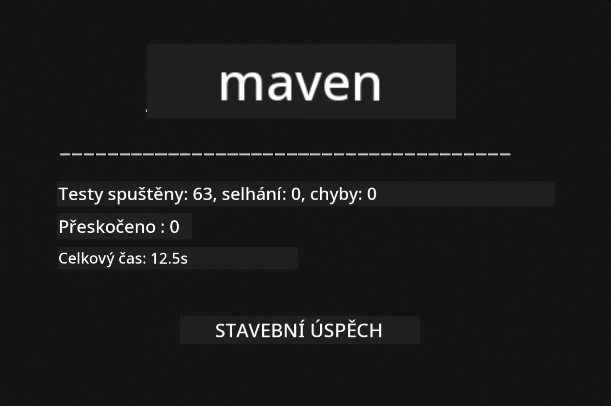
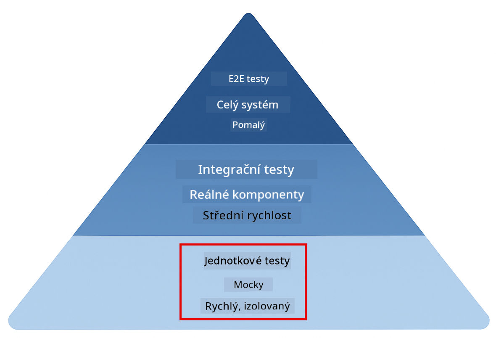
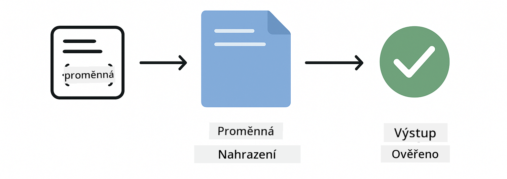
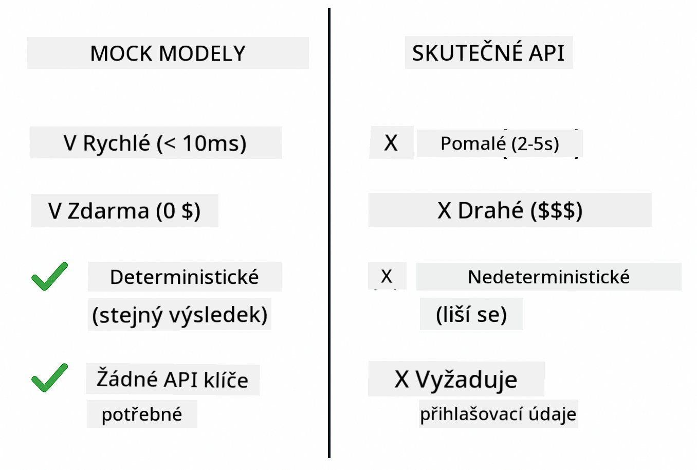
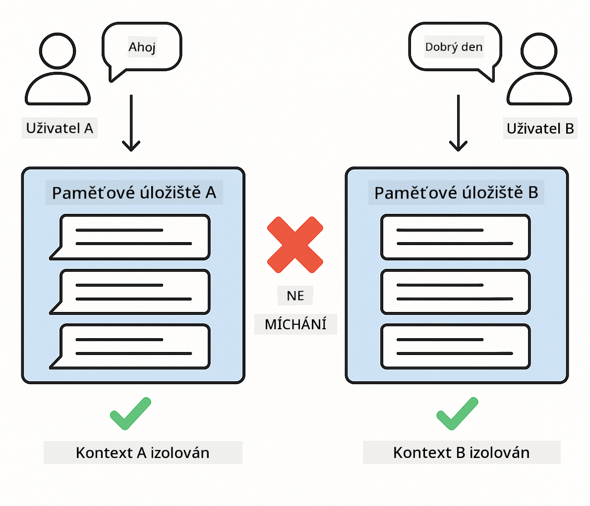
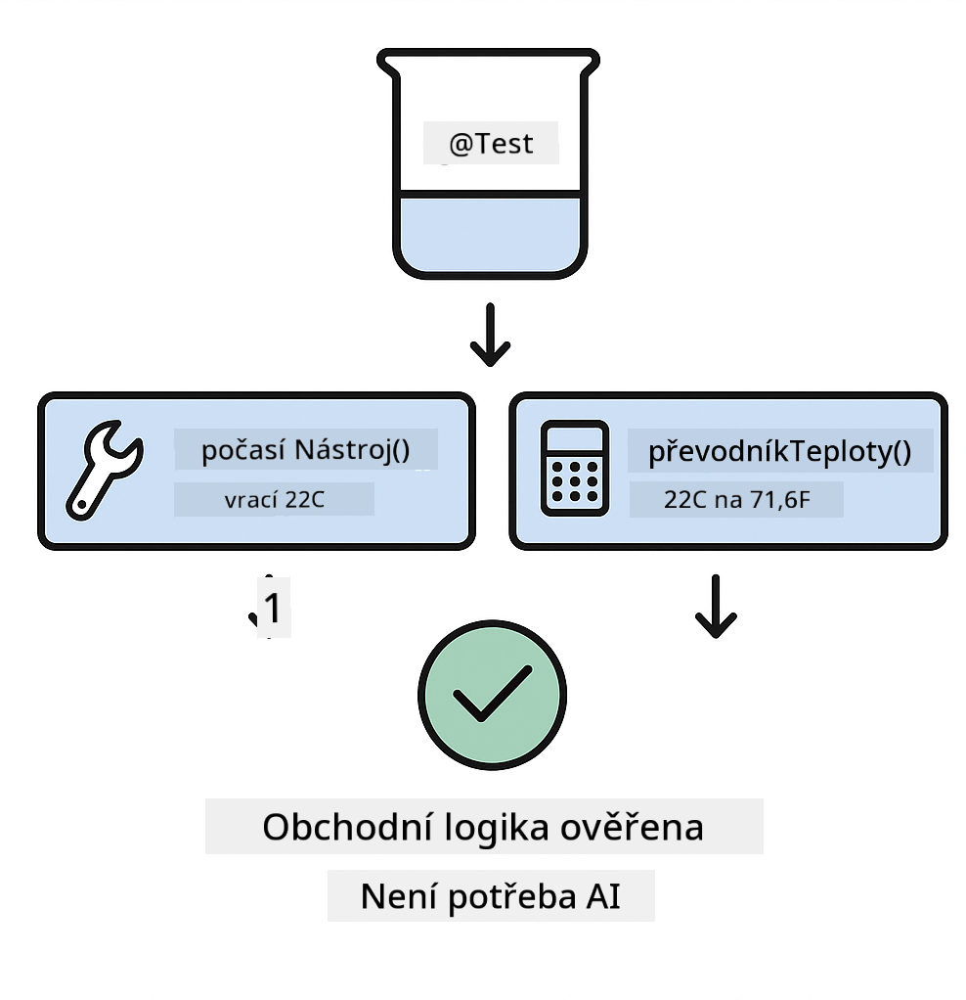
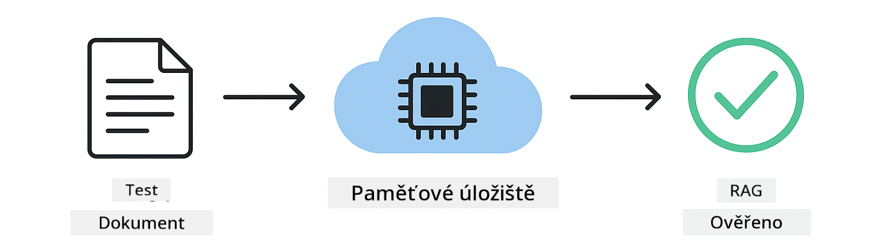

<!--
CO_OP_TRANSLATOR_METADATA:
{
  "original_hash": "b975537560c404d5f254331832811e78",
  "translation_date": "2025-12-13T21:20:17+00:00",
  "source_file": "docs/TESTING.md",
  "language_code": "cs"
}
-->
# Testování aplikací LangChain4j

## Obsah

- [Rychlý start](../../../docs)
- [Co testy pokrývají](../../../docs)
- [Spuštění testů](../../../docs)
- [Spuštění testů ve VS Code](../../../docs)
- [Testovací vzory](../../../docs)
- [Testovací filozofie](../../../docs)
- [Další kroky](../../../docs)

Tento průvodce vás provede testy, které ukazují, jak testovat AI aplikace bez potřeby API klíčů nebo externích služeb.

## Rychlý start

Spusťte všechny testy jediným příkazem:

**Bash:**
```bash
mvn test
```

**PowerShell:**
```powershell
mvn --% test
```



*Úspěšné spuštění testů ukazující všechny testy s nulovým počtem chyb*

## Co testy pokrývají

Tento kurz se zaměřuje na **jednotkové testy**, které běží lokálně. Každý test demonstruje konkrétní koncept LangChain4j izolovaně.



*Testovací pyramida ukazující rovnováhu mezi jednotkovými testy (rychlé, izolované), integračními testy (reálné komponenty) a end-to-end testy (celý systém s Dockerem). Tento kurz pokrývá jednotkové testování.*

| Modul | Testy | Zaměření | Klíčové soubory |
|--------|-------|----------|-----------------|
| **00 - Rychlý start** | 6 | Šablony promptů a nahrazování proměnných | `SimpleQuickStartTest.java` |
| **01 - Úvod** | 8 | Paměť konverzace a stavový chat | `SimpleConversationTest.java` |
| **02 - Prompt Engineering** | 12 | Vzory GPT-5, úrovně ochoty, strukturovaný výstup | `SimpleGpt5PromptTest.java` |
| **03 - RAG** | 10 | Zpracování dokumentů, embeddingy, vyhledávání podobnosti | `DocumentServiceTest.java` |
| **04 - Nástroje** | 12 | Volání funkcí a řetězení nástrojů | `SimpleToolsTest.java` |
| **05 - MCP** | 15 | Model Context Protocol s Dockerem | `SimpleMcpTest.java`, `McpDockerTransportTest.java` |

## Spuštění testů

**Spusťte všechny testy z kořenového adresáře:**

**Bash:**
```bash
mvn test
```

**PowerShell:**
```powershell
mvn --% test
```

**Spusťte testy pro konkrétní modul:**

**Bash:**
```bash
cd 01-introduction && mvn test
# Nebo z kořene
mvn test -pl 01-introduction
```

**PowerShell:**
```powershell
cd 01-introduction; mvn --% test
# Nebo z kořene
mvn --% test -pl 01-introduction
```

**Spusťte jednu testovací třídu:**

**Bash:**
```bash
mvn test -Dtest=SimpleConversationTest
```

**PowerShell:**
```powershell
mvn --% test -Dtest=SimpleConversationTest
```

**Spusťte konkrétní testovací metodu:**

**Bash:**
```bash
mvn test -Dtest=SimpleConversationTest#měl by udržovat historii konverzace
```

**PowerShell:**
```powershell
mvn --% test -Dtest=SimpleConversationTest#měl by udržovat historii konverzace
```

## Spuštění testů ve VS Code

Pokud používáte Visual Studio Code, Test Explorer poskytuje grafické rozhraní pro spouštění a ladění testů.


*Test Explorer ve VS Code ukazující strom testů se všemi Java testovacími třídami a jednotlivými testovacími metodami*

**Pro spuštění testů ve VS Code:**

1. Otevřete Test Explorer kliknutím na ikonu odměrky v Activity Bar
2. Rozbalte strom testů, abyste viděli všechny moduly a testovací třídy
3. Klikněte na tlačítko přehrávání vedle libovolného testu pro jeho individuální spuštění
4. Klikněte na "Run All Tests" pro spuštění celé sady
5. Klikněte pravým tlačítkem na jakýkoli test a vyberte "Debug Test" pro nastavení breakpointů a krokování kódem

Test Explorer zobrazuje zelené fajfky u úspěšných testů a poskytuje podrobné zprávy o chybách, pokud testy selžou.

## Testovací vzory


*Šest testovacích vzorů pro aplikace LangChain4j: šablony promptů, mockování modelů, izolace konverzace, testování nástrojů, in-memory RAG a integrace s Dockerem*

### Vzor 1: Testování šablon promptů

Nejjednodušší vzor testuje šablony promptů bez volání jakéhokoli AI modelu. Ověřujete, že nahrazování proměnných funguje správně a prompt je formátován podle očekávání.



*Testování šablon promptů ukazující tok nahrazování proměnných: šablona s místy pro proměnné → aplikované hodnoty → ověřený formátovaný výstup*

```java
@Test
@DisplayName("Should format prompt template with variables")
void testPromptTemplateFormatting() {
    PromptTemplate template = PromptTemplate.from(
        "Best time to visit {{destination}} for {{activity}}?"
    );
    
    Prompt prompt = template.apply(Map.of(
        "destination", "Paris",
        "activity", "sightseeing"
    ));
    
    assertThat(prompt.text()).isEqualTo("Best time to visit Paris for sightseeing?");
}
```

Tento test se nachází v `00-quick-start/src/test/java/com/example/langchain4j/quickstart/SimpleQuickStartTest.java`.

**Spusťte ho:**

**Bash:**
```bash
cd 00-quick-start && mvn test -Dtest=SimpleQuickStartTest#testFormátováníŠablonyVýzvy
```

**PowerShell:**
```powershell
cd 00-quick-start; mvn --% test -Dtest=SimpleQuickStartTest#testFormátováníŠablonyVýzvy
```

### Vzor 2: Mockování jazykových modelů

Při testování logiky konverzace použijte Mockito k vytvoření falešných modelů, které vrací předem dané odpovědi. To dělá testy rychlými, zdarma a deterministickými.



*Porovnání ukazující, proč jsou mocky preferované pro testování: jsou rychlé, zdarma, deterministické a nevyžadují API klíče*

```java
@ExtendWith(MockitoExtension.class)
class SimpleConversationTest {
    
    private ConversationService conversationService;
    
    @Mock
    private OpenAiOfficialChatModel mockChatModel;
    
    @BeforeEach
    void setUp() {
        ChatResponse mockResponse = ChatResponse.builder()
            .aiMessage(AiMessage.from("This is a test response"))
            .build();
        when(mockChatModel.chat(anyList())).thenReturn(mockResponse);
        
        conversationService = new ConversationService(mockChatModel);
    }
    
    @Test
    void shouldMaintainConversationHistory() {
        String conversationId = conversationService.startConversation();
        
        ChatResponse mockResponse1 = ChatResponse.builder()
            .aiMessage(AiMessage.from("Response 1"))
            .build();
        ChatResponse mockResponse2 = ChatResponse.builder()
            .aiMessage(AiMessage.from("Response 2"))
            .build();
        ChatResponse mockResponse3 = ChatResponse.builder()
            .aiMessage(AiMessage.from("Response 3"))
            .build();
        
        when(mockChatModel.chat(anyList()))
            .thenReturn(mockResponse1)
            .thenReturn(mockResponse2)
            .thenReturn(mockResponse3);

        conversationService.chat(conversationId, "First message");
        conversationService.chat(conversationId, "Second message");
        conversationService.chat(conversationId, "Third message");

        List<ChatMessage> history = conversationService.getHistory(conversationId);
        assertThat(history).hasSize(6); // 3 zprávy uživatele + 3 zprávy AI
    }
}
```

Tento vzor se objevuje v `01-introduction/src/test/java/com/example/langchain4j/service/SimpleConversationTest.java`. Mock zajišťuje konzistentní chování, takže můžete ověřit správu paměti.

### Vzor 3: Testování izolace konverzace

Paměť konverzace musí udržovat uživatele oddělené. Tento test ověřuje, že se konverzace nekombinují.



*Testování izolace konverzace ukazující oddělené paměťové úložiště pro různé uživatele, aby se zabránilo míchání kontextů*

```java
@Test
void shouldIsolateConversationsByid() {
    String conv1 = conversationService.startConversation();
    String conv2 = conversationService.startConversation();
    
    ChatResponse mockResponse = ChatResponse.builder()
        .aiMessage(AiMessage.from("Response"))
        .build();
    when(mockChatModel.chat(anyList())).thenReturn(mockResponse);

    conversationService.chat(conv1, "Message for conversation 1");
    conversationService.chat(conv2, "Message for conversation 2");

    List<ChatMessage> history1 = conversationService.getHistory(conv1);
    List<ChatMessage> history2 = conversationService.getHistory(conv2);
    
    assertThat(history1).hasSize(2);
    assertThat(history2).hasSize(2);
}
```

Každá konverzace si udržuje vlastní nezávislou historii. V produkčních systémech je tato izolace kritická pro aplikace s více uživateli.

### Vzor 4: Testování nástrojů samostatně

Nástroje jsou funkce, které může AI volat. Testujte je přímo, abyste zajistili, že fungují správně bez ohledu na rozhodnutí AI.



*Testování nástrojů samostatně ukazující spuštění mock nástroje bez volání AI pro ověření obchodní logiky*

```java
@Test
void shouldConvertCelsiusToFahrenheit() {
    TemperatureTool tempTool = new TemperatureTool();
    String result = tempTool.celsiusToFahrenheit(25.0);
    assertThat(result).containsPattern("77[.,]0°F");
}

@Test
void shouldDemonstrateToolChaining() {
    WeatherTool weatherTool = new WeatherTool();
    TemperatureTool tempTool = new TemperatureTool();

    String weatherResult = weatherTool.getCurrentWeather("Seattle");
    assertThat(weatherResult).containsPattern("\\d+°C");

    String conversionResult = tempTool.celsiusToFahrenheit(22.0);
    assertThat(conversionResult).containsPattern("71[.,]6°F");
}
```

Tyto testy z `04-tools/src/test/java/com/example/langchain4j/agents/tools/SimpleToolsTest.java` ověřují logiku nástrojů bez zapojení AI. Příklad řetězení ukazuje, jak výstup jednoho nástroje slouží jako vstup pro jiný.

### Vzor 5: Testování in-memory RAG

RAG systémy tradičně vyžadují vektorové databáze a embeddingové služby. In-memory vzor umožňuje testovat celý proces bez externích závislostí.



*Workflow testování in-memory RAG ukazující parsování dokumentů, ukládání embeddingů a vyhledávání podobnosti bez potřeby databáze*

```java
@Test
void testProcessTextDocument() {
    String content = "This is a test document.\nIt has multiple lines.";
    InputStream inputStream = new ByteArrayInputStream(content.getBytes(StandardCharsets.UTF_8));
    
    DocumentService.ProcessedDocument result = 
        documentService.processDocument(inputStream, "test.txt");

    assertNotNull(result);
    assertTrue(result.segments().size() > 0);
    assertEquals("test.txt", result.segments().get(0).metadata().getString("filename"));
}
```

Tento test z `03-rag/src/test/java/com/example/langchain4j/rag/service/DocumentServiceTest.java` vytváří dokument v paměti a ověřuje dělení na části a zpracování metadat.

### Vzor 6: Integrační testování s Dockerem

Některé funkce vyžadují reálnou infrastrukturu. Modul MCP používá Testcontainers k roztočení Docker kontejnerů pro integrační testy. Ty ověřují, že váš kód funguje s reálnými službami a zároveň zachovávají izolaci testů.


*Integrační testování MCP s Testcontainers ukazující automatizovaný životní cyklus kontejneru: start, spuštění testů, zastavení a úklid*

Testy v `05-mcp/src/test/java/com/example/langchain4j/mcp/McpDockerTransportTest.java` vyžadují běžící Docker.

**Spusťte je:**

**Bash:**
```bash
cd 05-mcp && mvn test
```

**PowerShell:**
```powershell
cd 05-mcp; mvn --% test
```

## Testovací filozofie

Testujte svůj kód, ne AI. Vaše testy by měly ověřovat kód, který píšete, kontrolou, jak jsou prompt šablony sestaveny, jak je spravována paměť a jak nástroje fungují. Odpovědi AI se liší a neměly by být součástí testovacích tvrzení. Ptejte se, zda vaše šablona promptu správně nahrazuje proměnné, ne zda AI dává správnou odpověď.

Používejte mocky pro jazykové modely. Jsou to externí závislosti, které jsou pomalé, drahé a nedeterministické. Mockování dělá testy rychlými s milisekundami místo sekund, zdarma bez nákladů na API a deterministickými se stejným výsledkem pokaždé.

Udržujte testy nezávislé. Každý test by měl nastavit svá vlastní data, nespoléhat na jiné testy a uklidit po sobě. Testy by měly projít bez ohledu na pořadí spuštění.

Testujte okrajové případy mimo šťastnou cestu. Zkoušejte prázdné vstupy, velmi velké vstupy, speciální znaky, neplatné parametry a hraniční podmínky. Ty často odhalí chyby, které běžné použití neukáže.

Používejte popisné názvy. Porovnejte `shouldMaintainConversationHistoryAcrossMultipleMessages()` s `test1()`. První vám přesně řekne, co se testuje, což usnadňuje ladění chyb.

## Další kroky

Nyní, když rozumíte testovacím vzorům, ponořte se hlouběji do každého modulu:

- **[00 - Rychlý start](../00-quick-start/README.md)** - Začněte se základy šablon promptů
- **[01 - Úvod](../01-introduction/README.md)** - Naučte se správu paměti konverzace
- **[02 - Prompt Engineering](../02-prompt-engineering/README.md)** - Ovládněte vzory promptování GPT-5
- **[03 - RAG](../03-rag/README.md)** - Vytvářejte systémy pro retrieval-augmented generation
- **[04 - Nástroje](../04-tools/README.md)** - Implementujte volání funkcí a řetězení nástrojů
- **[05 - MCP](../05-mcp/README.md)** - Integrujte Model Context Protocol s Dockerem

README každého modulu poskytuje podrobné vysvětlení konceptů testovaných zde.

---

**Navigace:** [← Zpět na hlavní stránku](../README.md)

---

<!-- CO-OP TRANSLATOR DISCLAIMER START -->
**Prohlášení o vyloučení odpovědnosti**:  
Tento dokument byl přeložen pomocí AI překladatelské služby [Co-op Translator](https://github.com/Azure/co-op-translator). Přestože usilujeme o přesnost, mějte prosím na paměti, že automatické překlady mohou obsahovat chyby nebo nepřesnosti. Původní dokument v jeho mateřském jazyce by měl být považován za autoritativní zdroj. Pro důležité informace se doporučuje profesionální lidský překlad. Nejsme odpovědní za jakékoliv nedorozumění nebo nesprávné výklady vyplývající z použití tohoto překladu.
<!-- CO-OP TRANSLATOR DISCLAIMER END -->