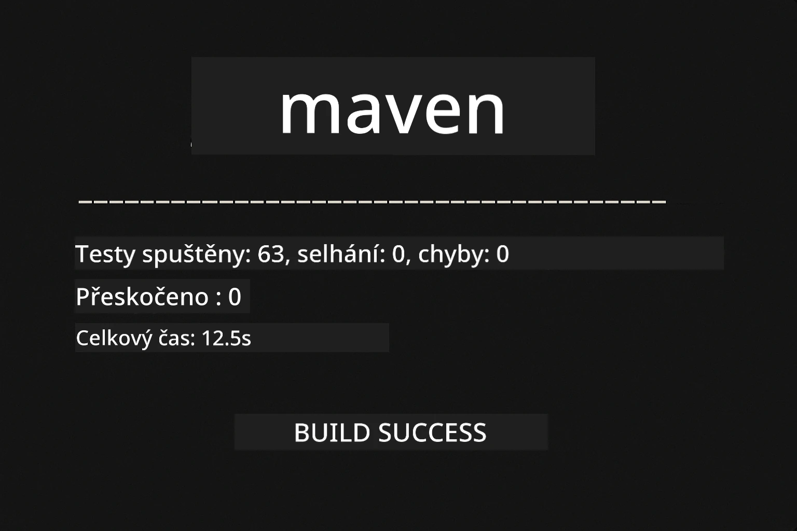
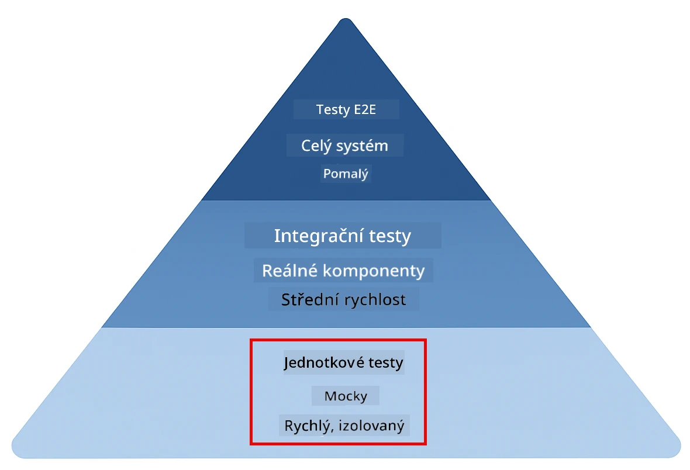
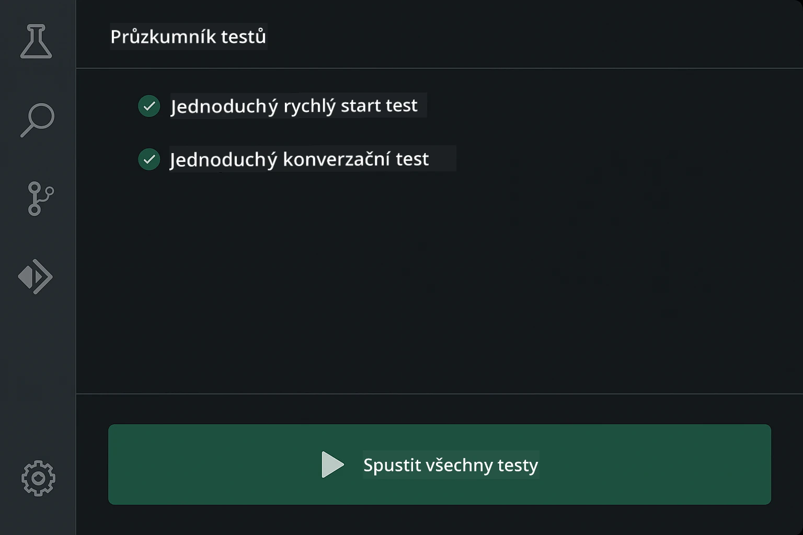
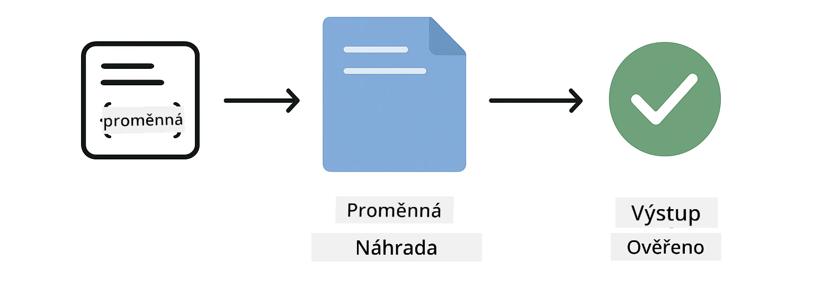
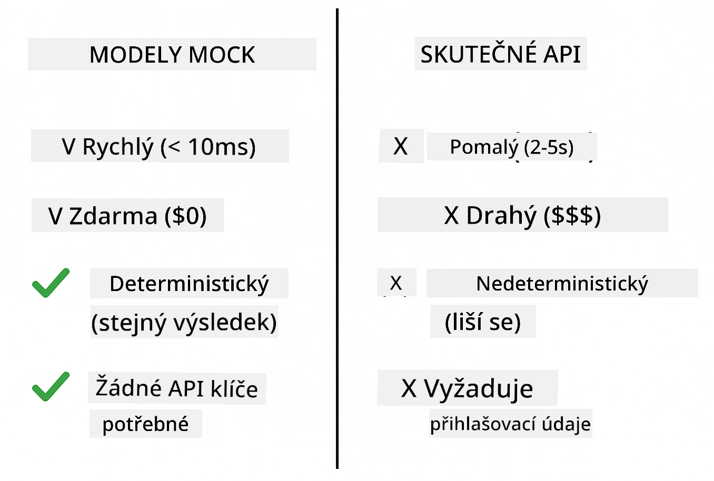
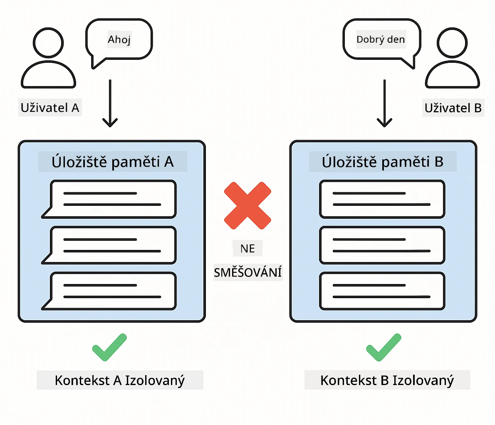
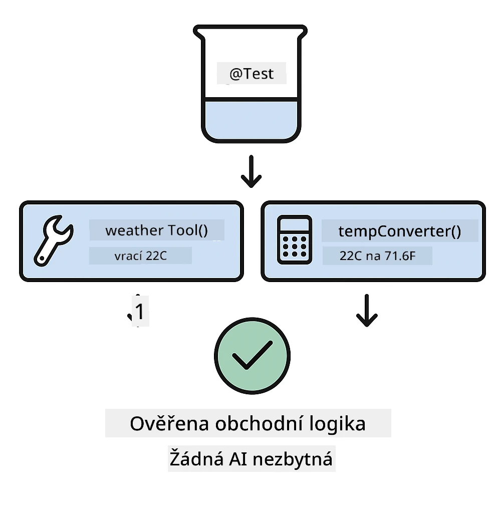
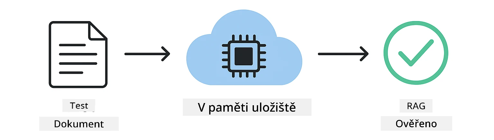

# Testování aplikací LangChain4j

## Obsah

- [Rychlý start](#rychlý-start)
- [Co testy pokrývají](#co-testy-pokrývají)
- [Spouštění testů](#spouštění-testů)
- [Spouštění testů ve VS Code](#spouštění-testů-ve-vs-code)
- [Testovací vzory](#testovací-vzory)
- [Filozofie testování](#filozofie-testování)
- [Další kroky](#další-kroky)

Tento průvodce vás provede testy, které ukazují, jak testovat AI aplikace bez potřeby API klíčů nebo externích služeb.

## Rychlý start

Spusťte všechny testy jediným příkazem:

**Bash:**
```bash
mvn test
```

**PowerShell:**
```powershell
mvn --% test
```

Když všechny testy projdou, měla by se zobrazit výstup podobný níže uvedené obrazovce — testy proběhnou bez chyb.



*Úspěšné spuštění testů ukazující všechny testy projít bez chyb*

## Co testy pokrývají

Tento kurz se zaměřuje na **jednotkové testy**, které běží lokálně. Každý test demonstruje konkrétní koncept LangChain4j izolovaně. Níže uvedená pyramida testování ukazuje, kde jednotkové testy zapadají — tvoří rychlý a spolehlivý základ, na kterém je postaven zbytek vaší testovací strategie.



*Testovací pyramida ukazující rovnováhu mezi jednotkovými testy (rychlé, izolované), integračními testy (reálné komponenty) a end-to-end testy. Toto školení pokrývá jednotkové testování.*

| Modul | Testy | Zaměření | Klíčové soubory |
|--------|-------|----------|-----------------|
| **01 - Úvod** | 8 | Paměť konverzace a stavový chat | `SimpleConversationTest.java` |
| **02 - Tvorba promptů** | 12 | Vzory GPT-5.2, úrovně ochoty, strukturovaný výstup | `SimpleGpt5PromptTest.java` |
| **03 - RAG** | 10 | Ingest dokumentů, embeddingy, vyhledávání podobnosti | `DocumentServiceTest.java` |
| **04 - Nástroje** | 12 | Volání funkcí a řetězení nástrojů | `SimpleToolsTest.java` |
| **05 - MCP** | 8 | Protokol Model Context s použitím stdio transportu | `SimpleMcpTest.java` |

## Spouštění testů

**Spusťte všechny testy ze složky root:**

**Bash:**
```bash
mvn test
```

**PowerShell:**
```powershell
mvn --% test
```

**Spusťte testy konkrétního modulu:**

**Bash:**
```bash
cd 01-introduction && mvn test
# Nebo z kořene
mvn test -pl 01-introduction
```

**PowerShell:**
```powershell
cd 01-introduction; mvn --% test
# Nebo z kořene
mvn --% test -pl 01-introduction
```

**Spusťte jednotlivou třídu testů:**

**Bash:**
```bash
mvn test -Dtest=SimpleConversationTest
```

**PowerShell:**
```powershell
mvn --% test -Dtest=SimpleConversationTest
```

**Spusťte konkrétní testovací metodu:**

**Bash:**
```bash
mvn test -Dtest=SimpleConversationTest#měla by udržovat historii konverzace
```

**PowerShell:**
```powershell
mvn --% test -Dtest=SimpleConversationTest#měli byste udržovat historii konverzace
```

## Spouštění testů ve VS Code

Pokud používáte Visual Studio Code, Test Explorer poskytuje grafické rozhraní pro spouštění a ladění testů.



*VS Code Test Explorer ukazující strom testů se všemi Java testovacími třídami a jednotlivými testovacími metodami*

**Jak spustit testy ve VS Code:**

1. Otevřete Test Explorer kliknutím na ikonu kádinky v panelu aktivit
2. Rozbalte strom testů, abyste viděli všechny moduly a testovací třídy
3. Klikněte na tlačítko přehrávání vedle kterékoli testu pro individuální spuštění
4. Klikněte na „Run All Tests“ pro spuštění celé sady
5. Klikněte pravým tlačítkem na test a vyberte „Debug Test“ pro nastavení breakpointů a krokování kódem

Test Explorer zobrazuje zelené zatržítka pro úspěšné testy a poskytuje podrobné chybové zprávy při selhání testů.

## Testovací vzory

### Vzor 1: Testování šablon promptů

Nejjednodušší vzor testuje šablony promptů bez volání AI modelu. Ověřujete, že nahrazení proměnných funguje správně a prompty jsou formátovány dle očekávání.



*Testování šablon promptů ukazující tok nahrazování proměnných: šablona s místy pro hodnoty → aplikované hodnoty → ověřený formátovaný výstup*

```java
@Test
@DisplayName("Should format prompt template with variables")
void testPromptTemplateFormatting() {
    PromptTemplate template = PromptTemplate.from(
        "Best time to visit {{destination}} for {{activity}}?"
    );
    
    Prompt prompt = template.apply(Map.of(
        "destination", "Paris",
        "activity", "sightseeing"
    ));
    
    assertThat(prompt.text()).isEqualTo("Best time to visit Paris for sightseeing?");
}
```

Tento vzor ověřuje, že nahrazení proměnných funguje správně a prompty jsou formátovány, jak se očekává — není potřeba API klíč ani volání modelu.

### Vzor 2: Mockování jazykových modelů

Při testování logiky konverzace použijte Mockito k vytvoření falešných modelů, které vracejí předem dané odpovědi. Díky tomu jsou testy rychlé, zdarma a deterministické.



*Srovnání ukazující, proč jsou misky preferované pro testování: jsou rychlé, zdarma, deterministické a nevyžadují API klíče*

```java
@ExtendWith(MockitoExtension.class)
class SimpleConversationTest {
    
    private ConversationService conversationService;
    
    @Mock
    private OpenAiOfficialChatModel mockChatModel;
    
    @BeforeEach
    void setUp() {
        ChatResponse mockResponse = ChatResponse.builder()
            .aiMessage(AiMessage.from("This is a test response"))
            .build();
        when(mockChatModel.chat(anyList())).thenReturn(mockResponse);
        
        conversationService = new ConversationService(mockChatModel);
    }
    
    @Test
    void shouldMaintainConversationHistory() {
        String conversationId = conversationService.startConversation();
        
        ChatResponse mockResponse1 = ChatResponse.builder()
            .aiMessage(AiMessage.from("Response 1"))
            .build();
        ChatResponse mockResponse2 = ChatResponse.builder()
            .aiMessage(AiMessage.from("Response 2"))
            .build();
        ChatResponse mockResponse3 = ChatResponse.builder()
            .aiMessage(AiMessage.from("Response 3"))
            .build();
        
        when(mockChatModel.chat(anyList()))
            .thenReturn(mockResponse1)
            .thenReturn(mockResponse2)
            .thenReturn(mockResponse3);

        conversationService.chat(conversationId, "First message");
        conversationService.chat(conversationId, "Second message");
        conversationService.chat(conversationId, "Third message");

        List<ChatMessage> history = conversationService.getHistory(conversationId);
        assertThat(history).hasSize(6); // 3 uživatelské + 3 AI zprávy
    }
}
```

Tento vzor je použit v `01-introduction/src/test/java/com/example/langchain4j/service/SimpleConversationTest.java`. Mock zajistí konzistentní chování pro ověření správného fungování správy paměti.

### Vzor 3: Testování izolace konverzace

Paměť konverzace musí udržovat uživatele odděleně. Tento test ověřuje, že se konverzace navzájem nekontextují.



*Testování izolace konverzace ukazující oddělené paměťové úložiště pro různé uživatele, aby nedocházelo ke smíchání kontextů*

```java
@Test
void shouldIsolateConversationsByid() {
    String conv1 = conversationService.startConversation();
    String conv2 = conversationService.startConversation();
    
    ChatResponse mockResponse = ChatResponse.builder()
        .aiMessage(AiMessage.from("Response"))
        .build();
    when(mockChatModel.chat(anyList())).thenReturn(mockResponse);

    conversationService.chat(conv1, "Message for conversation 1");
    conversationService.chat(conv2, "Message for conversation 2");

    List<ChatMessage> history1 = conversationService.getHistory(conv1);
    List<ChatMessage> history2 = conversationService.getHistory(conv2);
    
    assertThat(history1).hasSize(2);
    assertThat(history2).hasSize(2);
}
```

Každá konverzace má vlastní nezávislou historii. V produkčních systémech je tato izolace kritická pro víceuživatelské aplikace.

### Vzor 4: Testování nástrojů samostatně

Nástroje jsou funkce, které může AI volat. Otestujte je přímo, aby bylo zajištěno, že fungují správně bez ohledu na rozhodnutí AI.



*Testování nástrojů samostatně ukazující simulované spuštění nástrojů bez volání AI pro ověření podnikové logiky*

```java
@Test
void shouldConvertCelsiusToFahrenheit() {
    TemperatureTool tempTool = new TemperatureTool();
    String result = tempTool.celsiusToFahrenheit(25.0);
    assertThat(result).containsPattern("77[.,]0°F");
}

@Test
void shouldDemonstrateToolChaining() {
    WeatherTool weatherTool = new WeatherTool();
    TemperatureTool tempTool = new TemperatureTool();

    String weatherResult = weatherTool.getCurrentWeather("Seattle");
    assertThat(weatherResult).containsPattern("\\d+°C");

    String conversionResult = tempTool.celsiusToFahrenheit(22.0);
    assertThat(conversionResult).containsPattern("71[.,]6°F");
}
```

Tyto testy z `04-tools/src/test/java/com/example/langchain4j/agents/tools/SimpleToolsTest.java` ověřují logiku nástrojů bez zapojení AI. Příklad řetězení ukazuje, jak výstup jednoho nástroje slouží jako vstup do druhého.

### Vzor 5: Testování RAG v paměti

RAG systémy tradičně vyžadují vektorové databáze a embeddingové služby. Vzor v paměti umožňuje testovat celý proces bez externích závislostí.



*Průběh testování RAG v paměti ukazující zpracování dokumentu, ukládání embeddingů a vyhledávání podobnosti bez potřeby databáze*

```java
@Test
void testProcessTextDocument() {
    String content = "This is a test document.\nIt has multiple lines.";
    InputStream inputStream = new ByteArrayInputStream(content.getBytes(StandardCharsets.UTF_8));
    
    DocumentService.ProcessedDocument result = 
        documentService.processDocument(inputStream, "test.txt");

    assertNotNull(result);
    assertTrue(result.segments().size() > 0);
    assertEquals("test.txt", result.segments().get(0).metadata().getString("filename"));
}
```

Tento test z `03-rag/src/test/java/com/example/langchain4j/rag/service/DocumentServiceTest.java` vytváří dokument v paměti a ověřuje rozdělení na části a zpracování metadat.

### Vzor 6: Integrační testování MCP

Modul MCP testuje integraci Model Context Protocol s použitím stdio transportu. Tyto testy ověřují, že vaše aplikace může spouštět a komunikovat s MCP servery jako podprocesy.

Testy v `05-mcp/src/test/java/com/example/langchain4j/mcp/SimpleMcpTest.java` ověřují chování MCP klienta.

**Spusťte je:**

**Bash:**
```bash
cd 05-mcp && mvn test
```

**PowerShell:**
```powershell
cd 05-mcp; mvn --% test
```

## Filozofie testování

Testujte svůj kód, ne AI. Vaše testy by měly ověřovat kód, který píšete, tím že kontrolují, jak jsou prompt šablony sestavené, jak se spravuje paměť a jak se spouštějí nástroje. AI odpovědi jsou různorodé a neměly by být součástí testovacích tvrzení. Ptejte se, zda vaše šablona promptu správně nahrazuje proměnné, ne zda AI poskytuje správnou odpověď.

Používejte mocks pro jazykové modely. Jsou to externí závislosti, které jsou pomalé, drahé a nedeterministické. Mockování dělá testy rychlé (v milisekundách místo sekund), zdarma (bez nákladů na API) a deterministické (stejný výsledek pokaždé).

Udržujte testy nezávislé. Každý test by měl nastavit vlastní data, nespoléhat na jiné testy a uklidit po sobě. Testy by měly projít bez ohledu na pořadí spuštění.

Testujte hraniční případy mimo běžnou cestu. Zkoušejte prázdné vstupy, velmi velké vstupy, speciální znaky, neplatné parametry a okrajové podmínky. Ty často odhalují chyby, které normální použití neodhalí.

Používejte popisné názvy. Porovnejte `shouldMaintainConversationHistoryAcrossMultipleMessages()` s `test1()`. První přesně popisuje, co se testuje, což zjednodušuje ladění chyb.

## Další kroky

Nyní, když rozumíte testovacím vzorům, ponořte se hlouběji do jednotlivých modulů:

- **[01 - Úvod](../01-introduction/README.md)** - Naučte se správu paměti konverzace
- **[02 - Tvorba promptů](../02-prompt-engineering/README.md)** - Ovládněte vzory promptů GPT-5.2
- **[03 - RAG](../03-rag/README.md)** - Vytvořte systémy pro generování se získáváním informací
- **[04 - Nástroje](../04-tools/README.md)** - Implementujte volání funkcí a řetězení nástrojů
- **[05 - MCP](../05-mcp/README.md)** - Integrujte Model Context Protocol

README každého modulu nabízí podrobné vysvětlení testovaných konceptů.

---

**Navigace:** [← Zpět na hlavní stránku](../README.md)

---

<!-- CO-OP TRANSLATOR DISCLAIMER START -->
**Prohlášení o omezení odpovědnosti**:
Tento dokument byl přeložen pomocí AI překladatelské služby [Co-op Translator](https://github.com/Azure/co-op-translator). Přestože usilujeme o co největší přesnost, mějte prosím na paměti, že automatizované překlady mohou obsahovat chyby nebo nepřesnosti. Originální dokument v jeho mateřském jazyce by měl být považován za autoritativní zdroj. Pro kritické informace se doporučuje profesionální lidský překlad. Nejsme odpovědní za jakékoli nedorozumění nebo nesprávné interpretace vzniklé použitím tohoto překladu.
<!-- CO-OP TRANSLATOR DISCLAIMER END -->