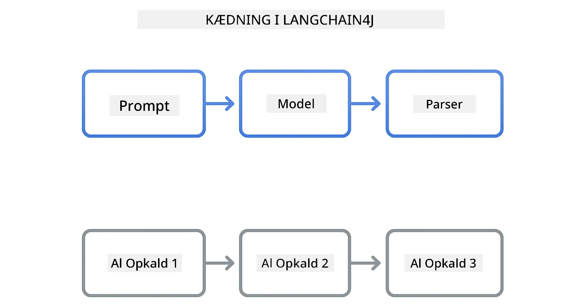
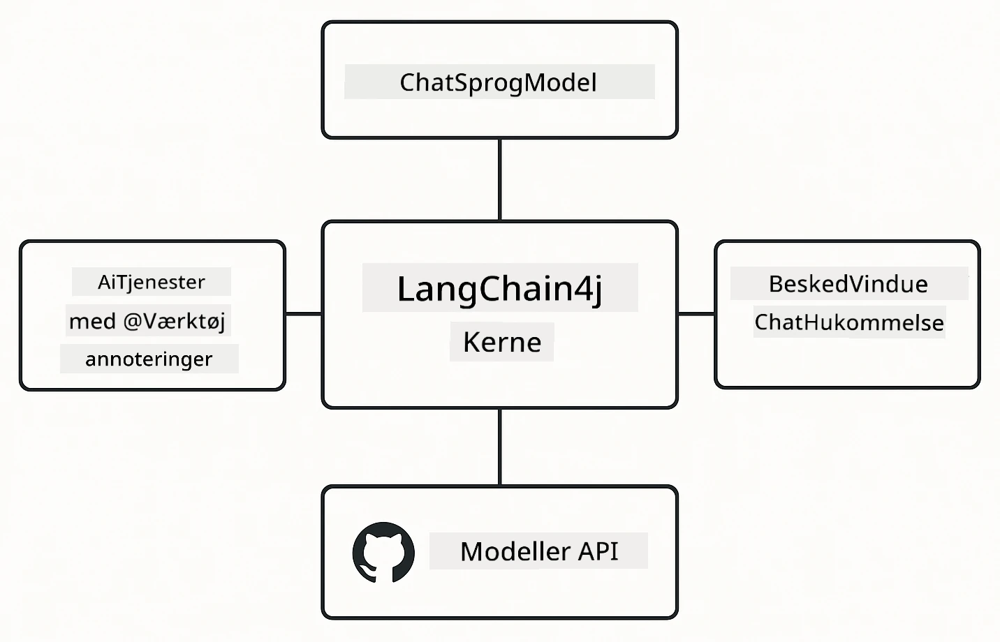

<!--
CO_OP_TRANSLATOR_METADATA:
{
  "original_hash": "22b5d7c8d7585325e38b37fd29eafe25",
  "translation_date": "2026-01-05T23:43:55+00:00",
  "source_file": "00-quick-start/README.md",
  "language_code": "da"
}
-->
# Modul 00: Kom godt i gang

## Indholdsfortegnelse

- [Introduktion](../../../00-quick-start)
- [Hvad er LangChain4j?](../../../00-quick-start)
- [LangChain4j-afhængigheder](../../../00-quick-start)
- [Forudsætninger](../../../00-quick-start)
- [Opsætning](../../../00-quick-start)
  - [1. Hent dit GitHub-token](../../../00-quick-start)
  - [2. Angiv dit token](../../../00-quick-start)
- [Kør eksemplerne](../../../00-quick-start)
  - [1. Grundlæggende chat](../../../00-quick-start)
  - [2. Prompt-mønstre](../../../00-quick-start)
  - [3. Funktionskald](../../../00-quick-start)
  - [4. Dokument Q&A (RAG)](../../../00-quick-start)
  - [5. Ansvarlig AI](../../../00-quick-start)
- [Hvad hvert eksempel viser](../../../00-quick-start)
- [Næste skridt](../../../00-quick-start)
- [Fejlfinding](../../../00-quick-start)

## Introduktion

Denne hurtigstart er designet til at få dig i gang med LangChain4j så hurtigt som muligt. Den dækker det absolutte grundlag for at bygge AI-applikationer med LangChain4j og GitHub Models. I de næste moduler vil du bruge Azure OpenAI med LangChain4j til at bygge mere avancerede applikationer.

## Hvad er LangChain4j?

LangChain4j er et Java-bibliotek, der forenkler opbygningen af AI-drevne applikationer. I stedet for at håndtere HTTP-klienter og JSON-parsing arbejder du med rene Java-API'er.

"Chain" i LangChain refererer til at kæde flere komponenter sammen - du kan kæde et prompt til en model til en parser, eller kæde flere AI-kald sammen, hvor et output føder næste input. Denne hurtigstart fokuserer på det fundamentale før man udforsker mere komplekse kæder.



*Kædning af komponenter i LangChain4j - byggeklodser forbindes for at skabe kraftfulde AI-arbejdsgange*

Vi bruger tre kernekomponenter:

**ChatLanguageModel** - Interfacet for AI-model-interaktioner. Kald `model.chat("prompt")` og få en respons som tekststreng. Vi bruger `OpenAiOfficialChatModel` som virker med OpenAI-kompatible endpoints som GitHub Models.

**AiServices** - Opretter typesikre AI-serviceinterfaces. Definer metoder, annoter dem med `@Tool` og LangChain4j håndterer orkestreringen. AI kalder automatisk dine Java-metoder når det er nødvendigt.

**MessageWindowChatMemory** - Vedligeholder samtalehistorik. Uden denne er hver anmodning uafhængig. Med den husker AI tidligere beskeder og opretholder kontekst over flere runder.



*LangChain4j arkitektur - kernekomponenter samarbejder for at drive dine AI-applikationer*

## LangChain4j-afhængigheder

Denne hurtigstart bruger to Maven-afhængigheder i [`pom.xml`](../../../00-quick-start/pom.xml):

```xml
<!-- Core LangChain4j library -->
<dependency>
    <groupId>dev.langchain4j</groupId>
    <artifactId>langchain4j</artifactId> <!-- Inherited from BOM in root pom.xml -->
</dependency>

<!-- OpenAI integration (works with GitHub Models) -->
<dependency>
    <groupId>dev.langchain4j</groupId>
    <artifactId>langchain4j-open-ai-official</artifactId> <!-- Inherited from BOM in root pom.xml -->
</dependency>
```

`langchain4j-open-ai-official` modulet leverer `OpenAiOfficialChatModel` klassen, der forbinder til OpenAI-kompatible API'er. GitHub Models bruger samme API-format, så ingen speciel adapter er nødvendig - peg blot base URL til `https://models.github.ai/inference`.

## Forudsætninger

**Bruger du Dev Container?** Java og Maven er allerede installeret. Du behøver kun et GitHub Personal Access Token.

**Lokal udvikling:**
- Java 21+, Maven 3.9+
- GitHub Personal Access Token (instruktioner nedenfor)

> **Bemærk:** Dette modul bruger `gpt-4.1-nano` fra GitHub Models. Ændr ikke modelnavnet i koden - det er konfigureret til at arbejde med GitHubs tilgængelige modeller.

## Opsætning

### 1. Hent dit GitHub-token

1. Gå til [GitHub Settings → Personal Access Tokens](https://github.com/settings/personal-access-tokens)
2. Klik "Generate new token"
3. Sæt et beskrivende navn (fx "LangChain4j Demo")
4. Sæt udløbstid (7 dage anbefalet)
5. Under "Account permissions", find "Models" og sæt til "Read-only"
6. Klik "Generate token"
7. Kopiér og gem dit token - du får det ikke vist igen

### 2. Angiv dit token

**Valgmulighed 1: Brug af VS Code (anbefalet)**

Hvis du bruger VS Code, tilføj dit token til `.env`-filen i projektets rodmappe:

Hvis `.env`-filen ikke findes, kopier `.env.example` til `.env` eller opret en ny `.env`-fil i projektets rodmappe.

**Eksempel på `.env` fil:**
```bash
# I /workspaces/LangChain4j-for-Beginners/.env
GITHUB_TOKEN=your_token_here
```

Herefter kan du blot højreklikke på en demofil (fx `BasicChatDemo.java`) i Explorer og vælge **"Run Java"** eller bruge launch-opsætningerne fra Run and Debug-panelet.

**Valgmulighed 2: Brug terminal**

Indstil token som en miljøvariabel:

**Bash:**
```bash
export GITHUB_TOKEN=your_token_here
```

**PowerShell:**
```powershell
$env:GITHUB_TOKEN=your_token_here
```

## Kør eksemplerne

**Brug af VS Code:** Højreklik blot på en demofil i Explorer og vælg **"Run Java"**, eller brug launch-opsætningerne fra Run and Debug-panelet (husk at have tilføjet dit token til `.env` først).

**Brug af Maven:** Alternativt kan du køre fra kommandolinjen:

### 1. Grundlæggende chat

**Bash:**
```bash
mvn compile exec:java -Dexec.mainClass=com.example.langchain4j.quickstart.BasicChatDemo
```

**PowerShell:**
```powershell
mvn --% compile exec:java -Dexec.mainClass=com.example.langchain4j.quickstart.BasicChatDemo
```

### 2. Prompt-mønstre

**Bash:**
```bash
mvn compile exec:java -Dexec.mainClass=com.example.langchain4j.quickstart.PromptEngineeringDemo
```

**PowerShell:**
```powershell
mvn --% compile exec:java -Dexec.mainClass=com.example.langchain4j.quickstart.PromptEngineeringDemo
```

Viser zero-shot, few-shot, chain-of-thought og rollebaseret prompting.

### 3. Funktionskald

**Bash:**
```bash
mvn compile exec:java -Dexec.mainClass=com.example.langchain4j.quickstart.ToolIntegrationDemo
```

**PowerShell:**
```powershell
mvn --% compile exec:java -Dexec.mainClass=com.example.langchain4j.quickstart.ToolIntegrationDemo
```

AI kalder automatisk dine Java-metoder når det er nødvendigt.

### 4. Dokument Q&A (RAG)

**Bash:**
```bash
mvn compile exec:java -Dexec.mainClass=com.example.langchain4j.quickstart.SimpleReaderDemo
```

**PowerShell:**
```powershell
mvn --% compile exec:java -Dexec.mainClass=com.example.langchain4j.quickstart.SimpleReaderDemo
```

Stil spørgsmål om indholdet i `document.txt`.

### 5. Ansvarlig AI

**Bash:**
```bash
mvn compile exec:java -Dexec.mainClass=com.example.langchain4j.quickstart.ResponsibleAIDemo
```

**PowerShell:**
```powershell
mvn --% compile exec:java -Dexec.mainClass=com.example.langchain4j.quickstart.ResponsibleAIDemo
```

Se hvordan AI-sikkerhedsfiltre blokerer skadeligt indhold.

## Hvad hvert eksempel viser

**Grundlæggende chat** - [BasicChatDemo.java](../../../00-quick-start/src/main/java/com/example/langchain4j/quickstart/BasicChatDemo.java)

Start her for at se LangChain4j i sin enkleste form. Du opretter en `OpenAiOfficialChatModel`, sender et prompt med `.chat()`, og får et svar tilbage. Dette demonstrerer fundamentet: hvordan man initialiserer modeller med brugerdefinerede endpoints og API-nøgler. Når du forstår dette mønster, bygger resten videre på det.

```java
ChatLanguageModel model = OpenAiOfficialChatModel.builder()
    .baseUrl("https://models.github.ai/inference")
    .apiKey(System.getenv("GITHUB_TOKEN"))
    .modelName("gpt-4.1-nano")
    .build();

String response = model.chat("What is LangChain4j?");
System.out.println(response);
```

> **🤖 Prøv med [GitHub Copilot](https://github.com/features/copilot) Chat:** Åbn [`BasicChatDemo.java`](../../../00-quick-start/src/main/java/com/example/langchain4j/quickstart/BasicChatDemo.java) og spørg:
> - "Hvordan skifter jeg fra GitHub Models til Azure OpenAI i denne kode?"
> - "Hvilke andre parametre kan jeg konfigurere i OpenAiOfficialChatModel.builder()?"
> - "Hvordan tilføjer jeg streaming-respons i stedet for at vente på den komplette respons?"

**Prompt Engineering** - [PromptEngineeringDemo.java](../../../00-quick-start/src/main/java/com/example/langchain4j/quickstart/PromptEngineeringDemo.java)

Nu hvor du ved, hvordan man taler med en model, lad os udforske hvad du siger til den. Denne demo bruger samme modelsetup, men viser fire forskellige prompt-mønstre. Prøv zero-shot prompts for direkte instruktioner, few-shot prompts som lærer fra eksempler, chain-of-thought prompts som afslører ræsonneringsskridt, og rollebaserede prompts som sætter kontekst. Du vil se, hvordan den samme model giver dramatiske forskellige resultater baseret på, hvordan du formulerer din forespørgsel.

```java
PromptTemplate template = PromptTemplate.from(
    "What's the best time to visit {{destination}} for {{activity}}?"
);

Prompt prompt = template.apply(Map.of(
    "destination", "Paris",
    "activity", "sightseeing"
));

String response = model.chat(prompt.text());
```

> **🤖 Prøv med [GitHub Copilot](https://github.com/features/copilot) Chat:** Åbn [`PromptEngineeringDemo.java`](../../../00-quick-start/src/main/java/com/example/langchain4j/quickstart/PromptEngineeringDemo.java) og spørg:
> - "Hvad er forskellen på zero-shot og few-shot prompting, og hvornår skal jeg bruge hver?"
> - "Hvordan påvirker temperaturparameteren modellens svar?"
> - "Hvilke teknikker er der for at forhindre prompt-injektionsangreb i produktion?"
> - "Hvordan kan jeg lave genanvendelige PromptTemplate-objekter til almindelige mønstre?"

**Integration af værktøjer** - [ToolIntegrationDemo.java](../../../00-quick-start/src/main/java/com/example/langchain4j/quickstart/ToolIntegrationDemo.java)

Her bliver LangChain4j kraftfuldt. Du bruger `AiServices` til at skabe en AI-assistent, der kan kalde dine Java-metoder. Annoter blot metoder med `@Tool("beskrivelse")` og LangChain4j håndterer resten - AI beslutter automatisk hvornår hvert værktøj skal bruges baseret på brugerens forespørgsel. Dette demonstrerer funktionskald, en nøglemetode til at bygge AI der kan tage handlinger, ikke blot svare på spørgsmål.

```java
@Tool("Performs addition of two numeric values")
public double add(double a, double b) {
    return a + b;
}

MathAssistant assistant = AiServices.create(MathAssistant.class, model);
String response = assistant.chat("What is 25 plus 17?");
```

> **🤖 Prøv med [GitHub Copilot](https://github.com/features/copilot) Chat:** Åbn [`ToolIntegrationDemo.java`](../../../00-quick-start/src/main/java/com/example/langchain4j/quickstart/ToolIntegrationDemo.java) og spørg:
> - "Hvordan fungerer @Tool-annoteringen og hvad gør LangChain4j med den bag scenen?"
> - "Kan AI kalde flere værktøjer i rækkefølge for at løse komplekse problemer?"
> - "Hvad sker der hvis et værktøj kaster en undtagelse - hvordan håndterer jeg fejl?"
> - "Hvordan integrerer jeg en rigtig API i stedet for dette lommeregner-eksempel?"

**Dokument Q&A (RAG)** - [SimpleReaderDemo.java](../../../00-quick-start/src/main/java/com/example/langchain4j/quickstart/SimpleReaderDemo.java)

Her ser du fundamentet for RAG (retrieval-augmented generation). I stedet for at stole på modellens træningsdata, loader du indhold fra [`document.txt`](../../../00-quick-start/document.txt) og inkluderer det i prompten. AI svarer baseret på dit dokument, ikke på sin generelle viden. Dette er første skridt til at bygge systemer, der kan arbejde med dine egne data.

```java
Document document = FileSystemDocumentLoader.loadDocument("document.txt");
String content = document.text();

String prompt = "Based on this document: " + content + 
                "\nQuestion: What is the main topic?";
String response = model.chat(prompt);
```

> **Bemærk:** Denne simple tilgang loader hele dokumentet ind i prompten. For store filer (>10KB) overskrides kontekstgrænser. Modul 03 dækker chunking og vektorsøgning til produktions-RAG-systemer.

> **🤖 Prøv med [GitHub Copilot](https://github.com/features/copilot) Chat:** Åbn [`SimpleReaderDemo.java`](../../../00-quick-start/src/main/java/com/example/langchain4j/quickstart/SimpleReaderDemo.java) og spørg:
> - "Hvordan forhindrer RAG AI-hallucinationer sammenlignet med at bruge modellens træningsdata?"
> - "Hvad er forskellen på denne simple tilgang og brug af vektor-embedding til opslag?"
> - "Hvordan skalerer jeg dette til at håndtere flere dokumenter eller større vidensbaser?"
> - "Hvad er bedste praksis for at strukturere prompten så AI kun bruger den givne kontekst?"

**Ansvarlig AI** - [ResponsibleAIDemo.java](../../../00-quick-start/src/main/java/com/example/langchain4j/quickstart/ResponsibleAIDemo.java)

Byg AI-sikkerhed med forsvar i dybden. Denne demo viser to lag af beskyttelse, der arbejder sammen:

**Del 1: LangChain4j Input Guardrails** - Bloker farlige prompts før de når LLM. Opret brugerdefinerede guardrails, der tjekker for forbudte nøgleord eller mønstre. De kører i din kode, så de er hurtige og gratis.

```java
class DangerousContentGuardrail implements InputGuardrail {
    @Override
    public InputGuardrailResult validate(UserMessage userMessage) {
        String text = userMessage.singleText().toLowerCase();
        if (text.contains("explosives")) {
            return fatal("Blocked: contains prohibited keyword");
        }
        return success();
    }
}
```

**Del 2: Udbydersikkerhedsfiltre** - GitHub Models har indbyggede filtre, der fanger det dine guardrails måske missede. Du vil se hårde blokeringer (HTTP 400-fejl) for alvorlige overtrædelser og bløde afvisninger, hvor AI høfligt declining.

> **🤖 Prøv med [GitHub Copilot](https://github.com/features/copilot) Chat:** Åbn [`ResponsibleAIDemo.java`](../../../00-quick-start/src/main/java/com/example/langchain4j/quickstart/ResponsibleAIDemo.java) og spørg:
> - "Hvad er InputGuardrail og hvordan laver jeg mine egne?"
> - "Hvad er forskellen på en hård blokering og en blød afvisning?"
> - "Hvorfor bruge både guardrails og udbyderfiltre sammen?"

## Næste skridt

**Næste modul:** [01-introduction - Kom godt i gang med LangChain4j og gpt-5 på Azure](../01-introduction/README.md)

---

**Navigation:** [← Tilbage til hoved](../README.md) | [Næste: Modul 01 - Introduktion →](../01-introduction/README.md)

---

## Fejlfinding

### Første gang Maven bygger

**Problem**: Første `mvn clean compile` eller `mvn package` tager lang tid (10-15 minutter)

**Årsag**: Maven skal hente alle projektets afhængigheder (Spring Boot, LangChain4j-biblioteker, Azure SDK'er osv.) ved den første build.

**Løsning**: Dette er normal adfærd. Efterfølgende builds bliver meget hurtigere, da afhængigheder caches lokalt. Download-tiden afhænger af din netværkshastighed.

### PowerShell Maven-kommando syntaks

**Problem**: Maven-kommandoer fejler med fejl `Unknown lifecycle phase ".mainClass=..."`

**Årsag**: PowerShell tolker `=` som en variabel-tildelingsoperator, hvilket bryder Maven property-syntaksen.
**Løsning**: Brug stop-parsing operatoren `--%` før Maven-kommandoen:

**PowerShell:**
```powershell
mvn --% compile exec:java -Dexec.mainClass=com.example.langchain4j.quickstart.BasicChatDemo
```

**Bash:**
```bash
mvn compile exec:java -Dexec.mainClass=com.example.langchain4j.quickstart.BasicChatDemo
```

`--%` operatoren fortæller PowerShell at videregive alle resterende argumenter bogstaveligt til Maven uden fortolkning.

### Windows PowerShell Emoji-visning

**Problem**: AI-svar viser uforståelige tegn (f.eks. `????` eller `â??`) i stedet for emojis i PowerShell

**Årsag**: PowerShells standardkodning understøtter ikke UTF-8 emojis

**Løsning**: Kør denne kommando før du kører Java-applikationer:
```cmd
chcp 65001
```

Dette tvinger UTF-8 kodning i terminalen. Alternativt kan du bruge Windows Terminal, som har bedre Unicode-understøttelse.

### Fejlfinding af API-kald

**Problem**: Autentificeringsfejl, ratebegrænsninger eller uventede svar fra AI-modellen

**Løsning**: Eksemplerne inkluderer `.logRequests(true)` og `.logResponses(true)` for at vise API-kald i konsollen. Dette hjælper med at fejlfinde autentificeringsfejl, ratebegrænsninger eller uventede svar. Fjern disse flags i produktion for at reducere log-støj.

---

<!-- CO-OP TRANSLATOR DISCLAIMER START -->
**Ansvarsfraskrivelse**:
Dette dokument er blevet oversat ved hjælp af AI-oversættelsestjenesten [Co-op Translator](https://github.com/Azure/co-op-translator). Selvom vi bestræber os på nøjagtighed, bedes du være opmærksom på, at automatiserede oversættelser kan indeholde fejl eller unøjagtigheder. Det oprindelige dokument på dets oprindelige sprog bør betragtes som den autoritative kilde. For kritiske oplysninger anbefales professionel menneskelig oversættelse. Vi påtager os intet ansvar for eventuelle misforståelser eller fejltolkninger, der opstår som følge af brugen af denne oversættelse.
<!-- CO-OP TRANSLATOR DISCLAIMER END -->