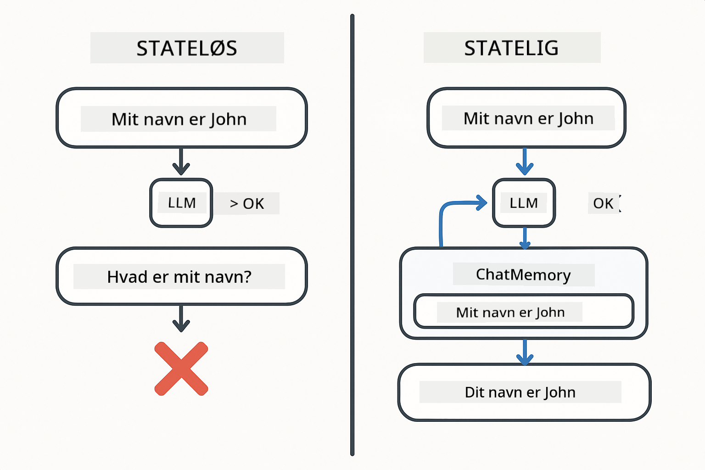
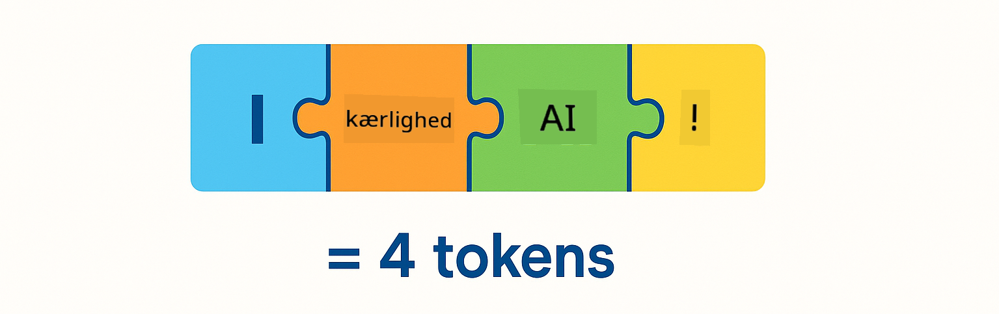
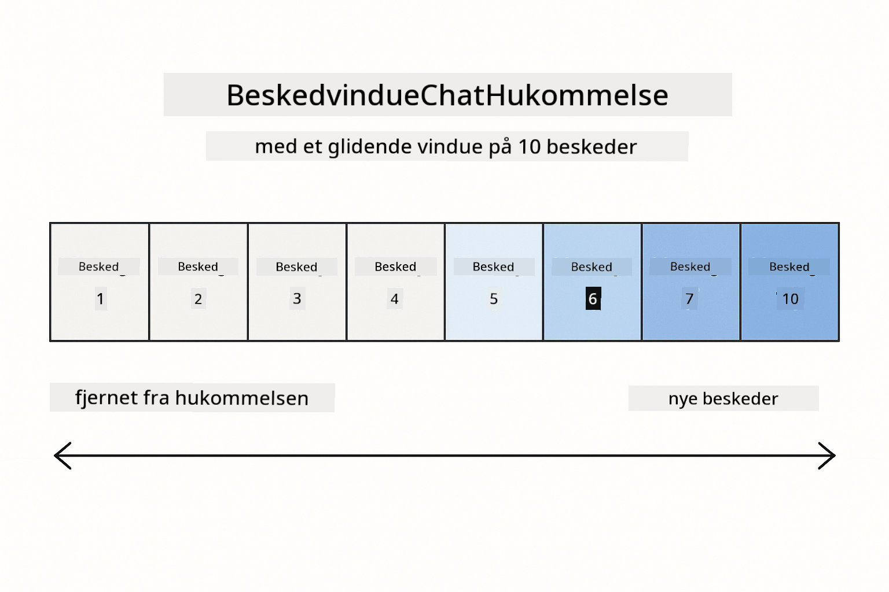
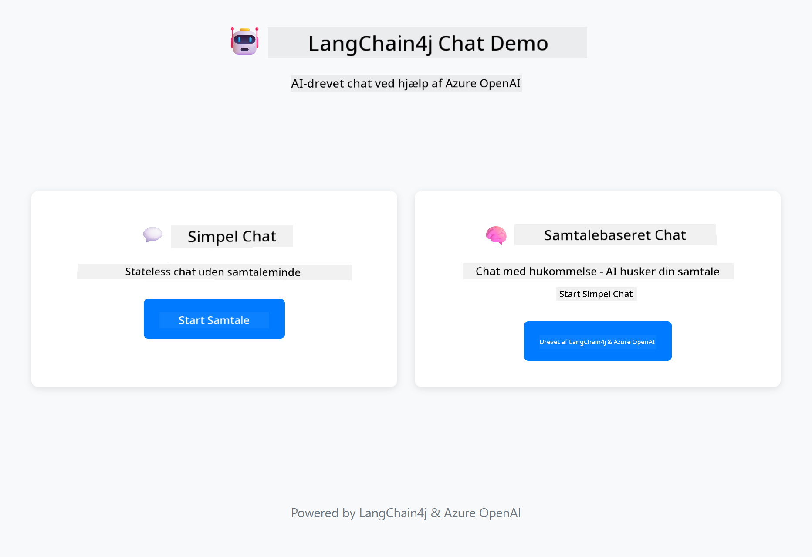
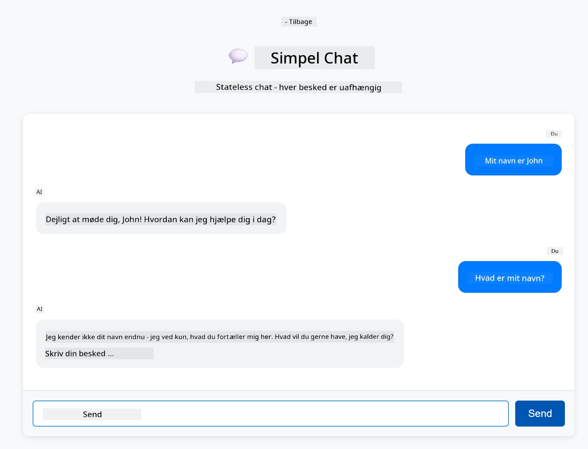
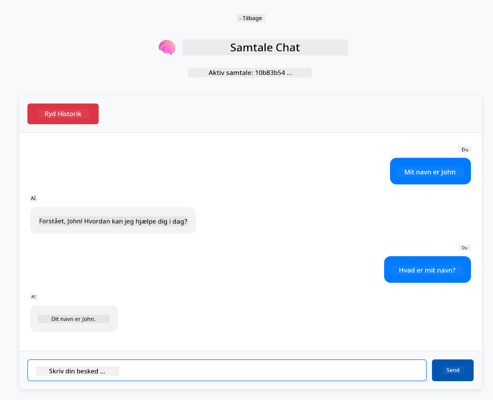

<!--
CO_OP_TRANSLATOR_METADATA:
{
  "original_hash": "c3e07ca58d0b8a3f47d3bf5728541e0a",
  "translation_date": "2025-12-13T13:41:24+00:00",
  "source_file": "01-introduction/README.md",
  "language_code": "da"
}
-->
# Modul 01: Kom godt i gang med LangChain4j

## Indholdsfortegnelse

- [Hvad du vil lære](../../../01-introduction)
- [Forudsætninger](../../../01-introduction)
- [Forståelse af kerneproblemet](../../../01-introduction)
- [Forståelse af tokens](../../../01-introduction)
- [Hvordan hukommelse fungerer](../../../01-introduction)
- [Hvordan dette bruger LangChain4j](../../../01-introduction)
- [Deploy Azure OpenAI-infrastruktur](../../../01-introduction)
- [Kør applikationen lokalt](../../../01-introduction)
- [Brug af applikationen](../../../01-introduction)
  - [Stateless chat (venstre panel)](../../../01-introduction)
  - [Stateful chat (højre panel)](../../../01-introduction)
- [Næste skridt](../../../01-introduction)

## Hvad du vil lære

Hvis du gennemførte quick start, så du, hvordan man sender prompts og får svar. Det er fundamentet, men rigtige applikationer kræver mere. Dette modul lærer dig, hvordan du bygger konverserende AI, der husker kontekst og opretholder tilstand – forskellen mellem en engangs-demo og en produktionsklar applikation.

Vi bruger Azure OpenAI's GPT-5 gennem hele denne guide, fordi dens avancerede ræsonneringsevner gør adfærden af forskellige mønstre mere tydelig. Når du tilføjer hukommelse, vil du klart kunne se forskellen. Det gør det nemmere at forstå, hvad hver komponent bidrager med til din applikation.

Du vil bygge én applikation, der demonstrerer begge mønstre:

**Stateless Chat** – Hver forespørgsel er uafhængig. Modellen har ingen hukommelse om tidligere beskeder. Dette er det mønster, du brugte i quick start.

**Stateful Conversation** – Hver forespørgsel inkluderer samtalehistorik. Modellen opretholder kontekst over flere runder. Dette er, hvad produktionsapplikationer kræver.

## Forudsætninger

- Azure-abonnement med adgang til Azure OpenAI
- Java 21, Maven 3.9+
- Azure CLI (https://learn.microsoft.com/en-us/cli/azure/install-azure-cli)
- Azure Developer CLI (azd) (https://learn.microsoft.com/en-us/azure/developer/azure-developer-cli/install-azd)

> **Note:** Java, Maven, Azure CLI og Azure Developer CLI (azd) er forudinstalleret i den medfølgende devcontainer.

> **Note:** Dette modul bruger GPT-5 på Azure OpenAI. Deployeringen konfigureres automatisk via `azd up` – ændr ikke modelnavnet i koden.

## Forståelse af kerneproblemet

Sproglige modeller er stateless. Hver API-kald er uafhængigt. Hvis du sender "Mit navn er John" og derefter spørger "Hvad er mit navn?", har modellen ingen idé om, at du lige har præsenteret dig. Den behandler hver forespørgsel, som om det er den første samtale, du nogensinde har haft.

Det er fint til simple Q&A, men ubrugeligt til rigtige applikationer. Kundeservicebots skal huske, hvad du har fortalt dem. Personlige assistenter har brug for kontekst. Enhver samtale med flere runder kræver hukommelse.



*Forskellen mellem stateless (uafhængige kald) og stateful (kontekstbevidste) samtaler*

## Forståelse af tokens

Før vi dykker ned i samtaler, er det vigtigt at forstå tokens – de grundlæggende tekst-enheder, som sproglige modeller behandler:



*Eksempel på, hvordan tekst opdeles i tokens – "I love AI!" bliver til 4 separate behandlingsenheder*

Tokens er, hvordan AI-modeller måler og behandler tekst. Ord, tegnsætning og endda mellemrum kan være tokens. Din model har en grænse for, hvor mange tokens den kan behandle på én gang (400.000 for GPT-5, med op til 272.000 input-tokens og 128.000 output-tokens). At forstå tokens hjælper dig med at styre samtalens længde og omkostninger.

## Hvordan hukommelse fungerer

Chat-hukommelse løser det stateless problem ved at opretholde samtalehistorik. Før du sender din forespørgsel til modellen, tilføjer frameworket relevante tidligere beskeder foran. Når du spørger "Hvad er mit navn?", sender systemet faktisk hele samtalehistorikken, så modellen kan se, at du tidligere sagde "Mit navn er John."

LangChain4j leverer hukommelsesimplementeringer, der håndterer dette automatisk. Du vælger, hvor mange beskeder der skal gemmes, og frameworket styrer kontekstvinduet.



*MessageWindowChatMemory opretholder et glidende vindue af nylige beskeder og fjerner automatisk gamle*

## Hvordan dette bruger LangChain4j

Dette modul udvider quick start ved at integrere Spring Boot og tilføje samtalehukommelse. Sådan passer delene sammen:

**Afhængigheder** – Tilføj to LangChain4j-biblioteker:

```xml
<dependency>
    <groupId>dev.langchain4j</groupId>
    <artifactId>langchain4j</artifactId> <!-- Inherited from BOM in root pom.xml -->
</dependency>
<dependency>
    <groupId>dev.langchain4j</groupId>
    <artifactId>langchain4j-open-ai-official</artifactId> <!-- Inherited from BOM in root pom.xml -->
</dependency>
```

**Chat Model** – Konfigurer Azure OpenAI som en Spring bean ([LangChainConfig.java](../../../01-introduction/src/main/java/com/example/langchain4j/config/LangChainConfig.java)):

```java
@Bean
public OpenAiOfficialChatModel openAiOfficialChatModel() {
    return OpenAiOfficialChatModel.builder()
            .baseUrl(azureEndpoint)
            .apiKey(azureApiKey)
            .modelName(deploymentName)
            .timeout(Duration.ofMinutes(5))
            .maxRetries(3)
            .build();
}
```

Builderen læser legitimationsoplysninger fra miljøvariabler sat af `azd up`. At sætte `baseUrl` til din Azure-endpoint får OpenAI-klienten til at fungere med Azure OpenAI.

**Samtalehukommelse** – Spor chat-historik med MessageWindowChatMemory ([ConversationService.java](../../../01-introduction/src/main/java/com/example/langchain4j/service/ConversationService.java)):

```java
ChatMemory memory = MessageWindowChatMemory.withMaxMessages(10);

memory.add(UserMessage.from("My name is John"));
memory.add(AiMessage.from("Nice to meet you, John!"));

memory.add(UserMessage.from("What's my name?"));
AiMessage aiMessage = chatModel.chat(memory.messages()).aiMessage();
memory.add(aiMessage);
```

Opret hukommelse med `withMaxMessages(10)` for at beholde de sidste 10 beskeder. Tilføj bruger- og AI-beskeder med typede wrappers: `UserMessage.from(text)` og `AiMessage.from(text)`. Hent historik med `memory.messages()` og send den til modellen. Servicen gemmer separate hukommelsesinstanser pr. samtale-ID, så flere brugere kan chatte samtidig.

> **🤖 Prøv med [GitHub Copilot](https://github.com/features/copilot) Chat:** Åbn [`ConversationService.java`](../../../01-introduction/src/main/java/com/example/langchain4j/service/ConversationService.java) og spørg:
> - "Hvordan beslutter MessageWindowChatMemory, hvilke beskeder der skal droppes, når vinduet er fuldt?"
> - "Kan jeg implementere brugerdefineret hukommelseslagring ved hjælp af en database i stedet for in-memory?"
> - "Hvordan tilføjer jeg opsummering for at komprimere gammel samtalehistorik?"

Den stateless chat-endpoint springer hukommelse helt over – bare `chatModel.chat(prompt)` som i quick start. Den stateful endpoint tilføjer beskeder til hukommelsen, henter historik og inkluderer den kontekst med hver forespørgsel. Samme modelkonfiguration, forskellige mønstre.

## Deploy Azure OpenAI-infrastruktur

**Bash:**
```bash
cd 01-introduction
azd up  # Vælg abonnement og placering (eastus2 anbefales)
```

**PowerShell:**
```powershell
cd 01-introduction
azd up  # Vælg abonnement og placering (eastus2 anbefales)
```

> **Note:** Hvis du støder på en timeout-fejl (`RequestConflict: Cannot modify resource ... provisioning state is not terminal`), så kør blot `azd up` igen. Azure-ressourcer kan stadig være under provisionering i baggrunden, og et nyt forsøg tillader deployeringen at fuldføres, når ressourcerne når en terminal tilstand.

Dette vil:
1. Deploye Azure OpenAI-ressource med GPT-5 og text-embedding-3-small modeller
2. Automatisk generere `.env`-fil i projektroden med legitimationsoplysninger
3. Sætte alle nødvendige miljøvariabler op

**Har du problemer med deployeringen?** Se [Infrastructure README](infra/README.md) for detaljeret fejlfinding, herunder subdomænenavn-konflikter, manuelle Azure Portal deploy-trin og vejledning til modelkonfiguration.

**Bekræft at deployeringen lykkedes:**

**Bash:**
```bash
cat ../.env  # Skal vise AZURE_OPENAI_ENDPOINT, API_KEY osv.
```

**PowerShell:**
```powershell
Get-Content ..\.env  # Skal vise AZURE_OPENAI_ENDPOINT, API_KEY osv.
```

> **Note:** `azd up`-kommandoen genererer automatisk `.env`-filen. Hvis du senere skal opdatere den, kan du enten redigere `.env`-filen manuelt eller regenerere den ved at køre:
>
> **Bash:**
> ```bash
> cd ..
> bash .azd-env.sh
> ```
>
> **PowerShell:**
> ```powershell
> cd ..
> .\.azd-env.ps1
> ```

## Kør applikationen lokalt

**Bekræft deployering:**

Sørg for, at `.env`-filen findes i roddirektoriet med Azure-legitimationsoplysninger:

**Bash:**
```bash
cat ../.env  # Skal vise AZURE_OPENAI_ENDPOINT, API_KEY, DEPLOYMENT
```

**PowerShell:**
```powershell
Get-Content ..\.env  # Skal vise AZURE_OPENAI_ENDPOINT, API_KEY, DEPLOYMENT
```

**Start applikationerne:**

**Mulighed 1: Brug Spring Boot Dashboard (anbefalet til VS Code-brugere)**

Dev containeren inkluderer Spring Boot Dashboard-udvidelsen, som giver en visuel grænseflade til at styre alle Spring Boot-applikationer. Du finder den i aktivitetsbjælken til venstre i VS Code (se efter Spring Boot-ikonet).

Fra Spring Boot Dashboard kan du:
- Se alle tilgængelige Spring Boot-applikationer i workspace
- Starte/stoppe applikationer med et enkelt klik
- Se applikationslogs i realtid
- Overvåge applikationsstatus

Klik blot på play-knappen ved siden af "introduction" for at starte dette modul, eller start alle moduler på én gang.


**Mulighed 2: Brug shell-scripts**

Start alle webapplikationer (moduler 01-04):

**Bash:**
```bash
cd ..  # Fra roddirectory
./start-all.sh
```

**PowerShell:**
```powershell
cd ..  # Fra roddirectory
.\start-all.ps1
```

Eller start kun dette modul:

**Bash:**
```bash
cd 01-introduction
./start.sh
```

**PowerShell:**
```powershell
cd 01-introduction
.\start.ps1
```

Begge scripts indlæser automatisk miljøvariabler fra roden `.env`-filen og bygger JAR-filerne, hvis de ikke findes.

> **Note:** Hvis du foretrækker at bygge alle moduler manuelt før start:
>
> **Bash:**
> ```bash
> cd ..  # Go to root directory
> mvn clean package -DskipTests
> ```
>
> **PowerShell:**
> ```powershell
> cd ..  # Go to root directory
> mvn clean package -DskipTests
> ```

Åbn http://localhost:8080 i din browser.

**For at stoppe:**

**Bash:**
```bash
./stop.sh  # Kun denne modul
# Eller
cd .. && ./stop-all.sh  # Alle moduler
```

**PowerShell:**
```powershell
.\stop.ps1  # Kun denne modul
# Eller
cd ..; .\stop-all.ps1  # Alle moduler
```

## Brug af applikationen

Applikationen tilbyder en webgrænseflade med to chat-implementeringer side om side.



*Dashboard, der viser både Simple Chat (stateless) og Conversational Chat (stateful) muligheder*

### Stateless chat (venstre panel)

Prøv denne først. Spørg "Mit navn er John" og spørg så straks "Hvad er mit navn?" Modellen vil ikke huske, fordi hver besked er uafhængig. Dette demonstrerer kerneproblemet med basal integration af sproglige modeller – ingen samtalekontekst.



*AI husker ikke dit navn fra den forrige besked*

### Stateful chat (højre panel)

Prøv nu samme sekvens her. Spørg "Mit navn er John" og så "Hvad er mit navn?" Denne gang husker den. Forskellen er MessageWindowChatMemory – den opretholder samtalehistorik og inkluderer den med hver forespørgsel. Sådan fungerer produktionsklar konverserende AI.



*AI husker dit navn fra tidligere i samtalen*

Begge paneler bruger samme GPT-5-model. Den eneste forskel er hukommelse. Det gør det klart, hvad hukommelse tilfører din applikation, og hvorfor det er essentielt for reelle brugsscenarier.

## Næste skridt

**Næste modul:** [02-prompt-engineering - Prompt Engineering med GPT-5](../02-prompt-engineering/README.md)

---

**Navigation:** [← Forrige: Modul 00 - Quick Start](../00-quick-start/README.md) | [Tilbage til hoved](../README.md) | [Næste: Modul 02 - Prompt Engineering →](../02-prompt-engineering/README.md)

---

<!-- CO-OP TRANSLATOR DISCLAIMER START -->
**Ansvarsfraskrivelse**:
Dette dokument er blevet oversat ved hjælp af AI-oversættelsestjenesten [Co-op Translator](https://github.com/Azure/co-op-translator). Selvom vi bestræber os på nøjagtighed, bedes du være opmærksom på, at automatiserede oversættelser kan indeholde fejl eller unøjagtigheder. Det oprindelige dokument på dets modersmål bør betragtes som den autoritative kilde. For kritisk information anbefales professionel menneskelig oversættelse. Vi påtager os intet ansvar for misforståelser eller fejltolkninger, der opstår som følge af brugen af denne oversættelse.
<!-- CO-OP TRANSLATOR DISCLAIMER END -->