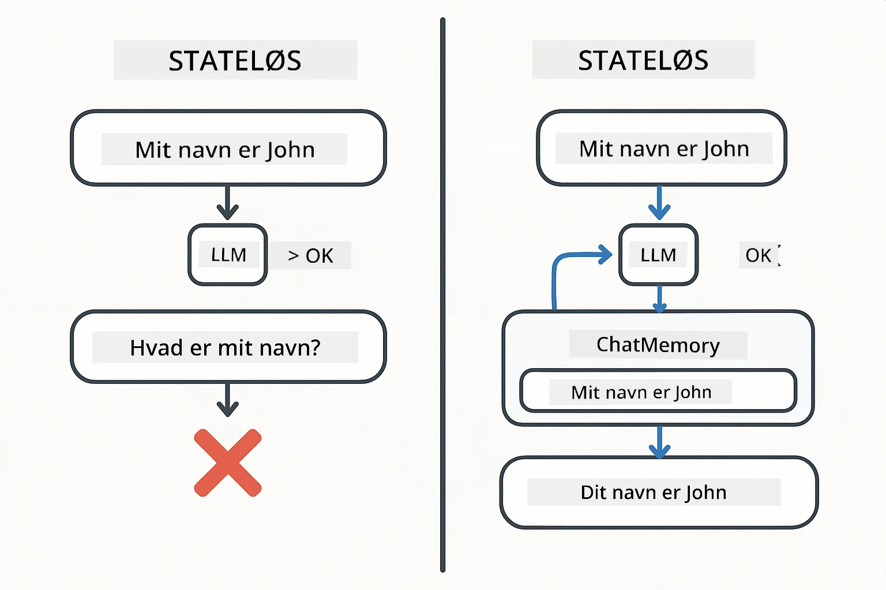
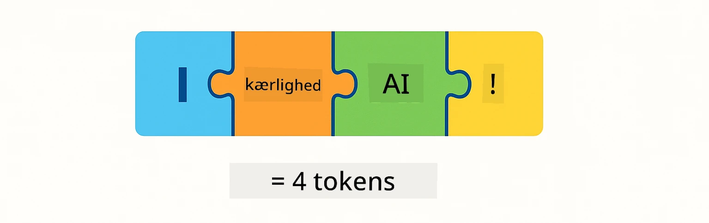
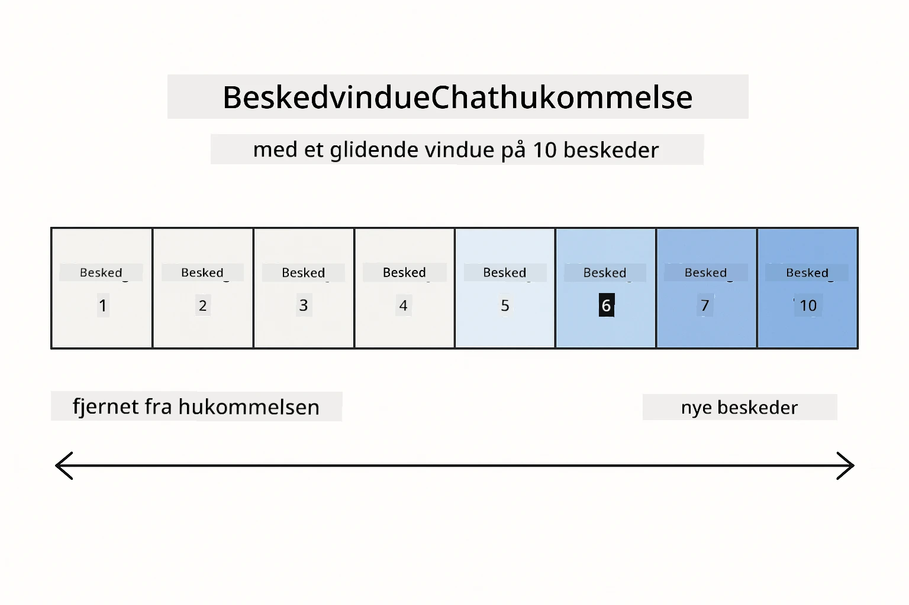
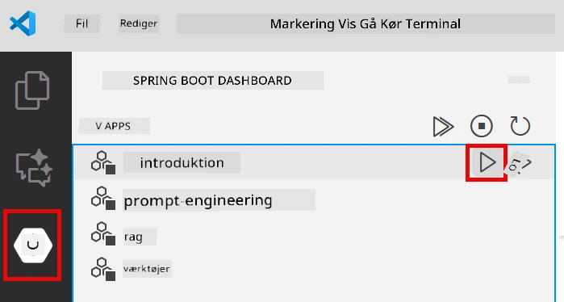
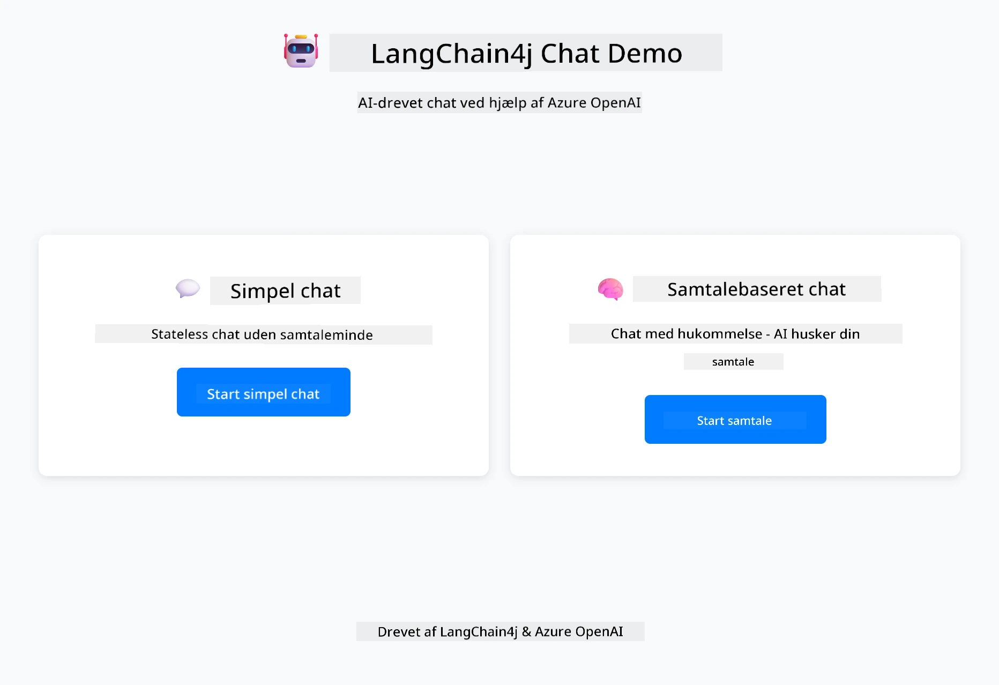
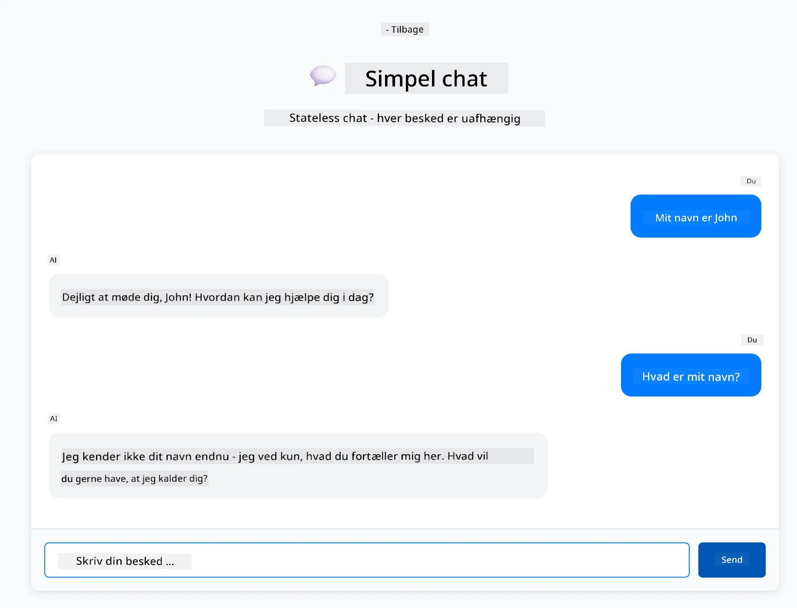
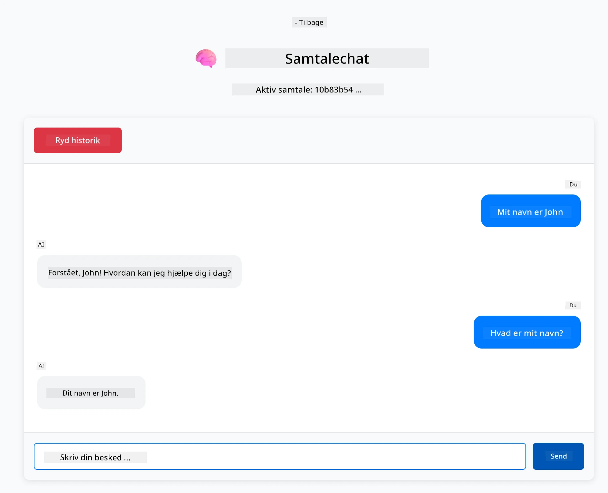

# Module 01: Kom godt i gang med LangChain4j

## Indholdsfortegnelse

- [Videogennemgang](#videogennemgang)
- [Det du vil lære](#det-du-vil-lære)
- [Forudsætninger](#forudsætninger)
- [Forståelse af kernproblemet](#forståelse-af-kernproblemet)
- [Forståelse af tokens](#forståelse-af-tokens)
- [Hvordan hukommelse fungerer](#hvordan-hukommelse-fungerer)
- [Hvordan dette bruger LangChain4j](#hvordan-dette-bruger-langchain4j)
- [Udrul Azure OpenAI infrastruktur](#udrul-azure-openai-infrastruktur)
- [Kør applikationen lokalt](#kør-applikationen-lokalt)
- [Brug af applikationen](#brug-af-applikationen)
  - [Stateless chat (venstre panel)](#stateless-chat-venstre-panel)
  - [Stateful chat (højre panel)](#stateful-chat-højre-panel)
- [Næste skridt](#næste-skridt)

## Videogennemgang

Se denne live session, der forklarer, hvordan du kommer i gang med dette modul:

<a href="https://www.youtube.com/live/nl_troDm8rQ?si=6b85S8xGjWnT2fX9"></a>

## Det du vil lære

Dette er dit udgangspunkt med LangChain4j og Azure OpenAI. Vi starter med grundlæggende ting og begynder at bygge produktionsparat applikationer. Dette modul fokuserer på konversations-AI, der husker kontekst og bevarer tilstand — de grundlæggende koncepter som alle senere moduler bygger videre på.

Vi bruger Azure OpenAIs GPT-5.2 gennem hele denne guide, fordi dens avancerede ræsonneringsevner gør adfærden i de forskellige mønstre mere tydelig. Når du tilføjer hukommelse, vil du klart kunne se forskellen. Det gør det lettere at forstå, hvad hver komponent bidrager med til din applikation.

Du vil bygge en applikation, der demonstrerer begge mønstre:

**Stateless Chat** - Hver forespørgsel er uafhængig. Modellen har ingen hukommelse om tidligere beskeder. Dette er det simpleste startpunkt.

**Stateful Conversation** - Hver forespørgsel inkluderer samtalehistorik. Modellen bevarer kontekst på tværs af flere runder. Dette er hvad produktionsapplikationer kræver.

## Forudsætninger

- Azure-abonnement med adgang til Azure OpenAI
- Java 21, Maven 3.9+
- Azure CLI (https://learn.microsoft.com/en-us/cli/azure/install-azure-cli)
- Azure Developer CLI (azd) (https://learn.microsoft.com/en-us/azure/developer/azure-developer-cli/install-azd)

> **Note:** Java, Maven, Azure CLI og Azure Developer CLI (azd) er forudinstalleret i den medfølgende devcontainer.

> **Note:** Dette modul bruger GPT-5.2 på Azure OpenAI. Udrulningen konfigureres automatisk via `azd up` - ændr ikke modelnavnet i koden.

## Forståelse af kernproblemet

Sprogmodeller er stateless. Hver API-kald er uafhængigt. Hvis du sender "Mit navn er John" og derefter spørger "Hvad er mit navn?", så har modellen ingen idé om, at du lige har præsenteret dig. Den behandler hver forespørgsel som om, det er den første samtale, du nogensinde har haft.

Det fungerer fint til simpel spørgsmål-og-svar, men er ubrugeligt til rigtige applikationer. Kundeservice-bots skal kunne huske, hvad du har fortalt dem. Personlige assistenter har brug for kontekst. Enhver samtale med flere runder kræver hukommelse.

Følgende diagram viser kontrasten mellem de to tilgange — til venstre et stateless kald, der glemmer dit navn; til højre et stateful kald understøttet af ChatMemory, der husker det.



*Forskellen mellem stateless (uafhængige kald) og stateful (kontekst-aware) samtaler*

## Forståelse af tokens

Før vi dykker ned i samtaler, er det vigtigt at forstå tokens - de grundlæggende enheder af tekst, som sprogmodeller behandler:



*Eksempel på, hvordan tekst opdeles i tokens - "I love AI!" bliver til 4 separate behandlingsenheder*

Tokens er, hvordan AI-modeller måler og behandler tekst. Ord, tegnsætning og endda mellemrum kan være tokens. Din model har et maksimum for, hvor mange tokens den kan behandle på en gang (400.000 for GPT-5.2, med op til 272.000 input tokens og 128.000 output tokens). Forståelsen af tokens hjælper dig med at håndtere samtalens længde og omkostninger.

## Hvordan hukommelse fungerer

Chat hukommelse løser det stateless problem ved at bevare samtalehistorik. Før du sender din forespørgsel til modellen, tilføjer frameworket relevante tidligere beskeder forrest. Når du spørger "Hvad er mit navn?", sender systemet faktisk hele samtalehistorikken, så modellen kan se, at du tidligere sagde "Mit navn er John."

LangChain4j tilbyder hukommelsesimplementationer, der håndterer dette automatisk. Du vælger, hvor mange beskeder, der skal gemmes, og frameworket styrer kontekstvinduet. Diagrammet nedenfor viser, hvordan MessageWindowChatMemory bevarer et glidende vindue over nylige beskeder.



*MessageWindowChatMemory bevarer et glidende vindue over nylige beskeder og fjerner automatisk gamle*

## Hvordan dette bruger LangChain4j

Dette modul integrerer Spring Boot og tilføjer samtalehukommelse. Sådan passer brikkerne sammen:

**Afhængigheder** - Tilføj to LangChain4j biblioteker:

```xml
<dependency>
    <groupId>dev.langchain4j</groupId>
    <artifactId>langchain4j</artifactId> <!-- Inherited from BOM in root pom.xml -->
</dependency>
<dependency>
    <groupId>dev.langchain4j</groupId>
    <artifactId>langchain4j-open-ai-official</artifactId> <!-- Inherited from BOM in root pom.xml -->
</dependency>
```

**Chat Model** - Konfigurer Azure OpenAI som en Spring bean ([LangChainConfig.java](../../../01-introduction/src/main/java/com/example/langchain4j/config/LangChainConfig.java)):

```java
@Bean
public OpenAiOfficialChatModel openAiOfficialChatModel() {
    return OpenAiOfficialChatModel.builder()
            .baseUrl(azureEndpoint)
            .apiKey(azureApiKey)
            .modelName(deploymentName)
            .timeout(Duration.ofMinutes(5))
            .maxRetries(3)
            .build();
}
```

Builderen læser legitimationsoplysninger fra miljøvariabler sat af `azd up`. Ved at sætte `baseUrl` til dit Azure-endpoint får OpenAI klienten til at arbejde med Azure OpenAI.

**Samtalehukommelse** - Spor chat historik med MessageWindowChatMemory ([ConversationService.java](../../../01-introduction/src/main/java/com/example/langchain4j/service/ConversationService.java)):

```java
ChatMemory memory = MessageWindowChatMemory.withMaxMessages(10);

memory.add(UserMessage.from("My name is John"));
memory.add(AiMessage.from("Nice to meet you, John!"));

memory.add(UserMessage.from("What's my name?"));
AiMessage aiMessage = chatModel.chat(memory.messages()).aiMessage();
memory.add(aiMessage);
```

Opret hukommelse med `withMaxMessages(10)` for at beholde de sidste 10 beskeder. Tilføj bruger- og AI-beskeder med typede wrapper: `UserMessage.from(text)` og `AiMessage.from(text)`. Hent historik med `memory.messages()` og send den til modellen. Servicen gemmer separate hukommelsesinstanser per samtale-id, så flere brugere kan chatte samtidigt.

> **🤖 Prøv med [GitHub Copilot](https://github.com/features/copilot) Chat:** Åbn [`ConversationService.java`](../../../01-introduction/src/main/java/com/example/langchain4j/service/ConversationService.java) og spørg:
> - "Hvordan beslutter MessageWindowChatMemory, hvilke beskeder der droppes, når vinduet er fuldt?"
> - "Kan jeg implementere brugerdefineret hukommelseslagring ved hjælp af en database i stedet for i hukommelsen?"
> - "Hvordan ville jeg tilføje opsummering for at komprimere gammel samtalehistorik?"

Den stateless chat endepunkt springer hukommelse over - bare `chatModel.chat(prompt)` som i hurtigstarten. Det stateful endepunkt tilføjer beskeder til hukommelse, henter historik og inkluderer denne kontekst med hver forespørgsel. Samme modelkonfiguration, forskellige mønstre.

## Udrul Azure OpenAI infrastruktur

**Bash:**
```bash
cd 01-introduction
azd up  # Vælg abonnement og placering (eastus2 anbefales)
```

**PowerShell:**
```powershell
cd 01-introduction
azd up  # Vælg abonnement og placering (eastus2 anbefales)
```

> **Note:** Hvis du støder på en timeout-fejl (`RequestConflict: Cannot modify resource ... provisioning state is not terminal`), så kør blot `azd up` igen. Azure-ressourcer kan stadig provisioneres i baggrunden, og et genforsøg tillader, at udrulningen fuldføres, når ressourcerne når en terminal tilstand.

Dette vil:
1. Udrulle Azure OpenAI-ressource med GPT-5.2 og text-embedding-3-small modeller
2. Automatisk generere `.env`-fil i projektroden med legitimationsoplysninger
3. Opsætte alle nødvendige miljøvariabler

**Problemer med udrulning?** Se [Infrastructure README](infra/README.md) for detaljeret fejlfinding inklusive konflikter i subdomænenavne, manuelle Azure Portal udrulningstrin og vejledning i modelkonfiguration.

**Bekræft at udrulningen lykkedes:**

**Bash:**
```bash
cat ../.env  # Skal vise AZURE_OPENAI_ENDPOINT, API_KEY osv.
```

**PowerShell:**
```powershell
Get-Content ..\.env  # Skal vise AZURE_OPENAI_ENDPOINT, API_KEY osv.
```

> **Note:** `azd up`-kommandoen genererer automatisk `.env`-filen. Hvis du skal opdatere den senere, kan du enten redigere `.env`-filen manuelt eller regenerere den ved at køre:
>
> **Bash:**
> ```bash
> cd ..
> bash .azd-env.sh
> ```
>
> **PowerShell:**
> ```powershell
> cd ..
> .\.azd-env.ps1
> ```

## Kør applikationen lokalt

**Bekræft udrulning:**

Sørg for, at `.env`-filen findes i roddirektoret med Azure-legitimationsoplysninger. Kør dette fra modulets mappe (`01-introduction/`):

**Bash:**
```bash
cat ../.env  # Skal vise AZURE_OPENAI_ENDPOINT, API_KEY, DEPLOYMENT
```

**PowerShell:**
```powershell
Get-Content ..\.env  # Skal vise AZURE_OPENAI_ENDPOINT, API_KEY, DEPLOYMENT
```

**Start applikationerne:**

**Valgmulighed 1: Brug Spring Boot Dashboard (anbefales til VS Code brugere)**

Dev containeren inkluderer Spring Boot Dashboard-udvidelsen, som giver en visuel grænseflade til at styre alle Spring Boot applikationer. Du finder den i aktivitetslinjen til venstre i VS Code (se efter Spring Boot-ikonet).

Fra Spring Boot Dashboard kan du:
- Se alle tilgængelige Spring Boot applikationer i workspace
- Starte/stoppe applikationer med et enkelt klik
- Se applikationslogfiler i realtid
- Overvåge applikationers status

Klik blot på play-knappen ved siden af "introduction" for at starte dette modul, eller start alle moduler samlet.



*Spring Boot Dashboard i VS Code — start, stop og overvåg alle moduler fra ét sted*

**Valgmulighed 2: Brug shell scripts**

Start alle webapplikationer (moduler 01-04):

**Bash:**
```bash
cd ..  # Fra rodmappen
./start-all.sh
```

**PowerShell:**
```powershell
cd ..  # Fra rodmappen
.\start-all.ps1
```

Eller start kun dette modul:

**Bash:**
```bash
cd 01-introduction
./start.sh
```

**PowerShell:**
```powershell
cd 01-introduction
.\start.ps1
```

Begge scripts indlæser automatisk miljøvariabler fra roden `.env`-filen og bygger JAR-filerne, hvis de ikke findes.

> **Note:** Hvis du foretrækker at bygge alle moduler manuelt inden start:
>
> **Bash:**
> ```bash
> cd ..  # Go to root directory
> mvn clean package -DskipTests
> ```
>
> **PowerShell:**
> ```powershell
> cd ..  # Go to root directory
> mvn clean package -DskipTests
> ```

Åbn http://localhost:8080 i din browser.

**For at stoppe:**

**Bash:**
```bash
./stop.sh  # Kun denne modul
# Eller
cd .. && ./stop-all.sh  # Alle moduler
```

**PowerShell:**
```powershell
.\stop.ps1  # Kun denne modul
# Eller
cd ..; .\stop-all.ps1  # Alle moduler
```

## Brug af applikationen

Applikationen tilbyder en webgrænseflade med to chat-implementeringer side om side.



*Dashboard der viser både Simple Chat (stateless) og Conversational Chat (stateful) muligheder*

### Stateless Chat (venstre panel)

Prøv dette først. Sig "Mit navn er John" og spørg så straks "Hvad er mit navn?" Modellen vil ikke huske det, fordi hver besked er uafhængig. Dette demonstrerer kernproblemet med basal sprogmodelintegration - ingen kontekst i samtalen.



*AI husker ikke dit navn fra den foregående besked*

### Stateful Chat (højre panel)

Prøv samme sekvens her. Sig "Mit navn er John" og spørg derefter "Hvad er mit navn?" Denne gang husker den det. Forskellen er MessageWindowChatMemory - den bevarer samtalehistorik og inkluderer den med hver forespørgsel. Sådan fungerer produktionsklar konversations-AI.



*AI husker dit navn fra tidligere i samtalen*

Begge paneler bruger samme GPT-5.2 model. Den eneste forskel er hukommelse. Det gør det tydeligt, hvad hukommelsen tilfører din applikation, og hvorfor det er essentielt til rigtige brugssituationer.

## Næste skridt

**Næste modul:** [02-prompt-engineering - Prompt Engineering med GPT-5.2](../02-prompt-engineering/README.md)

---

**Navigation:** [← Tilbage til hoved](../README.md) | [Næste: Modul 02 - Prompt Engineering →](../02-prompt-engineering/README.md)

---

<!-- CO-OP TRANSLATOR DISCLAIMER START -->
**Ansvarsfraskrivelse**:
Dette dokument er blevet oversat ved hjælp af AI-oversættelsestjenesten [Co-op Translator](https://github.com/Azure/co-op-translator). Selvom vi bestræber os på nøjagtighed, skal du være opmærksom på, at automatiserede oversættelser kan indeholde fejl eller unøjagtigheder. Det originale dokument på dets oprindelige sprog bør betragtes som den autoritative kilde. For kritisk information anbefales professionel menneskelig oversættelse. Vi påtager os intet ansvar for misforståelser eller fejltolkninger, der opstår som følge af brugen af denne oversættelse.
<!-- CO-OP TRANSLATOR DISCLAIMER END -->