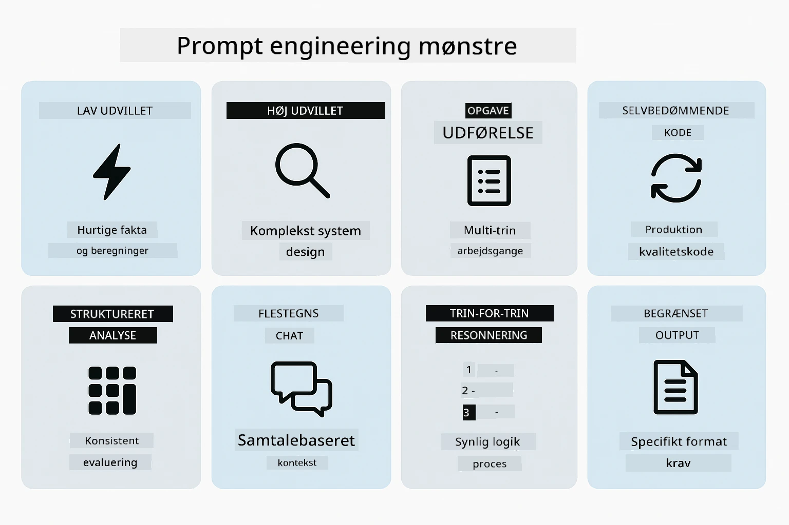
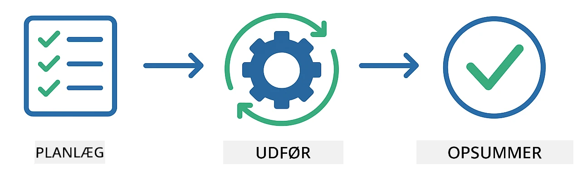
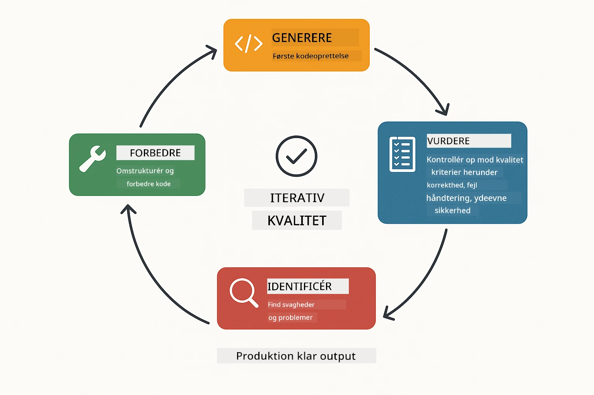
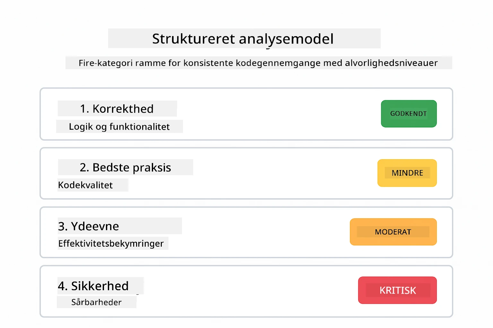
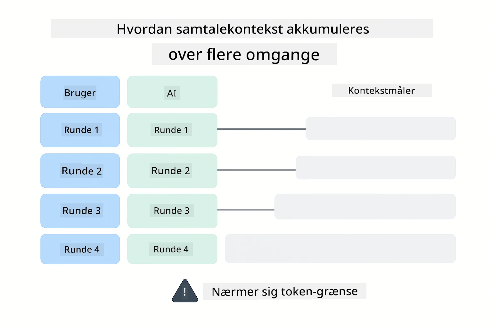
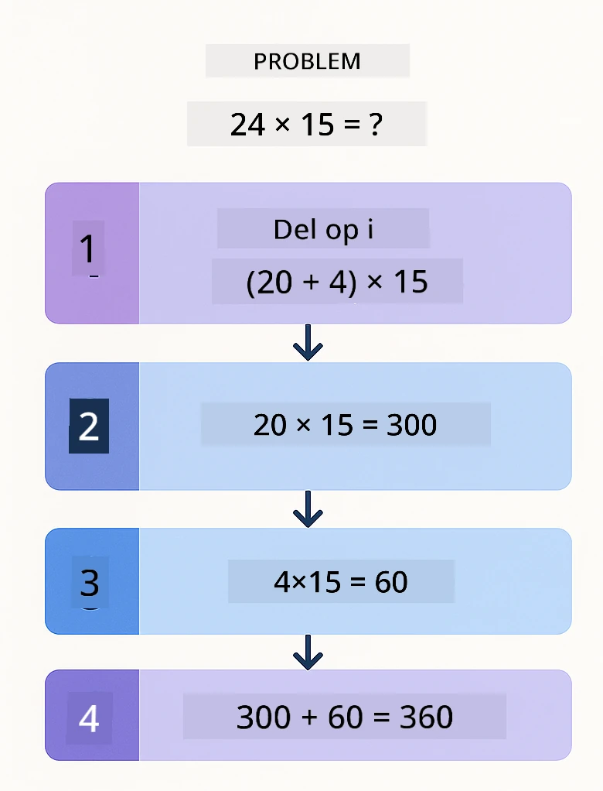
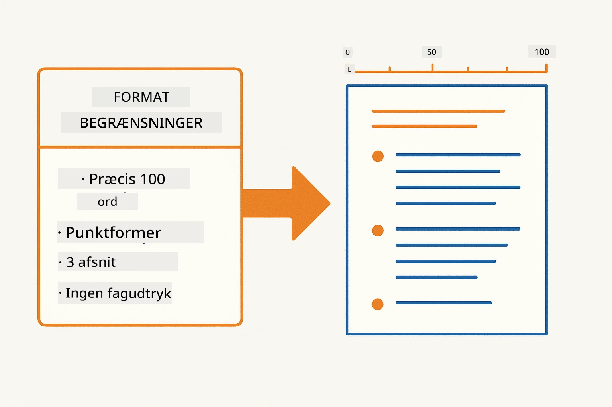
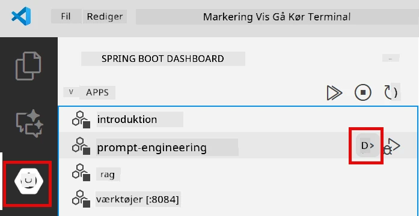
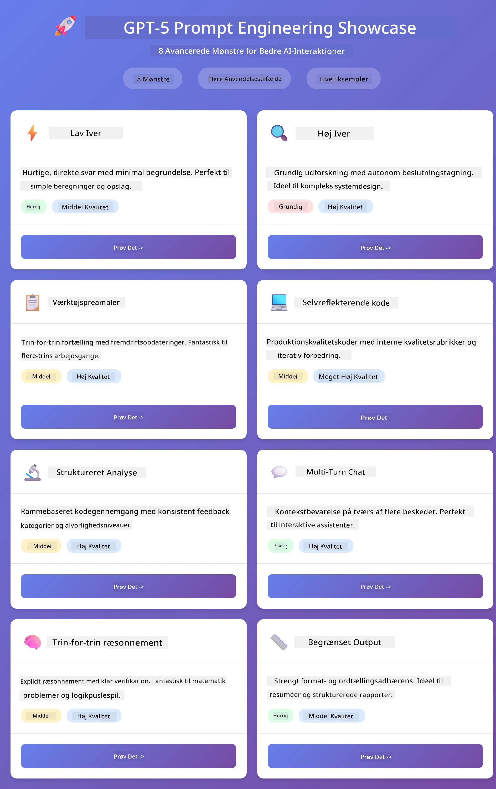
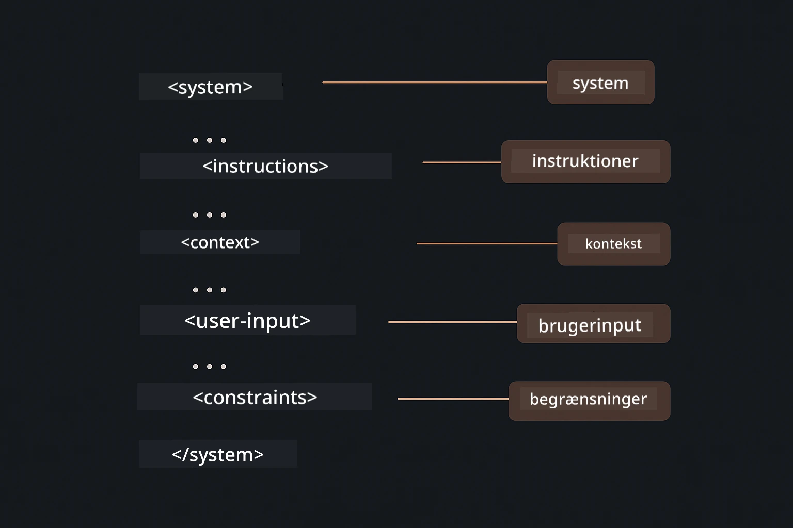

# Modul 02: Prompt Engineering med GPT-5.2

## Indholdsfortegnelse

- [Video Gennemgang](#video-gennemgang)
- [Hvad Du Vil Lære](#hvad-du-vil-lære)
- [Forudsætninger](#forudsætninger)
- [Forståelse af Prompt Engineering](#forståelse-af-prompt-engineering)
- [Grundlæggende om Prompt Engineering](#grundlæggende-om-prompt-engineering)
  - [Zero-Shot Prompting](#zero-shot-prompting)
  - [Few-Shot Prompting](#few-shot-prompting)
  - [Chain of Thought](#chain-of-thought)
  - [Role-Based Prompting](#role-based-prompting)
  - [Prompt Skabeloner](#prompt-skabeloner)
- [Avancerede Mønstre](#avancerede-mønstre)
- [Kør Applikationen](#kør-applikationen)
- [Skærmbilleder fra Applikationen](#applikationsskærmbilleder)
- [Udforskning af Mønstrene](#undersøgelse-af-mønstrene)
  - [Lav vs Høj Iver](#lav-vs-høj-eagerness)
  - [Opgaveudførelse (Værktøjspreambler)](#opgaveudførelse-værktøjsappel)
  - [Selvreflekterende Kode](#selvreflekterende-kode)
  - [Struktureret Analyse](#struktureret-analyse)
  - [Multi-Turn Chat](#multi-turn-chat)
  - [Trin-for-Trin Resonnement](#trin-for-trin-ræsonnement)
  - [Begrænset Output](#begrænset-output)
- [Hvad Du Virkelig Lærer](#hvad-du-virkelig-lærer)
- [Næste Skridt](#næste-skridt)

## Video Gennemgang

Se denne live session, der forklarer, hvordan du kommer i gang med dette modul:

<a href="https://www.youtube.com/live/PJ6aBaE6bog?si=LDshyBrTRodP-wke"></a>

## Hvad Du Vil Lære

Følgende diagram giver en oversigt over de nøgleemner og færdigheder, du vil udvikle i dette modul — fra teknikker til forfining af prompts til den trin-for-trin arbejdsproces, du skal følge.


I det forrige modul så du, hvordan hukommelse muliggør konverserende AI med Azure OpenAI. Nu fokuserer vi på, hvordan du stiller spørgsmål — selve prompts — ved brug af Azure OpenAI's GPT-5.2. Måden, du strukturerer dine prompts på, har stor betydning for kvaliteten af de svar, du får. Vi starter med en gennemgang af de grundlæggende promptingsteknikker og bevæger os derefter videre til otte avancerede mønstre, der udnytter GPT-5.2's muligheder fuldt ud.

Vi bruger GPT-5.2, fordi den introducerer styring af resonnement - du kan fortælle modellen, hvor meget den skal tænke, før den svarer. Det gør forskellige promptingstrategier mere tydelige og hjælper dig med at forstå, hvornår du skal bruge hvilken tilgang.

## Forudsætninger

- Afsluttet Modul 01 (Azure OpenAI-ressourcer deployeret)
- `.env` fil i rodmappen med Azure legitimationsoplysninger (oprettet via `azd up` i Modul 01)

> **Note:** Hvis du ikke har gennemført Modul 01, følg først deployeringsinstruktionerne der.

## Forståelse af Prompt Engineering

I sin kerne er prompt engineering forskellen mellem vage instruktioner og præcise instruktioner, som sammenligningen nedenfor illustrerer.


Prompt engineering handler om at designe inputtekst, der konsekvent giver dig de resultater, du har brug for. Det handler ikke kun om at stille spørgsmål - det handler om at strukturere anmodninger, så modellen præcist forstår, hvad du vil, og hvordan det skal leveres.

Tænk på det som at give instruktioner til en kollega. "Fix fejlen" er vagt. "Ret null pointer exception i UserService.java linje 45 ved at tilføje en nul-tjek" er specifikt. Sprogmodeller fungerer på samme måde - specificitet og struktur er vigtigt.

Diagrammet nedenfor viser, hvordan LangChain4j passer ind i dette billede — ved at forbinde dine prompt-mønstre til modellen gennem SystemMessage og UserMessage byggeklodser.


LangChain4j leverer infrastrukturen — modelforbindelser, hukommelse og beskedtyper — mens promptmønstre blot er omhyggeligt struktureret tekst, du sender gennem denne infrastruktur. De vigtigste byggeklodser er `SystemMessage` (som sætter AI'ens adfærd og rolle) og `UserMessage` (som bærer din faktiske anmodning).

## Grundlæggende om Prompt Engineering

De fem kerne-teknikker vist nedenfor udgør fundamentet for effektiv prompt engineering. Hver af dem adresserer en forskellig del af, hvordan du kommunikerer med sprogmodeller.


Før vi dykker ned i de avancerede mønstre i dette modul, lad os gennemgå fem grundlæggende promptingsteknikker. Det er byggeklodser, som enhver prompt engineer bør kende.

### Zero-Shot Prompting

Den simpleste tilgang: giv modellen en direkte instruktion uden eksempler. Modellen stoler fuldstændigt på sin træning for at forstå og udføre opgaven. Dette fungerer godt for direkte anmodninger, hvor forventet adfærd er åbenlys.


*Direkte instruktion uden eksempler — modellen udleder opgaven alene ud fra instruktionen*

```java
String prompt = "Classify this sentiment: 'I absolutely loved the movie!'";
String response = model.chat(prompt);
// Svar: "Positiv"
```

**Hvornår man skal bruge:** Enkle klassifikationer, direkte spørgsmål, oversættelser eller enhver opgave, som modellen kan håndtere uden yderligere vejledning.

### Few-Shot Prompting

Giv eksempler, der demonstrerer det mønster, du vil have modellen til at følge. Modellen lærer det forventede input-output format fra dine eksempler og anvender det på nye inputs. Dette forbedrer markant konsistensen for opgaver, hvor det ønskede format eller adfærd ikke er åbenlyst.


*Læring fra eksempler — modellen identificerer mønsteret og anvender det på nye inputs*

```java
String prompt = """
    Classify the sentiment as positive, negative, or neutral.
    
    Examples:
    Text: "This product exceeded my expectations!" → Positive
    Text: "It's okay, nothing special." → Neutral
    Text: "Waste of money, very disappointed." → Negative
    
    Now classify this:
    Text: "Best purchase I've made all year!"
    """;
String response = model.chat(prompt);
```

**Hvornår man skal bruge:** Tilpassede klassifikationer, konsekvent formatering, domænespecifikke opgaver eller når zero-shot resultater er inkonsistente.

### Chain of Thought

Bed modellen om at vise sit resonnement trin-for-trin. I stedet for at hoppe direkte til et svar, bryder modellen problemet ned og arbejder gennem hver del eksplicit. Dette øger nøjagtigheden på matematiske, logiske og flerstegs resoneringsopgaver.


*Trin-for-trin resonnement — opdeling af komplekse problemer i eksplicitte logiske trin*

```java
String prompt = """
    Problem: A store has 15 apples. They sell 8 apples and then 
    receive a shipment of 12 more apples. How many apples do they have now?
    
    Let's solve this step-by-step:
    """;
String response = model.chat(prompt);
// Modellen viser: 15 - 8 = 7, derefter 7 + 12 = 19 æbler
```

**Hvornår man skal bruge:** Matematikopgaver, logikpuslespil, fejlfinding eller enhver opgave, hvor visning af resonnementet forbedrer nøjagtighed og tillid.

### Role-Based Prompting

Opsæt en persona eller rolle for AI'en, før du stiller dit spørgsmål. Dette giver kontekst, som former tone, dybde og fokus i svaret. En "softwarearkitekt" giver andre råd end en "juniorudvikler" eller en "sikkerhedsrevisor".


*Opsætning af kontekst og persona — det samme spørgsmål får forskellige svar afhængigt af den tildelte rolle*

```java
String prompt = """
    You are an experienced software architect reviewing code.
    Provide a brief code review for this function:
    
    def calculate_total(items):
        total = 0
        for item in items:
            total = total + item['price']
        return total
    """;
String response = model.chat(prompt);
```

**Hvornår man skal bruge:** Kodegennemgange, undervisning, domænespecifik analyse eller når du har brug for svar, der er tilpasset et bestemt ekspertiseniveau eller perspektiv.

### Prompt Skabeloner

Opret genanvendelige prompts med variable pladsholdere. I stedet for at skrive en ny prompt hver gang, definer en skabelon én gang og udfyld forskellige værdier. LangChain4j's `PromptTemplate` klasse gør dette nemt med `{{variable}}` syntaks.


*Genanvendelige prompts med variable pladsholdere — én skabelon, mange anvendelser*

```java
PromptTemplate template = PromptTemplate.from(
    "What's the best time to visit {{destination}} for {{activity}}?"
);

Prompt prompt = template.apply(Map.of(
    "destination", "Paris",
    "activity", "sightseeing"
));

String response = model.chat(prompt.text());
```

**Hvornår man skal bruge:** Gentagne forespørgsler med forskellige inputs, batch behandling, opbygning af genanvendelige AI-arbejdsprocesser eller enhver situation, hvor promptens struktur forbliver den samme, men dataene ændres.

---

Disse fem grundlæggende teknikker giver dig et solidt værktøjssæt til de fleste prompting-opgaver. Resten af dette modul bygger videre på dem med **otte avancerede mønstre**, der udnytter GPT-5.2's evne til resonnementstyring, selvevaluering og struktureret output.

## Avancerede Mønstre

Med grundlaget på plads, lad os gå til de otte avancerede mønstre, der gør dette modul unikt. Ikke alle problemer kræver den samme tilgang. Nogle spørgsmål kræver hurtige svar, andre dyb tænkning. Nogle behøver synligt resonnement, andre kun resultater. Hvert mønster nedenfor er optimeret til et forskelligt scenarie — og GPT-5.2's resonnementstyring gør forskellene endnu mere markante.



*Oversigt over de otte prompt engineering mønstre og deres anvendelsestilfælde*

GPT-5.2 tilføjer en ekstra dimension til disse mønstre: *resonnementstyring*. Skyderen nedenfor viser, hvordan du kan justere modellens tænkeindsats — fra hurtige, direkte svar til dyb, grundig analyse.


*GPT-5.2's resonnementstyring lader dig specificere, hvor meget modellen skal tænke — fra hurtige direkte svar til dyb udforskning*

**Lav Iver (Hurtigt & Fokuseret)** - Til simple spørgsmål, hvor du ønsker hurtige, direkte svar. Modellen foretager minimal resonnement - maksimalt 2 trin. Brug dette til beregninger, opslag eller ligetil spørgsmål.

```java
String prompt = """
    <context_gathering>
    - Search depth: very low
    - Bias strongly towards providing a correct answer as quickly as possible
    - Usually, this means an absolute maximum of 2 reasoning steps
    - If you think you need more time, state what you know and what's uncertain
    </context_gathering>
    
    Problem: What is 15% of 200?
    
    Provide your answer:
    """;

String response = chatModel.chat(prompt);
```

> 💡 **Udforsk med GitHub Copilot:** Åbn [`Gpt5PromptService.java`](../../../02-prompt-engineering/src/main/java/com/example/langchain4j/prompts/service/Gpt5PromptService.java) og spørg:
> - "Hvad er forskellen på lav iver og høj iver prompting mønstre?"
> - "Hvordan hjælper XML-tags i prompts med at strukturere AI'ens svar?"
> - "Hvornår skal jeg bruge selvrefleksion vs direkte instruktion?"

**Høj Iver (Dyb & Grundig)** - Til komplekse problemer, hvor du ønsker grundig analyse. Modellen udforsker grundigt og viser detaljeret resonnement. Brug dette til systemdesign, arkitekturvalg eller kompleks forskning.

```java
String prompt = """
    Analyze this problem thoroughly and provide a comprehensive solution.
    Consider multiple approaches, trade-offs, and important details.
    Show your analysis and reasoning in your response.
    
    Problem: Design a caching strategy for a high-traffic REST API.
    """;

String response = chatModel.chat(prompt);
```

**Opgaveudførelse (Trin-for-Trin Fremdrift)** - Til flerstegs arbejdsprocesser. Modellen giver en plan på forhånd, fortæller om hvert trin under arbejdet, og giver en opsummering til sidst. Brug dette til migrationer, implementeringer eller enhver flerstegsprocedure.

```java
String prompt = """
    <task_execution>
    1. First, briefly restate the user's goal in a friendly way
    
    2. Create a step-by-step plan:
       - List all steps needed
       - Identify potential challenges
       - Outline success criteria
    
    3. Execute each step:
       - Narrate what you're doing
       - Show progress clearly
       - Handle any issues that arise
    
    4. Summarize:
       - What was completed
       - Any important notes
       - Next steps if applicable
    </task_execution>
    
    <tool_preambles>
    - Always begin by rephrasing the user's goal clearly
    - Outline your plan before executing
    - Narrate each step as you go
    - Finish with a distinct summary
    </tool_preambles>
    
    Task: Create a REST endpoint for user registration
    
    Begin execution:
    """;

String response = chatModel.chat(prompt);
```

Chain-of-Thought prompting beder eksplicit modellen om at vise sit resonnement, hvilket forbedrer nøjagtigheden for komplekse opgaver. Opdeling trin-for-trin hjælper både mennesker og AI til at forstå logikken.

> **🤖 Prøv med [GitHub Copilot](https://github.com/features/copilot) Chat:** Spørg om dette mønster:
> - "Hvordan kan jeg tilpasse opgaveudførelsesmønsteret til langvarige operationer?"
> - "Hvad er bedste praksis for strukturering af værktøjspreambler i produktionsapplikationer?"
> - "Hvordan kan jeg fange og vise mellemstatus-opdateringer i et UI?"

Diagrammet nedenfor illustrerer denne Planlæg → Udfør → Opsummer arbejdsproces.



*Planlæg → Udfør → Opsummer arbejdsproces for flerstegsopgaver*

**Selvreflekterende Kode** - Til generering af produktionsklar kode. Modellen genererer kode efter produktionsstandarder med korrekt fejlhåndtering. Brug dette ved opbygning af nye funktioner eller services.

```java
String prompt = """
    Generate Java code with production-quality standards: Create an email validation service
    Keep it simple and include basic error handling.
    """;

String response = chatModel.chat(prompt);
```

Diagrammet nedenfor viser denne iterative forbedringscyklus — generer, evaluer, identificer svagheder og forfin indtil koden opfylder produktionsstandarder.



*Iterativ forbedringscyklus - generer, evaluer, identificer problemer, forbedr, gentag*

**Struktureret Analyse** - Til konsistent evaluering. Modellen gennemgår kode ved hjælp af et fast framework (korrekthed, praksis, ydeevne, sikkerhed, vedligeholdelse). Brug dette til kodegennemgange eller kvalitetsvurderinger.

```java
String prompt = """
    <analysis_framework>
    You are an expert code reviewer. Analyze the code for:
    
    1. Correctness
       - Does it work as intended?
       - Are there logical errors?
    
    2. Best Practices
       - Follows language conventions?
       - Appropriate design patterns?
    
    3. Performance
       - Any inefficiencies?
       - Scalability concerns?
    
    4. Security
       - Potential vulnerabilities?
       - Input validation?
    
    5. Maintainability
       - Code clarity?
       - Documentation?
    
    <output_format>
    Provide your analysis in this structure:
    - Summary: One-sentence overall assessment
    - Strengths: 2-3 positive points
    - Issues: List any problems found with severity (High/Medium/Low)
    - Recommendations: Specific improvements
    </output_format>
    </analysis_framework>
    
    Code to analyze:
    ```
    public List getUsers() {
        return database.query("SELECT * FROM users");
    }
    ```
    Provide your structured analysis:
    """;

String response = chatModel.chat(prompt);
```

> **🤖 Prøv med [GitHub Copilot](https://github.com/features/copilot) Chat:** Spørg om struktureret analyse:
> - "Hvordan kan jeg tilpasse analyseframeworket til forskellige typer kodegennemgange?"
> - "Hvad er den bedste måde at parse og handle på struktureret output programmatisk?"
> - "Hvordan sikrer jeg konsistente sværhedsgrader på tværs af forskellige gennemgangssessioner?"

Følgende diagram viser, hvordan dette strukturerede framework organiserer en kodegennemgang i konsistente kategorier med sværhedsgrader.



*Framework til konsistente kodegennemgange med sværhedsgrader*

**Multi-Turn Chat** - Til samtaler, der har brug for kontekst. Modellen husker tidligere beskeder og bygger videre på dem. Brug dette til interaktive hjælpesessioner eller komplekse Q&A.

```java
ChatMemory memory = MessageWindowChatMemory.withMaxMessages(10);

memory.add(UserMessage.from("What is Spring Boot?"));
AiMessage aiMessage1 = chatModel.chat(memory.messages()).aiMessage();
memory.add(aiMessage1);

memory.add(UserMessage.from("Show me an example"));
AiMessage aiMessage2 = chatModel.chat(memory.messages()).aiMessage();
memory.add(aiMessage2);
```

Diagrammet nedenfor visualiserer, hvordan samtalekontekst akkumulere med hvert spørgsmål og hvordan det relaterer til modellens token-limit.



*Hvordan samtalekontekst akkumuleres over flere ture indtil token-grænsen nås*

**Trin-for-Trin Resonnement** - Til problemer, der kræver synlig logik. Modellen viser eksplicit resonnement for hvert trin. Brug dette til matematikopgaver, logikpuslespil eller når du har brug for at forstå tankeprocessen.

```java
String prompt = """
    <instruction>Show your reasoning step-by-step</instruction>
    
    If a train travels 120 km in 2 hours, then stops for 30 minutes,
    then travels another 90 km in 1.5 hours, what is the average speed
    for the entire journey including the stop?
    """;

String response = chatModel.chat(prompt);
```

Diagrammet nedenfor illustrerer, hvordan modellen opdeler problemer i eksplicitte, nummererede logiske trin.


*At opdele problemer i eksplicitte logiske trin*

**Begrænset output** - Til svar med specifikke formatkrav. Modellen følger strikt format- og længdekrav. Brug dette til opsummeringer eller når du har brug for præcis outputstruktur.

```java
String prompt = """
    <constraints>
    - Exactly 100 words
    - Bullet point format
    - Technical terms only
    </constraints>
    
    Summarize the key concepts of machine learning.
    """;

String response = chatModel.chat(prompt);
```

Følgende diagram viser, hvordan begrænsninger guider modellen til at producere output, der strengt overholder dine format- og længdekrav.



*Håndhævelse af specifikke format-, længde- og strukturkrav*

## Kør applikationen

**Bekræft udrulning:**

Sørg for, at `.env`-filen findes i rodkataloget med Azure-legitimationsoplysninger (oprettet under Modul 01). Kør dette fra modulets bibliotek (`02-prompt-engineering/`):

**Bash:**
```bash
cat ../.env  # Skal vise AZURE_OPENAI_ENDPOINT, API_KEY, DEPLOYMENT
```

**PowerShell:**
```powershell
Get-Content ..\.env  # Skal vise AZURE_OPENAI_ENDPOINT, API_KEY, DEPLOYMENT
```

**Start applikationen:**

> **Bemærk:** Hvis du allerede har startet alle applikationer med `./start-all.sh` fra rodkataloget (som beskrevet i Modul 01), kører dette modul allerede på port 8083. Du kan springe startkommandoerne herunder over og gå direkte til http://localhost:8083.

**Mulighed 1: Brug af Spring Boot Dashboard (anbefalet for VS Code-brugere)**

Dev-containeren inkluderer Spring Boot Dashboard-udvidelsen, som giver en visuel grænseflade til at administrere alle Spring Boot-applikationer. Du finder den i aktivitetslinjen til venstre i VS Code (se efter Spring Boot-ikonet).

Fra Spring Boot Dashboard kan du:
- Se alle tilgængelige Spring Boot-applikationer i arbejdsmiljøet
- Starte/stoppe applikationer med et enkelt klik
- Se applikationslogfiler i realtid
- Overvåge applikationens status

Klik blot på afspilningsknappen ved siden af "prompt-engineering" for at starte dette modul, eller start alle moduler på én gang.



*Spring Boot Dashboard i VS Code — start, stop og overvåg alle moduler fra ét sted*

**Mulighed 2: Brug af shell-scripts**

Start alle webapplikationer (moduler 01-04):

**Bash:**
```bash
cd ..  # Fra rodmappen
./start-all.sh
```

**PowerShell:**
```powershell
cd ..  # Fra roddirectory
.\start-all.ps1
```

Eller start kun dette modul:

**Bash:**
```bash
cd 02-prompt-engineering
./start.sh
```

**PowerShell:**
```powershell
cd 02-prompt-engineering
.\start.ps1
```

Begge scripts indlæser automatisk miljøvariabler fra rodkatalogets `.env`-fil og bygger JAR-filerne, hvis de ikke findes.

> **Bemærk:** Hvis du foretrækker at bygge alle moduler manuelt, før du starter:
>
> **Bash:**
> ```bash
> cd ..  # Go to root directory
> mvn clean package -DskipTests
> ```
>
> **PowerShell:**
> ```powershell
> cd ..  # Go to root directory
> mvn clean package -DskipTests
> ```

Åbn http://localhost:8083 i din browser.

**For at stoppe:**

**Bash:**
```bash
./stop.sh  # Kun denne modul
# Eller
cd .. && ./stop-all.sh  # Alle moduler
```

**PowerShell:**
```powershell
.\stop.ps1  # Kun denne modul
# Eller
cd ..; .\stop-all.ps1  # Alle moduler
```

## Applikationsskærmbilleder

Her er hovedgrænsefladen for prompt engineering-modulet, hvor du kan eksperimentere med alle otte mønstre side om side.



*Hoveddashboard med alle 8 prompt engineering-mønstre med deres karakteristika og anvendelsestilfælde*

## Undersøgelse af mønstrene

Webgrænsefladen lader dig eksperimentere med forskellige prompt-strategier. Hvert mønster løser forskellige problemer - prøv dem for at se, hvornår hver tilgang fungerer bedst.

> **Bemærk: Streaming vs Ikke-streaming** — Hver mønsterside tilbyder to knapper: **🔴 Stream Respons (Live)** og en **Ikke-streaming** mulighed. Streaming bruger Server-Sent Events (SSE) til at vise tokens i realtid, mens modellen genererer dem, så du straks kan følge fremskridtet. Ikke-streaming venter på hele svaret, før det vises. For prompt, der udløser dyb refleksion (fx High Eagerness, Self-Reflecting Code), kan ikke-streaming kald tage meget lang tid – nogle gange minutter – uden synlig respons. **Brug streaming ved eksperimenter med komplekse prompts** for at se modellen arbejde og undgå indtryk af timeout.
>
> **Bemærk: Browserkrav** — Streaming-funktionen bruger Fetch Streams API (`response.body.getReader()`), som kræver en komplet browser (Chrome, Edge, Firefox, Safari). Det virker **ikke** i VS Codes indbyggede Simple Browser, da dens webview ikke understøtter ReadableStream API. Ved brug af Simple Browser fungerer ikke-streaming knapperne normalt – kun streaming-knapperne påvirkes. Åbn `http://localhost:8083` i en ekstern browser for fuld funktionalitet.

### Lav vs Høj Eagerness

Stil et simpelt spørgsmål som "Hvad er 15% af 200?" med Lav Eagerness. Du får et hurtigt, direkte svar. Stil nu noget komplekst som "Design en cachingstrategi for et API med højt trafikomfang" med Høj Eagerness. Klik på **🔴 Stream Respons (Live)** og følg modellens detaljerede ræsonnement token-for-token. Samme model, samme spørgestruktur – men prompten fortæller, hvor meget tænkning der skal til.

### Opgaveudførelse (Værktøjsappel)

Workflow med flere trin drager fordel af forudgående planlægning og fortløbende fortælling. Modellen skitserer hvad den vil gøre, fortæller om hvert trin og opsummerer resultater.

### Selvreflekterende kode

Prøv "Lav en e-mail valideringstjeneste". I stedet for blot at generere kode og stoppe, genererer modellen, vurderer den i forhold til kvalitetskriterier, identificerer svagheder og forbedrer den. Du ser, hvordan den itererer, indtil koden opfylder produktionsstandarder.

### Struktureret analyse

Kodegennemgang kræver konsistente vurderingsrammer. Modellen analyserer kode efter faste kategorier (korrekthed, praksis, ydelse, sikkerhed) med alvorlighedsniveauer.

### Multi-Turn Chat

Spørg "Hvad er Spring Boot?" og følg straks op med "Vis mig et eksempel". Modellen husker dit første spørgsmål og giver et specifikt Spring Boot-eksempel. Uden hukommelse ville det andet spørgsmål være for åbent.

### Trin-for-trin ræsonnement

Vælg et matematikproblem og prøv det med både Trin-for-trin ræsonnement og Lav Eagerness. Lav eagerness giver kun svaret - hurtigt, men uigennemsigtigt. Trin-for-trin viser hver beregning og beslutning.

### Begrænset output

Når du har behov for specifikke formater eller ordantal, håndhæver dette mønster streng overholdelse. Prøv at generere en opsummering med præcis 100 ord i punktform.

## Hvad du virkelig lærer

**Ræsonnementets indsats ændrer alt**

GPT-5.2 lader dig styre den beregningsmæssige indsats via dine prompts. Lav indsats betyder hurtige svar med minimal udforskning. Høj indsats betyder, at modellen tager tid til dyb refleksion. Du lærer at matche indsats til opgavens kompleksitet – spild ikke tid på simple spørgsmål, men skynd dig heller ikke med komplekse beslutninger.

**Struktur styrer adfærd**

Læg mærke til XML-tags i promptene? De er ikke bare pynt. Modeller følger strukturerede instruktioner mere pålideligt end frit tekstinput. Når du har brug for flertrinsprocesser eller kompleks logik, hjælper strukturen modellen med at holde styr på hvor den er og hvad der kommer næste. Diagrammet nedenfor nedbryder en veldesignet prompt, der viser, hvordan tags som `<system>`, `<instructions>`, `<context>`, `<user-input>`, og `<constraints>` organiserer dine instruktioner i klare sektioner.



*Anatomi af en veldesignet prompt med klare sektioner og XML-lignende organisering*

**Kvalitet gennem selvevaluering**

De selvreflekterende mønstre fungerer ved at gøre kvalitetskriterier eksplicitte. I stedet for at håbe på, at modellen "gør det rigtigt", fortæller du den præcist, hvad "rigtigt" betyder: korrekt logik, fejlbehandling, ydelse, sikkerhed. Modellen kan derefter evaluere sit eget output og forbedre det. Det gør kodegenerering til en proces fremfor et lotteri.

**Kontekst er begrænset**

Multi-turn samtaler fungerer ved at inkludere beskedhistorik i hver anmodning. Men der er en grænse – hver model har et maksimum antal tokens. Efterhånden som samtaler vokser, skal du bruge strategier til at bevare relevant kontekst uden at ramme loftet. Dette modul viser dig, hvordan hukommelse virker; senere lærer du, hvornår du skal opsummere, glemme og hente.

## Næste skridt

**Næste modul:** [03-rag - RAG (Retrieval-Augmented Generation)](../03-rag/README.md)

---

**Navigation:** [← Forrige: Modul 01 - Introduktion](../01-introduction/README.md) | [Tilbage til hoved](../README.md) | [Næste: Modul 03 - RAG →](../03-rag/README.md)

---

<!-- CO-OP TRANSLATOR DISCLAIMER START -->
**Ansvarsfraskrivelse**:
Dette dokument er blevet oversat ved hjælp af AI-oversættelsestjenesten [Co-op Translator](https://github.com/Azure/co-op-translator). Selvom vi bestræber os på nøjagtighed, skal du være opmærksom på, at automatiserede oversættelser kan indeholde fejl eller unøjagtigheder. Det originale dokument på dets oprindelige sprog bør betragtes som den autoritative kilde. For kritisk information anbefales professionel menneskelig oversættelse. Vi påtager os intet ansvar for misforståelser eller fejltolkninger, der opstår som følge af brugen af denne oversættelse.
<!-- CO-OP TRANSLATOR DISCLAIMER END -->