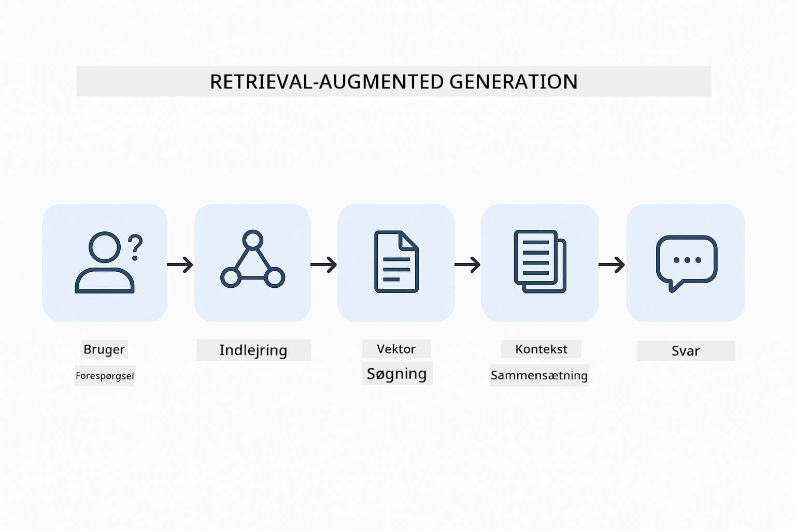
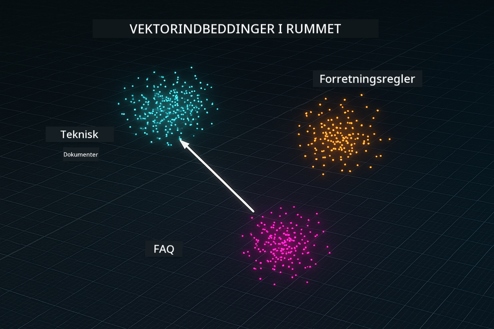
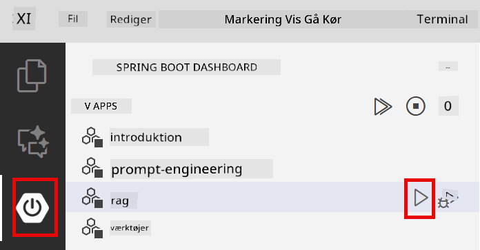

<!--
CO_OP_TRANSLATOR_METADATA:
{
  "original_hash": "f538a51cfd13147d40d84e936a0f485c",
  "translation_date": "2025-12-13T17:05:13+00:00",
  "source_file": "03-rag/README.md",
  "language_code": "da"
}
-->
# Modul 03: RAG (Retrieval-Augmented Generation)

## Indholdsfortegnelse

- [Hvad du vil lære](../../../03-rag)
- [Forudsætninger](../../../03-rag)
- [Forståelse af RAG](../../../03-rag)
- [Hvordan det virker](../../../03-rag)
  - [Dokumentbehandling](../../../03-rag)
  - [Oprettelse af embeddings](../../../03-rag)
  - [Semantisk søgning](../../../03-rag)
  - [Svar generering](../../../03-rag)
- [Kør applikationen](../../../03-rag)
- [Brug af applikationen](../../../03-rag)
  - [Upload et dokument](../../../03-rag)
  - [Stil spørgsmål](../../../03-rag)
  - [Tjek kildehenvisninger](../../../03-rag)
  - [Eksperimenter med spørgsmål](../../../03-rag)
- [Nøglebegreber](../../../03-rag)
  - [Chunking-strategi](../../../03-rag)
  - [Lighedsscores](../../../03-rag)
  - [In-memory lagring](../../../03-rag)
  - [Håndtering af kontekstvindue](../../../03-rag)
- [Hvornår RAG er vigtigt](../../../03-rag)
- [Næste skridt](../../../03-rag)

## Hvad du vil lære

I de tidligere moduler lærte du, hvordan man har samtaler med AI og strukturerer dine prompts effektivt. Men der er en grundlæggende begrænsning: sprogmodeller ved kun, hvad de lærte under træningen. De kan ikke besvare spørgsmål om din virksomheds politikker, din projektdokumentation eller nogen information, de ikke blev trænet på.

RAG (Retrieval-Augmented Generation) løser dette problem. I stedet for at forsøge at lære modellen din information (hvilket er dyrt og upraktisk), giver du den evnen til at søge gennem dine dokumenter. Når nogen stiller et spørgsmål, finder systemet relevant information og inkluderer det i prompten. Modellen svarer derefter baseret på den hentede kontekst.

Tænk på RAG som at give modellen et referencebibliotek. Når du stiller et spørgsmål, gør systemet:

1. **Brugerforespørgsel** - Du stiller et spørgsmål  
2. **Embedding** - Konverterer dit spørgsmål til en vektor  
3. **Vektorsøgning** - Finder lignende dokumentstykker  
4. **Kontekstsammensætning** - Tilføjer relevante stykker til prompten  
5. **Svar** - LLM genererer et svar baseret på konteksten  

Dette forankrer modellens svar i dine faktiske data i stedet for at stole på dens træningsviden eller finde på svar.



*RAG workflow - fra brugerforespørgsel til semantisk søgning til kontekstuel svar generering*

## Forudsætninger

- Fuldført Modul 01 (Azure OpenAI-ressourcer implementeret)  
- `.env` fil i rodmappen med Azure legitimationsoplysninger (oprettet af `azd up` i Modul 01)  

> **Bemærk:** Hvis du ikke har fuldført Modul 01, følg først implementeringsinstruktionerne der.

## Hvordan det virker

**Dokumentbehandling** - [DocumentService.java](../../../03-rag/src/main/java/com/example/langchain4j/rag/service/DocumentService.java)

Når du uploader et dokument, bryder systemet det op i stykker – mindre dele, der passer komfortabelt i modellens kontekstvindue. Disse stykker overlapper lidt, så du ikke mister kontekst ved grænserne.

```java
Document document = FileSystemDocumentLoader.loadDocument("sample-document.txt");

DocumentSplitter splitter = DocumentSplitters
    .recursive(300, 30, new OpenAiTokenizer());

List<TextSegment> segments = splitter.split(document);
```
  
> **🤖 Prøv med [GitHub Copilot](https://github.com/features/copilot) Chat:** Åbn [`DocumentService.java`](../../../03-rag/src/main/java/com/example/langchain4j/rag/service/DocumentService.java) og spørg:  
> - "Hvordan splitter LangChain4j dokumenter i stykker, og hvorfor er overlap vigtigt?"  
> - "Hvad er den optimale chunk-størrelse for forskellige dokumenttyper, og hvorfor?"  
> - "Hvordan håndterer jeg dokumenter på flere sprog eller med speciel formatering?"

**Oprettelse af embeddings** - [LangChainRagConfig.java](../../../03-rag/src/main/java/com/example/langchain4j/rag/config/LangChainRagConfig.java)

Hvert stykke konverteres til en numerisk repræsentation kaldet en embedding – i bund og grund et matematisk fingeraftryk, der fanger tekstens betydning. Lignende tekst producerer lignende embeddings.

```java
@Bean
public EmbeddingModel embeddingModel() {
    return OpenAiOfficialEmbeddingModel.builder()
        .baseUrl(azureOpenAiEndpoint)
        .apiKey(azureOpenAiKey)
        .modelName(azureEmbeddingDeploymentName)
        .build();
}

EmbeddingStore<TextSegment> embeddingStore = 
    new InMemoryEmbeddingStore<>();
```
  


*Dokumenter repræsenteret som vektorer i embedding-rum - lignende indhold samles i klynger*

**Semantisk søgning** - [RagService.java](../../../03-rag/src/main/java/com/example/langchain4j/rag/service/RagService.java)

Når du stiller et spørgsmål, bliver dit spørgsmål også til en embedding. Systemet sammenligner dit spørgsmål embedding med alle dokumentstykkernes embeddings. Det finder de stykker med mest lignende betydning – ikke kun matchende nøgleord, men faktisk semantisk lighed.

```java
Embedding queryEmbedding = embeddingModel.embed(question).content();

List<EmbeddingMatch<TextSegment>> matches = 
    embeddingStore.findRelevant(queryEmbedding, 5, 0.7);

for (EmbeddingMatch<TextSegment> match : matches) {
    String relevantText = match.embedded().text();
    double score = match.score();
}
```
  
> **🤖 Prøv med [GitHub Copilot](https://github.com/features/copilot) Chat:** Åbn [`RagService.java`](../../../03-rag/src/main/java/com/example/langchain4j/rag/service/RagService.java) og spørg:  
> - "Hvordan fungerer lighedssøgning med embeddings, og hvad bestemmer scoren?"  
> - "Hvilken lighedstærskel skal jeg bruge, og hvordan påvirker det resultaterne?"  
> - "Hvordan håndterer jeg tilfælde, hvor der ikke findes relevante dokumenter?"

**Svar generering** - [RagService.java](../../../03-rag/src/main/java/com/example/langchain4j/rag/service/RagService.java)

De mest relevante stykker inkluderes i prompten til modellen. Modellen læser disse specifikke stykker og svarer på dit spørgsmål baseret på den information. Dette forhindrer hallucination – modellen kan kun svare ud fra det, der er foran den.

## Kør applikationen

**Bekræft implementering:**

Sørg for, at `.env` filen findes i rodmappen med Azure legitimationsoplysninger (oprettet under Modul 01):  
```bash
cat ../.env  # Skal vise AZURE_OPENAI_ENDPOINT, API_KEY, DEPLOYMENT
```
  
**Start applikationen:**

> **Bemærk:** Hvis du allerede har startet alle applikationer med `./start-all.sh` fra Modul 01, kører dette modul allerede på port 8081. Du kan springe startkommandoerne over nedenfor og gå direkte til http://localhost:8081.

**Mulighed 1: Brug Spring Boot Dashboard (Anbefalet til VS Code brugere)**

Dev containeren inkluderer Spring Boot Dashboard-udvidelsen, som giver en visuel grænseflade til at administrere alle Spring Boot applikationer. Du finder den i aktivitetsbjælken til venstre i VS Code (se efter Spring Boot-ikonet).

Fra Spring Boot Dashboard kan du:  
- Se alle tilgængelige Spring Boot applikationer i arbejdsområdet  
- Starte/stoppe applikationer med et enkelt klik  
- Se applikationslogs i realtid  
- Overvåge applikationsstatus  

Klik blot på play-knappen ved siden af "rag" for at starte dette modul, eller start alle moduler på én gang.



**Mulighed 2: Brug shell scripts**

Start alle webapplikationer (moduler 01-04):

**Bash:**  
```bash
cd ..  # Fra roddirectory
./start-all.sh
```
  
**PowerShell:**  
```powershell
cd ..  # Fra roddirectory
.\start-all.ps1
```
  
Eller start kun dette modul:

**Bash:**  
```bash
cd 03-rag
./start.sh
```
  
**PowerShell:**  
```powershell
cd 03-rag
.\start.ps1
```
  
Begge scripts indlæser automatisk miljøvariabler fra rodens `.env` fil og bygger JAR-filerne, hvis de ikke findes.

> **Bemærk:** Hvis du foretrækker at bygge alle moduler manuelt før start:  
>  
> **Bash:**  
> ```bash
> cd ..  # Go to root directory
> mvn clean package -DskipTests
> ```
>  
> **PowerShell:**  
> ```powershell
> cd ..  # Go to root directory
> mvn clean package -DskipTests
> ```
  
Åbn http://localhost:8081 i din browser.

**For at stoppe:**

**Bash:**  
```bash
./stop.sh  # Kun denne modul
# Eller
cd .. && ./stop-all.sh  # Alle moduler
```
  
**PowerShell:**  
```powershell
.\stop.ps1  # Kun denne modul
# Eller
cd ..; .\stop-all.ps1  # Alle moduler
```
  
## Brug af applikationen

Applikationen tilbyder en webgrænseflade til dokumentupload og spørgsmål.

<a href="images/rag-homepage.png"></a>

*RAG applikationsgrænseflade - upload dokumenter og stil spørgsmål*

**Upload et dokument**

Start med at uploade et dokument – TXT-filer fungerer bedst til test. En `sample-document.txt` er inkluderet i denne mappe, som indeholder information om LangChain4j funktioner, RAG-implementering og bedste praksis – perfekt til at teste systemet.

Systemet behandler dit dokument, bryder det op i stykker og opretter embeddings for hvert stykke. Dette sker automatisk ved upload.

**Stil spørgsmål**

Stil nu specifikke spørgsmål om dokumentindholdet. Prøv noget faktuelt, der klart fremgår af dokumentet. Systemet søger efter relevante stykker, inkluderer dem i prompten og genererer et svar.

**Tjek kildehenvisninger**

Bemærk at hvert svar inkluderer kildehenvisninger med lighedsscores. Disse scores (0 til 1) viser, hvor relevant hvert stykke var for dit spørgsmål. Højere scores betyder bedre match. Dette giver dig mulighed for at verificere svaret mod kildematerialet.

<a href="images/rag-query-results.png"></a>

*Forespørgselsresultater viser svar med kildehenvisninger og relevansscores*

**Eksperimenter med spørgsmål**

Prøv forskellige typer spørgsmål:  
- Specifikke fakta: "Hvad er hovedemnet?"  
- Sammenligninger: "Hvad er forskellen mellem X og Y?"  
- Resuméer: "Opsummer hovedpunkterne om Z"  

Se hvordan relevansscores ændrer sig baseret på, hvor godt dit spørgsmål matcher dokumentindholdet.

## Nøglebegreber

**Chunking-strategi**

Dokumenter deles op i 300-token stykker med 30 tokens overlap. Denne balance sikrer, at hvert stykke har nok kontekst til at være meningsfuldt, samtidig med at det er lille nok til at inkludere flere stykker i en prompt.

**Lighedsscores**

Scores spænder fra 0 til 1:  
- 0.7-1.0: Meget relevant, præcist match  
- 0.5-0.7: Relevant, god kontekst  
- Under 0.5: Filtreret fra, for forskelligt  

Systemet henter kun stykker over minimumstærsklen for at sikre kvalitet.

**In-memory lagring**

Dette modul bruger in-memory lagring for enkelhed. Når du genstarter applikationen, mistes uploadede dokumenter. Produktionssystemer bruger vedvarende vektordatabaser som Qdrant eller Azure AI Search.

**Håndtering af kontekstvindue**

Hver model har et maksimalt kontekstvindue. Du kan ikke inkludere alle stykker fra et stort dokument. Systemet henter de top N mest relevante stykker (standard 5) for at holde sig inden for grænserne, samtidig med at der gives nok kontekst til præcise svar.

## Hvornår RAG er vigtigt

**Brug RAG når:**  
- Du skal besvare spørgsmål om proprietære dokumenter  
- Information ændrer sig ofte (politikker, priser, specifikationer)  
- Nøjagtighed kræver kildehenvisning  
- Indhold er for stort til at passe i en enkelt prompt  
- Du har brug for verificerbare, forankrede svar  

**Brug ikke RAG når:**  
- Spørgsmål kræver generel viden, som modellen allerede har  
- Real-time data er nødvendig (RAG arbejder på uploadede dokumenter)  
- Indhold er lille nok til at inkluderes direkte i prompts  

## Næste skridt

**Næste modul:** [04-tools - AI-agenter med værktøjer](../04-tools/README.md)

---

**Navigation:** [← Forrige: Modul 02 - Prompt Engineering](../02-prompt-engineering/README.md) | [Tilbage til hoved](../README.md) | [Næste: Modul 04 - Værktøjer →](../04-tools/README.md)

---

<!-- CO-OP TRANSLATOR DISCLAIMER START -->
**Ansvarsfraskrivelse**:
Dette dokument er blevet oversat ved hjælp af AI-oversættelsestjenesten [Co-op Translator](https://github.com/Azure/co-op-translator). Selvom vi bestræber os på nøjagtighed, bedes du være opmærksom på, at automatiserede oversættelser kan indeholde fejl eller unøjagtigheder. Det oprindelige dokument på dets modersmål bør betragtes som den autoritative kilde. For kritisk information anbefales professionel menneskelig oversættelse. Vi påtager os intet ansvar for misforståelser eller fejltolkninger, der opstår som følge af brugen af denne oversættelse.
<!-- CO-OP TRANSLATOR DISCLAIMER END -->