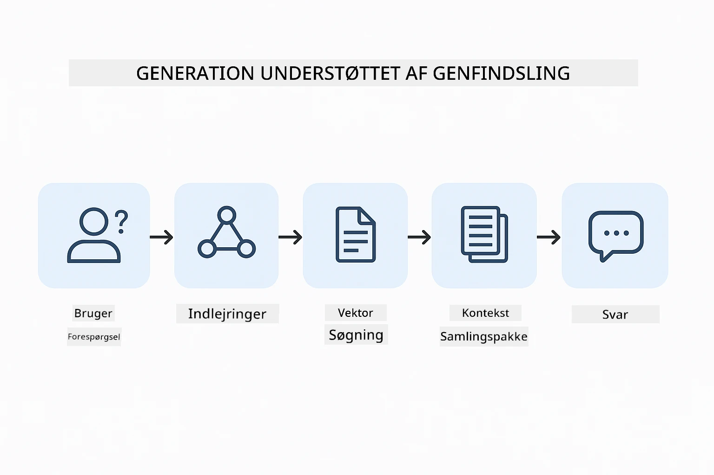
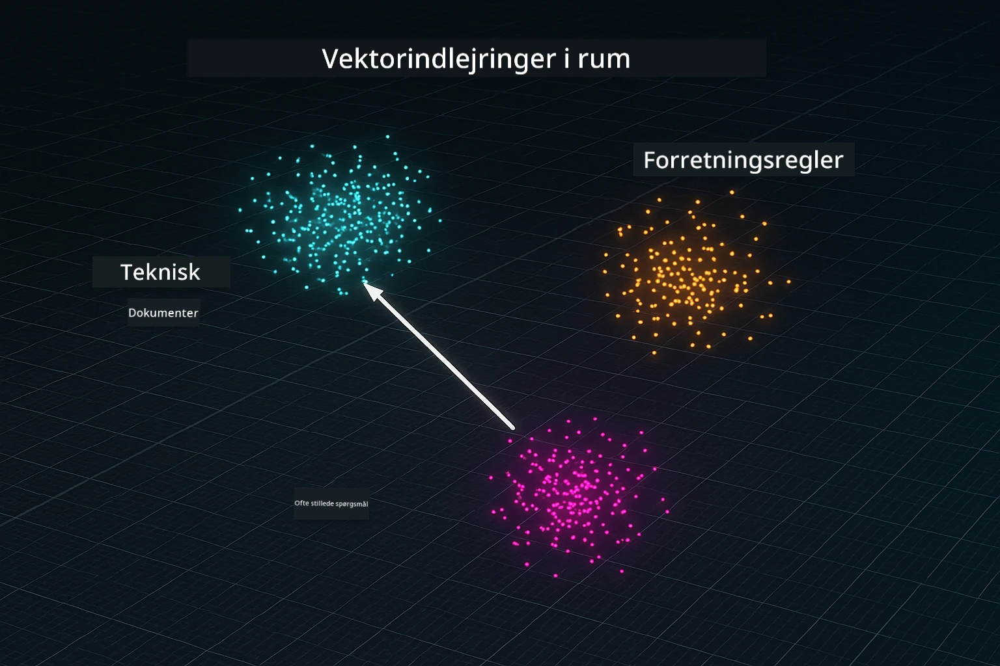
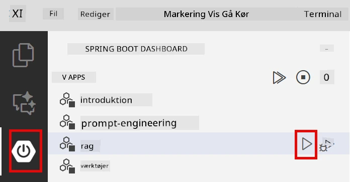
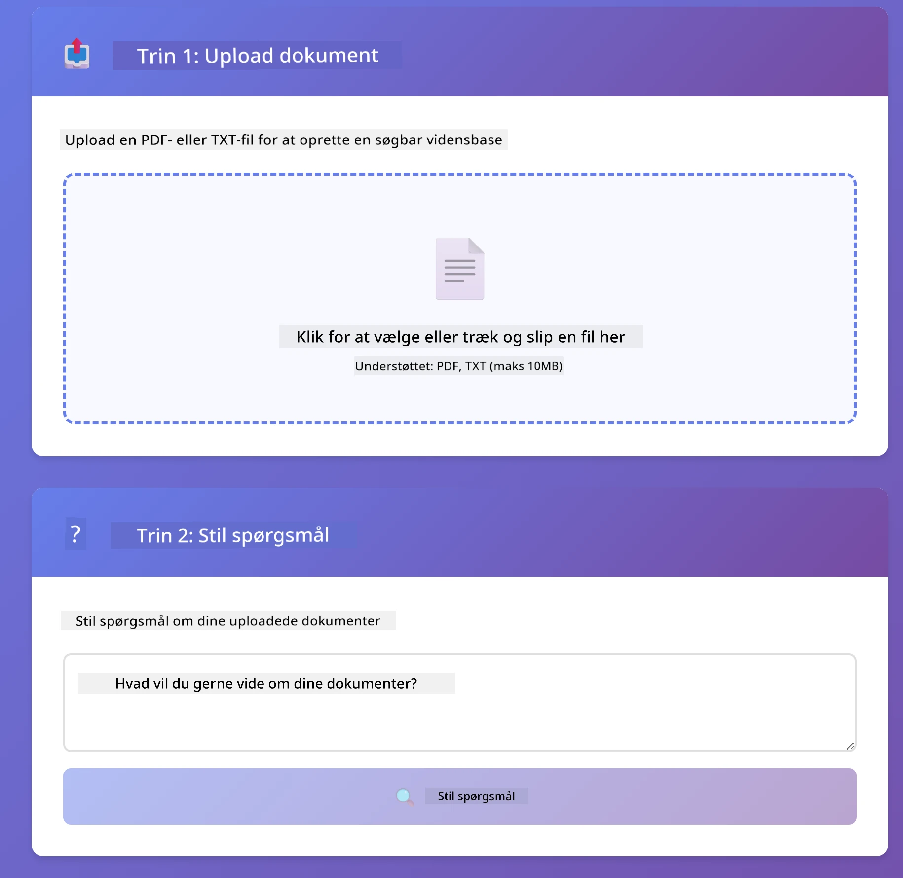
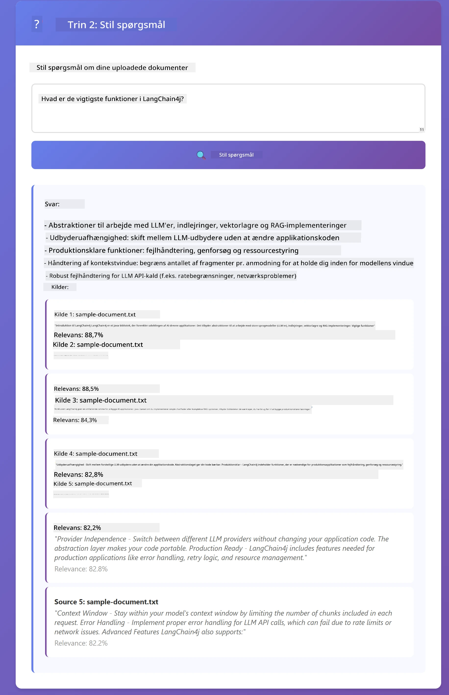

# Modul 03: RAG (Retrieval-Augmented Generation)

## Indholdsfortegnelse

- [Video Gennemgang](#video-gennemgang)
- [Det Vil Du Lære](#det-vil-du-lære)
- [Forudsætninger](#forudsætninger)
- [Forståelse af RAG](#forståelse-af-rag)
  - [Hvilken RAG-Tilgang Bruger Denne Tutorial?](#hvilken-rag-tilgang-bruger-denne-tutorial)
- [Hvordan Det Virker](#hvordan-det-virker)
  - [Dokumentbehandling](#dokumentbehandling)
  - [Oprettelse af Embeddings](#oprettelse-af-embeddings)
  - [Semantisk Søgning](#semantisk-søgning)
  - [Svar Generering](#svar-generering)
- [Kør Applikationen](#kør-applikationen)
- [Brug af Applikationen](#brug-af-applikationen)
  - [Upload et Dokument](#upload-et-dokument)
  - [Stil Spørgsmål](#stil-spørgsmål)
  - [Tjek Kildehenvisninger](#tjek-kildehenvisninger)
  - [Eksperimenter med Spørgsmål](#eksperimenter-med-spørgsmål)
- [Nøglebegreber](#nøglebegreber)
  - [Chunking Strategi](#opdelingsstrategi)
  - [Lighedsscorer](#lighedsscores)
  - [In-Memory Lagring](#in-memory-lagring)
  - [Styring af Kontekstvindue](#håndtering-af-kontekstvindue)
- [Hvornår RAG Er Vigtigt](#når-rag-betyr-noget)
- [Næste Skridt](#næste-skridt)

## Video Gennemgang

Se denne live session, der forklarer, hvordan du kommer i gang med dette modul:

<a href="https://www.youtube.com/watch?v=_olq75ZH_eY"></a>

## Det Vil Du Lære

I de tidligere moduler lærte du, hvordan du fører samtaler med AI og strukturerer dine prompts effektivt. Men der er en grundlæggende begrænsning: sprogmodeller ved kun, det de lærte under træningen. De kan ikke besvare spørgsmål om din virksomheds politikker, din projektdokumentation eller information, de ikke er blevet trænet på.

RAG (Retrieval-Augmented Generation) løser dette problem. I stedet for at prøve at lære modellen dine informationer (hvilket er dyrt og upraktisk), giver du den mulighed for at søge i dine dokumenter. Når nogen stiller et spørgsmål, finder systemet relevant information og inkluderer den i prompten. Modellen svarer så baseret på den hentede kontekst.

Tænk på RAG som at give modellen et referencelager. Når du stiller et spørgsmål, gør systemet:

1. **Brugerforespørgsel** - Du stiller et spørgsmål  
2. **Embedding** - Omformer dit spørgsmål til en vektor  
3. **Vektorsøgning** - Finder lignende dokument-chunks  
4. **Kontekstsammensætning** - Tilføjer relevante chunks til prompten  
5. **Respons** - LLM genererer svar baseret på konteksten  

Dette forankrer modellens svar i dine faktiske data i stedet for at stole på dens træningsviden eller finde på svar.

## Forudsætninger

- Gennemført [Modul 01 - Introduktion](../01-introduction/README.md) (Azure OpenAI-ressourcer deployeret, inklusive `text-embedding-3-small` embedding-modellen)  
- `.env` fil i rodmappen med Azure legitimationsoplysninger (oprettet via `azd up` i Modul 01)

> **Note:** Hvis du ikke har gennemført Modul 01, følg først deploymentsinstruktionerne der. `azd up` kommandoen deployerer både GPT chatmodellen og embeddingmodellen, der bruges i dette modul.

## Forståelse af RAG

Diagrammet nedenfor illustrerer kernekonceptet: i stedet for kun at stole på modellens træningsdata, giver RAG den et referencelager af dine dokumenter, som den kan konsultere, før hvert svar genereres.


*Dette diagram viser forskellen mellem en standard LLM (som gætter ud fra træningsdata) og en RAG-forstærket LLM (som først konsulterer dine dokumenter).*

Sådan hænger delene sammen fra ende til anden. En brugers spørgsmål går gennem fire stadier — embedding, vektorsøgning, kontekstsammensætning og svar generering — hver bygget ovenpå det foregående:



*Dette diagram viser RAG pipeline fra ende til ende — en brugerforespørgsel går gennem embedding, vektorsøgning, kontekstsammensætning og svar generering.*

Resten af dette modul gennemgår hvert trin i detaljer, med kode du kan køre og ændre.

### Hvilken RAG-Tilgang Bruger Denne Tutorial?

LangChain4j tilbyder tre måder at implementere RAG på, hver med et forskelligt abstraktionsniveau. Diagrammet nedenfor sammenligner dem side om side:


*Dette diagram sammenligner de tre LangChain4j RAG-tilgange — Easy, Native og Advanced — og viser deres nøglekomponenter og hvornår de skal bruges.*

| Tilgang | Hvad Den Gør | Afvejning |
|---|---|---|
| **Easy RAG** | Kobler alt automatisk sammen gennem `AiServices` og `ContentRetriever`. Du annoterer et interface, tilknytter en retriever, og LangChain4j håndterer embedding, søgning og prompt-sammensætning bag scenen. | Minimal kode, men du ser ikke hvad der sker i hvert trin. |
| **Native RAG** | Du kalder embedding-modellen, søger i butikken, bygger prompten og genererer svaret selv — ét eksplicit trin ad gangen. | Mere kode, men hvert trin er synligt og kan ændres. |
| **Advanced RAG** | Bruger `RetrievalAugmentor`-framework med plug-in query-transformers, routers, re-rankers og content injectors for produktionsklare pipelines. | Maksimal fleksibilitet men også betydeligt mere kompleksitet. |

**Denne tutorial bruger Native-tilgangen.** Hvert trin i RAG-pipelinen — embed forespørgslen, søg i vektor-lageret, saml konteksten, og generer svaret — er eksplicit skrevet i [`RagService.java`](../../../03-rag/src/main/java/com/example/langchain4j/rag/service/RagService.java). Det er bevidst: som læringsressource er det vigtigere, at du ser og forstår hvert trin fremfor minimal kode. Når du er komfortabel med hvordan delene passer sammen, kan du gå videre til Easy RAG for hurtige prototyper eller Advanced RAG til produktionssystemer.

> **💡 Nysgerrig på Easy RAG?** LangChain4j tilbyder også en *Easy RAG* tilgang, hvor `AiServices` og en `ContentRetriever` automatisk håndterer embedding, søgning, og prompt-sammensætning. Dette modul følger den mere eksplicitte vej — bryder pipelinen op, så du kan se og styre hvert trin selv.

Diagrammet nedenfor viser Easy RAG pipelinen. Bemærk hvordan `AiServices` og `EmbeddingStoreContentRetriever` skjuler al kompleksitet — du loader et dokument, tilknytter en retriever og får svar. Native-tilgangen i dette modul åbner hvert skjult trin:


*Dette diagram viser Easy RAG pipelinen. Sammenlign med Native-tilgangen i dette modul: Easy RAG skjuler embedding, søgning og prompt-sammensætning bag `AiServices` og `ContentRetriever` — du loader et dokument, tilknytter en retriever og får svar. Native-tilgangen bryder denne pipeline op, så du selv kalder hvert trin (embed, søg, saml kontekst, generer), hvilket giver fuld synlighed og kontrol.*

## Hvordan Det Virker

RAG-pipelinen i dette modul opdeles i fire stadier, der kører i rækkefølge hver gang en bruger stiller et spørgsmål. Først bliver et uploadet dokument **parset og opdelt i chunks** i håndterbare stykker. Disse chunks konverteres derefter til **vektor-embeddings** og lagres, så de kan sammenlignes matematisk. Når en forespørgsel kommer, udfører systemet en **semantisk søgning** for at finde de mest relevante chunks, og til sidst sendes de som kontekst til LLM’en for **svar generering**. Afsnittene nedenfor gennemgår hvert trin med kode og diagrammer. Lad os se på det første trin.

### Dokumentbehandling

[DocumentService.java](../../../03-rag/src/main/java/com/example/langchain4j/rag/service/DocumentService.java)

Når du uploader et dokument, parser systemet det (PDF eller tekst), vedhæfter metadata som filnavn, og deler det derefter op i chunks — mindre stykker der passer komfortabelt i modellens kontekstvindue. Disse chunks overlapper let, så du ikke mister kontekst ved grænserne.

```java
// Analyser den uploadede fil og indpak den i et LangChain4j-dokument
Document document = Document.from(content, metadata);

// Del op i 300-token stykker med 30-token overlapning
DocumentSplitter splitter = DocumentSplitters
    .recursive(300, 30);

List<TextSegment> segments = splitter.split(document);
```


Diagrammet nedenfor viser, hvordan dette fungerer visuelt. Bemærk hvordan hver chunk deler nogle tokens med sine naboer — det 30-token overlap sikrer, at vigtig kontekst ikke falder mellem sprækkerne:


*Dette diagram viser et dokument opdelt i 300-token chunks med 30-token overlap, som bevarer konteksten ved chunk-grænser.*

> **🤖 Prøv med [GitHub Copilot](https://github.com/features/copilot) Chat:** Åbn [`DocumentService.java`](../../../03-rag/src/main/java/com/example/langchain4j/rag/service/DocumentService.java) og spørg:  
> - "Hvordan splitter LangChain4j dokumenter i chunks, og hvorfor er overlap vigtigt?"  
> - "Hvad er den optimale chunk-størrelse for forskellige dokumenttyper og hvorfor?"  
> - "Hvordan håndterer jeg dokumenter på flere sprog eller med speciel formatering?"

### Oprettelse af Embeddings

[LangChainRagConfig.java](../../../03-rag/src/main/java/com/example/langchain4j/rag/config/LangChainRagConfig.java)

Hver chunk konverteres til en numerisk repræsentation kaldet en embedding — essentielt en betydnings-til-tal-omformer. Embedding-modellen er ikke "intelligent" på samme måde som en chatmodel; den kan ikke følge instruktioner, ræsonnere eller besvare spørgsmål. Det den kan, er at kortlægge tekst til et matematisk rum, hvor lignende betydninger lander tæt på hinanden — "bil" tæt på "automobil," "refunderingspolitik" tæt på "tilbagebetaling." Tænk på en chatmodel som en person du kan tale med; en embeddingmodel er et ultra-godt arkivsystem.

Diagrammet nedenfor visualiserer dette koncept — tekst går ind, numeriske vektorer kommer ud, og lignende betydninger skaber nærliggende vektorer:


*Dette diagram viser, hvordan en embeddingmodel konverterer tekst til numeriske vektorer og placerer lignende betydninger — som "bil" og "automobil" — tæt på hinanden i vektorrummet.*

```java
@Bean
public EmbeddingModel embeddingModel() {
    return OpenAiOfficialEmbeddingModel.builder()
        .baseUrl(azureOpenAiEndpoint)
        .apiKey(azureOpenAiKey)
        .modelName(azureEmbeddingDeploymentName)
        .build();
}

EmbeddingStore<TextSegment> embeddingStore = 
    new InMemoryEmbeddingStore<>();
```


Klassediagrammet nedenfor viser de to separate flows i en RAG pipeline og de LangChain4j klasser, der implementerer dem. **Indslusningsflowet** (kører én gang ved upload) splitter dokumentet, embedder chunks og lagrer dem via `.addAll()`. **Forespørgselsflowet** (kører hver gang en bruger spørger) embedder spørgsmålet, søger i butikken via `.search()` og sender den matchede kontekst til chatmodellen. Begge flows mødes i det delte `EmbeddingStore<TextSegment>` interface:


*Dette diagram viser de to flows i en RAG pipeline — ingestion og query — og hvordan de forbindes gennem et fælles EmbeddingStore.*

Når embeddings er lagret, samles lignende indhold naturligt i klynger i vektorrummet. Visualiseringen nedenfor viser, hvordan dokumenter om beslægtede emner ender som nærliggende punkter, hvilket gør semantisk søgning mulig:



*Denne visualisering viser, hvordan beslægtede dokumenter klumper sig sammen i 3D vektorrum med emner som Tekniske Docs, Forretningsregler og FAQs som klare grupper.*

Når en bruger søger, følger systemet fire trin: embed dokumenterne én gang, embed forespørgslen ved hver søgning, sammenlign forespørgsels-vektor med alle lagrede vektorer vha. cosinus-lighed, og returner de top-K højst scorende chunks. Diagrammet nedenfor går igennem hvert trin og de LangChain4j klasser, der er involveret:


*Dette diagram viser de fire trin i embedding-søgningen: embed dokumenter, embed forespørgsel, sammenlign vektorer med cosinuslighed, og returner top-K resultater.*

### Semantisk Søgning

[RagService.java](../../../03-rag/src/main/java/com/example/langchain4j/rag/service/RagService.java)

Når du stiller et spørgsmål, bliver dit spørgsmål også embeddet. Systemet sammenligner dit spørgsmåls embedding med alle dokument-chunks embeddings. Det finder chunks med mest lignende betydning — ikke bare nøgleord, men faktisk semantisk lighed.

```java
Embedding queryEmbedding = embeddingModel.embed(question).content();

EmbeddingSearchRequest searchRequest = EmbeddingSearchRequest.builder()
    .queryEmbedding(queryEmbedding)
    .maxResults(5)
    .minScore(0.5)
    .build();

EmbeddingSearchResult<TextSegment> searchResult = embeddingStore.search(searchRequest);
List<EmbeddingMatch<TextSegment>> matches = searchResult.matches();

for (EmbeddingMatch<TextSegment> match : matches) {
    String relevantText = match.embedded().text();
    double score = match.score();
}
```


Diagrammet nedenfor kontrasterer semantisk søgning med traditionel nøgleordssøgning. En nøgleordssøgning på "køretøj" overser en chunk om "biler og lastbiler," men semantisk søgning forstår, at de betyder det samme og returnerer det som et topscorende match:


*Dette diagram sammenligner nøgleordsbaseret søgning med semantisk søgning og viser, hvordan semantisk søgning henter konceptuelt beslægtet indhold selv når de præcise nøgleord er forskellige.*

Under motorhjelmen måles lighed med cosinus-lighed — essentielt spørger man "peger disse to pile i samme retning?" To chunks kan bruge helt forskellige ord, men hvis de betyder det samme, peger deres vektorer i samme retning og scorer tæt på 1,0:


*Dette diagram illustrerer cosinuslighed som vinklen mellem indlejringsvektorer — mere justerede vektorer scorer tættere på 1,0, hvilket indikerer højere semantisk lighed.*

> **🤖 Prøv med [GitHub Copilot](https://github.com/features/copilot) Chat:** Åbn [`RagService.java`](../../../03-rag/src/main/java/com/example/langchain4j/rag/service/RagService.java) og spørg:
> - "Hvordan fungerer lighedssøgning med indlejringer, og hvad bestemmer scoren?"
> - "Hvilken lighedstærskel skal jeg bruge, og hvordan påvirker det resultaterne?"
> - "Hvordan håndterer jeg tilfælde, hvor der ikke findes relevante dokumenter?"

### Svar Generering

[RagService.java](../../../03-rag/src/main/java/com/example/langchain4j/rag/service/RagService.java)

De mest relevante bidder samles i en struktureret prompt, der inkluderer eksplicitte instruktioner, den hentede kontekst og brugerens spørgsmål. Modellen læser disse specifikke bidder og svarer baseret på den information — den kan kun bruge det, der er foran den, hvilket forhindrer hallucination.

```java
String context = matches.stream()
    .map(match -> match.embedded().text())
    .collect(Collectors.joining("\n\n"));

String prompt = String.format("""
    Answer the question based on the following context.
    If the answer cannot be found in the context, say so.

    Context:
    %s

    Question: %s

    Answer:""", context, request.question());

String answer = chatModel.chat(prompt);
```

Diagrammet nedenfor viser denne samling i praksis — de højest scorende bidder fra søgetrinnet indsættes i prompt-skabelonen, og `OpenAiOfficialChatModel` genererer et funderet svar:


*Dette diagram viser, hvordan de højest scorende bidder samles i en struktureret prompt, hvilket tillader modellen at generere et funderet svar fra dine data.*

## Kør Applikationen

**Bekræft implementering:**

Sørg for, at `.env`-filen findes i rodmappen med Azure legitimationsoplysninger (oprettet under Modul 01). Kør dette fra modulkataloget (`03-rag/`):

**Bash:**
```bash
cat ../.env  # Skal vise AZURE_OPENAI_ENDPOINT, API_KEY, DEPLOYMENT
```

**PowerShell:**
```powershell
Get-Content ..\.env  # Skal vise AZURE_OPENAI_ENDPOINT, API_KEY, DEPLOYMENT
```

**Start applikationen:**

> **Note:** Hvis du allerede har startet alle applikationer med `./start-all.sh` fra rodmappen (som beskrevet i Modul 01), kører dette modul allerede på port 8081. Du kan springe startkommandoerne over nedenfor og gå direkte til http://localhost:8081.

**Mulighed 1: Brug Spring Boot Dashboard (Anbefalet til VS Code-brugere)**

Dev-containeren inkluderer Spring Boot Dashboard-udvidelsen, som giver en visuel grænseflade til at håndtere alle Spring Boot-applikationer. Du finder den i Aktivitetsbjælken på venstre side af VS Code (se efter Spring Boot-ikonet).

Fra Spring Boot Dashboard kan du:
- Se alle tilgængelige Spring Boot-applikationer i arbejdsområdet
- Starte/stoppe applikationer med et enkelt klik
- Se applikationslogfiler i realtid
- Overvåge applikationens status

Klik blot på afspilningsknappen ved siden af "rag" for at starte dette modul, eller start alle moduler på én gang.



*Dette screenshot viser Spring Boot Dashboard i VS Code, hvor du visuelt kan starte, stoppe og overvåge applikationer.*

**Mulighed 2: Brug shell-scripts**

Start alle webapplikationer (moduler 01-04):

**Bash:**
```bash
cd ..  # Fra rodbiblioteket
./start-all.sh
```

**PowerShell:**
```powershell
cd ..  # Fra rodkatalog
.\start-all.ps1
```

Eller start kun dette modul:

**Bash:**
```bash
cd 03-rag
./start.sh
```

**PowerShell:**
```powershell
cd 03-rag
.\start.ps1
```

Begge scripts indlæser automatisk miljøvariabler fra root `.env`-filen og vil bygge JAR-filerne, hvis de ikke findes.

> **Note:** Hvis du foretrækker at bygge alle moduler manuelt før start:
>
> **Bash:**
> ```bash
> cd ..  # Go to root directory
> mvn clean package -DskipTests
> ```
>
> **PowerShell:**
> ```powershell
> cd ..  # Go to root directory
> mvn clean package -DskipTests
> ```

Åbn http://localhost:8081 i din browser.

**For at stoppe:**

**Bash:**
```bash
./stop.sh  # Kun denne modul
# Eller
cd .. && ./stop-all.sh  # Alle moduler
```

**PowerShell:**
```powershell
.\stop.ps1  # Kun denne modul
# Eller
cd ..; .\stop-all.ps1  # Alle moduler
```

## Brug af Applikationen

Applikationen tilbyder en webgrænseflade til dokumentupload og spørgsmål.

<a href="images/rag-homepage.png"></a>

*Dette screenshot viser RAG-applikationsgrænsefladen, hvor du uploader dokumenter og stiller spørgsmål.*

### Upload et Dokument

Start med at uploade et dokument – TXT-filer fungerer bedst til test. Et `sample-document.txt` er tilgængeligt i denne mappe, som indeholder information om LangChain4j-funktioner, RAG-implementering og best practices - perfekt til at teste systemet.

Systemet behandler dit dokument, opdeler det i bidder og skaber indlejringer for hver bid. Dette sker automatisk, når du uploader.

### Stil Spørgsmål

Stil nu specifikke spørgsmål om dokumentindholdet. Prøv noget faktuelt, der klart fremgår af dokumentet. Systemet søger efter relevante bidder, inkluderer dem i prompten og genererer et svar.

### Tjek Kildehenvisninger

Bemærk, at hvert svar inkluderer kildehenvisninger med lighedsscoringer. Disse scorer (0 til 1) viser, hvor relevante bidder var for dit spørgsmål. Højere scorer betyder bedre match. Dette lader dig verificere svaret mod kildematerialet.

<a href="images/rag-query-results.png"></a>

*Dette screenshot viser forespørgselsresultater med det genererede svar, kildehenvisninger og relevansscores for hver hentet bid.*

### Eksperimenter med Spørgsmål

Prøv forskellige typer spørgsmål:
- Specifikke fakta: "Hvad er hovedemnet?"
- Sammenligninger: "Hvad er forskellen mellem X og Y?"
- Resuméer: "Opsummer hovedpunkterne om Z"

Se hvordan relevansscore ændres afhængigt af, hvor godt dit spørgsmål matcher dokumentindholdet.

## Nøglebegreber

### Opdelingsstrategi

Dokumenter opdeles i bidder på 300 tokens med 30 tokens overlap. Denne balance sikrer, at hver bid har nok kontekst til at være meningsfuld, samtidig med at de er små nok til at inkludere flere bidder i en prompt.

### Lighedsscores

Hver hentet bid har en lighedsscore mellem 0 og 1, der angiver, hvor tæt den matcher brugerens spørgsmål. Diagrammet nedenfor visualiserer scoreintervallerne og hvordan systemet bruger dem til at filtrere resultater:


*Dette diagram viser scoreintervaller fra 0 til 1, med en minimumsterskel på 0,5, der filtrerer irrelevante bidder.*

Score spænder fra 0 til 1:
- 0,7-1,0: Meget relevant, præcis match
- 0,5-0,7: Relevant, god kontekst
- Under 0,5: Filtreret fra, for forskellig

Systemet henter kun bidder over minimumstersklen for at sikre kvalitet.

Indlejringer fungerer godt, når betydninger klumper sig rent, men har blinde vinkler. Diagrammet nedenfor viser de almindelige fejltilstande — bidder der er for store producerer uklare vektorer, bidder der er for små mangler kontekst, tvetydige termer peger på flere klynger, og præcise opslag (ID'er, reservedelsnumre) fungerer slet ikke med indlejringer:


*Dette diagram viser almindelige fejltilstande ved indlejringer: bidder for store, bidder for små, tvetydige termer der peger på flere klynger, og præcise opslag som ID'er.*

### In-Memory Lagring

Dette modul anvender in-memory lagring for enkelhedens skyld. Når du genstarter applikationen, mistes uploadede dokumenter. Produksjonssystemer bruger vedvarende vektordatabaser som Qdrant eller Azure AI Search.

### Håndtering af Kontekstvindue

Hver model har et maksimalt kontekstvindue. Du kan ikke inkludere alle bidder fra et stort dokument. Systemet henter de N mest relevante bidder (standard 5) for at holde sig inden for grænserne samtidig med at der gives nok kontekst til præcise svar.

## Når RAG Betyr Noget

RAG er ikke altid den rette tilgang. Beslutningsguiden nedenfor hjælper dig med at afgøre, hvornår RAG tilfører værdi kontra hvornår enklere tilgange — som at inkludere indhold direkte i prompten eller stole på modellens indbyggede viden — er tilstrækkelige:


*Dette diagram viser en beslutningsguide for, hvornår RAG tilfører værdi kontra hvornår enklere tilgange er tilstrækkelige.*

## Næste Skridt

**Næste Modul:** [04-tools - AI Agents with Tools](../04-tools/README.md)

---

**Navigation:** [← Forrige: Modul 02 - Prompt Engineering](../02-prompt-engineering/README.md) | [Tilbage til Hovedmenu](../README.md) | [Næste: Modul 04 - Tools →](../04-tools/README.md)

---

<!-- CO-OP TRANSLATOR DISCLAIMER START -->
**Ansvarsfraskrivelse**:
Dette dokument er blevet oversat ved hjælp af AI-oversættelsestjenesten [Co-op Translator](https://github.com/Azure/co-op-translator). Selvom vi bestræber os på nøjagtighed, skal du være opmærksom på, at automatiserede oversættelser kan indeholde fejl eller unøjagtigheder. Det originale dokument på dets oprindelige sprog bør betragtes som den autoritative kilde. For kritisk information anbefales professionel menneskelig oversættelse. Vi påtager os intet ansvar for misforståelser eller fejltolkninger, der opstår som følge af brugen af denne oversættelse.
<!-- CO-OP TRANSLATOR DISCLAIMER END -->