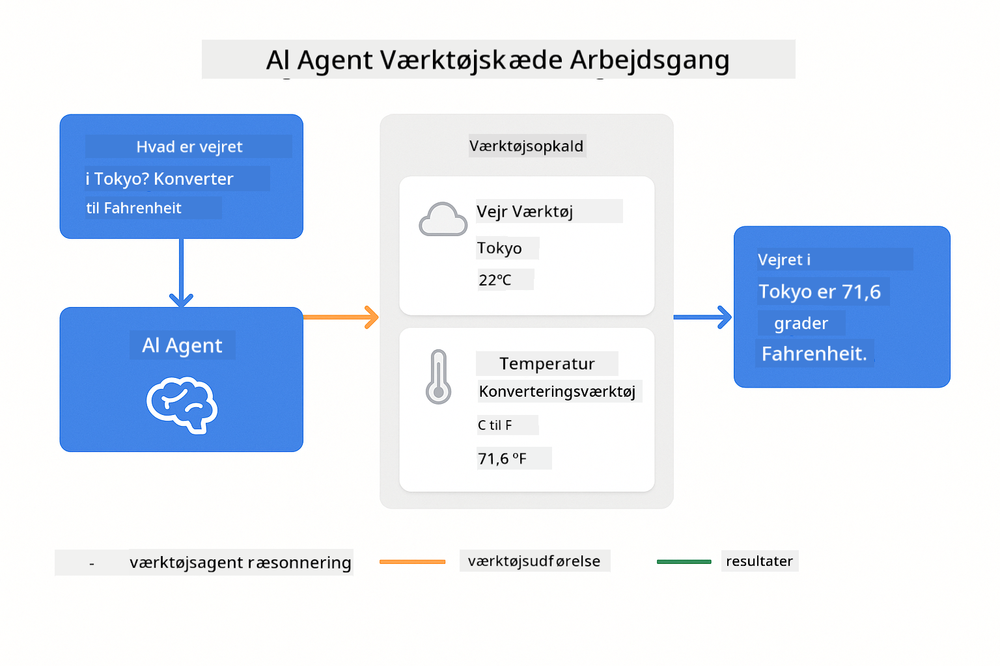

<!--
CO_OP_TRANSLATOR_METADATA:
{
  "original_hash": "13ec450c12cdd1a863baa2b778f27cd7",
  "translation_date": "2025-12-31T01:32:46+00:00",
  "source_file": "04-tools/README.md",
  "language_code": "da"
}
-->
# Module 04: AI Agents with Tools

## Table of Contents

- [Hvad du vil lære](../../../04-tools)
- [Forudsætninger](../../../04-tools)
- [Forståelse af AI-agenter med værktøjer](../../../04-tools)
- [Hvordan tool-calling virker](../../../04-tools)
  - [Tool-definitioner](../../../04-tools)
  - [Beslutningstagning](../../../04-tools)
  - [Udførelse](../../../04-tools)
  - [Responsgenerering](../../../04-tools)
- [Værktøjskædning](../../../04-tools)
- [Kør applikationen](../../../04-tools)
- [Brug af applikationen](../../../04-tools)
  - [Prøv simpel brug af værktøj](../../../04-tools)
  - [Test værktøjskædning](../../../04-tools)
  - [Se samtaleflowet](../../../04-tools)
  - [Observer ræsonnementet](../../../04-tools)
  - [Eksperimenter med forskellige forespørgsler](../../../04-tools)
- [Nøglebegreber](../../../04-tools)
  - [ReAct-mønsteret (Ræsonnement og Handling)](../../../04-tools)
  - [Tool-beskrivelser betyder noget](../../../04-tools)
  - [Session-håndtering](../../../04-tools)
  - [Fejlhåndtering](../../../04-tools)
- [Tilgængelige værktøjer](../../../04-tools)
- [Hvornår man skal bruge værktøjsbaserede agenter](../../../04-tools)
- [Næste skridt](../../../04-tools)

## Hvad du vil lære

Indtil nu har du lært, hvordan man fører samtaler med AI, strukturerer prompts effektivt og forankrer svar i dine dokumenter. Men der er stadig en grundlæggende begrænsning: sprogmodeller kan kun generere tekst. De kan ikke tjekke vejret, udføre beregninger, forespørge databaser eller interagere med eksterne systemer.

Værktøjer ændrer dette. Ved at give modellen adgang til funktioner, den kan kalde, forvandler du den fra en tekstgenerator til en agent, der kan udføre handlinger. Modellen beslutter, hvornår den har brug for et værktøj, hvilket værktøj der skal bruges, og hvilke parametre der skal sendes. Din kode udfører funktionen og returnerer resultatet. Modellen inkorporerer dette resultat i sit svar.

## Forudsætninger

- Fuldført Module 01 (Azure OpenAI-ressourcer distribueret)
- `.env`-fil i rodmappen med Azure-legitimationsoplysninger (oprettet af `azd up` i Module 01)

> **Bemærk:** Hvis du ikke har fuldført Module 01, følg udrulningsinstruktionerne der først.

## Forståelse af AI-agenter med værktøjer

> **📝 Bemærk:** Begrebet "agenter" i dette modul henviser til AI-assistenter udvidet med evnen til at kalde værktøjer. Dette er forskelligt fra **Agentic AI**-mønstrene (autonome agenter med planlægning, hukommelse og flertrins ræsonnement), som vi vil dække i [Module 05: MCP](../05-mcp/README.md).

En AI-agent med værktøjer følger et ræsonnement- og handlingsmønster (ReAct):

1. Brugeren stiller et spørgsmål
2. Agenten ræsonnerer om, hvad den har brug for at vide
3. Agenten beslutter, om den har brug for et værktøj for at svare
4. Hvis ja, kalder agenten det relevante værktøj med de rigtige parametre
5. Værktøjet udfører og returnerer data
6. Agenten indarbejder resultatet og giver det endelige svar


*ReAct-mønsteret - hvordan AI-agenter skifter mellem ræsonnement og handling for at løse problemer*

Det sker automatisk. Du definerer værktøjerne og deres beskrivelser. Modellen håndterer beslutningstagningen om, hvornår og hvordan de skal bruges.

## Hvordan tool-calling virker

**Tool-definitioner** - [WeatherTool.java](../../../04-tools/src/main/java/com/example/langchain4j/agents/tools/WeatherTool.java) | [TemperatureTool.java](../../../04-tools/src/main/java/com/example/langchain4j/agents/tools/TemperatureTool.java)

Du definerer funktioner med klare beskrivelser og parameterspecifikationer. Modellen ser disse beskrivelser i sit system-prompt og forstår, hvad hvert værktøj gør.

```java
@Component
public class WeatherTool {
    
    @Tool("Get the current weather for a location")
    public String getCurrentWeather(@P("Location name") String location) {
        // Din logik til vejropslag
        return "Weather in " + location + ": 22°C, cloudy";
    }
}

@AiService
public interface Assistant {
    String chat(@MemoryId String sessionId, @UserMessage String message);
}

// Assistenten er automatisk konfigureret af Spring Boot med:
// - ChatModel bean
// - Alle @Tool-metoder fra @Component-klasser
// - ChatMemoryProvider til sessionsstyring
```

> **🤖 Prøv med [GitHub Copilot](https://github.com/features/copilot) Chat:** Åbn [`WeatherTool.java`](../../../04-tools/src/main/java/com/example/langchain4j/agents/tools/WeatherTool.java) og spørg:
> - "Hvordan ville jeg integrere en rigtig vejr-API som OpenWeatherMap i stedet for mock-data?"
> - "Hvad gør en god tool-beskrivelse, som hjælper AI'en med at bruge den korrekt?"
> - "Hvordan håndterer jeg API-fejl og rate limits i tool-implementeringer?"

**Beslutningstagning**

Når en bruger spørger "Hvad er vejret i Seattle?", genkender modellen, at den har brug for vejrværktøjet. Den genererer et funktionskald med parameteren location sat til "Seattle".

**Udførelse** - [AgentService.java](../../../04-tools/src/main/java/com/example/langchain4j/agents/service/AgentService.java)

Spring Boot auto-wirer det deklarative `@AiService`-interface med alle registrerede værktøjer, og LangChain4j udfører tool-kald automatisk.

> **🤖 Prøv med [GitHub Copilot](https://github.com/features/copilot) Chat:** Åbn [`AgentService.java`](../../../04-tools/src/main/java/com/example/langchain4j/agents/service/AgentService.java) og spørg:
> - "Hvordan fungerer ReAct-mønsteret, og hvorfor er det effektivt for AI-agenter?"
> - "Hvordan beslutter agenten, hvilket værktøj der skal bruges, og i hvilken rækkefølge?"
> - "Hvad sker der, hvis et tool-udførsel fejler - hvordan bør jeg håndtere fejl robust?"

**Responsgenerering**

Modellen modtager vejrdataene og formaterer det til et naturligt svar til brugeren.

### Hvorfor bruge deklarative AI-tjenester?

Dette modul bruger LangChain4j's Spring Boot-integration med deklarative `@AiService`-interfaces:

- **Spring Boot auto-wiring** - ChatModel og værktøjer injiceres automatisk
- **@MemoryId-mønster** - Automatisk session-baseret hukommelsesstyring
- **Enkelt instans** - Assistent oprettes én gang og genbruges for bedre ydeevne
- **Typesikker udførelse** - Java-metoder kaldes direkte med typekonvertering
- **Multi-turn orkestrering** - Håndterer værktøjskædning automatisk
- **Zero boilerplate** - Ingen manuelle AiServices.builder()-kald eller memory HashMap

Alternative tilgange (manuel `AiServices.builder()`) kræver mere kode og går glip af Spring Boot-integrationsfordelene.

## Værktøjskædning

**Værktøjskædning** - AI'en kan kalde flere værktøjer i rækkefølge. Stil spørgsmålet "Hvad er vejret i Seattle, og skal jeg tage en paraply med?" og se, hvordan den kæder `getCurrentWeather` sammen med ræsonnement om regntøj.

<a href="images/tool-chaining.png"></a>

*Sekventielle tool-kald - output fra ét værktøj føder den næste beslutning*

**Gracious nedbrud** - Bed om vejret i en by, der ikke er i mock-dataene. Værktøjet returnerer en fejlmeddelelse, og AI'en forklarer, at den ikke kan hjælpe. Værktøjer fejler på en sikker måde.

Dette sker i en enkelt samtaletur. Agenten orkestrerer flere tool-kald autonomt.

## Kør applikationen

**Bekræft udrulning:**

Sørg for, at `.env`-filen findes i rodmappen med Azure-legitimationsoplysninger (oprettet under Module 01):
```bash
cat ../.env  # Skal vise AZURE_OPENAI_ENDPOINT, API_KEY, DEPLOYMENT
```

**Start applikationen:**

> **Bemærk:** Hvis du allerede har startet alle applikationer ved hjælp af `./start-all.sh` fra Module 01, kører dette modul allerede på port 8084. Du kan springe startkommandoerne nedenfor over og gå direkte til http://localhost:8084.

**Mulighed 1: Brug Spring Boot Dashboard (Anbefalet for VS Code-brugere)**

Dev containeren inkluderer Spring Boot Dashboard-udvidelsen, som giver en visuel grænseflade til at administrere alle Spring Boot-applikationer. Du finder den i Activity Bar til venstre i VS Code (se efter Spring Boot-ikonet).

Fra Spring Boot Dashboard kan du:
- Se alle tilgængelige Spring Boot-applikationer i workspace
- Starte/stoppe applikationer med et enkelt klik
- Se applikationslogs i realtid
- Overvåge applikationstilstand

Klik simpelthen på play-knappen ved siden af "tools" for at starte dette modul, eller start alle moduler på én gang.


**Mulighed 2: Brug shell-scripts**

Start alle webapplikationer (moduler 01-04):

**Bash:**
```bash
cd ..  # Fra rodmappen
./start-all.sh
```

**PowerShell:**
```powershell
cd ..  # Fra rodmappen
.\start-all.ps1
```

Eller start kun dette modul:

**Bash:**
```bash
cd 04-tools
./start.sh
```

**PowerShell:**
```powershell
cd 04-tools
.\start.ps1
```

Begge scripts indlæser automatisk miljøvariablerne fra rodens `.env`-fil og bygger JAR'erne, hvis de ikke findes.

> **Bemærk:** Hvis du foretrækker at bygge alle moduler manuelt før start:
>
> **Bash:**
> ```bash
> cd ..  # Go to root directory
> mvn clean package -DskipTests
> ```
>
> **PowerShell:**
> ```powershell
> cd ..  # Go to root directory
> mvn clean package -DskipTests
> ```

Åbn http://localhost:8084 i din browser.

**For at stoppe:**

**Bash:**
```bash
./stop.sh  # Kun dette modul
# Eller
cd .. && ./stop-all.sh  # Alle moduler
```

**PowerShell:**
```powershell
.\stop.ps1  # Kun dette modul
# Eller
cd ..; .\stop-all.ps1  # Alle moduler
```

## Brug af applikationen

Applikationen tilbyder en webgrænseflade, hvor du kan interagere med en AI-agent, der har adgang til værktøjer til vejr og temperaturoverførsel.

<a href="images/tools-homepage.png"></a>

*AI Agent Tools-grænsefladen - hurtige eksempler og chatgrænseflade til at interagere med værktøjer*

**Prøv simpel brug af værktøj**

Start med en ligetil forespørgsel: "Konverter 100 grader Fahrenheit til Celsius". Agenten genkender, at den har brug for temperaturoverførselsværktøjet, kalder det med de rigtige parametre og returnerer resultatet. Bemærk, hvor naturligt dette føles - du specificerede ikke, hvilket værktøj der skulle bruges, eller hvordan man kalder det.

**Test værktøjskædning**

Prøv nu noget mere komplekst: "Hvad er vejret i Seattle og konverter det til Fahrenheit?" Se agenten arbejde gennem dette trin for trin. Den henter først vejret (som returnerer Celsius), genkender, at den skal konvertere til Fahrenheit, kalder konverteringsværktøjet og kombinerer begge resultater i ét svar.

**Se samtaleflowet**

Chatgrænsefladen bevarer samtalehistorikken, så du kan have multi-turn interaktioner. Du kan se alle tidligere forespørgsler og svar, hvilket gør det let at følge samtalen og forstå, hvordan agenten bygger kontekst over flere udvekslinger.

<a href="images/tools-conversation-demo.png"></a>

*Multi-turn samtale, der viser simple konverteringer, vejropslag og værktøjskædning*

**Eksperimenter med forskellige forespørgsler**

Prøv forskellige kombinationer:
- Vejropslag: "Hvad er vejret i Tokyo?"
- Temperaturkonverteringer: "Hvad er 25°C i Kelvin?"
- Kombinerede forespørgsler: "Tjek vejret i Paris og sig, om det er over 20°C"

Bemærk, hvordan agenten fortolker naturligt sprog og mapper det til passende tool-kald.

## Nøglebegreber

**ReAct-mønsteret (Ræsonnement og Handling)**

Agenten skifter mellem at ræsonnere (beslutte, hvad der skal gøres) og handle (bruge værktøjer). Dette mønster muliggør autonom problemløsning fremfor blot at svare på instruktioner.

**Tool-beskrivelser betyder noget**

Kvaliteten af dine tool-beskrivelser påvirker direkte, hvor godt agenten bruger dem. Klare, specifikke beskrivelser hjælper modellen med at forstå, hvornår og hvordan hvert værktøj skal kaldes.

**Session-håndtering**

`@MemoryId`-annotationen muliggør automatisk session-baseret hukommelsesstyring. Hver session-ID får sin egen `ChatMemory`-instans, som administreres af `ChatMemoryProvider` beanen, hvilket eliminerer behovet for manuel hukommelsessporing.

**Fejlhåndtering**

Værktøjer kan fejle - API'er kan timeoute, parametre kan være ugyldige, eksterne tjenester kan gå ned. Produktionsagenter har brug for fejlhåndtering, så modellen kan forklare problemer eller prøve alternativer.

## Tilgængelige værktøjer

**Vejrværktøjer** (mock-data til demonstration):
- Hent aktuelt vejr for en lokation
- Hent flere dages prognose

**Temperaturkonverteringsværktøjer**:
- Celsius til Fahrenheit
- Fahrenheit til Celsius
- Celsius til Kelvin
- Kelvin til Celsius
- Fahrenheit til Kelvin
- Kelvin til Fahrenheit

Disse er simple eksempler, men mønsteret udvides til enhver funktion: databaseforespørgsler, API-kald, beregninger, filoperationer eller systemkommandoer.

## Hvornår man skal bruge værktøjsbaserede agenter

**Brug værktøjer når:**
- Svar kræver realtidsdata (vejr, aktiekurser, lagerbeholdning)
- Du skal udføre beregninger ud over simpel matematik
- Adgang til databaser eller API'er er nødvendig
- Der skal udføres handlinger (sende e-mails, oprette tickets, opdatere poster)
- Kombination af flere datakilder

**Brug ikke værktøjer når:**
- Spørgsmål kan besvares ud fra almen viden
- Svaret er rent samtalemæssigt
- Tool-latens ville gøre oplevelsen for langsom

## Næste skridt

**Næste modul:** [05-mcp - Model Context Protocol (MCP)](../05-mcp/README.md)

---

**Navigation:** [← Forrige: Module 03 - RAG](../03-rag/README.md) | [Tilbage til hovedmenu](../README.md) | [Næste: Module 05 - MCP →](../05-mcp/README.md)

---

<!-- CO-OP TRANSLATOR DISCLAIMER START -->
**Ansvarsfraskrivelse**:
Dette dokument er blevet oversat ved hjælp af AI-oversættelsestjenesten [Co-op Translator](https://github.com/Azure/co-op-translator). Selvom vi stræber efter nøjagtighed, bedes du være opmærksom på, at automatiske oversættelser kan indeholde fejl eller unøjagtigheder. Det oprindelige dokument på dets modersmål bør betragtes som den autoritative kilde. For kritiske oplysninger anbefales professionel menneskelig oversættelse. Vi kan ikke holdes ansvarlige for misforståelser eller fejltolkninger, der måtte opstå som følge af brugen af denne oversættelse.
<!-- CO-OP TRANSLATOR DISCLAIMER END -->