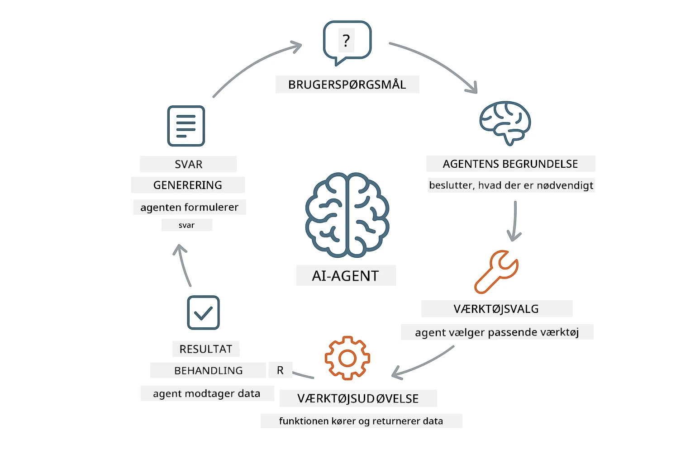
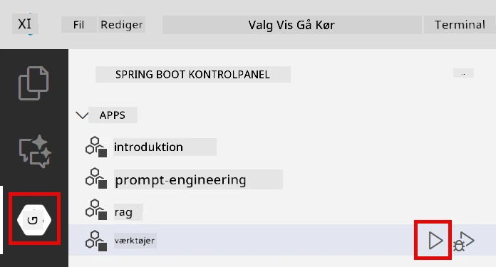
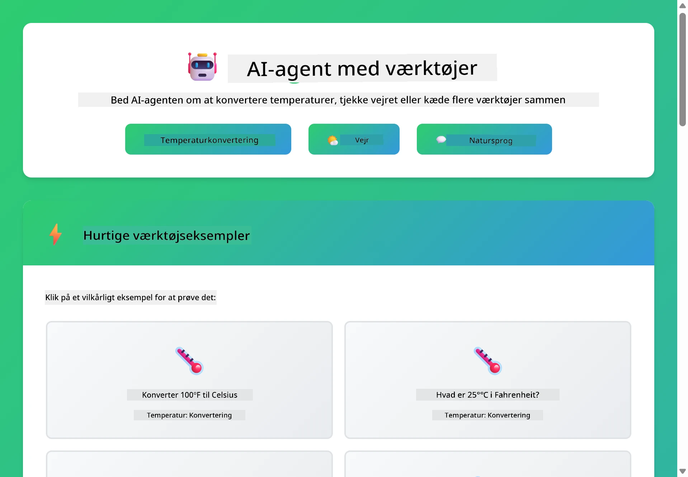
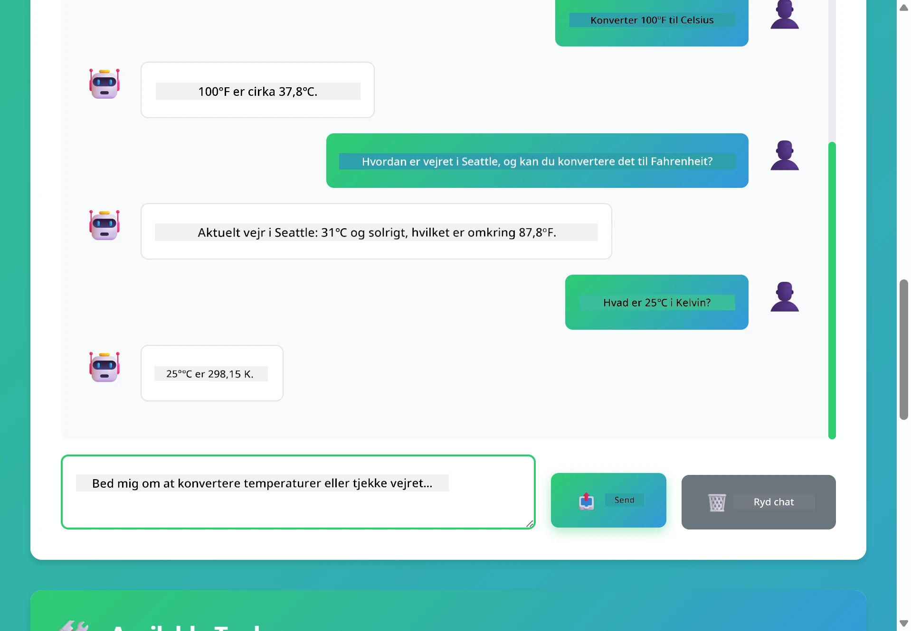

<!--
CO_OP_TRANSLATOR_METADATA:
{
  "original_hash": "844788938b26242f3cc54ce0d0951bea",
  "translation_date": "2026-01-05T23:47:41+00:00",
  "source_file": "04-tools/README.md",
  "language_code": "da"
}
-->
# Modul 04: AI-agenter med værktøjer

## Indholdsfortegnelse

- [Hvad du vil lære](../../../04-tools)
- [Forudsætninger](../../../04-tools)
- [Forståelse af AI-agenter med værktøjer](../../../04-tools)
- [Sådan fungerer værktøjskald](../../../04-tools)
  - [Værktøjsdefinitioner](../../../04-tools)
  - [Beslutningstagning](../../../04-tools)
  - [Eksekvering](../../../04-tools)
  - [Svar generering](../../../04-tools)
- [Værktøjskædning](../../../04-tools)
- [Kør applikationen](../../../04-tools)
- [Brug af applikationen](../../../04-tools)
  - [Prøv simpel brug af værktøj](../../../04-tools)
  - [Test værktøjskædning](../../../04-tools)
  - [Se samtaleforløb](../../../04-tools)
  - [Eksperimenter med forskellige forespørgsler](../../../04-tools)
- [Nøglebegreber](../../../04-tools)
  - [ReAct-mønster (Resonering og Handling)](../../../04-tools)
  - [Værktøjsbeskrivelser betyder noget](../../../04-tools)
  - [Sessionsstyring](../../../04-tools)
  - [Fejlhåndtering](../../../04-tools)
- [Tilgængelige værktøjer](../../../04-tools)
- [Hvornår man bruger agentbaserede værktøjer](../../../04-tools)
- [Næste skridt](../../../04-tools)

## Hvad du vil lære

Indtil nu har du lært, hvordan man fører samtaler med AI, strukturerer prompts effektivt og forankrer svar i dine dokumenter. Men der er stadig en grundlæggende begrænsning: sprogmodeller kan kun generere tekst. De kan ikke tjekke vejret, udføre beregninger, forespørge databaser eller interagere med eksterne systemer.

Værktøjer ændrer dette. Ved at give modellen adgang til funktioner, den kan kalde, forvandler du den fra en tekstgenerator til en agent, der kan handle. Modellen beslutter, hvornår den har brug for et værktøj, hvilket værktøj der skal bruges, og hvilke parametre der skal gives. Din kode udfører funktionen og returnerer resultatet. Modellen indarbejder resultatet i sit svar.

## Forudsætninger

- Fuldført Modul 01 (Azure OpenAI-ressourcer implementeret)
- `.env` fil i rodmappen med Azure legitimationsoplysninger (oprettet af `azd up` i Modul 01)

> **Note:** Hvis du ikke har gennemført Modul 01, skal du først følge implementeringsinstruktionerne der.

## Forståelse af AI-agenter med værktøjer

> **📝 Note:** Betegnelsen "agenter" i dette modul henviser til AI-assistenter med forbedrede værktøjskaldsfunktioner. Dette er forskelligt fra **Agentisk AI**-mønstrene (autonome agenter med planlægning, hukommelse og flertrins resonnering), som vi dækker i [Modul 05: MCP](../05-mcp/README.md).

En AI-agent med værktøjer følger et resonnerings- og handlingsmønster (ReAct):

1. Brugeren stiller et spørgsmål
2. Agenten resonerer over, hvad den har brug for at vide
3. Agenten beslutter, om den har brug for et værktøj for at svare
4. Hvis ja, kalder agenten det passende værktøj med de korrekte parametre
5. Værktøjet udfører og returnerer data
6. Agenten indarbejder resultatet og giver det endelige svar



*ReAct-mønsteret - hvordan AI-agenter skifter mellem resonnering og handling for at løse problemer*

Dette sker automatisk. Du definerer værktøjerne og deres beskrivelser. Modellen håndterer beslutningstagningen om, hvornår og hvordan de skal bruges.

## Sådan fungerer værktøjskald

### Værktøjsdefinitioner

[WeatherTool.java](../../../04-tools/src/main/java/com/example/langchain4j/agents/tools/WeatherTool.java) | [TemperatureTool.java](../../../04-tools/src/main/java/com/example/langchain4j/agents/tools/TemperatureTool.java)

Du definerer funktioner med klare beskrivelser og parameterangivelser. Modellen ser disse beskrivelser i sit system-prompt og forstår, hvad hvert værktøj gør.

```java
@Component
public class WeatherTool {
    
    @Tool("Get the current weather for a location")
    public String getCurrentWeather(@P("Location name") String location) {
        // Din vejropslaglogik
        return "Weather in " + location + ": 22°C, cloudy";
    }
}

@AiService
public interface Assistant {
    String chat(@MemoryId String sessionId, @UserMessage String message);
}

// Assistenten forbindes automatisk af Spring Boot med:
// - ChatModel bean
// - Alle @Tool metoder fra @Component klasser
// - ChatMemoryProvider til sessionsstyring
```

> **🤖 Prøv med [GitHub Copilot](https://github.com/features/copilot) Chat:** Åbn [`WeatherTool.java`](../../../04-tools/src/main/java/com/example/langchain4j/agents/tools/WeatherTool.java) og spørg:
> - "Hvordan integrerer jeg en rigtig vejr-API som OpenWeatherMap i stedet for mock-data?"
> - "Hvad gør en god værktøjsbeskrivelse, der hjælper AI med at bruge det korrekt?"
> - "Hvordan håndterer jeg API-fejl og rate limits i værktøjsimplementeringer?"

### Beslutningstagning

Når en bruger spørger "Hvordan er vejret i Seattle?", genkender modellen, at den har brug for vejrværktøjet. Den genererer et funktionskald med lokalitetsparameteren sat til "Seattle".

### Eksekvering

[AgentService.java](../../../04-tools/src/main/java/com/example/langchain4j/agents/service/AgentService.java)

Spring Boot autoinjicerer den deklarative `@AiService`-interface med alle registrerede værktøjer, og LangChain4j udfører værktøjskald automatisk.

> **🤖 Prøv med [GitHub Copilot](https://github.com/features/copilot) Chat:** Åbn [`AgentService.java`](../../../04-tools/src/main/java/com/example/langchain4j/agents/service/AgentService.java) og spørg:
> - "Hvordan fungerer ReAct-mønsteret, og hvorfor er det effektivt for AI-agenter?"
> - "Hvordan beslutter agenten, hvilket værktøj der skal bruges, og i hvilken rækkefølge?"
> - "Hvad sker der, hvis eksekvering af et værktøj fejler - hvordan håndterer jeg fejl robust?"

### Svar generering

Modellen modtager vejrinformationen og formaterer den til et naturligt sprog svar til brugeren.

### Hvorfor bruge deklarative AI-tjenester?

Dette modul bruger LangChain4js Spring Boot-integration med deklarative `@AiService` interfaces:

- **Spring Boot autoinjection** – ChatModel og værktøjer injiceres automatisk
- **@MemoryId-mønster** – Automatisk sessionsbaseret hukommelsesstyring
- **Enkelt instans** – Assistent oprettes én gang og genbruges for bedre ydeevne
- **Typesikker eksekvering** – Java-metoder kaldes direkte med typekonvertering
- **Multi-turn orkestrering** – Håndterer værktøjskædning automatisk
- **Nul boilerplate** – Ingen manuelle AiServices.builder()-kald eller hukommelses-HashMaps

Alternative tilgange (manuel `AiServices.builder()`) kræver mere kode og mangler Spring Boot integrationsfordele.

## Værktøjskædning

**Værktøjskædning** – AI’en kan kalde flere værktøjer i rækkefølge. Stil spørgsmålet "Hvordan er vejret i Seattle, og skal jeg tage en paraply med?" og se den kæde `getCurrentWeather` sammen med resonnering om regntøj.

<a href="images/tool-chaining.png"></a>

*Sekventielle værktøjskald - output fra ét værktøj føder næste beslutning*

**Graceful Failures** – Spørg om vejret i en by, der ikke findes i mock-data. Værktøjet returnerer en fejlmeddelelse, og AI forklarer, at det ikke kan hjælpe. Værktøjer fejler sikkert.

Dette sker i et enkelt samtaletrin. Agenten orkestrerer flere værktøjskald selvstændigt.

## Kør applikationen

**Bekræft implementering:**

Sørg for, at `.env`-filen findes i rodmappen med Azure-legitimationsoplysninger (oprettet under Modul 01):
```bash
cat ../.env  # Skal vise AZURE_OPENAI_ENDPOINT, API_KEY, DEPLOYMENT
```

**Start applikationen:**

> **Note:** Hvis du allerede har startet alle applikationer med `./start-all.sh` fra Modul 01, kører dette modul allerede på port 8084. Du kan springe startkommandoerne over og gå direkte til http://localhost:8084.

**Mulighed 1: Brug Spring Boot Dashboard (anbefalet til VS Code-brugere)**

Dev-containeren inkluderer Spring Boot Dashboard-udvidelsen, som giver en visuel grænseflade til at styre alle Spring Boot-applikationer. Du finder den i Activity Bar til venstre i VS Code (se efter Spring Boot-ikonet).

Fra Spring Boot Dashboard kan du:
- Se alle tilgængelige Spring Boot-applikationer i arbejdsområdet
- Starte/stoppe applikationer med ét klik
- Se applikationslogfiler i realtid
- Overvåge applikationens status

Klik blot på play-knappen ved siden af "tools" for at starte dette modul, eller start alle moduler på én gang.



**Mulighed 2: Brug shell-scripts**

Start alle webapplikationer (moduler 01-04):

**Bash:**
```bash
cd ..  # Fra rodmappe
./start-all.sh
```

**PowerShell:**
```powershell
cd ..  # Fra rodmappe
.\start-all.ps1
```

Eller start kun dette modul:

**Bash:**
```bash
cd 04-tools
./start.sh
```

**PowerShell:**
```powershell
cd 04-tools
.\start.ps1
```

Begge scripts indlæser automatisk miljøvariabler fra `.env`-filen i roden og bygger JAR-filerne, hvis de ikke findes.

> **Note:** Hvis du foretrækker at bygge alle moduler manuelt før start:
>
> **Bash:**
> ```bash
> cd ..  # Go to root directory
> mvn clean package -DskipTests
> ```
>
> **PowerShell:**
> ```powershell
> cd ..  # Go to root directory
> mvn clean package -DskipTests
> ```

Åbn http://localhost:8084 i din browser.

**For at stoppe:**

**Bash:**
```bash
./stop.sh  # Kun denne modul
# Eller
cd .. && ./stop-all.sh  # Alle moduler
```

**PowerShell:**
```powershell
.\stop.ps1  # Kun dette modul
# Eller
cd ..; .\stop-all.ps1  # Alle moduler
```

## Brug af applikationen

Applikationen leverer en webrupfattelse, hvor du kan interagere med en AI-agent, der har adgang til vejrudsigts- og temperaturkonverteringsværktøjer.

<a href="images/tools-homepage.png"></a>

*AI Agent Tools-grænsefladen - hurtige eksempler og chat-interface til interaktion med værktøjer*

### Prøv simpel brug af værktøj

Start med en enkel forespørgsel: "Konverter 100 grader Fahrenheit til Celsius". Agenten genkender, at den skal bruge temperaturoverførselsværktøjet, kalder det med de korrekte parametre og returnerer resultatet. Bemærk, hvor naturligt det føles – du specificerede ikke, hvilket værktøj der skulle bruges eller hvordan det skulle kaldes.

### Test værktøjskædning

Prøv nu noget mere komplekst: "Hvordan er vejret i Seattle, og konverter det til Fahrenheit?" Se agenten arbejde trin for trin. Den henter først vejret (som returnerer i Celsius), genkender at den skal konvertere til Fahrenheit, kalder konverteringsværktøjet og kombinerer begge resultater i ét svar.

### Se samtaleforløb

Chatinterfacet bevarer samtalehistorikken, så du kan have flertrins-interaktioner. Du kan se alle tidligere forespørgsler og svar, hvilket gør det nemt at følge samtalen og forstå, hvordan agenten bygger kontekst over flere udvekslinger.

<a href="images/tools-conversation-demo.png"></a>

*Flertrins samtale der viser simple konverteringer, vejrudsigter og værktøjskædning*

### Eksperimenter med forskellige forespørgsler

Prøv forskellige kombinationer:
- Vejrudsigter: "Hvordan er vejret i Tokyo?"
- Temperaturkonverteringer: "Hvad er 25°C i Kelvin?"
- Kombinerede forespørgsler: "Tjek vejret i Paris og fortæl mig, om det er over 20°C"

Bemærk, hvordan agenten fortolker naturligt sprog og tilpasser det til passende værktøjskald.

## Nøglebegreber

### ReAct-mønster (Resonering og Handling)

Agenten skifter mellem resonnering (beslutter hvad den skal gøre) og handling (bruger værktøjer). Dette mønster muliggør autonom problemløsning fremfor kun at reagere på instruktioner.

### Værktøjsbeskrivelser betyder noget

Kvaliteten af dine værktøjsbeskrivelser påvirker direkte, hvor godt agenten bruger dem. Klare, specifikke beskrivelser hjælper modellen til at forstå, hvornår og hvordan hvert værktøj skal kaldes.

### Sessionsstyring

`@MemoryId`-annotationen muliggør automatisk sessionsbaseret hukommelsesstyring. Hver session-ID får sin egen `ChatMemory`-instans, som styres af `ChatMemoryProvider` beanen, hvilket eliminerer behovet for manuel hukommelsessporing.

### Fejlhåndtering

Værktøjer kan fejle – API’er kan timeout’e, parametre kan være ugyldige, eksterne tjenester kan gå ned. Produktionsagenter har brug for fejlhåndtering, så modellen kan forklare problemer eller prøve alternativer.

## Tilgængelige værktøjer

**Vejrværktøjer** (mock-data til demonstration):
- Hent aktuelt vejr for en lokalitet
- Hent fler-dages prognose

**Temperaturkonverteringsværktøjer**:
- Celsius til Fahrenheit
- Fahrenheit til Celsius
- Celsius til Kelvin
- Kelvin til Celsius
- Fahrenheit til Kelvin
- Kelvin til Fahrenheit

Disse er simple eksempler, men mønsteret kan udvides til enhver funktion: databaseforespørgsler, API-kald, beregninger, filoperationer eller systemkommandoer.

## Hvornår man bruger agentbaserede værktøjer

**Brug værktøjer når:**
- Svar kræver realtidsdata (vejr, aktiekurser, lagerstatus)
- Du skal udføre beregninger ud over simpel matematik
- Tilgang til databaser eller API’er
- Udføre handlinger (sende e-mails, oprette tickets, opdatere poster)
- Kombinere flere datakilder

**Brug ikke værktøjer når:**
- Spørgsmål kan besvares ud fra almen viden
- Svaret er rent samtalemæssigt
- Værktøjsforsinkelse ville gøre oplevelsen for langsom

## Næste skridt

**Næste modul:** [05-mcp - Model Context Protocol (MCP)](../05-mcp/README.md)

---

**Navigation:** [← Forrige: Modul 03 - RAG](../03-rag/README.md) | [Tilbage til hoved](../README.md) | [Næste: Modul 05 - MCP →](../05-mcp/README.md)

---

<!-- CO-OP TRANSLATOR DISCLAIMER START -->
**Ansvarsfraskrivelse**:
Dette dokument er blevet oversat ved hjælp af AI-oversættelsestjenesten [Co-op Translator](https://github.com/Azure/co-op-translator). Selvom vi stræber efter nøjagtighed, bedes du være opmærksom på, at automatiserede oversættelser kan indeholde fejl eller unøjagtigheder. Det oprindelige dokument på originalsproget bør betragtes som den autoritative kilde. For kritiske oplysninger anbefales professionel menneskelig oversættelse. Vi påtager os intet ansvar for misforståelser eller fejltolkninger, der opstår som følge af brugen af denne oversættelse.
<!-- CO-OP TRANSLATOR DISCLAIMER END -->