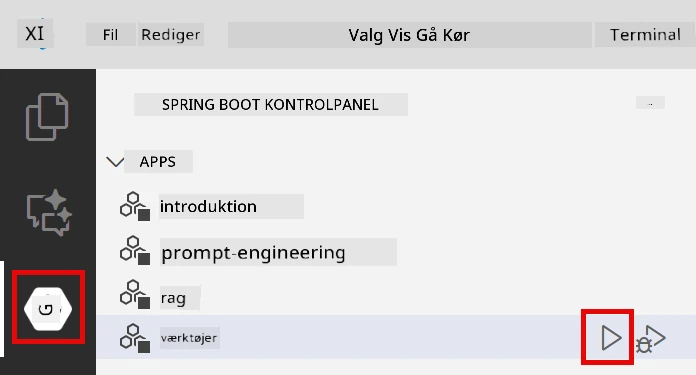
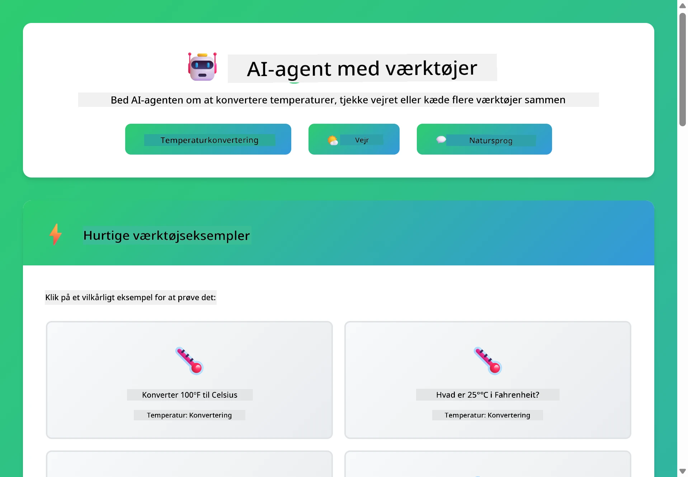
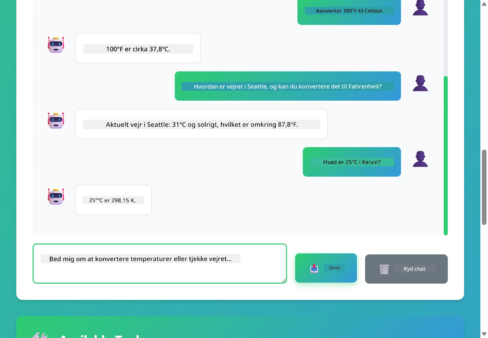

# Modul 04: AI-agenter med værktøjer

## Indholdsfortegnelse

- [Video Gennemgang](#video-gennemgang)
- [Hvad Du Vil Lære](#hvad-du-vil-lære)
- [Forudsætninger](#forudsætninger)
- [Forståelse af AI-agenter med værktøjer](#forståelse-af-ai-agenter-med-værktøjer)
- [Hvordan værktøjskald fungerer](#hvordan-værktøjskald-fungerer)
  - [Værktøjsdefinitioner](#værktøjsdefinitioner)
  - [Beslutningstagning](#beslutningstagning)
  - [Eksekvering](#eksekvering)
  - [Svargenerering](#svargenerering)
  - [Arkitektur: Spring Boot Auto-Wiring](#arkitektur-spring-boot-auto-wiring)
- [Værktøjskædning](#værktøjskædning)
- [Kør applikationen](#kør-applikationen)
- [Brug af applikationen](#brug-af-applikationen)
  - [Prøv simpel værktøjsbrug](#prøv-simpel-værktøjsbrug)
  - [Test værktøjskædning](#test-værktøjskædning)
  - [Se samtaleflow](#se-samtaleflow)
  - [Eksperimenter med forskellige forespørgsler](#eksperimenter-med-forskellige-forespørgsler)
- [Nøglebegreber](#nøglebegreber)
  - [ReAct-mønster (Tænkning og Handling)](#react-mønster-tænkning-og-handling)
  - [Værktøjsbeskrivelser betyder noget](#værktøjsbeskrivelser-betyder-noget)
  - [Sessionsstyring](#sessionsstyring)
  - [Fejlhåndtering](#fejlhåndtering)
- [Tilgængelige værktøjer](#tilgængelige-værktøjer)
- [Hvornår man skal bruge værktøjsbaserede agenter](#hvornår-man-skal-bruge-værktøjsbaserede-agenter)
- [Værktøjer vs RAG](#værktøjer-vs-rag)
- [Næste skridt](#næste-skridt)

## Video Gennemgang

Se denne live session, som forklarer, hvordan man kommer i gang med dette modul:

<a href="https://www.youtube.com/watch?v=O_J30kZc0rw"></a>

## Hvad Du Vil Lære

Indtil videre har du lært, hvordan man har samtaler med AI, strukturerer prompts effektivt og forankrer svar i dine dokumenter. Men der er stadig en grundlæggende begrænsning: sprogmodeller kan kun generere tekst. De kan ikke tjekke vejret, udføre beregninger, spørge databaser eller interagere med eksterne systemer.

Værktøjer ændrer dette. Ved at give modellen adgang til funktioner, den kan kalde, forvandler du den fra en tekstgenerator til en agent, der kan udføre handlinger. Modellen beslutter, hvornår den har brug for et værktøj, hvilket værktøj den skal bruge, og hvilke parametre den skal sende. Din kode eksekverer funktionen og returnerer resultatet. Modellen indarbejder det resultat i sit svar.

## Forudsætninger

- Færdiggjort [Modul 01 - Introduktion](../01-introduction/README.md) (Azure OpenAI ressourcer deployeret)
- Tidligere moduler anbefales færdiggjort (dette modul refererer til [RAG-konceptet fra Modul 03](../03-rag/README.md) i sammenligningen Værktøjer vs RAG)
- `.env` fil i rodkataloget med Azure legitimationsoplysninger (oprettet af `azd up` i Modul 01)

> **Note:** Hvis du ikke har færdiggjort Modul 01, så følg først deploymentsinstruktionerne der.

## Forståelse af AI-agenter med værktøjer

> **📝 Note:** Udtrykket "agenter" i dette modul henviser til AI-assistenter, som er forbedret med evnen til at kalde værktøjer. Dette adskiller sig fra **Agentic AI** mønstrene (autonome agenter med planlægning, hukommelse og flerstegs ræsonnering), som vi vil dække i [Modul 05: MCP](../05-mcp/README.md).

Uden værktøjer kan en sprogmodel kun generere tekst ud fra sine træningsdata. Spørger du om vejret, må den gætte. Giv den værktøjer, og den kan kalde en vejrudsigts-API, udføre beregninger eller spørge en database — og derefter flette de faktiske resultater ind i sit svar.


*Uden værktøjer kan modellen kun gætte — med værktøjer kan den kalde API’er, udføre beregninger og returnere realtidsdata.*

En AI-agent med værktøjer følger et **Reasoning and Acting (ReAct)** mønster. Modellen responderer ikke bare — den tænker over, hvad den har brug for, handler ved at kalde et værktøj, observerer resultatet, og beslutter så, om den skal handle igen eller levere det endelige svar:

1. **Ræsonnere** — Agenten analyserer brugerens spørgsmål og bestemmer, hvilken information den har brug for
2. **Handle** — Agenten vælger det rigtige værktøj, genererer de korrekte parametre og kalder det
3. **Observere** — Agenten modtager værktøjets output og evaluerer resultatet
4. **Gentage eller svare** — Hvis der er brug for mere data, gentager agenten; ellers formulerer den et naturligt sprog svar


*ReAct-cyklussen — agenten ræsonnerer om, hvad den skal gøre, handler ved at kalde et værktøj, observerer resultatet, og gentager indtil det kan levere det endelige svar.*

Dette sker automatisk. Du definerer værktøjerne og deres beskrivelser. Modellen håndterer beslutningen om, hvornår og hvordan de skal bruges.

## Hvordan værktøjskald fungerer

### Værktøjsdefinitioner

[WeatherTool.java](../../../04-tools/src/main/java/com/example/langchain4j/agents/tools/WeatherTool.java) | [TemperatureTool.java](../../../04-tools/src/main/java/com/example/langchain4j/agents/tools/TemperatureTool.java)

Du definerer funktioner med klare beskrivelser og parametrespecifikationer. Modellen ser disse beskrivelser i sit system-prompt og forstår, hvad hvert værktøj gør.

```java
@Component
public class WeatherTool {
    
    @Tool("Get the current weather for a location")
    public String getCurrentWeather(@P("Location name") String location) {
        // Din logik til vejropslag
        return "Weather in " + location + ": 22°C, cloudy";
    }
}

@AiService
public interface Assistant {
    String chat(@MemoryId String sessionId, @UserMessage String message);
}

// Assistenten er automatisk forbundet af Spring Boot med:
// - ChatModel bean
// - Alle @Tool metoder fra @Component klasser
// - ChatMemoryProvider til sessionhåndtering
```

Diagrammet nedenfor gennemgår hver annotation og viser, hvordan hver del hjælper AI med at forstå, hvornår den skal kalde værktøjet, og hvilke argumenter den skal sende:


*Anatomi af en værktøjsdefinition — @Tool fortæller AI, hvornår den skal bruge det, @P beskriver hver parameter, og @AiService samler det hele ved opstart.*

> **🤖 Prøv med [GitHub Copilot](https://github.com/features/copilot) Chat:** Åbn [`WeatherTool.java`](../../../04-tools/src/main/java/com/example/langchain4j/agents/tools/WeatherTool.java) og spørg:
> - "Hvordan integrerer jeg en rigtig vejrudsigts-API som OpenWeatherMap i stedet for mock-data?"
> - "Hvad gør en god værktøjsbeskrivelse, som hjælper AI med at bruge det korrekt?"
> - "Hvordan håndterer jeg API-fejl og rate limits i værktøjsimplementeringer?"

### Beslutningstagning

Når en bruger spørger "Hvordan er vejret i Seattle?", vælger modellen ikke tilfældigt et værktøj. Den sammenligner brugerens intention med hver værktøjsbeskrivelse, den har adgang til, vurderer relevansen af hver, og vælger det bedste match. Den genererer derefter et struktureret funktionskald med de rigtige parametre — i dette tilfælde `location` sat til `"Seattle"`.

Hvis intet værktøj matcher brugerens forespørgsel, falder modellen tilbage og svarer ud fra sin egen viden. Hvis flere værktøjer matcher, vælger den det mest specifikke.


*Modellen evaluerer hvert tilgængeligt værktøj mod brugerens intention og vælger det bedste match — derfor er klare og specifikke værktøjsbeskrivelser vigtige.*

### Eksekvering

[AgentService.java](../../../04-tools/src/main/java/com/example/langchain4j/agents/service/AgentService.java)

Spring Boot auto-wirer det deklarative `@AiService` interface med alle registrerede værktøjer, og LangChain4j eksekverer værktøjskald automatisk. Bag scenen flyder en komplet værktøjskaldproces gennem seks faser — fra brugerens spørgsmål i naturligt sprog hele vejen tilbage til et naturligt sprog svar:


*Den end-to-end flow — brugeren stiller et spørgsmål, modellen vælger et værktøj, LangChain4j udfører det, og modellen fletter resultatet ind i et naturligt svar.*

Bag scenen kører `AiServices` den samme værktøjskaldsløkke for ethvert værktøj — her illustreret med en simpel `Calculator`. Sekvensdiagrammet nedenfor viser præcis, hvad der sker under motorhjelmen:


*Værktøjskaldsløkken — `AiServices` sender din besked og værktøjsskemaer til LLM, LLM svarer med et funktionskald som `add(42, 58)`, LangChain4j udfører `Calculator` metoden lokalt, og sender resultatet tilbage til det endelige svar.*

> **🤖 Prøv med [GitHub Copilot](https://github.com/features/copilot) Chat:** Åbn [`AgentService.java`](../../../04-tools/src/main/java/com/example/langchain4j/agents/service/AgentService.java) og spørg:
> - "Hvordan fungerer ReAct-mønsteret og hvorfor er det effektivt for AI-agenter?"
> - "Hvordan beslutter agenten, hvilket værktøj der skal bruges og i hvilken rækkefølge?"
> - "Hvad sker der, hvis et værktøjseksekvering fejler - hvordan håndterer jeg fejl robust?"

### Svargenerering

Modellen modtager vejrudsigtsdataene og formaterer det til et svar i naturligt sprog til brugeren.

### Arkitektur: Spring Boot Auto-Wiring

Dette modul bruger LangChain4j’s Spring Boot integration med deklarative `@AiService` interfaces. Ved opstart opdager Spring Boot alle `@Component` der indeholder `@Tool` metoder, din `ChatModel` bean og `ChatMemoryProvider` — og kobler dem alle sammen i et enkelt `Assistant` interface uden nogen form for boilerplate.


*@AiService interfacet samler ChatModel, værktøjskomponenter og hukommelsesprovider — Spring Boot håndterer al wiring automatisk.*

Her er hele forespørgselslivscyklussen som sekvensdiagram — fra HTTP-forespørgslen via controller, service og auto-wired proxy, hele vejen til værktøjseksekvering og tilbage:


*Den komplette Spring Boot forespørgselslivscyklus — HTTP-forespørgslen flyder gennem controller og service til den auto-wired Assistant proxy, som orkestrerer LLM og værktøjskald automatisk.*

Vigtige fordele ved denne tilgang:

- **Spring Boot auto-wiring** — ChatModel og værktøjer injiceres automatisk
- **@MemoryId mønster** — Automatisk sessionsbaseret hukommelsesstyring
- **Enkelt instans** — Assistant oprettes én gang og genbruges for bedre ydeevne
- **Typesikker eksekvering** — Java-metoder kaldes direkte med typekonvertering
- **Multi-turn orkestrering** — Håndterer værktøjskædning automatisk
- **Ingen boilerplate** — Ingen manuelle `AiServices.builder()` kald eller hukommelses HashMap

Alternative tilgange (manuelt `AiServices.builder()`) kræver mere kode og mangler Spring Boot integrationsfordelene.

## Værktøjskædning

**Værktøjskædning** — Den reelle styrke ved værktøjsbaserede agenter viser sig, når et enkelt spørgsmål kræver flere værktøjer. Spørg "Hvordan er vejret i Seattle i Fahrenheit?" og agenten kæder automatisk to værktøjer sammen: først kaldes `getCurrentWeather` for at hente temperaturen i Celsius, derefter sendes den værdi til `celsiusToFahrenheit` for konvertering — alt i én samtalerunde.


*Værktøjskædning i praksis — agenten kalder først getCurrentWeather, sender derefter Celsius-resultatet til celsiusToFahrenheit og leverer et kombineret svar.*

**Gracieuze fejl** — Spørg efter vejret i en by der ikke findes i mock-dataene. Værktøjet returnerer en fejlmeddelelse, og AI forklarer, at det ikke kan hjælpe fremfor at crashe. Værktøjer fejler sikkert. Diagrammet nedenfor kontrasterer de to tilgange — med korrekt fejlhåndtering fanger agenten undtagelsen og svarer hjælpsomt, uden fejlhåndtering crasher hele applikationen:


*Når et værktøj fejler, fanger agenten fejlen og svarer med en hjælpsom forklaring i stedet for at crashe.*

Dette sker i en enkelt samtalerunde. Agenten orkestrerer flere værktøjskald autonomt.

## Kør applikationen

**Verificer deployment:**

Sørg for, at `.env` filen findes i rodkataloget med Azure legitimationsoplysninger (oprettet under Modul 01). Kør dette fra modulkataloget (`04-tools/`):

**Bash:**
```bash
cat ../.env  # Skal vise AZURE_OPENAI_ENDPOINT, API_KEY, DEPLOYMENT
```

**PowerShell:**
```powershell
Get-Content ..\.env  # Skal vise AZURE_OPENAI_ENDPOINT, API_KEY, DEPLOYMENT
```

**Start applikationen:**

> **Note:** Hvis du allerede har startet alle applikationer med `./start-all.sh` fra rodkataloget (som beskrevet i Modul 01), kører dette modul allerede på port 8084. Du kan springe startkommandoerne nedenfor over og gå direkte til http://localhost:8084.

**Mulighed 1: Brug Spring Boot Dashboard (anbefales til VS Code-brugere)**

Dev containeren inkluderer Spring Boot Dashboard udvidelsen, som giver en visuel brugerflade til at styre alle Spring Boot applikationer. Du kan finde den i Aktivitetslinjen til venstre i VS Code (se efter Spring Boot ikonet).

Fra Spring Boot Dashboard kan du:
- Se alle tilgængelige Spring Boot applikationer i workspace
- Starte/stoppe applikationer med ét klik
- Se applikationslogs i realtid
- Overvåge applikationens status

Klik blot på afspilningsknappen ved siden af "tools" for at starte dette modul, eller start alle moduler på én gang.

Sådan ser Spring Boot Dashboard ud i VS Code:


*Spring Boot-dashboardet i VS Code — start, stop og overvåg alle moduler ét sted*

**Mulighed 2: Brug af shell-scripts**

Start alle webapplikationer (moduler 01-04):

**Bash:**
```bash
cd ..  # Fra rodkatalog
./start-all.sh
```

**PowerShell:**
```powershell
cd ..  # Fra rodmappen
.\start-all.ps1
```

Eller start kun denne modul:

**Bash:**
```bash
cd 04-tools
./start.sh
```

**PowerShell:**
```powershell
cd 04-tools
.\start.ps1
```

Begge scripts indlæser automatisk miljøvariable fra rod-`.env`-filen og vil bygge JAR-filerne, hvis de ikke findes.

> **Note:** Hvis du foretrækker at bygge alle moduler manuelt før start:
>
> **Bash:**
> ```bash
> cd ..  # Go to root directory
> mvn clean package -DskipTests
> ```
>
> **PowerShell:**
> ```powershell
> cd ..  # Go to root directory
> mvn clean package -DskipTests
> ```

Åbn http://localhost:8084 i din browser.

**For at stoppe:**

**Bash:**
```bash
./stop.sh  # Kun denne modul
# Eller
cd .. && ./stop-all.sh  # Alle moduler
```

**PowerShell:**
```powershell
.\stop.ps1  # Kun denne modul
# Eller
cd ..; .\stop-all.ps1  # Alle moduler
```

## Brug af applikationen

Applikationen tilbyder en webgrænseflade, hvor du kan interagere med en AI-agent, der har adgang til vejr- og temperaturkonverteringsværktøjer. Sådan ser grænsefladen ud — den inkluderer hurtigstart-eksempler og en chatpanel til at sende forespørgsler:

<a href="images/tools-homepage.png"></a>

*AI Agent Tools-grænsefladen - hurtige eksempler og chatinterface til interaktion med værktøjer*

### Prøv simpel brug af værktøjer

Start med en enkel forespørgsel: "Konvertér 100 grader Fahrenheit til Celsius". Agenten genkender, at den skal bruge temperaturkonverteringsværktøjet, kalder det med de rette parametre og returnerer resultatet. Bemærk, hvor naturligt det føles – du specificerede ikke hvilket værktøj, der skulle bruges, eller hvordan det skulle kaldes.

### Test værktøjskædning

Prøv nu noget mere komplekst: "Hvordan er vejret i Seattle, og konvertér det til Fahrenheit?" Se agenten arbejde i trin. Den henter først vejret (som returnerer Celsius), genkender, at den skal konvertere til Fahrenheit, kalder konverteringsværktøjet og kombinerer begge resultater til ét svar.

### Se samtaleflow

Chatinterfacet gemmer samtalehistorik, så du kan have flertrinsinteraktioner. Du kan se alle tidligere forespørgsler og svar, hvilket gør det let at følge samtalen og forstå, hvordan agenten opbygger kontekst gennem flere udvekslinger.

<a href="images/tools-conversation-demo.png"></a>

*Flertrins-samtale som viser simple konverteringer, vejropslag og værktøjskædning*

### Eksperimenter med forskellige forespørgsler

Prøv forskellige kombinationer:
- Vejropslag: "Hvordan er vejret i Tokyo?"
- Temperaturkonverteringer: "Hvad er 25°C i Kelvin?"
- Kombinerede forespørgsler: "Tjek vejret i Paris og fortæl mig, om det er over 20°C"

Bemærk, hvordan agenten fortolker naturligt sprog og omformer det til passende værktøjskald.

## Nøglebegreber

### ReAct-mønster (Resonnering og Handling)

Agenten skifter mellem resonnering (beslutte hvad der skal gøres) og handling (bruge værktøjer). Dette mønster muliggør autonom problemløsning i stedet for blot at svare på instruktioner.

### Værktøjsbeskrivelser er vigtige

Kvaliteten af dine værktøjsbeskrivelser påvirker direkte, hvor godt agenten bruger dem. Klare og præcise beskrivelser hjælper modellen med at forstå, hvornår og hvordan hvert værktøj skal kaldes.

### Sessionsstyring

`@MemoryId`-annoteringen muliggør automatisk sessionbaseret hukommelsesstyring. Hvert sessions-ID får sin egen `ChatMemory`-instans, der håndteres af `ChatMemoryProvider`-bean'en, så flere brugere kan interagere med agenten samtidigt uden at deres samtaler blandes sammen. Følgende diagram viser, hvordan flere brugere dirigeres til isolerede hukommelseslager baseret på deres sessions-ID'er:


*Hvert sessions-ID svarer til en isoleret samtalehistorik — brugere ser aldrig hinandens beskeder.*

### Fejlhåndtering

Værktøjer kan fejle — API'er kan timeout'e, parametre kan være ugyldige, eksterne tjenester kan gå ned. Produktionsagenter har brug for fejlhåndtering, så modellen kan forklare problemer eller prøve alternativer i stedet for at få hele applikationen til at crashe. Når et værktøj kaster en undtagelse, fanger LangChain4j den og sender fejlbeskeden tilbage til modellen, som så kan forklare problemet i naturligt sprog.

## Tilgængelige værktøjer

Diagrammet nedenfor viser det brede økosystem af værktøjer, du kan bygge. Denne modul demonstrerer vejrudsigts- og temperaturværktøjer, men det samme `@Tool`-mønster fungerer for enhver Java-metode — fra databaseforespørgsler til betalingsbehandling.


*Enhver Java-metode annoteret med @Tool bliver tilgængelig for AI — mønsteret rækker til databaser, API'er, e-mail, filoperationer og meget mere.*

## Hvornår skal man bruge værktøjsbaserede agenter

Ikke alle forespørgsler kræver værktøjer. Beslutningen afhænger af, om AI'en skal interagere med eksterne systemer eller kan svare ud fra sin egen viden. Følgende guide opsummerer, hvornår værktøjer tilfører værdi, og hvornår de ikke er nødvendige:


*En hurtig beslutningsguide — værktøjer er til realtidsdata, beregninger og handlinger; generel viden og kreative opgaver behøver dem ikke.*

## Værktøjer vs RAG

Moduler 03 og 04 udvider begge AI'ens kapacitet, men på fundamentalt forskellige måder. RAG giver modellen adgang til **viden** ved at hente dokumenter. Værktøjer giver modellen mulighed for at udføre **handlinger** ved at kalde funktioner. Diagrammet nedenfor sammenligner disse to tilgange side om side — fra hvordan hver workflow fungerer til afvejningerne mellem dem:


*RAG henter information fra statiske dokumenter — Værktøjer udfører handlinger og henter dynamiske, realtidsdata. Mange produktionssystemer kombinerer begge.*

I praksis kombinerer mange produktionssystemer begge tilgange: RAG til at forankre svar i din dokumentation og Værktøjer til at hente live-data eller udføre operationer.

## Næste skridt

**Næste modul:** [05-mcp - Model Context Protocol (MCP)](../05-mcp/README.md)

---

**Navigation:** [← Forrige: Modul 03 - RAG](../03-rag/README.md) | [Tilbage til hoved](../README.md) | [Næste: Modul 05 - MCP →](../05-mcp/README.md)

---

<!-- CO-OP TRANSLATOR DISCLAIMER START -->
**Ansvarsfraskrivelse**:
Dette dokument er blevet oversat ved hjælp af AI-oversættelsestjenesten [Co-op Translator](https://github.com/Azure/co-op-translator). Selvom vi bestræber os på nøjagtighed, skal du være opmærksom på, at automatiserede oversættelser kan indeholde fejl eller unøjagtigheder. Det originale dokument på dets oprindelige sprog bør betragtes som den autoritative kilde. For kritisk information anbefales professionel menneskelig oversættelse. Vi påtager os intet ansvar for misforståelser eller fejltolkninger, der opstår som følge af brugen af denne oversættelse.
<!-- CO-OP TRANSLATOR DISCLAIMER END -->