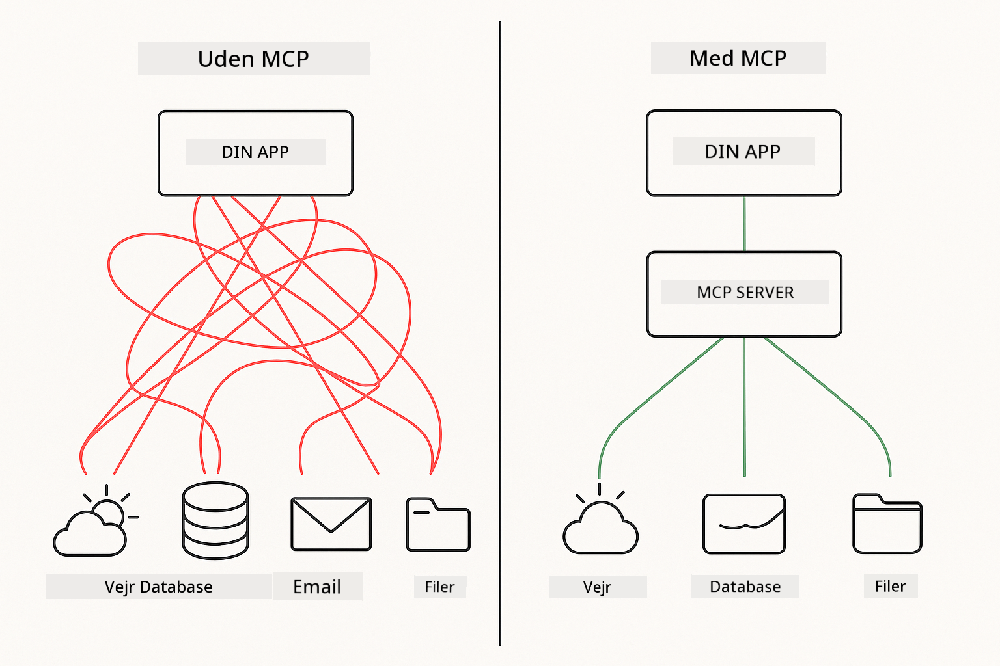
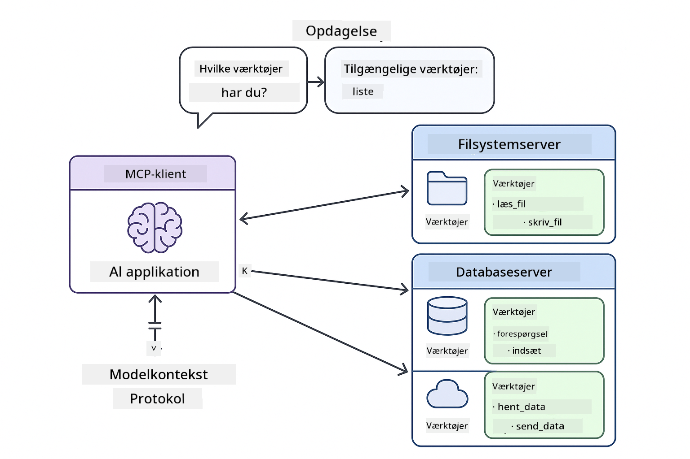

<!--
CO_OP_TRANSLATOR_METADATA:
{
  "original_hash": "c25ec1f10ef156c53e190cdf8b0711ab",
  "translation_date": "2025-12-13T17:55:26+00:00",
  "source_file": "05-mcp/README.md",
  "language_code": "da"
}
-->
# Modul 05: Model Context Protocol (MCP)

## Indholdsfortegnelse

- [Hvad du vil lære](../../../05-mcp)
- [Forstå MCP](../../../05-mcp)
- [Hvordan MCP fungerer](../../../05-mcp)
  - [Server-klient arkitektur](../../../05-mcp)
  - [Værktøjsopdagelse](../../../05-mcp)
  - [Transportmekanismer](../../../05-mcp)
- [Forudsætninger](../../../05-mcp)
- [Hvad dette modul dækker](../../../05-mcp)
- [Hurtig start](../../../05-mcp)
  - [Eksempel 1: Fjernregner (Streamable HTTP)](../../../05-mcp)
  - [Eksempel 2: Filoperationer (Stdio)](../../../05-mcp)
  - [Eksempel 3: Git-analyse (Docker)](../../../05-mcp)
- [Nøglebegreber](../../../05-mcp)
  - [Transportvalg](../../../05-mcp)
  - [Værktøjsopdagelse](../../../05-mcp)
  - [Sessionsstyring](../../../05-mcp)
  - [Tværplatformsovervejelser](../../../05-mcp)
- [Hvornår man skal bruge MCP](../../../05-mcp)
- [MCP-økosystem](../../../05-mcp)
- [Tillykke!](../../../05-mcp)
  - [Hvad er det næste?](../../../05-mcp)
- [Fejlfinding](../../../05-mcp)

## Hvad du vil lære

Du har bygget konversationel AI, mestret prompts, forankret svar i dokumenter og skabt agenter med værktøjer. Men alle disse værktøjer var specialbygget til din specifikke applikation. Hvad nu hvis du kunne give din AI adgang til et standardiseret økosystem af værktøjer, som alle kan skabe og dele?

Model Context Protocol (MCP) giver præcis det - en standard måde for AI-applikationer at opdage og bruge eksterne værktøjer på. I stedet for at skrive specialintegrationer for hver datakilde eller service, forbinder du til MCP-servere, der eksponerer deres kapaciteter i et ensartet format. Din AI-agent kan så automatisk opdage og bruge disse værktøjer.



*Før MCP: Komplekse punkt-til-punkt integrationer. Efter MCP: Én protokol, uendelige muligheder.*

## Forstå MCP

MCP løser et grundlæggende problem i AI-udvikling: hver integration er specialbygget. Vil du tilgå GitHub? Specialkode. Vil du læse filer? Specialkode. Vil du forespørge en database? Specialkode. Og ingen af disse integrationer virker med andre AI-applikationer.

MCP standardiserer dette. En MCP-server eksponerer værktøjer med klare beskrivelser og skemaer. Enhver MCP-klient kan forbinde, opdage tilgængelige værktøjer og bruge dem. Byg én gang, brug overalt.



*Model Context Protocol arkitektur - standardiseret værktøjsopdagelse og udførelse*

## Hvordan MCP fungerer

**Server-klient arkitektur**

MCP bruger en klient-server model. Servere leverer værktøjer - læser filer, forespørger databaser, kalder API'er. Klienter (din AI-applikation) forbinder til servere og bruger deres værktøjer.

**Værktøjsopdagelse**

Når din klient forbinder til en MCP-server, spørger den "Hvilke værktøjer har du?" Serveren svarer med en liste over tilgængelige værktøjer, hver med beskrivelser og parameterskemaer. Din AI-agent kan så beslutte, hvilke værktøjer der skal bruges baseret på brugerens forespørgsler.

**Transportmekanismer**

MCP definerer to transportmekanismer: HTTP for fjernservere, Stdio for lokale processer (inklusive Docker-containere):


*MCP transportmekanismer: HTTP for fjernservere, Stdio for lokale processer (inklusive Docker-containere)*

**Streamable HTTP** - [StreamableHttpDemo.java](../../../05-mcp/src/main/java/com/example/langchain4j/mcp/StreamableHttpDemo.java)

For fjernservere. Din applikation laver HTTP-forespørgsler til en server, der kører et sted på netværket. Bruger Server-Sent Events til realtidskommunikation.

```java
McpTransport httpTransport = new StreamableHttpMcpTransport.Builder()
    .url("http://localhost:3001/mcp")
    .timeout(Duration.ofSeconds(60))
    .logRequests(true)
    .logResponses(true)
    .build();
```

> **🤖 Prøv med [GitHub Copilot](https://github.com/features/copilot) Chat:** Åbn [`StreamableHttpDemo.java`](../../../05-mcp/src/main/java/com/example/langchain4j/mcp/StreamableHttpDemo.java) og spørg:
> - "Hvordan adskiller MCP sig fra direkte værktøjsintegration som i Modul 04?"
> - "Hvad er fordelene ved at bruge MCP til værktøjsdeling på tværs af applikationer?"
> - "Hvordan håndterer jeg forbindelsesfejl eller timeout til MCP-servere?"

**Stdio** - [StdioTransportDemo.java](../../../05-mcp/src/main/java/com/example/langchain4j/mcp/StdioTransportDemo.java)

For lokale processer. Din applikation starter en server som en underproces og kommunikerer via standard input/output. Nyttigt til filsystemadgang eller kommandolinjeværktøjer.

```java
McpTransport stdioTransport = new StdioMcpTransport.Builder()
    .command(List.of(
        npmCmd, "exec",
        "@modelcontextprotocol/server-filesystem@0.6.2",
        resourcesDir
    ))
    .logEvents(false)
    .build();
```

> **🤖 Prøv med [GitHub Copilot](https://github.com/features/copilot) Chat:** Åbn [`StdioTransportDemo.java`](../../../05-mcp/src/main/java/com/example/langchain4j/mcp/StdioTransportDemo.java) og spørg:
> - "Hvordan fungerer Stdio-transport og hvornår skal jeg bruge den i stedet for HTTP?"
> - "Hvordan håndterer LangChain4j livscyklussen for startede MCP-serverprocesser?"
> - "Hvad er sikkerhedsmæssige konsekvenser ved at give AI adgang til filsystemet?"

**Docker (bruger Stdio)** - [GitRepositoryAnalyzer.java](../../../05-mcp/src/main/java/com/example/langchain4j/mcp/GitRepositoryAnalyzer.java)

For containeriserede services. Bruger stdio-transport til at kommunikere med en Docker-container via `docker run`. Godt til komplekse afhængigheder eller isolerede miljøer.

```java
McpTransport dockerTransport = new StdioMcpTransport.Builder()
    .command(List.of(
        "docker", "run",
        "-e", "GITHUB_PERSONAL_ACCESS_TOKEN=" + System.getenv("GITHUB_TOKEN"),
        "-v", volumeMapping,
        "-i", "mcp/git"
    ))
    .logEvents(true)
    .build();
```

> **🤖 Prøv med [GitHub Copilot](https://github.com/features/copilot) Chat:** Åbn [`GitRepositoryAnalyzer.java`](../../../05-mcp/src/main/java/com/example/langchain4j/mcp/GitRepositoryAnalyzer.java) og spørg:
> - "Hvordan isolerer Docker-transport MCP-servere og hvad er fordelene?"
> - "Hvordan konfigurerer jeg volumemonteringer til at dele data mellem vært og MCP-containere?"
> - "Hvad er bedste praksis for håndtering af Docker-baserede MCP-serveres livscyklus i produktion?"

## Kørsel af eksemplerne

### Forudsætninger

- Java 21+, Maven 3.9+
- Node.js 16+ og npm (til MCP-servere)
- **Docker Desktop** - Skal være **KØRENDE** for Eksempel 3 (ikke kun installeret)
- GitHub Personal Access Token konfigureret i `.env` fil (fra Modul 00)

> **Bemærk:** Hvis du ikke har sat din GitHub-token op endnu, se [Modul 00 - Hurtig start](../00-quick-start/README.md) for instruktioner.

> **⚠️ Docker-brugere:** Før du kører Eksempel 3, bekræft at Docker Desktop kører med `docker ps`. Hvis du ser forbindelsesfejl, start Docker Desktop og vent ca. 30 sekunder på initialisering.

## Hurtig start

**Brug af VS Code:** Højreklik blot på en demo-fil i Explorer og vælg **"Run Java"**, eller brug launch-konfigurationerne fra Run and Debug-panelet (sørg for at have tilføjet din token til `.env` filen først).

**Brug af Maven:** Alternativt kan du køre fra kommandolinjen med eksemplerne nedenfor.

**⚠️ Vigtigt:** Nogle eksempler har forudsætninger (som at starte en MCP-server eller bygge Docker-billeder). Tjek hvert eksempels krav før kørsel.

### Eksempel 1: Fjernregner (Streamable HTTP)

Dette demonstrerer netværksbaseret værktøjsintegration.

**⚠️ Forudsætning:** Du skal starte MCP-serveren først (se Terminal 1 nedenfor).

**Terminal 1 - Start MCP-serveren:**

**Bash:**
```bash
git clone https://github.com/modelcontextprotocol/servers.git
cd servers/src/everything
npm install
node dist/streamableHttp.js
```

**PowerShell:**
```powershell
git clone https://github.com/modelcontextprotocol/servers.git
cd servers/src/everything
npm install
node dist/streamableHttp.js
```

**Terminal 2 - Kør eksemplet:**

**Brug af VS Code:** Højreklik på `StreamableHttpDemo.java` og vælg **"Run Java"**.

**Brug af Maven:**

**Bash:**
```bash
export GITHUB_TOKEN=your_token_here
cd 05-mcp
mvn compile exec:java -Dexec.mainClass=com.example.langchain4j.mcp.StreamableHttpDemo
```

**PowerShell:**
```powershell
$env:GITHUB_TOKEN=your_token_here
cd 05-mcp
mvn --% compile exec:java -Dexec.mainClass=com.example.langchain4j.mcp.StreamableHttpDemo
```

Se agenten opdage tilgængelige værktøjer, og brug derefter regneren til at udføre addition.

### Eksempel 2: Filoperationer (Stdio)

Dette demonstrerer lokale underprocesbaserede værktøjer.

**✅ Ingen forudsætninger nødvendige** - MCP-serveren startes automatisk.

**Brug af VS Code:** Højreklik på `StdioTransportDemo.java` og vælg **"Run Java"**.

**Brug af Maven:**

**Bash:**
```bash
export GITHUB_TOKEN=your_token_here
cd 05-mcp
mvn compile exec:java -Dexec.mainClass=com.example.langchain4j.mcp.StdioTransportDemo
```

**PowerShell:**
```powershell
$env:GITHUB_TOKEN=your_token_here
cd 05-mcp
mvn --% compile exec:java -Dexec.mainClass=com.example.langchain4j.mcp.StdioTransportDemo
```

Applikationen starter automatisk en filsystem MCP-server og læser en lokal fil. Bemærk hvordan underprocesstyringen håndteres for dig.

**Forventet output:**
```
Assistant response: The content of the file is "Kaboom!".
```

### Eksempel 3: Git-analyse (Docker)

Dette demonstrerer containeriserede værktøjsservere.

**⚠️ Forudsætninger:** 
1. **Docker Desktop skal være KØRENDE** (ikke kun installeret)
2. **Windows-brugere:** WSL 2-tilstand anbefales (Docker Desktop Indstillinger → Generelt → "Use the WSL 2 based engine"). Hyper-V-tilstand kræver manuel fil-delingskonfiguration.
3. Du skal bygge Docker-billedet først (se Terminal 1 nedenfor)

**Bekræft Docker kører:**

**Bash:**
```bash
docker ps  # Skal vise containerliste, ikke en fejl
```

**PowerShell:**
```powershell
docker ps  # Skal vise containerliste, ikke en fejl
```

Hvis du ser en fejl som "Cannot connect to Docker daemon" eller "The system cannot find the file specified", start Docker Desktop og vent på initialisering (~30 sekunder).

**Fejlfinding:**
- Hvis AI rapporterer et tomt repository eller ingen filer, virker volumemonteringen (`-v`) ikke.
- **Windows Hyper-V brugere:** Tilføj projektmappen til Docker Desktop Indstillinger → Ressourcer → Fil-deling, og genstart Docker Desktop.
- **Anbefalet løsning:** Skift til WSL 2-tilstand for automatisk fil-deling (Indstillinger → Generelt → aktiver "Use the WSL 2 based engine").

**Terminal 1 - Byg Docker-billedet:**

**Bash:**
```bash
cd servers/src/git
docker build -t mcp/git .
```

**PowerShell:**
```powershell
cd servers/src/git
docker build -t mcp/git .
```

**Terminal 2 - Kør analysatoren:**

**Brug af VS Code:** Højreklik på `GitRepositoryAnalyzer.java` og vælg **"Run Java"**.

**Brug af Maven:**

**Bash:**
```bash
export GITHUB_TOKEN=your_token_here
cd 05-mcp
mvn compile exec:java -Dexec.mainClass=com.example.langchain4j.mcp.GitRepositoryAnalyzer
```

**PowerShell:**
```powershell
$env:GITHUB_TOKEN=your_token_here
cd 05-mcp
mvn --% compile exec:java -Dexec.mainClass=com.example.langchain4j.mcp.GitRepositoryAnalyzer
```

Applikationen starter en Docker-container, monterer dit repository og analyserer repository-struktur og indhold via AI-agenten.

## Nøglebegreber

**Transportvalg**

Vælg baseret på hvor dine værktøjer befinder sig:
- Fjernservices → Streamable HTTP
- Lokalt filsystem → Stdio
- Komplekse afhængigheder → Docker

**Værktøjsopdagelse**

MCP-klienter opdager automatisk tilgængelige værktøjer ved forbindelse. Din AI-agent ser værktøjsbeskrivelser og beslutter, hvilke der skal bruges baseret på brugerens anmodning.

**Sessionsstyring**

Streamable HTTP-transport opretholder sessioner, hvilket tillader tilstandshåndtering med fjernservere. Stdio og Docker-transports er typisk statsløse.

**Tværplatformsovervejelser**

Eksemplerne håndterer platformforskelle automatisk (Windows vs Unix kommandoer, sti-konverteringer til Docker). Dette er vigtigt for produktionsudrulninger på tværs af miljøer.

## Hvornår man skal bruge MCP

**Brug MCP når:**
- Du vil udnytte eksisterende værktøjsøkosystemer
- Bygger værktøjer, som flere applikationer skal bruge
- Integrerer tredjepartstjenester med standardprotokoller
- Du skal kunne udskifte værktøjsimplementeringer uden kodeændringer

**Brug specialværktøjer (Modul 04) når:**
- Du bygger applikationsspecifik funktionalitet
- Ydelse er kritisk (MCP tilføjer overhead)
- Dine værktøjer er simple og ikke skal genbruges
- Du har brug for fuld kontrol over udførelsen


## MCP-økosystem

Model Context Protocol er en åben standard med et voksende økosystem:

- Officielle MCP-servere til almindelige opgaver (filsystem, Git, databaser)
- Community-bidragne servere til forskellige services
- Standardiserede værktøjsbeskrivelser og skemaer
- Tvær-ramme kompatibilitet (virker med enhver MCP-klient)

Denne standardisering betyder, at værktøjer bygget til én AI-applikation virker med andre, og skaber et delt økosystem af kapaciteter.

## Tillykke!

Du har gennemført LangChain4j for Beginners kurset. Du har lært:

- Hvordan man bygger konversationel AI med hukommelse (Modul 01)
- Prompt engineering mønstre til forskellige opgaver (Modul 02)
- Forankring af svar i dine dokumenter med RAG (Modul 03)
- Oprettelse af AI-agenter med specialværktøjer (Modul 04)
- Integration af standardiserede værktøjer gennem MCP (Modul 05)

Du har nu fundamentet til at bygge produktionsklare AI-applikationer. De koncepter, du har lært, gælder uanset specifikke frameworks eller modeller - de er grundlæggende mønstre i AI-udvikling.

### Hvad er det næste?

Efter at have gennemført modulerne, udforsk [Testing Guide](../docs/TESTING.md) for at se LangChain4j testkoncepter i praksis.

**Officielle ressourcer:**
- [LangChain4j Dokumentation](https://docs.langchain4j.dev/) - Omfattende guides og API-reference
- [LangChain4j GitHub](https://github.com/langchain4j/langchain4j) - Kildekode og eksempler
- [LangChain4j Tutorials](https://docs.langchain4j.dev/tutorials/) - Trin-for-trin tutorials til forskellige brugsscenarier

Tak fordi du gennemførte dette kursus!

---

**Navigation:** [← Forrige: Modul 04 - Værktøjer](../04-tools/README.md) | [Tilbage til hoved](../README.md)

---

## Fejlfinding

### PowerShell Maven kommando-syntaks
**Problem**: Maven-kommandoer fejler med fejlen `Unknown lifecycle phase ".mainClass=..."`

**Årsag**: PowerShell fortolker `=` som en variabel-tilordningsoperator, hvilket bryder Maven-egenskabssyntaksen

**Løsning**: Brug stop-parsing-operatoren `--%` før Maven-kommandoen:

**PowerShell:**
```powershell
mvn --% compile exec:java -Dexec.mainClass=com.example.langchain4j.mcp.StreamableHttpDemo
```

**Bash:**
```bash
mvn compile exec:java -Dexec.mainClass=com.example.langchain4j.mcp.StreamableHttpDemo
```

`--%`-operatoren fortæller PowerShell at sende alle resterende argumenter bogstaveligt til Maven uden fortolkning.

### Docker-forbindelsesproblemer

**Problem**: Docker-kommandoer fejler med "Cannot connect to Docker daemon" eller "The system cannot find the file specified"

**Årsag**: Docker Desktop kører ikke eller er ikke fuldt initialiseret

**Løsning**: 
1. Start Docker Desktop
2. Vent ca. 30 sekunder på fuld initialisering
3. Bekræft med `docker ps` (bør vise containerliste, ikke en fejl)
4. Kør derefter dit eksempel

### Windows Docker Volume Mounting

**Problem**: Git repository-analyzer rapporterer tomt repository eller ingen filer

**Årsag**: Volume mount (`-v`) virker ikke på grund af fil-delingskonfiguration

**Løsning**:
- **Anbefalet:** Skift til WSL 2-tilstand (Docker Desktop Indstillinger → Generelt → "Use the WSL 2 based engine")
- **Alternativ (Hyper-V):** Tilføj projektmappe til Docker Desktop Indstillinger → Ressourcer → Fil-deling, og genstart derefter Docker Desktop

---

<!-- CO-OP TRANSLATOR DISCLAIMER START -->
**Ansvarsfraskrivelse**:
Dette dokument er blevet oversat ved hjælp af AI-oversættelsestjenesten [Co-op Translator](https://github.com/Azure/co-op-translator). Selvom vi bestræber os på nøjagtighed, bedes du være opmærksom på, at automatiserede oversættelser kan indeholde fejl eller unøjagtigheder. Det oprindelige dokument på dets modersmål bør betragtes som den autoritative kilde. For kritisk information anbefales professionel menneskelig oversættelse. Vi påtager os intet ansvar for misforståelser eller fejltolkninger, der opstår som følge af brugen af denne oversættelse.
<!-- CO-OP TRANSLATOR DISCLAIMER END -->