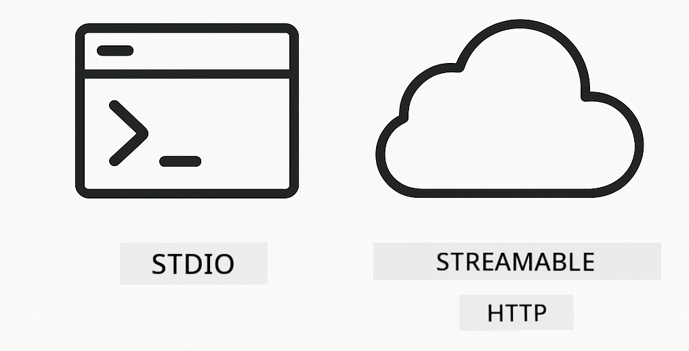
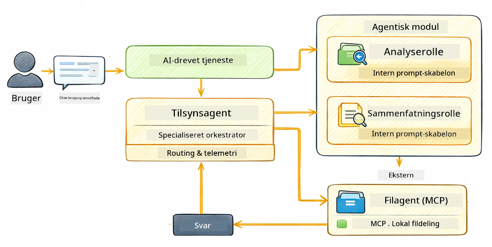

<!--
CO_OP_TRANSLATOR_METADATA:
{
  "original_hash": "6c816d130a1fa47570c11907e72d84ae",
  "translation_date": "2026-01-05T23:46:03+00:00",
  "source_file": "05-mcp/README.md",
  "language_code": "da"
}
-->
# Modul 05: Model Context Protocol (MCP)

## Indholdsfortegnelse

- [Hvad du vil lære](../../../05-mcp)
- [Hvad er MCP?](../../../05-mcp)
- [Hvordan MCP virker](../../../05-mcp)
- [Agentmodulet](../../../05-mcp)
- [Køre eksemplerne](../../../05-mcp)
  - [Forudsætninger](../../../05-mcp)
- [Hurtig start](../../../05-mcp)
  - [Filoperationer (Stdio)](../../../05-mcp)
  - [Supervisor Agent](../../../05-mcp)
    - [Forstå outputtet](../../../05-mcp)
    - [Svarstrategier](../../../05-mcp)
    - [Forklaring af Agentmodulets funktioner](../../../05-mcp)
- [Nøglebegreber](../../../05-mcp)
- [Tillykke!](../../../05-mcp)
  - [Hvad er det næste?](../../../05-mcp)

## Hvad du vil lære

Du har bygget samtale-AI, mestret prompts, forankret svar i dokumenter og oprettet agenter med værktøjer. Men alle de værktøjer var specialbyggede til din specifikke applikation. Hvad nu hvis du kunne give din AI adgang til et standardiseret økosystem af værktøjer, som alle kan skabe og dele? I dette modul lærer du netop det med Model Context Protocol (MCP) og LangChain4js agentmodul. Vi viser først en simpel MCP-fil-læser og derefter, hvordan den nemt integreres i avancerede agent-workflows ved hjælp af Supervisor Agent-mønsteret.

## Hvad er MCP?

Model Context Protocol (MCP) leverer netop det - en standardiseret måde for AI-applikationer at opdage og bruge eksterne værktøjer. I stedet for at skrive brugerdefinerede integrationer for hver datakilde eller service, forbinder du til MCP-servere, der eksponerer deres funktioner i et ensartet format. Din AI-agent kan derefter automatisk opdage og bruge disse værktøjer.


*Før MCP: Komplekse punkt-til-punkt-integrationer. Efter MCP: Én protokol, uendelige muligheder.*

MCP løser et grundlæggende problem i AI-udvikling: hver integration er skræddersyet. Vil du have adgang til GitHub? Specialkode. Vil du læse filer? Specialkode. Vil du forespørge en database? Specialkode. Og ingen af disse integrationer fungerer med andre AI-applikationer.

MCP standardiserer dette. En MCP-server eksponerer værktøjer med klare beskrivelser og skemaer. Enhver MCP-klient kan forbinde, opdage tilgængelige værktøjer og bruge dem. Byg én gang, brug overalt.


*Model Context Protocol-arkitektur - standardiseret opdagelse og udførelse af værktøjer*

## Hvordan MCP virker

**Server-klient-arkitektur**

MCP bruger en klient-server-model. Servere tilbyder værktøjer - læsning af filer, forespørgsler mod databaser, kald af API’er. Klienter (din AI-applikation) forbinder til servere og bruger deres værktøjer.

For at bruge MCP med LangChain4j, tilføj denne Maven-afhængighed:

```xml
<dependency>
    <groupId>dev.langchain4j</groupId>
    <artifactId>langchain4j-mcp</artifactId>
    <version>${langchain4j.version}</version>
</dependency>
```

**Værktøjsopdagelse**

Når din klient forbinder til en MCP-server, spørger den "Hvilke værktøjer har du?" Serveren svarer med en liste over tilgængelige værktøjer, hver med beskrivelser og parametreskemaer. Din AI-agent kan derefter beslutte, hvilke værktøjer der skal bruges baseret på brugerens anmodninger.

**Transportmekanismer**

MCP understøtter forskellige transportmekanismer. Dette modul demonstrerer Stdio-transporten til lokale processer:



*MCP transportmekanismer: HTTP til fjernservere, Stdio til lokale processer*

**Stdio** - [StdioTransportDemo.java](../../../05-mcp/src/main/java/com/example/langchain4j/mcp/StdioTransportDemo.java)

Til lokale processer. Din applikation starter en server som en subprocess og kommunikerer via standard input/output. Nyttigt til filsystemadgang eller kommandolinjeværktøjer.

```java
McpTransport stdioTransport = new StdioMcpTransport.Builder()
    .command(List.of(
        npmCmd, "exec",
        "@modelcontextprotocol/server-filesystem@2025.12.18",
        resourcesDir
    ))
    .logEvents(false)
    .build();
```

> **🤖 Prøv med [GitHub Copilot](https://github.com/features/copilot) Chat:** Åbn [`StdioTransportDemo.java`](../../../05-mcp/src/main/java/com/example/langchain4j/mcp/StdioTransportDemo.java) og spørg:
> - "Hvordan virker Stdio transport, og hvornår skal jeg bruge den i stedet for HTTP?"
> - "Hvordan styres livscyklussen for MCP-serverprocesser med LangChain4j?"
> - "Hvad er sikkerhedsimplikationerne ved at give AI adgang til filsystemet?"

## Agentmodulet

Mens MCP leverer standardiserede værktøjer, tilbyder LangChain4js **agentmodul** en deklarativ måde at bygge agenter, der orkestrerer disse værktøjer. `@Agent`-annotationen og `AgenticServices` lader dig definere agentadfærd gennem interfaces i stedet for imperativ kode.

I dette modul udforsker du **Supervisor Agent**-mønsteret — en avanceret agent-baseret AI-tilgang, hvor en "supervisor"-agent dynamisk beslutter, hvilke under-agenter der skal kaldes baseret på brugerens anmodninger. Vi kombinerer begge koncepter ved at give en af vores under-agenter MCP-drevne filadgangs-muligheder.

For at bruge agentmodulet, tilføj denne Maven-afhængighed:

```xml
<dependency>
    <groupId>dev.langchain4j</groupId>
    <artifactId>langchain4j-agentic</artifactId>
    <version>${langchain4j.mcp.version}</version>
</dependency>
```

> **⚠️ Eksperimentel:** `langchain4j-agentic` modulet er **eksperimentelt** og kan ændres. Den stabile måde at bygge AI-assistenter på er stadig `langchain4j-core` med brugerdefinerede værktøjer (Modul 04).

## Køre eksemplerne

### Forudsætninger

- Java 21+, Maven 3.9+
- Node.js 16+ og npm (til MCP-servere)
- Miljøvariabler konfigureret i `.env` fil (fra rodmappen):
  - `AZURE_OPENAI_ENDPOINT`, `AZURE_OPENAI_API_KEY`, `AZURE_OPENAI_DEPLOYMENT` (samme som Moduler 01-04)

> **Bemærk:** Hvis du ikke har sat dine miljøvariabler op endnu, se [Modul 00 - Hurtig start](../00-quick-start/README.md) for instruktioner, eller kopier `.env.example` til `.env` i rodmappen og udfyld dine værdier.

## Hurtig start

**Ved brug af VS Code:** Højreklik blot på en hvilken som helst demo-fil i Explorer og vælg **"Run Java"**, eller brug launch-konfigurationerne i Run and Debug-panelet (sørg for at have tilføjet din token til `.env` filen først).

**Ved brug af Maven:** Alternativt kan du køre fra kommandolinjen med eksemplerne nedenfor.

### Filoperationer (Stdio)

Dette demonstrerer lokale subprocess-baserede værktøjer.

**✅ Ingen forudsætninger påkrævet** - MCP-serveren startes automatisk.

**Brug Start-scripts (Anbefalet):**

Start-scripts loader automatisk miljøvariabler fra rodens `.env` fil:

**Bash:**
```bash
cd 05-mcp
chmod +x start-stdio.sh
./start-stdio.sh
```

**PowerShell:**
```powershell
cd 05-mcp
.\start-stdio.ps1
```

**Ved brug af VS Code:** Højreklik på `StdioTransportDemo.java` og vælg **"Run Java"** (sørg for, at din `.env` fil er konfigureret).

Applikationen starter automatisk en MCP-server til filsystem og læser en lokal fil. Bemærk, hvordan subprocess-styringen håndteres for dig.

**Forventet output:**
```
Assistant response: The file provides an overview of LangChain4j, an open-source Java library
for integrating Large Language Models (LLMs) into Java applications...
```

### Supervisor Agent

**Supervisor Agent-mønsteret** er en **fleksibel** form for agent-baseret AI. En Supervisor bruger en LLM til autonomt at beslutte, hvilke agenter der skal tilkaldes baseret på brugerens anmodning. I næste eksempel kombinerer vi MCP-drevet filadgang med en LLM-agent for at skabe en overvåget fil-læs → rapport-arbejdsgang.

I demoen læser `FileAgent` en fil ved brug af MCP-filsystemværktøjer, og `ReportAgent` genererer en struktureret rapport med en ledelsesresumé (1 sætning), 3 nøglepunkter og anbefalinger. Supervisor orkestrerer denne proces automatisk:



```
┌─────────────┐      ┌──────────────┐
│  FileAgent  │ ───▶ │ ReportAgent  │
│ (MCP tools) │      │  (pure LLM)  │
└─────────────┘      └──────────────┘
   outputKey:           outputKey:
  'fileContent'         'report'
```

Hver agent gemmer sit output i **Agentic Scope** (delt hukommelse), hvilket tillader efterfølgende agenter at få adgang til tidligere resultater. Dette demonstrerer, hvordan MCP-værktøjer integreres problemfrit i agent-workflows — Supervisor behøver ikke vide *hvordan* filer læses, kun at `FileAgent` kan gøre det.

#### Køre demoen

Start-scripts loader automatisk miljøvariabler fra rodens `.env` fil:

**Bash:**
```bash
cd 05-mcp
chmod +x start-supervisor.sh
./start-supervisor.sh
```

**PowerShell:**
```powershell
cd 05-mcp
.\start-supervisor.ps1
```

**Ved brug af VS Code:** Højreklik på `SupervisorAgentDemo.java` og vælg **"Run Java"** (sørg for, at din `.env` fil er konfigureret).

#### Hvordan Supervisor fungerer

```java
// Trin 1: FileAgent læser filer ved hjælp af MCP-værktøjer
FileAgent fileAgent = AgenticServices.agentBuilder(FileAgent.class)
        .chatModel(model)
        .toolProvider(mcpToolProvider)  // Har MCP-værktøjer til filoperationer
        .build();

// Trin 2: ReportAgent genererer strukturerede rapporter
ReportAgent reportAgent = AgenticServices.agentBuilder(ReportAgent.class)
        .chatModel(model)
        .build();

// Supervisor orkestrerer fil → rapport arbejdsgangen
SupervisorAgent supervisor = AgenticServices.supervisorBuilder()
        .chatModel(model)
        .subAgents(fileAgent, reportAgent)
        .responseStrategy(SupervisorResponseStrategy.LAST)  // Returner den endelige rapport
        .build();

// Supervisor beslutter, hvilke agenter der skal påkaldes baseret på forespørgslen
String response = supervisor.invoke("Read the file at /path/file.txt and generate a report");
```

#### Svarstrategier

Når du konfigurerer en `SupervisorAgent`, angiver du, hvordan den skal formulere sit endelige svar til brugeren, efter under-agenterne har afsluttet deres opgaver. De tilgængelige strategier er:

| Strategi | Beskrivelse |
|----------|-------------|
| **LAST** | Superviseren returnerer outputtet fra den sidste under-agent eller værktøj, der blev kaldt. Dette er nyttigt, når den sidste agent i workflowet er specielt designet til at producere det komplette, endelige svar (f.eks. en "Summary Agent" i en forskningspipeline). |
| **SUMMARY** | Superviseren bruger sin egen interne Language Model (LLM) til at syntetisere et resumé af hele interaktionen og alle under-agenters output, og returnerer så dette resumé som det endelige svar. Dette giver et klart, samlet svar til brugeren. |
| **SCORED** | Systemet bruger en intern LLM til at vurdere både det SIDSTE svar og RESUMÉET af interaktionen mod den oprindelige brugerforespørgsel og returnerer det output, som modtager den højeste score. |

Se [SupervisorAgentDemo.java](../../../05-mcp/src/main/java/com/example/langchain4j/mcp/SupervisorAgentDemo.java) for den komplette implementering.

> **🤖 Prøv med [GitHub Copilot](https://github.com/features/copilot) Chat:** Åbn [`SupervisorAgentDemo.java`](../../../05-mcp/src/main/java/com/example/langchain4j/mcp/SupervisorAgentDemo.java) og spørg:
> - "Hvordan beslutter Supervisor, hvilke agenter der skal kaldes?"
> - "Hvad er forskellen mellem Supervisor og Sequential workflow-mønstre?"
> - "Hvordan kan jeg tilpasse Supervisors planlægningsadfærd?"

#### Forstå outputtet

Når du kører demoen, vil du se en struktureret gennemgang af, hvordan Supervisor orkestrerer flere agenter. Her er hvad hver sektion betyder:

```
======================================================================
  FILE → REPORT WORKFLOW DEMO
======================================================================

This demo shows a clear 2-step workflow: read a file, then generate a report.
The Supervisor orchestrates the agents automatically based on the request.
```

**Overskriften** introducerer workflow-konceptet: en fokuseret pipeline fra fil-læsning til rapportgenerering.

```
--- WORKFLOW ---------------------------------------------------------
  ┌─────────────┐      ┌──────────────┐
  │  FileAgent  │ ───▶ │ ReportAgent  │
  │ (MCP tools) │      │  (pure LLM)  │
  └─────────────┘      └──────────────┘
   outputKey:           outputKey:
   'fileContent'        'report'

--- AVAILABLE AGENTS -------------------------------------------------
  [FILE]   FileAgent   - Reads files via MCP → stores in 'fileContent'
  [REPORT] ReportAgent - Generates structured report → stores in 'report'
```

**Workflow-diagram** viser dataflowet mellem agenter. Hver agent har en specifik rolle:
- **FileAgent** læser filer ved hjælp af MCP-værktøjer og gemmer råt indhold i `fileContent`
- **ReportAgent** bruger det indhold og producerer en struktureret rapport i `report`

```
--- USER REQUEST -----------------------------------------------------
  "Read the file at .../file.txt and generate a report on its contents"
```

**Brugeranmodning** viser opgaven. Superviseren parser dette og beslutter at køre FileAgent → ReportAgent.

```
--- SUPERVISOR ORCHESTRATION -----------------------------------------
  The Supervisor decides which agents to invoke and passes data between them...

  +-- STEP 1: Supervisor chose -> FileAgent (reading file via MCP)
  |
  |   Input: .../file.txt
  |
  |   Result: LangChain4j is an open-source, provider-agnostic Java framework for building LLM...
  +-- [OK] FileAgent (reading file via MCP) completed

  +-- STEP 2: Supervisor chose -> ReportAgent (generating structured report)
  |
  |   Input: LangChain4j is an open-source, provider-agnostic Java framew...
  |
  |   Result: Executive Summary...
  +-- [OK] ReportAgent (generating structured report) completed
```

**Supervisor Orkestrering** viser 2-trinsflowet i aktion:
1. **FileAgent** læser filen via MCP og gemmer indholdet
2. **ReportAgent** modtager indholdet og genererer en struktureret rapport

Superviseren traf disse beslutninger **autonomt** baseret på brugerens anmodning.

```
--- FINAL RESPONSE ---------------------------------------------------
Executive Summary
...

Key Points
...

Recommendations
...

--- AGENTIC SCOPE (Data Flow) ----------------------------------------
  Each agent stores its output for downstream agents to consume:
  * fileContent: LangChain4j is an open-source, provider-agnostic Java framework...
  * report: Executive Summary...
```

#### Forklaring af Agentmodulets funktioner

Eksemplet demonstrerer flere avancerede funktioner i agentmodulet. Lad os se nærmere på Agentic Scope og Agent Listeners.

**Agentic Scope** viser den delte hukommelse, hvor agenter lagrede deres resultater ved hjælp af `@Agent(outputKey="...")`. Dette tillader:
- Senere agenter at få adgang til tidligere agenters output
- Supervisoren at syntetisere et endeligt svar
- Dig at inspicere, hvad hver agent producerede

```java
ResultWithAgenticScope<String> result = supervisor.invokeWithAgenticScope(request);
AgenticScope scope = result.agenticScope();
String fileContent = scope.readState("fileContent");  // Rå fildata fra FileAgent
String report = scope.readState("report");            // Struktureret rapport fra ReportAgent
```

**Agent Listeners** gør det muligt at overvåge og fejlfinde agentudførelse. Det trin-for-trin output, du ser i demoen, kommer fra en AgentListener, der kobler sig på hver agentkald:
- **beforeAgentInvocation** - Kaldes når Supervisoren vælger en agent og lader dig se, hvilken agent der blev valgt og hvorfor
- **afterAgentInvocation** - Kaldes, når en agent er færdig, og viser dens resultat
- **inheritedBySubagents** - Når sand, overvåger den alle agenter i hierarkiet

```java
AgentListener monitor = new AgentListener() {
    private int step = 0;
    
    @Override
    public void beforeAgentInvocation(AgentRequest request) {
        step++;
        System.out.println("  +-- STEP " + step + ": " + request.agentName());
    }
    
    @Override
    public void afterAgentInvocation(AgentResponse response) {
        System.out.println("  +-- [OK] " + response.agentName() + " completed");
    }
    
    @Override
    public boolean inheritedBySubagents() {
        return true; // Spred til alle underagenter
    }
};
```

Ud over Supervisor-mønsteret tilbyder `langchain4j-agentic` modulet flere kraftfulde workflow-mønstre og funktioner:

| Mønster | Beskrivelse | Brugsscenarie |
|---------|-------------|---------------|
| **Sequential** | Udfør agenter i rækkefølge, output flyder til næste | Pipelines: forskning → analyse → rapport |
| **Parallel** | Kør agenter samtidigt | Uafhængige opgaver: vejr + nyheder + aktier |
| **Loop** | Iterer indtil betingelse opfyldt | Kvalitetsvurdering: forfin til score ≥ 0.8 |
| **Conditional** | Rute baseret på betingelser | Klassificer → rute til specialist-agent |
| **Human-in-the-Loop** | Tilføj menneskelige tjekpunkter | Godkendelses-workflows, indholdsrevision |

## Nøglebegreber

Nu hvor du har udforsket MCP og agentmodulet i praksis, lad os opsummere, hvornår du skal bruge hver tilgang.

**MCP** er ideel, når du vil udnytte eksisterende værktøjsøkosystemer, bygge værktøjer som flere applikationer kan dele, integrere tredjepartsservices med standardprotokoller, eller udskifte værktøjsimplementeringer uden at ændre kode.

**Agentmodulet** fungerer bedst, når du ønsker deklarative agentdefinitioner med `@Agent`-annoteringer, har brug for workflow-orkestrering (sekventiel, løkke, parallelt), foretrækker interface-baseret agentdesign frem for imperativ kode, eller kombinerer flere agenter, der deler output via `outputKey`.

**Supervisor Agent-mønsteret** skinner, når workflowet ikke er forudsigeligt på forhånd, og du vil have LLM til at beslutte, når du har flere specialiserede agenter, der har brug for dynamisk orkestrering, når du bygger samtalesystemer, der ruter til forskellige kapaciteter, eller når du ønsker den mest fleksible, adaptive agentadfærd.
## Tillykke!

Du har gennemført LangChain4j for Beginners kurset. Du har lært:

- Hvordan man bygger samtale-AI med hukommelse (Modul 01)
- Prompt engineering-mønstre til forskellige opgaver (Modul 02)
- At forankre svar i dine dokumenter med RAG (Modul 03)
- At skabe grundlæggende AI-agenter (assistenter) med brugerdefinerede værktøjer (Modul 04)
- At integrere standardiserede værktøjer med LangChain4j MCP og Agentic modulerne (Modul 05)

### Hvad nu?

Efter at have gennemført modulerne, udforsk [Testing Guide](../docs/TESTING.md) for at se LangChain4j testkoncepter i praksis.

**Officielle Ressourcer:**
- [LangChain4j Dokumentation](https://docs.langchain4j.dev/) - Omfattende vejledninger og API reference
- [LangChain4j GitHub](https://github.com/langchain4j/langchain4j) - Kildekode og eksempler
- [LangChain4j Tutorials](https://docs.langchain4j.dev/tutorials/) - Trin-for-trin tutorials til forskellige anvendelsestilfælde

Tak fordi du gennemførte dette kursus!

---

**Navigation:** [← Forrige: Modul 04 - Værktøjer](../04-tools/README.md) | [Tilbage til Hoved](../README.md)

---

<!-- CO-OP TRANSLATOR DISCLAIMER START -->
**Ansvarsfraskrivelse**:
Dette dokument er oversat ved hjælp af AI-oversættelsestjenesten [Co-op Translator](https://github.com/Azure/co-op-translator). Selvom vi bestræber os på nøjagtighed, bedes du være opmærksom på, at automatiserede oversættelser kan indeholde fejl eller unøjagtigheder. Det oprindelige dokument på dets oprindelige sprog bør betragtes som den autoritative kilde. For kritiske oplysninger anbefales professionel menneskelig oversættelse. Vi påtager os intet ansvar for misforståelser eller fejltolkninger, der opstår som følge af brugen af denne oversættelse.
<!-- CO-OP TRANSLATOR DISCLAIMER END -->