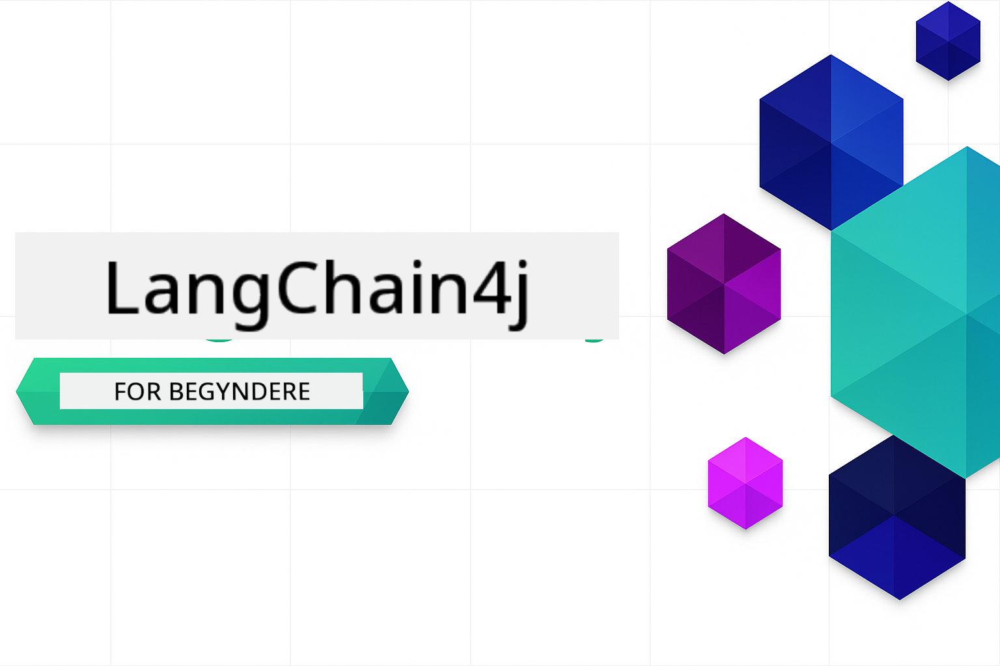

<!--
CO_OP_TRANSLATOR_METADATA:
{
  "original_hash": "8b9c4243c12488872afffa00f0092467",
  "translation_date": "2025-12-15T14:37:55+00:00",
  "source_file": "README.md",
  "language_code": "da"
}
-->

### 🌐 Understøttelse af flere sprog

#### Understøttet via GitHub Action (Automatiseret & Altid Opdateret)

<!-- CO-OP TRANSLATOR LANGUAGES TABLE START -->
[Arabic](../ar/README.md) | [Bengali](../bn/README.md) | [Bulgarian](../bg/README.md) | [Burmese (Myanmar)](../my/README.md) | [Chinese (Simplified)](../zh/README.md) | [Chinese (Traditional, Hong Kong)](../hk/README.md) | [Chinese (Traditional, Macau)](../mo/README.md) | [Chinese (Traditional, Taiwan)](../tw/README.md) | [Croatian](../hr/README.md) | [Czech](../cs/README.md) | [Danish](./README.md) | [Dutch](../nl/README.md) | [Estonian](../et/README.md) | [Finnish](../fi/README.md) | [French](../fr/README.md) | [German](../de/README.md) | [Greek](../el/README.md) | [Hebrew](../he/README.md) | [Hindi](../hi/README.md) | [Hungarian](../hu/README.md) | [Indonesian](../id/README.md) | [Italian](../it/README.md) | [Japanese](../ja/README.md) | [Kannada](../kn/README.md) | [Korean](../ko/README.md) | [Lithuanian](../lt/README.md) | [Malay](../ms/README.md) | [Malayalam](../ml/README.md) | [Marathi](../mr/README.md) | [Nepali](../ne/README.md) | [Nigerian Pidgin](../pcm/README.md) | [Norwegian](../no/README.md) | [Persian (Farsi)](../fa/README.md) | [Polish](../pl/README.md) | [Portuguese (Brazil)](../br/README.md) | [Portuguese (Portugal)](../pt/README.md) | [Punjabi (Gurmukhi)](../pa/README.md) | [Romanian](../ro/README.md) | [Russian](../ru/README.md) | [Serbian (Cyrillic)](../sr/README.md) | [Slovak](../sk/README.md) | [Slovenian](../sl/README.md) | [Spanish](../es/README.md) | [Swahili](../sw/README.md) | [Swedish](../sv/README.md) | [Tagalog (Filipino)](../tl/README.md) | [Tamil](../ta/README.md) | [Telugu](../te/README.md) | [Thai](../th/README.md) | [Turkish](../tr/README.md) | [Ukrainian](../uk/README.md) | [Urdu](../ur/README.md) | [Vietnamese](../vi/README.md)
<!-- CO-OP TRANSLATOR LANGUAGES TABLE END -->

# LangChain4j for Begyndere

Et kursus til at bygge AI-applikationer med LangChain4j og Azure OpenAI GPT-5, fra grundlæggende chat til AI-agenter.

**Ny til LangChain4j?** Se [Glossaret](docs/GLOSSARY.md) for definitioner af nøglebegreber og koncepter.

## Indholdsfortegnelse

1. [Kom godt i gang](00-quick-start/README.md) - Kom i gang med LangChain4j
2. [Introduktion](01-introduction/README.md) - Lær det grundlæggende om LangChain4j
3. [Prompt Engineering](02-prompt-engineering/README.md) - Mestre effektiv promptdesign
4. [RAG (Retrieval-Augmented Generation)](03-rag/README.md) - Byg intelligente vidensbaserede systemer
5. [Værktøjer](04-tools/README.md) - Integrer eksterne værktøjer og API'er med AI-agenter
6. [MCP (Model Context Protocol)](05-mcp/README.md) - Arbejd med Model Context Protocol
---

## Læringssti

Start med modulet [Kom godt i gang](00-quick-start/README.md) og fortsæt gennem hvert modul for at opbygge dine færdigheder trin for trin. Du vil prøve grundlæggende eksempler for at forstå det fundamentale, før du går videre til modulet [Introduktion](01-introduction/README.md) for en dybere gennemgang med GPT-5.

Efter at have gennemført modulerne, kan du udforske [Testvejledningen](docs/TESTING.md) for at se LangChain4j testkoncepter i praksis.

> **Bemærk:** Denne træning bruger både GitHub Models og Azure OpenAI. Modulerne [Kom godt i gang](00-quick-start/README.md) og [MCP](05-mcp/README.md) bruger GitHub Models (ingen Azure-abonnement kræves), mens modulerne 1-4 bruger Azure OpenAI GPT-5.

## Læring med GitHub Copilot

For hurtigt at komme i gang med kodning, åbn dette projekt i en GitHub Codespace eller din lokale IDE med den medfølgende devcontainer. Devcontaineren, der bruges i dette kursus, er forudkonfigureret med GitHub Copilot til AI-parprogrammering.

Hvert kodeeksempel inkluderer foreslåede spørgsmål, du kan stille GitHub Copilot for at uddybe din forståelse. Kig efter 💡/🤖 prompts i:

- **Java-filoverskrifter** - Spørgsmål specifikke for hvert eksempel
- **Modul-README'er** - Udforskningsprompter efter kodeeksempler

**Sådan bruger du det:** Åbn en hvilken som helst kodefil og stil Copilot de foreslåede spørgsmål. Den har fuld kontekst af kodebasen og kan forklare, udvide og foreslå alternativer.

Vil du lære mere? Se [Copilot for AI Paired Programming](https://aka.ms/GitHubCopilotAI).

## Yderligere ressourcer

### LangChain

---

### Azure / Edge / MCP / Agenter

---
 
### Generativ AI-serie

[-9333EA?style=for-the-badge&labelColor=E5E7EB&color=9333EA)](https://github.com/microsoft/Generative-AI-for-beginners-dotnet?WT.mc_id=academic-105485-koreyst)
[-C084FC?style=for-the-badge&labelColor=E5E7EB&color=C084FC)](https://github.com/microsoft/generative-ai-for-beginners-java?WT.mc_id=academic-105485-koreyst)
[-E879F9?style=for-the-badge&labelColor=E5E7EB&color=E879F9)](https://github.com/microsoft/generative-ai-with-javascript?WT.mc_id=academic-105485-koreyst)

---
 
### Kerne-læring

---
 
### Copilot-serie

## Få hjælp

Hvis du sidder fast eller har spørgsmål om at bygge AI-apps, så deltag i:

Hvis du har produktfeedback eller fejl under udvikling, besøg:

## Licens

MIT-licens - Se [LICENSE](../../LICENSE) filen for detaljer.

---

<!-- CO-OP TRANSLATOR DISCLAIMER START -->
**Ansvarsfraskrivelse**:
Dette dokument er blevet oversat ved hjælp af AI-oversættelsestjenesten [Co-op Translator](https://github.com/Azure/co-op-translator). Selvom vi bestræber os på nøjagtighed, bedes du være opmærksom på, at automatiserede oversættelser kan indeholde fejl eller unøjagtigheder. Det oprindelige dokument på dets modersmål bør betragtes som den autoritative kilde. For kritisk information anbefales professionel menneskelig oversættelse. Vi påtager os intet ansvar for misforståelser eller fejltolkninger, der opstår som følge af brugen af denne oversættelse.
<!-- CO-OP TRANSLATOR DISCLAIMER END -->