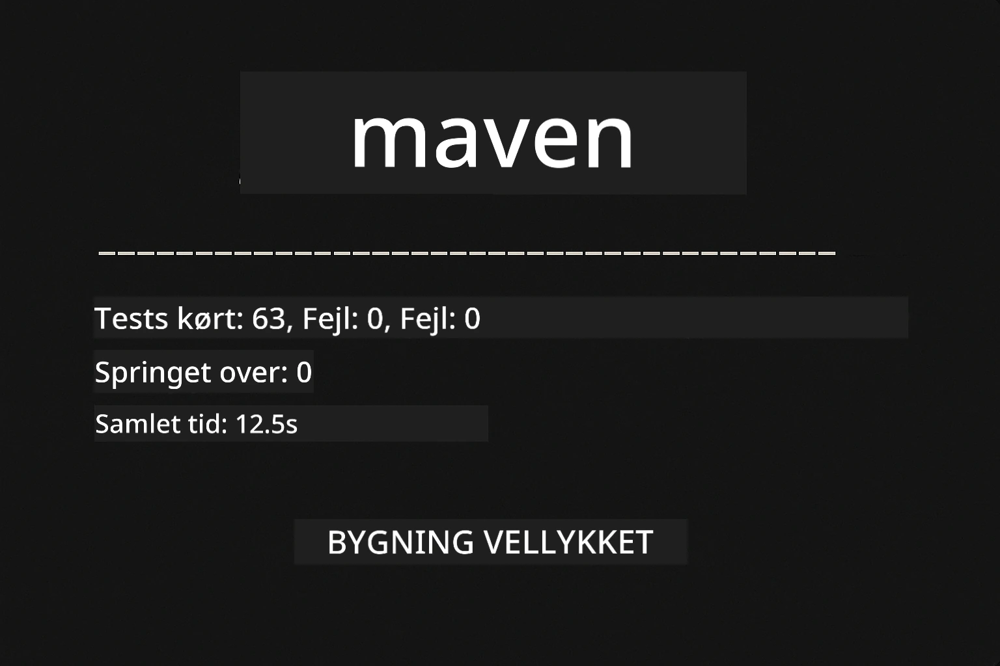
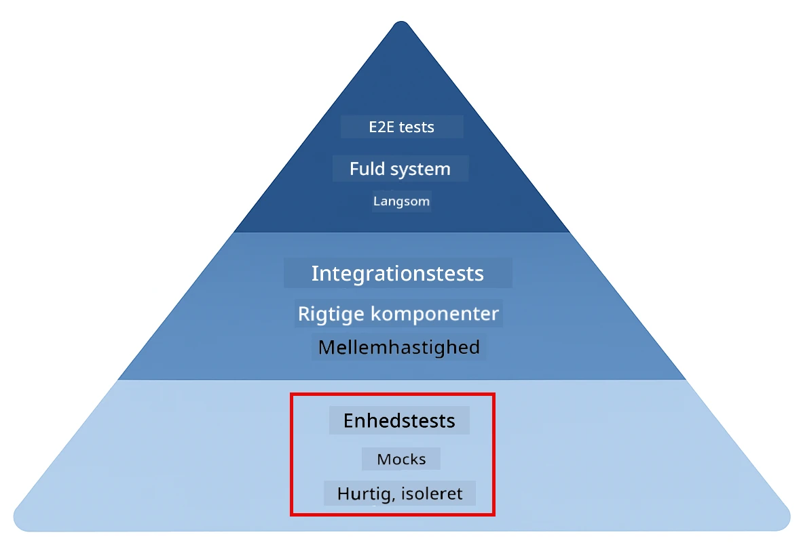
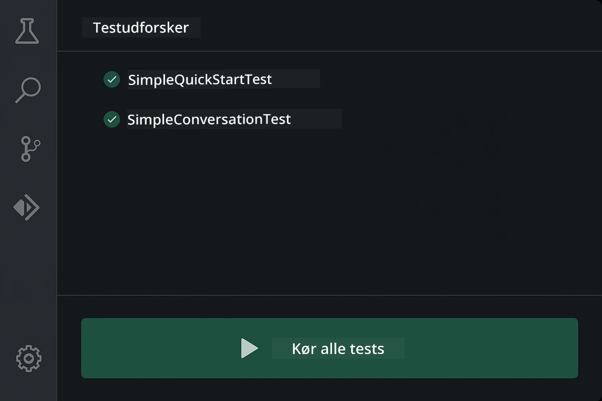
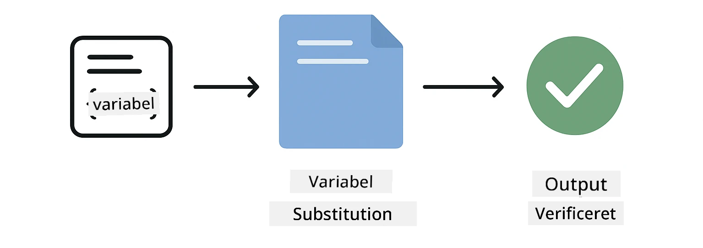
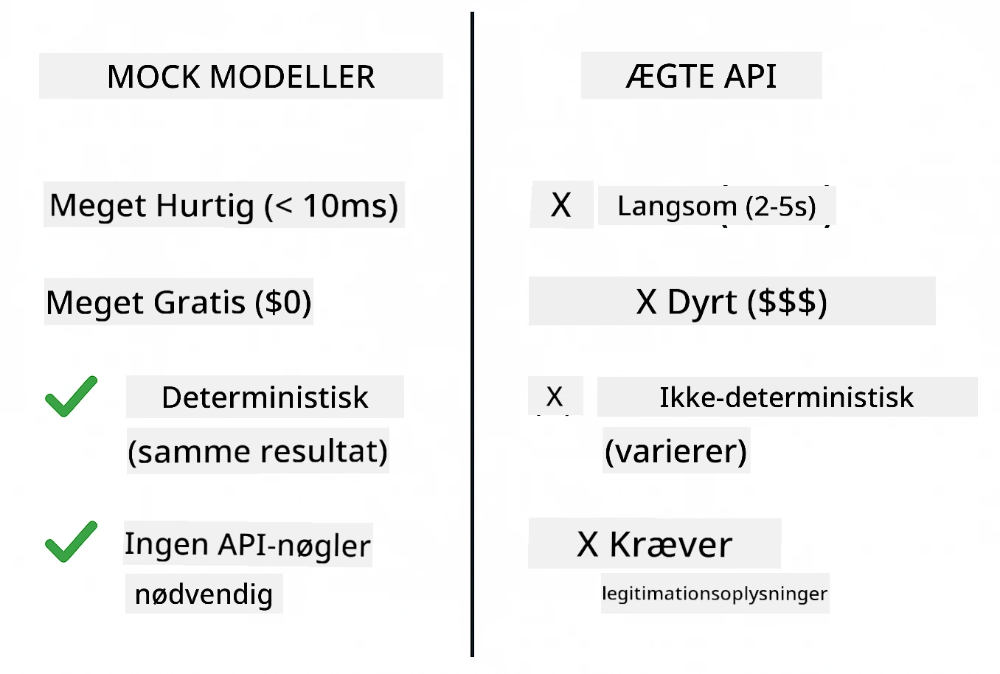
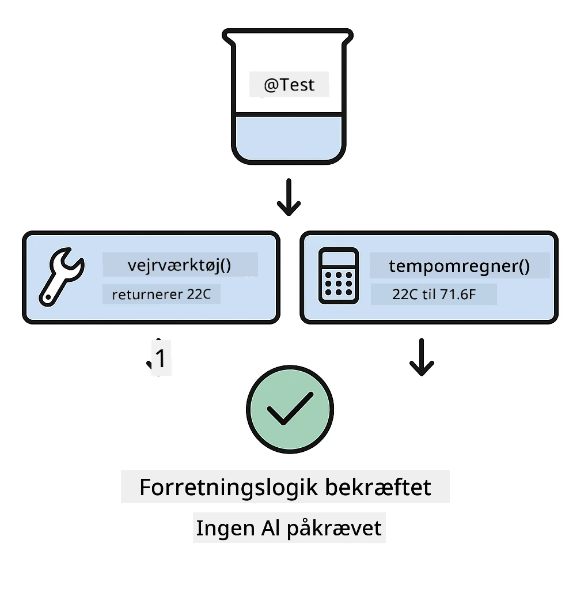
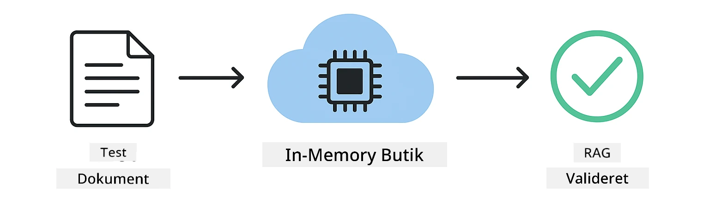

<!--
CO_OP_TRANSLATOR_METADATA:
{
  "original_hash": "ed93b3c14d58734ac10162967da958c1",
  "translation_date": "2025-12-31T01:37:46+00:00",
  "source_file": "docs/TESTING.md",
  "language_code": "da"
}
-->
# Test af LangChain4j-applikationer

## Indholdsfortegnelse

- [Kom hurtigt i gang](../../../docs)
- [Hvad testene dækker](../../../docs)
- [Kør testene](../../../docs)
- [Kør tests i VS Code](../../../docs)
- [Testmønstre](../../../docs)
- [Testfilosofi](../../../docs)
- [Næste skridt](../../../docs)

Denne vejledning fører dig gennem testene, der demonstrerer, hvordan man tester AI-applikationer uden at kræve API-nøgler eller eksterne tjenester.

## Kom hurtigt i gang

Kør alle tests med en enkelt kommando:

**Bash:**
```bash
mvn test
```

**PowerShell:**
```powershell
mvn --% test
```



*Vellykket testkørsel, der viser at alle tests består uden fejl*

## Hvad testene dækker

Dette kursus fokuserer på **enhedstests** der køres lokalt. Hver test demonstrerer et specifikt LangChain4j-koncept i isolation.



*Testpyramide der viser balancen mellem enhedstests (hurtige, isolerede), integrationstests (reelle komponenter) og end-to-end-tests. Denne træning dækker enhedstestning.*

| Modul | Tests | Fokus | Key Files |
|--------|-------|-------|-----------|
| **00 - Kom hurtigt i gang** | 6 | Promptskabeloner og variabelsubstitution | `SimpleQuickStartTest.java` |
| **01 - Introduktion** | 8 | Samtalehukommelse og tilstandsholdende chat | `SimpleConversationTest.java` |
| **02 - Prompt Engineering** | 12 | GPT-5-mønstre, iverniveauer, struktureret output | `SimpleGpt5PromptTest.java` |
| **03 - RAG** | 10 | Dokumentindtagelse, embeddings, likhedssøgning | `DocumentServiceTest.java` |
| **04 - Værktøjer** | 12 | Funktionskald og værktøjskædning | `SimpleToolsTest.java` |
| **05 - MCP** | 8 | Model Context Protocol med stdio-transport | `SimpleMcpTest.java` |

## Kør testene

**Kør alle tests fra roden:**

**Bash:**
```bash
mvn test
```

**PowerShell:**
```powershell
mvn --% test
```

**Kør tests for et specifikt modul:**

**Bash:**
```bash
cd 01-introduction && mvn test
# Eller fra roden
mvn test -pl 01-introduction
```

**PowerShell:**
```powershell
cd 01-introduction; mvn --% test
# Eller fra roden
mvn --% test -pl 01-introduction
```

**Kør en enkelt testklasse:**

**Bash:**
```bash
mvn test -Dtest=SimpleConversationTest
```

**PowerShell:**
```powershell
mvn --% test -Dtest=SimpleConversationTest
```

**Kør en specifik testmetode:**

**Bash:**
```bash
mvn test -Dtest=SimpleConversationTest#børBevareSamtalehistorik
```

**PowerShell:**
```powershell
mvn --% test -Dtest=SimpleConversationTest#bør bevare samtalehistorik
```

## Kør tests i VS Code

Hvis du bruger Visual Studio Code, giver Test Explorer en grafisk grænseflade til at køre og debugge tests.



*VS Code Test Explorer, der viser testtræet med alle Java-testklasser og individuelle testmetoder*

**For at køre tests i VS Code:**

1. Åbn Test Explorer ved at klikke på reagensglasikonet i Activity Bar
2. Udvid testtræet for at se alle moduler og testklasser
3. Klik på afspilningsknappen ved siden af en hvilken som helst test for at køre den individuelt
4. Klik på "Run All Tests" for at udføre hele suiten
5. Højreklik på en test og vælg "Debug Test" for at sætte breakpoints og trinvis køre koden

Test Explorer viser grønne flueben for beståede tests og giver detaljerede fejlmeddelelser, når tests fejler.

## Testmønstre

### Mønster 1: Test af promptskabeloner

Det simpleste mønster tester promptskabeloner uden at kalde nogen AI-model. Du verificerer, at variabelsubstitution fungerer korrekt, og at prompts formateres som forventet.



*Test af promptskabeloner, der viser flowet for variabelsubstitution: skabelon med pladsholdere → værdier anvendt → formateret output verificeret*

```java
@Test
@DisplayName("Should format prompt template with variables")
void testPromptTemplateFormatting() {
    PromptTemplate template = PromptTemplate.from(
        "Best time to visit {{destination}} for {{activity}}?"
    );
    
    Prompt prompt = template.apply(Map.of(
        "destination", "Paris",
        "activity", "sightseeing"
    ));
    
    assertThat(prompt.text()).isEqualTo("Best time to visit Paris for sightseeing?");
}
```

Denne test findes i `00-quick-start/src/test/java/com/example/langchain4j/quickstart/SimpleQuickStartTest.java`.

**Kør den:**

**Bash:**
```bash
cd 00-quick-start && mvn test -Dtest=SimpleQuickStartTest#testPromptSkabelonFormatering
```

**PowerShell:**
```powershell
cd 00-quick-start; mvn --% test -Dtest=SimpleQuickStartTest#test af prompt-skabelonformatering
```

### Mønster 2: Mocking af sprogmodeller

Når du tester samtalelogik, brug Mockito til at oprette falske modeller, der returnerer forudbestemte svar. Det gør testene hurtige, gratis og deterministiske.



*Sammenligning der viser, hvorfor mocks foretrækkes til test: de er hurtige, gratis, deterministiske og kræver ingen API-nøgler*

```java
@ExtendWith(MockitoExtension.class)
class SimpleConversationTest {
    
    private ConversationService conversationService;
    
    @Mock
    private OpenAiOfficialChatModel mockChatModel;
    
    @BeforeEach
    void setUp() {
        ChatResponse mockResponse = ChatResponse.builder()
            .aiMessage(AiMessage.from("This is a test response"))
            .build();
        when(mockChatModel.chat(anyList())).thenReturn(mockResponse);
        
        conversationService = new ConversationService(mockChatModel);
    }
    
    @Test
    void shouldMaintainConversationHistory() {
        String conversationId = conversationService.startConversation();
        
        ChatResponse mockResponse1 = ChatResponse.builder()
            .aiMessage(AiMessage.from("Response 1"))
            .build();
        ChatResponse mockResponse2 = ChatResponse.builder()
            .aiMessage(AiMessage.from("Response 2"))
            .build();
        ChatResponse mockResponse3 = ChatResponse.builder()
            .aiMessage(AiMessage.from("Response 3"))
            .build();
        
        when(mockChatModel.chat(anyList()))
            .thenReturn(mockResponse1)
            .thenReturn(mockResponse2)
            .thenReturn(mockResponse3);

        conversationService.chat(conversationId, "First message");
        conversationService.chat(conversationId, "Second message");
        conversationService.chat(conversationId, "Third message");

        List<ChatMessage> history = conversationService.getHistory(conversationId);
        assertThat(history).hasSize(6); // 3 brugerbeskeder + 3 AI-beskeder
    }
}
```

Dette mønster findes i `01-introduction/src/test/java/com/example/langchain4j/service/SimpleConversationTest.java`. Mocket sikrer konsistent opførsel, så du kan verificere, at hukommelsesstyringen fungerer korrekt.

### Mønster 3: Test af samtaleisolering

Samtalehukommelse skal holde flere brugere adskilt. Denne test verificerer, at samtaler ikke blander kontekster.


*Test af samtaleisolering, der viser separate hukommelseslagre for forskellige brugere for at forhindre kontekstblanding*

```java
@Test
void shouldIsolateConversationsByid() {
    String conv1 = conversationService.startConversation();
    String conv2 = conversationService.startConversation();
    
    ChatResponse mockResponse = ChatResponse.builder()
        .aiMessage(AiMessage.from("Response"))
        .build();
    when(mockChatModel.chat(anyList())).thenReturn(mockResponse);

    conversationService.chat(conv1, "Message for conversation 1");
    conversationService.chat(conv2, "Message for conversation 2");

    List<ChatMessage> history1 = conversationService.getHistory(conv1);
    List<ChatMessage> history2 = conversationService.getHistory(conv2);
    
    assertThat(history1).hasSize(2);
    assertThat(history2).hasSize(2);
}
```

Hver samtale bevarer sin egen uafhængige historik. I produktionssystemer er denne isolation kritisk for multi-bruger-applikationer.

### Mønster 4: Test af værktøjer uafhængigt

Værktøjer er funktioner, som AI'en kan kalde. Test dem direkte for at sikre, at de fungerer korrekt uanset AI-beslutninger.



*Test af værktøjer uafhængigt, der viser mocket værktøjskørsel uden AI-kald for at verificere forretningslogik*

```java
@Test
void shouldConvertCelsiusToFahrenheit() {
    TemperatureTool tempTool = new TemperatureTool();
    String result = tempTool.celsiusToFahrenheit(25.0);
    assertThat(result).containsPattern("77[.,]0°F");
}

@Test
void shouldDemonstrateToolChaining() {
    WeatherTool weatherTool = new WeatherTool();
    TemperatureTool tempTool = new TemperatureTool();

    String weatherResult = weatherTool.getCurrentWeather("Seattle");
    assertThat(weatherResult).containsPattern("\\d+°C");

    String conversionResult = tempTool.celsiusToFahrenheit(22.0);
    assertThat(conversionResult).containsPattern("71[.,]6°F");
}
```

Disse tests fra `04-tools/src/test/java/com/example/langchain4j/agents/tools/SimpleToolsTest.java` validerer værktøjslogik uden AI-involvering. Kædeeksemplet viser, hvordan output fra ét værktøj fodres ind i et andet.

### Mønster 5: In-memory RAG-test

RAG-systemer kræver traditionelt vektordatabaser og embeddingstjenester. In-memory-mønstret lader dig teste hele pipeline uden eksterne afhængigheder.



*In-memory RAG-testworkflow, der viser dokumentparsing, embedding-lagring og likhedssøgning uden krav om en database*

```java
@Test
void testProcessTextDocument() {
    String content = "This is a test document.\nIt has multiple lines.";
    InputStream inputStream = new ByteArrayInputStream(content.getBytes(StandardCharsets.UTF_8));
    
    DocumentService.ProcessedDocument result = 
        documentService.processDocument(inputStream, "test.txt");

    assertNotNull(result);
    assertTrue(result.segments().size() > 0);
    assertEquals("test.txt", result.segments().get(0).metadata().getString("filename"));
}
```

Denne test fra `03-rag/src/test/java/com/example/langchain4j/rag/service/DocumentServiceTest.java` opretter et dokument i hukommelsen og verificerer chunking og metadatahåndtering.

### Mønster 6: MCP-integrationstest

MCP-modulet tester Model Context Protocol-integrationen ved hjælp af stdio-transport. Disse tests verificerer, at din applikation kan starte og kommunikere med MCP-servere som subprocesser.

Testsene i `05-mcp/src/test/java/com/example/langchain4j/mcp/SimpleMcpTest.java` validerer MCP-klientadfærd.

**Kør dem:**

**Bash:**
```bash
cd 05-mcp && mvn test
```

**PowerShell:**
```powershell
cd 05-mcp; mvn --% test
```

## Testfilosofi

Test din kode, ikke AI'en. Dine tests bør validere den kode, du skriver, ved at kontrollere, hvordan prompts konstrueres, hvordan hukommelse håndteres, og hvordan værktøjer udfører. AI-svar varierer og bør ikke være en del af testassertionerne. Spørg dig selv, om din promptskabelon korrekt erstatter variabler, ikke om AI'en giver det rigtige svar.

Brug mocks til sprogmodeller. De er eksterne afhængigheder, der er langsomme, dyre og ikke-deterministiske. Mocks gør testene hurtige med millisekunder i stedet for sekunder, gratis uden API-omkostninger og deterministiske med samme resultat hver gang.

Hold tests uafhængige. Hver test bør opsætte sine egne data, ikke være afhængig af andre tests, og rydde op efter sig. Tests bør bestå uanset udførelsesrækkefølge.

Test hjørnetilfælde ud over den glade sti. Prøv tomme input, meget store input, specialtegn, ugyldige parametre og grænsetilstande. Disse afslører ofte fejl, som normal brug ikke eksponerer.

Brug beskrivende navne. Sammenlign `shouldMaintainConversationHistoryAcrossMultipleMessages()` med `test1()`. Det første fortæller præcis, hvad der testes, hvilket gør fejlretning meget nemmere.

## Næste skridt

Nu hvor du forstår testmønstrene, dyk ned i hvert modul:

- **[00 - Kom hurtigt i gang](../00-quick-start/README.md)** - Start med promptskabelonernes grundlæggende
- **[01 - Introduktion](../01-introduction/README.md)** - Lær at håndtere samtalehukommelse
- **[02 - Prompt Engineering](../02-prompt-engineering/README.md)** - Behersk GPT-5-promptmønstre
- **[03 - RAG](../03-rag/README.md)** - Byg systemer med retrieval-augmented generation
- **[04 - Tools](../04-tools/README.md)** - Implementer funktionskald og værktøjskæder
- **[05 - MCP](../05-mcp/README.md)** - Integrer Model Context Protocol

Hvert moduls README giver detaljerede forklaringer af de koncepter, der testes her.

---

**Navigation:** [← Tilbage til hovedsiden](../README.md)

---

<!-- CO-OP TRANSLATOR DISCLAIMER START -->
Ansvarsfraskrivelse:
Dette dokument er blevet oversat ved hjælp af AI-oversættelsestjenesten Co-op Translator (https://github.com/Azure/co-op-translator). Selvom vi bestræber os på nøjagtighed, bedes du være opmærksom på, at automatiske oversættelser kan indeholde fejl eller unøjagtigheder. Det oprindelige dokument på originalsproget bør betragtes som den autoritative kilde. For kritisk information anbefales professionel menneskelig oversættelse. Vi er ikke ansvarlige for eventuelle misforståelser eller fejltolkninger som følge af brugen af denne oversættelse.
<!-- CO-OP TRANSLATOR DISCLAIMER END -->