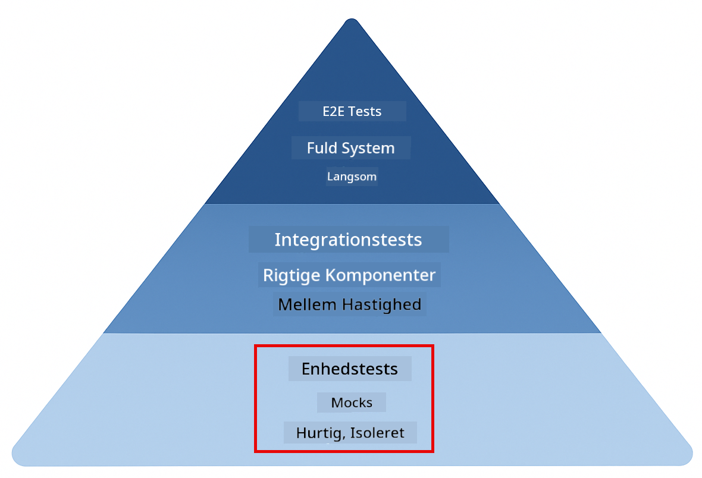
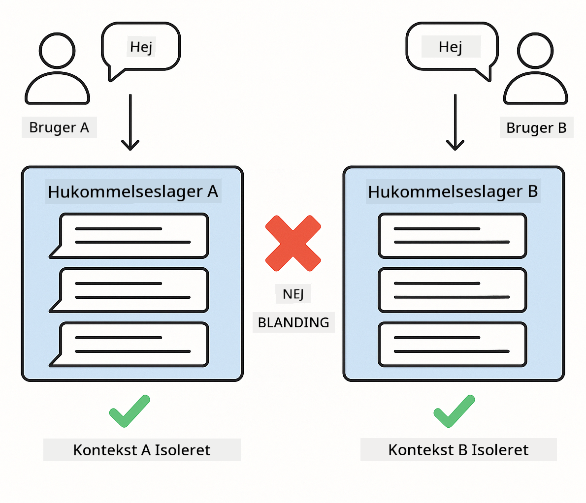
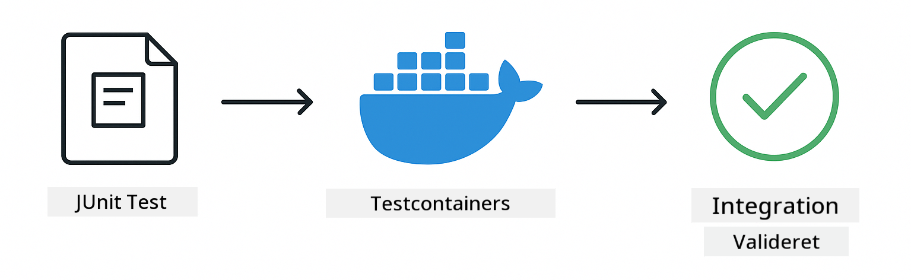

<!--
CO_OP_TRANSLATOR_METADATA:
{
  "original_hash": "b975537560c404d5f254331832811e78",
  "translation_date": "2025-12-13T21:07:07+00:00",
  "source_file": "docs/TESTING.md",
  "language_code": "da"
}
-->
# Test af LangChain4j-applikationer

## Indholdsfortegnelse

- [Kom godt i gang](../../../docs)
- [Hvad testene dækker](../../../docs)
- [Kørsel af testene](../../../docs)
- [Kørsel af tests i VS Code](../../../docs)
- [Testmønstre](../../../docs)
- [Testfilosofi](../../../docs)
- [Næste skridt](../../../docs)

Denne vejledning guider dig gennem testene, der demonstrerer, hvordan man tester AI-applikationer uden at kræve API-nøgler eller eksterne tjenester.

## Kom godt i gang

Kør alle test med en enkelt kommando:

**Bash:**
```bash
mvn test
```

**PowerShell:**
```powershell
mvn --% test
```


*Succesfuld testkørsel, der viser alle tests bestået uden fejl*

## Hvad testene dækker

Dette kursus fokuserer på **unittest**, der kører lokalt. Hver test demonstrerer et specifikt LangChain4j-koncept isoleret.



*Testpyramide, der viser balancen mellem unittest (hurtige, isolerede), integrationstest (rigtige komponenter) og end-to-end tests (fuldt system med Docker). Denne træning dækker unittest.*

| Modul | Tests | Fokus | Nøglefiler |
|--------|-------|-------|-----------|
| **00 - Kom godt i gang** | 6 | Promptskabeloner og variabelsubstitution | `SimpleQuickStartTest.java` |
| **01 - Introduktion** | 8 | Samtalehukommelse og tilstandsstyret chat | `SimpleConversationTest.java` |
| **02 - Prompt Engineering** | 12 | GPT-5 mønstre, iver-niveauer, struktureret output | `SimpleGpt5PromptTest.java` |
| **03 - RAG** | 10 | Dokumentindtagelse, embeddings, lighedssøgning | `DocumentServiceTest.java` |
| **04 - Værktøjer** | 12 | Funktionskald og værktøjskæder | `SimpleToolsTest.java` |
| **05 - MCP** | 15 | Model Context Protocol med Docker | `SimpleMcpTest.java`, `McpDockerTransportTest.java` |

## Kørsel af testene

**Kør alle tests fra roden:**

**Bash:**
```bash
mvn test
```

**PowerShell:**
```powershell
mvn --% test
```

**Kør tests for et specifikt modul:**

**Bash:**
```bash
cd 01-introduction && mvn test
# Eller fra rod
mvn test -pl 01-introduction
```

**PowerShell:**
```powershell
cd 01-introduction; mvn --% test
# Eller fra rod
mvn --% test -pl 01-introduction
```

**Kør en enkelt testklasse:**

**Bash:**
```bash
mvn test -Dtest=SimpleConversationTest
```

**PowerShell:**
```powershell
mvn --% test -Dtest=SimpleConversationTest
```

**Kør en specifik testmetode:**

**Bash:**
```bash
mvn test -Dtest=SimpleConversationTest#skalBevareSamtaleHistorik
```

**PowerShell:**
```powershell
mvn --% test -Dtest=SimpleConversationTest#skalBevareSamtaleHistorik
```

## Kørsel af tests i VS Code

Hvis du bruger Visual Studio Code, giver Test Explorer en grafisk grænseflade til at køre og debugge tests.


*VS Code Test Explorer, der viser testtræet med alle Java testklasser og individuelle testmetoder*

**For at køre tests i VS Code:**

1. Åbn Test Explorer ved at klikke på bægerikonet i aktivitetslinjen
2. Udvid testtræet for at se alle moduler og testklasser
3. Klik på afspilningsknappen ved siden af en test for at køre den individuelt
4. Klik på "Run All Tests" for at køre hele suiten
5. Højreklik på en test og vælg "Debug Test" for at sætte breakpoints og steppe gennem koden

Test Explorer viser grønne flueben for beståede tests og giver detaljerede fejlmeddelelser, når tests fejler.

## Testmønstre


*Seks testmønstre for LangChain4j-applikationer: promptskabeloner, mocking af modeller, samtaleisolation, værktøjstest, in-memory RAG og Docker-integration*

### Mønster 1: Test af promptskabeloner

Det simpleste mønster tester promptskabeloner uden at kalde nogen AI-model. Du verificerer, at variabelsubstitution fungerer korrekt, og at prompts er formateret som forventet.


*Test af promptskabeloner, der viser flowet for variabelsubstitution: skabelon med pladsholdere → værdier anvendt → formateret output verificeret*

```java
@Test
@DisplayName("Should format prompt template with variables")
void testPromptTemplateFormatting() {
    PromptTemplate template = PromptTemplate.from(
        "Best time to visit {{destination}} for {{activity}}?"
    );
    
    Prompt prompt = template.apply(Map.of(
        "destination", "Paris",
        "activity", "sightseeing"
    ));
    
    assertThat(prompt.text()).isEqualTo("Best time to visit Paris for sightseeing?");
}
```

Denne test findes i `00-quick-start/src/test/java/com/example/langchain4j/quickstart/SimpleQuickStartTest.java`.

**Kør den:**

**Bash:**
```bash
cd 00-quick-start && mvn test -Dtest=SimpleQuickStartTest#testPromptTemplateFormatering
```

**PowerShell:**
```powershell
cd 00-quick-start; mvn --% test -Dtest=SimpleQuickStartTest#testPromptTemplateFormatering
```

### Mønster 2: Mocking af sprogmodeller

Når du tester samtalelogik, brug Mockito til at skabe falske modeller, der returnerer forudbestemte svar. Det gør testene hurtige, gratis og deterministiske.


*Sammenligning, der viser hvorfor mocks foretrækkes til test: de er hurtige, gratis, deterministiske og kræver ingen API-nøgler*

```java
@ExtendWith(MockitoExtension.class)
class SimpleConversationTest {
    
    private ConversationService conversationService;
    
    @Mock
    private OpenAiOfficialChatModel mockChatModel;
    
    @BeforeEach
    void setUp() {
        ChatResponse mockResponse = ChatResponse.builder()
            .aiMessage(AiMessage.from("This is a test response"))
            .build();
        when(mockChatModel.chat(anyList())).thenReturn(mockResponse);
        
        conversationService = new ConversationService(mockChatModel);
    }
    
    @Test
    void shouldMaintainConversationHistory() {
        String conversationId = conversationService.startConversation();
        
        ChatResponse mockResponse1 = ChatResponse.builder()
            .aiMessage(AiMessage.from("Response 1"))
            .build();
        ChatResponse mockResponse2 = ChatResponse.builder()
            .aiMessage(AiMessage.from("Response 2"))
            .build();
        ChatResponse mockResponse3 = ChatResponse.builder()
            .aiMessage(AiMessage.from("Response 3"))
            .build();
        
        when(mockChatModel.chat(anyList()))
            .thenReturn(mockResponse1)
            .thenReturn(mockResponse2)
            .thenReturn(mockResponse3);

        conversationService.chat(conversationId, "First message");
        conversationService.chat(conversationId, "Second message");
        conversationService.chat(conversationId, "Third message");

        List<ChatMessage> history = conversationService.getHistory(conversationId);
        assertThat(history).hasSize(6); // 3 bruger + 3 AI-beskeder
    }
}
```

Dette mønster findes i `01-introduction/src/test/java/com/example/langchain4j/service/SimpleConversationTest.java`. Mocken sikrer konsistent adfærd, så du kan verificere, at hukommelsesstyring fungerer korrekt.

### Mønster 3: Test af samtaleisolation

Samtalehukommelse skal holde flere brugere adskilt. Denne test verificerer, at samtaler ikke blander kontekster.



*Test af samtaleisolation, der viser separate hukommelseslagre for forskellige brugere for at forhindre kontekstblanding*

```java
@Test
void shouldIsolateConversationsByid() {
    String conv1 = conversationService.startConversation();
    String conv2 = conversationService.startConversation();
    
    ChatResponse mockResponse = ChatResponse.builder()
        .aiMessage(AiMessage.from("Response"))
        .build();
    when(mockChatModel.chat(anyList())).thenReturn(mockResponse);

    conversationService.chat(conv1, "Message for conversation 1");
    conversationService.chat(conv2, "Message for conversation 2");

    List<ChatMessage> history1 = conversationService.getHistory(conv1);
    List<ChatMessage> history2 = conversationService.getHistory(conv2);
    
    assertThat(history1).hasSize(2);
    assertThat(history2).hasSize(2);
}
```

Hver samtale opretholder sin egen uafhængige historik. I produktionssystemer er denne isolation kritisk for multi-bruger applikationer.

### Mønster 4: Test af værktøjer uafhængigt

Værktøjer er funktioner, som AI kan kalde. Test dem direkte for at sikre, at de fungerer korrekt uanset AI-beslutninger.


*Test af værktøjer uafhængigt, der viser mock-værktøjsudførelse uden AI-kald for at verificere forretningslogik*

```java
@Test
void shouldConvertCelsiusToFahrenheit() {
    TemperatureTool tempTool = new TemperatureTool();
    String result = tempTool.celsiusToFahrenheit(25.0);
    assertThat(result).containsPattern("77[.,]0°F");
}

@Test
void shouldDemonstrateToolChaining() {
    WeatherTool weatherTool = new WeatherTool();
    TemperatureTool tempTool = new TemperatureTool();

    String weatherResult = weatherTool.getCurrentWeather("Seattle");
    assertThat(weatherResult).containsPattern("\\d+°C");

    String conversionResult = tempTool.celsiusToFahrenheit(22.0);
    assertThat(conversionResult).containsPattern("71[.,]6°F");
}
```

Disse tests fra `04-tools/src/test/java/com/example/langchain4j/agents/tools/SimpleToolsTest.java` validerer værktøjslogik uden AI-indblanding. Kædeeksemplet viser, hvordan output fra ét værktøj føres som input til et andet.

### Mønster 5: In-memory RAG-test

RAG-systemer kræver traditionelt vektordatabaser og embedding-tjenester. In-memory-mønstret lader dig teste hele pipeline uden eksterne afhængigheder.


*In-memory RAG-testworkflow, der viser dokumentparsing, embedding-lagring og lighedssøgning uden behov for en database*

```java
@Test
void testProcessTextDocument() {
    String content = "This is a test document.\nIt has multiple lines.";
    InputStream inputStream = new ByteArrayInputStream(content.getBytes(StandardCharsets.UTF_8));
    
    DocumentService.ProcessedDocument result = 
        documentService.processDocument(inputStream, "test.txt");

    assertNotNull(result);
    assertTrue(result.segments().size() > 0);
    assertEquals("test.txt", result.segments().get(0).metadata().getString("filename"));
}
```

Denne test fra `03-rag/src/test/java/com/example/langchain4j/rag/service/DocumentServiceTest.java` opretter et dokument i hukommelsen og verificerer chunking og metadatahåndtering.

### Mønster 6: Integrationstest med Docker

Nogle funktioner kræver rigtig infrastruktur. MCP-modulet bruger Testcontainers til at starte Docker-containere til integrationstest. Disse validerer, at din kode fungerer med faktiske tjenester, samtidig med at testisolation opretholdes.



*MCP integrationstest med Testcontainers, der viser automatiseret containerlivscyklus: start, testkørsel, stop og oprydning*

Testene i `05-mcp/src/test/java/com/example/langchain4j/mcp/McpDockerTransportTest.java` kræver, at Docker kører.

**Kør dem:**

**Bash:**
```bash
cd 05-mcp && mvn test
```

**PowerShell:**
```powershell
cd 05-mcp; mvn --% test
```

## Testfilosofi

Test din kode, ikke AI'en. Dine tests skal validere den kode, du skriver, ved at kontrollere, hvordan prompts konstrueres, hvordan hukommelse håndteres, og hvordan værktøjer udføres. AI-svar varierer og bør ikke være en del af testpåstande. Spørg dig selv, om din promptskabelon korrekt substituerer variabler, ikke om AI'en giver det rigtige svar.

Brug mocks til sprogmodeller. De er eksterne afhængigheder, der er langsomme, dyre og ikke-deterministiske. Mocking gør testene hurtige med millisekunder i stedet for sekunder, gratis uden API-omkostninger og deterministiske med samme resultat hver gang.

Hold testene uafhængige. Hver test skal opsætte sine egne data, ikke være afhængig af andre tests, og rydde op efter sig selv. Tests skal bestå uanset kørselsrækkefølge.

Test kanttilfælde ud over den glade sti. Prøv tomme input, meget store input, specialtegn, ugyldige parametre og grænsetilfælde. Disse afslører ofte fejl, som normal brug ikke viser.

Brug beskrivende navne. Sammenlign `shouldMaintainConversationHistoryAcrossMultipleMessages()` med `test1()`. Det første fortæller dig præcis, hvad der testes, hvilket gør fejlfinding meget nemmere.

## Næste skridt

Nu hvor du forstår testmønstrene, kan du dykke dybere ned i hvert modul:

- **[00 - Kom godt i gang](../00-quick-start/README.md)** - Start med promptskabelonbasics
- **[01 - Introduktion](../01-introduction/README.md)** - Lær samtalehukommelsesstyring
- **[02 - Prompt Engineering](../02-prompt-engineering/README.md)** - Mestre GPT-5 promptmønstre
- **[03 - RAG](../03-rag/README.md)** - Byg retrieval-augmented generation systemer
- **[04 - Værktøjer](../04-tools/README.md)** - Implementer funktionskald og værktøjskæder
- **[05 - MCP](../05-mcp/README.md)** - Integrer Model Context Protocol med Docker

Hvert moduls README giver detaljerede forklaringer af de koncepter, der testes her.

---

**Navigation:** [← Tilbage til hoved](../README.md)

---

<!-- CO-OP TRANSLATOR DISCLAIMER START -->
**Ansvarsfraskrivelse**:
Dette dokument er blevet oversat ved hjælp af AI-oversættelsestjenesten [Co-op Translator](https://github.com/Azure/co-op-translator). Selvom vi bestræber os på nøjagtighed, bedes du være opmærksom på, at automatiserede oversættelser kan indeholde fejl eller unøjagtigheder. Det oprindelige dokument på dets modersmål bør betragtes som den autoritative kilde. For kritisk information anbefales professionel menneskelig oversættelse. Vi påtager os intet ansvar for misforståelser eller fejltolkninger, der opstår som følge af brugen af denne oversættelse.
<!-- CO-OP TRANSLATOR DISCLAIMER END -->