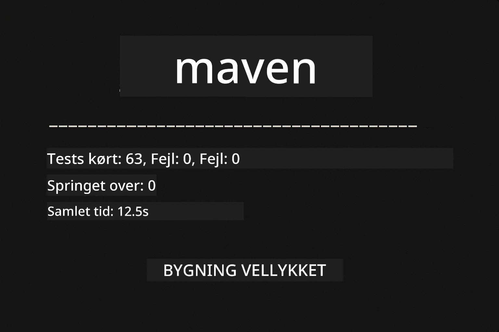
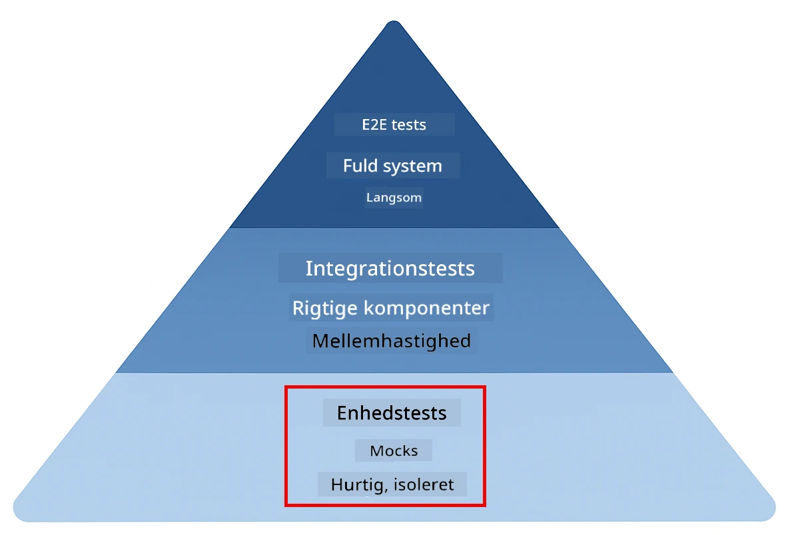
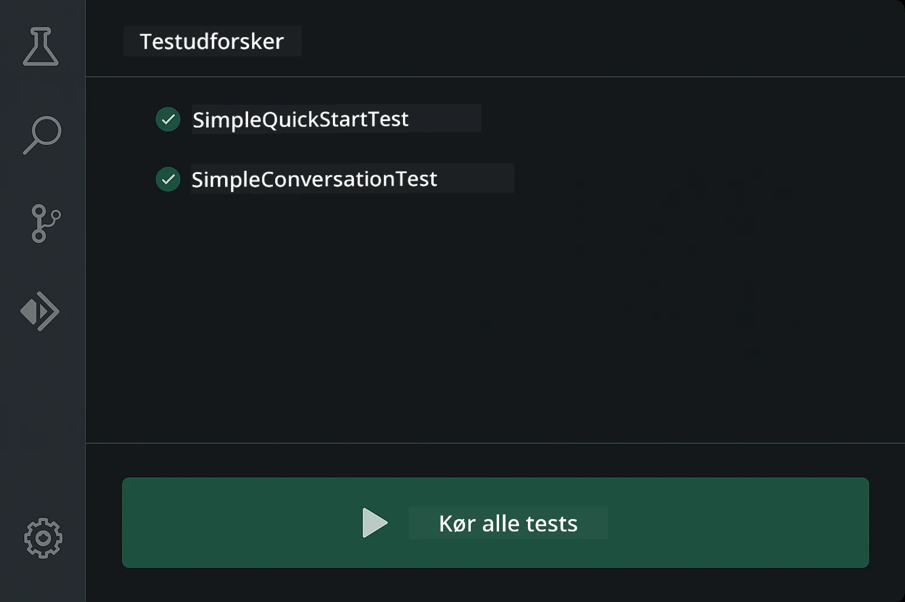
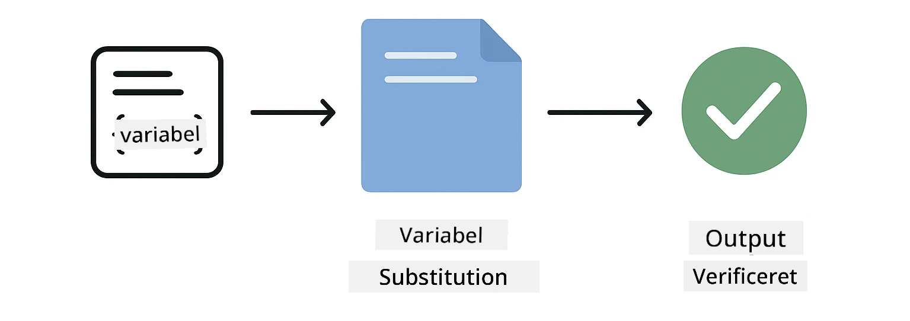
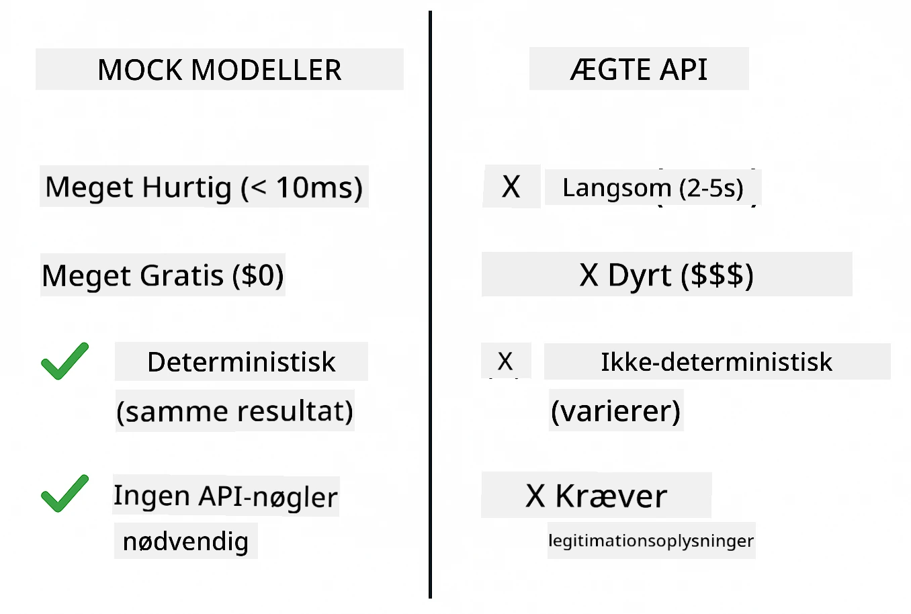
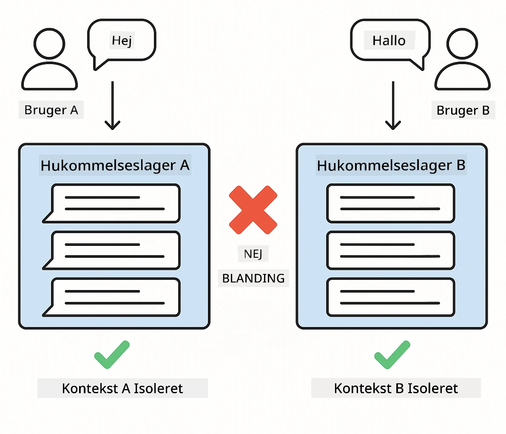
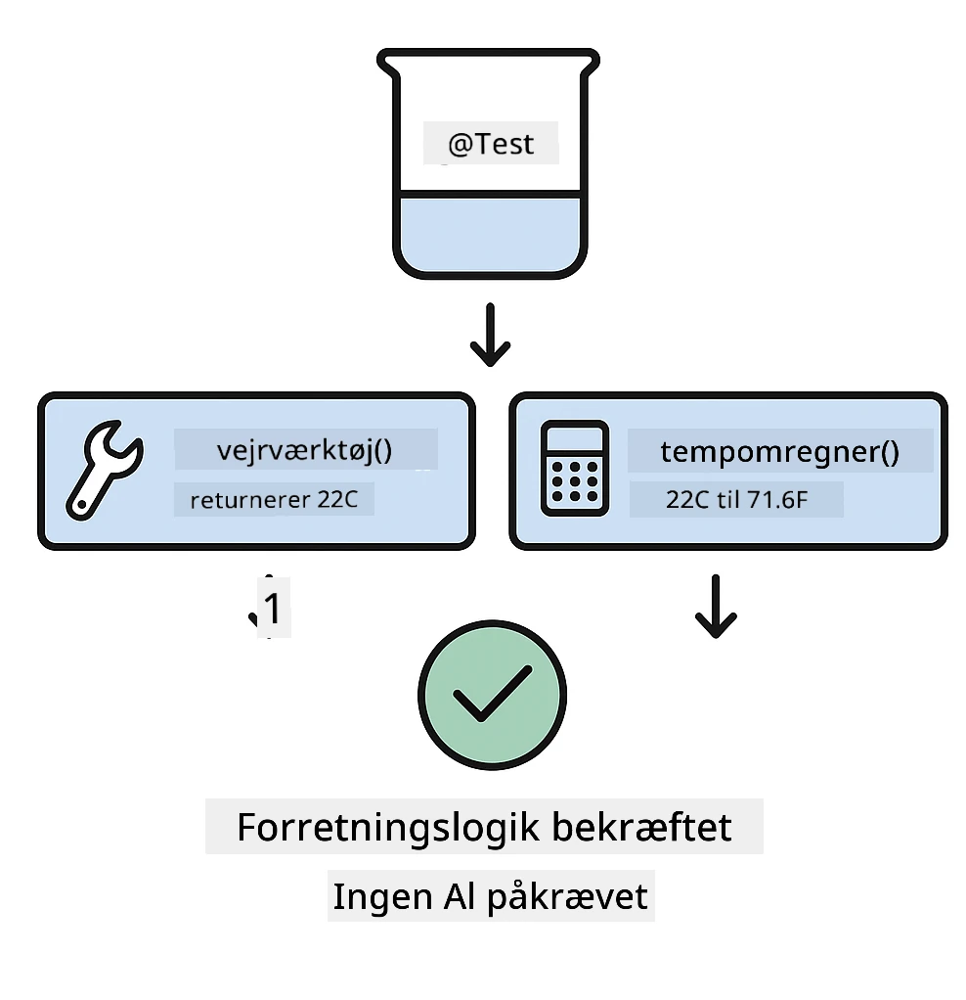
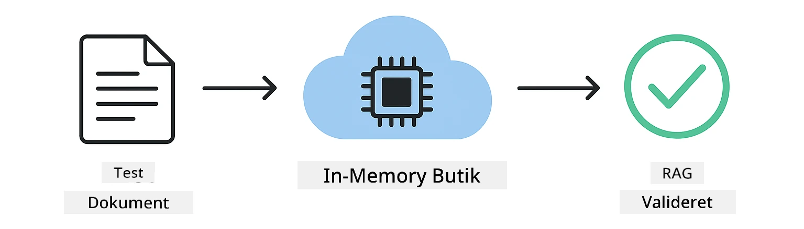

# Test af LangChain4j-applikationer

## Indholdsfortegnelse

- [Kom godt i gang](#kom-godt-i-gang)
- [Hvad testene dækker](#hvad-testene-dækker)
- [Kørsel af testene](#kørsel-af-testene)
- [Kørsel af tests i VS Code](#kørsel-af-tests-i-vs-code)
- [Testmønstre](#testmønstre)
- [Testfilosofi](#testfilosofi)
- [Næste skridt](#næste-skridt)

Denne vejledning guider dig igennem de tests, der viser, hvordan man tester AI-applikationer uden at skulle bruge API-nøgler eller eksterne tjenester.

## Kom godt i gang

Kør alle test med en enkelt kommando:

**Bash:**
```bash
mvn test
```

**PowerShell:**
```powershell
mvn --% test
```

Når alle tests er bestået, skulle du se output som skærmbilledet herunder — test kørt uden fejl.



*Succesfuld testkørsel, der viser alle tests bestået uden fejl*

## Hvad testene dækker

Dette kursus fokuserer på **unittest**, der køres lokalt. Hver test demonstrerer et specifikt LangChain4j-koncept isoleret. Testpyramiden nedenfor viser, hvor unittest passer ind — de udgør det hurtige, pålidelige fundament, som resten af din teststrategi bygger på.



*Testpyramide, der viser balancen mellem unittest (hurtige, isolerede), integrationstests (reelle komponenter) og end-to-end tests. Denne træning dækker unittest.*

| Modul | Tests | Fokus | Vigtige filer |
|--------|-------|-------|-----------|
| **01 - Introduktion** | 8 | Samtalehukommelse og tilstandsbaseret chat | `SimpleConversationTest.java` |
| **02 - Prompt Engineering** | 12 | GPT-5.2 mønstre, ivrighedsniveauer, struktureret output | `SimpleGpt5PromptTest.java` |
| **03 - RAG** | 10 | Dokumentindtagelse, embedding, lighedssøgning | `DocumentServiceTest.java` |
| **04 - Værktøjer** | 12 | Funktionsopkald og kædning af værktøjer | `SimpleToolsTest.java` |
| **05 - MCP** | 8 | Model Context Protocol med Stdio-transport | `SimpleMcpTest.java` |

## Kørsel af testene

**Kør alle tests fra rodmappen:**

**Bash:**
```bash
mvn test
```

**PowerShell:**
```powershell
mvn --% test
```

**Kør tests for et specifikt modul:**

**Bash:**
```bash
cd 01-introduction && mvn test
# Eller fra rod
mvn test -pl 01-introduction
```

**PowerShell:**
```powershell
cd 01-introduction; mvn --% test
# Eller fra rod
mvn --% test -pl 01-introduction
```

**Kør en enkelt testklasse:**

**Bash:**
```bash
mvn test -Dtest=SimpleConversationTest
```

**PowerShell:**
```powershell
mvn --% test -Dtest=SimpleConversationTest
```

**Kør en specifik testmetode:**

**Bash:**
```bash
mvn test -Dtest=SimpleConversationTest#børBevareSamtaleHistorik
```

**PowerShell:**
```powershell
mvn --% test -Dtest=SimpleConversationTest#skalBevareSamtalehistorik
```

## Kørsel af tests i VS Code

Hvis du bruger Visual Studio Code, giver Test Explorer en grafisk brugerflade til at køre og debugge tests.



*VS Code Test Explorer, der viser testtræet med alle Java testklasser og individuelle testmetoder*

**For at køre tests i VS Code:**

1. Åbn Test Explorer ved at klikke på kolbeikonet i aktivitetsbjælken
2. Udvid testtræet for at se alle moduler og testklasser
3. Klik på afspilningsknappen ved siden af en test for at køre den individuelt
4. Klik på "Run All Tests" for at køre hele pakken
5. Højreklik på en test og vælg "Debug Test" for at sætte breakpoints og køre trinvis

Test Explorer viser grønne flueben for beståede tests og giver detaljerede fejlmeddelelser ved fejl.

## Testmønstre

### Mønster 1: Test af promptskabeloner

Det simpleste mønster tester promptskabeloner uden at kalde nogen AI-model. Du verificerer, at variabeludskiftning fungerer korrekt, og at prompts er formateret som forventet.



*Test af promptskabeloner, der viser variabelsubstitutionsflow: skabelon med pladsholdere → værdier anvendt → formateret output verificeret*

```java
@Test
@DisplayName("Should format prompt template with variables")
void testPromptTemplateFormatting() {
    PromptTemplate template = PromptTemplate.from(
        "Best time to visit {{destination}} for {{activity}}?"
    );
    
    Prompt prompt = template.apply(Map.of(
        "destination", "Paris",
        "activity", "sightseeing"
    ));
    
    assertThat(prompt.text()).isEqualTo("Best time to visit Paris for sightseeing?");
}
```

Dette mønster bekræfter, at variabeludskiftning fungerer korrekt, og at prompts er formateret som forventet — uden brug af API-nøgle eller modelkald.

### Mønster 2: Mocking af sprogmodeller

Når du tester samtalelogik, brug Mockito til at skabe falske modeller, der returnerer forudbestemte svar. Det gør testene hurtige, gratis og deterministiske.



*Sammenligning, der viser hvorfor mocks foretrækkes til test: de er hurtige, gratis, deterministiske og kræver ingen API-nøgler*

```java
@ExtendWith(MockitoExtension.class)
class SimpleConversationTest {
    
    private ConversationService conversationService;
    
    @Mock
    private OpenAiOfficialChatModel mockChatModel;
    
    @BeforeEach
    void setUp() {
        ChatResponse mockResponse = ChatResponse.builder()
            .aiMessage(AiMessage.from("This is a test response"))
            .build();
        when(mockChatModel.chat(anyList())).thenReturn(mockResponse);
        
        conversationService = new ConversationService(mockChatModel);
    }
    
    @Test
    void shouldMaintainConversationHistory() {
        String conversationId = conversationService.startConversation();
        
        ChatResponse mockResponse1 = ChatResponse.builder()
            .aiMessage(AiMessage.from("Response 1"))
            .build();
        ChatResponse mockResponse2 = ChatResponse.builder()
            .aiMessage(AiMessage.from("Response 2"))
            .build();
        ChatResponse mockResponse3 = ChatResponse.builder()
            .aiMessage(AiMessage.from("Response 3"))
            .build();
        
        when(mockChatModel.chat(anyList()))
            .thenReturn(mockResponse1)
            .thenReturn(mockResponse2)
            .thenReturn(mockResponse3);

        conversationService.chat(conversationId, "First message");
        conversationService.chat(conversationId, "Second message");
        conversationService.chat(conversationId, "Third message");

        List<ChatMessage> history = conversationService.getHistory(conversationId);
        assertThat(history).hasSize(6); // 3 bruger + 3 AI beskeder
    }
}
```

Dette mønster findes i `01-introduction/src/test/java/com/example/langchain4j/service/SimpleConversationTest.java`. Mocket sikrer konsistent opførsel, så du kan verificere, at hukommelsesadministration fungerer korrekt.

### Mønster 3: Test af samtaleisolation

Samtalehukommelsen må holde flere brugere adskilt. Denne test verificerer, at samtaler ikke blander kontekster.



*Test af samtaleisolation, der viser separate hukommelseslagre for forskellige brugere for at forhindre kontekstblanding*

```java
@Test
void shouldIsolateConversationsByid() {
    String conv1 = conversationService.startConversation();
    String conv2 = conversationService.startConversation();
    
    ChatResponse mockResponse = ChatResponse.builder()
        .aiMessage(AiMessage.from("Response"))
        .build();
    when(mockChatModel.chat(anyList())).thenReturn(mockResponse);

    conversationService.chat(conv1, "Message for conversation 1");
    conversationService.chat(conv2, "Message for conversation 2");

    List<ChatMessage> history1 = conversationService.getHistory(conv1);
    List<ChatMessage> history2 = conversationService.getHistory(conv2);
    
    assertThat(history1).hasSize(2);
    assertThat(history2).hasSize(2);
}
```

Hver samtale opretholder sin egen uafhængige historik. I produktionssystemer er denne isolation afgørende for multi-bruger applikationer.

### Mønster 4: Test af værktøjer uafhængigt

Værktøjer er funktioner, som AI kan kalde. Test dem direkte for at sikre, at de fungerer korrekt uanset AI-beslutninger.



*Test af værktøjer uafhængigt, der viser mock-værktøjseksekvering uden AI-kald for at verificere forretningslogik*

```java
@Test
void shouldConvertCelsiusToFahrenheit() {
    TemperatureTool tempTool = new TemperatureTool();
    String result = tempTool.celsiusToFahrenheit(25.0);
    assertThat(result).containsPattern("77[.,]0°F");
}

@Test
void shouldDemonstrateToolChaining() {
    WeatherTool weatherTool = new WeatherTool();
    TemperatureTool tempTool = new TemperatureTool();

    String weatherResult = weatherTool.getCurrentWeather("Seattle");
    assertThat(weatherResult).containsPattern("\\d+°C");

    String conversionResult = tempTool.celsiusToFahrenheit(22.0);
    assertThat(conversionResult).containsPattern("71[.,]6°F");
}
```

Disse tests fra `04-tools/src/test/java/com/example/langchain4j/agents/tools/SimpleToolsTest.java` validerer værktøjslogik uden AI-involvering. Eksemplet med kædning viser, hvordan output fra ét værktøj føres videre som input til et andet.

### Mønster 5: In-Memory RAG test

RAG-systemer kræver traditionelt vektor-databaser og embeddingtjenester. In-memory-mønsteret lader dig teste hele pipeline uden eksterne afhængigheder.



*In-memory RAG test workflow, der viser dokumentparsing, embedding-lagring og lighedssøgning uden krav om database*

```java
@Test
void testProcessTextDocument() {
    String content = "This is a test document.\nIt has multiple lines.";
    InputStream inputStream = new ByteArrayInputStream(content.getBytes(StandardCharsets.UTF_8));
    
    DocumentService.ProcessedDocument result = 
        documentService.processDocument(inputStream, "test.txt");

    assertNotNull(result);
    assertTrue(result.segments().size() > 0);
    assertEquals("test.txt", result.segments().get(0).metadata().getString("filename"));
}
```

Denne test fra `03-rag/src/test/java/com/example/langchain4j/rag/service/DocumentServiceTest.java` opretter et dokument i hukommelsen og verificerer chunking og metadatahåndtering.

### Mønster 6: MCP Integrationstest

MCP-modulet tester Model Context Protocol-integration via stdio-transport. Disse tests verificerer, at din applikation kan starte og kommunikere med MCP-servere som underprocesser.

Testene i `05-mcp/src/test/java/com/example/langchain4j/mcp/SimpleMcpTest.java` validerer MCP-klientadfærd.

**Kør dem:**

**Bash:**
```bash
cd 05-mcp && mvn test
```

**PowerShell:**
```powershell
cd 05-mcp; mvn --% test
```

## Testfilosofi

Test din kode, ikke AI’en. Dine tests skal validere den kode, du skriver ved at undersøge, hvordan prompts konstrueres, hvordan hukommelse håndteres, og hvordan værktøjer eksekveres. AI-svar varierer og bør ikke være en del af testpåstande. Spørg dig selv, om din promptskabelon korrekt substituerer variabler, ikke om AI giver det rigtige svar.

Brug mocks til sprogmodeller. De er eksterne afhængigheder, som er langsomme, dyre og ikke-deterministiske. Mocking gør tests hurtige med millisekunder i stedet for sekunder, gratis uden API-omkostninger, og deterministiske med samme resultat hver gang.

Hold tests uafhængige. Hver test bør opsætte sine egne data, ikke være afhængig af andre tests og rydde op efter sig selv. Tests bør bestå uanset kørselsrækkefølge.

Test kanttilfælde ud over den lykkelige vej. Prøv tomme inputs, meget store inputs, specialtegn, ugyldige parametre og grænsetilstande. Disse afslører ofte fejl, som normal brug ikke udsætter.

Brug beskrivende navne. Sammenlign `shouldMaintainConversationHistoryAcrossMultipleMessages()` med `test1()`. Det første fortæller dig præcist, hvad der testes, hvilket gør fejlretning meget nemmere.

## Næste skridt

Nu hvor du forstår testmønstrene, kan du dykke dybere ned i hvert modul:

- **[01 - Introduktion](../01-introduction/README.md)** - Lær styring af samtalehukommelse
- **[02 - Prompt Engineering](../02/prompt-engineering/README.md)** - Mestre GPT-5.2 promptmønstre
- **[03 - RAG](../03-rag/README.md)** - Byg retrival-augmented generation systemer
- **[04 - Værktøjer](../04-tools/README.md)** - Implementér funktionskald og værktøjskæder
- **[05 - MCP](../05-mcp/README.md)** - Integrer Model Context Protocol

Hvert moduls README giver detaljerede forklaringer af de koncepter, der testes her.

---

**Navigation:** [← Tilbage til hoved](../README.md)

---

<!-- CO-OP TRANSLATOR DISCLAIMER START -->
**Ansvarsfraskrivelse**:
Dette dokument er blevet oversat ved hjælp af AI-oversættelsestjenesten [Co-op Translator](https://github.com/Azure/co-op-translator). Selvom vi bestræber os på nøjagtighed, skal du være opmærksom på, at automatiserede oversættelser kan indeholde fejl eller unøjagtigheder. Det originale dokument på dets oprindelige sprog bør betragtes som den autoritative kilde. For kritisk information anbefales professionel menneskelig oversættelse. Vi påtager os intet ansvar for misforståelser eller fejltolkninger, der opstår som følge af brugen af denne oversættelse.
<!-- CO-OP TRANSLATOR DISCLAIMER END -->