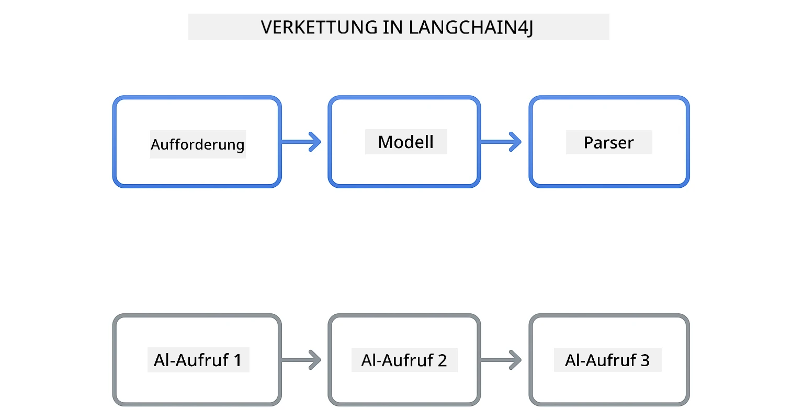
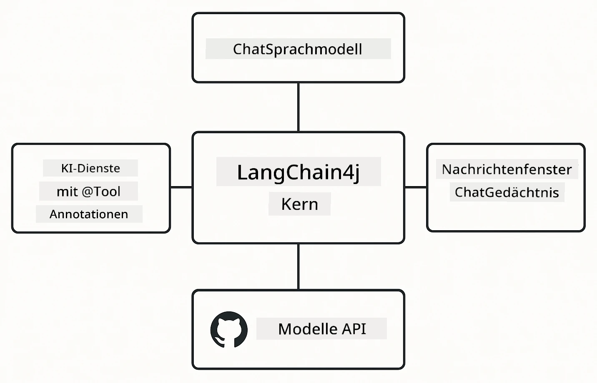

<!--
CO_OP_TRANSLATOR_METADATA:
{
  "original_hash": "22b5d7c8d7585325e38b37fd29eafe25",
  "translation_date": "2026-01-05T21:24:45+00:00",
  "source_file": "00-quick-start/README.md",
  "language_code": "de"
}
-->
# Modul 00: Schnellstart

## Inhaltsverzeichnis

- [Einführung](../../../00-quick-start)
- [Was ist LangChain4j?](../../../00-quick-start)
- [LangChain4j Abhängigkeiten](../../../00-quick-start)
- [Voraussetzungen](../../../00-quick-start)
- [Einrichtung](../../../00-quick-start)
  - [1. Holen Sie sich Ihr GitHub-Token](../../../00-quick-start)
  - [2. Setzen Sie Ihr Token](../../../00-quick-start)
- [Führen Sie die Beispiele aus](../../../00-quick-start)
  - [1. Basis-Chat](../../../00-quick-start)
  - [2. Prompt-Muster](../../../00-quick-start)
  - [3. Funktionsaufruf](../../../00-quick-start)
  - [4. Dokument Q&A (RAG)](../../../00-quick-start)
  - [5. Verantwortungsvolle KI](../../../00-quick-start)
- [Was jedes Beispiel zeigt](../../../00-quick-start)
- [Nächste Schritte](../../../00-quick-start)
- [Fehlerbehebung](../../../00-quick-start)

## Einführung

Dieser Schnellstart soll Sie so schnell wie möglich mit LangChain4j vertraut machen. Er behandelt die absoluten Grundlagen des Aufbaus von KI-Anwendungen mit LangChain4j und GitHub Models. In den nächsten Modulen werden Sie Azure OpenAI mit LangChain4j verwenden, um fortgeschrittenere Anwendungen zu erstellen.

## Was ist LangChain4j?

LangChain4j ist eine Java-Bibliothek, die das Erstellen von KI-gestützten Anwendungen vereinfacht. Anstatt sich mit HTTP-Clients und JSON-Parsing zu beschäftigen, arbeiten Sie mit sauberen Java-APIs.

Die "Kette" in LangChain bezieht sich darauf, mehrere Komponenten zu verketten – Sie verbinden zum Beispiel ein Prompt mit einem Modell und einem Parser oder verketten mehrere KI-Aufrufe, wobei eine Ausgabe als Eingabe für den nächsten Aufruf dient. Dieser Schnellstart konzentriert sich auf die Grundlagen, bevor komplexere Ketten erkundet werden.



*Kettenglieder in LangChain4j – Bausteine verbinden sich zur Erstellung leistungsfähiger KI-Workflows*

Wir verwenden drei Kernkomponenten:

**ChatLanguageModel** – Das Interface für KI-Modell-Interaktionen. Rufen Sie `model.chat("prompt")` auf und erhalten Sie eine Antwort als String. Wir verwenden `OpenAiOfficialChatModel`, das mit OpenAI-kompatiblen Endpunkten wie GitHub Models funktioniert.

**AiServices** – Erstellt typsichere KI-Service-Interfaces. Definieren Sie Methoden, annotieren Sie diese mit `@Tool`, und LangChain4j übernimmt die Orchestrierung. Die KI ruft automatisch Ihre Java-Methoden auf, wenn erforderlich.

**MessageWindowChatMemory** – Pflegt den Gesprächsverlauf. Ohne dieses hat jede Anfrage keinen Zusammenhang. Mit ihm erinnert sich die KI an vorherige Nachrichten und hält den Kontext über mehrere Fragen hinweg.



*LangChain4j-Architektur – Kernkomponenten arbeiten zusammen, um Ihre KI-Anwendungen zu ermöglichen*

## LangChain4j Abhängigkeiten

Dieser Schnellstart verwendet zwei Maven-Abhängigkeiten in der [`pom.xml`](../../../00-quick-start/pom.xml):

```xml
<!-- Core LangChain4j library -->
<dependency>
    <groupId>dev.langchain4j</groupId>
    <artifactId>langchain4j</artifactId> <!-- Inherited from BOM in root pom.xml -->
</dependency>

<!-- OpenAI integration (works with GitHub Models) -->
<dependency>
    <groupId>dev.langchain4j</groupId>
    <artifactId>langchain4j-open-ai-official</artifactId> <!-- Inherited from BOM in root pom.xml -->
</dependency>
```

Das Modul `langchain4j-open-ai-official` stellt die Klasse `OpenAiOfficialChatModel` bereit, die eine Verbindung zu OpenAI-kompatiblen APIs herstellt. GitHub Models verwendet dasselbe API-Format, daher ist kein spezieller Adapter nötig – geben Sie einfach die Basis-URL `https://models.github.ai/inference` an.

## Voraussetzungen

**Verwenden Sie den Dev Container?** Java und Maven sind bereits installiert. Sie benötigen nur ein persönliches Zugriffstoken von GitHub.

**Lokale Entwicklung:**
- Java 21+, Maven 3.9+
- Persönliches GitHub-Zugriffstoken (Anleitung unten)

> **Hinweis:** Dieses Modul verwendet `gpt-4.1-nano` von GitHub Models. Ändern Sie den Modellnamen im Code nicht – er ist für die mit GitHub verfügbaren Modelle konfiguriert.

## Einrichtung

### 1. Holen Sie sich Ihr GitHub-Token

1. Gehen Sie zu [GitHub Einstellungen → Personal Access Tokens](https://github.com/settings/personal-access-tokens)
2. Klicken Sie auf „Generate new token“
3. Setzen Sie einen aussagekräftigen Namen (z. B. „LangChain4j Demo“)
4. Wählen Sie eine Ablaufzeit (7 Tage empfohlen)
5. Unter „Account permissions“ suchen Sie „Models“ und setzen Sie auf „Read-only“
6. Klicken Sie auf „Generate token“
7. Kopieren Sie den Token und speichern Sie ihn – Sie sehen ihn danach nicht wieder

### 2. Setzen Sie Ihr Token

**Option 1: Verwendung von VS Code (empfohlen)**

Wenn Sie VS Code verwenden, fügen Sie Ihren Token der `.env`-Datei im Projektstammverzeichnis hinzu:

Falls die `.env`-Datei nicht existiert, kopieren Sie `.env.example` zu `.env` oder erstellen Sie eine neue `.env`-Datei im Projektstamm.

**Beispiel `.env`-Datei:**
```bash
# In /workspaces/LangChain4j-for-Beginners/.env
GITHUB_TOKEN=your_token_here
```

Dann können Sie einfach im Explorer mit der rechten Maustaste auf eine beliebige Demo-Datei (z. B. `BasicChatDemo.java`) klicken und **„Run Java“** auswählen oder die Startkonfigurationen im Lauf- und Debug-Panel nutzen.

**Option 2: Verwendung des Terminals**

Setzen Sie das Token als Umgebungsvariable:

**Bash:**
```bash
export GITHUB_TOKEN=your_token_here
```

**PowerShell:**
```powershell
$env:GITHUB_TOKEN=your_token_here
```

## Führen Sie die Beispiele aus

**Mit VS Code:** Klicken Sie einfach mit der rechten Maustaste auf eine Demo-Datei im Explorer und wählen Sie **„Run Java“** oder nutzen Sie die Startkonfigurationen im Lauf- und Debug-Panel (stellen Sie sicher, dass Sie Ihr Token vorher in der `.env`-Datei gesetzt haben).

**Mit Maven:** Alternativ können Sie es über die Kommandozeile ausführen:

### 1. Basis-Chat

**Bash:**
```bash
mvn compile exec:java -Dexec.mainClass=com.example.langchain4j.quickstart.BasicChatDemo
```

**PowerShell:**
```powershell
mvn --% compile exec:java -Dexec.mainClass=com.example.langchain4j.quickstart.BasicChatDemo
```

### 2. Prompt-Muster

**Bash:**
```bash
mvn compile exec:java -Dexec.mainClass=com.example.langchain4j.quickstart.PromptEngineeringDemo
```

**PowerShell:**
```powershell
mvn --% compile exec:java -Dexec.mainClass=com.example.langchain4j.quickstart.PromptEngineeringDemo
```

Zeigt Zero-Shot-, Few-Shot-, Chain-of-Thought- und rollenbasierte Prompts.

### 3. Funktionsaufruf

**Bash:**
```bash
mvn compile exec:java -Dexec.mainClass=com.example.langchain4j.quickstart.ToolIntegrationDemo
```

**PowerShell:**
```powershell
mvn --% compile exec:java -Dexec.mainClass=com.example.langchain4j.quickstart.ToolIntegrationDemo
```

Die KI ruft automatisch Ihre Java-Methoden auf, wenn es nötig ist.

### 4. Dokument Q&A (RAG)

**Bash:**
```bash
mvn compile exec:java -Dexec.mainClass=com.example.langchain4j.quickstart.SimpleReaderDemo
```

**PowerShell:**
```powershell
mvn --% compile exec:java -Dexec.mainClass=com.example.langchain4j.quickstart.SimpleReaderDemo
```

Stellen Sie Fragen zum Inhalt von `document.txt`.

### 5. Verantwortungsvolle KI

**Bash:**
```bash
mvn compile exec:java -Dexec.mainClass=com.example.langchain4j.quickstart.ResponsibleAIDemo
```

**PowerShell:**
```powershell
mvn --% compile exec:java -Dexec.mainClass=com.example.langchain4j.quickstart.ResponsibleAIDemo
```

Sehen Sie, wie KI-Sicherheitsfilter schädliche Inhalte blockieren.

## Was jedes Beispiel zeigt

**Basis-Chat** - [BasicChatDemo.java](../../../00-quick-start/src/main/java/com/example/langchain4j/quickstart/BasicChatDemo.java)

Starten Sie hier, um LangChain4j in seiner einfachsten Form zu sehen. Sie erstellen ein `OpenAiOfficialChatModel`, senden einen Prompt mit `.chat()` und erhalten eine Antwort. Dies zeigt die Grundlage: wie man Modelle mit benutzerdefinierten Endpunkten und API-Schlüsseln initialisiert. Sobald Sie dieses Muster verstehen, baut alles andere darauf auf.

```java
ChatLanguageModel model = OpenAiOfficialChatModel.builder()
    .baseUrl("https://models.github.ai/inference")
    .apiKey(System.getenv("GITHUB_TOKEN"))
    .modelName("gpt-4.1-nano")
    .build();

String response = model.chat("What is LangChain4j?");
System.out.println(response);
```

> **🤖 Probieren Sie es mit [GitHub Copilot](https://github.com/features/copilot) Chat:** Öffnen Sie [`BasicChatDemo.java`](../../../00-quick-start/src/main/java/com/example/langchain4j/quickstart/BasicChatDemo.java) und fragen Sie:
> - „Wie wechsle ich in diesem Code von GitHub Models zu Azure OpenAI?“
> - „Welche weiteren Parameter kann ich in OpenAiOfficialChatModel.builder() konfigurieren?“
> - „Wie füge ich Streaming-Antworten hinzu, anstatt auf die vollständige Antwort zu warten?“

**Prompt Engineering** - [PromptEngineeringDemo.java](../../../00-quick-start/src/main/java/com/example/langchain4j/quickstart/PromptEngineeringDemo.java)

Jetzt, da Sie wissen, wie man mit einem Modell spricht, untersuchen wir, was Sie ihm sagen. Diese Demo verwendet dieselbe Modellausrichtung, zeigt aber vier verschiedene Prompt-Muster. Probieren Sie Zero-Shot-Prompts für direkte Anweisungen, Few-Shot-Prompts für das Lernen aus Beispielen, Chain-of-Thought-Prompts für den Einblick in den Denkprozess und rollenbasierte Prompts, die den Kontext setzen. Sie werden sehen, wie dasselbe Modell dramatisch unterschiedliche Ergebnisse liefert, abhängig davon, wie Sie Ihre Anfrage formulieren.

```java
PromptTemplate template = PromptTemplate.from(
    "What's the best time to visit {{destination}} for {{activity}}?"
);

Prompt prompt = template.apply(Map.of(
    "destination", "Paris",
    "activity", "sightseeing"
));

String response = model.chat(prompt.text());
```

> **🤖 Probieren Sie es mit [GitHub Copilot](https://github.com/features/copilot) Chat:** Öffnen Sie [`PromptEngineeringDemo.java`](../../../00-quick-start/src/main/java/com/example/langchain4j/quickstart/PromptEngineeringDemo.java) und fragen Sie:
> - „Was ist der Unterschied zwischen Zero-Shot- und Few-Shot-Prompting, und wann sollte ich welches verwenden?“
> - „Wie beeinflusst der Temperature-Parameter die Antworten des Modells?“
> - „Welche Techniken gibt es, um Prompt-Injection-Angriffe in der Produktion zu verhindern?“
> - „Wie kann ich wiederverwendbare PromptTemplate-Objekte für gängige Muster erstellen?“

**Tool-Integration** - [ToolIntegrationDemo.java](../../../00-quick-start/src/main/java/com/example/langchain4j/quickstart/ToolIntegrationDemo.java)

Hier wird LangChain4j richtig mächtig. Sie verwenden `AiServices`, um einen KI-Assistenten zu erstellen, der Ihre Java-Methoden aufrufen kann. Annotieren Sie einfach Methoden mit `@Tool("Beschreibung")` und LangChain4j übernimmt den Rest – die KI entscheidet automatisch, wann sie welches Tool verwendet, basierend auf der Nutzeranfrage. Dies demonstriert Funktionsaufrufe, eine Schlüsseltechnik zum Erstellen von KI, die Aktionen ausführen und nicht nur Fragen beantworten kann.

```java
@Tool("Performs addition of two numeric values")
public double add(double a, double b) {
    return a + b;
}

MathAssistant assistant = AiServices.create(MathAssistant.class, model);
String response = assistant.chat("What is 25 plus 17?");
```

> **🤖 Probieren Sie es mit [GitHub Copilot](https://github.com/features/copilot) Chat:** Öffnen Sie [`ToolIntegrationDemo.java`](../../../00-quick-start/src/main/java/com/example/langchain4j/quickstart/ToolIntegrationDemo.java) und fragen Sie:
> - „Wie funktioniert die @Tool-Annotation und was macht LangChain4j dahinter?“
> - „Kann die KI mehrere Tools nacheinander aufrufen, um komplexe Probleme zu lösen?“
> - „Was passiert, wenn ein Tool eine Ausnahme wirft – wie sollte ich Fehler behandeln?“
> - „Wie integriere ich eine echte API anstelle dieses Taschenrechner-Beispiels?“

**Dokument Q&A (RAG)** - [SimpleReaderDemo.java](../../../00-quick-start/src/main/java/com/example/langchain4j/quickstart/SimpleReaderDemo.java)

Hier sehen Sie die Grundlage von RAG (retrieval-augmented generation). Anstatt sich auf die Trainingsdaten des Modells zu verlassen, laden Sie Inhalte aus [`document.txt`](../../../00-quick-start/document.txt) und fügen diese im Prompt ein. Die KI antwortet basierend auf Ihrem Dokument und nicht auf ihrem allgemeinen Wissen. Dies ist der erste Schritt zum Aufbau von Systemen, die mit Ihren eigenen Daten arbeiten können.

```java
Document document = FileSystemDocumentLoader.loadDocument("document.txt");
String content = document.text();

String prompt = "Based on this document: " + content + 
                "\nQuestion: What is the main topic?";
String response = model.chat(prompt);
```

> **Hinweis:** Dieser einfache Ansatz lädt das gesamte Dokument in den Prompt. Bei großen Dateien (>10KB) überschreiten Sie die Kontextgrenzen. Modul 03 behandelt Chunking und Vektor-Suche für produktive RAG-Systeme.

> **🤖 Probieren Sie es mit [GitHub Copilot](https://github.com/features/copilot) Chat:** Öffnen Sie [`SimpleReaderDemo.java`](../../../00-quick-start/src/main/java/com/example/langchain4j/quickstart/SimpleReaderDemo.java) und fragen Sie:
> - „Wie verhindert RAG KI-Halluzinationen im Vergleich zur Verwendung der Trainingsdaten des Modells?“
> - „Was ist der Unterschied zwischen diesem einfachen Ansatz und der Verwendung von Vektor-Embeddings für Abrufe?“
> - „Wie skaliere ich dies, um mehrere Dokumente oder größere Wissensbasen zu verarbeiten?“
> - „Was sind bewährte Methoden zur Strukturierung des Prompts, damit die KI nur den bereitgestellten Kontext verwendet?“

**Verantwortungsvolle KI** - [ResponsibleAIDemo.java](../../../00-quick-start/src/main/java/com/example/langchain4j/quickstart/ResponsibleAIDemo.java)

Bauen Sie KI-Sicherheit mit „Defense in Depth“ auf. Diese Demo zeigt zwei Schutzschichten, die zusammenarbeiten:

**Teil 1: LangChain4j Input Guardrails** – Blockieren gefährlicher Eingabeaufforderungen, bevor sie das LLM erreichen. Erstellen Sie benutzerdefinierte Schutzregeln, die nach verbotenen Schlüsselwörtern oder Mustern suchen. Diese laufen in Ihrem Code, sind also schnell und kostenlos.

```java
class DangerousContentGuardrail implements InputGuardrail {
    @Override
    public InputGuardrailResult validate(UserMessage userMessage) {
        String text = userMessage.singleText().toLowerCase();
        if (text.contains("explosives")) {
            return fatal("Blocked: contains prohibited keyword");
        }
        return success();
    }
}
```

**Teil 2: Sicherheitsfilter des Anbieters** – GitHub Models hat eingebaute Filter, die das abfangen, was Ihre Guardrails eventuell übersehen. Sie sehen harte Blockaden (HTTP 400 Fehler) bei schweren Verstößen und weiche Ablehnungen, bei denen die KI höflich ablehnt.

> **🤖 Probieren Sie es mit [GitHub Copilot](https://github.com/features/copilot) Chat:** Öffnen Sie [`ResponsibleAIDemo.java`](../../../00-quick-start/src/main/java/com/example/langchain4j/quickstart/ResponsibleAIDemo.java) und fragen Sie:
> - „Was ist InputGuardrail und wie erstelle ich eigene?“
> - „Was ist der Unterschied zwischen einer harten Blockade und einer weichen Ablehnung?“
> - „Warum sollten Guardrails und Anbieterfilter zusammen verwendet werden?“

## Nächste Schritte

**Nächstes Modul:** [01-introduction - Erste Schritte mit LangChain4j und gpt-5 auf Azure](../01-introduction/README.md)

---

**Navigation:** [← Zurück zur Hauptseite](../README.md) | [Weiter: Modul 01 - Einführung →](../01-introduction/README.md)

---

## Fehlerbehebung

### Erstmaliger Maven Build

**Problem:** Erster `mvn clean compile` oder `mvn package` dauert lange (10-15 Minuten)

**Ursache:** Maven muss bei der ersten Ausführung alle Projektabhängigkeiten herunterladen (Spring Boot, LangChain4j-Bibliotheken, Azure SDKs usw.).

**Lösung:** Das ist normales Verhalten. Nachfolgende Builds sind deutlich schneller, da die Abhängigkeiten lokal zwischengespeichert werden. Die Downloadzeit hängt von Ihrer Netzwerkgeschwindigkeit ab.

### PowerShell Maven-Befehlsyntax

**Problem:** Maven-Befehle schlagen mit dem Fehler `Unknown lifecycle phase ".mainClass=..."` fehl

**Ursache:** PowerShell interpretiert `=` als Zuweisungsoperator und bricht dadurch die Maven-Property-Syntax ab.
**Lösung**: Verwenden Sie den Stop-Parsing-Operator `--%` vor dem Maven-Befehl:

**PowerShell:**
```powershell
mvn --% compile exec:java -Dexec.mainClass=com.example.langchain4j.quickstart.BasicChatDemo
```

**Bash:**
```bash
mvn compile exec:java -Dexec.mainClass=com.example.langchain4j.quickstart.BasicChatDemo
```

Der Operator `--%` weist PowerShell an, alle verbleibenden Argumente unverändert an Maven weiterzugeben, ohne sie zu interpretieren.

### Windows PowerShell Emoji-Anzeige

**Problem**: KI-Antworten zeigen statt Emojis in PowerShell unleserliche Zeichen (z. B. `????` oder `â??`) an

**Ursache**: Die Standardcodierung von PowerShell unterstützt keine UTF-8-Emojis

**Lösung**: Führen Sie diesen Befehl aus, bevor Sie Java-Anwendungen starten:
```cmd
chcp 65001
```

Dies erzwingt UTF-8-Codierung im Terminal. Alternativ können Sie Windows Terminal verwenden, das eine bessere Unicode-Unterstützung bietet.

### Debugging von API-Aufrufen

**Problem**: Authentifizierungsfehler, Ratenbegrenzungen oder unerwartete Antworten vom KI-Modell

**Lösung**: Die Beispiele enthalten `.logRequests(true)` und `.logResponses(true)`, um API-Aufrufe in der Konsole anzuzeigen. Dies hilft, Authentifizierungsfehler, Ratenbegrenzungen oder unerwartete Antworten zu diagnostizieren. Entfernen Sie diese Flags in der Produktion, um die Protokollierung zu reduzieren.

---

<!-- CO-OP TRANSLATOR DISCLAIMER START -->
**Haftungsausschluss**:  
Dieses Dokument wurde mithilfe des KI-Übersetzungsdienstes [Co-op Translator](https://github.com/Azure/co-op-translator) übersetzt. Obwohl wir um Genauigkeit bemüht sind, beachten Sie bitte, dass maschinelle Übersetzungen Fehler oder Ungenauigkeiten enthalten können. Das Originaldokument in seiner Ausgangssprache ist als maßgebliche Quelle zu betrachten. Für wichtige Informationen wird eine professionelle menschliche Übersetzung empfohlen. Wir übernehmen keine Haftung für Missverständnisse oder Fehlinterpretationen, die durch die Nutzung dieser Übersetzung entstehen.
<!-- CO-OP TRANSLATOR DISCLAIMER END -->