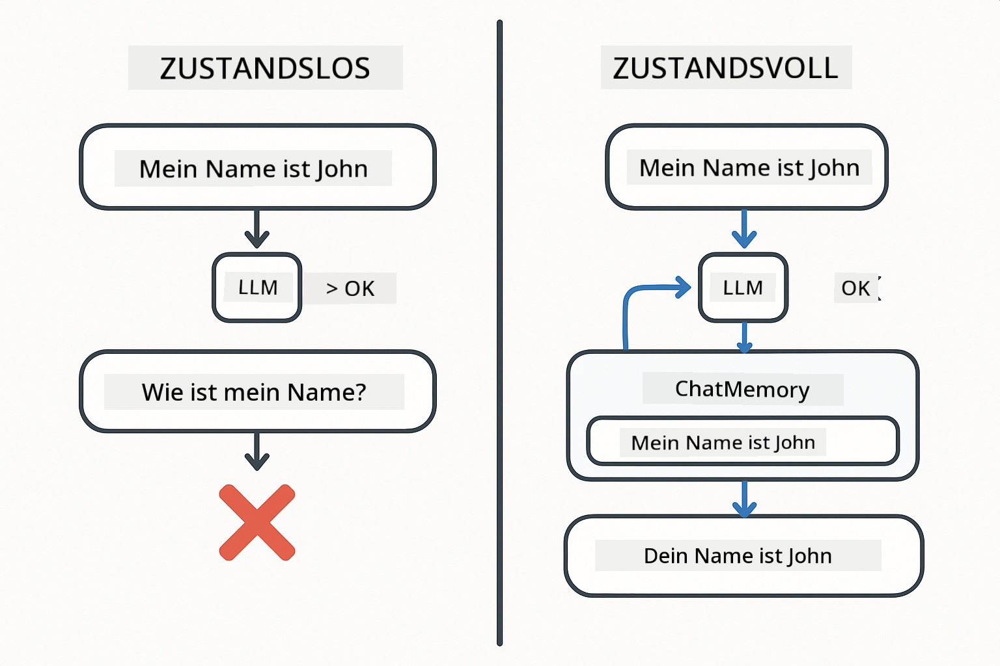
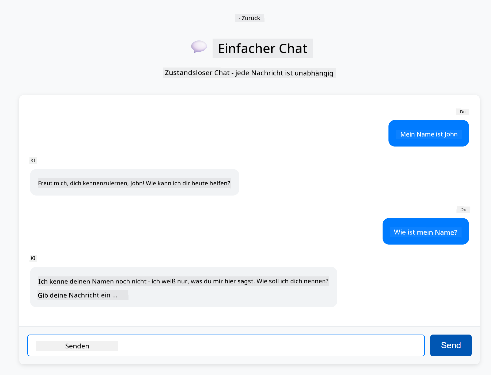
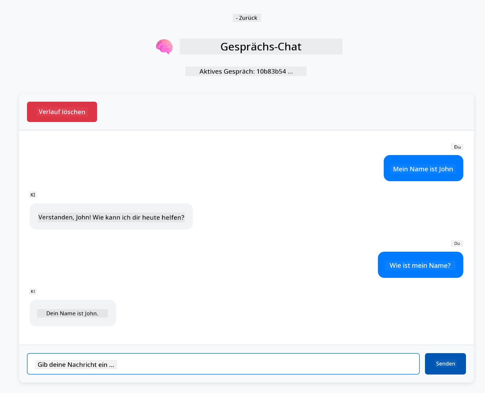

<!--
CO_OP_TRANSLATOR_METADATA:
{
  "original_hash": "c3e07ca58d0b8a3f47d3bf5728541e0a",
  "translation_date": "2025-12-13T13:03:03+00:00",
  "source_file": "01-introduction/README.md",
  "language_code": "de"
}
-->
# Modul 01: Einstieg mit LangChain4j

## Inhaltsverzeichnis

- [Was Sie lernen werden](../../../01-introduction)
- [Voraussetzungen](../../../01-introduction)
- [Das Kernproblem verstehen](../../../01-introduction)
- [Tokens verstehen](../../../01-introduction)
- [Wie Speicher funktioniert](../../../01-introduction)
- [Wie dies LangChain4j verwendet](../../../01-introduction)
- [Azure OpenAI Infrastruktur bereitstellen](../../../01-introduction)
- [Die Anwendung lokal ausführen](../../../01-introduction)
- [Die Anwendung verwenden](../../../01-introduction)
  - [Zustandsloser Chat (linkes Panel)](../../../01-introduction)
  - [Zustandsbehafteter Chat (rechtes Panel)](../../../01-introduction)
- [Nächste Schritte](../../../01-introduction)

## Was Sie lernen werden

Wenn Sie den Schnellstart abgeschlossen haben, haben Sie gesehen, wie man Eingabeaufforderungen sendet und Antworten erhält. Das ist die Grundlage, aber echte Anwendungen benötigen mehr. Dieses Modul zeigt Ihnen, wie Sie konversationelle KI bauen, die sich an den Kontext erinnert und den Zustand beibehält – der Unterschied zwischen einer einmaligen Demo und einer produktionsreifen Anwendung.

Wir verwenden im gesamten Leitfaden Azure OpenAI's GPT-5, da seine fortgeschrittenen Fähigkeiten im logischen Denken das Verhalten verschiedener Muster deutlicher machen. Wenn Sie Speicher hinzufügen, sehen Sie den Unterschied klar. Das erleichtert das Verständnis, was jede Komponente Ihrer Anwendung bringt.

Sie bauen eine Anwendung, die beide Muster demonstriert:

**Zustandsloser Chat** – Jede Anfrage ist unabhängig. Das Modell hat kein Gedächtnis an vorherige Nachrichten. Dies ist das Muster, das Sie im Schnellstart verwendet haben.

**Zustandsbehaftete Konversation** – Jede Anfrage enthält den Gesprächsverlauf. Das Modell behält den Kontext über mehrere Gesprächsrunden hinweg. Das ist, was Produktionsanwendungen benötigen.

## Voraussetzungen

- Azure-Abonnement mit Zugriff auf Azure OpenAI
- Java 21, Maven 3.9+
- Azure CLI (https://learn.microsoft.com/en-us/cli/azure/install-azure-cli)
- Azure Developer CLI (azd) (https://learn.microsoft.com/en-us/azure/developer/azure-developer-cli/install-azd)

> **Hinweis:** Java, Maven, Azure CLI und Azure Developer CLI (azd) sind im bereitgestellten Devcontainer vorinstalliert.

> **Hinweis:** Dieses Modul verwendet GPT-5 auf Azure OpenAI. Die Bereitstellung wird automatisch über `azd up` konfiguriert – ändern Sie den Modellnamen im Code nicht.

## Das Kernproblem verstehen

Sprachmodelle sind zustandslos. Jeder API-Aufruf ist unabhängig. Wenn Sie "Mein Name ist John" senden und dann fragen "Wie heißt du?", hat das Modell keine Ahnung, dass Sie sich gerade vorgestellt haben. Es behandelt jede Anfrage, als wäre es das erste Gespräch, das Sie je geführt haben.

Das ist für einfache Fragen und Antworten in Ordnung, aber für echte Anwendungen nutzlos. Kundenservice-Bots müssen sich merken, was Sie ihnen gesagt haben. Persönliche Assistenten brauchen Kontext. Jede mehrstufige Konversation erfordert Speicher.



*Der Unterschied zwischen zustandslosen (unabhängigen Aufrufen) und zustandsbehafteten (kontextbewussten) Konversationen*

## Tokens verstehen

Bevor wir in Konversationen eintauchen, ist es wichtig, Tokens zu verstehen – die Grundeinheiten des Textes, die Sprachmodelle verarbeiten:


*Beispiel, wie Text in Tokens zerlegt wird – "I love AI!" wird zu 4 separaten Verarbeitungseinheiten*

Tokens sind die Maßeinheit, mit der KI-Modelle Text messen und verarbeiten. Wörter, Satzzeichen und sogar Leerzeichen können Tokens sein. Ihr Modell hat eine Grenze, wie viele Tokens es gleichzeitig verarbeiten kann (400.000 für GPT-5, mit bis zu 272.000 Eingabe-Tokens und 128.000 Ausgabe-Tokens). Das Verständnis von Tokens hilft Ihnen, die Länge der Konversation und die Kosten zu steuern.

## Wie Speicher funktioniert

Chat-Speicher löst das Problem der Zustandslosigkeit, indem er den Gesprächsverlauf beibehält. Bevor Ihre Anfrage an das Modell gesendet wird, fügt das Framework relevante vorherige Nachrichten hinzu. Wenn Sie fragen "Wie heißt du?", sendet das System tatsächlich den gesamten Gesprächsverlauf, sodass das Modell sieht, dass Sie zuvor "Mein Name ist John" gesagt haben.

LangChain4j bietet Speicherimplementierungen, die dies automatisch handhaben. Sie wählen, wie viele Nachrichten behalten werden sollen, und das Framework verwaltet das Kontextfenster.


*MessageWindowChatMemory hält ein gleitendes Fenster der letzten Nachrichten und entfernt automatisch alte*

## Wie dies LangChain4j verwendet

Dieses Modul erweitert den Schnellstart, indem es Spring Boot integriert und Gesprächsspeicher hinzufügt. So fügen sich die Teile zusammen:

**Abhängigkeiten** – Fügen Sie zwei LangChain4j-Bibliotheken hinzu:

```xml
<dependency>
    <groupId>dev.langchain4j</groupId>
    <artifactId>langchain4j</artifactId> <!-- Inherited from BOM in root pom.xml -->
</dependency>
<dependency>
    <groupId>dev.langchain4j</groupId>
    <artifactId>langchain4j-open-ai-official</artifactId> <!-- Inherited from BOM in root pom.xml -->
</dependency>
```

**Chat-Modell** – Konfigurieren Sie Azure OpenAI als Spring-Bean ([LangChainConfig.java](../../../01-introduction/src/main/java/com/example/langchain4j/config/LangChainConfig.java)):

```java
@Bean
public OpenAiOfficialChatModel openAiOfficialChatModel() {
    return OpenAiOfficialChatModel.builder()
            .baseUrl(azureEndpoint)
            .apiKey(azureApiKey)
            .modelName(deploymentName)
            .timeout(Duration.ofMinutes(5))
            .maxRetries(3)
            .build();
}
```

Der Builder liest Anmeldeinformationen aus Umgebungsvariablen, die von `azd up` gesetzt werden. Das Setzen von `baseUrl` auf Ihren Azure-Endpunkt lässt den OpenAI-Client mit Azure OpenAI arbeiten.

**Gesprächsspeicher** – Verfolgen Sie den Chat-Verlauf mit MessageWindowChatMemory ([ConversationService.java](../../../01-introduction/src/main/java/com/example/langchain4j/service/ConversationService.java)):

```java
ChatMemory memory = MessageWindowChatMemory.withMaxMessages(10);

memory.add(UserMessage.from("My name is John"));
memory.add(AiMessage.from("Nice to meet you, John!"));

memory.add(UserMessage.from("What's my name?"));
AiMessage aiMessage = chatModel.chat(memory.messages()).aiMessage();
memory.add(aiMessage);
```

Erstellen Sie Speicher mit `withMaxMessages(10)`, um die letzten 10 Nachrichten zu behalten. Fügen Sie Benutzer- und KI-Nachrichten mit typisierten Wrappern hinzu: `UserMessage.from(text)` und `AiMessage.from(text)`. Rufen Sie den Verlauf mit `memory.messages()` ab und senden Sie ihn an das Modell. Der Service speichert separate Speicherinstanzen pro Gesprächs-ID, sodass mehrere Benutzer gleichzeitig chatten können.

> **🤖 Probieren Sie es mit [GitHub Copilot](https://github.com/features/copilot) Chat:** Öffnen Sie [`ConversationService.java`](../../../01-introduction/src/main/java/com/example/langchain4j/service/ConversationService.java) und fragen Sie:
> - "Wie entscheidet MessageWindowChatMemory, welche Nachrichten verworfen werden, wenn das Fenster voll ist?"
> - "Kann ich benutzerdefinierten Speicher mit einer Datenbank anstelle von In-Memory implementieren?"
> - "Wie würde ich eine Zusammenfassung hinzufügen, um alten Gesprächsverlauf zu komprimieren?"

Der zustandslose Chat-Endpunkt überspringt Speicher vollständig – einfach `chatModel.chat(prompt)` wie im Schnellstart. Der zustandsbehaftete Endpunkt fügt Nachrichten zum Speicher hinzu, ruft den Verlauf ab und schickt diesen Kontext mit jeder Anfrage. Gleiche Modellkonfiguration, unterschiedliche Muster.

## Azure OpenAI Infrastruktur bereitstellen

**Bash:**
```bash
cd 01-introduction
azd up  # Wählen Sie das Abonnement und den Standort (eastus2 empfohlen)
```

**PowerShell:**
```powershell
cd 01-introduction
azd up  # Wählen Sie das Abonnement und den Standort (eastus2 empfohlen)
```

> **Hinweis:** Wenn Sie einen Timeout-Fehler erhalten (`RequestConflict: Cannot modify resource ... provisioning state is not terminal`), führen Sie einfach `azd up` erneut aus. Azure-Ressourcen werden möglicherweise noch im Hintergrund bereitgestellt, und ein erneuter Versuch ermöglicht die Fertigstellung, sobald die Ressourcen einen Endzustand erreichen.

Dies wird:
1. Azure OpenAI-Ressource mit GPT-5 und text-embedding-3-small Modellen bereitstellen
2. Automatisch eine `.env`-Datei im Projektstamm mit Anmeldeinformationen generieren
3. Alle erforderlichen Umgebungsvariablen einrichten

**Probleme bei der Bereitstellung?** Siehe das [Infrastructure README](infra/README.md) für detaillierte Fehlerbehebung, einschließlich Konflikten bei Subdomain-Namen, manuellen Azure-Portal-Bereitstellungsschritten und Modellkonfigurationsanleitungen.

**Bereitstellungserfolg überprüfen:**

**Bash:**
```bash
cat ../.env  # Sollte AZURE_OPENAI_ENDPOINT, API_KEY usw. anzeigen.
```

**PowerShell:**
```powershell
Get-Content ..\.env  # Sollte AZURE_OPENAI_ENDPOINT, API_KEY usw. anzeigen.
```

> **Hinweis:** Der Befehl `azd up` generiert automatisch die `.env`-Datei. Wenn Sie diese später aktualisieren müssen, können Sie entweder die `.env`-Datei manuell bearbeiten oder sie durch Ausführen von:
>
> **Bash:**
> ```bash
> cd ..
> bash .azd-env.sh
> ```
>
> **PowerShell:**
> ```powershell
> cd ..
> .\.azd-env.ps1
> ```

## Die Anwendung lokal ausführen

**Bereitstellung überprüfen:**

Stellen Sie sicher, dass die `.env`-Datei im Stammverzeichnis mit Azure-Anmeldeinformationen vorhanden ist:

**Bash:**
```bash
cat ../.env  # Sollte AZURE_OPENAI_ENDPOINT, API_KEY, DEPLOYMENT anzeigen
```

**PowerShell:**
```powershell
Get-Content ..\.env  # Sollte AZURE_OPENAI_ENDPOINT, API_KEY, DEPLOYMENT anzeigen
```

**Starten Sie die Anwendungen:**

**Option 1: Verwendung des Spring Boot Dashboards (empfohlen für VS Code Nutzer)**

Der Devcontainer enthält die Spring Boot Dashboard-Erweiterung, die eine visuelle Oberfläche zur Verwaltung aller Spring Boot-Anwendungen bietet. Sie finden sie in der Aktivitätsleiste links in VS Code (suchen Sie nach dem Spring Boot-Symbol).

Im Spring Boot Dashboard können Sie:
- Alle verfügbaren Spring Boot-Anwendungen im Arbeitsbereich sehen
- Anwendungen mit einem Klick starten/stoppen
- Anwendungsprotokolle in Echtzeit ansehen
- Anwendungsstatus überwachen

Klicken Sie einfach auf den Play-Button neben "introduction", um dieses Modul zu starten, oder starten Sie alle Module gleichzeitig.


**Option 2: Verwendung von Shell-Skripten**

Starten Sie alle Webanwendungen (Module 01-04):

**Bash:**
```bash
cd ..  # Vom Stammverzeichnis
./start-all.sh
```

**PowerShell:**
```powershell
cd ..  # Vom Stammverzeichnis
.\start-all.ps1
```

Oder starten Sie nur dieses Modul:

**Bash:**
```bash
cd 01-introduction
./start.sh
```

**PowerShell:**
```powershell
cd 01-introduction
.\start.ps1
```

Beide Skripte laden automatisch Umgebungsvariablen aus der `.env`-Datei im Stammverzeichnis und bauen die JARs, falls sie nicht existieren.

> **Hinweis:** Wenn Sie alle Module manuell vor dem Start bauen möchten:
>
> **Bash:**
> ```bash
> cd ..  # Go to root directory
> mvn clean package -DskipTests
> ```
>
> **PowerShell:**
> ```powershell
> cd ..  # Go to root directory
> mvn clean package -DskipTests
> ```

Öffnen Sie http://localhost:8080 in Ihrem Browser.

**Zum Stoppen:**

**Bash:**
```bash
./stop.sh  # Nur dieses Modul
# Oder
cd .. && ./stop-all.sh  # Alle Module
```

**PowerShell:**
```powershell
.\stop.ps1  # Nur dieses Modul
# Oder
cd ..; .\stop-all.ps1  # Alle Module
```

## Die Anwendung verwenden

Die Anwendung bietet eine Weboberfläche mit zwei Chat-Implementierungen nebeneinander.


*Dashboard zeigt sowohl Simple Chat (zustandslos) als auch Conversational Chat (zustandsbehaftet) Optionen*

### Zustandsloser Chat (linkes Panel)

Probieren Sie dies zuerst. Fragen Sie "Mein Name ist John" und dann sofort "Wie heißt du?" Das Modell wird sich nicht erinnern, da jede Nachricht unabhängig ist. Dies zeigt das Kernproblem bei der einfachen Integration von Sprachmodellen – kein Gesprächskontext.



*Die KI erinnert sich nicht an Ihren Namen aus der vorherigen Nachricht*

### Zustandsbehafteter Chat (rechtes Panel)

Probieren Sie hier dieselbe Abfolge. Fragen Sie "Mein Name ist John" und dann "Wie heißt du?" Diesmal erinnert es sich. Der Unterschied ist MessageWindowChatMemory – es hält den Gesprächsverlauf und fügt ihn jeder Anfrage hinzu. So funktioniert produktionsreife konversationelle KI.



*Die KI erinnert sich an Ihren Namen aus dem früheren Gespräch*

Beide Panels verwenden dasselbe GPT-5-Modell. Der einzige Unterschied ist der Speicher. Das macht deutlich, was Speicher Ihrer Anwendung bringt und warum er für reale Anwendungsfälle unerlässlich ist.

## Nächste Schritte

**Nächstes Modul:** [02-prompt-engineering - Prompt Engineering mit GPT-5](../02-prompt-engineering/README.md)

---

**Navigation:** [← Vorheriges: Modul 00 - Schnellstart](../00-quick-start/README.md) | [Zurück zur Übersicht](../README.md) | [Nächstes: Modul 02 - Prompt Engineering →](../02-prompt-engineering/README.md)

---

<!-- CO-OP TRANSLATOR DISCLAIMER START -->
**Haftungsausschluss**:  
Dieses Dokument wurde mit dem KI-Übersetzungsdienst [Co-op Translator](https://github.com/Azure/co-op-translator) übersetzt. Obwohl wir uns um Genauigkeit bemühen, beachten Sie bitte, dass automatisierte Übersetzungen Fehler oder Ungenauigkeiten enthalten können. Das Originaldokument in seiner Ursprungssprache ist als maßgebliche Quelle zu betrachten. Für wichtige Informationen wird eine professionelle menschliche Übersetzung empfohlen. Wir übernehmen keine Haftung für Missverständnisse oder Fehlinterpretationen, die aus der Nutzung dieser Übersetzung entstehen.
<!-- CO-OP TRANSLATOR DISCLAIMER END -->